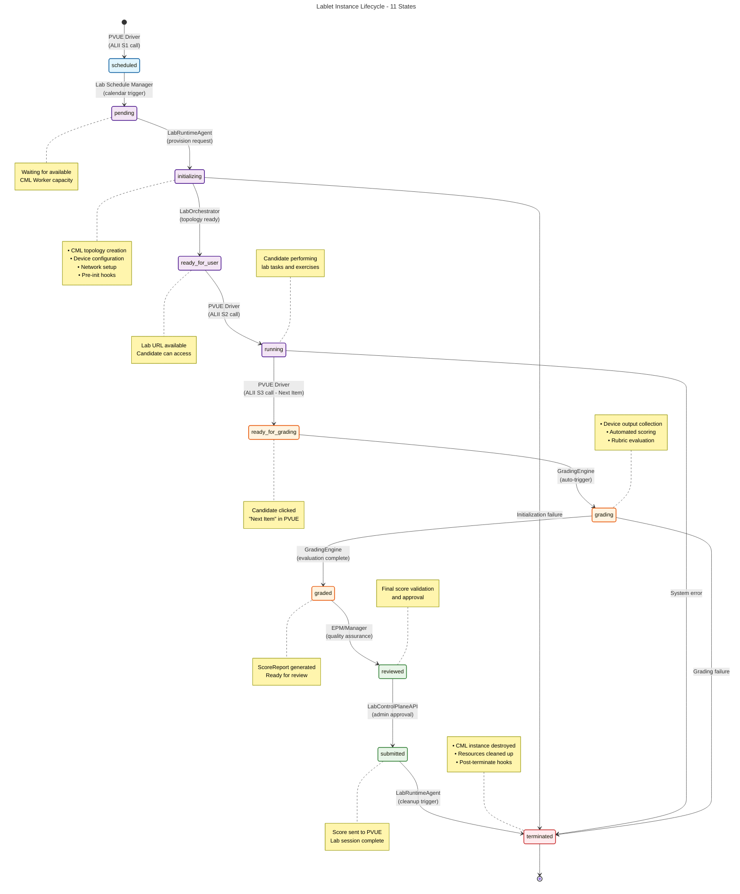

# Lablet Instance State Machine

This diagram shows the lifecycle states of a Lablet Instance from creation to termination, including the stakeholders and systems that trigger state transitions.

## Current State Implementation

## Hook Scripts Override Points

Any Lablet Definition can override the default lifecycle with custom hook scripts:

- **pre-init**: Setup tasks before initialization
- **init**: Custom initialization logic
- **post-init**: Post-initialization validation
- **pre-grade**: Pre-grading preparation
- **grade**: Custom grading logic
- **post-grade**: Post-grading cleanup
- **pre-terminate**: Pre-termination tasks
- **terminate**: Custom termination logic
- **post-terminate**: Final cleanup

## State Transition Triggers

| From State          | To State            | Trigger                           | System/Role           |
| ------------------- | ------------------- | --------------------------------- | --------------------- |
| `[*]`               | `scheduled`         | Candidate starts exam with Lablet | PVUE Driver (ALII S1) |
| `scheduled`         | `pending`           | Calendar/scheduling logic         | Lab Schedule Manager  |
| `pending`           | `initializing`      | Available capacity found          | LabRuntimeAgent       |
| `initializing`      | `ready_for_user`    | Topology and devices ready        | LabOrchestrator       |
| `ready_for_user`    | `running`           | Lab URL requested                 | PVUE Driver (ALII S2) |
| `running`           | `ready_for_grading` | Candidate clicks "Next Item"      | PVUE Driver (ALII S3) |
| `ready_for_grading` | `grading`           | Auto-trigger after S3             | GradingEngine         |
| `grading`           | `graded`            | Evaluation complete               | GradingEngine         |
| `graded`            | `reviewed`          | Quality assurance check           | EPM/Manager           |
| `reviewed`          | `submitted`         | Admin approval                    | LabControlPlaneAPI    |
| `submitted`         | `terminated`        | Cleanup trigger                   | LabRuntimeAgent       |
| `terminated`        | `[*]`               | Final cleanup complete            | System                |

## Notes

- **LabDefinition vs LabInstance**: This state machine applies to individual LabInstance objects (one per candidate per exam attempt)
- **Hook Extensibility**: EPMs can customize behavior at any transition point via hook scripts
- **Error Handling**: Failures at key stages can trigger direct transitions to `terminated` state
- **Resource Management**: States track both logical progress and physical resource allocation/cleanup
