# Stakeholder Journey - End-to-End Lablet Experience

This diagram shows the complete journey from Lablet content creation to candidate examination, highlighting all stakeholder touchpoints.

## Complete Stakeholders Journey

=== "Pre-prod/Development Journey"

    === "Content Creation"

        ```mermaid
        journey
            title Content Creation Journey - Weeks 1-4

            section Content Creation
                Design Lab Topology          : 5 : EPM
                Create Lab Instructions       : 5 : EPM
                Build Grading Rubrics        : 4 : EPM, SME
                Review Content Quality       : 3 : Manager
                Approve for Testing          : 4 : Manager
        ```

    === "Platform Development"

        ```mermaid
        journey
            title Platform Development Journey - Weeks 6-8

            section Platform Development
                Deploy Test Environment      : 3 : Technical Teams
                Configure CML Images         : 4 : Technical Teams
                Integrate with perl-LDS      : 3 : Technical Teams
                Setup Monitoring             : 4 : Technical Teams
                Validate PVUE Integration    : 3 : Technical Teams, Manager
        ```

    === "Quality Assurance"

        ```mermaid
        journey
            title Quality Assurance Journey - Weeks 9-11

            section Quality Assurance
                Internal Lab Testing         : 4 : EPM, SME
                Field Testing Program        : 3 : External Reviewers
                Performance Validation       : 4 : Technical Teams
                Security Review              : 3 : Security Team
                Final Content Approval       : 5 : Manager
        ```

    === "Production Release"

        ```mermaid
        journey
            title Production Release Journey - Week 12

            section Production Release
                Content Assembly             : 4 : Technical Teams
                Production Deployment        : 3 : Technical Teams
                PVUE Integration Testing     : 3 : PVUE Teams
                Go-Live Readiness           : 4 : Manager, Technical Teams
                Monitor Live Operations      : 4 : Operations Team
        ```

=== "Prod/Operations Journey"

    === "Candidate Experience"

        ```mermaid
        journey
            title Lablet Customer and Stakeholders Journey - From Content Release to Certification

            section Candidate Experience
                Schedule Exam                : 5 : Candidate
                Start Exam Session          : 4 : Candidate
                Lab Initialization          : 2 : PVUE Driver, System
                Access Lab Environment       : 5 : Candidate
                Perform Lab Tasks           : 3 : Candidate
                Submit for Grading          : 4 : Candidate
                Receive Score & Feedback    : 5 : Candidate
                Complete Certification      : 5 : Candidate

        ```

    === "Continuous Improvement"

        ```mermaid
        journey
            title Lablet Customer and Stakeholders Journey - From Content Release to Certification

            section Continuous Improvement
                Analyze Performance Data     : 4 : Operations, EPM
                Collect Candidate Feedback   : 3 : EPM, Manager
                Identify Improvement Areas   : 4 : Manager, EPM
                Plan Content Updates         : 4 : EPM
                Schedule Next Release        : 5 : Manager
        ```

## Detailed Stakeholder Flow

```mermaid
flowchart TD
    %% Content Creation Phase
    subgraph CC ["Content Creation - Weeks 1-4"]
        direction TB
        EPM_Start[EPM: Start New Lablet<br/>Project]
        SME_Collaborate[SME: Provide Technical<br/>Expertise & Review]
        EPM_Design[EPM: Design CML Topology<br/>in CML Dev Environment]
        EPM_Content[EPM: Create Lab Instructions<br/>& Tasks in Mosaic]
        EPM_Grading[EPM: Build Grading Rubrics<br/>& Verification Scripts]

        EPM_Start --> EPM_Design
        EPM_Design --> EPM_Content
        EPM_Content --> EPM_Grading
        EPM_Design -.-> SME_Collaborate
        EPM_Content -.-> SME_Collaborate
        EPM_Grading -.-> SME_Collaborate
    end

    %% Review & Approval Phase
    subgraph RA ["Review & Approval - Week 5"]
        direction TB
        Manager_Review[Manager: Content Quality<br/>Review & Standards Check]
        Manager_Approve[Manager: Approve for<br/>Development Pipeline]

        Manager_Review --> Manager_Approve
    end

    %% Platform Development Phase
    subgraph PD ["Platform Development - Weeks 6-8"]
        direction TB
        Tech_Deploy[Technical Teams:<br/>Deploy to Test Environment]
        Tech_Config[Technical Teams:<br/>Configure CML Images & Network]
        Tech_Integrate[Technical Teams:<br/>Integrate with perl-LDS/RCU]
        Tech_Monitor[Technical Teams:<br/>Setup Monitoring & Logging]

        Tech_Deploy --> Tech_Config
        Tech_Config --> Tech_Integrate
        Tech_Integrate --> Tech_Monitor
    end

    %% Quality Assurance Phase
    subgraph QA ["Quality Assurance - Weeks 9-11"]
        direction TB
        EPM_Test[EPM + SME:<br/>Internal Lab Testing]
        External_Test[External Reviewers:<br/>Field Testing Program]
        Tech_Validate[Technical Teams:<br/>Performance & Security Validation]
        Manager_Final[Manager:<br/>Final Approval for Production]

        EPM_Test --> External_Test
        External_Test --> Tech_Validate
        Tech_Validate --> Manager_Final
    end

    %% Production Release Phase
    subgraph PR ["Production Release - Week 12"]
        direction TB
        Tech_Assembly[Technical Teams:<br/>Content Assembly & Packaging]
        Tech_Prod[Technical Teams:<br/>Production Deployment]
        PVUE_Teams[PVUE Teams:<br/>Integration Testing & Validation]
        Ops_Monitor[Operations Team:<br/>Live Monitoring Setup]

        Tech_Assembly --> Tech_Prod
        Tech_Prod --> PVUE_Teams
        PVUE_Teams --> Ops_Monitor
    end

    %% Candidate Experience Phase
    subgraph CE ["Candidate Experience - Exam Day"]
        direction TB
        Candidate_Schedule[Candidate:<br/>Schedule Exam via PVUE]
        Candidate_Start[Candidate:<br/>Start Exam Session]
        System_Init[System:<br/>Lab Initialization<br/>ALII S1 + S2]
        Candidate_Lab[Candidate:<br/>Access Lab Environment<br/>Perform Tasks]
        Candidate_Submit[Candidate:<br/>Submit Lab for Grading<br/>ALII S3]
        System_Grade[System:<br/>Automated Grading<br/>& Score Generation]
        Candidate_Result[Candidate:<br/>Receive Score & Feedback]

        Candidate_Schedule --> Candidate_Start
        Candidate_Start --> System_Init
        System_Init --> Candidate_Lab
        Candidate_Lab --> Candidate_Submit
        Candidate_Submit --> System_Grade
        System_Grade --> Candidate_Result
    end

    %% Continuous Improvement Phase
    subgraph CI ["Continuous Improvement - Ongoing"]
        direction TB
        Ops_Analyze[Operations + EPM:<br/>Analyze Performance Data]
        EPM_Feedback[EPM:<br/>Collect Candidate Feedback]
        Manager_Improve[Manager + EPM:<br/>Identify Improvement Areas]
        EPM_Update[EPM:<br/>Plan Content Updates]

        Ops_Analyze --> EPM_Feedback
        EPM_Feedback --> Manager_Improve
        Manager_Improve --> EPM_Update
        EPM_Update -.-> EPM_Start
    end

    %% Flow connections
    EPM_Grading --> Manager_Review
    Manager_Approve --> Tech_Deploy
    Tech_Monitor --> EPM_Test
    Manager_Final --> Tech_Assembly
    Ops_Monitor --> Candidate_Schedule
    Candidate_Result --> Ops_Analyze

    %% Styling
    classDef epmActivity fill:#e3f2fd,stroke:#1565c0,stroke-width:2px
    classDef managerActivity fill:#fce4ec,stroke:#c2185b,stroke-width:2px
    classDef techActivity fill:#f3e5f5,stroke:#7b1fa2,stroke-width:2px
    classDef candidateActivity fill:#e8f5e8,stroke:#388e3c,stroke-width:2px
    classDef systemActivity fill:#fff3e0,stroke:#ef6c00,stroke-width:2px
    classDef opsActivity fill:#f1f8e9,stroke:#689f38,stroke-width:2px
    classDef smeActivity fill:#fffde7,stroke:#f57f17,stroke-width:2px

    class EPM_Start,EPM_Design,EPM_Content,EPM_Grading,EPM_Test,EPM_Feedback,EPM_Update epmActivity
    class Manager_Review,Manager_Approve,Manager_Final,Manager_Improve managerActivity
    class Tech_Deploy,Tech_Config,Tech_Integrate,Tech_Monitor,Tech_Validate,Tech_Assembly,Tech_Prod techActivity
    class Candidate_Schedule,Candidate_Start,Candidate_Lab,Candidate_Submit,Candidate_Result candidateActivity
    class System_Init,System_Grade systemActivity
    class Ops_Monitor,Ops_Analyze opsActivity
    class SME_Collaborate,External_Test smeActivity
```



## Stakeholder Responsibilities & Pain Points

### EPM (Exam Program Manager)

**Responsibilities:**

- Design lab topologies and learning objectives
- Create comprehensive lab instructions and tasks
- Build grading rubrics and verification criteria
- Collaborate with SMEs for technical accuracy
- Analyze candidate performance and feedback

**Pain Points:**

- Complex CML topology creation learning curve
- Time-intensive content development process
- Balancing technical depth with accessibility
- Coordinating with multiple technical dependencies

### Manager (Certification Program Manager)

**Responsibilities:**

- Ensure content quality and standards compliance
- Approve content for development pipeline
- Drive program-level consistency across tracks
- Final approval for production releases
- Strategic improvement planning

**Pain Points:**

- Balancing quality vs delivery timeline pressure
- Coordinating across multiple EPM teams
- Ensuring consistent candidate experience
- Managing stakeholder expectations

### Technical Teams

**Responsibilities:**

- Deploy and maintain test/production environments
- Configure CML images and networking
- Integrate with perl-LDS, RCU, and PVUE systems
- Performance and security validation
- Production deployment and monitoring

**Pain Points:**

- Complex multi-system integration challenges
- Legacy system constraints (perl-LDS, SVN)
- Resource capacity planning and scaling
- 24/7 operational support requirements

### Candidate (Certification Seeker)

**Responsibilities:**

- Schedule and prepare for certification exams
- Navigate lab environment and complete tasks
- Submit work for automated grading
- Provide feedback on lab experience

**Pain Points:**

- Lab initialization delays and technical issues
- Unfamiliar lab interface learning curve
- Time pressure during exam sessions
- Limited feedback on performance improvement

### SME (Subject Matter Expert)

**Responsibilities:**

- Provide technical expertise for content accuracy
- Review lab scenarios for real-world relevance
- Validate grading rubrics and scoring criteria
- Participate in field testing programs

**Pain Points:**

- Limited availability for review cycles
- Balancing theoretical vs practical scenarios
- Keeping content current with technology changes
- Coordinating with multiple EPM projects

## Success Metrics by Stakeholder

| Stakeholder         | Key Success Metrics            | Target Values                    |
| ------------------- | ------------------------------ | -------------------------------- |
| **EPM**             | Content development cycle time | < 4 weeks per lablet             |
| **EPM**             | Candidate satisfaction scores  | > 85% positive                   |
| **Manager**         | On-time delivery rate          | > 95% of milestones              |
| **Manager**         | Content quality scores         | > 90% pass validation            |
| **Technical Teams** | System availability            | > 99.5% during exams             |
| **Technical Teams** | Lab initialization time        | < 5 minutes average              |
| **Candidate**       | Exam completion rate           | > 90% technical success          |
| **Candidate**       | Scoring accuracy               | < 2% variance from manual review |
| **Operations**      | Support ticket volume          | < 5% of total sessions           |
| **Operations**      | Mean time to resolution        | < 30 minutes for P1 issues       |

## Communication & Collaboration Patterns

### Regular Touchpoints

- Coordinating with multiple EPM projects

## Communication & Collaboration Patterns

### Regular Touchpoints

- **Weekly EPM Sync**: Content development progress and blockers
- **Bi-weekly Technical Review**: Platform status and integration issues
- **Monthly Manager Review**: Program status and strategic alignment
- **Quarterly Business Review**: Performance metrics and improvement planning

### Escalation Pathways

- **Technical Issues**: Technical Teams → Operations → Manager
- **Content Quality**: EPM → Manager → Program Leadership
- **Timeline Risks**: Any Stakeholder → Manager → Executive Sponsor
- **Candidate Experience**: Operations → EPM → Manager

This stakeholder journey ensures comprehensive coverage of all touchpoints while maintaining clear accountability and communication pathways throughout the entire Lablet lifecycle.
