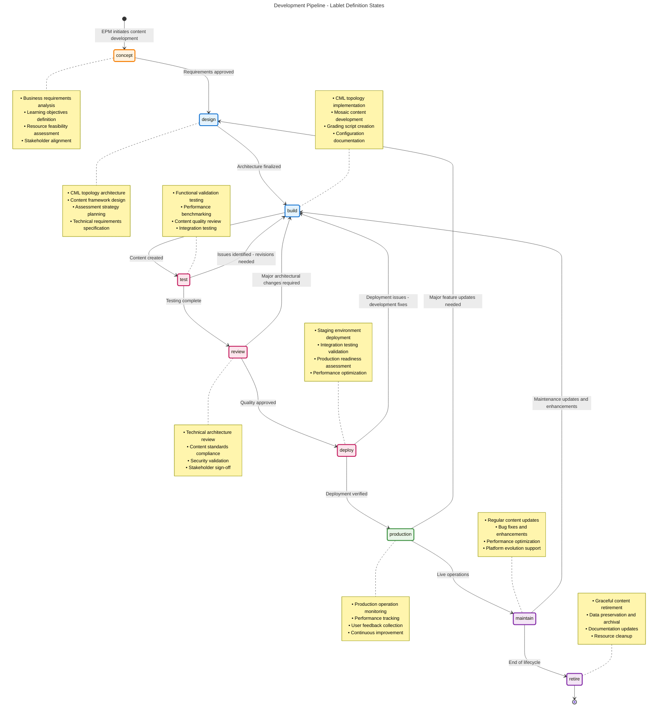
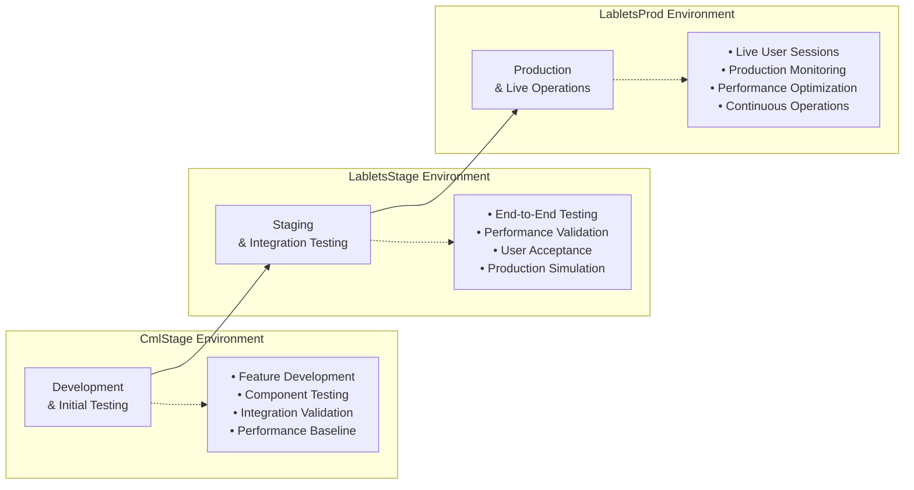

---
tags:
  - development
  - pipeline
  - lablet
  - epm
  - technical
  - lifecycle
  - definition
  - documentation
---

# Development Pipeline: Lablet Definition Lifecycle

- **Document Type:** Development Pipeline Documentation
- **Target Audience:** Exam Project Managers (EPMs), Content Developers, Technical Teams
- **Purpose:** Comprehensive guide to lablet definition development from concept to production
- **Version:** 2.0
- **Last Updated:** October 1, 2025

## Overview

The Development Pipeline manages the complete lifecycle of Lablet Definitions, focusing on content creation, validation, and deployment processes. This pipeline is primarily driven by Exam Project Managers (EPMs) who oversee the development of high-quality, scalable lab experiences for certification candidates.

## Development Pipeline Architecture

### Eight-Phase Development Lifecycle

The Development Pipeline follows a structured eight-phase approach that ensures quality, consistency, and operational readiness:



## Detailed Phase Documentation

=== "Phase 1: Concept"

    - **Duration**: 1-2 weeks
    - **Primary Responsibility**: EPM with SME collaboration
    - **Key Stakeholders**: EPMs, Subject Matter Experts, Curriculum Teams

    #### Concept Development Activities

    **Business Requirements Analysis**

    - Learning objective definition and alignment
    - Target audience analysis and requirements
    - Competitive analysis and differentiation
    - Business value assessment and ROI projection

    **Technical Feasibility Assessment**

    - Resource requirement estimation (CPU, memory, network)
    - Technology stack evaluation and selection
    - Platform capability assessment
    - Performance target definition

    **Stakeholder Alignment**

    - Executive sponsor engagement and approval
    - SME availability and commitment confirmation
    - Technical team capacity assessment
    - Timeline and milestone agreement

    #### EPM Responsibilities

    ```mermaid
    flowchart TD
        START([Concept Initiation]) --> ANALYZE[Business Requirements Analysis]

        ANALYZE --> DEFINE[Define Learning Objectives]
        DEFINE --> ASSESS[Technical Feasibility Assessment]
        ASSESS --> ESTIMATE[Resource Estimation]

        ESTIMATE --> STAKEHOLDER[Stakeholder Alignment]
        STAKEHOLDER --> APPROVE{Concept Approval?}

        APPROVE -->|Yes| DOCUMENT[Document Concept]
        APPROVE -->|No| REVISE[Revise Concept]

        REVISE --> ANALYZE
        DOCUMENT --> HANDOFF[Handoff to Design Phase]

        subgraph "EPM Deliverables"
            DELIVERABLES[• Concept Document<br/>• Learning Objectives<br/>• Resource Requirements<br/>• Stakeholder Sign-off]
        end

        DOCUMENT --> DELIVERABLES
    ```

    #### Success Criteria

    - **Learning Objectives**: Clear, measurable, and aligned with certification requirements
    - **Feasibility Confirmation**: Technical and resource feasibility validated
    - **Stakeholder Buy-in**: All key stakeholders committed and aligned
    - **Business Case**: Strong business justification with clear ROI

    #### Key Deliverables

    - **Concept Document**: Comprehensive overview of proposed lablet
    - **Learning Objectives Matrix**: Detailed learning outcomes and assessment criteria
    - **Resource Estimation**: Detailed resource requirements and cost analysis
    - **Stakeholder Agreement**: Formal approval and commitment documentation

=== "Phase 2: Design"

    - **Duration**: 2-3 weeks
    - **Primary Responsibility**: EPM with Technical Architecture Team
    - **Key Stakeholders**: EPMs, Technical Architects, Network Engineers, Security Teams

    #### Design Phase Activities

    **CML Topology Architecture**

    - Network topology design and optimization
    - Device selection and configuration planning
    - Network segmentation and security design
    - Performance and scalability considerations

    **Content Framework Design**

    - Instructional design and content structure
    - Assessment strategy and grading criteria
    - User experience flow and interaction design
    - Accessibility and inclusive design considerations

    **Technical Requirements Specification**

    - Detailed technical specifications
    - Integration requirements and dependencies
    - Performance targets and quality metrics
    - Security requirements and compliance standards

    #### EPM Design Responsibilities

    ```mermaid
    flowchart LR
        subgraph "Architecture Design"
            TOPOLOGY[CML Topology<br/>Architecture]
            CONTENT[Content Framework<br/>Design]
            TECH[Technical Requirements<br/>Specification]
        end

        subgraph "EPM Activities"
            COLLAB[Collaborate with<br/>Technical Teams]
            REVIEW[Review and Validate<br/>Architecture]
            APPROVE[Approve Design<br/>Specifications]
        end

        subgraph "Design Outputs"
            BLUEPRINT[Architecture<br/>Blueprint]
            STANDARDS[Content<br/>Standards]
            SPECS[Technical<br/>Specifications]
        end

        TOPOLOGY --> COLLAB
        CONTENT --> COLLAB
        TECH --> COLLAB

        COLLAB --> REVIEW
        REVIEW --> APPROVE

        APPROVE --> BLUEPRINT
        APPROVE --> STANDARDS
        APPROVE --> SPECS
    ```

    #### Design Validation Checklist

    **Technical Architecture Validation**

    - [ ] Network topology supports all learning objectives
    - [ ] Device selection aligns with certification requirements
    - [ ] Performance targets are realistic and achievable
    - [ ] Security requirements are properly addressed
    - [ ] Scalability considerations are incorporated

    **Content Design Validation**

    - [ ] Content structure supports progressive learning
    - [ ] Assessment criteria align with learning objectives
    - [ ] User experience flow is intuitive and engaging
    - [ ] Accessibility standards are met
    - [ ] Content standards compliance verified

    #### Success Criteria

    - **Complete Architecture**: Comprehensive technical architecture documented
    - **Content Framework**: Clear content structure and assessment strategy
    - **Stakeholder Approval**: Technical teams and management approval obtained
    - **Quality Standards**: All design standards and requirements met

=== "Phase 3: Build"

    - **Duration**: 4-8 weeks
    - **Primary Responsibility**: EPM coordinating with Development Teams
    - **Key Stakeholders**: EPMs, Content Developers, CML Engineers, QA Teams

    #### Build Phase Workflow

    ```mermaid
    flowchart TD
        START([Design Approved]) --> PLAN[Development Planning]

        PLAN --> PARALLEL{Parallel Development}

        PARALLEL --> CML[CML Topology<br/>Development]
        PARALLEL --> CONTENT[Mosaic Content<br/>Development]
        PARALLEL --> SCRIPTS[Grading Scripts<br/>Development]

        CML --> CML_TEST[Topology Testing]
        CONTENT --> CONTENT_TEST[Content Review]
        SCRIPTS --> SCRIPT_TEST[Script Validation]

        CML_TEST --> INTEGRATE[Integration Testing]
        CONTENT_TEST --> INTEGRATE
        SCRIPT_TEST --> INTEGRATE

        INTEGRATE --> VALIDATE[EPM Validation]
        VALIDATE --> APPROVED{EPM Approval?}

        APPROVED -->|Yes| COMPLETE[Build Complete]
        APPROVED -->|No| REVISIONS[Request Revisions]

        REVISIONS --> PARALLEL
        COMPLETE --> HANDOFF[Handoff to Testing]
    ```

    #### EPM Build Coordination Activities

    **Development Planning and Coordination**

    - Resource allocation and team assignment
    - Timeline management and milestone tracking
    - Quality gate definition and enforcement
    - Risk assessment and mitigation planning

    **CML Topology Development Oversight**

    - Topology design review and approval
    - Device configuration validation
    - Network connectivity verification
    - Performance optimization guidance

    **Mosaic Content Development Management**

    - Content development coordination
    - Instructional design review
    - Assessment criteria validation
    - User experience testing oversight

    **Grading Script Development Supervision**

    - Grading logic review and validation
    - Test case development and verification
    - Performance optimization requirements
    - Quality assurance coordination

    #### EPM Quality Gates

    | Quality Gate            | Criteria                                  | Validation Method        | Approval Required   |
    | ----------------------- | ----------------------------------------- | ------------------------ | ------------------- |
    | **Topology Functional** | All devices boot and configure properly   | Automated testing        | Technical Team Lead |
    | **Content Complete**    | All content elements present and reviewed | Content review checklist | EPM + SME           |
    | **Grading Validated**   | Grading scripts tested and accurate       | Test case execution      | QA Team + EPM       |
    | **Integration Ready**   | All components integrate successfully     | Integration testing      | EPM Final Approval  |

    #### Build Phase Deliverables

    **CML Topology Package**

    - Complete network topology definition
    - Device configuration templates
    - Network connectivity specifications
    - Performance benchmarking results

    **Mosaic Content Package**

    - Complete instructional content
    - Task definitions and procedures
    - Assessment rubrics and criteria
    - User interface elements and media

    **Grading System Package**

    - Automated grading scripts
    - Test cases and validation procedures
    - Performance benchmarks
    - Documentation and maintenance guides

=== "Phase 4: Test"

    **Duration**: 2-3 weeks
    **Primary Responsibility**: EPM with QA Teams
    **Key Stakeholders**: EPMs, QA Engineers, Beta Testers, SMEs

    #### Comprehensive Testing Strategy

    ```mermaid
    flowchart TD
        subgraph "Functional Testing"
            FUNC1[Topology Functionality]
            FUNC2[Content Accuracy]
            FUNC3[Grading Accuracy]
            FUNC4[User Experience]
        end

        subgraph "Performance Testing"
            PERF1[Initialization Time]
            PERF2[Resource Utilization]
            PERF3[Concurrent Users]
            PERF4[Scalability Limits]
        end

        subgraph "Quality Testing"
            QUAL1[Content Standards]
            QUAL2[Accessibility]
            QUAL3[Security Compliance]
            QUAL4[Integration Compatibility]
        end

        subgraph "User Acceptance Testing"
            UAT1[Beta User Testing]
            UAT2[SME Validation]
            UAT3[EPM Final Review]
            UAT4[Stakeholder Sign-off]
        end

        START([Build Complete]) --> FUNC1
        FUNC1 --> FUNC2
        FUNC2 --> FUNC3
        FUNC3 --> FUNC4

        FUNC4 --> PERF1
        PERF1 --> PERF2
        PERF2 --> PERF3
        PERF3 --> PERF4

        PERF4 --> QUAL1
        QUAL1 --> QUAL2
        QUAL2 --> QUAL3
        QUAL3 --> QUAL4

        QUAL4 --> UAT1
        UAT1 --> UAT2
        UAT2 --> UAT3
        UAT3 --> UAT4

        UAT4 --> COMPLETE([Testing Complete])
    ```

    #### EPM Testing Coordination

    **Functional Testing Oversight**

    - Test plan review and approval
    - Test case validation and execution monitoring
    - Defect triage and priority assignment
    - Quality criteria enforcement

    **Performance Validation**

    - Performance target validation
    - Resource utilization analysis
    - Scalability assessment
    - Optimization recommendation review

    **User Acceptance Coordination**

    - Beta tester recruitment and management
    - Feedback collection and analysis
    - Issue resolution coordination
    - Final approval decision making

    #### Testing Success Metrics

    | Testing Category    | Target Metrics            | Measurement Method       | Success Criteria             |
    | ------------------- | ------------------------- | ------------------------ | ---------------------------- |
    | **Functional**      | 100% test pass rate       | Automated test execution | All critical tests pass      |
    | **Performance**     | <5min initialization      | Performance monitoring   | 95% within target            |
    | **Quality**         | >95% standards compliance | Quality audit checklist  | Full compliance achieved     |
    | **User Experience** | >4.5/5 satisfaction       | User feedback surveys    | Target satisfaction achieved |

=== "Phase 5: Review"

    - **Duration**: 1-2 weeks
    - **Primary Responsibility**: EPM coordinating Review Board
    - **Key Stakeholders**: Technical Review Board, Management, Compliance Teams

    #### Multi-Level Review Process

    ```mermaid
    flowchart TD
        START([Testing Complete]) --> PREP[Prepare Review Package]

        PREP --> TECH[Technical Architecture Review]
        TECH --> CONTENT[Content Standards Review]
        CONTENT --> SECURITY[Security Compliance Review]
        SECURITY --> BUSINESS[Business Approval Review]

        TECH --> TECH_DECISION{Technical<br/>Approved?}
        CONTENT --> CONTENT_DECISION{Content<br/>Approved?}
        SECURITY --> SECURITY_DECISION{Security<br/>Approved?}
        BUSINESS --> BUSINESS_DECISION{Business<br/>Approved?}

        TECH_DECISION -->|No| TECH_REVISE[Technical Revisions]
        CONTENT_DECISION -->|No| CONTENT_REVISE[Content Revisions]
        SECURITY_DECISION -->|No| SECURITY_REVISE[Security Revisions]
        BUSINESS_DECISION -->|No| BUSINESS_REVISE[Business Revisions]

        TECH_REVISE --> BUILD_PHASE[Return to Build Phase]
        CONTENT_REVISE --> BUILD_PHASE
        SECURITY_REVISE --> BUILD_PHASE
        BUSINESS_REVISE --> BUILD_PHASE

        TECH_DECISION -->|Yes| CONSOLIDATE[Consolidate Approvals]
        CONTENT_DECISION -->|Yes| CONSOLIDATE
        SECURITY_DECISION -->|Yes| CONSOLIDATE
        BUSINESS_DECISION -->|Yes| CONSOLIDATE

        CONSOLIDATE --> FINAL[Final EPM Sign-off]
        FINAL --> APPROVED([Review Approved])
    ```

    #### EPM Review Management

    **Review Coordination Activities**

    - Review package preparation and distribution
    - Review meeting scheduling and facilitation
    - Feedback consolidation and analysis
    - Decision making and approval coordination

    **Quality Assurance Validation**

    - Standards compliance verification
    - Risk assessment and mitigation validation
    - Performance criteria confirmation
    - Business alignment verification

    #### Review Approval Criteria

    **Technical Review Approval**

    - Architecture meets all technical requirements
    - Performance targets achieved consistently
    - Security requirements fully addressed
    - Integration compatibility validated

    **Content Review Approval**

    - Learning objectives fully supported
    - Content quality meets all standards
    - Accessibility requirements satisfied
    - Assessment criteria properly implemented

    **Business Review Approval**

    - Business requirements fully met
    - ROI projections remain valid
    - Risk mitigation adequately addressed
    - Timeline and resource commitments realistic

=== "Phase 6: Deploy"

    - **Duration**: 1 week
    - **Primary Responsibility**: DevOps Teams with EPM oversight
    - **Key Stakeholders**: EPMs, DevOps Engineers, Platform Operations

    #### Deployment Pipeline

    ```mermaid
    flowchart LR
        subgraph "Development Environment"
            DEV[CmlStage<br/>Development]
        end

        subgraph "Staging Environment"
            STAGE[LabletsStage<br/>Testing]
        end

        subgraph "Production Environment"
            PROD[LabletsProd<br/>Production]
        end

        START([Review Approved]) --> DEPLOY_STAGE[Deploy to Staging]

        DEPLOY_STAGE --> STAGE
        STAGE --> INTEGRATION[Integration Testing]

        INTEGRATION --> VALIDATION[Production Validation]
        VALIDATION --> APPROVED{Deployment<br/>Approved?}

        APPROVED -->|Yes| DEPLOY_PROD[Deploy to Production]
        APPROVED -->|No| FIX[Fix Issues]

        FIX --> STAGE
        DEPLOY_PROD --> PROD

        PROD --> MONITOR[Production Monitoring]
        MONITOR --> READY([Production Ready])
    ```

    #### EPM Deployment Oversight

    **Staging Deployment Validation**

    - Deployment process monitoring
    - Integration testing verification
    - Performance validation in staging
    - User acceptance final confirmation

    **Production Deployment Approval**

    - Production readiness assessment
    - Risk evaluation and mitigation
    - Rollback plan validation
    - Go-live authorization

    #### Deployment Success Criteria

    | Deployment Stage | Success Metrics               | Validation Method     | Approval Gate      |
    | ---------------- | ----------------------------- | --------------------- | ------------------ |
    | **Staging**      | 100% functional tests pass    | Automated testing     | Technical approval |
    | **Integration**  | All integrations working      | Integration testing   | EPM validation     |
    | **Production**   | Live system fully operational | Production monitoring | Final EPM approval |

=== "Phase 7: Production"

    - **Duration**: Ongoing (months to years)
    - **Primary Responsibility**: Platform Operations with EPM oversight
    - **Key Stakeholders**: EPMs, Operations Teams, Support Teams, Candidates

    #### Production Lifecycle Management

    ```mermaid
    flowchart TD
        START([Production Deployment]) --> MONITOR[Continuous Monitoring]

        MONITOR --> COLLECT[Data Collection & Analysis]
        COLLECT --> FEEDBACK[User Feedback Processing]
        FEEDBACK --> OPTIMIZE[Performance Optimization]

        OPTIMIZE --> MAINTAIN[Maintenance & Updates]
        MAINTAIN --> ENHANCE[Enhancement Planning]
        ENHANCE --> MONITOR

        subgraph "Production Activities"
            SUPPORT[User Support]
            INCIDENT[Incident Management]
            CAPACITY[Capacity Planning]
            QUALITY[Quality Assurance]
        end

        MONITOR --> SUPPORT
        MONITOR --> INCIDENT
        MONITOR --> CAPACITY
        MONITOR --> QUALITY
    ```

    #### EPM Production Responsibilities

    **Performance Monitoring and Optimization**

    - Key performance indicator tracking
    - User experience monitoring
    - Quality metrics analysis
    - Continuous improvement planning

    **Content Lifecycle Management**

    - Regular content review and updates
    - Technology evolution adaptation
    - Curriculum alignment maintenance
    - Performance optimization initiatives

    **Stakeholder Communication**

    - Performance reporting to management
    - User feedback analysis and response
    - Enhancement planning and prioritization
    - Business value demonstration

    #### Production Success Metrics

    | Metric Category  | Key Performance Indicators  | Target Values    | Review Frequency |
    | ---------------- | --------------------------- | ---------------- | ---------------- |
    | **Availability** | System uptime percentage    | >99.5%           | Daily            |
    | **Performance**  | Average initialization time | <5 minutes       | Weekly           |
    | **Quality**      | User satisfaction score     | >4.5/5           | Monthly          |
    | **Business**     | Cost per user session       | Decreasing trend | Quarterly        |

=== "Phase 8: Maintenance"

    - **Duration**: Continuous throughout production lifecycle
    - **Primary Responsibility**: EPM with Development Teams
    - **Key Stakeholders**: EPMs, Development Teams, Operations, End Users

    #### Maintenance Framework

    ```mermaid
    flowchart TD
        subgraph "Maintenance Types"
            CORRECTIVE[Corrective<br/>Bug fixes and issues]
            ADAPTIVE[Adaptive<br/>Platform evolution]
            PERFECTIVE[Perfective<br/>Performance optimization]
            PREVENTIVE[Preventive<br/>Proactive improvements]
        end

        subgraph "Maintenance Process"
            IDENTIFY[Identify Need]
            ASSESS[Assess Impact]
            PLAN[Plan Changes]
            IMPLEMENT[Implement Updates]
            VALIDATE[Validate Changes]
            DEPLOY[Deploy Updates]
        end

        CORRECTIVE --> IDENTIFY
        ADAPTIVE --> IDENTIFY
        PERFECTIVE --> IDENTIFY
        PREVENTIVE --> IDENTIFY

        IDENTIFY --> ASSESS
        ASSESS --> PLAN
        PLAN --> IMPLEMENT
        IMPLEMENT --> VALIDATE
        VALIDATE --> DEPLOY
    ```

    #### EPM Maintenance Coordination

    **Proactive Maintenance Planning**

    - Technology trend analysis and planning
    - Performance optimization identification
    - User feedback analysis and prioritization
    - Business alignment and value assessment

    **Change Management Coordination**

    - Change request evaluation and prioritization
    - Impact assessment and risk analysis
    - Resource allocation and timeline planning
    - Quality assurance and validation oversight

    **Continuous Improvement Leadership**

    - Innovation opportunity identification
    - Best practice implementation
    - Process optimization initiatives
    - Team development and skill enhancement

---

## Environment Progression Strategy

### Three-Environment Architecture



### Environment-Specific EPM Responsibilities

#### CmlStage Environment

- **Development coordination** with technical teams
- **Feature validation** and acceptance testing
- **Quality gate** enforcement and approval
- **Integration readiness** assessment and sign-off

#### LabletsStage Environment

- **End-to-end testing** coordination and oversight
- **Performance validation** against production targets
- **User acceptance testing** management and approval
- **Production readiness** final assessment

#### LabletsProd Environment

- **Production operations** monitoring and oversight
- **User experience** tracking and optimization
- **Business metrics** analysis and reporting
- **Continuous improvement** planning and execution

## Integration with AI & Cloud-Native Capabilities (Phase 4)

### AI-Enhanced Development Pipeline

#### Intelligent Content Development

```python
class AIContentAssistant:
    """
    AI-powered content development assistance for EPMs
    """

    def __init__(self):
        self.content_analyzer = ContentQualityAnalyzer()
        self.performance_predictor = PerformancePredictionModel()
        self.optimization_engine = ContentOptimizationEngine()

    def analyze_content_quality(self, content_package):
        """
        Analyze content quality and provide improvement suggestions

        Args:
            content_package: Complete content package for analysis

        Returns:
            Quality analysis with improvement recommendations
        """
        quality_metrics = self.content_analyzer.evaluate(content_package)

        recommendations = []
        if quality_metrics['readability_score'] < 0.8:
            recommendations.append({
                'category': 'readability',
                'priority': 'high',
                'suggestion': 'Simplify complex technical explanations',
                'expected_impact': 'Improved user comprehension'
            })

        if quality_metrics['learning_objective_alignment'] < 0.9:
            recommendations.append({
                'category': 'alignment',
                'priority': 'critical',
                'suggestion': 'Strengthen learning objective alignment',
                'expected_impact': 'Better certification preparation'
            })

        return {
            'quality_score': quality_metrics['overall_score'],
            'recommendations': recommendations,
            'predicted_performance': self.performance_predictor.predict(content_package)
        }

    def optimize_user_experience(self, user_feedback, performance_data):
        """
        Generate UX optimization recommendations based on data analysis

        Args:
            user_feedback: Collected user feedback and ratings
            performance_data: Performance metrics and analytics

        Returns:
            UX optimization recommendations
        """
        optimization_plan = self.optimization_engine.generate_plan(
            user_feedback, performance_data
        )

        return {
            'priority_optimizations': optimization_plan['high_priority'],
            'performance_improvements': optimization_plan['performance'],
            'user_experience_enhancements': optimization_plan['ux'],
            'implementation_timeline': optimization_plan['timeline']
        }
```

#### Predictive Performance Analysis

- **Resource Usage Prediction**: ML models predicting resource requirements
- **Performance Bottleneck Identification**: AI-powered performance analysis
- **User Experience Optimization**: Intelligent UX improvement recommendations
- **Content Effectiveness Prediction**: AI assessment of learning effectiveness

### Cloud-Native Development Support

#### Multi-Cloud Development Environment

- **Environment Flexibility**: Development across multiple cloud providers
- **Resource Optimization**: Intelligent resource allocation and scaling
- **Collaboration Enhancement**: Cloud-native development collaboration tools
- **Global Accessibility**: Worldwide development team support

#### Advanced Development Tools Integration

- **CI/CD Pipeline Enhancement**: AI-optimized continuous integration
- **Quality Gate Automation**: Intelligent quality assessment and validation
- **Performance Testing Automation**: Cloud-scale performance validation
- **Security Integration**: Automated security validation and compliance

---

**Related Documentation:**

- [Lablet Lifecycle Overview](../lifecycle.md) - Complete lifecycle overview covering both pipelines
- [Operations Pipeline](../ops/) - Operations pipeline documentation and procedures
- [Master Content Checklist](../../project/master-content-checklist.md) - EPM operational checklist
- [Content Standards](../content-standards.md) - Content development standards and guidelines
- [Quality Assurance](../quality-assurance.md) - QA processes and procedures
- [Development Tools](development-tools.md) - Comprehensive development tooling guide
- [EPM Best Practices](epm-best-practices.md) - EPM-specific best practices and guidelines
