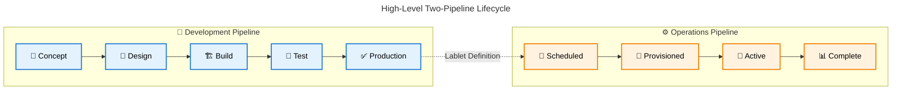
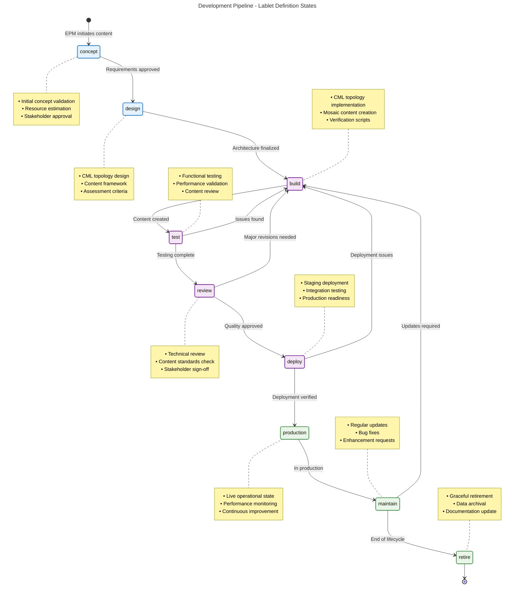
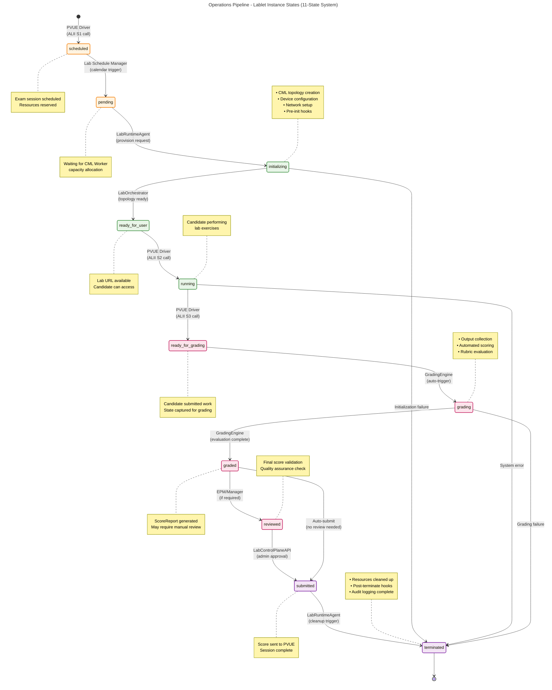
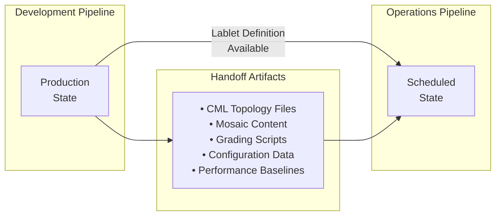
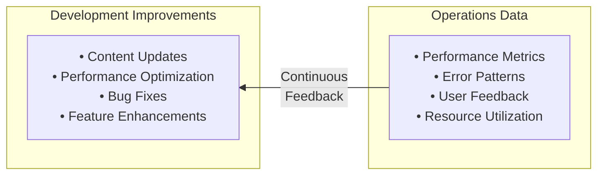

---
tags:
  - lablet
  - lifecycle
  - development
  - operations
  - pipeline
  - overview
  - documentation
---

# Lablet Lifecycle Overview

This document provides a comprehensive overview of the complete Lablet lifecycle, encompassing both **Development** and **Operations** pipelines. Each pipeline has its own distinct state machine, stakeholders, and processes that work together to deliver high-quality learning experiences.

## DEV vs OPS Two-Pipeline Lifecycle

The CML Lablets platform employs a **dual-pipeline architecture** that separates content development concerns from operational delivery concerns:

### 1. Development Pipeline (Lablet Definition)

- **Focus**: Creating and refining lablet content and specifications (in Mosaic)
- **Primary Stakeholder**: Exam Project Managers (EPMs) and Subject Matter Experts (SMEs)
- **Lifecycle**: Iterative content development with quality gates
- **Output**: Validated Lablet Definitions ready for deployment

### 2. Operations Pipeline (Lablet Instance)

- **Focus**: Delivering live lablet sessions to candidates
- **Primary Stakeholder**: Platform Operations Teams
- **Lifecycle**: Linear instance provisioning with automated state transitions
- **Output**: Scored lab results and candidate feedback

## Development Pipeline: Lablet Definition Lifecycle

### Development Pipeline Phases

| Phase          | Duration  | Key Activities                               | Stakeholders                       | Success Criteria                |
| -------------- | --------- | -------------------------------------------- | ---------------------------------- | ------------------------------- |
| **Concept**    | 1-2 weeks | Requirements gathering, feasibility analysis | EPM, Subject Matter Experts        | Approved concept document       |
| **Design**     | 2-3 weeks | Architecture design, content planning        | EPM, Technical Teams               | Finalized design specifications |
| **Build**      | 4-8 weeks | Content creation, topology implementation    | EPM, Content Developers            | Functional prototype            |
| **Test**       | 2-3 weeks | Validation testing, performance benchmarking | EPM, QA Teams                      | Test results meeting criteria   |
| **Review**     | 1-2 weeks | Quality assurance, stakeholder approval      | Management, Technical Review Board | Quality approval obtained       |
| **Deploy**     | 1 week    | Staging deployment, integration testing      | DevOps, Platform Teams             | Successful staging deployment   |
| **Production** | Ongoing   | Live operations, monitoring                  | Operations Teams                   | Stable production operation     |
| **Maintain**   | Ongoing   | Updates, enhancements, support               | EPM, Technical Teams               | Continuous improvement metrics  |

## Operations Pipeline: Lablet Instance Lifecycle

### Operations Pipeline States

| State                 | Average Duration | Key Activities                               | Responsible System   | Success Criteria                  |
| --------------------- | ---------------- | -------------------------------------------- | -------------------- | --------------------------------- |
| **scheduled**         | Variable         | PVUE scheduling, resource reservation        | PVUE Driver          | Session scheduled successfully    |
| **pending**           | < 5 minutes      | Resource allocation, CML worker assignment   | Lab Schedule Manager | Resources allocated               |
| **initializing**      | 3-7 minutes      | VM boot, network setup, topology deployment  | LabRuntimeAgent      | All nodes running, topology ready |
| **ready-for-user**    | < 30 seconds     | Health checks, candidate handoff preparation | LabOrchestrator      | Access URL validated              |
| **running**           | 120-180 minutes  | User activities, monitoring, logging         | Active Session       | Candidate actively using lab      |
| **ready-for-grading** | < 1 minute       | State capture, artifact collection           | PVUE Driver          | All required artifacts collected  |
| **grading**           | 2-5 minutes      | Script execution, rubric evaluation          | GradingEngine        | Score calculated successfully     |
| **graded**            | Instant          | Score calculation, feedback generation       | GradingEngine        | Score report generated            |
| **reviewed**          | Variable         | Human review, score adjustment (if needed)   | EPM/SME              | Final score validated             |
| **submitted**         | < 30 seconds     | Result transmission, audit logging           | LabControlPlaneAPI   | Score transmitted to PVUE         |
| **terminated**        | 1-2 minutes      | Resource cleanup, final logging              | LabRuntimeAgent      | All resources released            |

## Pipeline Integration Points

### Development → Operations Handoff

The transition from Development Pipeline to Operations Pipeline occurs when a Lablet Definition moves to **production** state and becomes available for operational deployment:

### Feedback Loop: Operations → Development

Operational insights feed back into the development pipeline to drive continuous improvement:

## Key Stakeholders & Responsibilities

### Development Pipeline Stakeholders

- **Exam Project Managers (EPMs)**: Content creation, validation, lifecycle management
- **Subject Matter Experts (SMEs)**: Technical content review and validation
- **Content Developers**: Implementation of lablet content and topologies
- **Technical Teams**: Architecture, infrastructure, and integration support
- **Quality Assurance**: Testing, validation, and compliance verification

### Operations Pipeline Stakeholders

- **Platform Operations**: Infrastructure management and monitoring
- **Lab Runtime Systems**: Automated provisioning and state management
- **Grading Systems**: Automated scoring and evaluation
- **Support Teams**: Issue resolution and customer support
- **PVUE Integration**: External system integration and data exchange

## Success Metrics Across Pipelines

### Development Pipeline KPIs

- **Development Velocity**: Average time from concept to production
- **Quality Score**: Percentage of lablets meeting quality standards on first review
- **Resource Efficiency**: Actual vs. estimated development resources
- **Stakeholder Satisfaction**: EPM and SME satisfaction scores

### Operations Pipeline KPIs

- **Availability**: Percentage uptime for operational lablet instances
- **Performance**: Average initialization and grading times
- **Success Rate**: Percentage of sessions completing successfully
- **User Experience**: Candidate satisfaction and completion rates

## AI & Cloud-Native Enhancements (Phase 4)

Both pipelines benefit from AI and cloud-native capabilities introduced in Phase 4:

### Development Pipeline AI Enhancements

- **Intelligent Content Validation**: AI-powered content quality analysis
- **Automated Testing**: AI-driven test case generation and execution
- **Performance Prediction**: ML models predicting resource requirements
- **Content Optimization**: AI recommendations for content improvements

### Operations Pipeline AI Enhancements

- **Predictive Scaling**: AI-based resource allocation and scaling
- **Intelligent Monitoring**: ML-powered anomaly detection and alerting
- **Automated Troubleshooting**: AI-assisted issue diagnosis and resolution
- **Personalized Experiences**: AI-driven user experience optimization

### Cloud-Native Integration

- **Hybrid Cloud Connectivity**: Integration with Webex, Intersight, and Meraki
- **Multi-Cloud Operations**: Seamless operation across cloud providers
- **Service Mesh Architecture**: Enhanced connectivity and observability
- **Cloud-Native Scaling**: Dynamic resource scaling based on demand

---

**Related Documentation:**

- [Development Pipeline Details](dev/) - Comprehensive development process documentation
- [Operations Pipeline Details](ops/) - Complete operational procedures and state management
- [Master Content Checklist](../project/master-content-checklist.md) - EPM operational checklist
- [Architecture Overview](../architecture.md) - Platform architecture and design principles
