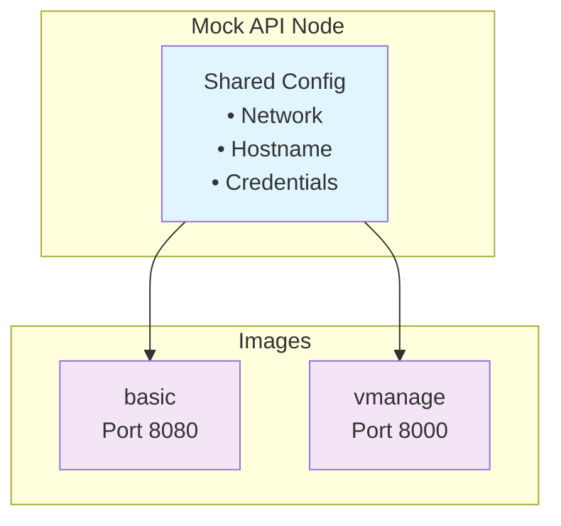

# Mock API Node Definition

> Last updated: `Thu Sep 25, 2025`

CML node specification for the **Mock API** node, providing mock API endpoints for Cisco certification lablets.

## Overview

The Mock API node is a single node definition supporting two distinct images (disk files). Each image provides different API mock capabilities while sharing common network and system configuration.

## Lab Usage Examples

**SCOR Lab (`basic` image)**

- Simple HTTP server endpoint
- Target for test traffic in security labs

**DEVASC Lab (`vmanage` image)**

- SD-WAN vManage API endpoints
- Replaces full SD-WAN infrastructure
- Same authentication requirements (Cookie + CSRF + API Key + JWT + HTTP Basic)

## Specifications

**Node Type**: `Mock API`
**Base OS**: Alpine Linux
**Resources**: 512MB RAM, 1 CPU core
**Network**: 2 interfaces (eth0, eth1)

- eth0: Lab network interface
- eth1: Management interface (down by default: **TBD**)

### Node Definition



### Images

| Image     | Port | APIs                | Use Case                                     |
| --------- | ---- | ------------------- | -------------------------------------------- |
| `basic`   | 8080 | General mock APIs   | Basic API testing or HTTP traffic simulation |
| `vmanage` | 8000 | SD-WAN vManage APIs | SD-WAN scenarios                             |

## Configuration

Default configuration (customizable per lab!) applied to all images at every boot:

```bash
# Network
sudo tee /etc/network/interfaces > /dev/null <<EOF
auto lo
iface lo inet loopback

auto eth0
iface eth0 inet static
    address 192.168.10.1/24
    gateway 192.168.10.254
    dns-nameservers 192.168.255.1
EOF

# Credentials
USERNAME=cisco
PASSWORD=cisco

# Hostname
sudo hostname MockApi
```

## Images

Each image contains the Mock & Roll tool with specific service configuration.

### Basic Image

- **Port**: 8080
- **Endpoint**: `http://192.168.10.1:8080/docs`
- **Log**: `/home/cisco/basic-mock.log`

**Autostart**: `/etc/local.d/virl2-10-mockandroll.start`

```bash
#!/bin/sh
sudo -u cisco /home/cisco/.local/bin/mockctl start basic --port 8080 > /home/cisco/basic-mock.log 2>&1 &
```

### vManage Image

- **Port**: 8000
- **Endpoint**: `http://192.168.10.1:8000/docs`
- **Log**: `/home/cisco/vmanage-mock.log`

**Autostart**: `/etc/local.d/virl2-10-mockandroll.start`

```bash
#!/bin/sh
sudo -u cisco /home/cisco/.local/bin/mockctl start vmanage --port 8000 > /home/cisco/vmanage-mock.log 2>&1 &
```

## Build Process

### System Setup

```bash
# Update Alpine Linux
sudo apk update

# Install dependencies
sudo apk add --no-cache git curl bash python3 py3-pip gcc python3-dev musl-dev linux-headers
sudo apk add procps util-linux coreutils findutils net-tools iproute2 lsof curl wget grep sed jq

# Install Mock & Roll (requires CCIE DMZ access)
git clone https://ccie-gitlab.ccie.cisco.com/mozart/microservices/mock-and-roll.git
cd mock-and-roll
./setup/alpine.sh
./setup/add_to_path.sh
```

### Custom MOTD

**File**: `/etc/profile.d/99-custom-motd.sh`

```bash
#!/bin/sh
echo "=== Mock API Node ==="
/home/cisco/.local/bin/mockctl list
echo "===================="
```

### Finalization

```bash
# Commit to persistent storage (TBC!!)
sudo lbu commit -d

# Clean up (stop service and clean logs)
/home/cisco/.local/bin/mockctl clean-up
```

### Deep Cloning on CML

Find the snapshot of the STOPPED Node:

```sh
#
CML_KEY_NAME=SysAdminKeyCmlDev
CML_HOST=101.41.17.16
CML_PORT=11222
LAB_NAME="DEVASC: 200-901 LAB-2.5.1"
LAB_ID=baee024a-1835-4875-9583-5a7849d35c9d
NODE_NAME=vManageMockAPI
NODE_ID=8f373be8-e297-4410-870d-af61fb684d8e

# CML STATIC
NODE_INTERNAL_DISK_FILE_NAME=node0.img

ssh -i ~/.ssh/$CML_KEY_NAME -p $CML_PORT sysadmin@$CML_HOST "file /var/local/virl2/images/$LAB_ID/$NODE_ID/$NODE_INTERNAL_DISK_FILE_NAME"

```

Sample output:

```text
/var/local/virl2/images/baee024a-1835-4875-9583-5a7849d35c9d/8f373be8-e297-4410-870d-af61fb684d8e/node0.img: QEMU QCOW Image (v3), has backing file (path /var/lib/libvirt/images/virl-base-images/mock-and-roll-v0.4.0_vmanage_20250925/alpine-base-3-19-1_mock-and-roll-v0.4.0_vmanage_, mtime Thu Jan  1 00:00:16 1970), 17179869184 bytes (v3), has backing file (path /var/lib/libvirt/images/virl-base-images/mock-and-roll-v0.4.0_vmanage_20250925/alpine-base-3-19-1_mock-and-roll-v0.4.0_vmanage_), 17179869184 bytes
```
