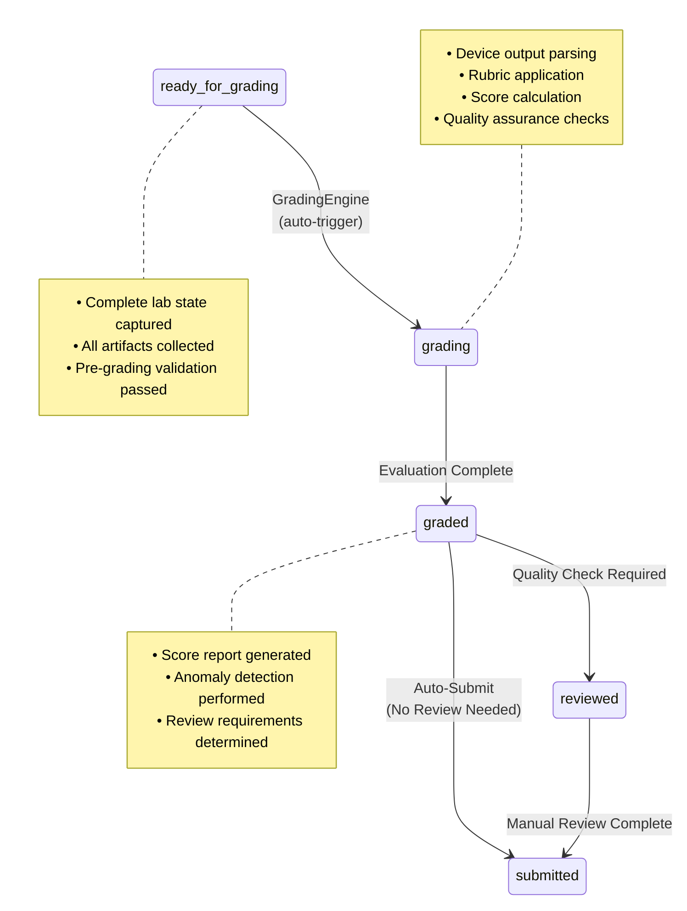
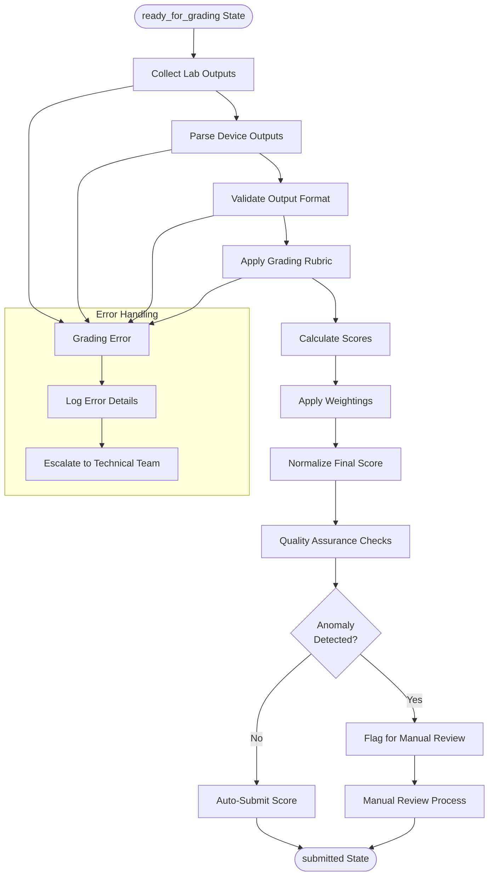
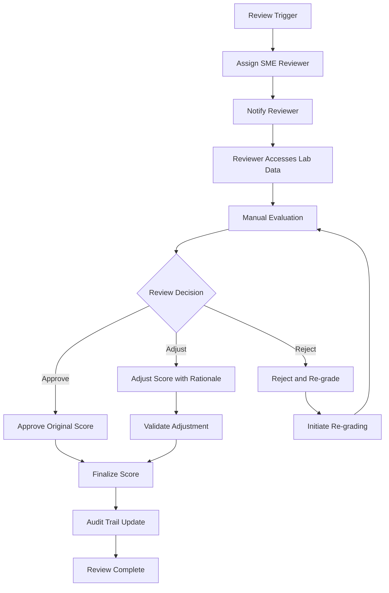

# Grading & Scoring Operations

- **Document Type:** Operations Pipeline Component
- **Target Audience:** Grading System Administrators, EPMs, Technical Staff
- **Purpose:** Comprehensive guide to automated grading and scoring operations
- **Version:** 2.0
- **Last Updated:** October 1, 2025

## Overview

The Grading & Scoring system is a critical component of the Operations Pipeline, responsible for automatically evaluating lablet instances and generating accurate, consistent scores based on predefined rubrics and evaluation criteria.

## Grading State Flow

The grading process encompasses three key states within the Operations Pipeline:



## Grading System Architecture

### Core Components

#### 1. GradingEngine

**Responsibility**: Central orchestration of the grading process
**Functions**:

- Grading script execution management
- Output collection and parsing
- Score calculation and validation
- Quality assurance automation

#### 2. RubricProcessor

**Responsibility**: Rubric application and scoring logic
**Functions**:

- Rubric interpretation and parsing
- Scoring criteria evaluation
- Weighted score calculation
- Partial credit assignment

#### 3. OutputCollector

**Responsibility**: Lab state and output artifact collection
**Functions**:

- Device configuration capture
- Command output collection
- File system artifact gathering
- Network state documentation

#### 4. ScoreValidator

**Responsibility**: Score validation and quality assurance
**Functions**:

- Score range validation
- Consistency checking
- Anomaly detection
- Manual review flagging

### Grading Workflow



## Grading Script Architecture

### Script Categories

#### 1. Device Configuration Scripts

**Purpose**: Evaluate device configuration compliance
**Scope**: Router, switch, firewall, and server configurations
**Evaluation Methods**:

- Configuration parsing and validation
- Command output analysis
- State verification checks
- Compliance scoring

**Example Script Structure**:

```python
#!/usr/bin/env python3
"""
Device Configuration Grading Script
Evaluates router OSPF configuration compliance
"""

def grade_ospf_config(device_output, rubric_criteria):
    """
    Grade OSPF configuration based on rubric criteria

    Args:
        device_output: Raw command outputs from device
        rubric_criteria: Scoring criteria and weights

    Returns:
        dict: Scoring results with details
    """
    score_details = {
        'total_points': 0,
        'max_points': rubric_criteria['max_points'],
        'criteria_scores': {},
        'feedback': []
    }

    # Parse OSPF neighbor information
    neighbors = parse_ospf_neighbors(device_output['show ip ospf neighbor'])

    # Evaluate neighbor relationships (20 points max)
    neighbor_score = evaluate_ospf_neighbors(neighbors, rubric_criteria['neighbors'])
    score_details['criteria_scores']['ospf_neighbors'] = neighbor_score
    score_details['total_points'] += neighbor_score['points']

    # Parse OSPF areas configuration
    areas = parse_ospf_areas(device_output['show ip ospf'])

    # Evaluate area configuration (15 points max)
    area_score = evaluate_ospf_areas(areas, rubric_criteria['areas'])
    score_details['criteria_scores']['ospf_areas'] = area_score
    score_details['total_points'] += area_score['points']

    return score_details
```

#### 2. Network Connectivity Scripts

**Purpose**: Validate network connectivity and reachability
**Scope**: End-to-end connectivity, routing, and protocol functionality
**Evaluation Methods**:

- Ping and traceroute analysis
- Routing table validation
- Protocol state verification
- Performance metrics evaluation

#### 3. Security Configuration Scripts

**Purpose**: Assess security controls and compliance
**Scope**: Access controls, encryption, authentication, and security policies
**Evaluation Methods**:

- Security policy validation
- Access control verification
- Encryption configuration checks
- Compliance assessment

#### 4. Application Functionality Scripts

**Purpose**: Evaluate application-specific functionality
**Scope**: Service availability, API functionality, and application behavior
**Evaluation Methods**:

- Service health checks
- API endpoint testing
- Functional workflow validation
- Performance benchmarking

### Script Execution Environment

#### Containerized Execution

**Benefits**:

- Isolated execution environment
- Consistent runtime dependencies
- Resource limitation and control
- Security isolation

**Container Specifications**:

- **Base Image**: Custom Python/networking tools image
- **Resource Limits**: 1 CPU, 2GB RAM, 30-minute timeout
- **Network Access**: Controlled access to lab networks only
- **Security**: Non-privileged execution, read-only filesystem

#### Script Validation and Testing

**Pre-deployment Requirements**:

- Unit test coverage >95%
- Integration testing with sample lab outputs
- Performance benchmarking and optimization
- Security review and approval

## Rubric System

### Rubric Structure

#### Hierarchical Scoring Framework

```yaml
rubric:
  lablet_id: "AUTOCOR-1-300-435"
  version: "1.2"
  max_points: 100

  categories:
    - name: "OSPF Configuration"
      weight: 0.30
      max_points: 30
      criteria:
        - name: "Neighbor Relationships"
          points: 20
          description: "OSPF neighbor adjacencies established"
          validation_method: "ospf_neighbor_check"
        - name: "Area Configuration"
          points: 10
          description: "OSPF areas properly configured"
          validation_method: "ospf_area_check"

    - name: "BGP Configuration"
      weight: 0.25
      max_points: 25
      criteria:
        - name: "Peering Sessions"
          points: 15
          description: "BGP peering sessions established"
          validation_method: "bgp_peer_check"
        - name: "Route Advertisement"
          points: 10
          description: "Proper route advertisement and filtering"
          validation_method: "bgp_route_check"

    - name: "Security Configuration"
      weight: 0.20
      max_points: 20
      criteria:
        - name: "Access Control Lists"
          points: 12
          description: "ACLs properly configured and applied"
          validation_method: "acl_validation"
        - name: "Authentication"
          points: 8
          description: "Authentication mechanisms configured"
          validation_method: "auth_check"

    - name: "Network Connectivity"
      weight: 0.25
      max_points: 25
      criteria:
        - name: "End-to-End Reachability"
          points: 15
          description: "Full network reachability established"
          validation_method: "connectivity_test"
        - name: "Redundancy and Failover"
          points: 10
          description: "Network redundancy properly configured"
          validation_method: "redundancy_check"

  scoring_rules:
    - type: "partial_credit"
      enabled: true
      minimum_percentage: 0.25
    - type: "prerequisite_dependencies"
      enabled: true
      dependencies:
        - criteria: "OSPF Neighbor Relationships"
          requires: ["OSPF Area Configuration"]
    - type: "bonus_points"
      enabled: true
      max_bonus: 5
      criteria: ["Advanced Configuration Optimization"]
```

### Scoring Algorithms

#### Weighted Scoring

```python
def calculate_weighted_score(category_scores, rubric):
    """
    Calculate final weighted score across all categories

    Args:
        category_scores: Dictionary of category scores
        rubric: Rubric configuration with weights

    Returns:
        dict: Final scoring results
    """
    total_weighted_score = 0
    max_possible_score = 0

    for category in rubric['categories']:
        category_name = category['name']
        weight = category['weight']
        max_points = category['max_points']

        if category_name in category_scores:
            actual_score = category_scores[category_name]['points']
            weighted_contribution = (actual_score / max_points) * weight * 100
            total_weighted_score += weighted_contribution

        max_possible_score += weight * 100

    return {
        'final_score': min(total_weighted_score, 100),  # Cap at 100%
        'percentage': total_weighted_score / max_possible_score * 100,
        'category_breakdown': calculate_category_breakdown(category_scores, rubric)
    }
```

#### Partial Credit System

- **Minimum Credit**: 25% of points awarded for attempting configuration
- **Progressive Credit**: Additional points for partial completion
- **Dependency Handling**: Prerequisites must be met for dependent scoring
- **Bonus Points**: Extra credit for advanced implementations

### Quality Assurance Checks

#### Score Validation Rules

1. **Range Validation**: Scores must be within 0-100% range
2. **Consistency Checks**: Similar configurations should yield similar scores
3. **Rubric Compliance**: All rubric criteria must be evaluated
4. **Temporal Consistency**: Score variations over time should be reasonable

#### Anomaly Detection

```python
def detect_scoring_anomalies(score_result, historical_data, thresholds):
    """
    Detect potential anomalies in scoring results

    Args:
        score_result: Current scoring result
        historical_data: Historical scoring patterns
        thresholds: Anomaly detection thresholds

    Returns:
        list: Detected anomalies with severity levels
    """
    anomalies = []

    # Statistical outlier detection
    if is_statistical_outlier(score_result, historical_data):
        anomalies.append({
            'type': 'statistical_outlier',
            'severity': 'medium',
            'description': 'Score significantly deviates from historical patterns'
        })

    # Perfect score anomaly (rare occurrence)
    if score_result['final_score'] == 100:
        anomalies.append({
            'type': 'perfect_score',
            'severity': 'low',
            'description': 'Perfect score achieved - verify correctness'
        })

    # Very low score anomaly
    if score_result['final_score'] < thresholds['minimum_expected']:
        anomalies.append({
            'type': 'unusually_low_score',
            'severity': 'high',
            'description': 'Score below expected minimum - potential grading issue'
        })

    return anomalies
```

## Performance and Scalability

### Grading Performance Targets

#### Execution Time Targets

- **Simple Configurations**: <30 seconds
- **Complex Configurations**: <2 minutes
- **Multi-Device Scenarios**: <5 minutes
- **Maximum Timeout**: 10 minutes (with escalation)

#### Scalability Requirements

- **Concurrent Grading Sessions**: 50+ simultaneous
- **Peak Load Handling**: 200+ sessions per hour
- **Resource Scaling**: Automatic scaling based on demand
- **Queue Management**: Priority-based grading queue

### Performance Optimization

#### Caching Strategies

```python
class GradingCache:
    """
    Intelligent caching for grading operations
    """

    def __init__(self):
        self.device_output_cache = {}
        self.rubric_cache = {}
        self.script_cache = {}

    def get_cached_result(self, cache_key, ttl_seconds=300):
        """
        Retrieve cached grading result if available and valid

        Args:
            cache_key: Unique identifier for cached result
            ttl_seconds: Time-to-live for cache entries

        Returns:
            Cached result or None if not available
        """
        if cache_key in self.device_output_cache:
            cached_entry = self.device_output_cache[cache_key]
            if time.time() - cached_entry['timestamp'] < ttl_seconds:
                return cached_entry['result']
        return None
```

#### Parallel Processing

- **Multi-threading**: Parallel evaluation of independent criteria
- **Asynchronous Operations**: Non-blocking I/O for device communication
- **Distributed Processing**: Load distribution across multiple grading nodes
- **Resource Pooling**: Shared resources for common operations

## Error Handling and Recovery

### Error Categories

#### 1. Grading Script Errors

**Common Causes**:

- Script execution failures
- Output parsing errors
- Dependency issues
- Resource limitations

**Recovery Actions**:

- Automatic retry with exponential backoff
- Fallback to alternative grading methods
- Manual review escalation
- Detailed error logging and analysis

#### 2. Infrastructure Errors

**Common Causes**:

- Network connectivity issues
- Resource exhaustion
- Service dependencies unavailable
- Platform instabilities

**Recovery Actions**:

- Service health checks and recovery
- Resource scaling and reallocation
- Graceful degradation to essential services
- Platform team escalation

#### 3. Data Quality Issues

**Common Causes**:

- Incomplete lab state capture
- Corrupted output files
- Missing required artifacts
- Inconsistent data formats

**Recovery Actions**:

- Data validation and cleaning
- Alternative data source utilization
- Manual intervention requests
- Quality assurance escalation

### Recovery Procedures

#### Automatic Recovery

```python
def handle_grading_error(error, context, retry_count=0):
    """
    Automatic error handling and recovery for grading operations

    Args:
        error: Exception or error object
        context: Grading context information
        retry_count: Current retry attempt number

    Returns:
        Recovery action result
    """
    max_retries = 3

    # Log error details
    log_grading_error(error, context, retry_count)

    # Determine error category and recovery strategy
    if isinstance(error, ScriptExecutionError):
        if retry_count < max_retries:
            # Exponential backoff retry
            delay = 2 ** retry_count
            time.sleep(delay)
            return retry_grading_script(context, retry_count + 1)
        else:
            # Escalate to manual review
            return escalate_to_manual_review(context, error)

    elif isinstance(error, DataQualityError):
        # Attempt alternative data sources
        alternative_data = get_alternative_data_sources(context)
        if alternative_data:
            return retry_with_alternative_data(context, alternative_data)
        else:
            return escalate_to_technical_team(context, error)

    # Default escalation for unhandled errors
    return escalate_to_operations_team(context, error)
```

## Manual Review Integration

### Review Trigger Criteria

#### Automatic Review Triggers

- **Anomaly Detection**: Statistical outliers or unusual patterns
- **Score Validation Failures**: Scores outside expected ranges
- **Quality Assurance Flags**: Failed QA checks or validation rules
- **Technical Errors**: Grading system errors or failures

#### Manual Review Request

- **EPM Requests**: Explicit review requests from exam project managers
- **Candidate Appeals**: Score appeals or disputes
- **Quality Audits**: Periodic quality assurance audits
- **Policy Requirements**: Regulatory or policy-mandated reviews

### Review Workflow



### Review Quality Assurance

#### Reviewer Qualifications

- **Subject Matter Expertise**: Relevant technical domain knowledge
- **Certification Requirements**: Appropriate industry certifications
- **Review Training**: Completed review process training
- **Calibration Testing**: Demonstrated scoring consistency

#### Review Consistency Monitoring

```python
def monitor_review_consistency(reviewer_id, recent_reviews):
    """
    Monitor reviewer consistency and identify potential issues

    Args:
        reviewer_id: Unique reviewer identifier
        recent_reviews: Recent review decisions and outcomes

    Returns:
        Consistency analysis and recommendations
    """
    consistency_metrics = {
        'score_variance': calculate_score_variance(recent_reviews),
        'decision_patterns': analyze_decision_patterns(recent_reviews),
        'time_consistency': analyze_review_timing(recent_reviews),
        'quality_indicators': calculate_quality_indicators(recent_reviews)
    }

    # Identify potential consistency issues
    issues = []
    if consistency_metrics['score_variance'] > VARIANCE_THRESHOLD:
        issues.append('high_score_variance')

    if consistency_metrics['decision_patterns']['reversal_rate'] > REVERSAL_THRESHOLD:
        issues.append('high_reversal_rate')

    return {
        'consistency_score': calculate_consistency_score(consistency_metrics),
        'identified_issues': issues,
        'recommendations': generate_consistency_recommendations(consistency_metrics)
    }
```

## Integration with AI & Cloud-Native Capabilities (Phase 4)

### AI-Enhanced Grading

#### Machine Learning Models

- **Pattern Recognition**: ML models for identifying common configuration patterns
- **Anomaly Detection**: Advanced statistical and ML-based anomaly detection
- **Predictive Scoring**: Models predicting likely score ranges before full evaluation
- **Natural Language Feedback**: AI-generated feedback and explanations

#### Intelligent Rubric Optimization

```python
class IntelligentRubricOptimizer:
    """
    AI-powered rubric optimization and improvement system
    """

    def __init__(self):
        self.ml_model = load_rubric_optimization_model()
        self.historical_data = HistoricalScoringDatabase()

    def optimize_rubric_weights(self, rubric, performance_data):
        """
        Use ML to optimize rubric weights for better discrimination

        Args:
            rubric: Current rubric configuration
            performance_data: Historical performance and outcome data

        Returns:
            Optimized rubric with improved weights
        """
        # Analyze historical scoring patterns
        scoring_patterns = self.analyze_scoring_patterns(performance_data)

        # Generate weight optimization recommendations
        optimization_suggestions = self.ml_model.predict_optimal_weights(
            rubric, scoring_patterns
        )

        # Validate optimization suggestions
        validated_suggestions = self.validate_optimization(
            optimization_suggestions, performance_data
        )

        return self.apply_optimizations(rubric, validated_suggestions)
```

### Cloud-Native Scalability

#### Containerized Grading Services

- **Microservice Architecture**: Independent, scalable grading services
- **Container Orchestration**: Kubernetes-based service management
- **Auto-scaling**: Demand-based automatic scaling of grading capacity
- **Load Balancing**: Intelligent distribution of grading workloads

#### Multi-Cloud Deployment

- **Geographic Distribution**: Grading services deployed across regions
- **Redundancy**: Multi-cloud redundancy for high availability
- **Performance Optimization**: Proximity-based service routing
- **Disaster Recovery**: Cross-cloud backup and recovery capabilities

---

**Related Documentation:**

- [Operations Pipeline Overview](index.md) - Complete operations pipeline documentation
- [State Management](state-management.md) - Detailed state management procedures
- [Monitoring and Alerting](monitoring.md) - Comprehensive monitoring documentation
- [Hook Development Guide](hooks.md) - Custom hook script development
- [API Documentation](api.md) - Grading system API reference
