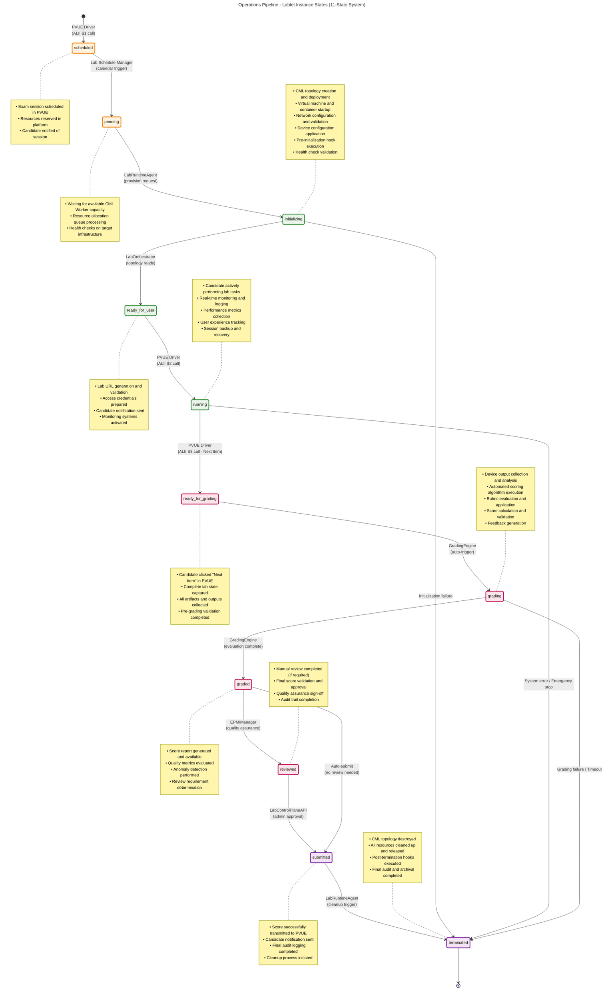
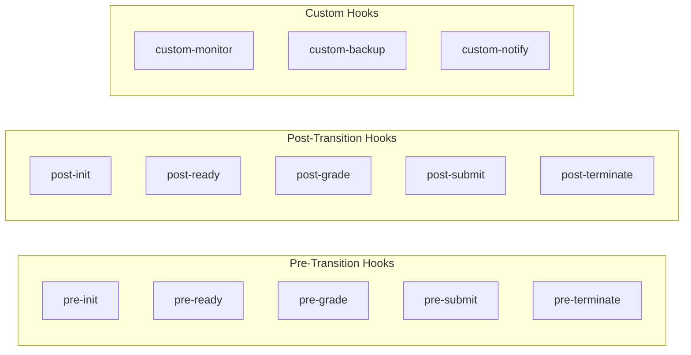

---
tags:
  - operations
  - pipeline
  - lablet
  - instance
  - lifecycle
  - management
  - technical
  - documentation
  - monitoring
---

# Operations Pipeline: Lablet Instance Management

- **Document Type:** Operations Pipeline Documentation
- **Target Audience:** Platform Operations Teams, EPMs, Technical Staff
- **Purpose:** Complete guide to lablet instance operational lifecycle management
- **Version:** 2.0
- **Last Updated:** October 1, 2025

## Overview

The Operations Pipeline manages the complete lifecycle of individual lablet instances from scheduling through termination. This pipeline focuses on the operational delivery of live lab sessions to candidates, ensuring reliable, scalable, and high-quality learning experiences.

## 11-State Lifecycle System

The Operations Pipeline implements a comprehensive 11-state system that provides clear visibility and control over each lablet instance throughout its operational lifecycle.

### State Machine Architecture



## Detailed State Specifications

=== "scheduled"

    - **Duration**: Variable (hours to days)
    - **Responsible System**: PVUE Driver
    - **Trigger**: Candidate exam scheduling through ALII S1 call

    **Activities:**

    - Exam session scheduling validation in PVUE
    - Resource reservation in CML platform
    - Candidate notification and communication
    - Calendar integration and time slot confirmation

    **Success Criteria:**

    - Valid exam session created in PVUE
    - Resources successfully reserved
    - Candidate properly notified
    - No scheduling conflicts detected

    **Key Metrics:**

    - Time in scheduled state: Variable based on exam scheduling
    - Resource reservation success rate: >99%
    - Scheduling conflict rate: <0.1%

    **Escalation Triggers:**

    - Resource reservation failures
    - Scheduling system unavailability
    - Candidate notification failures

=== "pending"

    - **Duration**: <5 minutes (target), <10 minutes (maximum)
    - **Responsible System**: Lab Schedule Manager
    - **Trigger**: Calendar-based scheduling trigger

    **Activities:**

    - CML Worker capacity evaluation and allocation
    - Resource availability verification
    - Queue position management and prioritization
    - Infrastructure health checks on target systems

    **Success Criteria:**

    - Available CML Worker identified and allocated
    - Sufficient resources confirmed available
    - No infrastructure health issues detected
    - Queue position assigned appropriately

    **Key Metrics:**

    - Average pending duration: <3 minutes
    - Resource allocation success rate: >98%
    - Infrastructure health check pass rate: >99.5%

    **Escalation Triggers:**

    - Pending duration >10 minutes
    - Repeated resource allocation failures
    - Infrastructure health check failures
    - Capacity exhaustion conditions

=== "initializing"

    - **Duration**: 3-7 minutes (target), <15 minutes (maximum)
    - **Responsible System**: LabRuntimeAgent
    - **Trigger**: Successful resource allocation and provisioning request

    **Activities:**

    - CML topology creation and deployment
    - Virtual machine and container orchestration
    - Network segment creation and configuration
    - Device startup and initial configuration
    - Pre-initialization hook script execution
    - Comprehensive health check validation
    - Monitoring system activation

    **Success Criteria:**

    - All topology nodes successfully deployed and running
    - Network connectivity established between all components
    - Device configurations applied successfully
    - All health checks passing
    - Pre-initialization hooks completed without errors

    **Key Metrics:**

    - Average initialization time: <5 minutes
    - Node deployment success rate: 100%
    - Network connectivity success rate: 100%
    - Health check pass rate: 100%

    **Escalation Triggers:**

    - Initialization duration >15 minutes
    - Any node deployment failures
    - Network connectivity issues
    - Health check failures
    - Pre-initialization hook errors

=== "ready-for-user"

    - **Duration**: <30 seconds (target), <5 minutes (maximum)
    - **Responsible System**: LabOrchestrator
    - **Trigger**: Successful topology deployment and validation

    **Activities:**

    - Lab access URL generation and validation
    - Authentication integration with PVUE
    - Final system readiness verification
    - Candidate access notification preparation
    - Monitoring dashboard activation

    **Success Criteria:**

    - Valid and accessible lab URL generated
    - Authentication handoff configured properly
    - All systems responding to health checks
    - Monitoring systems fully operational

    **Key Metrics:**

    - URL generation time: <5 seconds
    - Authentication integration success rate: >99.5%
    - System readiness validation: 100% pass rate

    **Escalation Triggers:**

    - URL generation failures
    - Authentication integration issues
    - System readiness check failures
    - Extended time in ready state >5 minutes

=== "running"

    - **Duration**: 120-180 minutes (exam-dependent)
    - **Responsible System**: Active Session Management
    - **Trigger**: Candidate access via PVUE ALII S2 call

    **Activities:**

    - Real-time performance monitoring and optimization
    - User experience tracking and analytics
    - Session state backup and recovery management
    - Resource utilization monitoring and alerting
    - Security monitoring and threat detection
    - Candidate activity logging and audit trail
    - Dynamic resource scaling (if needed)

    **Success Criteria:**

    - Stable lab performance throughout session
    - All monitoring systems operational
    - Resource utilization within acceptable limits
    - Zero security incidents or breaches
    - Complete audit trail maintenance

    **Key Metrics:**

    - Session stability: >99.8% uptime
    - Response time: <3 seconds for typical operations
    - Resource utilization: <80% of allocated capacity
    - Security incident rate: Zero tolerance
    - Backup success rate: 100%

    **Escalation Triggers:**

    - Performance degradation or instability
    - Resource utilization >90%
    - Security incidents or anomalies
    - Monitoring system failures
    - Candidate-reported critical issues

=== "ready-for-grading"

    - **Duration**: <1 minute (target), <5 minutes (maximum)
    - **Responsible System**: PVUE Driver
    - **Trigger**: Candidate submission via ALII S3 call ("Next Item")

    **Activities:**

    - Complete lab state capture and serialization
    - Output file collection and validation
    - Configuration snapshot creation
    - Artifact packaging and verification
    - Pre-grading validation checks

    **Success Criteria:**

    - Complete lab state successfully captured
    - All required artifacts collected and validated
    - Configuration snapshots created successfully
    - Pre-grading validation checks passed

    **Key Metrics:**

    - State capture completion time: <30 seconds
    - Artifact collection success rate: 100%
    - Pre-grading validation pass rate: 100%

    **Escalation Triggers:**

    - State capture failures or timeouts
    - Missing or corrupted artifacts
    - Pre-grading validation failures
    - Extended duration >5 minutes

=== "grading"

    - **Duration**: 2-5 minutes (target), <10 minutes (maximum)
    - **Responsible System**: GradingEngine
    - **Trigger**: Automatic trigger after successful state capture

    **Activities:**

    - Device output parsing and analysis
    - Automated scoring algorithm execution
    - Grading rubric application and evaluation
    - Score calculation and normalization
    - Feedback generation and formatting
    - Quality assurance checks on results

    **Success Criteria:**

    - All grading scripts executed successfully
    - Scores calculated within expected ranges
    - Feedback generated appropriately
    - Quality assurance checks passed

    **Key Metrics:**

    - Average grading time: <3 minutes
    - Grading script success rate: 100%
    - Score validity rate: 100%
    - Quality check pass rate: >99%

    **Escalation Triggers:**

    - Grading script failures or errors
    - Grading duration >10 minutes
    - Invalid or out-of-range scores
    - Quality assurance check failures

=== "graded"

    - **Duration**: Instant (automated) to hours (manual review)
    - **Responsible System**: GradingEngine / Review System
    - **Trigger**: Successful completion of grading process

    **Activities:**

    - Score report generation and formatting
    - Anomaly detection and analysis
    - Review requirement determination
    - Quality metrics evaluation
    - Audit trail completion

    **Success Criteria:**

    - Complete score report generated
    - Anomaly detection completed
    - Review requirements properly determined
    - Quality metrics within acceptable ranges

    **Key Metrics:**

    - Report generation time: <10 seconds
    - Anomaly detection accuracy: >95%
    - Review requirement accuracy: >98%

    **Decision Points:**

    - Auto-submit if no review required
    - Route to manual review if flagged
    - Escalate if quality issues detected

=== "reviewed"

    - **Duration**: Variable (minutes to hours)
    - **Responsible System**: Manual Review System
    - **Trigger**: Quality assurance requirements or anomaly flags

    **Activities:**

    - Subject Matter Expert (SME) assignment
    - Comprehensive manual review process
    - Score validation and potential adjustment
    - Final quality assurance approval
    - Documentation of review rationale

    **Success Criteria:**

    - Qualified SME assigned and completed review
    - Score validation completed thoroughly
    - Final approval obtained with documentation
    - Review rationale properly documented

    **Key Metrics:**

    - Review assignment time: <30 minutes
    - Review completion time: Within SLA (typically 2-4 hours)
    - Review consistency score: >95%

    **Escalation Triggers:**

    - Review assignment delays
    - SLA timeline violations
    - Reviewer availability issues
    - Review quality concerns

=== "submitted"

    - **Duration**: <30 seconds (target), <2 minutes (maximum)
    - **Responsible System**: LabControlPlaneAPI
    - **Trigger**: Final approval and submission authorization

    **Activities:**

    - Final score transmission to PVUE
    - Candidate result notification
    - Audit trail finalization
    - Cleanup process initiation
    - Performance metrics collection

    **Success Criteria:**

    - Score successfully transmitted to PVUE
    - Candidate properly notified
    - Audit trail completed and archived
    - Cleanup process initiated successfully

    **Key Metrics:**

    - PVUE transmission success rate: 100%
    - Transmission time: <10 seconds
    - Notification success rate: >99%

    **Escalation Triggers:**

    - PVUE transmission failures
    - Notification delivery failures
    - Audit trail issues
    - Cleanup initiation problems

=== "terminated"

    - **Duration**: 1-2 minutes (target), <5 minutes (maximum)
    - **Responsible System**: LabRuntimeAgent
    - **Trigger**: Successful score submission and cleanup authorization

    **Activities:**

    - CML topology destruction and cleanup
    - Resource deallocation and release
    - Post-termination hook execution
    - Final audit logging and archival
    - Performance metrics finalization

    **Success Criteria:**

    - Complete topology cleanup verified
    - All resources properly released
    - Post-termination hooks completed successfully
    - Final audit records archived

    **Key Metrics:**

    - Cleanup completion time: <90 seconds
    - Resource release success rate: 100%
    - Hook execution success rate: 100%
    - Audit archival success rate: 100%

    **Escalation Triggers:**

    - Cleanup failures or incomplete resource release
    - Post-termination hook failures
    - Audit archival issues
    - Extended cleanup duration >5 minutes

## Hook Scripts and Extensions

The Operations Pipeline supports extensive customization through hook scripts that can be executed at various state transitions. This provides flexibility for specialized requirements while maintaining operational consistency.

### Available Hook Points



### Hook Script Categories

#### 1. Pre-Transition Hooks

Execute before state transitions to validate conditions and prepare systems:

- **`pre-init`**: Environment validation before initialization
- **`pre-ready`**: Final readiness checks before user access
- **`pre-grade`**: Pre-grading validation and preparation
- **`pre-submit`**: Final validation before score submission
- **`pre-terminate`**: Pre-cleanup validation and backup

#### 2. Post-Transition Hooks

Execute after state transitions for notification, logging, and integration:

- **`post-init`**: Post-initialization validation and notification
- **`post-ready`**: Ready state confirmation and monitoring activation
- **`post-grade`**: Post-grading validation and notification
- **`post-submit`**: Submission confirmation and audit logging
- **`post-terminate`**: Final cleanup validation and archival

#### 3. Custom Business Logic Hooks

Support specialized requirements and integrations:

- **`custom-monitor`**: Specialized monitoring and alerting
- **`custom-backup`**: Custom backup and recovery procedures
- **`custom-notify`**: Specialized notification and communication
- **`custom-integrate`**: Third-party system integrations
- **`custom-validate`**: Custom validation and quality checks

### Hook Script Configuration

```yaml
hooks:
  pre-init:
    - script: "validate_network_connectivity.py"
      timeout: 30
      retry_count: 3
    - script: "prepare_custom_configs.sh"
      timeout: 60

  post-init:
    - script: "send_init_notification.py"
      timeout: 10
    - script: "activate_monitoring.py"
      timeout: 15

  pre-grade:
    - script: "backup_lab_state.py"
      timeout: 120
    - script: "validate_outputs.py"
      timeout: 60

  custom-monitor:
    - script: "enhanced_performance_monitor.py"
      schedule: "*/30 * * * * *" # Every 30 seconds
      enabled: true
```

## State Timeouts and Escalation Procedures

### Timeout Configuration

Each state has carefully defined timeout periods to prevent stuck instances and ensure reliable operations:

| State                 | Target Duration | Warning Threshold | Critical Threshold | Escalation Action       |
| --------------------- | --------------- | ----------------- | ------------------ | ----------------------- |
| **scheduled**         | Variable        | N/A               | Resource failure   | Operations notification |
| **pending**           | <5 minutes      | 5 minutes         | 10 minutes         | Capacity escalation     |
| **initializing**      | 3-7 minutes     | 10 minutes        | 15 minutes         | Auto-terminate + refund |
| **ready-for-user**    | <30 seconds     | 2 minutes         | 5 minutes          | Technical escalation    |
| **running**           | Session limit   | Session + 5 min   | Session + 10 min   | Force submission        |
| **ready-for-grading** | <1 minute       | 3 minutes         | 5 minutes          | Technical escalation    |
| **grading**           | 2-5 minutes     | 8 minutes         | 10 minutes         | Technical escalation    |
| **graded**            | Instant         | N/A               | N/A                | N/A                     |
| **reviewed**          | SLA dependent   | 75% of SLA        | 100% of SLA        | Management escalation   |
| **submitted**         | <30 seconds     | 1 minute          | 2 minutes          | Integration escalation  |
| **terminated**        | 1-2 minutes     | 3 minutes         | 5 minutes          | Operations escalation   |

### Escalation Procedures

#### Level 1: Automated Recovery

- **Trigger**: Warning thresholds exceeded
- **Actions**: Automated retry attempts, resource reallocation
- **Notification**: Operations dashboard alerts

#### Level 2: Technical Escalation

- **Trigger**: Critical thresholds exceeded
- **Actions**: Technical team notification, manual intervention
- **Notification**: On-call technical staff, management dashboard

#### Level 3: Management Escalation

- **Trigger**: Repeated failures, SLA violations
- **Actions**: Management notification, incident response
- **Notification**: Management team, customer communication

## Integration Points

### PVUE Integration (ALII Protocol)

The Operations Pipeline integrates seamlessly with PVUE through the ALII (API for Lab Item Interoperability) protocol:

#### ALII S1: Lab Scheduling

- **Trigger**: Candidate exam scheduling
- **Action**: Transition to `scheduled` state
- **Data Exchange**: Candidate ID, exam details, timing requirements

#### ALII S2: Lab Access

- **Trigger**: Candidate requests lab access
- **Action**: Transition from `ready-for-user` to `running`
- **Data Exchange**: Lab URL, access credentials, session parameters

#### ALII S3: Lab Submission

- **Trigger**: Candidate clicks "Next Item"
- **Action**: Transition from `running` to `ready-for-grading`
- **Data Exchange**: Session state, completion status, timing data

### CML Platform Integration

#### Resource Management

- **Worker Allocation**: Dynamic assignment based on capacity and requirements
- **Topology Deployment**: Automated topology creation and configuration
- **Resource Cleanup**: Comprehensive cleanup and resource release

#### Performance Monitoring

- **Real-time Metrics**: CPU, memory, network utilization tracking
- **Health Checks**: Continuous system health validation
- **Alerting**: Automated alerting on performance degradation

### Grading Engine Integration

#### Automated Scoring

- **Script Execution**: Configurable grading script execution
- **Output Analysis**: Automated parsing and evaluation of lab outputs
- **Rubric Application**: Consistent application of grading criteria

#### Quality Assurance

- **Score Validation**: Automated validation of scoring results
- **Anomaly Detection**: Machine learning-based anomaly identification
- **Manual Review Triggers**: Intelligent flagging for manual review

## Monitoring and Observability

### Key Performance Indicators (KPIs)

#### Operational Excellence

- **Availability**: >99.5% uptime for operational pipeline
- **Initialization Success Rate**: >99% successful initializations
- **Grading Success Rate**: >99.5% successful grading completions
- **Average Session Duration**: Within exam time limits + 5%

#### Performance Metrics

- **Average Initialization Time**: <5 minutes
- **Average Grading Time**: <3 minutes
- **State Transition Success Rate**: >99.8%
- **Resource Utilization Efficiency**: 70-80% average utilization

#### Quality Metrics

- **Candidate Satisfaction**: >4.5/5 average rating
- **Session Stability**: <0.1% unexpected disconnections
- **Error Resolution Time**: <2 hours average for critical issues
- **Manual Intervention Rate**: <2% of all sessions

### Monitoring Dashboard Components

#### Real-Time Operations View

- Current state distribution across all active instances
- Real-time performance metrics and alerts
- Resource utilization and capacity planning
- Active session monitoring and candidate experience tracking

#### Historical Analytics

- State transition timing analysis and trends
- Performance degradation pattern identification
- Resource utilization optimization opportunities
- Quality metrics trending and improvement tracking

#### Predictive Analytics (Phase 4 Enhancement)

- AI-powered capacity planning and scaling recommendations
- Predictive failure analysis and prevention
- Performance optimization suggestions
- Candidate experience enhancement recommendations

## Error Handling and Recovery

### Automatic Recovery Procedures

#### Network Connectivity Issues

- **Detection**: Automated health check failures
- **Recovery**: Network reconfiguration, alternative path routing
- **Escalation**: Technical team notification if recovery fails

#### Resource Exhaustion

- **Detection**: Resource utilization monitoring alerts
- **Recovery**: Dynamic scaling, workload redistribution
- **Escalation**: Capacity planning team notification

#### System Failures

- **Detection**: Component health monitoring and alerting
- **Recovery**: Service restart, failover to backup systems
- **Escalation**: Operations team emergency response

### Manual Intervention Procedures

#### State Recovery Operations

- **Purpose**: Recover stuck or failed instances
- **Authorization**: Operations team with management approval
- **Documentation**: Complete incident documentation required

#### Emergency Termination

- **Purpose**: Immediate session termination for critical issues
- **Authorization**: On-call technical staff
- **Process**: Candidate notification, refund processing, incident logging

## AI & Cloud-Native Enhancements (Phase 4)

### Intelligent Operations Management

#### Predictive Scaling

- **AI Models**: Machine learning models for capacity prediction
- **Automation**: Automatic resource scaling based on demand forecasts
- **Optimization**: Cost optimization through intelligent resource allocation

#### Anomaly Detection

- **Pattern Recognition**: AI-powered identification of unusual patterns
- **Early Warning**: Predictive alerts before issues become critical
- **Root Cause Analysis**: Automated diagnosis of performance issues

### Cloud-Native Integration

#### Hybrid Cloud Connectivity

- **Webex Integration**: Video-enabled lab sessions and collaboration
- **Intersight Integration**: Advanced infrastructure monitoring and management
- **Meraki Integration**: Enhanced network management and SD-WAN capabilities

#### Multi-Cloud Operations

- **Service Mesh**: Seamless connectivity across cloud providers
- **Resource Optimization**: Dynamic workload placement across clouds
- **Disaster Recovery**: Multi-cloud backup and recovery procedures

---

**Related Documentation:**

- [Lablet Lifecycle Overview](../lifecycle.md) - Complete lifecycle overview covering both pipelines
- [Development Pipeline](../dev/) - Development process documentation and procedures
- [Master Content Checklist](../../project/master-content-checklist.md) - EPM operational checklist
- [State Management API](state-management-api.md) - Technical API documentation for state management
- [Hook Development Guide](hook-development-guide.md) - Guide for developing custom hook scripts
- [Monitoring Dashboard](monitoring-dashboard.md) - Comprehensive monitoring and alerting documentation
