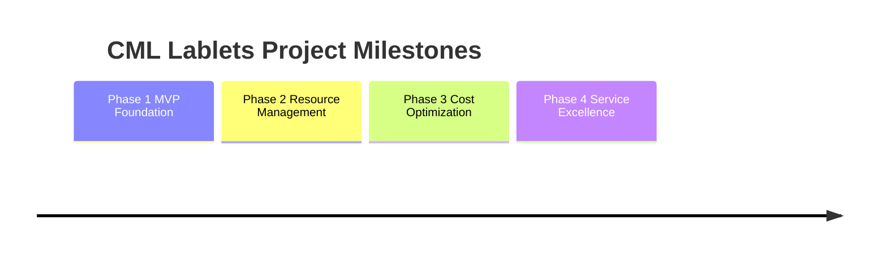

# Project Milestones

This document tracks major milestones across all phases of the CML Lablets project, providing a centralized view of key deliverables, decision points, and success criteria.

## Milestone Overview

The CML Lablets project is structured around major milestones that mark critical achievements and phase transitions. Each milestone includes specific success criteria, deliverables, and stakeholder approval requirements.



## Milestone Details

=== "Phase 1: MVP & Foundation"

    ```mermaid
    timeline
        title CML Lablets Project Milestones

        section Phase 1 MVP Foundation
            Aug 2025 : M1.1 Platform Foundation
                    : CML v2.9 deployment
                    : Infrastructure monitoring
            Sep 2025 : M1.2 Content Development 50%
                    : 3 of 6 lablet definitions
                    : LabletsStage environment
            Oct 2025 : M1.3 Integration Testing
                    : All 6 lablets validated
                    : ALII protocol integration
            Nov 2025 : M1.4 MVP Delivery
                    : Production environment
                    : Lab access under 5 min
    ```

    === "M1.1: Platform Foundation"

        **Target Date:** August 31, 2025
        **Status:** 🟡 Planned

        #### Success Criteria
        - [ ] CML v2.9 deployed and operational in CmlStage
        - [ ] AMI and VMware images built and tested
        - [ ] Basic infrastructure monitoring in place
        - [ ] Security and network configurations validated

        #### Key Deliverables
        - Operational CML v2.9 environment
        - Standardized AMI/VMware image templates
        - Infrastructure monitoring dashboard
        - Network and security baseline documentation

        #### Stakeholders & Approval
        - **Technical Lead:** Infrastructure validation
        - **Security Team:** Security controls approval
        - **Operations:** Monitoring and alerting setup

    === "M1.2: Content Development 50%"

        **Target Date:** September 30, 2025
        **Status:** 🟡 Planned

        #### Success Criteria
        - [ ] 3 of 6 Lablet Definitions in development
        - [ ] LabletsStage environment ready for testing
        - [ ] First lablet successfully deployed and tested
        - [ ] EPM teams onboarded and productive

        #### Key Deliverables
        - DEVASC, AUTOCOR, SCOR lablet definitions (draft)
        - LabletsStage environment operational
        - Content development processes documented
        - EPM team training completion

        #### Stakeholders & Approval
        - **EPM Teams:** Content quality validation
        - **Technical Teams:** Environment readiness
        - **Project Manager:** Schedule and resource validation

    === "M1.3: Integration Testing"

        **Target Date:** October 31, 2025
        **Status:** 🟡 Planned

        #### Success Criteria
        - [ ] All 6 Lablet Definitions tested and validated
        - [ ] ALII protocol integration working
        - [ ] Performance baselines established
        - [ ] PVUE integration validated

        #### Key Deliverables
        - Complete test results and validation reports
        - Performance benchmark documentation
        - Integration test procedures
        - Issue tracking and resolution log

        #### Stakeholders & Approval
        - **QA Team:** Test completion and quality gates
        - **Technical Lead:** Integration validation
        - **Operations:** Performance acceptance

    === "M1.4: MVP Delivery"

        **Target Date:** November 28, 2025
        **Status:** 🟡 Planned

        #### Success Criteria
        - [ ] Production environment deployed and stable
        - [ ] All 6 Lablet Definitions operational
        - [ ] < 5 minute lab initialization time achieved
        - [ ] Support procedures operational

        #### Key Deliverables
        - Production CML Lablets platform
        - Complete operational documentation
        - Support team training and procedures
        - Success metrics and lessons learned report

        #### Stakeholders & Approval
        - **Executive Sponsor:** Business objectives met
        - **Product Owner:** Feature completeness
        - **Operations Manager:** Operational readiness

=== "Phase 2: Resource Management"

    ```mermaid
    timeline
        title CML Lablets Project Milestones

        section Phase 2 Resource Management
            Dec 2025 : M2.1 Architecture Migration
                    : pyLDS architecture design
                    : Mozart integration planning
            Jan 2026 : M2.2 Resource Manager MVP
                    : Resource pool management
                    : Basic scaling algorithms
            Feb 2026 : M2.3 Production Migration
                    : perl-LDS to pyLDS migration
                    : Lab access under 2 min

    ```

    === "M2.1: Architecture Migration"

        **Target Date:** December 31, 2025
        **Status:** 🟡 Planned

        #### Success Criteria
        - [ ] pyLDS architecture designed and approved
        - [ ] Mozart integration planning complete
        - [ ] Development environment configured
        - [ ] Migration strategy validated

        #### Key Deliverables
        - pyLDS technical architecture document
        - Mozart integration specifications
        - Migration roadmap and risk assessment
        - Development environment setup

        #### Stakeholders & Approval
        - **Architecture Review Board:** Design approval
        - **Technical Lead:** Implementation feasibility
        - **Operations:** Migration impact assessment

    === "M2.2: Resource Manager MVP"

        **Target Date:** January 31, 2026
        **Status:** 🟡 Planned

        #### Success Criteria
        - [ ] Resource pool management operational
        - [ ] Basic scaling algorithms implemented
        - [ ] Health monitoring and cleanup working
        - [ ] Performance improvements validated

        #### Key Deliverables
        - Resource Pool Manager system
        - Scaling and lifecycle management
        - Monitoring and alerting enhancements
        - Performance comparison vs Phase 1

        #### Stakeholders & Approval
        - **Technical Lead:** System functionality validation
        - **Performance Team:** Performance criteria met
        - **Operations:** Operational procedures updated

    === "M2.3: Production Migration"

        **Target Date:** February 28, 2026
        **Status:** 🟡 Planned

        #### Success Criteria
        - [ ] Complete migration from perl-LDS to pyLDS
        - [ ] < 2 minute lab access time achieved
        - [ ] 20+ concurrent users supported
        - [ ] Zero data loss during migration

        #### Key Deliverables
        - Fully migrated production system
        - Enhanced user experience validation
        - Migration completion report
        - Updated operational procedures

        #### Stakeholders & Approval
        - **Business Owner:** User experience validation
        - **Technical Lead:** Migration success confirmation
        - **Operations:** System stability confirmation

=== "Phase 3: Cost Optimization"

    ```mermaid
    timeline
        title CML Lablets Project Milestones

        section Phase 3 Cost Optimization
            Mar 2026 : M3.1 Advanced Resource Optimization
                    : Intelligent resource allocation
                    : 50% cost reduction target
            Apr 2026 : M3.2 Mozart Integration
                    : Full cloud orchestration
                    : Multi-cloud capabilities
            May 2026 : M3.3 Performance Enhancement
                    : Lab access under 1 min
                    : 50+ concurrent users
            Aug 2026 : M3.4 Cost Optimization Engine
                    : Predictive scaling algorithms
                    : Analytics dashboard
            Oct 2026 : M3.5 Full Scale Validation
                    : 100+ concurrent users
                    : 40% cost reduction achieved

    ```

    === "M3.1: Advanced Resource Optimization"

        **Target Date:** March 31, 2026
        **Status:** 🟡 Planned

        #### Success Criteria
        - [ ] Intelligent resource allocation implemented
        - [ ] 50% cost reduction vs Phase 1 achieved
        - [ ] Advanced scaling algorithms operational
        - [ ] Resource sharing capabilities active

        #### Key Deliverables
        - Advanced resource allocation engine
        - Cost optimization reporting system
        - Resource sharing implementation
        - Performance and cost metrics validation

        #### Stakeholders & Approval
        - **Finance Team:** Cost reduction validation
        - **Technical Lead:** System performance maintained
        - **Operations:** Resource efficiency confirmation

    === "M3.2: Mozart Integration"

        **Target Date:** April 30, 2026
        **Status:** 🟡 Planned

        #### Success Criteria
        - [ ] Full Mozart cloud orchestration active
        - [ ] Multi-cloud deployment capabilities
        - [ ] Enhanced monitoring and analytics
        - [ ] Service reliability improved

        #### Key Deliverables
        - Mozart cloud orchestration system
        - Multi-cloud deployment framework
        - Enhanced monitoring dashboard
        - Service reliability improvements

        #### Stakeholders & Approval
        - **Cloud Architect:** Multi-cloud strategy validation
        - **Technical Lead:** Integration success confirmation
        - **Operations:** Cloud operations procedures

    === "M3.3: Performance Enhancement"

        **Target Date:** May 31, 2026
        **Status:** 🟡 Planned

        #### Success Criteria
        - [ ] < 1 minute lab access time achieved
        - [ ] 50+ concurrent users supported
        - [ ] 50% cost reduction maintained
        - [ ] All performance targets exceeded

        #### Key Deliverables
        - Performance enhancement completion report
        - Cost reduction validation report
        - Enhanced system capabilities documentation
        - Updated operational procedures

        #### Stakeholders & Approval
        - **Business Owner:** Performance validation
        - **Finance Team:** Cost targets confirmed
        - **Technical Lead:** System reliability confirmed

    === "M3.4: Cost Optimization Engine Operational"

        **Target Date:** August 31, 2026
        **Status:** 🟡 Planned

        #### Success Criteria

        - [ ] Cost optimization algorithms deployed
        - [ ] Predictive scaling operational
        - [ ] Analytics dashboard functional
        - [ ] 20% cost reduction demonstrated

        #### Key Deliverables

        - Cost optimization system
        - Advanced analytics platform
        - Predictive scaling algorithms
        - Cost reduction validation report

        #### Stakeholders & Approval

        - **Finance Team:** Cost reduction validation
        - **Technical Lead:** System performance
        - **Operations:** Operational complexity assessment

    === "M3.5: Full Scale Validation (Phase 3 Complete)"

        **Target Date:** October 31, 2026
        **Status:** 🟡 Planned

        #### Success Criteria

        - [ ] 100+ concurrent users supported
        - [ ] 40% cost reduction achieved
        - [ ] < 1 minute lab access time
        - [ ] 99.9% system availability

        #### Key Deliverables

        - Production-scale system validation
        - Cost optimization achievement report
        - Performance and scale benchmarks
        - Project completion documentation

        #### Stakeholders & Approval

        - **Executive Sponsor:** Business case validation
        - **Technical Lead:** Technical objectives achieved
        - **Finance:** ROI validation and approval

=== "Phase 4: Service Excellence"

    ```mermaid
    timeline
        title CML Lablets Project Milestones

        section Phase 4 Service Excellence
            Oct 2025 : M4.1 AI Cloud Foundation
                    : AI platform architecture
                    : Hybrid cloud connectivity
            Mar 2026 : M4.2 Cloud Service Integration
                    : Webex Intersight Meraki
                    : Multi-cloud service mesh
            Jun 2026 : M4.3 Advanced AI Infrastructure
                    : Air-gapped LLM deployment
                    : Vector database MCP tools
            Dec 2026 : M4.4 AI-Enhanced Platform
                    : Conversational lab interface
                    : Predictive learning pathways
    ```

    === "M4.1: AI & Cloud Foundation"

        **Target Date:** October 31, 2025
        **Status:** 🟡 Planned

        #### Success Criteria
        - [ ] AI platform architecture designed and deployed
        - [ ] Basic hybrid cloud connectivity established
        - [ ] Initial AI-powered user experience features operational
        - [ ] Core AI infrastructure components deployed

        #### Key Deliverables
        - AI platform architecture and infrastructure
        - Hybrid cloud connectivity framework
        - Natural language lab interface (basic)
        - AI-powered lab provisioning algorithms

        #### Stakeholders & Approval
        - **AI/Cloud Architect:** Technical architecture validation
        - **Security Team:** Hybrid security model approval
        - **Technical Lead:** Integration with existing phases

    === "M4.2: Cloud Service Integration"

        **Target Date:** March 31, 2026
        **Status:** 🟡 Planned

        #### Success Criteria
        - [ ] Webex integration operational
        - [ ] Intersight connectivity established
        - [ ] Meraki cloud integration functional
        - [ ] Multi-cloud service mesh deployed

        #### Key Deliverables
        - Complete cloud service integration framework
        - Hybrid lablet scenarios and use cases
        - Cloud service API integration layer
        - Comprehensive cloud connectivity validation

        #### Stakeholders & Approval
        - **Cloud Services Team:** Integration validation
        - **Network Team:** Hybrid connectivity approval
        - **Product Owner:** Cloud feature acceptance

    === "M4.3: Advanced AI Infrastructure"

        **Target Date:** June 30, 2026
        **Status:** 🟡 Planned

        #### Success Criteria
        - [ ] Air-gapped LLM deployment operational
        - [ ] Vector database infrastructure functional
        - [ ] Custom model training pipeline established
        - [ ] MCP tools integration complete

        #### Key Deliverables
        - Advanced AI/ML infrastructure platform
        - Custom model training and deployment system
        - Vector database and embeddings services
        - MCP tools integration framework

        #### Stakeholders & Approval
        - **AI/ML Team:** Infrastructure validation
        - **Security Team:** Air-gapped security approval
        - **Operations:** AI infrastructure operability

    === "M4.4: AI-Enhanced Platform"

        **Target Date:** December 31, 2026
        **Status:** 🟡 Planned

        #### Success Criteria
        - [ ] Conversational lab interface operational
        - [ ] AI-powered troubleshooting functional
        - [ ] Intelligent assessment and grading deployed
        - [ ] Predictive learning pathways established

        #### Key Deliverables
        - Complete AI-enhanced platform
        - Conversational interface and AI assistant
        - Advanced AI-powered analytics and insights
        - Comprehensive AI-driven learning experience

        #### Stakeholders & Approval
        - **Executive Sponsor:** AI platform business value validation
        - **AI/Cloud Architect:** Complete technical implementation
        - **Product Owner:** AI feature portfolio acceptance

## Success Metrics & Tracking

=== "Technical Progression"

    | Metric              | Phase 1 Target | Phase 2 Target | Phase 3 Target | Phase 4 Target |
    | ------------------- | -------------- | -------------- | -------------- | -------------- |
    | Lab Access Time     | < 5 minutes    | < 2 minutes    | < 1 minute     | < 30 seconds   |
    | Concurrent Users    | 10             | 20+            | 100+           | 1000+          |
    | System Availability | > 99.5%        | > 99.7%        | > 99.9%        | > 99.95%       |
    | Labs per Node       | 1:1            | 1:1            | 3-5:1          | 5-10:1         |
    | AI Integration      | Basic          | Enhanced       | Optimized      | Advanced       |

=== "Business Progression"

    | Metric               | Phase 1 Target | Phase 2 Target | Phase 3 Target | Phase 4 Target |
    | -------------------- | -------------- | -------------- | -------------- | -------------- |
    | Cost Reduction       | Baseline       | Maintain       | 40% reduction  | 60% reduction  |
    | Manual Intervention  | Baseline       | 60% reduction  | 80% reduction  | 95% reduction  |
    | User Satisfaction    | > 85%          | > 90%          | > 95%          | > 98%          |
    | ROI                  | Investment     | Break-even     | Positive       | 3:1 ROI        |
    | AI-Enhanced Features | 0              | 25%            | 50%            | 90%            |

=== "Risk & Dependencies"

    #### Cross-Phase Dependencies
    - **Phase 1 → Phase 2:** Stable platform foundation required
    - **Phase 2 → Phase 3:** Resource management capabilities required
    - **Phase 4 ↔ All Phases:** Continuous integration and enhancement (parallel)
    - **All Phases:** Stakeholder approval and team availability
    - **Phase 4 Dependencies:** AI/ML expertise, cloud service partnerships, security clearances

    #### Critical Path Risks
    1. **Resource Availability:** Team capacity constraints
    2. **Technical Complexity:** Integration and migration challenges
    3. **Stakeholder Alignment:** Changing requirements or priorities
    4. **External Dependencies:** CML platform updates or AWS changes

=== "Review Process"

    #### Monthly Reviews
    - Progress against milestone targets
    - Risk assessment and mitigation updates
    - Resource allocation and constraint identification
    - Stakeholder communication and alignment

    #### Milestone Gates
    Each milestone includes:
    - **Go/No-Go Decision Point:** Continue to next phase or address issues
    - **Stakeholder Approval:** Formal sign-off on deliverables
    - **Lessons Learned:** Capture insights for future phases
    - **Resource Planning:** Adjust allocations for upcoming milestones

=== "Success Validation"

    #### Technical Validation
    - Automated testing and performance benchmarking
    - Security and compliance validation
    - Operational readiness assessment
    - User acceptance testing

    #### Business Validation
    - Stakeholder satisfaction surveys
    - Cost-benefit analysis updates
    - ROI calculations and projections
    - Competitive positioning assessment

## Related Documentation

- [Project Timeline](timeline.md) - Overall project roadmap
- [Phase 1 Details](phase1-mvp-aps.md) - Detailed Phase 1 planning
- [Phase 2 Details](phase2-resource-manager.md) - Resource Manager implementation
- [Phase 3 Details](phase3-cost-optimization.md) - Cost optimization strategy
- [Project Team](team.md) - Team structure and responsibilities
