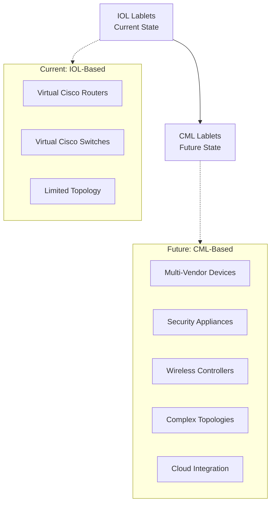

---
tags:
  - project
  - overview
  - executive
  - transformation
  - strategy
---

# Project Overview

## What is the CML Lablets Project?

The CML Lablets Project represents a **strategic transformation** of Cisco's certification lab delivery platform. This long-term initiative modernizes how hands-on lab experiences are delivered within certification exams.

### The Evolution

## Project Scope

### Core Components

The CML Lablets project encompasses several interconnected components:

1. **Lablet Resources Manager Engine**

   - Dynamic resource allocation and management
   - Automated scaling based on demand and schedule
   - Integration with Cisco Modeling Labs (CML) platform

2. **Enhanced Lab Topology Support**

   - Multi-VM network environments
   - Complex, realistic network scenarios
   - Support for diverse device types and vendors

3. **Improved Assessment Platform**

   - Automated grading and verification
   - Real-time performance monitoring
   - Enhanced candidate experience

4. **Integration Infrastructure**
   - Seamless integration with existing certification systems
   - API-driven resource management
   - Monitoring and reporting capabilities

### Key Objectives

Based on the [project objectives](../tmp/docs/objectives.md), our primary goals include:

#### Primary Objectives

- **Resource Optimization**: Efficient allocation of CPU, memory, and storage for optimal performance
- **Scalability**: Dynamic scaling of lab instances based on demand and scheduling requirements
- **Lifecycle Management**: Automated deployment, monitoring, and decommissioning of lab instances
- **CML Integration**: Seamless integration with Cisco Modeling Labs capabilities
- **High Availability**: Resilient service with quick recovery and minimal downtime
- **Security**: Robust security measures for data protection and secure communication

#### Secondary Objectives

- **User-Friendly API**: Well-documented interface for system integration
- **Monitoring & Reporting**: Comprehensive tracking of resource usage and performance metrics
- **Cost Efficiency**: Optimized resource usage to reduce operational costs
- **Compliance**: Adherence to relevant standards and governance policies
- **Extensibility**: Future-ready architecture for enhancements and integrations
- **Documentation & Support**: Thorough resources for effective utilization

## Strategic Impact

### For Cisco Certification Programs

This project positions Cisco certification programs at the forefront of hands-on assessment technology:

- **Competitive Advantage**: Leading-edge simulation capabilities
- **Assessment Fidelity**: More realistic, complex scenarios
- **Program Expansion**: Support for emerging technologies and multi-vendor scenarios

### For Candidates

Enhanced lab experiences that better prepare candidates for real-world challenges:

- **Realistic Environments**: Multi-vendor, complex topologies
- **Modern Technologies**: Cloud, SD-WAN, security, and wireless scenarios
- **Improved Performance**: Faster lab initialization and more reliable experiences

### For Operations

Streamlined operations with intelligent resource management:

- **Efficiency**: Automated resource allocation and lifecycle management
- **Scalability**: Elastic capacity to handle varying demand
- **Reliability**: Reduced manual intervention and improved system stability

## 🚀 Why This Transformation Matters

### For Certification Programs

- **Enhanced Realism**: Multi-vendor network topologies that mirror real-world environments
- **Expanded Coverage**: Support for security appliances, wireless controllers, and third-party devices
- **Modern Technologies**: Cloud, SD-WAN, and contemporary networking scenarios

### For Exam Delivery

- **Scalable Platform**: Efficient resource management and dynamic allocation
- **Reliable Performance**: Reduced initialization delays and improved user experience
- **Future-Ready**: Built on Cisco's latest simulation technology

!!! cisco "Key Transformation"
**From**: IOL-based Lablets (limited to virtual Cisco routers and switches only)
**To**: CML-based Lablets (supporting complex network topologies with multiple VM-based devices)

## 🏗️ The Big Picture

This project represents a **long-term strategic initiative** that will fundamentally enhance our certification lab delivery capabilities. We're not just upgrading technology - we're expanding what's possible in certification assessment.

!!! success "Strategic Value" - **Innovation**: Leading-edge simulation technology - **Scalability**: Cloud-native, elastic resource management - **Flexibility**: Support for diverse technology stacks - **Quality**: Enhanced candidate experience and assessment fidelity

---

**Next Steps**: Learn about the specific [Benefits & Capabilities](benefits.md) that CML Lablets will provide, or explore role-specific guidance for [Exam PMs](../users/exam-pms/guide.md) and [Managers](../users/managers/guide.md).
