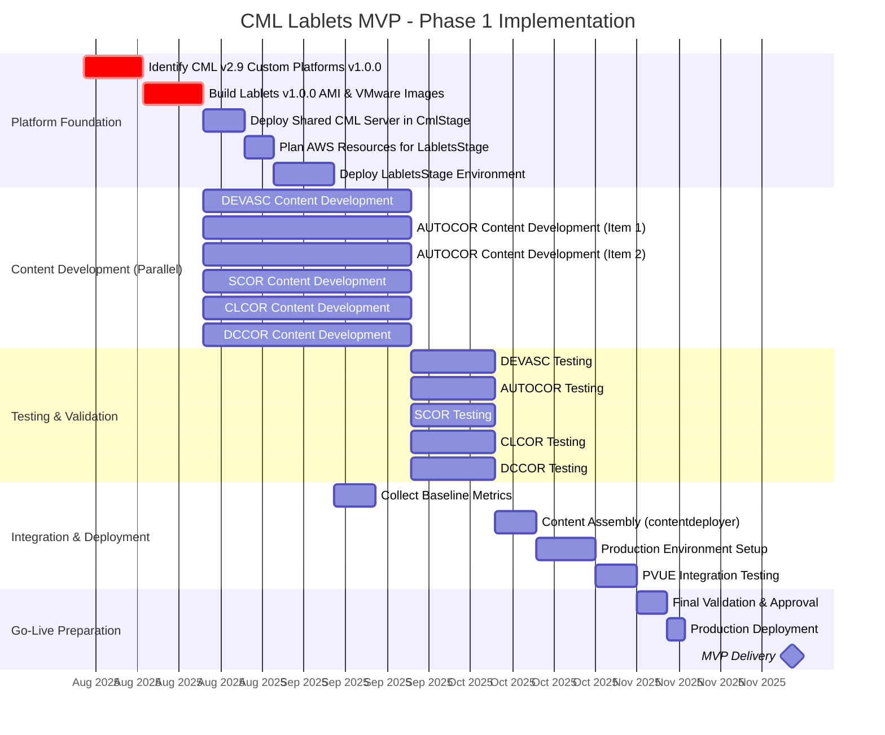
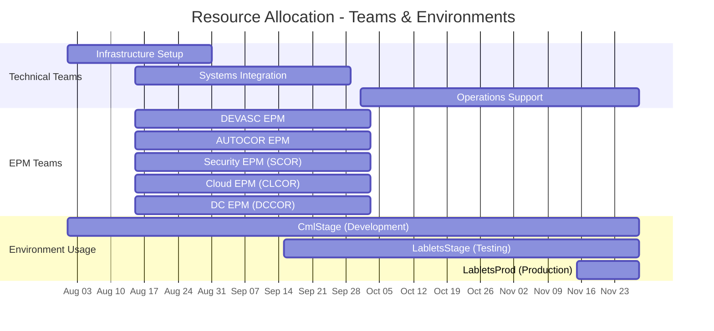
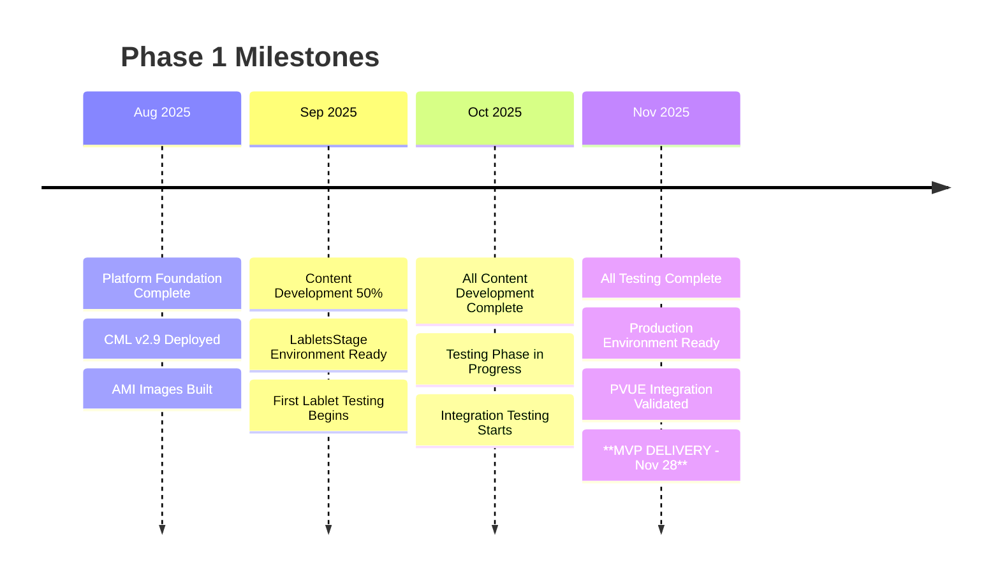

# Phase 1: MVP CML Lablet for Select APS Track

**Timeline:** August 2025 - November 2025
**Completion Target:** End of November 2025
**Project Phase:** Foundation & MVP Delivery

## Overview

Phase 1 establishes the foundational CML Lablets platform and delivers the first MVP with 6 Lablet Definitions for core APS certification tracks. This phase focuses on integration with existing systems while delivering immediate value to certification teams.

## Detailed Timeline

## Critical Path Dependencies

### Platform Dependencies (Sequential)

1. **CML Platform Setup** → **AMI/Image Building** → **Environment Deployment**
2. **LabletsStage Ready** → **Content Testing** → **Production Deployment**

### Content Development (Parallel)

All 6 Lablet Definitions can be developed simultaneously:

- **DEVASC**: Software development automation scenarios
- **AUTOCOR (2 items)**: Network automation use cases
- **SCOR**: Security operations scenarios
- **CLCOR**: Cloud infrastructure scenarios
- **DCCOR**: Data center operations scenarios

### Integration Points

- All content development depends on **AMI/Image availability**
- Testing phase requires **LabletsStage environment**
- Production deployment requires **all testing complete**

## Resource Allocation Timeline

## Key Deliverables

### Technical Deliverables

- **CML v2.9 Platform**: Deployed and configured for lablet hosting
- **AMI & VMware Images**: Standardized images for consistent lab environments
- **6 Lablet Definitions**: Complete automation scripts and configurations
- **perl-LDS Integration**: Seamless integration with existing learning delivery system
- **ALII Protocol**: Communication layer between systems

### Operational Deliverables

- **Environment Setup**: CmlStage, LabletsStage, and LabletsProd environments
- **Monitoring & Alerting**: Basic operational visibility
- **Documentation**: Technical setup guides and operational runbooks
- **Support Procedures**: Escalation paths and troubleshooting guides

## Success Criteria & Metrics

### Technical Success Criteria

- [ ] **Platform Performance**: < 5 minute lab initialization time
- [ ] **System Availability**: > 99.5% during testing windows
- [ ] **Content Quality**: All 6 Lablet Definitions pass validation
- [ ] **Integration**: ALII protocol working with perl-LDS

### Business Success Criteria

- [ ] **Delivery Date**: MVP delivered by November 28, 2025
- [ ] **Resource Constraints**: Minimal platform changes (per Phase 1 scope)
- [ ] **Operational Readiness**: Support team trained and ready
- [ ] **Compliance**: Manager approval for all content

## Risk Mitigation

| Risk Category                    | Mitigation Start | Duration | Owner           | Status |
| -------------------------------- | ---------------- | -------- | --------------- | ------ |
| **CML Platform Scaling**         | Aug 1            | 2 weeks  | Technical Teams | ⏳     |
| **AWS Resource Provisioning**    | Aug 15           | 1 week   | Infrastructure  | ⏳     |
| **Content Migration Complexity** | Sep 1            | 4 weeks  | EPM Teams       | ⏳     |
| **Integration Testing**          | Oct 15           | 2 weeks  | Systems Team    | ⏳     |
| **PVUE Protocol Changes**        | Nov 1            | 1 week   | Technical Teams | ⏳     |

## Key Milestones & Gates

## Constraints & Assumptions

### Technology Constraints

- Must integrate with existing perl-LDS and SVN systems
- CML v2.9 platform limitations and capabilities
- AWS infrastructure and security requirements
- Existing network and security policies

### Resource Constraints

- Limited to existing team capacity
- Budget constraints for AWS resources
- EPM team availability for content development
- Testing environment capacity

### Timeline Constraints

- Hard deadline of November 28, 2025
- Holiday periods affecting team availability
- Dependency on external team deliverables
- Integration testing windows

### Scope Constraints

- 6 specific Lablet Definitions only
- No major architectural changes to existing systems
- Basic functionality without advanced features
- Focus on MVP rather than full feature set

## Transition to Phase 2

### Lessons Learned Integration

Based on Phase 1 experience, Phase 2 preparation includes:

- **Architecture Assessment**: Evaluate perl-LDS limitations
- **Resource Planning**: Plan for pyLDS + Mozart migration
- **Scalability Analysis**: Identify bottlenecks and improvement areas
- **User Feedback**: Collect feedback for UX improvements

### Handover Requirements

- Complete technical documentation
- Operational procedures and troubleshooting guides
- Performance baselines and metrics
- Stakeholder feedback and improvement recommendations

## Related Documentation

- [Project Timeline Overview](timeline.md) - High-level project roadmap
- [Phase 2: Resource Manager](phase2-resource-manager.md) - Next phase details
- [Project Milestones](milestone.md) - Cross-phase milestone tracking
- [Architecture Overview](../architecture.md) - Technical architecture details
