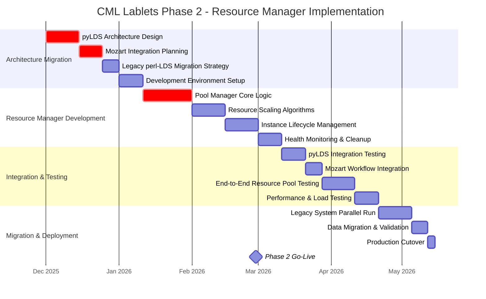
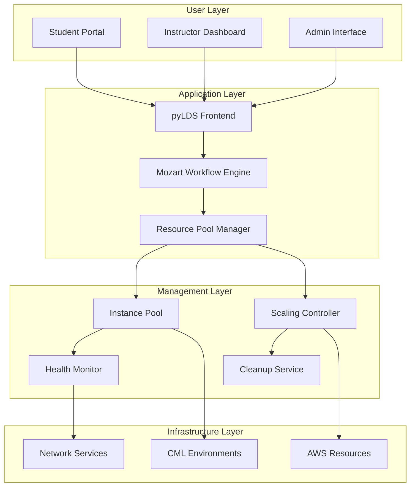
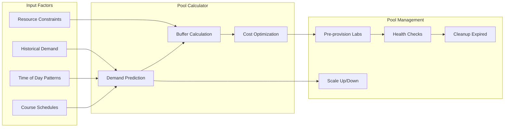
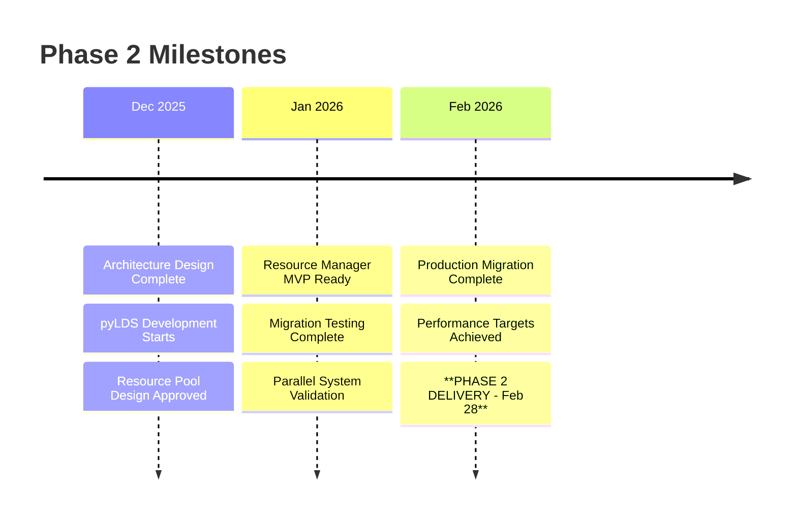

# Phase 2: MVP Resource Manager

**Timeline:** December 2025 - February 2026
**Completion Target:** FY26Q3 (February 2026)
**Project Phase:** Resource Management & UX Enhancement

## Overview

Phase 2 introduces advanced resource management capabilities to minimize user wait times and improve the overall lab experience. This phase includes migration to modern architecture (pyLDS + Mozart) and implementation of resource pooling to maintain ready-to-use LabInstances.

## Detailed Timeline

## Key Deliverables

### Technical Deliverables

- **Resource Pool Manager**: Intelligent pooling system for LabInstances
- **pyLDS Integration**: Modern learning delivery system implementation
- **Mozart Workflow Engine**: Enhanced automation and orchestration
- **Scaling Algorithms**: Dynamic resource allocation based on demand patterns
- **Monitoring Dashboard**: Real-time visibility into resource utilization

### Operational Deliverables

- **Migration Procedures**: Complete cutover from perl-LDS to pyLDS
- **Operational Runbooks**: Enhanced monitoring and troubleshooting guides
- **Performance Baselines**: Established metrics for < 2-minute lab access
- **Support Documentation**: Updated procedures for new architecture

## Resource Manager Architecture

## Success Criteria & Metrics

### Technical Success Criteria

- [ ] **Lab Access Time**: < 2 minutes from request to ready lab
- [ ] **System Availability**: > 99.7% during business hours
- [ ] **Pool Efficiency**: 90%+ of requests served from ready pool
- [ ] **Resource Utilization**: Optimize costs while maintaining performance
- [ ] **Migration Success**: Zero data loss during perl-LDS to pyLDS migration

### Business Success Criteria

- [ ] **User Experience**: 95%+ user satisfaction with lab access speed
- [ ] **Concurrent Users**: Support 20+ simultaneous lab sessions
- [ ] **Operational Efficiency**: 60% reduction in manual intervention
- [ ] **Cost Management**: Maintain or reduce infrastructure costs vs Phase 1

## Resource Pool Strategy

### Pool Sizing Algorithm

### Pool Types

1. **Hot Pool**: Fully provisioned and ready labs
2. **Warm Pool**: Pre-configured but not fully initialized
3. **Cold Pool**: Available resources for on-demand provisioning

## Migration Strategy

### Phase 2A: Parallel Architecture (December 2025)

- Deploy pyLDS alongside existing perl-LDS
- Implement basic resource pooling
- Test integration with Mozart workflows
- Validate performance improvements

### Phase 2B: Gradual Migration (January 2026)

- Migrate low-risk lablets to new system
- Monitor performance and user feedback
- Address any integration issues
- Prepare for full cutover

### Phase 2C: Complete Migration (February 2026)

- Complete cutover from perl-LDS to pyLDS
- Full resource pool activation
- Remove legacy system dependencies
- Validate all success criteria

## Risk Mitigation

| Risk Category                   | Probability | Impact | Mitigation Strategy                       | Owner            |
| ------------------------------- | ----------- | ------ | ----------------------------------------- | ---------------- |
| **Migration Complexity**        | Medium      | High   | Parallel system testing, phased cutover   | Technical Lead   |
| **Performance Degradation**     | Low         | High   | Extensive load testing, rollback plan     | Performance Team |
| **Resource Pool Oversizing**    | Medium      | Medium | Adaptive algorithms, cost monitoring      | Operations       |
| **Integration Issues (Mozart)** | Medium      | Medium | Early integration testing, API validation | Development      |
| **User Adoption Resistance**    | Low         | Medium | Training, change management               | Product Team     |

## Key Milestones

## Performance Targets

### Response Time Metrics

- **Lab Request to Ready**: < 2 minutes (vs 5 minutes in Phase 1)
- **Pool Replenishment**: < 30 seconds for standard lablets
- **System Response**: < 500ms for API calls
- **Dashboard Load**: < 2 seconds for monitoring interfaces

### Resource Efficiency Metrics

- **Pool Hit Rate**: > 90% requests served from ready pool
- **Resource Waste**: < 10% of provisioned resources unused
- **Scaling Response**: < 1 minute to adapt to demand changes
- **Cost Per Session**: 20% reduction vs Phase 1

## Technology Stack

### Core Components

- **pyLDS**: Modern Python-based learning delivery system
- **Mozart**: Workflow orchestration and automation engine
- **Redis**: Fast caching layer for pool state management
- **PostgreSQL**: Persistent storage for configuration and metrics
- **Prometheus/Grafana**: Monitoring and alerting infrastructure

### Integration Points

- **CML API**: Direct integration for lab provisioning
- **AWS APIs**: Resource management and scaling
- **LDAP/SSO**: User authentication and authorization
- **Notification Services**: Email and webhook integrations

## Transition to Phase 3

### Preparation for Phase 3

- **Multi-tenancy Architecture**: Design for multiple labs per node
- **Advanced Analytics**: Collect detailed usage patterns
- **Cost Optimization Framework**: Establish baseline for Phase 3 improvements
- **Scalability Assessment**: Plan for 100+ concurrent users

### Success Handover

- Complete architecture documentation
- Performance benchmarks and optimization opportunities
- User feedback and feature requests for Phase 3
- Operational procedures and lessons learned

## Related Documentation

- [Project Timeline Overview](timeline.md) - High-level project roadmap
- [Phase 1: MVP APS](phase1-mvp-aps.md) - Previous phase foundation
- [Phase 3: Cost Optimization](phase3-cost-optimization.md) - Next phase planning
- [Architecture Overview](../architecture.md) - Technical architecture evolution
