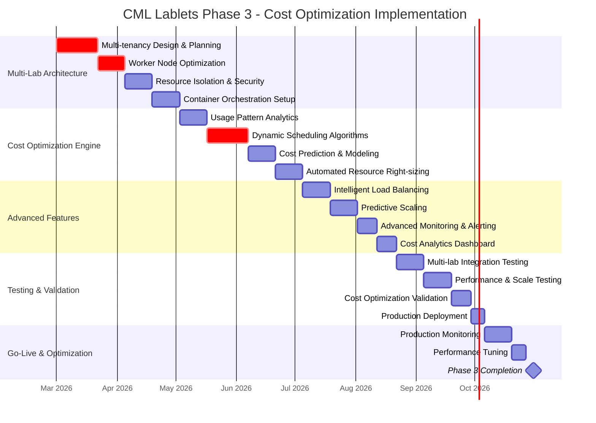
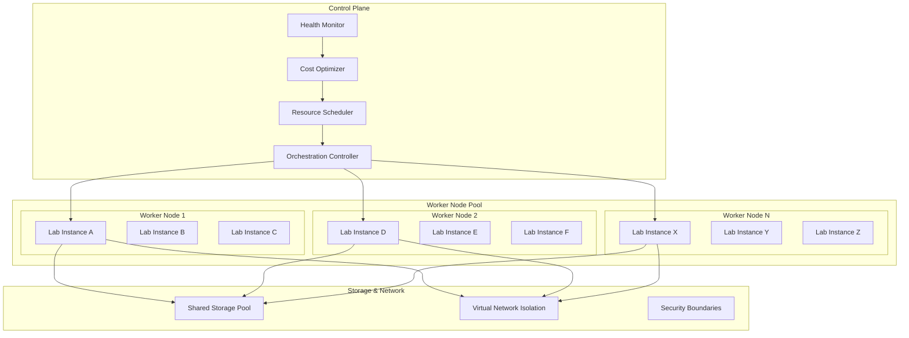
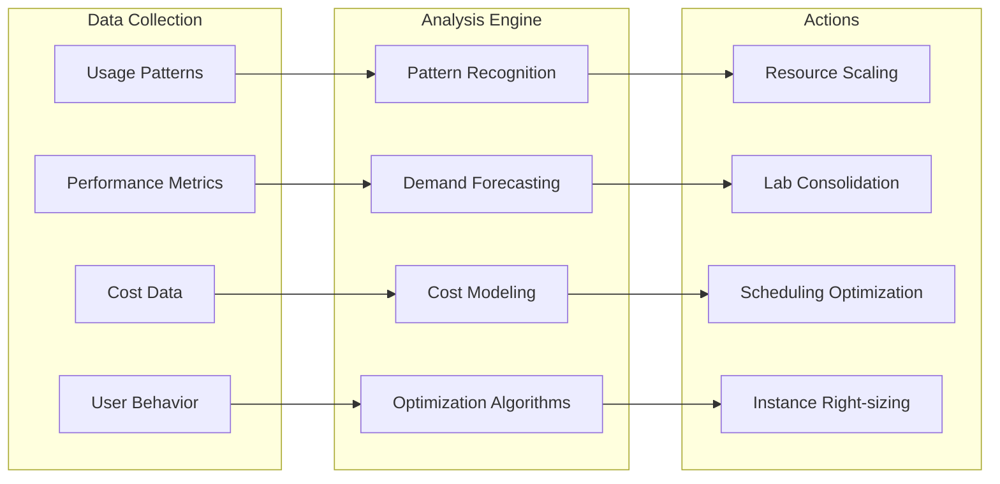

# Phase 3: Dynamic Cost Optimization

**Timeline:** March 2026 - October 2026
**Completion Target:** FY27Q1 (October 2026)
**Project Phase:** Advanced Optimization & Scale

## Overview

Phase 3 implements sophisticated cost optimization strategies through multi-lab deployment per worker node, advanced resource scheduling algorithms, and comprehensive analytics. This phase transforms the platform into a highly efficient, cost-effective solution supporting large-scale concurrent usage.

## Detailed Timeline

## Key Deliverables

### Technical Deliverables

- **Multi-Lab Orchestration**: Support multiple labs per worker node
- **Cost Optimization Engine**: AI-driven resource allocation algorithms
- **Advanced Analytics Platform**: Comprehensive usage and cost insights
- **Predictive Scaling**: Proactive resource management based on demand forecasting
- **Intelligent Load Balancing**: Optimal distribution across available resources

### Operational Deliverables

- **Cost Reduction**: 40%+ infrastructure cost savings
- **Scale Enhancement**: Support for 100+ concurrent lab sessions
- **Advanced Monitoring**: Real-time cost and performance dashboards
- **Automated Operations**: Self-healing and self-optimizing platform

## Multi-Lab Architecture

## Success Criteria & Metrics

### Technical Success Criteria

- [ ] **Multi-Lab Density**: 3-5 labs per worker node (vs 1:1 in Phase 2)
- [ ] **Lab Access Time**: < 1 minute from request to ready lab
- [ ] **System Availability**: > 99.9% with automated failover
- [ ] **Resource Utilization**: > 80% average worker node utilization
- [ ] **Concurrent Scale**: Support 100+ simultaneous lab sessions

### Business Success Criteria

- [ ] **Cost Reduction**: 40%+ reduction in infrastructure costs vs Phase 2
- [ ] **ROI Achievement**: Positive return on investment
- [ ] **Operational Efficiency**: 80% reduction in manual intervention
- [ ] **User Experience**: < 1% user-reported performance issues

## Cost Optimization Strategies

### Dynamic Resource Allocation

### Cost Optimization Techniques

1. **Bin Packing Optimization**: Maximize lab density per worker node
2. **Temporal Load Shifting**: Schedule resource-intensive operations during off-peak
3. **Intelligent Preemption**: Gracefully deallocate unused resources
4. **Predictive Shutdown**: Proactively scale down based on usage patterns

## Advanced Analytics & Intelligence

### Machine Learning Components

- **Demand Prediction**: Forecast resource needs based on historical patterns
- **Anomaly Detection**: Identify unusual usage patterns or performance issues
- **Cost Optimization**: Continuous learning for improved resource allocation
- **Performance Tuning**: Automated parameter optimization

### Analytics Dashboard Features

- Real-time cost tracking and projections
- Resource utilization heatmaps
- Performance trend analysis
- Cost per lab session metrics
- Predictive capacity planning

## Risk Mitigation

| Risk Category               | Probability | Impact | Mitigation Strategy                        | Owner            |
| --------------------------- | ----------- | ------ | ------------------------------------------ | ---------------- |
| **Resource Contention**     | Medium      | High   | Advanced isolation, QoS controls           | Technical Lead   |
| **Complexity Management**   | High        | Medium | Comprehensive testing, gradual rollout     | Architecture     |
| **Performance Degradation** | Medium      | High   | Extensive load testing, performance SLAs   | Performance Team |
| **Cost Model Accuracy**     | Medium      | Medium | Conservative estimates, validation periods | Operations       |
| **Multi-tenancy Security**  | Low         | High   | Security audits, isolation validation      | Security Team    |

## Implementation Phases

### Phase 3A: Multi-Lab Foundation (March - May 2026)

- **Container Orchestration**: Implement Kubernetes/Docker infrastructure
- **Resource Isolation**: Establish security boundaries between labs
- **Basic Multi-tenancy**: Deploy 2-3 labs per worker node
- **Performance Validation**: Ensure no degradation vs Phase 2

### Phase 3B: Cost Optimization Engine (June - August 2026)

- **Analytics Platform**: Deploy comprehensive monitoring and data collection
- **Optimization Algorithms**: Implement cost reduction strategies
- **Predictive Scaling**: Add demand forecasting capabilities
- **Cost Dashboard**: Real-time cost visibility and control

### Phase 3C: Scale & Polish (September - October 2026)

- **Full Scale Testing**: Validate 100+ concurrent sessions
- **Performance Optimization**: Fine-tune for maximum efficiency
- **Advanced Features**: Complete intelligent load balancing
- **Production Readiness**: Final validation and go-live

## Technology Stack Evolution

### Core Platform Components

- **Kubernetes**: Container orchestration and resource management
- **Istio/Envoy**: Service mesh for traffic management and security
- **Prometheus/Grafana**: Enhanced monitoring and alerting
- **ElasticSearch**: Log aggregation and analysis
- **TensorFlow/PyTorch**: Machine learning for optimization algorithms

### Data & Analytics

- **Apache Kafka**: Real-time data streaming
- **Apache Spark**: Large-scale data processing
- **InfluxDB**: Time-series data storage
- **Apache Airflow**: Workflow orchestration for analytics

## Performance Targets

### Resource Efficiency

- **Worker Node Utilization**: > 80% average (vs ~50% in Phase 2)
- **Lab Density**: 3-5 labs per node (vs 1:1 in Phase 2)
- **Resource Waste**: < 5% of provisioned resources unused
- **Energy Efficiency**: 30% reduction in power consumption per lab session

### Cost Metrics

- **Infrastructure Cost**: 40% reduction vs Phase 2
- **Cost Per Lab Session**: 50% reduction vs Phase 1
- **Operational Cost**: 60% reduction in manual operations
- **Total Cost of Ownership**: 35% improvement year-over-year

## Monitoring & Observability

### Key Performance Indicators (KPIs)

- Real-time resource utilization across all nodes
- Cost per lab session trending
- User experience metrics (load times, errors)
- System health and availability metrics
- Predictive maintenance alerts

### Automated Response Systems

- **Auto-scaling**: Responsive to demand fluctuations
- **Self-healing**: Automatic recovery from common failures
- **Cost Guards**: Prevent runaway resource consumption
- **Performance Optimization**: Continuous tuning of algorithms

## Success Validation

### Technical Validation

- Load testing with 100+ concurrent users
- Cost reduction measurement vs baseline
- Performance regression testing
- Security penetration testing
- Disaster recovery validation

### Business Validation

- ROI calculation and validation
- User satisfaction surveys
- Operational efficiency metrics
- Competitive benchmarking
- Stakeholder approval and sign-off

## Transition & Future Planning

### Phase 3 Completion Criteria

- All success criteria met and validated
- Production system stable for 30 days
- Cost reduction targets achieved
- User satisfaction targets met
- Complete documentation handover

### Future Considerations

- **Phase 4 Planning**: Advanced AI/ML capabilities
- **Global Expansion**: Multi-region deployment
- **Enhanced Security**: Zero-trust architecture
- **Cloud-Native Evolution**: Serverless and edge computing

## Related Documentation

- [Project Timeline Overview](timeline.md) - High-level project roadmap
- [Phase 2: Resource Manager](phase2-resource-manager.md) - Previous phase foundation
- [Architecture Overview](../architecture.md) - Technical architecture evolution
- [Cost Analysis](../requirements.md) - Business case and ROI calculations
