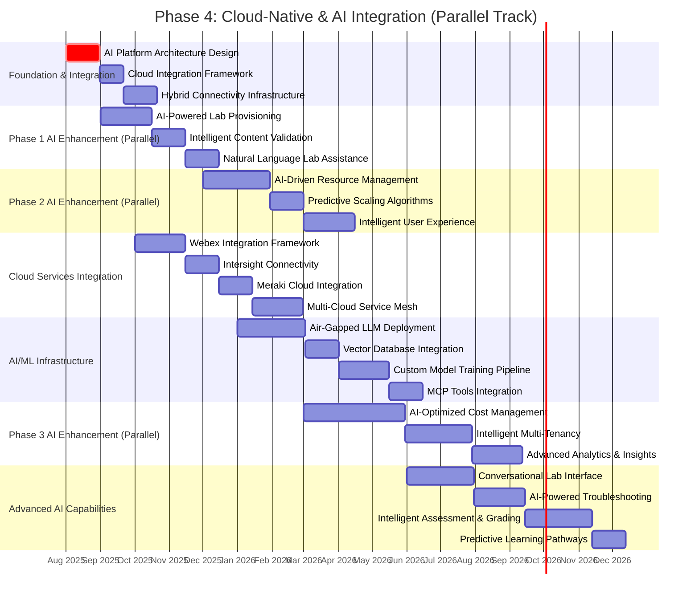

# Phase 4: Cloud-Native & AI-Driven Platform

**Timeline:** August 2025 - December 2026 (Continuous/Parallel)
**Completion Target:** Ongoing integration across all phases
**Project Phase:** Cloud-Native & AI Enhancement (Continuous)

## Overview

Phase 4 represents a continuous, parallel track that integrates cloud-native and AI-driven capabilities throughout the entire CML Lablets platform evolution. This phase enhances all other phases with hybrid cloud connectivity, AI-powered workflows, and advanced AI/ML infrastructure to create a next-generation learning platform.

## Strategic Vision

Transform the CML Lablets platform into an intelligent, cloud-native ecosystem that seamlessly integrates public cloud services, leverages AI for enhanced user experiences, and supports advanced AI/ML certification scenarios through innovative infrastructure and tooling.

## Parallel Implementation Timeline

## Core Implementation Tracks

### Track 1: Hybrid Cloud Integration

#### Public Cloud Service Connectivity

- **Webex Integration**: Real-time collaboration within lab environments
- **Intersight Integration**: Hybrid infrastructure management and monitoring
- **Meraki Integration**: Cloud-managed networking scenarios
- **Multi-Cloud Support**: AWS, Azure, GCP service integration

#### Hybrid Architecture Components

- **Cloud Service Mesh**: Secure connectivity between lab instances and cloud services
- **Identity Federation**: Seamless authentication across hybrid environments
- **Network Overlay**: Secure tunneling for hybrid cloud scenarios
- **Data Synchronization**: Real-time data sharing between on-premises and cloud

### Track 2: AI-Driven User Experience

#### Intelligent Platform Interactions

- **Natural Language Interface**: Voice and text-based lab commands
- **Conversational Lab Assistant**: AI-powered help and guidance
- **Intelligent Content Discovery**: AI-driven lab recommendation engine
- **Adaptive Learning Paths**: Personalized certification journey optimization

#### AI-Enhanced Workflows

- **Smart Lab Provisioning**: AI-optimized resource allocation
- **Predictive Issue Resolution**: Proactive problem identification and fixes
- **Intelligent Progress Tracking**: AI-powered learning analytics
- **Automated Quality Assurance**: AI-driven content validation and testing

### Track 3: Advanced AI/ML Infrastructure

#### AI-Specific Node Types

- **Air-Gapped LLM Nodes**: Secure, isolated large language model instances
- **Vector Database Nodes**: High-performance similarity search and embeddings
- **Custom Model Nodes**: Specialized AI/ML model hosting infrastructure
- **GPU Compute Nodes**: High-performance computing for AI/ML workloads

#### AI Services Integration

- **Embeddings API**: Vector representation services for semantic search
- **Custom Memory Systems**: Persistent AI conversation and context management
- **MCP (Model Context Protocol) Tools**: Advanced AI tool integration framework
- **MLOps Pipeline**: End-to-end machine learning operations infrastructure

## Phase-Specific AI Enhancements

### Phase 1 AI Integration (Aug - Nov 2025)

#### AI-Powered MVP Features

- **Intelligent Lab Initialization**: AI-optimized startup sequences
- **Natural Language Lab Commands**: Voice-activated lab control
- **Smart Content Validation**: AI-driven quality assurance
- **Predictive Resource Allocation**: ML-based resource planning

#### Success Metrics

- 30% reduction in lab setup time through AI optimization
- 95%+ accuracy in AI-powered content validation
- Natural language command success rate >90%
- User satisfaction increase of 25% with AI features

### Phase 2 AI Integration (Dec 2025 - Feb 2026)

#### AI-Enhanced Resource Management

- **Predictive Scaling**: ML algorithms for demand forecasting
- **Intelligent Pool Management**: AI-driven resource optimization
- **Smart Load Balancing**: Dynamic resource distribution
- **Automated Troubleshooting**: AI-powered issue detection and resolution

#### Success Metrics

- 50% improvement in resource utilization efficiency
- 80% reduction in manual troubleshooting interventions
- Predictive scaling accuracy >85%
- AI-driven cost optimization achieving 15% additional savings

### Phase 3 AI Integration (Mar - Oct 2026)

#### AI-Optimized Cost Management

- **Intelligent Multi-Tenancy**: AI-driven resource sharing optimization
- **Predictive Maintenance**: ML-based infrastructure health monitoring
- **Dynamic Cost Optimization**: Real-time AI-powered resource adjustments
- **Advanced Analytics**: Deep learning insights for platform optimization

#### Success Metrics

- Additional 20% cost reduction through AI optimization
- Predictive maintenance reducing downtime by 90%
- AI-driven multi-tenancy increasing density by 40%
- Platform-wide efficiency improvements of 60%

## Cloud Service Integration Specifications

### Webex Integration

- **Real-time Collaboration**: Embedded Webex sessions within lab environments
- **Screen Sharing**: Direct lab console sharing capabilities
- **Voice/Video**: Integrated communication for remote lab sessions
- **Recording & Playback**: Session capture for review and assessment

### Intersight Integration

- **Hybrid Management**: Unified management of lab and cloud infrastructure
- **Policy Automation**: Consistent policy enforcement across environments
- **Monitoring & Analytics**: Comprehensive visibility across hybrid deployments
- **Compliance Reporting**: Automated compliance validation and reporting

### Meraki Integration

- **Cloud-Managed Networking**: Meraki dashboard integration for network labs
- **SD-WAN Scenarios**: Real-world SD-WAN configuration and troubleshooting
- **Security Policies**: Cloud-managed security policy implementation
- **Network Analytics**: Advanced network performance monitoring and optimization

## AI/ML Infrastructure Architecture

### Core AI Components

#### Air-Gapped LLM Infrastructure

- **Secure Deployment**: Isolated LLM instances for sensitive scenarios
- **Custom Fine-Tuning**: Domain-specific model customization
- **High Performance**: GPU-accelerated inference for real-time responses
- **Scalable Architecture**: Dynamic scaling based on demand

#### Vector Database System

- **Semantic Search**: Advanced similarity search capabilities
- **Embeddings Management**: Efficient vector storage and retrieval
- **Real-time Updates**: Dynamic index updates for changing content
- **Multi-Modal Support**: Text, image, and audio embeddings

#### Custom Model Pipeline

- **Model Training**: End-to-end ML model development workflow
- **Version Management**: Model versioning and deployment automation
- **A/B Testing**: Automated model performance comparison
- **Continuous Learning**: Adaptive models that improve over time

## Success Criteria & Metrics

### Cloud Integration Success Metrics

- **Connectivity Reliability**: 99.9% uptime for hybrid cloud connections
- **Service Integration**: 95%+ success rate for cloud service API calls
- **Performance**: <100ms latency for cloud service interactions
- **Security**: Zero security incidents in hybrid deployments

### AI Enhancement Success Metrics

- **User Experience**: 40% improvement in task completion time
- **Accuracy**: 95%+ accuracy in AI-driven recommendations
- **Efficiency**: 60% reduction in manual platform operations
- **Learning Outcomes**: 25% improvement in certification pass rates

### Infrastructure Success Metrics

- **AI Node Performance**: <500ms response time for AI services
- **Scalability**: Support 1000+ concurrent AI-powered sessions
- **Resource Utilization**: 85%+ efficiency in AI infrastructure usage
- **Cost Effectiveness**: AI features delivering 3:1 ROI within 12 months

## Risk Management & Mitigation

### Technical Risks

- **AI Model Accuracy**: Comprehensive testing and validation frameworks
- **Cloud Service Dependencies**: Multi-provider redundancy and fallback options
- **Performance Impact**: Careful resource planning and optimization
- **Integration Complexity**: Phased rollout and extensive testing

### Security Risks

- **Data Privacy**: Air-gapped deployments for sensitive AI operations
- **Cloud Security**: Zero-trust architecture for hybrid connections
- **AI Safety**: Robust guardrails and monitoring for AI systems
- **Compliance**: Comprehensive audit trails and compliance validation

### Operational Risks

- **Team Expertise**: Comprehensive AI/ML training and skill development
- **Change Management**: Gradual introduction with extensive user training
- **Vendor Dependencies**: Multiple vendor relationships and exit strategies
- **Cost Control**: Continuous monitoring and optimization of AI/cloud costs

## Technology Stack & Dependencies

### AI/ML Technologies

- **Large Language Models**: GPT-4, Claude, Llama 2/3 variants
- **Vector Databases**: Pinecone, Weaviate, Chroma
- **ML Frameworks**: TensorFlow, PyTorch, Hugging Face Transformers
- **GPU Computing**: NVIDIA A100/H100, AMD MI250X

### Cloud Integration Technologies

- **Service Mesh**: Istio, Linkerd for hybrid connectivity
- **API Gateway**: Kong, Envoy for cloud service integration
- **Identity Management**: OAuth 2.0, SAML for federated authentication
- **Monitoring**: Prometheus, Grafana, Datadog for hybrid observability

### Development & Deployment

- **Container Orchestration**: Kubernetes with AI/ML operators
- **CI/CD**: GitLab CI, GitHub Actions for AI model deployment
- **Infrastructure as Code**: Terraform, Pulumi for cloud resource management
- **Observability**: OpenTelemetry, Jaeger for distributed tracing

## Implementation Phases & Milestones

### Phase 4A: Foundation (Aug - Dec 2025)

- AI platform architecture design and implementation
- Basic hybrid cloud connectivity establishment
- Initial AI-powered user experience features
- Core AI infrastructure deployment

### Phase 4B: Integration (Jan - Jun 2026)

- Advanced cloud service integration (Webex, Intersight, Meraki)
- Comprehensive AI/ML infrastructure deployment
- AI-enhanced workflows across all platform areas
- Advanced analytics and intelligence capabilities

### Phase 4C: Optimization (Jul - Dec 2026)

- Advanced AI capabilities (conversational interfaces, predictive analytics)
- Full hybrid cloud scenario support
- AI-driven platform optimization and automation
- Comprehensive AI-powered learning pathways

## Related Documentation

- [Project Timeline Overview](timeline.md) - Overall project roadmap and phase coordination
- [Phase 1: MVP APS](phase1-mvp-aps.md) - Foundation phase with AI enhancements
- [Phase 2: Resource Manager](phase2-resource-manager.md) - Resource management with AI optimization
- [Phase 3: Cost Optimization](phase3-cost-optimization.md) - Cost optimization with AI intelligence
- [Architecture Overview](../architecture.md) - Technical architecture including AI/cloud components
