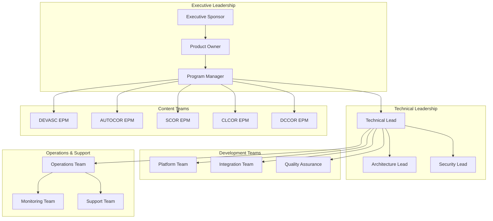

# Project Team Structure

This document outlines the team structure, roles, and responsibilities for the CML Lablets project across all three phases of development.

## Team Overview

The CML Lablets project brings together cross-functional teams with expertise in platform engineering, content development, operations, and business management. The team structure evolves across phases to match the changing technical and operational requirements.

## Organizational Structure

## Core Team Roles

### Executive Leadership

#### Executive Sponsor

**Responsibilities:**

- Overall project vision and strategic direction
- Budget approval and resource allocation
- Stakeholder communication at executive level
- Risk escalation and major decision making

**Key Activities:**

- Monthly steering committee participation
- Quarterly business review presentations
- Budget and resource planning approval

- Strategic alignment with business objectives

#### Product Owner

**Responsibilities:**

- Product vision and requirements definition

- Stakeholder management and communication
- Feature prioritization and acceptance criteria
- Go-to-market strategy and planning

**Key Activities:**

- User story definition and acceptance

- Sprint planning and review participation
- Stakeholder feedback collection and analysis
- Product roadmap development and maintenance

#### Program Manager

**Responsibilities:**

- Overall project coordination and scheduling
- Cross-team communication and dependency management
- Risk identification and mitigation planning
- Progress tracking and reporting

**Key Activities:**

- Weekly status reporting and coordination
- Risk register maintenance and escalation
- Resource planning and allocation
- Cross-phase transition planning

### Technical Leadership

#### Technical Lead

**Responsibilities:**

- Technical architecture and design decisions

- Development team leadership and guidance

- Technical risk assessment and mitigation
- Code quality and standards enforcement

**Key Activities:**

- Architecture review board participation

- Technical design documentation
- Code review and quality assurance
- Team mentoring and development

#### Architecture Lead

**Responsibilities:**

- Platform architecture design and evolution
- Integration patterns and API design
- Scalability and performance planning
- Technology stack evaluation and selection

**Key Activities:**

- Architecture documentation and diagramming
- Technology research and evaluation
- Cross-system integration design
- Performance benchmarking and optimization

#### Security Lead

**Responsibilities:**

- Security architecture and controls design
- Compliance and regulatory requirements
- Security testing and validation
- Incident response and security operations

**Key Activities:**

- Security requirements definition
- Penetration testing and vulnerability assessment
- Security controls implementation validation
- Security documentation and training

## Development Teams

### Platform Team (3-4 Engineers)

**Phase 1 Focus:**

- CML v2.9 platform setup and configuration

- AMI and VMware image building
- Basic infrastructure provisioning
- perl-LDS integration development

**Phase 2 Focus:**

- pyLDS system development and migration
- Resource pool manager implementation
- Mozart workflow engine integration
- Advanced monitoring and alerting

**Phase 3 Focus:**

- Multi-tenancy and containerization

- Cost optimization algorithms
- Predictive scaling implementation
- Advanced analytics platform

### Integration Team (2-3 Engineers)

**Responsibilities:**

- ALII protocol implementation and testing
- Cross-system API development
- Data integration and synchronization
- End-to-end testing coordination

**Key Skills Required:**

- API design and development
- System integration patterns
- Protocol development and testing

- Performance testing and optimization

### Quality Assurance Team (2-3 Engineers)

**Responsibilities:**

- Test strategy and planning
- Automated testing framework development
- Performance and load testing
- User acceptance testing coordination

**Testing Focus Areas:**

- Functional testing of lab provisioning
- Performance testing of system scalability

- Security testing of multi-tenant architecture
- Integration testing of all system components

## Content Development Teams

### EPM (Education Product Manager) Teams

Each certification track has a dedicated EPM team responsible for:

#### DEVASC EPM Team (2-3 Members)

- **Focus:** Software development automation scenarios
- **Key Deliverables:** DevOps pipeline labs, API testing environments
- **Timeline:** Phase 1 primary focus

#### AUTOCOR EPM Team (3-4 Members)

- **Focus:** Network automation use cases (2 items)
- **Key Deliverables:** Network configuration automation, troubleshooting scenarios
- **Timeline:** Phase 1 primary focus

#### SCOR EPM Team (2-3 Members)

- **Focus:** Security operations scenarios
- **Key Deliverables:** Security incident response labs, threat analysis environments
- **Timeline:** Phase 1 primary focus

#### CLCOR EPM Team (2-3 Members)

- **Focus:** Cloud infrastructure scenarios
- **Key Deliverables:** Cloud deployment labs, infrastructure as code scenarios
- **Timeline:** Phase 1 primary focus

#### DCCOR EPM Team (2-3 Members)

- **Focus:** Data center operations scenarios
- **Key Deliverables:** Data center automation labs, troubleshooting environments
- **Timeline:** Phase 1 primary focus

### Content Development Process

1. **Requirements Analysis:** Understanding certification objectives
2. **Lab Design:** Creating hands-on learning scenarios

3. **Content Development:** Building automated lab definitions
4. **Testing & Validation:** Ensuring quality and effectiveness
5. **Documentation:** Creating user guides and instructor materials

## Operations & Support Teams

### Operations Team (2-3 Engineers)

**Responsibilities:**

- Infrastructure deployment and management
- System monitoring and alerting
- Performance optimization and tuning
- Incident response and resolution

**Phase Evolution:**

- **Phase 1:** Basic operations and monitoring
- **Phase 2:** Advanced resource management operations
- **Phase 3:** Automated operations and AI-driven optimization

### Monitoring Team (1-2 Engineers)

**Responsibilities:**

- Monitoring strategy and implementation
- Dashboard and alerting configuration
- Performance metrics collection and analysis
- Operational visibility and reporting

### Support Team (2-3 Engineers)

**Responsibilities:**

- User support and troubleshooting
- Documentation maintenance

- Training and onboarding support
- Escalation handling and coordination

## Team Evolution Across Phases

### Phase 1 Team Composition (Aug - Nov 2025)

**Core Team Size:** 15-18 people

- **Technical Teams:** 8-10 engineers focused on platform foundation
- **EPM Teams:** 12-15 content developers across all tracks
- **Operations:** 3-4 engineers for basic infrastructure support

### Phase 2 Team Composition (Dec 2025 - Feb 2026)

**Core Team Size:** 12-15 people

- **Technical Teams:** 10-12 engineers focused on architecture migration
- **Content Teams:** 3-5 engineers for content migration support
- **Operations:** 4-5 engineers for enhanced resource management

### Phase 3 Team Composition (Mar - Oct 2026)

**Core Team Size:** 10-12 people

- **Technical Teams:** 8-10 engineers focused on optimization and scale

- **Content Teams:** 2-3 engineers for optimization support
- **Operations:** 3-4 engineers for advanced automation

### Phase 4 Team Composition (Aug 2025 - Dec 2026, Continuous/Parallel)

**Additional Specialized Team:** 8-12 people

- **AI/ML Engineering Team:** 4-5 engineers for AI infrastructure and model development
- **Cloud Integration Team:** 3-4 engineers for hybrid cloud connectivity and services
- **AI/UX Design Team:** 2-3 engineers for AI-enhanced user experience development
- **Cloud Security & Compliance:** 1-2 engineers for hybrid security and governance

## Skills and Competencies

### Technical Skills Required

#### Platform Engineering

- Cloud infrastructure (AWS, Kubernetes)

- Container technologies (Docker, Kubernetes)
- Automation and orchestration (Ansible, Terraform)
- Programming languages (Python, Go, JavaScript)

#### Integration & APIs

- RESTful API design and development
- Protocol development and testing
- Message queuing and event streaming
- Database design and optimization

#### Operations & Monitoring

- Infrastructure monitoring (Prometheus, Grafana)
- Log management (ELK stack)
- Performance tuning and optimization
- Incident response and troubleshooting

#### AI/ML Engineering (Phase 4)

- Machine learning frameworks (TensorFlow, PyTorch, Hugging Face)
- Large language model deployment and fine-tuning
- Vector databases and embeddings (Pinecone, Weaviate, Chroma)
- AI/ML model lifecycle management and MLOps
- Natural language processing and conversational AI
- GPU computing and distributed training

#### Cloud Integration (Phase 4)

- Multi-cloud architecture (AWS, Azure, GCP)
- Hybrid cloud connectivity and service mesh (Istio, Linkerd)
- Cloud service APIs (Webex, Intersight, Meraki)
- Identity federation and cloud security
- Serverless computing and cloud-native development
- Cloud cost optimization and governance

### Domain Expertise

#### Networking & Security

- Cisco certification content knowledge
- Network automation and programmability
- Security operations and incident response
- Cloud security and compliance

#### Education Technology

- Learning management systems
- Educational content development
- User experience design
- Assessment and evaluation methods

#### AI & Cloud Domain Expertise (Phase 4)

- AI-powered learning and adaptive education systems
- Conversational interfaces and natural language understanding
- Hybrid cloud architecture and multi-cloud strategies
- Cloud service integration patterns and best practices
- AI ethics, safety, and responsible AI development
- Cloud security, compliance, and governance frameworks

## Communication & Collaboration

### Regular Meetings

#### Daily Standups (Technical Teams)

- **Frequency:** Daily (15 minutes)
- **Participants:** Development and operations teams
- **Focus:** Progress updates, blockers, coordination

#### Weekly Status Reviews

- **Frequency:** Weekly (1 hour)
- **Participants:** All team leads and program manager
- **Focus:** Progress tracking, risk review, planning

#### Monthly Steering Committee

- **Frequency:** Monthly (2 hours)
- **Participants:** Executive sponsor, product owner, technical leads
- **Focus:** Strategic decisions, budget review, risk escalation

### Collaboration Tools

- **Project Management:** Jira/Azure DevOps for task tracking
- **Documentation:** Confluence/SharePoint for knowledge sharing
- **Communication:** Slack/Teams for daily coordination
- **Code Repository:** Git (GitHub/GitLab) for version control
- **Design Collaboration:** Miro/Lucidchart for architecture diagrams

## Performance Management & Recognition

### Success Metrics

#### Individual Performance

- Delivery quality and timeliness
- Technical contribution and innovation
- Collaboration and knowledge sharing
- Problem-solving and initiative

#### Team Performance

- Sprint velocity and delivery consistency
- Quality metrics (defect rates, customer satisfaction)
- Cross-team collaboration effectiveness
- Knowledge transfer and documentation quality

### Career Development

- **Technical Growth:** Skill development and certification support
- **Leadership Development:** Mentoring and project leadership opportunities
- **Cross-Training:** Exposure to different project phases and technologies
- **Innovation Time:** Dedicated time for exploration and improvement projects

## Team Dependencies & External Stakeholders

### Internal Dependencies

- **Infrastructure Teams:** AWS resources and network configuration
- **Security Teams:** Security controls and compliance validation
- **Legal/Compliance:** Contract and regulatory requirements
- **Finance:** Budget approval and cost management

### External Dependencies

- **Cisco Product Teams:** CML platform updates and support
- **Training Partners:** Content validation and feedback
- **Customer Success:** User feedback and requirements
- **Vendor Partners:** Third-party tool integration and support

## Risk Management & Contingency

### Team Risks

1. **Resource Availability:** Team member unavailability or turnover
2. **Skill Gaps:** Technical expertise not matching project requirements
3. **Communication:** Cross-team coordination and information sharing
4. **Scope Creep:** Expanding requirements beyond team capacity

### Mitigation Strategies

- **Cross-Training:** Multi-skilled team members across domains
- **Documentation:** Comprehensive knowledge capture and sharing
- **Contractor Support:** External expertise for specialized needs
- **Agile Practices:** Flexible team structure and rapid adaptation

## Related Documentation

- [Project Timeline](timeline.md) - Overall project schedule and phases
- [Project Milestones](milestone.md) - Key deliverables and success criteria
- [Architecture Overview](../architecture.md) - Technical architecture and design
- [Requirements](../requirements.md) - Functional and business requirements
