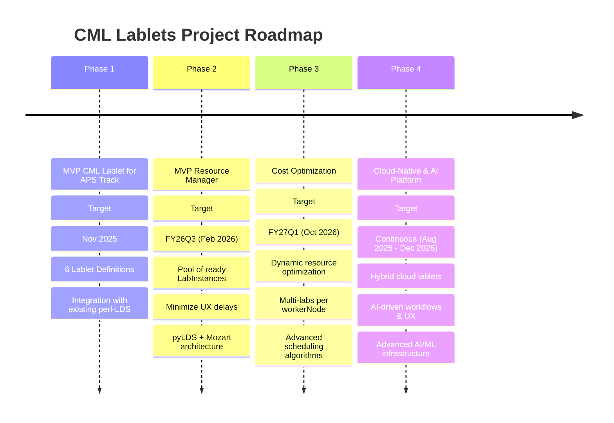
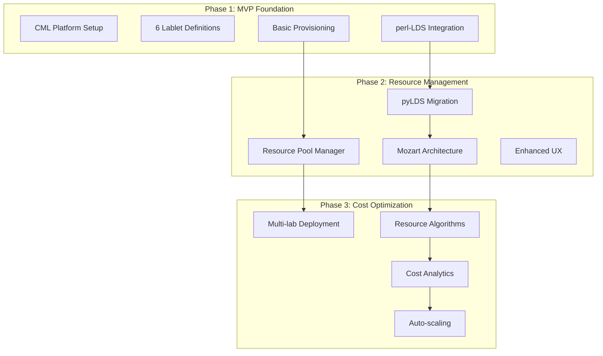

# CML Lablets Project Timeline

This document provides a comprehensive overview of the CML Lablets project timeline spanning multiple phases from MVP delivery through cost optimization.

## Project Overview

The CML Lablets project delivers automated, scalable laboratory environments for Cisco certification training. The project is structured in four major phases, with Phase 4 running parallel to all others to integrate cloud-native and AI-driven capabilities throughout the platform evolution.

## High-Level Project Phases

## Phase Breakdown

### Phase 1: MVP CML Lablet for Select APS Track

**Timeline:** August 2025 - November 2025
**Completion Target:** End of November 2025

**Key Deliverables:**

- 6 Lablet Definitions for core APS certification tracks
- Integration with existing perl-LDS system
- CML v2.9 platform deployment
- Basic lab provisioning capabilities

**Success Criteria:**

- < 5 minute lab initialization time
- 99.5%+ system availability
- Complete ALII protocol integration

[→ Detailed Phase 1 Timeline](phase1-mvp-aps.md)

### Phase 2: MVP Resource Manager

**Timeline:** December 2025 - February 2026
**Completion Target:** FY26Q3 (February 2026)

**Key Deliverables:**

- Resource pool management system
- Pre-provisioned LabInstance pools
- Migration to pyLDS + Mozart architecture
- Enhanced user experience with minimal delays

**Success Criteria:**

- < 2 minute lab access time from request
- Automated resource scaling based on demand
- Support for 20+ concurrent lab sessions

[→ Detailed Phase 2 Timeline](phase2-resource-manager.md)

### Phase 3: Dynamic Cost Optimization

**Timeline:** March 2026 - October 2026
**Completion Target:** FY27Q1 (October 2026)

**Key Deliverables:**

- Multi-lab deployment per worker node
- Advanced resource optimization algorithms
- Dynamic cost reduction strategies
- Comprehensive monitoring and analytics

**Success Criteria:**

- 40%+ reduction in infrastructure costs
- Support for 100+ concurrent lab sessions
- Automated resource allocation optimization

[→ Detailed Phase 3 Timeline](phase3-cost-optimization.md)

### Phase 4: Cloud-Native & AI-Driven Platform (Continuous)

**Timeline:** August 2025 - December 2026 (Parallel to all phases)
**Completion Target:** Continuous integration across all phases

**Key Deliverables:**

- Hybrid cloud lablets with public cloud service integration
- AI-driven user experience and workflow automation
- Advanced AI/ML infrastructure nodes and services
- Intelligent platform optimization and assistance

**Success Criteria:**

- Seamless integration with major cloud services (Webex, Intersight, Meraki)
- AI-enhanced user workflows across all platform interactions
- Support for advanced AI/ML certification scenarios
- Intelligent resource optimization and predictive maintenance

[→ Detailed Phase 4 Timeline](phase4-cloud-ai.md)

## Project Dependencies & Integration Points

## Key Stakeholders & Roles

- **Technical Teams:** Platform development, integration, operations
- **EPM Teams:** Content development for certification tracks
- **Product Management:** Requirements, prioritization, go-to-market
- **Operations:** Infrastructure, support, monitoring
- **Quality Assurance:** Testing, validation, compliance

## Risk Management Strategy

### Cross-Phase Risks

- **Technology Evolution:** Continuous adaptation to CML platform updates
- **Resource Constraints:** Team capacity and AWS infrastructure limits
- **Integration Complexity:** Managing dependencies between legacy and new systems
- **Timeline Pressures:** Balancing feature completeness with delivery dates

### Mitigation Approaches

- Incremental delivery and testing
- Early stakeholder engagement
- Flexible architecture design
- Comprehensive monitoring and alerting

## Success Metrics & KPIs

### Technical Metrics

- **Lab Initialization Time:** Phase 1: <5min → Phase 2: <2min → Phase 3: <1min
- **System Availability:** Maintain >99.5% across all phases
- **Concurrent Users:** Phase 1: 10 → Phase 2: 20+ → Phase 3: 100+
- **Resource Utilization:** Phase 3 target: 40% cost reduction

### Business Metrics

- **Time to Market:** On-schedule delivery for all phases
- **User Satisfaction:** >90% positive feedback scores
- **Operational Efficiency:** 50% reduction in manual intervention
- **Cost Effectiveness:** ROI positive by Phase 3 completion

## Documentation & Knowledge Management

Each phase includes comprehensive documentation:

- Technical architecture decisions
- Operational runbooks
- User guides and training materials
- Lessons learned and best practices

## Related Documentation

- [Project Milestones](milestone.md) - Detailed milestone tracking
- [Project Team](team.md) - Team structure and responsibilities
- [Architecture Overview](../architecture.md) - Technical architecture
- [Requirements](../requirements.md) - Functional and non-functional requirements
