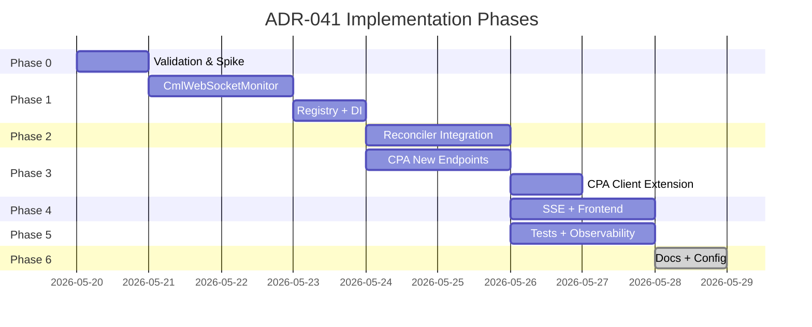

# ADR-041: WebSocket-Based CML Worker Monitoring — Implementation Plan

| Attribute | Value |
|-----------|-------|
| **ADR** | [ADR-041](../architecture/adr/ADR-041-websocket-based-cml-worker-monitoring.md) |
| **Date** | 2026-05-20 |
| **Scope** | worker-controller, control-plane-api, lcm_ui (frontend) |
| **Dependencies** | `websockets` Python package |

---

## Phase 0: Validation & Spike ✅ COMPLETED (2026-05-20)

**Goal**: Confirm WebSocket endpoint behavior before committing to implementation.

### Results

**Script**: `scripts/explore_cml_ws.py` tested against `3.91.22.2` (CML v2.9).

| Finding | Value |
|---------|-------|
| **Auth method** | Message-based: send `{"token": "<jwt>"}` as first WS message after handshake |
| **Handshake** | No auth needed for 101 upgrade; auth is post-connect |
| **Auth timeout** | ~10 seconds before CLOSE 3000 "Unauthorized" |
| **`system_stats` interval** | ~3.3 seconds |
| **`lab_stats` interval** | ~3.3 seconds per running lab |
| **Message rate** | ~0.9 msg/s (2 running labs, idle) |
| **Event types (steady-state)** | `system_stats`, `lab_stats` |
| **Event types (lab transitions)** | `state_change`, `lab_event` |
| **Close code on auth failure** | `3000` "Unauthorized" |
| **Token format** | JWT, 279 chars, `iss: com.cisco.virl`, `exp: +24h` |

### Auth Methods Tested

| Method | Result |
|--------|--------|
| No auth | ❌ CLOSE 3000 after 10s |
| `?token=<jwt>` query param | ❌ CLOSE 3000 after 10s |
| `Authorization: Bearer` header | ❌ CLOSE 3000 after 10s |
| `Cookie: token=<jwt>` | ❌ CLOSE 3000 after 10s |
| Raw token as WS message | ❌ CLOSE 3000 immediately |
| `{"authorization": "Bearer <jwt>"}` | ❌ CLOSE 3000 immediately |
| `"Bearer <jwt>"` as text | ❌ CLOSE 3000 immediately |
| **`{"token": "<jwt>"}`** | **✅ Events flow within ~2s** |
| `{"type": "authenticate", "token": "<jwt>"}` | ✅ Also works |

### Remaining Deferred Validation

- [ ] Extended stability test (30+ minute hold)
- [ ] Token expiry behavior mid-session (requires 24h or token manipulation)
- [ ] Minimum CML version supporting `/ws/ui`

---

## Phase 1: CmlWebSocketMonitor Service (worker-controller) ✅ COMPLETED (2026-05-20)

**Goal**: Implement the core WebSocket client service as a standalone integration component.

### Completion Summary

| Task | Status | Artifact |
|------|--------|----------|
| 1.1: Add `websockets` dependency | ✅ | `src/worker-controller/pyproject.toml` (websockets >=12.0,<14.0) |
| 1.2: Create CmlWebSocketMonitor | ✅ | `src/worker-controller/integration/services/cml_websocket_monitor.py` |
| 1.3: Create CmlWebSocketMonitorRegistry | ✅ | `src/worker-controller/integration/services/cml_websocket_registry.py` |
| 1.4: Wire into Settings | ✅ | `src/worker-controller/application/settings.py` (cml_websocket_* fields) |
| 1.5: Unit tests | ✅ | `src/worker-controller/tests/test_cml_websocket_monitor.py` (46 tests passing) |
| 1.6: Lint validation | ✅ | `ruff check` passes on all new files |

### Architecture Decision: NOT a HostedService

`CmlWebSocketMonitor` is NOT a Neuroglia HostedService because:

- It has N-instance cardinality (one per RUNNING worker), not singleton
- Its lifecycle is tied to individual worker state, not app lifespan
- It must be leader-aware (only run on leader), which the reconciler already handles
- The `CmlWebSocketMonitorRegistry` is a plain singleton injected into `WorkerReconciler`
- The reconciler manages monitor create/teardown in `_handle_running()` / `_step_down()`

### Task 1.1: Add `websockets` Dependency

**File**: `src/worker-controller/pyproject.toml`

```toml
[tool.poetry.dependencies]
websockets = ">=12.0,<14.0"
```

### Task 1.2: Create CmlWebSocketMonitor Class

**New file**: `src/worker-controller/integration/services/cml_websocket_monitor.py`

**Class**: `CmlWebSocketMonitor`

**Responsibilities**:

- Manage a persistent WebSocket connection to a single CML worker
- Parse incoming JSON messages and classify by `event_type`
- Maintain internal state for latest `system_stats` (debounce/throttle)
- Track activity events for idle detection
- Auto-reconnect with exponential backoff on disconnection
- Report connection health status

**Interface**:

```python
class CmlWebSocketMonitor:
    """Persistent WebSocket monitor for a single CML worker.

    Connects to wss://<host>/ws/ui and receives real-time events:
    - system_stats: System resource utilization (CPU, memory, disk, dominfo)
    - lab_stats: Per-lab node/link statistics
    - state_change: Node/interface lifecycle transitions
    - lab_event: Lab-level state changes

    Lifecycle managed by WorkerReconciler:
    - start() when worker transitions to RUNNING
    - stop() when worker transitions to STOPPING/STOPPED/TERMINATED
    """

    def __init__(
        self,
        worker_id: str,
        host: str,
        username: str,
        password: str,
        *,
        verify_ssl: bool = False,
        metrics_report_interval: int = 10,  # Max frequency for metrics reporting (seconds)
        on_system_stats: Callable[[str, CmlSystemStats], Awaitable[None]] | None = None,
        on_activity_event: Callable[[str, dict], Awaitable[None]] | None = None,
        on_lab_stats: Callable[[str, str, dict], Awaitable[None]] | None = None,
        on_lab_state_change: Callable[[str, dict], Awaitable[None]] | None = None,
        on_connection_change: Callable[[str, bool, str | None], Awaitable[None]] | None = None,
    ):
        ...

    async def start(self) -> None:
        """Start WebSocket connection. Non-blocking; runs read loop as background task."""
        ...

    async def stop(self) -> None:
        """Gracefully close WebSocket connection."""
        ...

    @property
    def is_connected(self) -> bool:
        """Whether the WebSocket is currently connected and receiving."""
        ...

    @property
    def last_message_at(self) -> datetime | None:
        """Timestamp of the last received message (for health monitoring)."""
        ...

    @property
    def latest_system_stats(self) -> CmlSystemStats | None:
        """Most recent system_stats received via WebSocket."""
        ...

    @property
    def recent_activity_events(self) -> list[dict]:
        """Activity events received since last drain (for idle detection)."""
        ...

    def drain_activity_events(self) -> list[dict]:
        """Return and clear accumulated activity events."""
        ...
```

**Internal structure**:

```python
    async def _connect(self) -> None:
        """Establish WebSocket connection with authentication."""
        # 1. Get bearer token via CmlSystemSpiClient._authenticate()
        # 2. Connect to wss://<host>/ws/ui?token=<token> (or header, per validation)
        # 3. Start _read_loop() as asyncio.Task

    async def _read_loop(self) -> None:
        """Main event loop: read messages, parse, and dispatch."""
        # Runs until stop() is called or connection drops
        # On connection loss → _schedule_reconnect()

    async def _handle_message(self, raw: str) -> None:
        """Parse JSON message and route to appropriate handler."""
        # Switch on event_type: system_stats, lab_stats, state_change, lab_event

    async def _handle_system_stats(self, data: dict) -> None:
        """Process system_stats event. Throttle outbound reporting."""
        # Parse into CmlSystemStats DTO (reuse existing from_api_response())
        # Store as latest_system_stats
        # If metrics_report_interval elapsed → invoke on_system_stats callback

    async def _handle_lab_stats(self, lab_id: str, data: dict) -> None:
        """Process lab_stats event."""
        # Invoke on_lab_stats callback with parsed data

    async def _handle_state_change(self, msg: dict) -> None:
        """Process state_change event. Track as activity if relevant."""
        # Classify: is this a user-activity signal?
        # Activity categories (matches existing telemetry filter):
        #   - element_type == "node" AND event in ("QUEUED", "STARTED")
        # If activity → append to recent_activity_events
        # Invoke on_lab_state_change callback

    async def _handle_lab_event(self, msg: dict) -> None:
        """Process lab_event event. Track as activity if relevant."""
        # Activity categories:
        #   - event == "state" AND data.state in ("STARTED", "STOPPED")
        # If activity → append to recent_activity_events
        # Invoke on_activity_event callback

    async def _schedule_reconnect(self, reason: str) -> None:
        """Schedule reconnection with exponential backoff."""
        # Backoff: 1s, 2s, 4s, 8s, 16s, max 30s (matches SSEClient frontend pattern)
        # On reconnect → re-authenticate (token may have expired)
        # Invoke on_connection_change(worker_id, False, reason)

    async def _on_reconnected(self) -> None:
        """Handle successful reconnection."""
        # Reset backoff counter
        # Invoke on_connection_change(worker_id, True, None)
```

**Activity categories** (must match `src/control-plane-api/application/utils/telemetry_filter.py`):

```python
ACTIVITY_CATEGORIES = {
    "lab_event": {"STARTED", "STOPPED"},  # lab_event with data.state in these
    "state_change_node": {"QUEUED", "STARTED"},  # state_change on element_type=="node"
}
```

### Task 1.3: Create CmlWebSocketMonitorRegistry

**New file**: `src/worker-controller/integration/services/cml_websocket_registry.py`

**Class**: `CmlWebSocketMonitorRegistry`

Manages the set of active monitors (one per RUNNING worker):

```python
class CmlWebSocketMonitorRegistry:
    """Registry of active CmlWebSocketMonitor instances.

    The WorkerReconciler calls ensure_monitoring(worker_id, host) for each
    RUNNING worker, and stop_monitoring(worker_id) when workers leave RUNNING.
    """

    def __init__(self, settings: Settings, cml_spi: CmlSystemSpiClient):
        self._monitors: dict[str, CmlWebSocketMonitor] = {}
        self._settings = settings
        self._cml_spi = cml_spi

    async def ensure_monitoring(
        self,
        worker_id: str,
        host: str,
        *,
        on_system_stats: ...,
        on_activity_event: ...,
        on_lab_stats: ...,
        on_lab_state_change: ...,
        on_connection_change: ...,
    ) -> CmlWebSocketMonitor:
        """Ensure a monitor exists and is connected for the given worker."""
        ...

    async def stop_monitoring(self, worker_id: str) -> None:
        """Stop and remove the monitor for a worker."""
        ...

    async def stop_all(self) -> None:
        """Stop all monitors (shutdown)."""
        ...

    def get_monitor(self, worker_id: str) -> CmlWebSocketMonitor | None:
        """Get the monitor for a worker (if exists)."""
        ...

    @property
    def active_count(self) -> int:
        """Number of active monitors."""
        ...
```

### Task 1.4: Wire into DI / Settings

**File**: `src/worker-controller/application/settings.py` — Add settings:

```python
# ============================================================================
# CML WebSocket Monitoring (ADR-041)
# ============================================================================
cml_websocket_enabled: bool = True  # Master flag to enable WS monitoring
cml_websocket_metrics_report_interval: int = 10  # Seconds between metrics reports to CPA
cml_websocket_reconnect_max_interval: int = 30  # Max reconnect backoff (seconds)
cml_websocket_health_timeout: int = 60  # Consider disconnected if no message in N seconds
```

**File**: `src/worker-controller/main.py` — Register services:

```python
# Register CmlWebSocketMonitorRegistry as singleton
builder.services.add_singleton(CmlWebSocketMonitorRegistry)
```

---

## Phase 2: Reconciler Integration (worker-controller) ✅ COMPLETED (2026-05-20)

**Goal**: Connect the WebSocket monitor lifecycle to the existing reconciler.

### Completion Summary

| Task | Status | Description |
|------|--------|-------------|
| 2.1: Modify `_handle_running()` | ✅ | `ensure_monitoring()` called with 5 callbacks after on-demand refresh |
| 2.2: Modify `_handle_stopping()`/`_handle_stopped()` | ✅ | `stop_monitoring(worker_id)` at top of both handlers |
| 2.3: Implement Callback Handlers | ✅ | 5 async handlers: system_stats, activity_event, lab_stats, lab_state_change, connection_change |
| 2.4: Skip WS-covered REST poll | ✅ | `_collect_and_report_metrics()` skips CML system_stats when WS connected + has data |
| 2.5: Prefer WS activity events | ✅ | `_detect_activity()` drains WS events, falls back to REST poll |
| 2.6: Shutdown lifecycle | ✅ | `_step_down()` calls `registry.stop_all()` on leader loss |
| DI wiring | ✅ | `main.py` registers `CmlWebSocketMonitorRegistry` as singleton (guarded by `cml_websocket_enabled`) |
| DI injection | ✅ | `WorkerReconciler.__init__` accepts `ws_registry: CmlWebSocketMonitorRegistry | None` |
| CPA client methods | ✅ | 4 new methods in `control_plane_client.py`: `report_worker_activity_events`, `report_worker_lab_stats`, `report_worker_lab_state_change`, `report_worker_ws_status` |
| Observability | ✅ | `get_extra_info()` includes `websocket_monitoring` status summary |
| Backward compat | ✅ | `ws_registry=None` when disabled; all WS paths guarded by `if self._ws_registry` |
| Tests | ✅ | All 149 tests pass (46 WS + 91 reconciler-G4 + 12 phase3-scaledown) |
| Lint | ✅ | `ruff check` clean on all modified files |

### Key Design Decisions

- **Optional injection**: `ws_registry` defaults to `None` — zero behavioral change when `cml_websocket_enabled=False`
- **Fire-and-forget callbacks**: All `_on_ws_*` methods wrap CPA calls in `try/except` to avoid disrupting reconciliation
- **Graceful fallback**: REST poll only skipped when WS monitor is both `.is_connected` AND `.latest_system_stats` is populated
- **No Phase 1 modifications**: Monitor and registry code unchanged

### Task 2.1: Modify `_handle_running()` — Ensure Monitor Connected

**File**: `src/worker-controller/application/hosted_services/worker_reconciler.py`

After the existing "Handle on-demand refresh" step, add:

```python
# Step: Ensure CML WebSocket monitor is connected (ADR-041)
if self._settings.cml_websocket_enabled:
    monitor = await self._ws_registry.ensure_monitoring(
        worker_id=worker.id,
        host=worker.public_ip or worker.private_ip,
        on_system_stats=self._on_ws_system_stats,
        on_activity_event=self._on_ws_activity_event,
        on_lab_stats=self._on_ws_lab_stats,
        on_lab_state_change=self._on_ws_lab_state_change,
        on_connection_change=self._on_ws_connection_change,
    )
```

### Task 2.2: Modify `_handle_stopping()` / `_handle_stopped()` — Disconnect Monitor

```python
# Disconnect WebSocket monitor when worker leaves RUNNING
if self._settings.cml_websocket_enabled:
    await self._ws_registry.stop_monitoring(worker_id)
```

### Task 2.3: Implement Callback Handlers

**New methods on `WorkerReconciler`**:

```python
async def _on_ws_system_stats(self, worker_id: str, stats: CmlSystemStats) -> None:
    """Handle system_stats from WebSocket. Report to CPA."""
    metrics = {
        "collected_at": datetime.utcnow().isoformat(),
        "cml": {
            "cpu_percent": stats.cpu.percent,
            "memory_total": stats.memory.total,
            "memory_used": stats.memory.used,
            "memory_free": stats.memory.free,
            "disk_total": stats.disk.total,
            "disk_used": stats.disk.used,
            "disk_free": stats.disk.free,
            # Per-compute dominfo for capacity tracking
            "computes": [
                {
                    "compute_id": c.compute_id,
                    "hostname": c.hostname,
                    "allocated_cpus": c.stats.dominfo.allocated_cpus,
                    "allocated_memory": c.stats.dominfo.allocated_memory,
                    "running_nodes": c.stats.dominfo.running_nodes,
                    "total_nodes": c.stats.dominfo.total_nodes,
                }
                for c in stats.computes
            ],
        },
        "source": "websocket",  # Distinguish from polling-collected metrics
    }
    await self._cpa_client.report_worker_metrics(worker_id, metrics)

async def _on_ws_activity_event(self, worker_id: str, event: dict) -> None:
    """Handle activity event from WebSocket. Report to CPA for idle detection."""
    await self._cpa_client.report_worker_activity(
        worker_id,
        activity_events=[event],
    )

async def _on_ws_lab_stats(self, worker_id: str, lab_id: str, data: dict) -> None:
    """Handle lab_stats from WebSocket. Report to CPA for per-lab metrics."""
    await self._cpa_client.report_worker_lab_stats(worker_id, lab_id, data)

async def _on_ws_lab_state_change(self, worker_id: str, event: dict) -> None:
    """Handle state_change from WebSocket. Report to CPA."""
    await self._cpa_client.report_worker_lab_state_change(worker_id, event)

async def _on_ws_connection_change(self, worker_id: str, connected: bool, reason: str | None) -> None:
    """Handle WebSocket connection state change."""
    await self._cpa_client.report_worker_ws_status(worker_id, connected, reason)
```

### Task 2.4: Modify Metrics Collection Loop — Skip WS-Covered Calls

In `_collect_and_report_metrics()`, conditionally skip CML system_stats:

```python
# If WebSocket is connected for this worker, skip polling CML system_stats
monitor = self._ws_registry.get_monitor(worker_id)
if monitor and monitor.is_connected:
    # Use latest WS-collected stats if available
    if monitor.latest_system_stats:
        # Already reported via callback — skip redundant poll
        logger.debug(f"Skipping CML system_stats poll for {worker_id} (WS connected)")
    else:
        # WS connected but no stats yet — poll as fallback
        stats = await self._cml_spi.get_system_stats(host, username, password)
        ...
else:
    # Fallback: poll as before
    stats = await self._cml_spi.get_system_stats(host, username, password)
    ...
```

### Task 2.5: Modify Idle Detection — Use WS Activity Events

In `_detect_activity()`, prefer WS-collected events over polling:

```python
monitor = self._ws_registry.get_monitor(worker_id) if self._settings.cml_websocket_enabled else None

if monitor and monitor.is_connected:
    # Drain accumulated activity events from WebSocket
    activity_events = monitor.drain_activity_events()
    if activity_events:
        # Report directly to CPA (already in processed form)
        result = await self._cpa_client.detect_worker_idle(
            worker_id,
            force_check=False,
            raw_telemetry_events=activity_events,
        )
    else:
        # No new activity events — still call detect_idle for time-based evaluation
        result = await self._cpa_client.detect_worker_idle(
            worker_id,
            force_check=False,
            raw_telemetry_events=[],  # Empty = no new activity
        )
else:
    # Fallback: fetch telemetry via REST (existing behavior)
    raw_events = await self._cml_spi.get_telemetry_events(host, username, password)
    result = await self._cpa_client.detect_worker_idle(
        worker_id,
        force_check=False,
        raw_telemetry_events=raw_events,
    )
```

### Task 2.6: Shutdown Lifecycle

In `_shutdown()` or `_resign_leader()`:

```python
if self._ws_registry:
    await self._ws_registry.stop_all()
```

---

## Phase 3: Control Plane API — New Internal Endpoints ✅ COMPLETED (2026-05-20)

**Goal**: Add endpoints for the new data the worker-controller will report.

### Completion Summary

| Task | Status | Artifact |
|------|--------|----------|
| 3.1: Report Worker Activity Events | ✅ | `POST /api/internal/workers/{id}/activity-events` → `ReportActivityEventsCommand` |
| 3.2: Report Lab Stats | ✅ | `POST /api/internal/workers/{id}/labs/{lab_id}/stats` → `UpdateWorkerLabStatsCommand` |
| 3.3: Report Lab State Change | ✅ | `POST /api/internal/workers/{id}/lab-state-change` → `ReportLabStateChangeCommand` |
| 3.4: Report WebSocket Status | ✅ | `POST /api/internal/workers/{id}/ws-status` → `UpdateWorkerWsStatusCommand` |
| 3.5: UpdateWorkerLabStatsCommand | ✅ | `application/commands/worker/update_worker_lab_stats_command.py` |
| 3.6: CPA Client Methods | ✅ | 4 methods added in Phase 2 (already aligned with endpoint URLs) |

### New Files

- `src/control-plane-api/application/commands/worker/report_activity_events_command.py`
- `src/control-plane-api/application/commands/worker/report_lab_state_change_command.py`
- `src/control-plane-api/application/commands/worker/update_worker_lab_stats_command.py`
- `src/control-plane-api/application/commands/worker/update_worker_ws_status_command.py`

### Domain Model Changes

- `CMLWorkerState`: Added `ws_connected: bool` field (default: False)
- `LabRecordState`: Added `node_stats`, `link_stats`, `stats_collected_at` fields

### SSE Events Broadcast

- `worker.lab.stats_updated` — from `UpdateWorkerLabStatsCommandHandler`
- `worker.lab.state_change` — from `ReportLabStateChangeCommandHandler`
- `worker.ws.connected` / `worker.ws.disconnected` — from `UpdateWorkerWsStatusCommandHandler`

### Validation

- 1138 tests pass (9 pre-existing failures in `test_worker_terminated_orphan_cascade.py` excluded)
- All new files pass `ruff check`
- CPA client URLs match endpoint routes exactly

### Task 3.1: New Endpoint — Report Worker Activity (Push-Based)

**File**: `src/control-plane-api/api/controllers/internal_controller.py`

```python
@router.post("/api/internal/workers/{worker_id}/activity")
async def report_worker_activity(worker_id: str, request: ReportActivityRequest):
    """Report real-time activity events from WebSocket stream (ADR-041)."""
    ...
```

**New request model**:

```python
class ReportActivityRequest(BaseModel):
    activity_events: list[dict[str, Any]] = Field(default_factory=list)
    source: str = "websocket"  # "websocket" or "telemetry_poll"
```

**Handler**: Calls existing `UpdateWorkerActivityCommand` with the reported events. Same pipeline as `detect_worker_idle` Step 2, but decoupled from idle evaluation (events arrive continuously, idle evaluation runs on its own schedule).

### Task 3.2: New Endpoint — Report Lab Stats

**File**: `src/control-plane-api/api/controllers/internal_controller.py`

```python
@router.post("/api/internal/workers/{worker_id}/labs/{lab_id}/stats")
async def report_worker_lab_stats(worker_id: str, lab_id: str, request: LabStatsRequest):
    """Report per-lab metrics from WebSocket lab_stats events (ADR-041)."""
    ...
```

**New request model**:

```python
class LabStatsRequest(BaseModel):
    nodes: dict[str, Any] = Field(default_factory=dict)  # node_id -> {cpu_usage, ram_usage, disk_usage, ...}
    links: dict[str, Any] = Field(default_factory=dict)  # link_id -> {readbytes, writebytes, ...}
    collected_at: str | None = None
```

**Handler**: Updates LabRecord aggregate with latest node metrics. Broadcasts `worker.lab.stats_updated` SSE event.

### Task 3.3: New Endpoint — Report Lab State Change

**File**: `src/control-plane-api/api/controllers/internal_controller.py`

```python
@router.post("/api/internal/workers/{worker_id}/labs/{lab_id}/state-change")
async def report_worker_lab_state_change(worker_id: str, lab_id: str, request: LabStateChangeRequest):
    """Report real-time node/interface state change from WebSocket (ADR-041)."""
    ...
```

**New request model**:

```python
class LabStateChangeRequest(BaseModel):
    event: str  # QUEUED, STARTED, BOOTED, STOPPED, etc.
    element_type: str  # "node", "interface", "lab"
    element_id: str | None = None
    data: dict[str, Any] = Field(default_factory=dict)
```

**Handler**: Broadcasts `worker.lab.state_change` SSE event. Optionally updates LabRecord if event implies lab state change.

### Task 3.4: New Endpoint — Report WebSocket Connection Status

**File**: `src/control-plane-api/api/controllers/internal_controller.py`

```python
@router.post("/api/internal/workers/{worker_id}/ws-status")
async def report_worker_ws_status(worker_id: str, request: WsStatusRequest):
    """Report WebSocket connection status change (ADR-041)."""
    ...
```

**New request model**:

```python
class WsStatusRequest(BaseModel):
    connected: bool
    reason: str | None = None
    connected_at: str | None = None
    disconnected_at: str | None = None
```

**Handler**: Updates worker state with `ws_connected` flag. Broadcasts `worker.ws.connected` or `worker.ws.disconnected` SSE event.

### Task 3.5: New CPA Command — UpdateWorkerLabStatsCommand

**New file**: `src/control-plane-api/application/commands/worker/update_worker_lab_stats_command.py`

Self-contained command + handler (project pattern):

```python
@dataclass
class UpdateWorkerLabStatsCommand(Command[OperationResult[dict[str, Any]]]):
    worker_id: str
    lab_id: str
    nodes: dict[str, Any] = field(default_factory=dict)
    links: dict[str, Any] = field(default_factory=dict)
    collected_at: str | None = None
```

Handler:

1. Find LabRecord by `cml_lab_id` matching `lab_id` on this worker
2. Update LabRecord with node-level metrics
3. Emit domain event → SSE broadcast

### Task 3.6: Extend ControlPlaneApiClient (worker-controller)

**File**: `src/core/lcm_core/integration/clients/control_plane_client.py`

Add new methods:

```python
async def report_worker_activity(self, worker_id: str, activity_events: list[dict]) -> dict:
    """Report push-based activity events (ADR-041)."""
    ...

async def report_worker_lab_stats(self, worker_id: str, lab_id: str, data: dict) -> dict:
    """Report per-lab resource metrics (ADR-041)."""
    ...

async def report_worker_lab_state_change(self, worker_id: str, event: dict) -> dict:
    """Report lab/node state change (ADR-041)."""
    ...

async def report_worker_ws_status(self, worker_id: str, connected: bool, reason: str | None = None) -> dict:
    """Report WebSocket connection status (ADR-041)."""
    ...
```

---

## Phase 4: SSE Events & Frontend Integration ✅ COMPLETED (2026-05-20)

**Goal**: Extend SSE event catalog and frontend to display real-time lab-level data.

### Completion Summary

| Task | Status | Artifact |
|------|--------|----------|
| 4.1: Register batchable event type | ✅ | `src/control-plane-api/application/services/sse_event_relay.py` (`worker.lab.stats_updated` added) |
| 4.2: Broadcast from domain handlers | ✅ | Done in Phase 3 command handlers (no additional work needed) |
| 4.3: Frontend event constants | ✅ | `src/control-plane-api/ui/src/scripts/app/eventTypes.js` (4 constants) |
| 4.4: Frontend event map entries | ✅ | `src/control-plane-api/ui/src/scripts/app/sse/eventMap.js` (4 wire→constant mappings) |
| 4.5: SSE adapter store dispatches | ✅ | `src/control-plane-api/ui/src/scripts/app/sse/sseAdapter.js` (4 handlers) |
| 4.6: Workers slice extension | ✅ | `upsertWorker` already handles `ws_connected` field — no reducer change needed |
| 4.7: LabRecords slice reducers | ✅ | `updateLabNodeState` + `updateLabStats` reducers (cml_lab_id lookup) |
| 4.8: UI indicators | ✅ | WorkerCard green dot, Monitoring tab connection indicator + "Live" badge |

### Verification

- `npx vitest run` (control-plane-api/ui): 13 tests pass (sseAdapter + workersSlice)
- `npx vitest run` (core/lcm_ui): 283 tests pass
- `make build-ui`: Builds successfully (775 kB bundle)

### Task 4.1: Register New SSE Event Types in Backend

**File**: `src/control-plane-api/application/services/sse_event_relay.py`

Add new event types to `BATCHABLE_EVENT_TYPES` if needed:

```python
BATCHABLE_EVENT_TYPES = {
    "worker.metrics.updated",
    "worker.lab.stats_updated",  # ADR-041: Per-lab metrics (high frequency)
}
```

### Task 4.2: Broadcast New Events from Domain Event Handlers

**File**: `src/control-plane-api/application/events/domain/cml_worker_events.py` (or new file)

Add handlers that broadcast:

- `worker.lab.state_change` — On lab/node state change report
- `worker.lab.stats_updated` — On lab stats report
- `worker.ws.connected` / `worker.ws.disconnected` — On WS status change

### Task 4.3: Frontend — Add SSE Event Type Constants

**File**: `src/control-plane-api/ui/src/scripts/app/eventTypes.js`

```javascript
// ADR-041: WebSocket-derived real-time events
WORKER_LAB_STATE_CHANGE: 'worker:lab:state_change',
WORKER_LAB_STATS_UPDATED: 'worker:lab:stats_updated',
WORKER_WS_CONNECTED: 'worker:ws:connected',
WORKER_WS_DISCONNECTED: 'worker:ws:disconnected',
```

### Task 4.4: Frontend — Add SSE Event Map Entries

**File**: `src/control-plane-api/ui/src/scripts/app/sse/eventMap.js`

```javascript
// ADR-041: WebSocket-derived real-time events
'worker.lab.state_change': LcmEventTypes.WORKER_LAB_STATE_CHANGE,
'worker.lab.stats_updated': LcmEventTypes.WORKER_LAB_STATS_UPDATED,
'worker.ws.connected': LcmEventTypes.WORKER_WS_CONNECTED,
'worker.ws.disconnected': LcmEventTypes.WORKER_WS_DISCONNECTED,
```

### Task 4.5: Frontend — SSE Adapter Store Updates

**File**: `src/control-plane-api/ui/src/scripts/app/sse/sseAdapter.js`

```javascript
// ADR-041: Lab-level state changes → update LabRecords store
eventBus.on(LcmEventTypes.WORKER_LAB_STATE_CHANGE, data => {
    const labId = data.lab_id;
    if (labId) {
        store.dispatch('labRecords', 'updateLabNodeState', data);
    }
});

// ADR-041: Lab-level stats → update LabRecords store
eventBus.on(LcmEventTypes.WORKER_LAB_STATS_UPDATED, data => {
    const labId = data.lab_id;
    if (labId) {
        store.dispatch('labRecords', 'updateLabStats', data);
    }
});

// ADR-041: WebSocket connection status → update worker in store
eventBus.on(LcmEventTypes.WORKER_WS_CONNECTED, data => {
    const workerId = data.worker_id;
    if (workerId) {
        store.dispatch('workers', 'upsertWorker', { id: workerId, ws_connected: true });
    }
});
eventBus.on(LcmEventTypes.WORKER_WS_DISCONNECTED, data => {
    const workerId = data.worker_id;
    if (workerId) {
        store.dispatch('workers', 'upsertWorker', { id: workerId, ws_connected: false });
    }
});
```

### Task 4.6: Frontend — Workers Slice Extension

**File**: `src/control-plane-api/ui/src/scripts/app/slices/workersSlice.js`

Add `ws_connected` field to worker state shape (no new reducer needed; `upsertWorker` handles it).

### Task 4.7: Frontend — LabRecords Slice Extension

**File**: `src/control-plane-api/ui/src/scripts/app/slices/labRecordsSlice.js`

Add new reducers:

```javascript
/**
 * Update node-level state for a lab (from WebSocket state_change events)
 */
updateLabNodeState(state, { lab_id, element_type, element_id, event, data }) {
    // Find lab by cml_lab_id, update node states
    ...
},

/**
 * Update per-lab resource statistics (from WebSocket lab_stats events)
 */
updateLabStats(state, { lab_id, worker_id, nodes, links }) {
    // Find lab by cml_lab_id, merge node/link metrics
    ...
},
```

### Task 4.8: Frontend — UI Indicators

**Worker detail panel changes**:

1. **Connection indicator**: Show WS connection status (green dot = connected via WS, amber = polling fallback)
2. **Metrics freshness**: Show "Live" badge when data is from WebSocket (< 15s old)
3. **Lab node status**: Real-time node state in lab detail modal (existing LabDetailModal)

---

## Phase 5: Observability & Testing ✅ COMPLETED (2026-05-20)

**Goal**: Add OpenTelemetry metrics for WebSocket monitoring and comprehensive test coverage.

### Completion Summary

| Task | Status | Artifact |
|------|--------|----------|
| 5.1: OTel Metrics | ✅ | `src/worker-controller/infrastructure/observability/__init__.py` (4 instruments + 5 helpers) |
| 5.1b: Instrument Monitor | ✅ | `src/worker-controller/integration/services/cml_websocket_monitor.py` (metrics in _set_status, _connection_loop, _handle_message) |
| 5.2: Monitor Unit Tests | ✅ | `src/worker-controller/tests/test_cml_websocket_monitor.py` (49 tests: +3 token refresh + throttle unblock) |
| 5.3: Registry Unit Tests | ✅ | `src/worker-controller/tests/test_cml_websocket_registry.py` (14 tests) |
| 5.4: Reconciler WS Tests | ✅ | `src/worker-controller/tests/test_worker_reconciler_ws.py` (10 tests: handle_running, handle_stopping, metrics fallback) |
| 5.5: Integration Tests | ✅ | `src/worker-controller/tests/test_websocket_monitoring_integration.py` (10 tests: full flow + graceful degradation) |
| 5.6: Frontend Tests | ✅ | `src/control-plane-api/ui/tests/slices/sseAdapter.test.js` (+8 tests: 4 event map + 4 store dispatch) |

### Verification

- `make test` (worker-controller): **186 tests pass** (was 134 pre-Phase 5)
- `npx vitest run` (control-plane-api/ui): **12 sseAdapter tests pass** (was 4)
- `npx vitest run` (core/lcm_ui): **283 tests pass** (no regressions)
- `ruff check` on all Phase 5 files: **All checks passed**

### OTel Metrics Added

| Metric | Type | Labels |
|--------|------|--------|
| `lcm_worker_controller_ws_connections_active` | UpDownCounter | worker_id |
| `lcm_worker_controller_ws_messages_total` | Counter | worker_id, event_type |
| `lcm_worker_controller_ws_reconnections_total` | Counter | worker_id, reason |
| `lcm_worker_controller_ws_message_latency_seconds` | Histogram | event_type |

### Design Note

Used `UpDownCounter` (not Gauge) for active connections since OTel Python SDK lacks a synchronous Gauge type. Tracks +1 on transition to CONNECTED, -1 on transition from CONNECTED to any other state.

### Task 5.1: OpenTelemetry Metrics

**File**: `src/worker-controller/infrastructure/observability/__init__.py`

Add new metrics:

```python
# WebSocket monitoring metrics (ADR-041)
lcm_worker_controller_ws_connections_active = Gauge(
    "lcm_worker_controller_ws_connections_active",
    "Number of active WebSocket connections to CML workers",
)
lcm_worker_controller_ws_messages_total = Counter(
    "lcm_worker_controller_ws_messages_total",
    "Total WebSocket messages received",
    ["worker_id", "event_type"],
)
lcm_worker_controller_ws_reconnections_total = Counter(
    "lcm_worker_controller_ws_reconnections_total",
    "Total WebSocket reconnection attempts",
    ["worker_id", "reason"],
)
lcm_worker_controller_ws_message_latency_seconds = Histogram(
    "lcm_worker_controller_ws_message_latency_seconds",
    "Time from WS message receipt to CPA report",
    ["event_type"],
)
```

### Task 5.2: Unit Tests — CmlWebSocketMonitor

**New file**: `src/worker-controller/tests/unit/integration/test_cml_websocket_monitor.py`

Test cases:

- [ ] Connect with valid token → receives messages
- [ ] Handle `system_stats` event → parses CmlSystemStats correctly
- [ ] Handle `state_change` on node → classified as activity
- [ ] Handle `lab_event` with state STARTED → classified as activity
- [ ] Handle `lab_stats` → callback invoked with parsed data
- [ ] Throttle metrics reporting to configured interval
- [ ] `drain_activity_events()` returns and clears buffer
- [ ] Auto-reconnect on connection drop (mock WebSocket)
- [ ] Exponential backoff on repeated failures
- [ ] `stop()` closes connection cleanly
- [ ] Token refresh on 401 / close code 4001

### Task 5.3: Unit Tests — CmlWebSocketMonitorRegistry

**New file**: `src/worker-controller/tests/unit/integration/test_cml_websocket_registry.py`

Test cases:

- [ ] `ensure_monitoring()` creates new monitor if none exists
- [ ] `ensure_monitoring()` returns existing monitor if already running
- [ ] `stop_monitoring()` stops and removes monitor
- [ ] `stop_all()` stops all active monitors

### Task 5.4: Unit Tests — Reconciler Integration

**File**: `src/worker-controller/tests/unit/application/test_worker_reconciler.py` (extend)

Test cases:

- [ ] `_handle_running()` calls `ensure_monitoring()` when WS enabled
- [ ] `_handle_stopping()` calls `stop_monitoring()`
- [ ] Metrics loop skips CML system_stats when WS connected
- [ ] Idle detection uses WS activity events when available
- [ ] Falls back to polling when WS not connected

### Task 5.5: Integration Tests — Full Flow

**New file**: `src/worker-controller/tests/integration/test_websocket_monitoring.py`

- [ ] End-to-end: Mock CML WS server → monitor → CPA report → SSE broadcast
- [ ] Graceful degradation: Kill WS → polling resumes → WS reconnects → polling stops

### Task 5.6: Frontend Tests

**File**: `src/control-plane-api/ui/tests/` (vitest)

- [ ] SSE adapter handles `worker.lab.state_change` → dispatches to labRecords store
- [ ] SSE adapter handles `worker.lab.stats_updated` → dispatches to labRecords store
- [ ] SSE adapter handles `worker.ws.connected` → updates worker.ws_connected
- [ ] Workers slice `upsertWorker` with `ws_connected` field

---

## Phase 6: Configuration & Documentation ✅ COMPLETED (2026-05-20)

### Completion Summary

| Task | Status | Artifact |
|------|--------|----------|
| 6.1: Docker Compose verification | ✅ | No changes needed — WS uses same outbound network path as REST |
| 6.2: Environment variables docs | ✅ | `src/worker-controller/README.md`, `docs/architecture/worker-monitoring.md` |
| 6.3: Idle detection docs (WS activity) | ✅ | `docs/architecture/components/control-plane-api/idle-detection.md` §9 |
| 6.4: Worker monitoring docs (dual-mode) | ✅ | `docs/architecture/components/worker-controller/worker-monitoring.md` (new) |

### Task 6.1: Docker Compose

**File**: `docker-compose.yml` — No changes needed (worker-controller already connects to CML workers; outbound WS is same network path as REST API calls).

### Task 6.2: Environment Variables Documentation

Update `docs/getting-started.md` and `README.md`:

| Variable | Default | Description |
|----------|---------|-------------|
| `CML_WEBSOCKET_ENABLED` | `true` | Enable WebSocket-based monitoring (ADR-041) |
| `CML_WEBSOCKET_METRICS_REPORT_INTERVAL` | `10` | Seconds between metrics reports to CPA |
| `CML_WEBSOCKET_RECONNECT_MAX_INTERVAL` | `30` | Max reconnect backoff (seconds) |
| `CML_WEBSOCKET_MAX_RECONNECT_ATTEMPTS` | `3` | Max consecutive failures before FAILED state |
| `CML_WEBSOCKET_HEALTH_TIMEOUT` | `60` | No-message timeout before considered disconnected |

### Task 6.3: Update Idle Detection Documentation

**File**: `docs/architecture/components/control-plane-api/idle-detection.md`

Added section 9: "WebSocket-Based Activity Detection (ADR-041)" documenting dual-source architecture with WebSocket as primary and REST polling as fallback.

### Task 6.4: Update Worker Monitoring Documentation

**File**: `docs/architecture/components/worker-controller/worker-monitoring.md` (created)

Documents the complete dual-mode monitoring architecture including:

- WebSocket primary mode with connection flow, auth, event types, throttling, reconnection
- REST polling fallback with automatic failover
- Graceful degradation state machine
- OpenTelemetry metrics
- Configuration reference and troubleshooting

---

## Execution Order & Dependencies



**Critical path**: Phase 0 ✅ → Phase 1 ✅ → Phase 2 ✅ + Phase 3 ✅ (parallel) → Phase 4 ✅ → Phase 5 ✅ → Phase 6 ✅ **ALL PHASES COMPLETE**

---

## Risk Register

| Risk | Likelihood | Impact | Mitigation |
|------|------------|--------|------------|
| CML `/ws/ui` requires undocumented auth | Low | High | Exploration script validates before coding |
| CML version incompatibility | Medium | Medium | Version check + graceful fallback to polling |
| WebSocket floods worker-controller | Low | Medium | Throttling in CmlWebSocketMonitor; bounded buffer |
| Token expiry during long WS session | High | Low | Monitor for close/error, re-authenticate, reconnect |
| CML stops emitting `system_stats` | Low | Medium | Health timeout → reconnect or fall back to poll |
| Increased CPA load from faster reporting | Medium | Low | Existing ADR-013 batching handles frontend delivery |

---

## Success Criteria

- [ ] System stats latency reduced from 60s to ≤10s
- [ ] Lab state changes visible in frontend within 2s of CML event
- [ ] Zero regression in idle detection accuracy
- [ ] Graceful fallback to polling when WS unavailable
- [ ] All existing tests pass
- [ ] New test coverage ≥ 80% for Phase 1-3 code
- [ ] No increase in CPA SSE message rate to frontend (batching handles it)
