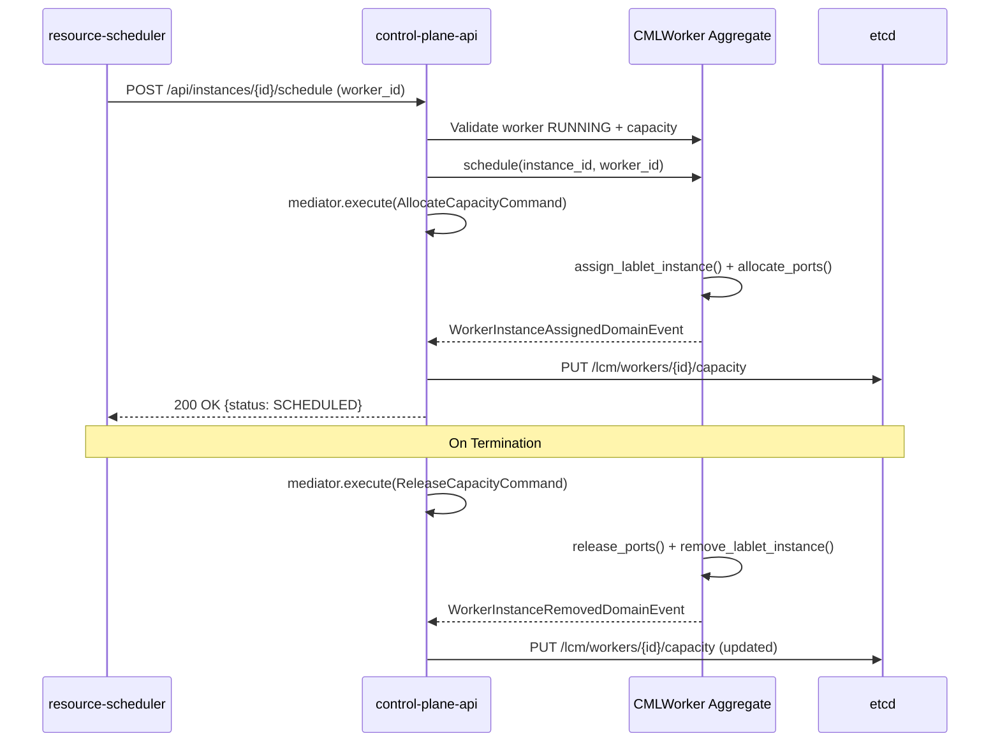

# Implementation Status

| Attribute | Value |
|-----------|-------|
| **Document Version** | 2.7.0 |
| **Status** | Current |
| **Created** | 2026-02-08 |
| **Last Updated** | 2026-03-10 |
| **Author** | LCM Architecture Team |
| **Related** | [Requirements](../specs/lablet-resource-manager-requirements.md), [MVP Implementation Plan](./mvp-implementation-plan.md), [LabRecord Implementation Plan](./labrecord-implementation-plan.md) |

---

## Executive Summary

This document tracks implementation progress against the [Lablet Resource Manager Requirements Specification](../specs/lablet-resource-manager-requirements.md) v0.3.0. It is organized into two parts:

1. **MVP Phase Progress** \u2014 Delivery-focused sections tracking what was built in each phase
2. **Requirements Tracking Matrix** \u2014 Requirement-focused matrices showing per-service status for every FR/NFR

### Status Legend

| Icon | Status | Description |
|------|--------|-------------|
| ✅ | Done | Fully implemented and tested |
| 🔄 | In Progress | Currently being implemented |
| ⬜ | Not Started | Planned, awaiting implementation |
| ⛔ | Blocked | Cannot proceed due to dependency |
| 🔶 | Partial | Partially implemented, needs completion |
| ➖ | N/A | Not applicable to this component |

### Component Legend

| Abbrev | Component | Folder |
|--------|-----------|--------|
| **CPA** | Control Plane API | `src/control-plane-api/` |
| **RS** | Resource Scheduler | `src/resource-scheduler/` |
| **WC** | Worker Controller | `src/worker-controller/` |
| **LC** | Lablet Controller | `src/lablet-controller/` |
| **CORE** | Shared Core Library | `src/core/` |

---

## Overall Progress

```
Phase 0: Domain Prerequisites    ████████████████████ 100%  ✅ Complete (2026-02-08)
Phase 1: Worker Foundation       ████████████████████ 100%  ✅ Complete (2026-02-09)
Phase 2: Resource Scheduling     ████████████████████ 100%  ✅ Complete (2026-02-10)
Phase 3: Auto-Scaling            ████████████████████ 100%  ✅ Complete (2026-02-08)
Phase 4: LDS Integration         ████████████████████ 100%  ✅ Complete (2026-02-10)
Phase 5: Grading Integration     ░░░░░░░░░░░░░░░░░░░░   0%  ⬜ Deferred to Phase 7
Phase 6: SSE & Frontend          █████████████████░░░  85%  🔄 In Progress (G1+G3+G4+G5+F1+F2+F3+F8 done)
Phase 7: LabRecord Domain        ████████████████████ 100%  ✅ Complete (2026-02-11)
Phase 8: LabRecord API & CQRS    ████████████████████ 100%  ✅ Complete (2026-02-11)
Phase 9: Lab Discovery V2        ████████████████████ 100%  ✅ Complete (2026-02-11)
Phase 10: Labs Frontend          ████████████████████ 100%  ✅ Complete (2026-02-11)
Phase 11: LabletRecordRun        ████████████████████ 100%  ✅ Complete (2026-02-11)
Phase 12: LDS Session Integr.    ████████████████████ 100%  ✅ Complete (2026-02-12)

Session Entity Model Migration   ████████████████████ 100%  ✅ Complete (2026-02-20)
```

!!! info "Plan Reference"
    Phases 0–6 follow the [MVP Implementation Plan](./mvp-implementation-plan.md) v4.1.0.
    Phases 7–14 follow the [LabRecord Implementation Plan](./labrecord-implementation-plan.md) v1.3.0.
    Session Entity Model Migration follows the [Phase 7 Execution Plan](./phase-7-session-migration.md) v1.4.0 (MVP Plan §10).

---

## Phase 0: Domain Prerequisites

> **Status:** ✅ Complete | **Completed:** 2026-02-08 | **Tasks:** 8/8 | **Tests:** 21 new (210 total domain)
> **Plan Reference:** [MVP Implementation Plan §3](./mvp-implementation-plan.md#3-phase-0-domain-prerequisites) | **Bootstrap:** [PHASE_0_BOOTSTRAP.md](./PHASE_0_BOOTSTRAP.md)

!!! success "Phase 0 Complete"
    Domain models extended for LDS integration. Breaking change: `INSTANTIATING→RUNNING` is now invalid \u2014 lifecycle requires `READY` state in between.

### Changes Delivered

| ID | Task | Service(s) | Status | Notes |
|----|------|------------|:------:|-------|
| P0-1 | Add `READY` to LabletInstanceStatus | CPA | ✅ | Enum + transition table updated |
| P0-2 | Update valid transitions | CPA | ✅ | INSTANTIATING→[READY,TERMINATED], READY→[RUNNING,TERMINATED] |
| P0-3 | Add `form_qualified_name` to LabletDefinition | CPA | ✅ | `'{org}/{project}/{form}'` format |
| P0-4 | Add `lds_session_id`, `lds_login_url` to LabletInstance | CPA | ✅ | Nullable fields on state |
| P0-5 | Add LabletInstanceReadyDomainEvent | CPA | ✅ | `@cloudevent("lablet_instance.ready.v1")` |
| P0-6 | Update LabletInstanceReadModel | CORE | ✅ | lds_session_id, lds_login_url added |
| P0-7 | Update LabletDefinitionReadModel | CORE | ✅ | form_qualified_name added |
| P0-8 | Unit tests for new state transitions | CPA | ✅ | 21 tests in `test_phase0_lds_integration.py` |

### Files Modified

| File | Change |
|------|--------|
| `control-plane-api/domain/enums.py` | Added READY enum + transition entries |
| `control-plane-api/domain/entities/lablet_instance.py` | Added LDS fields, mark_ready(), @dispatch handler |
| `control-plane-api/domain/entities/lablet_definition.py` | Added form_qualified_name field |
| `control-plane-api/domain/events/lablet_instance_events.py` | Added LabletInstanceReadyDomainEvent |
| `core/lcm_core/domain/entities/read_models/lablet_instance_read_model.py` | Added lds_session_id, lds_login_url |
| `core/lcm_core/domain/entities/read_models/lablet_definition_read_model.py` | Added form_qualified_name |
| `control-plane-api/tests/domain/test_phase0_lds_integration.py` | NEW: 21 tests |
| `control-plane-api/tests/domain/test_lablet_instance.py` | Updated fixtures for READY lifecycle |

---

## Phase 1: Worker Foundation

> **Status:** ✅ Complete | **Completed:** 2026-02-09 | **Tasks:** 6/8 core tasks (P1-7, P1-8 deferred to Phase 2) | **Tests:** 26 new (387 total CPA)
> **Plan Reference:** [MVP Implementation Plan §4](./mvp-implementation-plan.md#4-phase-1-worker-foundation) | **Bootstrap:** [PHASE_1_BOOTSTRAP.md](./PHASE_1_BOOTSTRAP.md)

!!! success "Phase 1 Complete"
    Worker capacity is now accurately tracked through CQRS commands. `allocated_capacity` is updated
    when lablet instances are scheduled (via `AllocateCapacityCommand`) and released when terminated
    (via `ReleaseCapacityCommand`). Capacity snapshots are published to etcd for scheduler consumption.
    PlacementEngine enhancement and integration tests deferred to Phase 2.

### Changes Delivered

| ID | Task | Service(s) | Status | Notes |
|----|------|------------|:------:|-------|
| P1-1 | `AllocateCapacityCommand` | CPA | ✅ | Wraps `assign_lablet_instance()` + `allocate_ports()` with OTel tracing |
| P1-2 | `ReleaseCapacityCommand` | CPA | ✅ | Wraps `remove_lablet_instance()` + `release_ports()`, idempotent |
| P1-3 | Update `ScheduleLabletInstanceCommand` | CPA | ✅ | Validates worker RUNNING + capacity, allocates via mediator |
| P1-4 | Update `TerminateLabletInstanceCommand` | CPA | ✅ | Releases capacity on termination, graceful failure handling |
| P1-5 | Verify capacity domain events | CPA | ✅ | All 5 events already exist in aggregate |
| P1-6 | `WorkerCapacityPublisher` (etcd) | CPA | ✅ | Publishes to `/lcm/workers/{id}/capacity` via async etcd client |
| P1-7 | Verify metrics collection e2e | WC | ➡️ | Deferred to Phase 2 (requires running stack) |
| P1-8 | Integration tests | CPA | ➡️ | Deferred to Phase 2 |

### Files Created

| File | Purpose |
|------|--------|
| `control-plane-api/application/commands/worker/allocate_capacity_command.py` | NEW: CQRS command for capacity allocation |
| `control-plane-api/application/commands/worker/release_capacity_command.py` | NEW: CQRS command for capacity release |
| `control-plane-api/application/services/worker_capacity_publisher.py` | NEW: etcd publisher for capacity snapshots |
| `control-plane-api/tests/application/test_capacity_commands.py` | NEW: 26 tests covering AllocateCapacity, ReleaseCapacity, Schedule, Terminate |

### Files Modified

| File | Change |
|------|--------|
| `control-plane-api/application/commands/lablet_instance/schedule_lablet_instance_command.py` | Rewritten: capacity validation + allocation via mediator |
| `control-plane-api/application/commands/lablet_instance/terminate_lablet_instance_command.py` | Added: capacity release on termination |
| `control-plane-api/application/commands/worker/__init__.py` | Added: AllocateCapacity + ReleaseCapacity exports |

### Capacity Flow (Implemented)



---

## Phase 2: Resource Scheduling

> **Status:** ✅ Complete | **Completed:** 2026-02-10 | **Tasks:** 6/6 core tasks | **Tests:** 41 new (77 total resource-scheduler)
> **Plan Reference:** [MVP Implementation Plan §5](./mvp-implementation-plan.md#5-phase-2-resource-scheduling) | **Bootstrap:** [PHASE_2_BOOTSTRAP.md](./PHASE_2_BOOTSTRAP.md)

!!! success "Phase 2 Complete"
    PlacementEngine now uses real-time etcd capacity data (with API fallback). Scheduling failures
    are tracked with retry escalation (5 failures → 300s backoff). Comprehensive OTel metrics cover
    all scheduling decision paths. Rejection tracking provides granular reasons (status/license/capacity/
    ami/ports) for scale-up decisions. 41 new unit tests verify all Phase 2 paths.

### Changes Delivered

| ID | Task | Service(s) | Status | Notes |
|----|------|------------|:------:|-------|
| P2-1 | etcd capacity in PlacementEngine | RS | ✅ | `etcd_capacities` parameter on `schedule()`, prefers etcd `available_capacity` over API data |
| P2-2 | Inject etcd capacity into scheduler | RS | ✅ | `_refresh_etcd_capacities()` fetches `/workers/*/capacity` with 30s TTL cache |
| P2-3 | Retry with backoff | RS | ✅ | Base class provides exponential backoff; added max retry escalation (5 failures → 300s) |
| P2-4 | Scheduling metrics (OTel) | RS | ✅ | New `infrastructure/observability/` module with 9 instruments + 8 helper functions |
| P2-5 | Scale-up on no capacity | RS | ✅ | `rejection_summary` tracks rejections by category; granular scale-up reasons |
| P2-6 | Integration tests | RS | ✅ | 41 tests across 2 test files covering all decision paths |

### Files Created

| File | Purpose |
|------|--------|
| `resource-scheduler/infrastructure/observability/__init__.py` | NEW: OTel scheduling metrics (decisions, latency, retries, etcd fetches, scale-ups) |
| `resource-scheduler/tests/unit/application/services/test_placement_engine_phase2.py` | NEW: 17 tests for etcd capacity, rejection tracking, scoring |
| `resource-scheduler/tests/unit/application/services/test_scheduler_hosted_service_phase2.py` | NEW: 24 tests for etcd refresh, reconcile, retry escalation, metrics |

### Files Modified

| File | Change |
|------|--------|
| `resource-scheduler/application/services/placement_engine.py` | Added `etcd_capacities` param, rejection tracking, etcd-aware scoring |
| `resource-scheduler/application/hosted_services/scheduler_hosted_service.py` | Added etcd capacity fetch, retry escalation, OTel metrics integration |

### Key Design Decisions

- **Overlay pattern**: SchedulerHostedService fetches etcd capacity once per cycle, passes to PlacementEngine. PlacementEngine stays pure/testable \u2014 no etcd dependency.
- **Graceful fallback**: If etcd is unavailable, PlacementEngine falls back to API `declared - allocated` capacity data automatically.
- **Base class reuse**: `ReconciliationHostedService` already provides exponential backoff (1s→60s); Phase 2 adds escalation for persistent failures only.
- **Rejection granularity**: `_filter_eligible_workers()` returns rejection counts by category to support intelligent scale-up decisions.

---

## Phase 3: Auto-Scaling

> **Status:** ✅ Complete | **Completed:** 2026-02-08 | **Tasks:** 9/9 (P3-8, P3-9 partial \u2014 unit-tested, no cross-service E2E) | **Tests:** 44 new
> **Plan Reference:** [MVP Implementation Plan §6](./mvp-implementation-plan.md#6-phase-3-auto-scaling) | **Bootstrap:** [PHASE_3_BOOTSTRAP.md](./PHASE_3_BOOTSTRAP.md)

!!! success "Phase 3 Complete"
    Full auto-scaling lifecycle implemented across all 3 active services. Scale-up is triggered by
    resource-scheduler when no eligible workers exist for pending instances. Scale-down is detected
    by worker-controller via idle monitoring with 5 safety guards. Worker provisioning creates real
    EC2 instances from templates. Also fixed discovery bulk import to sync all EC2 states (AD-21).

### Changes Delivered

| ID | Task | Service(s) | Status | Notes |
|----|------|------------|:------:|-------|
| P3-1 | `_handle_pending` with EC2 provisioning | WC | ✅ | 5-step flow: template → region config → AMI → tags → RunInstances |
| P3-2 | `RequestScaleUpCommand` | CPA | ✅ | Validates constraints, resolves template, creates PENDING worker |
| P3-3 | Scale-up trigger in scheduler | RS | ✅ | `_request_scale_up()` + `_select_template_for_requirements()` |
| P3-4 | Scale-down detection | WC | ✅ | `_evaluate_scale_down()` with 5 safety guards |
| P3-5 | Worker draining before scale-down | CPA | ✅ | `DrainWorkerCommand` sets DRAINING + desired_status=STOPPED |
| P3-6 | Scaling constraints (min/max workers) | CPA, WC, RS | ✅ | `max_workers_per_region`, `min_workers`, cooldowns |
| P3-7 | Scaling audit log | CPA, WC, RS | ✅ | OTel metrics: `lcm_scaling_events_total`, `lcm_scale_down_*`, `lcm_provisioning_duration_seconds` |
| P3-8 | Integration tests (scale-up) | CPA | ✅ | 14 scenario tests (batch scheduling, capacity limits, concurrent state) |
| P3-9 | Integration tests (scale-down) | WC | ✅ | 13 unit tests for `_evaluate_scale_down()` safety guards |

### Bugfix: Discovery State Sync (AD-21)

| Task | Service | Status | Notes |
|------|---------|:------:|-------|
| Full EC2 state sync in bulk import | CPA | ✅ | Previously only synced shutting-down/terminated; now syncs running/stopped/stopping too |

### Files Created

| File | Purpose |
|------|---------|
| `control-plane-api/application/commands/worker/request_scale_up_command.py` | NEW: Scale-up command + handler (296 lines) |
| `control-plane-api/application/commands/worker/drain_worker_command.py` | NEW: Drain command + handler (160 lines) |
| `control-plane-api/application/services/worker_template_service.py` | NEW: Template management service (536 lines) |
| `resource-scheduler/tests/unit/application/services/test_placement_engine_phase3.py` | NEW: 17 template selection tests |
| `worker-controller/tests/unit/test_worker_reconciler_phase3.py` | NEW: 13 scale-down safety guard tests |
| `control-plane-api/tests/integration/test_scaling_scenarios.py` | NEW: 14 scaling scenario tests |

### Files Modified

| File | Change |
|------|---------|
| `worker-controller/application/hosted_services/worker_reconciler.py` | Added `_handle_pending()` EC2 provisioning, `_evaluate_scale_down()` |
| `resource-scheduler/application/services/placement_engine.py` | Added `_select_template_for_requirements()`, `_request_scale_up()` |
| `resource-scheduler/application/hosted_services/scheduler_hosted_service.py` | Scale-up trigger integration |
| `control-plane-api/application/settings.py` | Added scaling constraints: max/min workers, cooldowns |
| `worker-controller/application/settings.py` | Added scaling constraints: auto_scale_down, idle thresholds |
| `control-plane-api/application/commands/worker/internal_bulk_import_workers_command.py` | Fixed: full EC2 state sync (AD-21) |

---

## Phase 4: LDS Integration

> **Status:** ✅ Complete | **Completed:** 2026-02-10 | **Tasks:** 10/10 code tasks + staging validation | **Tests:** 57 new (44 LC + 13 CPA)
> **Plan Reference:** [MVP Implementation Plan §7](./mvp-implementation-plan.md#7-phase-4-lds-integration) | **Bootstrap:** [PHASE_4_BOOTSTRAP.md](./PHASE_4_BOOTSTRAP.md)

!!! success "Phase 4 Complete"
    LDS integration implemented across lablet-controller and control-plane-api. Full LDS session
    lifecycle: provision on INSTANTIATING, mark-ready with LDS info, READY→RUNNING on session.started,
    archive on TERMINATED. Staging validated via G3: 12/12 checks passed, bug fix applied
    (`archive_session()` json=None→json={}), Docker networking configured.

### Changes Delivered

| ID | Task | Service(s) | Status | Notes |
|----|------|------------|:------:|-------|
| P4-1 | LDS SPI Client (data models + YAML config) | LC | ✅ | 636-line REST client, multi-region deployment support |
| P4-2 | LDS REST client (HTTP methods) | LC | ✅ | create_session, get_session, set_devices, archive_session, get_lablet_launch_url |
| P4-3 | `MarkInstanceReadyCommand` | CPA | ✅ | Atomic INSTANTIATING→READY with LDS session info (AD-P4-01) |
| P4-4 | Update `TransitionLabletInstanceCommand` for READY | CPA | ✅ | Redirects READY transitions to dedicated endpoint |
| P4-5 | Reconciler: `_provision_lds_session()` | LC | ✅ | 7-step flow: definition → nodes → session → device list → set devices → launch URL → mark-ready |
| P4-6 | Internal API endpoints | CPA | ✅ | `PUT /lablet-instances/{id}/mark-ready`, `POST /lablet-instances/session-started` |
| P4-7 | `HandleSessionStartedCommand` | CPA | ✅ | READY→RUNNING on session.started with multi-instance matching |
| P4-8 | Reconciler: `_archive_lds_session()` | LC | ✅ | Graceful archival on TERMINATED with error handling |
| P4-9 | Tests (LDS SPI + command handlers) | LC, CPA | ✅ | 57 tests: 44 LDS SPI + 5 mark-ready + 8 session-started |
| P4-CPA-Client | CPA client LDS methods | CORE | ✅ | `mark_instance_ready()`, `notify_session_started()` in ControlPlaneApiClient |

### Files Created

| File | Purpose |
|------|--------|
| `lablet-controller/integration/services/lds_spi.py` | NEW: LDS Reservations API v3 SPI client (636 lines) |
| `lablet-controller/config/lds_deployments.yaml` | NEW: Per-region LDS deployment configs (us-east-1, us-west-2) |
| `control-plane-api/application/commands/lablet_instance/mark_instance_ready_command.py` | NEW: Atomic INSTANTIATING→READY command + handler |
| `control-plane-api/application/commands/lablet_instance/handle_session_started_command.py` | NEW: READY→RUNNING on session.started command + handler |
| `lablet-controller/tests/integration/test_lds_spi.py` | NEW: 44 tests (8 test classes) |
| `control-plane-api/tests/application/test_mark_instance_ready_command.py` | NEW: 5 tests |
| `control-plane-api/tests/application/test_handle_session_started_command.py` | NEW: 8 tests |

### Files Modified

| File | Change |
|------|--------|
| `lablet-controller/application/hosted_services/lablet_reconciler.py` | Added `_provision_lds_session()`, `_archive_lds_session()`, `_build_device_access_list()`, LDS client injection, OTel counters |
| `control-plane-api/api/controllers/internal_controller.py` | Added `PUT /lablet-instances/{id}/mark-ready`, `POST /lablet-instances/session-started` endpoints |
| `core/lcm_core/integration/clients/control_plane_client.py` | Added `mark_instance_ready()`, `notify_session_started()` methods |
| `control-plane-api/application/commands/lablet_instance/transition_lablet_instance_command.py` | Updated to redirect READY state to dedicated endpoint |
| `control-plane-api/application/commands/lablet_instance/allocate_instance_ports_command.py` | Adopted CommandHandlerBase pattern |

### Key Design Decisions

- **AD-P4-01: Atomic mark-ready** \u2014 Single `MarkInstanceReadyCommand` handles INSTANTIATING→READY with all LDS fields (session_id, login_url, launch_url) atomically. Avoids split-brain from separate LDS-set + transition commands.
- **AD-P4-02: Device mapping strategy** \u2014 `_build_device_access_list()` maps CML lab nodes to `DeviceAccessInfo` using allocated port mappings. Static helper for testability.
- **AD-P4-03: Multi-instance session matching** \u2014 `HandleSessionStartedCommand` matches `lds_session_id` across all READY instances (not just by instance_id) since LDS fires session.started by session, not instance.
- **CommandHandlerBase adoption** \u2014 All Phase 4 handlers extend `CommandHandlerBase` + `CommandHandler[TCmd, TResult]`, providing consistent cloud event bus injection.

---

## Phase 6: SSE & Frontend Readiness

> **Status:** 🔄 ~85% Complete | **Started:** 2026-02-09 | **Tasks:** 8/15 (G1, G3, G4, G5, F1, F2, F3, F8 done) | **Tests:** 121 new (53 G4 + 59 G5 + 9 F2)
> **Plan Reference:** [MVP Implementation Plan §9](./mvp-implementation-plan.md#9-phase-6-sse-frontend--integration-readiness) |

!!! info "Phase 6 Progress"
    SSE pipeline fixed (G1), staging validated (G3), LDS session display added (F2), three new frontend
    pages completed (F1, F3, F8), and controller test coverage significantly expanded (G4: 53 tests,
    G5: 59 tests). Remaining: low-priority polish tasks (F4–F7, F9).

### Sub-Phase A: SSE & Backend Readiness

| ID | Task | Priority | Status | Notes |
|----|------|:--------:|:------:|-------|
| G1 | Fix SSE broken for all aggregates | P0 | ✅ | 21 backend handlers renamed, 6 frontend event types added, legacy SSEService deleted |
| G2 | CloudEvents external naming mismatch | Deferred | ⬜ | Not blocking SSE (internal dot notation works) |
| G3 | Phase 4 staging validation | P1 | ✅ | 12/12 live LDS checks passed. Bug fix: `archive_session()` json=None→json={}. Docker config added. |
| G4 | Add missing Worker Controller tests (+53) | P2 | ✅ | 53 tests in `test_worker_reconciler_g4.py`: all 9 status handlers, EC2 provisioning, metrics, scale-down guards |
| G5 | Add missing Lablet Controller tests (+59) | P2 | ✅ | 59 tests in `test_lablet_reconciler_g5.py`: all 7 status handlers, LDS provisioning, device mapping, definition caching |
| G6 | Worker metrics events disabled | Deferred | ⬜ | Leave disabled until monitoring dashboard prioritized |

### Sub-Phase B: Frontend Implementation

| ID | Task | Priority | Status | Notes |
|----|------|:--------:|:------:|-------|
| F1 | Reservation Management UI | Medium | ✅ | ReservationsPage.js: stats cards, external ID lookup, active/all/timeline tabs, SSE updates |
| F2 | LDS Session Display | **High** | ✅ | LabletInstanceCard "Open Lab" button, DTO mappers, SSE READY handler, 9 new tests |
| F3 | Capacity/Utilization Dashboard | Medium | ✅ | CapacityDashboard.js: fleet summary, resource utilization bars, per-worker breakdown |
| F4 | Grading Results Display | Low | ⬜ | Blocked by Phase 5/7 grading backend |
| F5 | Notification Center | Low | ⬜ | Toasts sufficient for MVP |
| F6 | User/RBAC Admin UI | Low | ⬜ | Keycloak admin console suffices |
| F7 | Audit Log Viewer | Low | ⬜ | Post-MVP feature |
| F8 | Resource Scheduler UI | Medium | ✅ | SchedulerPage.js: leader status, stats, pending placements, admin actions |
| F9 | Multi-Service Observability | Low | ⬜ | Prometheus/Grafana not connected |

### Files Created (F1+F3+F8)

| File | Purpose |
|------|--------|
| `control-plane-api/ui/src/scripts/components/pages/ReservationsPage.js` | NEW: Reservation management page (~570 lines) |
| `control-plane-api/ui/src/scripts/components/pages/CapacityDashboard.js` | NEW: Fleet capacity overview (~320 lines) |
| `control-plane-api/ui/src/scripts/components/pages/SchedulerPage.js` | NEW: Resource scheduler dashboard (~430 lines) |
| `control-plane-api/ui/src/scripts/api/scheduler.js` | NEW: Scheduler admin API client (~70 lines) |

### Files Modified (F1+F3+F8)

| File | Change |
|------|--------|
| `control-plane-api/ui/src/scripts/app.js` | Added imports, routing, init functions for 3 new pages |
| `control-plane-api/ui/src/scripts/components/pages/index.js` | Added exports for ReservationsPage, CapacityDashboard, SchedulerPage |
| `control-plane-api/ui/src/templates/components/navbar_tabbed.jinja` | Converted Lablets/Workers to dropdowns, added Scheduler to System menu |
| `control-plane-api/ui/src/templates/index.jinja` | Added section containers for reservations, capacity, scheduler |

### Files Created (G3+G4+G5)

| File | Purpose |
|------|--------|
| `worker-controller/tests/unit/test_worker_reconciler_g4.py` | NEW: 53 tests — all 9 status handlers, EC2 provisioning, CML readiness, metrics, scale-down, drain, error recovery |
| `lablet-controller/tests/test_lablet_reconciler_g5.py` | NEW: 59 tests — all 7 status handlers, LDS provisioning 7-step flow, device mapping, definition caching, session archival, reconcile router |
| `lablet-controller/config/lds_deployments.docker.yaml` | NEW: Docker-specific LDS deployment config (lds-backend:4000) |
| `scripts/validate_lds_integration.py` | NEW: G3 staging validation script (12 checks) |

### Files Modified (G4+G5+G3)

| File | Change |
|------|--------|
| `worker-controller/application/services/worker_controller_service.py` | Fixed 10+ type errors: aligned SPI method calls, added null guards, corrected return types |
| `lablet-controller/integration/services/lds_spi.py` | Bug fix: `archive_session()` changed `json=None` to `json={}` (HTTP 415 fix) |
| `docker-compose.shared.yml` | Added `LDS_VERIFY_SSL`, `LDS_DEPLOYMENTS_CONFIG_PATH` env vars, `lds-backend` dependency |

### Key Design Decisions

- **AD-16: Navbar converted to dropdowns** — Lablets and Workers tabs converted from direct links to Bootstrap 5 dropdowns to accommodate sub-views (Reservations, Capacity Dashboard). Consistent with existing System dropdown pattern.
- **Scheduler API proxy** — SchedulerPage uses `/scheduler/` URL prefix, proxied through nginx to the resource-scheduler admin API. Separate `api/scheduler.js` client module.

---

## Phase 7: LabRecord Domain Foundation

> **Status:** ✅ Complete | **Completed:** 2026-02-11 | **Tasks:** 23/23 | **Tests:** 106 new (60 state machine + 20 binding + 26 VOs)
> **Plan Reference:** [LabRecord Implementation Plan §3](./labrecord-implementation-plan.md#3-phase-7-labrecord-domain-foundation) | **Architecture:** [LabRecord Architecture Design](../architecture/lab-record-architecture.md)

### Objective

Establish **LabRecord** as a first-class aggregate with typed status, value objects, state machine, and M:N binding entity. Closes gaps G1, G2, G3, G8, G13, G16, G17.

### Key Deliverables

| Deliverable | Details |
|-------------|---------|
| `LabRecordStatus` enum (16 states) | `lcm_core/domain/enums/lab_record_status.py` — state machine with guarded transitions |
| `RuntimeEnvironmentType` enum | `lcm_core/domain/enums/runtime_environment_type.py` — CML/Kubernetes/Pod/BareMetal |
| `BindingRole` + `BindingStatus` enums | `lcm_core/domain/enums/binding_enums.py` — M:N binding lifecycle |
| 5 value objects | `RuntimeBinding`, `ExternalInterface`, `LabTopologySpec`, `LabRevision`, `LabRunRecord` |
| `LabRecord` aggregate refactored | Event-sourced with typed status, transition guards, revision history, topology spec |
| 20 domain events | Exceeds Architecture §4.4 target of 16 |
| `LabletLabBinding` entity + repo | Entity, ABC repository, Motor implementation |
| `LabRecordReadModel` | `lcm_core/domain/entities/read_models/lab_record_read_model.py` |
| Feature flags on `LabletDefinition` | `lab_reuse_enabled`, `multi_lab_enabled` attributes |
| Domain resilience hardening | OCC, stale timeout, freshness guard, CMLWorker transitions (33 additional tests) |

### Files Created

| File | Purpose |
|------|---------|
| `lcm_core/domain/enums/lab_record_status.py` | 16-state enum with valid transitions |
| `lcm_core/domain/enums/runtime_environment_type.py` | Runtime environment type enum |
| `lcm_core/domain/enums/binding_enums.py` | BindingRole + BindingStatus enums |
| `lcm_core/domain/enums/lablet_record_run_status.py` | Run/LDS/Grading status enums (prep for Phase 11) |
| `lcm_core/domain/entities/read_models/lab_record_read_model.py` | LabRecord read model for cross-service queries |
| `control-plane-api/domain/value_objects/runtime_binding.py` | RuntimeBinding VO |
| `control-plane-api/domain/value_objects/external_interface.py` | ExternalInterface VO |
| `control-plane-api/domain/value_objects/lab_topology_spec.py` | LabTopologySpec VO |
| `control-plane-api/domain/value_objects/lab_revision.py` | LabRevision VO |
| `control-plane-api/domain/value_objects/lab_run_record.py` | LabRunRecord VO |
| `control-plane-api/domain/entities/lablet_lab_binding.py` | LabletLabBinding entity |
| `control-plane-api/domain/repositories/lablet_lab_binding_repository.py` | Binding repository ABC |
| `control-plane-api/integration/repositories/motor_lablet_lab_binding_repository.py` | Motor implementation |
| `control-plane-api/tests/domain/test_lab_record_state_machine.py` | 60 state machine tests |
| `control-plane-api/tests/domain/test_lablet_lab_binding.py` | 20 binding lifecycle tests |
| `control-plane-api/tests/domain/test_lab_value_objects.py` | 26 value object tests |

### Key Design Decisions

- **Removed `LAB_RECORD_LIFECYCLE_ENABLED` flag** — Cross-cutting concern; the new typed status replaces raw strings unconditionally.
- **Feature flags as definition attributes** — `lab_reuse_enabled` and `multi_lab_enabled` set per-LabletDefinition, not system-wide, enabling gradual rollout.
- **20 domain events** — Exceeded the Architecture §4.4 target of 16 to provide finer-grained lifecycle observability.
- **Domain resilience hardening** — Added OCC guards, stale timeout detection, freshness validation, and transition safety across CMLWorker and LabRecord aggregates.

---

## Phase 8: LabRecord API & CQRS

> **Status:** ✅ Complete | **Completed:** 2026-02-13 | **Tasks:** 30/30 | **Tests:** 140 new (52 command + 27 query + 61 integration)
> **Plan Reference:** [LabRecord Implementation Plan §4](./labrecord-implementation-plan.md#4-phase-8-labrecord-api--cqrs) | **Architecture:** [LabRecord Architecture §8.1–8.6](../architecture/lab-record-architecture.md)

### Objective

Full CQRS command/query surface and BFF controller for LabRecord lifecycle management. Closes gaps G6, G7, G12, G14.

### Key Deliverables

| Deliverable | Details |
|-------------|---------|
| 14 CQRS commands | Discover, Start, Stop, Wipe, Delete, Clone, Archive, Bind, Unbind, UpdateStatus, UpdateTopology, RecordRun, CompleteAction, FailAction |
| 8 CQRS queries | GetLabRecords, GetLabRecord, GetTopology, GetRevisions, GetRuns, GetBindings, GetWorkerLabs (existing), GetLabletLabs |
| `LabRecordsController` (16 BFF endpoints) | Replaces legacy `LabsController` — 6 GET + 10 POST endpoints |
| `InternalController` extension (10 endpoints) | 9 new lab discovery/status/binding endpoints + 1 existing sync |
| `ControlPlaneApiClient` extension (9 methods) | Lab discovery, status update, topology update, run recording, binding management |
| 13 SSE event handlers | 10 event types per Architecture §8.6, plus 3 legacy handlers preserved |
| 52 command unit tests | ≥1 test per command, covering success + validation scenarios |
| 27 query unit tests | Handler instantiation, delegation verification, parameter mapping |
| 61 API integration tests | Controller structure, route validation, request model validation |

### Files Created

| File | Purpose |
|------|---------|
| `control-plane-api/application/commands/lab/discover_lab_records_command.py` | Replaces sync; adds status tracking, orphan detection |
| `control-plane-api/application/commands/lab/start_lab_record_command.py` | Sets pending_action=start with transition guard |
| `control-plane-api/application/commands/lab/stop_lab_record_command.py` | Sets pending_action=stop |
| `control-plane-api/application/commands/lab/wipe_lab_record_command.py` | Sets pending_action=wipe |
| `control-plane-api/application/commands/lab/delete_lab_record_command.py` | Sets pending_action=delete |
| `control-plane-api/application/commands/lab/clone_lab_record_command.py` | Clones lab via CML API |
| `control-plane-api/application/commands/lab/archive_lab_record_command.py` | Exports + archives lab record |
| `control-plane-api/application/commands/lab/bind_lab_to_lablet_command.py` | Creates LabletLabBinding |
| `control-plane-api/application/commands/lab/unbind_lab_from_lablet_command.py` | Releases LabletLabBinding |
| `control-plane-api/application/commands/lab/update_lab_record_status_command.py` | Internal status update |
| `control-plane-api/application/commands/lab/update_lab_topology_command.py` | Topology update with revision |
| `control-plane-api/application/commands/lab/record_lab_run_command.py` | Records start→stop run cycle |
| `control-plane-api/application/commands/lab/fail_lab_action_command.py` | Records action failure |
| `control-plane-api/application/queries/get_lab_records_query.py` | List with filters (worker, status) |
| `control-plane-api/application/queries/get_lab_record_query.py` | Single by ID |
| `control-plane-api/application/queries/get_lab_record_topology_query.py` | Topology + spec |
| `control-plane-api/application/queries/get_lab_record_revisions_query.py` | Revision history |
| `control-plane-api/application/queries/get_lab_record_runs_query.py` | Run history |
| `control-plane-api/application/queries/get_lab_record_bindings_query.py` | Active bindings |
| `control-plane-api/application/queries/get_lablet_labs_query.py` | Labs bound to lablet |
| `control-plane-api/application/events/domain/lab_record_events.py` | 13 SSE event handlers |
| `control-plane-api/tests/application/test_lab_commands.py` | 52 command unit tests |
| `control-plane-api/tests/application/test_lab_queries.py` | 27 query unit tests |
| `control-plane-api/tests/integration/test_lab_records_controller.py` | 61 integration tests |

### Files Modified

| File | Change |
|------|--------|
| `control-plane-api/api/controllers/lab_records_controller.py` | Refactored: 16 BFF endpoints (was 7), replaces legacy LabsController |
| `control-plane-api/api/controllers/internal_controller.py` | Extended: 9 new lab endpoints + 10 request models |
| `control-plane-api/api/controllers/__init__.py` | Updated exports: `LabRecordsController` replaces `LabsController` |
| `lcm_core/integration/clients/control_plane_client.py` | Extended: 9 new methods for lab operations |
| `control-plane-api/application/commands/lab/complete_pending_lab_action_command.py` | Refactored to `CompleteLabActionCommand` |

### Key Design Decisions

- **AD-22: LabRecordsController replaces LabsController** — Unified endpoint surface under `/labrecords/` prefix. Old `LabsController` removed from package exports. All 16 endpoints follow Architecture §8.1 contract.
- **AD-23: POST consistency for all mutations** — All state-changing operations (start, stop, wipe, delete, clone, archive, bind, unbind) use POST method for consistency, even though some could semantically be DELETE.
- **Self-contained CQRS pattern** — Each command/query file contains both the request dataclass and its handler class, following the established project convention.
- **Structural integration tests** — Controller tests validate instantiation, route paths, HTTP methods, and Pydantic request models rather than full HTTP-level integration, matching the established `test_lablet_controllers.py` pattern.

---

## Phase 9: Lab Discovery V2 & Reuse

> **Status:** ✅ Complete | **Completed:** 2026-02-11 | **Tasks:** 12/12 | **Tests:** 60 new (26 discovery + 34 resolution/reuse)
> **Plan Reference:** [LabRecord Implementation Plan §5](./labrecord-implementation-plan.md#5-phase-9-lab-discovery-v2--reuse) | **Architecture:** [LabRecord Architecture §7](../architecture/lab-record-architecture.md)

### Objective

Evolve lab discovery in lablet-controller to use typed LabRecord lifecycle, add lab reuse logic to the reconciler, and implement binding/run tracking. Closes gaps G4, G5, G15.

### Key Deliverables

| Deliverable | Details |
|-------------|---------|
| `LabDiscoveryService` (563 lines) | Replaces `LabsRefreshService` — V2 discovery with typed `LabRecordStatus`, SHA-256 topology checksums, orphan detection. Falls back to legacy sync when `LAB_DISCOVERY_V2_ENABLED=false`. |
| Lab resolution in `LabletReconciler` | `_resolve_lab_for_instance()` with WIPED/STOPPED reuse strategy, guarded by `definition.lab_reuse_enabled`. Fresh import fallback. |
| Binding management | `_bind_lab_to_instance()` / `_release_lab_binding()` via CPA — bind on BOOTED, release on STOPPING |
| Run history tracking | `_record_lab_run_completed()` — records start→stop execution cycles via CPA |
| `LAB_DISCOVERY_V2_ENABLED` setting | System-level feature flag (default: false), controls V2 vs legacy discovery |
| CPA client extension | `get_lab_records_for_worker()` method for querying lab records by worker |
| Internal API extension | `GET /api/internal/lab-records` endpoint with worker_id, status, include_terminal filters |
| 60 unit tests | 26 discovery + 34 resolution/reuse — exceeds ≥15 + ≥10 requirements |

### Files Created

| File | Purpose |
|------|---------|
| `lablet-controller/application/hosted_services/lab_discovery_service.py` | V2 discovery service with dual-mode (V2/legacy), topology checksums, concurrent worker scanning |
| `lablet-controller/tests/test_phase9_lab_discovery.py` | 60 unit tests: 12 test classes covering all P9 features |

### Files Modified

| File | Change |
|------|--------|
| `lablet-controller/application/settings.py` | Added `lab_discovery_v2_enabled: bool = False` |
| `lablet-controller/application/hosted_services/__init__.py` | Added `LabDiscoveryService` export |
| `lablet-controller/application/hosted_services/lablet_reconciler.py` | Major refactor: lab resolution, binding, run tracking, wipe-for-reuse pattern |
| `lablet-controller/main.py` | Replaced `LabsRefreshService` DI with `LabDiscoveryService` |
| `control-plane-api/api/controllers/internal_controller.py` | Added `GET /api/internal/lab-records` endpoint |
| `lcm_core/integration/clients/control_plane_client.py` | Added `get_lab_records_for_worker()` method |
| `lablet-controller/tests/test_lablet_reconciler_g5.py` | Updated 5 tests for P9 behavioral changes (wipe-not-delete, resolution flow) |

### Key Design Decisions

- **AD-24: Wipe-for-reuse pattern** — During STOPPING, labs are wiped but NOT deleted. Labs remain on the worker in WIPED state, available for reuse by future instances. This reduces instantiation time from ~90s (cold import) to ~20s (restart wiped lab).
- **AD-25: Graceful binding/run tracking** — Binding creation, release, and run recording are all graceful operations. Failures are logged but never block the main instantiation/stopping flow.
- **AD-26: Dual-mode discovery** — `LabDiscoveryService` supports both V2 (typed statuses, checksums, orphan detection) and legacy sync modes, controlled by a single feature flag.

---

## Phase 10: Labs Frontend

> **Status:** ✅ Complete | **Completed:** 2026-02-12 | **Tasks:** 8/10 (P10-9, P10-10 deferred to Phase 11) | **Tests:** 0 (Vitest infrastructure deferred)
> **Plan Reference:** [LabRecord Implementation Plan §6](./labrecord-implementation-plan.md#6-phase-10-labs-frontend) | **Architecture:** [LabRecord Architecture §9.4](../architecture/lab-record-architecture.md)

### Objective

Dedicated Labs management page in the UI for admin operations on LabRecords. Closes gaps G9, G10 (partial — P10-9 deferred).

### Key Deliverables

| Deliverable | Details |
|-------------|---------|
| `LabRecordsPage` (711 lines) | Main Labs page: summary metric tiles (Total/Running/Stopped/Wiped/Discovered/Errors), `LcmDataTable` with 7 columns, filters (worker/status/bound/search), inline btn-group action buttons |
| `LabDetailModal` (858 lines) | Detail modal with 4 tabs: Overview (identity, status, worker, bindings count), Runs (active/historical), Topology (node/link tables), Revisions (revision history) + context-sensitive action buttons |
| `lab-records.js` API client (217 lines) | 16 async functions covering all BFF endpoints: list, get, topology, revisions, runs, bindings, start, stop, wipe, delete, clone, export, archive, bind, unbind, import |
| `labRecordsSlice.js` (471 lines) | StateStore slice with full CRUD, selectors (`selectAll`, `selectById`, `selectByWorker`, `selectByStatus`), action creators, SSE-driven updates |
| 14 SSE event types | `LAB_RECORD_DISCOVERED`, `STATUS_UPDATED`, `IMPORTED`, `DELETED`, `ARCHIVED`, `CLONED`, `BOUND`, `UNBOUND`, `TOPOLOGY_UPDATED`, `SNAPSHOT`, `ACTION_QUEUED`, `ACTION_COMPLETED`, `ACTION_FAILED`, `REFRESH_COMPLETED` |
| SSE→Store dispatch handlers | 10 handler blocks in `sseAdapter.js` mapping SSE events to store mutations |
| 16 LabRecordStatus badge colors + 13 icons | All states styled in `LcmStatusBadge.js` |
| Labs nav tab + routing | Pill tab between Workers and System, `#labs-section` container, `app.js` routing |

### Deferred Tasks

| ID | Task | Deferred To | Reason |
|----|------|-------------|--------|
| P10-8 | Worker Detail Modal Labs tab enhancement | Phase 11 | Existing tab functional; LabRecordsPage provides full management |
| P10-9 | Lablet Instance cards lab binding info | Phase 11 | Requires LabletRecordRun model |
| P10-10 | Vitest unit tests for web components | Phase 11 | Web component testing infrastructure TBD |

### Files Created

| File | Purpose |
|------|---------|
| `control-plane-api/ui/src/scripts/components/pages/LabRecordsPage.js` | Labs page: summary metrics, data table, filters, SSE, action buttons |
| `control-plane-api/ui/src/scripts/components/pages/LabDetailModal.js` | Detail modal: Overview/Runs/Topology/Revisions tabs + actions |
| `control-plane-api/ui/src/scripts/api/lab-records.js` | API client for all 16 `/api/lab-records/*` BFF endpoints |
| `control-plane-api/ui/src/scripts/app/slices/labRecordsSlice.js` | StateStore slice with CRUD, selectors, action creators |

### Files Modified

| File | Change |
|------|--------|
| `control-plane-api/ui/src/scripts/app/eventTypes.js` | Added 14 `LAB_RECORD_*` event type constants |
| `control-plane-api/ui/src/scripts/app/store.js` | Registered `labRecords` slice |
| `control-plane-api/ui/src/scripts/app/sse/eventMap.js` | Added 14 SSE→EventBus mappings + 3 toast notifications |
| `control-plane-api/ui/src/scripts/app/sse/sseAdapter.js` | Added lab record SSE→store dispatch handlers (10 handler blocks) |
| `control-plane-api/ui/src/scripts/app/index.js` | Added `labRecordsSlice` exports |
| `control-plane-api/ui/src/scripts/components/core/LcmStatusBadge.js` | Added 16 LabRecordStatus colors + 13 icons |
| `control-plane-api/ui/src/scripts/components/pages/index.js` | Added `LabRecordsPage` export |
| `control-plane-api/ui/src/templates/components/navbar_tabbed.jinja` | Added "Labs" nav pill tab |
| `control-plane-api/ui/src/templates/index.jinja` | Added `#labs-section` container |
| `control-plane-api/ui/src/scripts/app.js` | Added LabRecordsPage import, instance, initializer, routing |

### Key Design Decisions

- **AD-27: LcmDataTable with inline btn-group actions** — Labs table uses the same `btn-group btn-group-sm` inline action pattern as Workers, with `.lcm-row-action` class for event delegation via `LcmDataTable._onDelegatedClick()`. Context-sensitive buttons per status (e.g., Start only for STOPPED/WIPED/DEFINED).
- **AD-28: LabDetailModal with 4 tabs (Overview/Runs/Topology/Revisions)** — Tabs lazy-load data on activation. Overview tab shows identity, status, worker, resources, and binding count inline. Runs/Topology/Revisions tabs fetch via dedicated API endpoints.
- **AD-29: Instance-level annotations for LabRecordState** — Neuroglia `JsonSerializer._deserialize_object()` uses `get_type_hints()` which requires class-level annotations. `LabRecordState` fields annotated at class level (not just `__init__`). Defensive `getattr` patterns removed.

---

## Phase 11: LabletRecordRun & Session Model

> **Status:** ✅ Complete | **Completed:** 2026-02-13 | **Tasks:** 25/25 | **Tests:** 102 backend (pytest) + 136 frontend (Vitest)
> **Plan Reference:** [LabRecord Implementation Plan §7](./labrecord-implementation-plan.md#7-phase-11-labletrecordrun--session-model) | **Architecture:** [LabRecord Architecture §3.4, §8.7–8.10, §9.1–9.3](../architecture/lab-record-architecture.md)

### Objective

Create the `LabletRecordRun` cross-aggregate runtime entity, Sessions page for session-centric UX, and complete deferred Phase 10 tasks (binding UI, Vitest infrastructure). Closes gaps G10, G18, G19, G22, G23.

### Key Deliverables

| Deliverable | Details |
|-------------|---------|
| `LabletRecordRun` entity (297 lines) | Cross-aggregate runtime execution mapping with status state machine (PROVISIONING → ACTIVE → PAUSED → ENDING → ENDED/FAULTED), port allocations, LDS/grading placeholders |
| `PortMappingResolutionService` | Resolves and freezes port allocations at run creation from CML worker + lab record external interfaces |
| 5 CQRS commands/queries | `CreateLabletRecordRunCommand`, `EndLabletRecordRunCommand`, `UpdateLabletRecordRunStatusCommand`, `GetLabletRecordRunsQuery`, `GetLabletRecordRunQuery` |
| `LabletRecordRunsController` (BFF) | REST endpoints: `GET/POST /api/lablet-record-runs`, `GET .../\{id}`, `POST .../\{id}/end`, `PATCH .../\{id}/status` |
| `SessionsPage` (370 lines) | Session list with metric cards, data table, filters, SSE subscriptions |
| `SessionDetailPage` (220 lines) | Detail view with SessionPart accordion panels, back navigation |
| `SessionPartPanel` (182 lines) | Expandable accordion: instance summary + LabletRecordRun cards |
| `LabletRecordRunCard` (297 lines) | Run card: status badge, runtime window, port mappings, LDS/grading sections, End Run action |
| `PortMappingTable` (148 lines) | Device port allocation table with compact mode, access links (SSH/HTTP/generic) |
| `sessionsSlice.js` + `labletRecordRunsSlice.js` | StateStore slices with CRUD, selectors, action creators, filter management |
| API clients | `sessions.js`, `lablet-record-runs.js` — full CRUD + session detail endpoints |
| WorkerDetailsModal binding section | Labs tab cross-references CML labs with LabRecords, shows active/released bindings |
| LabletInstanceCard active runs | Lazy-loads active LabletRecordRuns with status badges, lab_record_id, LDS/grading indicators |
| Vitest infrastructure | `vitest.config.js` + jsdom environment added to CPA UI, test scripts in `package.json` |
| 102 backend tests | 59 domain entity + 25 command handler + 18 query handler tests |
| 136 frontend tests | 35 labletRecordRunsSlice + 31 sessionsSlice + 16 PortMappingTable + 33 LabletRecordRunCard + 21 SessionPartPanel |

### Deferred Phase 10 Tasks Completed

| ID | Task | Status | Details |
|----|------|--------|---------|
| P10-8 → P11-22 | Worker Detail Modal Labs tab binding info | ✅ | `loadLabsTab()` enhanced + `renderLabBindings()` added |
| P10-9 → P11-23 | Lablet Instance cards lab binding info | ✅ | `loadBoundLabs()` lazy-load method added |
| P10-10 → P11-24 | Vitest unit tests for web components | ✅ | 136 tests across 5 suites |

### Files Created

| File | Purpose |
|------|---------|
| `control-plane-api/domain/entities/lablet_record_run.py` | LabletRecordRun entity + state + status state machine |
| `control-plane-api/domain/repositories/lablet_record_run_repository.py` | Repository ABC |
| `control-plane-api/integration/repositories/motor_lablet_record_run_repository.py` | MongoDB repository implementation |
| `control-plane-api/application/services/port_mapping_resolution_service.py` | Port mapping resolution service |
| `control-plane-api/application/commands/run/create_lablet_record_run_command.py` | Create run command + handler |
| `control-plane-api/application/commands/run/end_lablet_record_run_command.py` | End run command + handler |
| `control-plane-api/application/commands/run/update_lablet_record_run_status_command.py` | Update run status command + handler |
| `control-plane-api/application/queries/run/get_lablet_record_runs_query.py` | List runs query + handler |
| `control-plane-api/application/queries/run/get_lablet_record_run_query.py` | Get single run query + handler |
| `control-plane-api/api/controllers/lablet_record_runs_controller.py` | BFF REST controller |
| `control-plane-api/ui/src/scripts/components/pages/SessionsPage.js` | Sessions list page |
| `control-plane-api/ui/src/scripts/components/sessions/SessionDetailPage.js` | Session detail page |
| `control-plane-api/ui/src/scripts/components/sessions/SessionPartPanel.js` | Session part accordion panel |
| `control-plane-api/ui/src/scripts/components/sessions/LabletRecordRunCard.js` | Run card component |
| `control-plane-api/ui/src/scripts/components/sessions/PortMappingTable.js` | Port mapping table component |
| `control-plane-api/ui/src/scripts/app/slices/sessionsSlice.js` | Sessions state slice |
| `control-plane-api/ui/src/scripts/app/slices/labletRecordRunsSlice.js` | Runs state slice |
| `control-plane-api/ui/src/scripts/api/sessions.js` | Sessions API client |
| `control-plane-api/ui/src/scripts/api/lablet-record-runs.js` | Runs API client |
| `control-plane-api/ui/vitest.config.js` | Vitest configuration for CPA UI |
| `control-plane-api/ui/tests/slices/labletRecordRunsSlice.test.js` | Runs slice tests (35 tests) |
| `control-plane-api/ui/tests/slices/sessionsSlice.test.js` | Sessions slice tests (31 tests) |
| `control-plane-api/ui/tests/components/PortMappingTable.test.js` | Port mapping table tests (16 tests) |
| `control-plane-api/ui/tests/components/LabletRecordRunCard.test.js` | Run card tests (33 tests) |
| `control-plane-api/ui/tests/components/SessionPartPanel.test.js` | Session part panel tests (21 tests) |
| `control-plane-api/tests/application/test_lablet_record_run_commands.py` | Command handler tests (25 tests) |
| `control-plane-api/tests/application/test_lablet_record_run_queries.py` | Query handler tests (18 tests) |

### Files Modified

| File | Change |
|------|--------|
| `control-plane-api/main.py` | Registered LabletRecordRun repository + controller in DI |
| `control-plane-api/ui/src/scripts/app/eventTypes.js` | Added 6 `LABLET_RECORD_RUN_*` + 1 `SESSIONS_*` event types |
| `control-plane-api/ui/src/scripts/app/store.js` | Registered `sessions` + `labletRecordRuns` slices |
| `control-plane-api/ui/src/scripts/app.js` | Added SessionsPage import, routing |
| `control-plane-api/ui/src/templates/components/navbar_tabbed.jinja` | Added "Sessions" nav pill tab |
| `control-plane-api/ui/src/templates/index.jinja` | Added `#sessions-section` container |
| `control-plane-api/ui/src/scripts/components/WorkerDetailsModal.js` | `loadLabsTab()` + `renderLabBindings()` for binding cross-reference |
| `control-plane-api/ui/src/scripts/components/LabletInstanceCard.js` | Added `loadBoundLabs()` for active run display |
| `control-plane-api/ui/package.json` | Added vitest, jsdom, @vitest/coverage-v8 devDependencies + test scripts |
| `control-plane-api/application/commands/run/create_lablet_record_run_command.py` | Bug fix: `not_found("LabletLabBinding")` → `not_found(LabletLabBinding)` |

### Key Design Decisions

- **AD-30: Vitest in CPA UI for plain JavaScript** — Added Vitest test infrastructure directly to control-plane-api `ui/` package (separate from `lcm_ui` TypeScript tests). Config uses jsdom environment for DOM testing. Component tests mock EventBus and API modules.
- **AD-31: Binding cross-reference in WorkerDetailsModal** — Labs tab cross-references CML-native labs with LabRecords by `lab_id`, fetches bindings for matching records, and displays active/released bindings inline.
- **AD-32: Lazy-load pattern for LabletInstanceCard runs** — Active runs loaded via `listRuns({ lablet_instance_id })` only for non-terminal instances, with graceful failure handling. Keeps initial card render fast.

### Bug Fixes

- **`CreateLabletRecordRunCommand` handler**: `self.not_found("LabletLabBinding", binding_id)` passed a string instead of the class, causing `AttributeError: 'str' object has no attribute '__name__'` at runtime. Fixed to `self.not_found(LabletLabBinding, binding_id)`.

---

## Phase 12: LDS Session Integration

> **Status:** ✅ Complete | **Completed:** 2025-07-08 | **Tasks:** 16/17 (P12-16 Vitest deferred) | **Tests:** 30 backend (pytest)
> **Plan Reference:** [LabRecord Implementation Plan §8](./labrecord-implementation-plan.md#8-phase-12-lds-session-integration) | **Architecture:** [LabRecord Architecture §9.5](../architecture/lab-record-architecture.md)

### Objective

Integrate LDS (Lab Delivery System) session lifecycle with LabletRecordRuns. Provides IFRAME-based LDS session embedding with postMessage bridge, CML admin dashboard, and full CQRS backend for LDS session provisioning/start/pause/resume/end operations.

### Key Deliverables

| Deliverable | Details |
|-------------|---------|
| `LdsReservationsAdapter` | httpx-based LDS Reservations API v3 client with HTTP Basic Auth, session CRUD |
| 5 LDS CQRS commands | `ProvisionLdsSessionCommand`, `StartLdsSessionCommand`, `PauseLdsSessionCommand`, `ResumeLdsSessionCommand`, `EndLdsSessionCommand` |
| 1 LDS query | `GetLdsStatusQuery` — returns LDS session status for a run |
| 6 BFF controller endpoints | `POST .../lds/provision`, `POST .../lds/start`, `POST .../lds/pause`, `POST .../lds/resume`, `POST .../lds/end`, `GET .../lds/status` |
| SSE broadcasting | 4 LDS event types broadcast from command handlers via `SSEEventRelay` |
| `LcmLdsSessionPanel` (~350 lines) | IFRAME wrapper with postMessage bridge (`lcm:pause/resume/end` → LDS, `lds:status/grade_request/timer_update` ← LDS), loading/ready/error/ended states, action buttons |
| `LcmCmlDashboardPanel` (~250 lines) | Read-only CML admin IFRAME dashboard, visible for ACTIVE/PAUSED runs only |
| 4 SSE event types | `RUN_LDS_PROVISIONED`, `RUN_LDS_ACTIVE`, `RUN_LDS_PAUSED`, `RUN_LDS_ENDED` with toast notifications |
| Store slice updates | `updateRunLds` reducer, `selectRunsWithLds`/`selectRunLdsStatus` selectors, 6 LDS action creators |
| 6 API client functions | `provisionLdsSession`, `startLdsSession`, `pauseLdsSession`, `resumeLdsSession`, `endLdsSession`, `getLdsStatus` |
| 30 backend tests | 14 adapter + 10 command handler + 6 query handler tests |

### Files Created

| File | Purpose |
|------|---------|
| `control-plane-api/integration/services/lds_reservations_adapter.py` | LDS Reservations API v3 httpx client |
| `control-plane-api/application/commands/run/provision_lds_session_command.py` | Provision LDS session command + handler |
| `control-plane-api/application/commands/run/start_lds_session_command.py` | Start LDS session command + handler |
| `control-plane-api/application/commands/run/pause_lds_session_command.py` | Pause LDS session command + handler |
| `control-plane-api/application/commands/run/resume_lds_session_command.py` | Resume LDS session command + handler |
| `control-plane-api/application/commands/run/end_lds_session_command.py` | End LDS session command + handler |
| `control-plane-api/application/queries/run/get_lds_status_query.py` | Get LDS status query + handler |
| `control-plane-api/ui/src/scripts/components/sessions/LcmLdsSessionPanel.js` | IFRAME LDS session wrapper with postMessage bridge |
| `control-plane-api/ui/src/scripts/components/sessions/LcmCmlDashboardPanel.js` | Read-only CML admin IFRAME dashboard |
| `control-plane-api/tests/integration/test_lds_reservations_adapter.py` | Adapter unit tests (14 tests) |
| `control-plane-api/tests/application/test_lds_session_commands.py` | Command handler tests (10 tests) |
| `control-plane-api/tests/application/test_lds_status_query.py` | Query handler tests (6 tests) |

### Files Modified

| File | Change |
|------|--------|
| `control-plane-api/application/settings.py` | Added `lds_base_url`, `lds_username`, `lds_password` settings |
| `control-plane-api/main.py` | Registered `LdsReservationsAdapter` singleton in DI |
| `control-plane-api/api/controllers/lablet_record_runs_controller.py` | Added 6 LDS endpoints under `/api/lablet-record-runs/{id}/lds/*` |
| `control-plane-api/ui/src/scripts/app/eventTypes.js` | Added 4 `RUN_LDS_*` event types |
| `control-plane-api/ui/src/scripts/app/sse/eventMap.js` | Added 4 SSE→EventBus mappings + toast configs |
| `control-plane-api/ui/src/scripts/app/sse/sseAdapter.js` | Added 4 LDS SSE→store dispatch handlers |
| `control-plane-api/ui/src/scripts/api/lablet-record-runs.js` | Added 6 LDS API client functions |
| `control-plane-api/ui/src/scripts/app/slices/labletRecordRunsSlice.js` | Added `updateRunLds` reducer, 2 selectors, 6 action creators |
| `control-plane-api/ui/src/scripts/components/sessions/LabletRecordRunCard.js` | Interactive LDS controls (Start/Pause/Resume/End buttons), 5 SSE subscriptions |
| `control-plane-api/ui/src/scripts/components/sessions/SessionPartPanel.js` | LDS + CML IFRAME panels in responsive grid |
| `control-plane-api/ui/src/scripts/components/sessions/SessionDetailPage.js` | 4 LDS SSE subscriptions + `_updateRunLdsStatus()` helper |

### Key Design Decisions

- **AD-33: postMessage bridge protocol for LDS IFRAME** — Parent→LDS messages prefixed `lcm:` (pause, resume, end), LDS→Parent messages prefixed `lds:` (status, grade_request, timer_update). Origin validation on both sides. Follows architecture §9.5 specification.
- **AD-34: SSE broadcasting from command handlers** — LDS events broadcast directly from command handlers via `SSEEventRelay.broadcast_event()` (not via domain events), since `LabletRecordRun` is a plain Entity not an AggregateRoot. Consistent with Phase 11 pattern.
- **AD-35: Dual IFRAME panels (LDS + CML)** — LDS session IFRAME has full postMessage bridge for interactive session control. CML dashboard IFRAME is read-only with no postMessage (proctor monitoring only). Both follow `LcmGrafanaPanel` IFRAME loading pattern (spinner, error state, 8-second fallback timeout).
- **AD-36: P12-16 Vitest deferred** — IFRAME component testing requires jsdom/happy-dom environment with postMessage simulation. Deferred to avoid blocking Phase 12 completion. Can be added incrementally.

---

## Session Entity Model Migration (MVP Phase 7)

> **Status:** ✅ Complete | **Completed:** 2026-02-20 | **Sub-Phases:** 11/12 (7I deferred) | **Tests:** 933 pass across 4 services (CPA 589, RS 92, WC 100, LC 152)
> **Plan Reference:** [MVP Implementation Plan §10](./mvp-implementation-plan.md#10-phase-7-session-entity-model-migration) | **Execution Plan:** [phase-7-session-migration.md](./phase-7-session-migration.md)
> **ADRs:** [ADR-020](../architecture/adr/ADR-020-session-entity-model.md), [ADR-021](../architecture/adr/ADR-021-child-entity-architecture.md), [ADR-022](../architecture/adr/ADR-022-cloudevent-ingestion-lablet-controller.md)

!!! success "Session Entity Model Migration Complete"
    Largest structural change in LCM codebase history. Migrated from LabletInstance/LabletRecordRun/LabletLabBinding entity model to consolidated LabletSession aggregate with three child entities (UserSession, GradingSession, ScoreReport). Big-bang rename across 4 services, ~2,100 lines of dead code removed, zero functional LabletInstance references remain.

### Objective

Replace the LabletInstance/LabletRecordRun/LabletLabBinding entity model with a consolidated **LabletSession** aggregate + 3 child entities (**UserSession**, **GradingSession**, **ScoreReport**) per ADR-020/021/022. Consolidate runtime state, eliminate redundant entities, and prepare the codebase for Phase 5 (Grading Integration).

### Sub-Phase Completion

| Sub-Phase | Scope | Service(s) | Status | Notes |
|-----------|-------|-----------|:------:|-------|
| 7A | lcm-core enums + read models renamed | CORE | ✅ | `LabletSessionStatus`, `LabletSessionReadModel`, child entity read models |
| 7B | Dead code cleanup (~2,100 lines) | CPA, LC | ✅ | Task entity, PendingLabImport, LabletControllerService, LabsRefreshService, CloudProvider, LabsController |
| 7C | LabletSession aggregate + 3 child entities | CPA | ✅ | Old entities deleted (lablet_instance.py, lablet_lab_binding.py, lablet_record_run.py) |
| 7D | CQRS commands + queries migrated | CPA | ✅ | Moved to `lablet_session/` directories; old dirs deleted |
| 7E | MongoDB repositories operational | CPA | ✅ | `MongoLabletSessionRepository` + 3 child repos; DI updated |
| 7F | Controllers renamed | CPA | ✅ | `LabletSessionsController` + `InternalSessionsController`; AD-P7-07 path param fix |
| 7G | ControlPlaneApiClient migrated | CORE | ✅ | 5 instance→session methods, 3 child entity methods added |
| 7H | Controller services migrated | RS, LC | ✅ | Reconcilers + scheduler fully updated |
| 7I | CloudEvent webhook | LC | ⏸️ | DEFERRED (AD-P7-06) — moved to future LDS/GradingEngine phase |
| 7J | Frontend fully migrated | CPA UI | ✅ | New API clients, components, SSE, session action buttons |
| 7K | Cross-service verification | all | ✅ | Domain events renamed, CMLWorker refactored, 36+ docstring edits, all tests pass |
| 7L | Documentation | docs | ✅ | This section + plan updates |

### Key Deliverables

| Deliverable | Details |
|-------------|---------|
| `LabletSession` aggregate | Event-sourced aggregate replacing LabletInstance, absorbing LabletLabBinding + LabletRecordRun runtime fields |
| `UserSession` child entity | LDS session tracking (lds_session_id, lds_login_url) |
| `GradingSession` child entity | Grading lifecycle (grading_pod_id, grading_status) |
| `ScoreReport` child entity | Assessment results (score, max_score, check_results) |
| 4 MongoDB collections | `lablet_sessions`, `user_sessions`, `grading_sessions`, `score_reports` |
| `LabletSessionsController` | BFF REST controller (replaces LabletInstancesController) |
| `InternalSessionsController` | Internal API for cross-service operations |
| Frontend migration | `lablet-sessions.js` API client, `LabletSessionCard`, `LabletSessionList`, `SessionDetailPage`, SSE updates |

### Architectural Decisions (AD-P7-01 through AD-P7-08)

| ID | Decision | Rationale |
|----|----------|-----------|
| AD-P7-01 | CloudEvent webhook → CPA proxy (no CQRS in LC) | LC is a stateless reconciler; Mediator/@dispatch architecturally inconsistent |
| AD-P7-02 | Big-bang rename, no backward compatibility | 100% local dev mode, no external consumers, no production data |
| AD-P7-03 | Hard etcd cutover, no dual-write | Current watch mechanism unreliable; will be rebuilt |
| AD-P7-04 | Remove old API endpoints, accept broken frontend | Clean codebase over backward compat; frontend fixed in 7J |
| AD-P7-05 | Clean up all dead code during Phase 7 | Dead code creates confusion during rename |
| AD-P7-06 | Defer Phase 7I (CloudEvent webhook) | Not a prerequisite for 7J; conceptually belongs in future integration phase |
| AD-P7-07 | Rename path params `session_id` → `lablet_session_id` | FastAPI Cookie/path param collision causes silent controller registration failure |
| AD-P7-08 | Assessment events: remove redundant `instance_id` field | Handler uses `aggregate_id` from CloudEvent envelope; field was redundant |

### Verification Results

| Check | Result |
|-------|--------|
| `grep -r "LabletInstance" src/ --include="*.py"` | 0 functional references (25 docstring/comment only) |
| `grep -r "lablet_instance" src/ --include="*.py"` | 0 functional references (9 docstring/comment only) |
| `grep -r "lablet_lab_binding" src/ --include="*.py"` | 0 results |
| `grep -r "lablet_record_run" src/ --include="*.py"` | 0 results |
| `make lint` (all services) | ✅ Pass |
| `make test` CPA | 589 passed (1 pre-existing failure) |
| `make test` RS | 92 passed (3 pre-existing failures) |
| `make test` WC | 100 passed ✅ |
| `make test` LC | 152 passed ✅ |
| `make build-ui` | ✅ Pass |

---

# Requirements Tracking Matrix

The following sections track per-service implementation status for every functional and non-functional requirement from the [Requirements Specification](../specs/lablet-resource-manager-requirements.md). These tables are organized by requirement area (FR/NFR), independent of implementation phases.

---

## FR-2.1: LabletDefinition Management

| FR-ID | Requirement | CPA | RS | WC | LC | CORE | Status | Notes |
|-------|-------------|:---:|:--:|:--:|:--:|:----:|:------:|-------|
| **FR-2.1.1** | LabletDefinition Attributes | ✅ | ➖ | ➖ | ✅ | ✅ | ✅ | Domain model complete |
| FR-2.1.1a | id (UUID) | ✅ | ➖ | ➖ | ✅ | ✅ | ✅ | |
| FR-2.1.1b | name (human-readable) | ✅ | ➖ | ➖ | ✅ | ✅ | ✅ | |
| FR-2.1.1c | version (semantic) | ✅ | ➖ | ➖ | ✅ | ✅ | ✅ | |
| FR-2.1.1d | lab_artifact_uri (S3/MinIO) | ✅ | ➖ | ➖ | ✅ | ✅ | ✅ | |
| FR-2.1.1e | resource_requirements | ✅ | ✅ | ➖ | ✅ | ✅ | ✅ | Used by scheduler |
| FR-2.1.1f | license_affinity | ✅ | ✅ | ➖ | ✅ | ✅ | ✅ | |
| FR-2.1.1g | created_at/updated_at | ✅ | ➖ | ➖ | ✅ | ✅ | ✅ | |
| FR-2.1.1h | state (DRAFT/ACTIVE/DEPRECATED) | ✅ | ➖ | ➖ | ✅ | ✅ | ✅ | |
| FR-2.1.1i | node_count | ✅ | ✅ | ➖ | ✅ | ✅ | ✅ | |
| FR-2.1.1j | port_template | ✅ | ➖ | ➖ | ✅ | ✅ | ✅ | |
| **FR-2.1.2** | LabletDefinition Operations | ✅ | ➖ | ➖ | ➖ | ➖ | ✅ | CRUD via API |
| FR-2.1.2a | Create | ✅ | ➖ | ➖ | ➖ | ➖ | ✅ | |
| FR-2.1.2b | Update (new version) | ✅ | ➖ | ➖ | ➖ | ➖ | ✅ | |
| FR-2.1.2c | Query/List | ✅ | ➖ | ➖ | ➖ | ➖ | ✅ | |
| FR-2.1.2d | Deprecate | ✅ | ➖ | ➖ | ➖ | ➖ | ✅ | |
| **FR-2.1.3** | Versioning Semantics | ✅ | ✅ | ➖ | ✅ | ✅ | ✅ | |
| FR-2.1.3a | MAJOR: breaking changes | ✅ | ✅ | ➖ | ✅ | ✅ | ✅ | |
| FR-2.1.3b | MINOR: new features | ✅ | ✅ | ➖ | ✅ | ✅ | ✅ | |
| FR-2.1.3c | PATCH: bug fixes | ✅ | ✅ | ➖ | ✅ | ✅ | ✅ | |
| **FR-2.1.4** | Worker Template Compatibility | ✅ | ✅ | ➖ | ✅ | ✅ | ✅ | |
| **FR-2.1.5** | Port Template Validation | ✅ | ➖ | ➖ | ✅ | ✅ | ✅ | Validated at creation |
| **FR-2.1.6** | LDS Integration (form_qualified_name) | ✅ | ➖ | ➖ | ✅ | ✅ | ✅ | Added in Phase 0 |

### Port Allocation (ADR-004)

| FR-ID | Requirement | CPA | RS | WC | LC | CORE | Status | Notes |
|-------|-------------|:---:|:--:|:--:|:--:|:----:|:------:|-------|
| ADR-004 | Port Allocation per Worker | ➖ | ➖ | 🔶 | ✅ | ✅ | 🔶 | LC complete, WC partial |
| - | Port Registry in Worker State | ➖ | ➖ | 🔶 | ✅ | ✅ | 🔶 | |
| - | Private port range (10000-20000) | ➖ | ➖ | 🔶 | ✅ | ✅ | 🔶 | |
| - | Tag rewriting (serial, vnc, pat) | ➖ | ➖ | ➖ | ✅ | ✅ | ✅ | LC responsibility |
| - | Port deallocation on lab removal | ➖ | ➖ | 🔶 | ✅ | ✅ | 🔶 | |

---

## FR-2.2: LabletSession Lifecycle (formerly LabletInstance)

| FR-ID | Requirement | CPA | RS | WC | LC | CORE | Status | Notes |
|-------|-------------|:---:|:--:|:--:|:--:|:----:|:------:|-------|
| **FR-2.2.1** | LabletSession States | ✅ | ✅ | ➖ | ✅ | ✅ | ✅ | Renamed from LabletInstance in Session Entity Model Migration |
| FR-2.2.1a | PENDING | ✅ | ✅ | ➖ | ✅ | ✅ | ✅ | |
| FR-2.2.1b | SCHEDULED | ✅ | ✅ | ➖ | ✅ | ✅ | ✅ | |
| FR-2.2.1c | PROVISIONING | ✅ | ✅ | ➖ | ✅ | ✅ | ✅ | |
| FR-2.2.1d | RUNNING | ✅ | ✅ | ➖ | ✅ | ✅ | ✅ | |
| FR-2.2.1e | **READY** (NEW) | ✅ | 🔶 | ➖ | ✅ | ✅ | ✅ | Domain+CORE+CPA+LC complete (P0+P4). RS pending. |
| FR-2.2.1f | COLLECTING | ⬜ | ⬜ | ➖ | ⬜ | ⬜ | ⬜ | MVP Phase 5 |
| FR-2.2.1g | GRADING | ⬜ | ⬜ | ➖ | ⬜ | ⬜ | ⬜ | MVP Phase 5 |
| FR-2.2.1h | **GRADED** (NEW) | ⬜ | ⬜ | ➖ | ⬜ | ⬜ | ⬜ | MVP Phase 5 |
| FR-2.2.1i | STOPPING | ✅ | ✅ | ➖ | ✅ | ✅ | ✅ | |
| FR-2.2.1j | TERMINATED | ✅ | ✅ | ➖ | ✅ | ✅ | ✅ | |
| FR-2.2.1k | ERROR | ✅ | ✅ | ➖ | ✅ | ✅ | ✅ | |

### FR-2.2.2–2.2.4: LabletSession Attributes & Operations (formerly LabletInstance)

| FR-ID | Requirement | CPA | RS | WC | LC | CORE | Status | Notes |
|-------|-------------|:---:|:--:|:--:|:--:|:----:|:------:|-------|
| **FR-2.2.2** | Instance Attributes | ✅ | ✅ | ➖ | ✅ | ✅ | ✅ | |
| FR-2.2.2a | instance_id | ✅ | ✅ | ➖ | ✅ | ✅ | ✅ | |
| FR-2.2.2b | lablet_definition_id | ✅ | ✅ | ➖ | ✅ | ✅ | ✅ | |
| FR-2.2.2c | assigned_worker_id | ✅ | ✅ | ➖ | ✅ | ✅ | ✅ | |
| FR-2.2.2d | timeslot_id | ✅ | ✅ | ➖ | ✅ | ✅ | ✅ | |
| FR-2.2.2e | lab_id (CML lab identifier) | ✅ | ➖ | ➖ | ✅ | ✅ | ✅ | |
| FR-2.2.2f | port_mappings | ✅ | ➖ | ➖ | ✅ | ✅ | ✅ | |
| FR-2.2.2g | state_history | ✅ | ➖ | ➖ | ✅ | ✅ | ✅ | |
| **FR-2.2.3** | Port Allocation | ✅ | ➖ | ➖ | ✅ | ✅ | ✅ | |
| FR-2.2.3a | Allocate from worker's available pool | ✅ | ➖ | ➖ | ✅ | ✅ | ✅ | |
| FR-2.2.3b | Map template ports to allocated | ✅ | ➖ | ➖ | ✅ | ✅ | ✅ | |
| FR-2.2.3c | Deallocate on termination | ✅ | ➖ | ➖ | ✅ | ✅ | ✅ | |
| **FR-2.2.4** | Instance Operations | ✅ | ✅ | ➖ | ✅ | ✅ | ✅ | |
| FR-2.2.4a | Provision | ✅ | ✅ | ➖ | ✅ | ✅ | ✅ | |
| FR-2.2.4b | Start | ✅ | ➖ | ➖ | ✅ | ✅ | ✅ | |
| FR-2.2.4c | Stop | ✅ | ➖ | ➖ | ✅ | ✅ | ✅ | |
| FR-2.2.4d | Terminate | ✅ | ➖ | ➖ | ✅ | ✅ | ✅ | |

### FR-2.2.5: LDS Integration

| FR-ID | Requirement | CPA | RS | WC | LC | CORE | Status | Notes |
|-------|-------------|:---:|:--:|:--:|:--:|:----:|:------:|-------|
| **FR-2.2.5** | LDS Session Management | ✅ | ➖ | ➖ | ✅ | ✅ | ✅ | Phase 4: LDS SPI + reconciler + commands |
| FR-2.2.5a | lds_session_id tracking | ✅ | ➖ | ➖ | ✅ | ✅ | ✅ | CPA domain+CORE (P0) + LC provisioning (P4) |
| FR-2.2.5b | lds_base_url selection | ✅ | ➖ | ➖ | ✅ | ✅ | ✅ | Multi-region YAML config + LDS SPI client (P4) |
| FR-2.2.5c | Device access info population | ✅ | ➖ | ➖ | ✅ | ✅ | ✅ | `_build_device_access_list()` in reconciler (P4) |
| FR-2.2.5d | LDS session lifecycle sync | ✅ | ➖ | ➖ | ✅ | ✅ | ✅ | Provision on INSTANTIATING, archive on TERMINATED (P4) |

### FR-2.2.6: CloudEvent Handling

| FR-ID | Requirement | CPA | RS | WC | LC | CORE | Status | Notes |
|-------|-------------|:---:|:--:|:--:|:--:|:----:|:------:|-------|
| **FR-2.2.6** | CloudEvent Ingestion | ✅ | ➖ | ➖ | ➖ | ✅ | ✅ | Phase 4: session.started handling complete |
| FR-2.2.6a | POST /api/events endpoint | ✅ | ➖ | ➖ | ➖ | ✅ | ✅ | |
| FR-2.2.6b | LabSession.Ready event handling | ✅ | ➖ | ➖ | ➖ | ✅ | ✅ | HandleSessionStartedCommand (P4) |
| FR-2.2.6c | READY → RUNNING transition | ✅ | ➖ | ➖ | ➖ | ✅ | ✅ | HandleSessionStartedCommand via internal API (P4) |

### FR-2.2.7: CollectAndGrade Command

| FR-ID | Requirement | CPA | RS | WC | LC | CORE | Status | Notes |
|-------|-------------|:---:|:--:|:--:|:--:|:----:|:------:|-------|
| **FR-2.2.7** | CollectAndGrade Workflow | ⬜ | ➖ | ➖ | ⬜ | ⬜ | ⬜ | MVP Phase 5 |
| FR-2.2.7a | Command triggers COLLECTING | ⬜ | ➖ | ➖ | ⬜ | ⬜ | ⬜ | |
| FR-2.2.7b | Emit ccm.lablet.instance.collecting | ⬜ | ➖ | ➖ | ⬜ | ⬜ | ⬜ | |
| FR-2.2.7c | Handle grading.completed event | ⬜ | ➖ | ➖ | ⬜ | ⬜ | ⬜ | |
| FR-2.2.7d | Store score in GRADED state | ⬜ | ➖ | ➖ | ⬜ | ⬜ | ⬜ | |

---

## FR-2.3: Scheduling & Reservations

| FR-ID | Requirement | CPA | RS | WC | LC | CORE | Status | Notes |
|-------|-------------|:---:|:--:|:--:|:--:|:----:|:------:|-------|
| **FR-2.3.1** | Timeslot Attributes | ✅ | ✅ | ➖ | ➖ | ✅ | ✅ | |
| FR-2.3.1a | start_time/end_time | ✅ | ✅ | ➖ | ➖ | ✅ | ✅ | |
| FR-2.3.1b | lablet_definition_id | ✅ | ✅ | ➖ | ➖ | ✅ | ✅ | |
| FR-2.3.1c | timeslot_id | ✅ | ✅ | ➖ | ➖ | ✅ | ✅ | |
| FR-2.3.1d | user_count | ✅ | ✅ | ➖ | ➖ | ✅ | ✅ | |
| FR-2.3.1e | state (PENDING/CONFIRMED/CANCELLED) | ✅ | ✅ | ➖ | ➖ | ✅ | ✅ | |
| **FR-2.3.2** | Scheduling Operations | ✅ | ✅ | ➖ | ➖ | ✅ | ✅ | |
| FR-2.3.2a | Request reservation | ✅ | ✅ | ➖ | ➖ | ✅ | ✅ | |
| FR-2.3.2b | Confirm/Cancel | ✅ | ✅ | ➖ | ➖ | ✅ | ✅ | |
| FR-2.3.2c | Query availability | ✅ | ✅ | ➖ | ➖ | ✅ | ✅ | |
| **FR-2.3.3** | Scheduler Constraints | ➖ | ✅ | ➖ | ➖ | ✅ | ✅ | |
| FR-2.3.3a | License affinity matching | ➖ | ✅ | ➖ | ➖ | ✅ | ✅ | |
| FR-2.3.3b | Worker template compatibility | ➖ | ✅ | ➖ | ➖ | ✅ | ✅ | |
| FR-2.3.3c | Capacity constraints | ➖ | ✅ | ➖ | ➖ | ✅ | ✅ | |
| FR-2.3.3d | Time window validation | ➖ | ✅ | ➖ | ➖ | ✅ | ✅ | |

---

## FR-2.4: Worker Capacity Management

| FR-ID | Requirement | CPA | RS | WC | LC | CORE | Status | Notes |
|-------|-------------|:---:|:--:|:--:|:--:|:----:|:------:|-------|
| **FR-2.4.1** | Capacity Tracking Attributes | ✅ | ✅ | ✅ | ➖ | ✅ | ✅ | |
| FR-2.4.1a | total_vcpu/allocated_vcpu | ✅ | ✅ | ✅ | ➖ | ✅ | ✅ | |
| FR-2.4.1b | total_memory/allocated_memory | ✅ | ✅ | ✅ | ➖ | ✅ | ✅ | |
| FR-2.4.1c | total_storage/allocated_storage | ✅ | ✅ | ✅ | ➖ | ✅ | ✅ | |
| **FR-2.4.2** | Capacity Operations | ✅ | ✅ | ✅ | ➡️ | ✅ | ✅ | Phase 1: AllocateCapacity/ReleaseCapacity commands |
| FR-2.4.2a | Reserve capacity | ✅ | ✅ | ✅ | ➡️ | ✅ | ✅ | AllocateCapacityCommand (P1) |
| FR-2.4.2b | Release capacity | ✅ | ✅ | ✅ | ➡️ | ✅ | ✅ | ReleaseCapacityCommand (P1) |
| FR-2.4.2c | Query available capacity | ✅ | ✅ | ✅ | ➡️ | ✅ | ✅ | Via etcd (P1) |

---

## FR-2.5: Auto-Scaling

| FR-ID | Requirement | CPA | RS | WC | LC | CORE | Status | Notes |
|-------|-------------|:---:|:--:|:--:|:--:|:----:|:------:|-------|
| **FR-2.5.1** | Scale-Up Triggers | ✅ | ✅ | ✅ | ➖ | ✅ | ✅ | |
| FR-2.5.1a | Capacity threshold breach | ✅ | ✅ | ✅ | ➖ | ✅ | ✅ | |
| FR-2.5.1b | Confirmed reservation with no capacity | ✅ | ✅ | ✅ | ➖ | ✅ | ✅ | |
| **FR-2.5.2** | Scale-Down Triggers | ✅ | ✅ | ✅ | ➖ | ✅ | ✅ | |
| FR-2.5.2a | Excess capacity after idle_timeout | ✅ | ✅ | ✅ | ➖ | ✅ | ✅ | |
| FR-2.5.2b | No scheduled workloads | ✅ | ✅ | ✅ | ➖ | ✅ | ✅ | |
| **FR-2.5.3** | Draining State (ADR-008) | ✅ | ✅ | ✅ | ➖ | ✅ | ✅ | |
| FR-2.5.3a | DRAINING state prevents new labs | ✅ | ✅ | ✅ | ➖ | ✅ | ✅ | |
| FR-2.5.3b | Existing labs run to completion | ✅ | ✅ | ✅ | ➖ | ✅ | ✅ | |
| FR-2.5.3c | Transition to STOPPED when empty | ✅ | ✅ | ✅ | ➖ | ✅ | ✅ | |

---

## FR-2.6: Assessment & Grading Integration

| FR-ID | Requirement | CPA | RS | WC | LC | CORE | Status | Notes |
|-------|-------------|:---:|:--:|:--:|:--:|:----:|:------:|-------|
| **FR-2.6.1** | Lab Access Generation | ⬜ | ➖ | ➖ | ⬜ | ⬜ | ⬜ | MVP Phase 5 |
| **FR-2.6.2** | Assessment States | ⬜ | ⬜ | ➖ | ⬜ | ⬜ | ⬜ | MVP Phase 5 |
| FR-2.6.2a | COLLECTING state transition | ⬜ | ⬜ | ➖ | ⬜ | ⬜ | ⬜ | |
| FR-2.6.2b | GRADING state transition | ⬜ | ⬜ | ➖ | ⬜ | ⬜ | ⬜ | |
| FR-2.6.2c | Score storage | ⬜ | ⬜ | ➖ | ⬜ | ⬜ | ⬜ | |
| FR-2.6.2d | STOPPING after grading | ⬜ | ⬜ | ➖ | ⬜ | ⬜ | ⬜ | |
| **FR-2.6.3** | CloudEvent Integration | 🔶 | ➖ | ➖ | 🔶 | ✅ | 🔶 | Partial (session.started done, grading pending) |

### CloudEvents (FR-2.6.3)

| Event Type | Direction | CPA | RS | WC | LC | CORE | Status | Notes |
|------------|-----------|:---:|:--:|:--:|:--:|:----:|:------:|-------|
| `ccm.lablet.instance.created` | Emitted | ⬜ | ➖ | ➖ | ⬜ | ⬜ | ⬜ | |
| `ccm.lablet.instance.running` | Emitted | ⬜ | ➖ | ➖ | ⬜ | ⬜ | ⬜ | |
| `ccm.lablet.instance.collecting` | Emitted | ⬜ | ➖ | ➖ | ⬜ | ⬜ | ⬜ | |
| `ccm.lablet.instance.terminated` | Emitted | ⬜ | ➖ | ➖ | ⬜ | ⬜ | ⬜ | |
| `ccm.worker.scaled.up` | Emitted | ⬜ | ⬜ | ⬜ | ➖ | ⬜ | ⬜ | |
| `ccm.worker.scaled.down` | Emitted | ⬜ | ⬜ | ⬜ | ➖ | ⬜ | ⬜ | |
| `assessment.collection.completed` | Consumed | ⬜ | ➖ | ➖ | ⬜ | ⬜ | ⬜ | |
| `assessment.grading.completed` | Consumed | ⬜ | ➖ | ➖ | ⬜ | ⬜ | ⬜ | |

---

## Background Jobs Migration (ADR-011)

> **Status:** ✅ Complete \u2014 All background jobs migrated from APScheduler to controller-based reconciliation loops.

| Task | Service | Status | Notes |
|------|---------|:------:|-------|
| Worker metrics collection job | WC | ✅ | Migrated to WC reconciler (asyncio loop, leader-gated) |
| Lab sync job | WC | ✅ | Migrated to WC reconciler (lab discovery asyncio loop) |
| Idle detection job | WC | ✅ | Integrated into reconciler `_handle_running()` → `_detect_activity()` → CPA idle detection API |
| Lab cleanup job | LC | ✅ | Five interlocking mechanisms: state-machine teardown, timeslot expiry, etcd-watched lab actions, orphan detection polling, proactive deadline scanning |
| APScheduler removal (ADR-011) | CPA, RS, WC, LC | ✅ | Removed from all services. `apscheduler` remains as transitive dep of `neuroglia-python` (optional, unused) |

---

## ADR-036 Resource Hierarchy Migration

> **Status:** 🔄 In Progress — Batches A–G ✅ Complete, Batch I ⬜ Not Started
> **Plan Reference:** [ADR-036 Phase 2 Implementation Plan](./adr036-phase2-implementation-plan.md)

Promoting all managed aggregates into the `ResourceState` → `TimedResourceState` hierarchy
defined in `lcm_core`. Provides uniform state_history, desired_status, timeslot, and
managed_lifecycle support across all resource types.

| Batch | Aggregate | Target Base Class | Status | Notes |
|-------|-----------|-------------------|:------:|-------|
| A–C | VOs + base classes | `lcm_core` | ✅ | StateTransition, Timeslot, ManagedLifecycle, ResourceState, TimedResourceState, TimedResourceReadModel |
| D | CMLWorkerState | `TimedResourceState` (field additions) | ✅ | state_history added |
| E | CMLWorkerState | `TimedResourceState` (base class change) | ✅ | AD-P2-E01, AD-P2-E02 |
| F | LabletSessionState | `TimedResourceState` (base class change) | ✅ | AD-P2-F01, AD-P2-F02 — 10-phase lifecycle, backward-compatible timeslot properties |
| G | LabRecordState | `ResourceState` (Layer 1) | ✅ | AD-G0 — open-ended lifetimes, no timeslots |
| **I** | **LabletDefinitionState** | **`TimedResourceState` (Layer 2)** | ⬜ | **AD-I0** — Last aggregate on raw `AggregateState[str]`. Timeslot-bounded definitions with automatic expiry. |

**Remaining gap:** `LabletDefinitionState` is the only managed aggregate still extending
raw `AggregateState[str]`. Batch I will promote it to `TimedResourceState` (Layer 2) —
definitions are time-bounded templates that expire when their timeslot ends. `desired_status`
initially unused (None), reserved for future reconciliation. `created_by` → `owner_id` mapping.

---

## NFR-3: Non-Functional Requirements (Post-MVP)

> These requirements are tracked for production readiness. Some are partially addressed through ongoing
> development (observability, security), while others require dedicated hardening effort after MVP completion.

| NFR-ID | Requirement | Target | Status | Notes |
|--------|-------------|--------|:------:|-------|
| **NFR-3.1: Performance** | | | ⬜ | |
| NFR-3.1.1 | API response time (p95) | < 500ms | ⬜ | Load testing needed |
| NFR-3.1.2 | Scheduling decision time | < 5s | ⬜ | |
| NFR-3.1.3 | Instance instantiation time | < 3min | ⬜ | |
| NFR-3.1.4 | Concurrent instances | ≥ 1000 | ⬜ | |
| NFR-3.1.5 | Concurrent workers/region | ≥ 100 | ⬜ | |
| **NFR-3.2: Availability** | | | ⬜ | |
| NFR-3.2.1 | API availability | 99.9% | ⬜ | |
| NFR-3.2.2 | Scheduler availability | 99.9% | ⬜ | |
| NFR-3.2.3 | RTO | < 2 min | ⬜ | |
| NFR-3.2.4 | No SPOF for control plane | Required | ⬜ | |
| **NFR-3.3: Scalability** | | | ⬜ | |
| NFR-3.3.1 | API horizontal scaling | Required | ⬜ | |
| NFR-3.3.2 | Scheduler horizontal scaling | Required | ⬜ | |
| NFR-3.3.3 | Worker startup tolerance | ≤ 15 min | ✅ | By design |
| **NFR-3.4: Security** | | | 🔶 | |
| NFR-3.4.1 | All endpoints authenticated | Required | 🔶 | Keycloak integrated |
| NFR-3.4.2 | RBAC for operations | Required | 🔶 | Partial |
| NFR-3.4.3 | Audit logging | Required | 🔶 | Basic logging |
| NFR-3.4.4 | Encrypted secrets | Required | ⬜ | |
| **NFR-3.5: Observability** | | | 🔶 | |
| NFR-3.5.1 | OpenTelemetry traces | Required | ✅ | OTEL collector integrated |
| NFR-3.5.2 | Prometheus metrics | Required | 🔶 | Partial (P2+P3 added scheduling/scaling metrics) |
| NFR-3.5.3 | Structured logging | Required | ✅ | |
| NFR-3.5.4 | SSE dashboard | Required | ✅ | Real-time updates |
| NFR-3.5.5 | Audit log retention | 3-12 months | ⬜ | |
| **NFR-3.6: Maintainability** | | | 🔶 | |
| NFR-3.6.1 | Cloud Provider SPI | Required | ✅ | AWS SPI implemented |
| NFR-3.6.2 | Config-driven templates | Required | ✅ | Worker templates (Phase 3) |
| NFR-3.6.3 | Feature flags | Optional | ⬜ | |

---

## Blocking Dependencies

| Blocker | Affected | Description | Owner | ETA |
|---------|----------|-------------|-------|-----|
| ~~LDS staging validation~~ | ~~FR-2.2.5~~ | ~~LDS SPI client implemented, needs live deployment testing~~ | ~~LCM Team~~ | ✅ Done (G3) |
| Grading Engine integration | FR-2.2.7, FR-2.6.2 | CloudEvent contract with grading engine | Assessment Team | TBD |

---

## Revision History

| Version | Date | Author | Changes |
|---------|------|--------|--------|
| 2.7.0 | 2026-03-10 | Architecture Team | Added **ADR-036 Resource Hierarchy Migration** tracking section: Batches A–G ✅ complete, Batch I ⬜ (LabletDefinitionState → TimedResourceState Layer 2, AD-I0). LabletDefinition identified as last aggregate on raw `AggregateState[str]`. Time-bounded definitions with automatic timeslot expiry. |
| 2.6.0 | 2026-02-20 | Architecture Team | Added **Session Entity Model Migration** (MVP Phase 7) section: 11/12 sub-phases complete (7I deferred), LabletSession aggregate + 3 child entities, 8 architectural decisions (AD-P7-01 through AD-P7-08), verification results (933 tests pass across 4 services). Updated FR-2.2 header from LabletInstance → LabletSession. Progress bar updated. Plan reference updated to MVP v4.1.0. |
| 2.7.0 | 2025-07-08 | Architecture Team | Phase 12 ✅ COMPLETE (16/17 tasks, P12-16 Vitest deferred). LDS Session Integration: `LdsReservationsAdapter` (httpx + HTTP Basic Auth), 5 LDS CQRS commands (provision/start/pause/resume/end), 1 query (getLdsStatus), 6 BFF controller endpoints, SSE broadcasting from handlers, 30 backend tests. Frontend: `LcmLdsSessionPanel` (IFRAME + postMessage bridge), `LcmCmlDashboardPanel` (read-only CML IFRAME), 4 SSE event types + toast configs, 6 API client functions, store slice `updateRunLds` reducer + 2 selectors + 6 action creators, `LabletRecordRunCard` interactive LDS controls, session page wiring. Build verified (682 kB). AD-33 (postMessage protocol), AD-34 (SSE from handlers), AD-35 (dual IFRAME panels), AD-36 (Vitest deferred). |
| 2.6.0 | 2026-02-13 | Architecture Team | Phase 11 ✅ COMPLETE (25/25 tasks). LabletRecordRun entity + CQRS (5 command/query handlers), Sessions page (5 web components), 2 state slices, 2 API clients, Vitest infrastructure. 102 backend tests (pytest) + 136 frontend tests (Vitest). WorkerDetailsModal binding cross-reference, LabletInstanceCard active runs. Bug fix: `not_found()` string→class. AD-30 (Vitest in CPA UI), AD-31 (binding cross-reference), AD-32 (lazy-load runs). |
| 2.5.0 | 2026-02-11 | Architecture Team | Phase 10 ✅ COMPLETE (8/10 tasks, P10-9/P10-10 deferred to Phase 11). Labs Frontend: LabRecordsPage (711 lines), LabDetailModal (858 lines, 4 tabs), lab-records.js API (16 endpoints), labRecordsSlice (471 lines), 14 SSE event types, 16 status badge colors, nav tab + routing. Build verified. AD-27 (btn-group actions), AD-28 (4-tab modal), AD-29 (instance-level annotations). |
| 2.4.0 | 2026-02-11 | Architecture Team | Phase 9 ✅ COMPLETE (12 tasks, 60 tests — LabDiscoveryService V2/legacy dual-mode, reconciler lab resolution/reuse, binding management, run tracking, CPA client extension, internal API, feature flags). 5 existing G5 tests updated for P9 behavioral changes. Progress bars updated. |
| 2.3.0 | 2026-02-13 | Architecture Team | Phase 7 ✅ COMPLETE (23 tasks, 106 tests — domain foundation, state machine, VOs, bindings). Phase 8 ✅ COMPLETE (30 tasks, 140 tests — 14 commands, 8 queries, 16 BFF endpoints, 10 internal endpoints, 9 API client methods, 13 SSE handlers, 61 integration tests). Progress bars updated. Added LabRecord Implementation Plan to Related links. |
| 2.2.0 | 2026-02-10 | Architecture Team | Phase 4 marked ✅ COMPLETE (staging validated via G3). Phase 6 at ~85%: G3 staging validation done (12/12 checks), G4 worker-controller tests (+53), G5 lablet-controller tests (+59). Worker controller service type errors fixed. Progress bars updated. LDS staging blocker resolved. 8/15 Phase 6 tasks complete. |
| 2.1.0 | 2026-02-09 | Architecture Team | Phase 6 progress: F1 (ReservationsPage), F3 (CapacityDashboard), F8 (SchedulerPage) completed. Added Phase 6 section with Sub-Phase A/B tracking, files created/modified, key design decisions (AD-16). Navbar converted to dropdowns for sub-view navigation. Progress bar updated to 50%. |
| 2.0.0 | 2026-02-08 | Architecture Team | **Major restructure:** Removed legacy phase sections and warnings. Reorganized FR/NFR requirement matrices by requirement area (FR-2.1 through FR-2.6, NFR-3) independent of implementation phases. Integrated Production Hardening NFRs as proper tracked section. Background jobs migration retained as standalone ADR-011 section. Document status upgraded from DRAFT to Current. |
| 1.6.0 | 2026-02-08 | Architecture Team | MVP Phase 4 LDS Integration ~90% complete. Updated FR-2.2.1e, FR-2.2.5a-d, FR-2.2.6a-c to ✅. 57 new tests. CommandHandlerBase pattern adopted. |
| 1.5.0 | 2026-02-08 | Architecture Team | MVP Phase 3 complete: auto-scaling lifecycle across 3 services. Discovery state sync bugfix (AD-21). |
| 1.4.0 | 2026-02-08 | Architecture Team | MVP Phase 2 complete: etcd capacity overlay, retry escalation, OTel scheduling metrics, rejection tracking. 41 new tests. |
| 1.3.0 | 2026-02-08 | Architecture Team | MVP Phase 1 completion: AllocateCapacityCommand, ReleaseCapacityCommand, WorkerCapacityPublisher. |
| 1.2.0 | 2026-02-08 | Architecture Team | MVP Phase 0 completion: READY state, lds_session_id, form_qualified_name. |
| 1.0.0 | 2026-02-08 | Architecture Team | Initial implementation status matrix |
