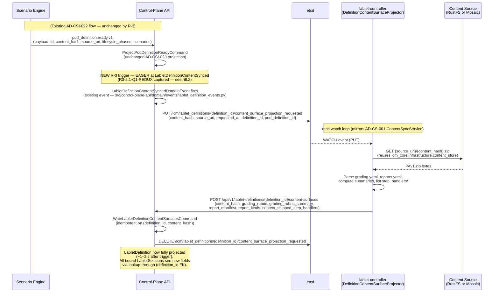

# Phase 5 Low-Level Design — Grading, Reports, Init Customization, Observability

> **Status:** 🟡 Discovery in progress (interview-driven). NO code in `src/` modified by this document.
> **Discovery session:** 2026-06-09 (`lcm-senior-architect` mode).
> **Sprint:** CSI-Phase5-Discovery.

## 0. Document control

| Attribute | Value |
|-----------|-------|
| **Authority** | [ADR-044 Content-Driven Lifecycle Engine](../architecture/adr/ADR-044-content-driven-lifecycle-engine.md) (Rev 2) |
| **Plan (living doc)** | [docs/implementation/cpa-se-integration-plan.md](./cpa-se-integration-plan.md) |
| **Prior phases** | Phase 4 closed via AD-CSI-023 (typed projection), AD-CSI-024 (4-tier resolver), AD-CSI-025 (Tier-B-only step bodies) |
| **Existing AD-CSI codes consumed** | 001–025 (Phase 5 proposals start at AD-CSI-026 — see §13) |
| **Existing Q-IDs consumed** | Q-01…Q-06, Q-09…Q-14 (Phase 5 proposals start at Q-15 — see §14) |
| **G-IDs targeted** | G-10 (Track A — collect/grade/report), G-15 (Track B — init customization v2), G-16 (Track B — observability), G-17 (Track B — templated non-grading reports) |
| **Baseline test counts** | lcm-core 325 ✓ · scenario-engine 116 ✓ · control-plane-api 1097 (+1 skip) ✓ · lablet-controller 581 (+27 skip / 0 fail) ✓ |
| **Status legend** | 🟡 TBD · 🟢 captured · 🔴 blocked · ⏸ deferred to a future sprint |
| **Contributors** | bvandewe (operator), GitHub Copilot (`lcm-senior-architect`) |

---

## 1. Executive summary (≤ 200 words)

> 🟡 **TBD — synthesized after Phase C captures.**

---

## 2. Scope tracks

### 2.1 Track A — Collect / Grade / Score Report

> 🟡 **TBD — populated during Interview Phases A1, A2, A3.**

**Phase 4 reuse note:** the AD-CSI-024 4-tier chain already supports any phase name in `_TEMPLATES`,
including `collect-evidence` and `compute-grading`. Track A's content-driven authoring of these
phases comes **for free** — no resolver change needed, only new step handlers + scenarios.

### 2.2 Track B — Init customization v2 + monitoring + templated non-grading reports

> 🟡 **TBD — populated during Interview Phases B1, B2, B3.**

**Phase 4 reuse note:** AD-CSI-023 typed-fields projection already round-trips `lifecycle_phases` +
`scenarios` end-to-end. Track B1 (content-shipped scenarios) extends the same pipeline by adding a
`scenarios` registration step inside `SyncContentCommandHandler` that pushes them into SE's
`ScenarioRegistry` at sync time.

---

## 3. Domain model (per track)

### 3.1 Aggregates

> Per AD-CSI-007 (CPA owns read-model; SE owns business aggregate), every new aggregate proposed
> here MUST declare which side owns the write. Ownership column populated as each aggregate
> is captured during the interview.

#### EvidencePackage (Track A1) 🟢 **A1.1 captured + post-A2.1 primitive-layer refinement**

- **Write owner:** SE (business aggregate; mirrors AD-CSI-007 split — CPA gets a read-model
  projection via CloudEvent; see §6.1).
- **Identity:** `(session_id, run_id)` composite — supports multiple collection runs per session.
- **Conceptual split (post-A2.1 operator directive):** an **artefact** is _what_ is captured;
  a **device-interaction primitive** is _how_ it is captured. The artefact catalogue below
  declares the output schema; the primitive set in §5.1 declares the closed transport
  contract used to produce them. Both `node-fetch` and `node-transfer` originally drafted
  in A1.1/A1.2 collapsed into the single `transfer_file(direction=pull|push)` primitive
  defined in §5.0.
- **Content artefact catalogue (v1, 7 standard + 1 freeform addition; each maps to ≥1 primitive):**

  | # | Artefact | Producing primitive(s) |
  |---|----------|------------------------|
  | 1 | `device-running-config` (text) | `execute_command("show running-config")` |
  | 2 | `device-startup-config` (text) | `execute_command("show startup-config")` |
  | 3 | `vnc-screenshots` (PNG/node) | **`capture_screen`** (NEW — see §5.0 closed primitive set; OI-4 RESOLVED) |
  | 4 | `pcap` files per bridge | `execute_command("monitor capture ...")` + `transfer_file(direction=pull)` |
  | 5 | `interface-counters` snapshot (JSON) | `execute_command("show interfaces \| json")` (or structured CML REST when available) |
  | 6 | `routing-table` snapshot (JSON) | `execute_command("show ip route \| json")` (or structured CML REST when available) |
  | 7 | `cli-transcript` | `logs(source=console)` for live tail OR `logs(source=file, pattern=...)` for historical scrape — `attach` was dropped in A2.2 |
  | 8 | `candidate-desktop-zip` (NEW, A1.1) | `transfer_file(direction=pull)` |

- **Paired init-phase primitive (Track B reuse):** the same `transfer_file` primitive in
  `direction=push` mode is exposed as the `node_transfer_step` (§7.2) for pushing
  `lab_content.zip` into candidate desktop VMs during `instantiate`.
- **Retention:** single TTL on the aggregate; default **90 days**, overridable per
  LabletDefinition (`LabletDefinition.evidence_retention_days`).
- **Storage backend:** RustFS via existing `S3ContentClient`, prefix
  `evidence/{session_id}/{run_id}/`.
- **Container format:** `zip` (matches PAv1 tooling — see OI-1 below for PAv1 folder layout
  revisit).

#### ScoreReport (Track A2) 🟢 **A2.1 + A2.2 + A3.2 captured (4-level hierarchy + partial regrade closed)**

- **Write owner:** SE (business aggregate; CPA gets a read-model projection — §6.1).
- **Identity:** `(session_id, evidence_run_id, rubric_version, score_report_id)` — a session
  can have multiple `ScoreReport`s (one per regrade); `score_report_id` is the primary key
  for retrieval and linkage.
- **Hierarchy (A3.2 Q4 — 4-level generic schema with exam-mapping glossary):**
  - `rubric` (= **session** in exam terminology) → contains `parts[]`.
  - `part` (= **session_part**, e.g. "Practical", "Theory") → contains `categories[]`.
    `parts` is **optional**: when omitted, an implicit default part wraps all categories
    (preserves the simple 3-level rubric for non-exam lablets).
  - `category` (= **section**) → contains `checks[]`.
  - `check` (= **item** / scoring opportunity) → leaf, produces `result ∈ [0.0, 1.0]`.
  - **Score is reported at every level** as `score` / `max_score` + `status` so the UI can
    show "Section: 7/10" alongside "Part: 24/30" alongside "Overall: 0.81 pass".
- **Fields (A3.2 final v1 set):**
  - `score_report_id: str` (UUIDv7).
  - `rubric_version: str` (semver) + `rubric_content_hash: str`.
  - `evidence_package_ref: { session_id, run_id }`.
  - `parts: list[PartResult]` — each carries
    `{ name: str, pass_rule: dict, status: "pass" | "fail", score: float, max_score: float,
    categories: list[CategoryResult] }`. Always present (default-part inserted when
    rubric has no explicit `parts`).
  - `categories: list[CategoryResult]` (flattened convenience view; SE derives from
    `parts[*].categories[*]`) — each carries `{ name: str, part: str, pass_rule: dict,
    status: "pass" | "fail", score: float, max_score: float, checks: list[CheckResult] }`.
  - `check_results: list[CheckResult]` — each carries
    `{ check_id: str, category: str, part: str, result: float (0.0–1.0), weight: float,
    status: "pass" | "fail", evidence_refs: list[str] (zip entry paths inside
    EvidencePackage), duration_ms: int, inherited: bool, inherited_from: str | None,
    error: str | None }`.
  - `overall_status: "pass" | "fail"` derived from part roll-up per `rubric.pass_rule`
    (default `weighted_sum` threshold = `pass_threshold` field).
  - `overall_score: float` + `max_score: float`.
  - **Timestamps:** `scenario_started_at`, `evidence_collected_at`, `graded_at` (all UTC).
  - `grader_identity: str` — SE scenario invocation id by default; operator Keycloak `sub`
    when the report originates from a manual regrade.
  - `supersedes_score_report_id: str | None` — prior `score_report_id` this one replaces.
  - `operator_notes: str | None`.
  - `regrade_scope: { type: "rubric" | "part" | "category" | "check", scope_ids: list[str]
    | None, recollected: bool }` — partial regrade descriptor (A3.2 Q4 — 4-level generic
    terminology; exam mapping in glossary §16). `scope_ids` is omitted/null when
    `type=rubric`.
  - **Provenance fields (A3.2 Q5):**
    - `CheckResult.inherited: bool` — `true` when the check_result was copied forward from
      `supersedes_score_report_id` (out-of-scope in a partial regrade).
    - `CheckResult.inherited_from: str | None` — source `score_report_id` for the
      carry-forward (audit traceability).

#### ReportTemplate (Track A3 / B3 — shared) 🟢 **A3.1 captured (A3.2 still TBD for access roles)**

- **Write owner:** SE (templates live inside the SE container's shared template library;
  per-pod overrides resolved from PAv1 via the 4-tier `PipelineTemplateResolver` analogue
  for templates — see §5.4).
- **Identity:** `(template_id, version, content_hash)` — `template_id` is e.g.
  `score_report.html`, `score_report.md`, `score_report.json`; `version` is the SE-shipped
  baseline version OR the PAv1 content_hash when overridden.
- **Fields:**
  - `template_id: str` (e.g. `score_report.html`, `score_report.md`).
  - `kind: "score_report" | "init_report" | "teardown_report"` (the last two are B3 scope).
  - `format: "html" | "md" | "json"` — drives content-type + renderer dispatch.
  - `source: "se-builtin" | "pav1-override"` — which tier provided the template.
  - `version: str` — semver (builtin) or PAv1 `content_hash` (override).
  - `engine: "jinja2" | "passthrough"` — `passthrough` reserved for raw JSON dumps.
  - `interactive: bool` — `true` for the SE-served HTML drill-down view; `false` for
    static snapshots.
  - `requires_evidence_package: bool` — `true` when the template's drill-down handlers
    need to read EvidencePackage zip entries at render time.
- **Resolution tier order** (mirrors AD-CSI-024): PAv1-override → SE-shipped baseline → 404.
  No DB tier in v1 (no admin UI for template editing); reserved for vN.

#### ScenarioRegistration (Track B1) 🟡 TBD (B1)

### 3.2 Value objects + invariants

> 🟡 **TBD.**

### 3.3 Domain events

> 🟡 **TBD.**

### 3.4 Repository contracts

> 🟡 **TBD — Track B1 introduces `ContentDrivenScenarioRegistry`; see §7.3.**

---

## 4. Content format (PAv1) extensions

### 4.1 lifecycle.yaml — already shipped; deltas if any

> 🟡 **TBD — likely "no deltas" since AD-CSI-024 4-tier chain handles any phase name.**
>
> **A1.1 follow-up:** PAv1 folder layout for evidence assets + init-phase asset push needs a
> coordinated decision — see OI-1 in §12. Likely additions:
>
> - `evidence/spec.yaml` (artefact list per phase). Collection is performed via the closed
>   5-primitive transport set defined in §5.0; e.g. `candidate-desktop-zip` is produced via
>   `transfer_file(direction=pull)`. No new top-level primitive is introduced — v1 ships
>   the 5-primitive set as the only transport surface.
> - `assets/` folder shipped inside the PAv1 zip to host static files (e.g. `lab_content.zip`)
>   that the new `node-transfer` Tier-A step pushes into candidate desktop VMs during
>   `instantiate`. Referenceable from `lifecycle.yaml` step args via
>   `${pav1.asset:lab_content.zip}` (final placeholder syntax TBD in OI-1).

### 4.2 grading.yaml — rubric schema (NEW)

> 🟢 **A2.1 + A3.2 captured (rubric/parts/categories/checks 4-level schema).** Vendored JSON Schema lives under
> `src/core/lcm_core/infrastructure/content_store/schemas/grading.schema.json` (§4.6).
> Replaces the legacy `grade.xml` seed format outright — no dual-format compat scaffolding
> (operator memory).

**Top-level structure (v1 — 4-level hierarchy per A3.2 Q4):**

```yaml
rubric_version: "1.0.0"            # semver — immutable per content_hash
pass_threshold: 0.6                # MANDATORY at rubric level; missing = authoring error
pass_rule:                         # OPTIONAL rubric-level rule (default = weighted_sum vs pass_threshold)
  type: weighted_sum
  threshold: 0.6

parts:                             # OPTIONAL (A3.2 Q4); when omitted, an implicit default part wraps all categories
  - name: "practical"              # = session_part in exam glossary (§16)
    weight: 2.0                    # contributes to rubric roll-up
    pass_rule:                     # OPTIONAL per-part rule
      type: weighted_sum
      threshold: 0.7
    categories:                    # = sections in exam glossary
      - name: "layer2-connectivity"
        description: "VLAN and trunking config correctness"
        weight: 1.0
        pass_rule:                 # OPTIONAL per-category rule (default = weighted_sum threshold 0.7)
          type: weighted_sum
          threshold: 0.7
        checks:                    # = items / scoring opportunities in exam glossary
          - check_id: "vlan10-on-sw1"
            type: device-config-regex   # one of the 6 v1 primitives below
            required: true              # if true and check fails to execute, ScoreReport.overall=fail
            weight: 1.0
            target: { device: "sw1", artefact: "device-running-config" }
            expression: "^vlan 10$"
            flags: ["multiline"]
            evidence_refs:              # NEW (A3.2 Q5) — declares which artefact slots this check consumes
              - "sw1/running-config"    # enables per-check subset re-collect during partial regrade
```

**Aggregation contract (A2.2 Q2 + A3.2 Q4):**

- **Check level:** `check.result ∈ [0.0, 1.0]` returned by the typed handler.
- **Category level:** rolled up per `category.pass_rule` (default `weighted_sum` with
  threshold 0.7) → `category.score` / `category.max_score` / `category.status`.
- **Part level:** rolled up per `part.pass_rule` (default `weighted_sum` with
  threshold from `pass_threshold`) over its categories → `part.score` / `part.max_score` /
  `part.status`. When `parts` is omitted, an implicit default part inherits the rubric's
  `pass_rule`.
- **Rubric level:** rolled up per `rubric.pass_rule` (default `weighted_sum` vs
  `pass_threshold`) over its parts → `overall_score` / `max_score` / `overall_status`.
- **Score at every level** is `(weighted-sum of children-status-as-1.0 × weights, max =
  sum(weights))` — children-status is booleanised (1.0 if pass, child.score otherwise per
  rule) so the UI can render `"7/10"` style fractions per category, part, and rubric.

**Primitive check types shipped in v1 (6 of 8 from A2.1 Q2):**

> **Conceptual note (post-A2.1 operator directive):** the 6 entries below are _semantic
> rubric primitives_ — declarative checks an author writes in `grading.yaml`. Each one
> compiles down to one or more calls into the closed **device-interaction primitive set**
> defined in §5.0 (`execute_command`, `execute_batch_commands`, `transfer_file`, `logs`,
> `capture_screen` — 5-primitive v1 set per OI-4 RESOLVED). The rubric author never invokes
> a transport directly.

1. `device-config-regex` — regex match against a fetched config artefact (produced by
   `execute_command`).
2. `device-config-jq` — jq expression over a structured config view (produced by
   `execute_command` + parser).
3. `interface-state` — evaluates `interface-counters` JSON artefact (produced by
   `execute_command("show interfaces | json")`).
4. `connectivity` — ping/traceroute between named devices, dispatched via
   `execute_command("ping ...")` on the source device. Subject to OI-2 driver mapping.
5. `routing-presence` — specific route in `routing-table` snapshot artefact (produced by
   `execute_command("show ip route | json")`).
6. `file-hash-match` — hash of a fetched candidate-desktop file equals expected (consumes
   `candidate-desktop-zip` artefact, produced by `transfer_file(direction=pull)`).

**Explicitly NOT in v1:** `pcap-flow` (deferred — needs scapy/tshark dep), `script-result`
(deferred — same Python-execution sandbox concern as Track B-1.5; see §9.1).

**Per-level `pass_rule` selectors (v1):** every check returns `result: float` in
[0.0, 1.0] (A2.1 Q4). A category (and equivalently a part or the rubric) carries an
optional `pass_rule` selector authored per level:

- `pass_rule: { type: "weighted_sum", threshold: 0.7 }` — **default** when `pass_rule` is
  omitted. Passes iff `Σ(child.result × child.weight) / Σ(child.weight) >= threshold`.
- `pass_rule: { type: "all_required" }` — every `required: true` child must return
  `result >= 0.5`.
- `pass_rule: { type: "all_perfect" }` — every `required: true` child must return exactly
  `1.0` (strictest).
- `pass_rule: { type: "min_score", threshold: 0.5 }` — every child must individually return
  `result >= threshold`.

Future pass_rule types may be added additively without breaking content. The single
canonical aggregation contract is the 4-level hierarchy described above (rubric → parts →
categories → checks); the selector list above is the v1 vocabulary available at every
level, not a separate aggregation model.

**Validation at sync time:** the `SyncContentCommandHandler` validates `grading.yaml`
against the vendored schema; rejects with structured error if `pass_threshold` missing or
any check references an unknown artefact type / unknown device.

### 4.3 reports.yaml — report template manifest (NEW)

> 🟢 **A3.1 captured (B3.1 will extend with `init_report` / `teardown_report` kinds).**

**Purpose:** declares which report templates a LabletDefinition ships AND which SE-builtin
templates it overrides. Per OI-1, this file sits at the PAv1 root alongside `lifecycle.yaml`,
`grading.yaml`, `scenarios/`, `step_handlers/`.

```yaml
# PAv1: reports.yaml — per-LabletDefinition report manifest
version: "1.0"
reports:
  - kind: score_report
    formats: ["json", "html", "md"]      # subset of {json, html, md}; "json" is always implicit
    interactive_html: true                # if true, SE serves a live drill-down view
    templates:
      html: "reports/score_report.html.j2"   # relative to PAv1 root; omit to use SE baseline
      md:   "reports/score_report.md.j2"
    eager_render: true                    # if true, render at grade-time + cache in RustFS
    distribution:
      - channel: cpa_download              # always available
      - channel: rustfs_presigned_url      # honour `eager_render`
      - channel: cpa_ui_embed              # iframe of the SE-served interactive view
```

**Resolution behaviour:**

- If `templates.html` is omitted → SE-baseline `score_report.html.j2` is used.
- If `templates.html` is present → PAv1 file is bound by `content_hash`; render result is
  also content-addressed (so cache invalidation is automatic when the rubric or template
  change).
- If `interactive_html: false` → SE produces a self-contained static HTML snapshot (all
  CSS inlined, evidence drill-down replaced by collapsible details with embedded text).
- If `interactive_html: true` → SE serves a live URL (see §5.4 SE-served view contract);
  static snapshot is still rendered eagerly to RustFS for audit when `eager_render: true`.

### 4.4 scenarios/ folder — content-shipped Python scenarios (NEW; closes Q-04)

> 🟢 **B1.1 captured (2026-06-09).** Closes Q-04 (carried from Phase 0).

**Format:** **Python source files**, NOT jq/YAML (operator clarification — the original
discovery-bootstrap framing as "jq scenarios" was wrong). Each file uses the same
`@scenario(name=..., version=..., ...)` decorator pattern as SE built-ins in
`src/scenario-engine/scenarios/*.py` (e.g. `lab_resolve_scenario.py`).

**Layout:** flat directory `scenarios/*.py` at PAv1 root. One scenario per file is the
convention but not enforced (a file may register multiple scenarios via repeated decorator
usage).

**Metadata source:** the `@scenario` decorator's keyword args are the authoritative
metadata source:

```python
# Example: scenarios/post_boot_health_check.py (content-shipped)
from scenario_engine.decorators import scenario
from scenario_engine.contracts import ScenarioContext

@scenario(
    name="post_boot_health_check",
    version="2.0.0",                                # strict semver, immutable per content_hash
    description="Probe all devices for `show version` + run mesh connectivity matrix.",
    inputs_schema={"session_id": "str", "pod_definition_id": "str"},
    outputs_schema={"per_device_status": "dict[str, bool]", "matrix_ok": "bool"},
    required_primitives=["execute_command"],         # §5.0 closed primitive set members
)
async def post_boot_health_check(ctx: ScenarioContext) -> dict:
    ...
```

**Registration prefix (B1.1 Q2):** content-shipped scenarios register under a
**separate namespace** with the prefix `content://<lablet_id>/<name>:<version>`. They do
NOT override SE-builtins of the same name; a name collision with a builtin (or with another
content-shipped scenario at the same `(name, version)`) is a **HARD REJECT** at sync time.

**Trust model (B1.1 Q6):** **trust-on-publish, validate-on-sync.** The presence of
`scenarios/*.py` in a PAv1 zip is itself a trust signal — the upstream content publishing
pipeline (Mosaic etc.) is responsible for vetting Python authorship before publishing. SE
does NOT run a runtime sandbox on imported scenarios. Instead SE performs **strict
sync-time validation:**

1. **Schema validation:** every `@scenario` decorator call must supply required kwargs
   (`name`, `version`); inputs/outputs schemas are validated when present.
2. **Semver validation:** `version` must match `^[0-9]+\.[0-9]+\.[0-9]+$`. Pre-release
   tags rejected in v1.
3. **Required-primitives check:** every entry in `required_primitives` must be a member of
   the closed v1 primitive set (§5.0). Unknown primitives reject the sync.
4. **Import-time decorator verification:** SE imports the module under a quarantined
   package path (`content_scenarios.<lablet_id>.*`) and verifies that exactly one
   `@scenario` registration fires; the registered `(name, version)` must match the YAML
   metadata declared in the PAv1 manifest (if any).
5. **Duplicate rejection:** any duplicate `(prefix, name, version)` triple rejects the sync.

Validation failure rejects the WHOLE `content.synced.v1` operation — atomic, no partial
registration.

**Why no sandbox:** the trust boundary lives at the **content publishing pipeline**
(Mosaic gates Python authorship; non-trusted publishers ship YAML-only PAv1 packages that
call existing scenarios via the DSL). SE-side runtime sandboxing was rejected as it adds
operational complexity (RestrictedPython AST analysis, subprocess isolation, etc.) without
material threat-model reduction in the v1 deployment model.

### 4.5 step_handlers/ folder — REMOVED FROM v1 SCOPE (B1.1 reframe)

> ⏸ **DROPPED from v1 — see B1.1 reframe (operator directive 2026-06-09).**

The original discovery bootstrap drafted a separate `step_handlers/` folder for content-
shipped lablet-controller step handlers. **B1.1 collapses this surface:** custom lablet
behavior is shipped as a **scenario** (§4.4), referenced from `lifecycle.yaml` via the
standard `scenario_ref:` field. No second "content-shipped Python" surface exists in v1.

**Why dropped:** two Python execution surfaces would have required two sandbox/trust
models, two registries, and two ingest paths. Collapsing to scenarios-only keeps the
trust boundary single-sourced (Mosaic publishing gate) and the ingest path uniform.

**v2 candidate:** if a use case emerges that genuinely needs lablet-controller-side
custom handlers (e.g. ultra-low-latency Tier-A operations that can't tolerate SE
round-trip), a future ADR may re-introduce the surface. Not in v1.

### 4.6 JSON Schema files vendored under `lcm_core/infrastructure/content_store/schemas/`

> 🟡 **TBD — derived from §4.2 / §4.3 / §4.4 outcomes.**

---

## 5. Scenario Engine deltas

### 5.0 Device-interaction primitive layer (closed v1 set)

> 🟢 **A2.2 captured + post-Phase-A review consolidation.** Single source of truth
> for the closed device-interaction transport contract referenced from §3.1, §4.2, §5.1,
> §7.1, §7.2, and OI-2.

**Decision:** v1 ships a **closed set of 5 device-interaction primitives** exposed by a
single shared adapter `integration/services/device_primitives.py`. All higher layers
(grading checks, evidence collection scenarios, Tier-A `node_transfer_step`,
connectivity verification) MUST dispatch through this adapter. No layer instantiates a
transport client directly.

| # | Primitive | Signature (semantic) | Producers (artefact types) |
|---|-----------|----------------------|----------------------------|
| 1 | `execute_command` | `(device, command, timeout) -> (stdout, stderr, exit_code)` | running-config, startup-config, interface-counters, routing-table, ping/connectivity-result |
| 2 | `execute_batch_commands` | `(device, [commands], halt_on_error: bool) -> [result]` | multi-step diagnostic captures, batched config queries |
| 3 | `transfer_file` | `(device, direction: "pull"\|"push", remote_path, local_or_rustfs_uri) -> { bytes, content_hash }` | `pcap` (pull), `candidate-desktop-zip` (pull), `lab_content.zip` (push during instantiate) |
| 4 | `logs` | `(device, source: "console"\|"syslog"\|"file", pattern?: regex, tail: int) -> [log_line]` | `cli-transcript` (live console tail or file scrape) |
| 5 | `capture_screen` | `(device, format: "png"\|"jpg") -> { bytes, content_hash }` | `vnc-screenshots` |

**Dropped from v1 (OI-4 RESOLVED):** `attach` — superseded by `logs(source=console)`
for live-tail and `logs(source=file, pattern=...)` for historical scrape; the two combined
cover every prior `attach` use case without introducing a stateful session primitive.

**Driver selection:** each primitive call resolves a per-device driver via the
device→driver map (OI-2) at invocation time. Candidates in v1:
`cml-rest`, `local-radkit`, `remote-radkit`, `roc-client`, `https-direct`, `telnet-direct`.
The adapter is responsible for choosing the highest-priority driver that supports the
requested primitive on the target device; falls back per the per-primitive priority list
shipped in the map. Failure semantics: per-call exception surfaces to the caller with
`{driver_tried: [...], last_error: str}` so collection scenarios can record per-artefact
failures.

**Future-extensibility:** declared as `v1`, not `v∞`. `vN` additive expansion reserved for
SNMP walks, gNMI subscriptions, NETCONF RPCs, and stream-oriented primitives (gRPC,
WebSocket). New primitives MUST follow the same `device_primitives.py`-only surface rule.

**Why a closed set:** bounded surface area for OI-2 driver mapping, predictable audit
logging, and a stable contract for content-shipped rubric authors (the rubric DSL only
needs to know these 5 verbs).

### 5.1 New built-in scenarios (collect_grade@v1, score_report@v1)

> 🟢 **A1.1 + A1.2 + A2.2 + A3.2 captured.** Subset-filter regrade support added in A3.2.

**`collect_grade@v1` scenario — full contract:**

- **Inputs:** session_id, run_id (UUIDv7), pod_definition_id, artefact spec (resolved from
  PAv1 — OI-1), `scrub_credentials: bool`.
- **Artefact sources (8 artefact types via 5-primitive transport layer):** see §3.1 catalogue
  for the 8 artefact types and §5.0 for the closed 5-primitive set that produces them.
- **Transport adapter:** **CML REST primary + RADkit CLI fallback**, exposed via shared
  `integration/services/device_primitives.py` (NEW, single canonical name — see §5.0)
  with the 5 closed-set methods (`execute_command`, `execute_batch_commands`,
  `transfer_file(direction=pull|push)`, `logs`, `capture_screen`). CML REST handles
  structured ops (config dumps, interface counters, routing tables); RADkit fallback
  handles file-level node I/O (including the `candidate-desktop-zip` source and the
  Track B `node_transfer_step` push pair). Consistent with AD-CSI-008 Tier-B.
- **Concurrency:** parallel fan-out across nodes, capped at
  `Settings.collect_evidence_max_parallel` (default **8**) via `asyncio.Semaphore` inside
  the scenario. Bounds CML/RADkit API load.
- **Failure semantics:** **degraded success** — the scenario completes even if some artefacts
  fail. Per-artefact status (`collected` / `failed` / `skipped`) is recorded in the
  `EvidencePackage` aggregate. The grading rubric (§4.2) decides whether a missing artefact
  is fatal to the score (e.g. `required: true` on a rubric check vs. `required: false`).
- **Idempotency:** **versioned** — each call generates a fresh `run_id` (UUIDv7) and appends
  a new `EvidencePackage` under `evidence/{session_id}/{run_id}/`. Prior runs remain in
  RustFS until per-aggregate TTL expires (default 90d, A1.1). NOT overwrite; NOT
  fail-if-exists. Diverges from AD-CSI-011 immutable PodDefinition versioning because
  evidence is a stream of snapshots, not a content-addressable definition.
- **Subset re-collect (A3.2 Q5 — partial regrade support):** optional input
  `subset_filter: list[str]` listing artefact slots to refresh (e.g.
  `["sw1/running-config", "sw2/interface-counters"]`). When provided:
  1. The scenario fetches ONLY the listed artefacts from devices.
  2. The new `EvidencePackage` zip is composed of (a) the newly-fetched entries +
     (b) carry-forward entries from `parent_run_id`'s package for unrefreshed slots.
  3. A `manifest.json` sidecar is added to the zip listing source `run_id` per entry
     (audit lineage). Entries from parent are tagged `source_run_id != current run_id`.
  4. The merged package's `content_hash` is recomputed over the full final byte content.
  When omitted (default), the scenario does a full re-collect (no carry-forward).
- **Output:** a single `EvidencePackage` aggregate written to RustFS as
  `evidence/{session_id}/{run_id}/package.zip`; SE emits `scenario_engine.collect_grade.completed.v1`
  CloudEvent with package metadata (size, artefact count, per-artefact status summary).

**Init-phase companion primitive (Track B):** the same `transfer_file` primitive in
`direction=push` mode is wrapped by the Tier-A **`node_transfer_step`** (§7.2) for pushing
files INTO a candidate desktop VM during `instantiate`. Shares the same `device_primitives.py`
adapter (RADkit-only path since CML REST has no push). Surfaced as a Tier-A step handler in
§7.2, NOT a SE scenario — synchronous, no grading semantics. Sample use case (operator
addendum): push `lab_content.zip` to the candidate desktop after VM boot, before candidate
session start.

### 5.2 ScenarioRegistry: content-driven registration alongside `@scenario` decorator

> 🟢 **B1.1 captured.** Coexistence model + load-time + dispatch surface for content-shipped
> scenarios (§4.4) within the existing SE `ScenarioRegistry`.

**Coexistence model (B1.1 Q2):**

- SE-builtin scenarios continue to self-register via `@scenario`-decorated imports at
  process start (current behaviour, unchanged).
- Content-shipped scenarios register under the **separate `content://<lablet_id>/`
  namespace prefix**. No override of builtins; no override across lablets.
- Lookup keys: `(prefix, name, version)` exact match. Callers (lablet-controller step
  handlers) reference scenarios via the explicit-pinned form `scenario_ref` in
  `lifecycle.yaml` (§4.1).

**Load time (B1.1 Q3):** **sync-time eager.** The CPA `content.synced.v1` CloudEvent
handler triggers (via SE callback) a `register_content_scenarios(lablet_id, pav1_zip_uri)`
operation in SE. SE downloads the zip, walks `scenarios/*.py`, runs the 5-step validation
(§4.4), and registers all scenarios into the `ScenarioRegistry` atomically. Any failure
rolls back the partial registrations AND propagates a failure to CPA's content sync
(the whole PAv1 sync rejects).

**Hot reload semantics:** content syncs are idempotent on `(lablet_id, content_hash)`.
A re-sync with the same hash is a no-op. A new content_hash atomically replaces all
prior registrations for that `lablet_id` (no in-flight scenario interrupted; pending
executions complete against the old registrations).

#### 5.2.1 LCM ↔ SE dispatch table (Tier-A vs Tier-B)

> 🟢 **B1.1 Q7 captured.** Authoritative source for the step-handler-to-execution-tier
> mapping.

**Decision:** the **step-handler class itself** declares its execution tier via a
`@step_handler(name=..., tier="A"|"B", scenario_ref=...)` decorator. Registry is built at
lablet-controller import time. `lifecycle.yaml` (CPA content) references handlers by
`name` only; the tier and any `scenario_ref` are **invisible to content authors** — they
live in lablet-controller code, not in PAv1.

**Why:** the Tier-A vs Tier-B decision is a deployment concern (which service runs the
work), not a content concern (which step is needed). Putting it in code keeps content
portable across deployments and prevents content authors from accidentally re-tiering an
operation in ways that break ordering or callback handling.

**Example registration (illustrative; final field names TBD during implementation):**

```python
# src/lablet-controller/application/services/step_handlers/collect_grade_step.py
@step_handler(
    name="collect_grade",
    tier="B",
    scenario_ref="collect_grade@v1.0.0",       # SE-builtin scenario; explicit semver pin (B1.1 Q8)
)
class CollectGradeStep(StepHandlerBase): ...

# src/lablet-controller/application/services/step_handlers/node_transfer_step.py
@step_handler(
    name="node_transfer",
    tier="A",                                   # in-process; no scenario_ref needed
)
class NodeTransferStep(StepHandlerBase): ...
```

**Version resolution (B1.1 Q8):** **explicit semver pinning** at the step-handler
declaration site for SE-builtin scenarios; `lifecycle.yaml` MAY override per-step for
content-shipped scenarios via:

```yaml
# PAv1: lifecycle.yaml
instantiate:
  steps:
    - name: post_boot_health_check
      scenario_ref: "content://my-lablet/post_boot_health_check:v2.0.0"   # override
```

**At sync time**, CPA validates that every `scenario_ref` in `lifecycle.yaml` resolves to
a scenario registered in SE — either a builtin or a content-shipped scenario inside the
same PAv1 zip. Unresolved references reject the sync.

**At runtime**, lablet-controller's step handler invokes SE with the exact pinned
`(name, version)` (or `content://...:v...` URI). SE rejects the invocation if the
registration is no longer present (defense-in-depth against TOCTOU).

**Dispatch-table surfacing:** the decorator-built registry is exposed via a CPA
admin/debug endpoint (`GET /api/admin/step-handlers`) so operators can audit "which steps
run where" without reading code. Useful for runbooks + the B2.1 dashboard.

### 5.3 GradingEngine integration (jq DSL extension? new adapter?)

> 🟢 **A2.1 + A2.2 captured.**

- **Execution location (A2.2 Q3):** **SE scenario `score_report@v1`** with a new dedicated
  `grading` adapter — NOT extending the existing `cml` adapter. Adapter isolation keeps CML
  device ops decoupled from grading logic, supports independent versioning, and matches
  AD-CSI-008 Tier-B (long-running async work in SE).
- **Determinism contract (A2.2 Q3 rider):** **strict determinism enforced in v1**. Grading
  must be reproducible from the `(EvidencePackage content_hash, rubric_version)` pair. No
  LLM, no wall-clock, no network access during evaluation. The `non_deterministic: true`
  rubric flag is **rejected at content sync** in v1. (Future v2 may allow opt-in with
  explicit audit logging.)
- **Per-check execution model:** the `score_report@v1` scenario iterates the
  `grading.yaml` checks and dispatches each by `check.type` to a typed handler. Each
  handler returns `(result: float in [0,1], evidence_refs: list[str], duration_ms: int,
  error: str | None)`.
- **Check-type handlers (6 in v1, all live in SE's `grading` adapter):**
  - `device-config-regex`, `device-config-jq`, `interface-state`, `routing-presence` — pure
    data-side handlers reading artefacts from the bound `EvidencePackage` zip (no device
    contact needed at grade time — strict determinism preserved).
  - `connectivity` — in v1, **rejected** as a grade-time check (would violate determinism
    because device state may have changed). Instead, `connectivity` must be materialised
    during `collect_grade@v1` (calling `execute_command("ping ...")` then storing the result
    as an artefact); grade-time evaluation reads the stored result. Subject to OI-2 for
    transport selection at collection time.
  - `file-hash-match` — reads the bound `candidate-desktop-zip` artefact from the
    `EvidencePackage`, computes hash, compares against `expected_hash` literal in the rubric.
- **Aggregation:** category roll-up per the per-category `pass_rule` (§4.2, A2.2 Q2) →
  overall pass/fail per `rubric.pass_threshold`.

### 5.4 ReportRenderer adapter (Jinja2 + SE-served interactive view)

> 🟢 **A3.1 captured (PDF explicitly out of v1 scope; B3.1 extends with init/teardown kinds).**

**v1 formats:** `json` (passthrough of the persisted ScoreReport), `md` (Jinja2-rendered),
`html` (Jinja2-rendered). **PDF is OUT of scope for v1** (operator directive A3.1 Q1 +
Q4 freeform).

**Engine:** **Jinja2** (A3.1 Q2) — already familiar to the team via FastAPI/MkDocs, mature
sandbox, autoescape, well-documented inheritance/macros for the drill-down panels.

**Template residency (A3.1 Q3):** **shared SE-container library, per-pod override.**

- SE container ships `scenario_engine/integration/templates/reports/` with built-in
  baseline templates (`score_report.html.j2`, `score_report.md.j2`).
- PAv1 `reports.yaml` (§4.3) can declare per-pod overrides resolved by a thin
  `ReportTemplateResolver` (analogue of AD-CSI-024 4-tier resolver, scoped to templates):
  Tier-1 PAv1 override → Tier-2 SE-shipped baseline → 404. No DB tier in v1.
- All resolved templates are bound by `content_hash` (cache key + audit).

#### SE-served interactive view (NEW architectural surface — operator directive A3.1 Q5)

**Decision:** the **`html` interactive view is rendered AND served by SE** at a URL that may
later be iframe-embedded in the CPA UI. CPA does NOT own rendering a full report from the
JSON aggregate; CPA is the BFF that proxies + auth-gates the URL.

**View URL contract (proposed; OI-6):**

- Path: `GET /se/score-reports/{score_report_id}/view?token={short-lived-jwt}`.
- Renderer reads ScoreReport (from SE local store) + lazily fetches EvidencePackage zip
  entries from RustFS for the drill-down panels (expected-vs-actual diff, evidence-navigator).
- Returns interactive HTML (vanilla JS + the SE-bundled drill-down assets) — no SPA framework.
- Iframe embedding: SE sets `Content-Security-Policy: frame-ancestors {cpa-origin}` so CPA
  can embed it; CSP origin list is settings-driven.

#### Pros / cons captured for the SE-served vs CPA-rendered split (operator directive)

**SE-served interactive view (CHOSEN):**

- ✅ Single source of truth for rendering logic (rubric semantics + evidence interpretation
  stay with the grading code).
- ✅ Evidence drill-down stays one network hop away (SE → RustFS, both internal).
- ✅ CPA stays thin (BFF/auth/routing only); no rubric knowledge leak.
- ✅ Templates colocated with grading logic → tighter cohesion + one place to test.
- ❌ SE container gains an HTTP surface (currently SE is mostly worker/scenario-runner with
  internal triggers) — introduces a public-ish endpoint that needs Keycloak validation OR
  short-lived JWT minted by CPA.
- ❌ Container size grows (Jinja2 + template lib + bundled JS/CSS for drill-down) — modest
  (~5 MB) since no SPA framework.
- ❌ Iframe CSP / cookie-domain coordination between CPA and SE (mitigated by
  same-parent-domain deployment).

**CPA renders from JSON (REJECTED):**

- ✅ CPA already has Bootstrap 5 + Keycloak session + Jinja2 in-process.
- ✅ No new HTTP surface on SE.
- ❌ Forces CPA to know rubric-render semantics (per-check-type expected-vs-actual
  formatting) → duplicates SE knowledge → drift risk.
- ❌ Evidence drill-down still needs CPA → RustFS pre-signed URLs anyway (no real auth-flow
  saving).
- ❌ Two render implementations to keep in sync if SE also needs headless markdown export
  for email/audit.

**Net:** the cohesion win + zero rubric-knowledge duplication outweighs the new SE HTTP
surface. OI-6 tracks the auth-surface design.

#### Eager render + cache (RustFS)

- When `reports.yaml.eager_render: true` (§4.3), `score_report@v1` triggers a
  `render_report_step` immediately after the ScoreReport is persisted.
- Outputs are written to RustFS at
  `reports/{session_id}/{score_report_id}/{format}` (e.g.
  `reports/abc/xyz/score_report.html`, `.md`, `.json`).
- Cache key = `(score_report_content_hash, template_content_hash)`.
- TTL: same 90d default as EvidencePackage (per-lablet override via
  `report_retention_days`).

---

## 6. Control-Plane API deltas

### 6.1 New aggregates / read models

- `EvidencePackageReadModel`: TBD (A1)
- `ScoreReportReadModel`: TBD (A2)
- `ReportArtefactReadModel`: TBD (A3 / B3)
- `ScenarioRegistrationReadModel`: TBD (B1)

**`LabletDefinition` additive deltas (AD-CSI-031, R-3 mini-batch — see §6.5):**

> 🟢 **R3-2.1-Q1-REDUX resolution (2026-06-09):** the 5 new content-surface fields land
> on the existing **`LabletDefinition`** aggregate (NOT on `LabletSession` as R3-2.0 first
> captured, NOT on `PodDefinitionReadModel` as the bootstrap originally proposed). Operator
> rationale (verbatim): _'i'm failing to understand why the grading_rubric should be carried
> by the LabletSession and not its definition object instead?'_ — the rubric / report-manifest
> / step-handler list are content-definition-scoped (invariant across all sessions sharing the
> same `definition_id` + `content_hash`). LabletSession-level storage was N× redundant; on
> LabletDefinition it's 1×. See §6.5.0 for the full entity-ownership decision text including
> the v2 multi-part forward-compat path.

The existing `LabletDefinition` aggregate ([src/control-plane-api/domain/entities/lablet_definition.py](../../src/control-plane-api/domain/entities/lablet_definition.py))
— already 1:1 with `pod_definition_ref` and holding content fields (`cml_yaml_content`,
`devices_json`, `content_xml_content`, `port_template`, `pipelines`) — is extended with
**5 new optional typed fields** projecting the new PAv1 content surfaces (`grading.yaml`,
`reports.yaml`, content-shipped `step_handlers/`). The fields are populated **per
definition** (one copy per `definition_id` + `content_hash`); `LabletSession` reads them
lookup-through via the existing `definition_id` FK — no per-session redundancy.

**`PodDefinitionReadModel` is NOT modified by R-3 (R3-2.0-Q5 = DEFER + open Q-20).** The
existing `lifecycle_phases` + `scenarios` fields (AD-CSI-023) stay where they are;
`ContentDrivenTemplateLoader` (AD-CSI-024) continues to read them unchanged. The new R-3
fields move to `LabletDefinition` independently. The future relocation of
`lifecycle_phases` from `PodDefinitionReadModel` to `LabletDefinition` (operator hint:
'pipelines are applicable to the entire session and may address session_part specifically'
— noting `LabletDefinition` already owns the `pipelines: dict | None` field) is tracked
as **Q-20** in §14 — to be tackled when course-level rubric override or multi-part session
work begins.

| New field on `LabletDefinition` | Type | Source | Estimated size | Populated by |
|---------------------------------|------|--------|----------------|--------------|
| `grading_rubric` | `dict[str, Any] \| None` | Parsed `PAv1/grading.yaml` | 5–500 KB (worst case ≈1 MB) | **lablet-controller** async projection (PULL from RustFS or Mosaic) |
| `grading_rubric_summary` | `dict[str, Any] \| None` | Denorm: `{ rubric_version, pass_threshold, parts_count, categories_count, checks_count }` | <200 B | **lablet-controller** async projection |
| `report_manifest` | `dict[str, Any] \| None` | Parsed `PAv1/reports.yaml` | 1–5 KB | **lablet-controller** async projection |
| `report_kinds` | `list[str] \| None` | Denorm: list of `reports[*].kind` (e.g. `["score_report", "init_report"]`) | <100 B | **lablet-controller** async projection |
| `content_shipped_step_handlers` | `list[str] \| None` | Filenames (handler IDs) under `PAv1/step_handlers/`. **Source code NOT projected** (security + Mongo bloat). | <200 B | **lablet-controller** async projection |

**v2 forward-compat note (multi-part sessions):** when multi-part session types arrive
(e.g. `PracticeLabSession` with multiple `session_parts`), the operator's R3-2.0 quote
stands: _'in a multi-part session, each session_part may have an optional pod assigned to
any compatible session_part.'_ Each `session_part` will reference its own `definition_id`
(FK to `LabletDefinition`) — so a multi-part session naturally aggregates rubrics across
N `LabletDefinition` rows, NO schema migration on these 5 fields required. v1 single-part:
`LabletSession.definition_id` resolves to one `LabletDefinition`; v2 multi-part:
`SessionPart.definition_id` resolves to one of N `LabletDefinition`s per part. Per-session
`EvidencePackage` / `ScoreReport` composite keys (with `part_index`) remain as captured in
R3-2.0 — those ARE session-instance data, unlike the content-surface fields.

All five fields default to `None`. The brief inconsistency window (~1–2 s between
`LabletDefinitionContentSyncedDomainEvent` and async projection completion — see §6.2 +
§6.5.2 for trigger details) is accepted by operator (consumers tolerate `None`).
**Content-shipped step-handler source bodies are deferred** to a future v2 decision
pending Phase B1.2 sandbox policy.

**LabletSession DTO read-through (§6.3):** `GET /api/v1/lablet-sessions/{id}?include_content_surfaces=true`
performs a lookup-through read from the bound `LabletDefinition`, returning the 5
content-surface fields inline in the `LabletSessionDto` response. Default `GET` excludes
these fields (R3-2.1-Q3 captured = Option C). See §6.3 for endpoint contract.

### 6.2 New CloudEvent integration events + handlers

**`scenario_engine.pod_definition.ready.v1` — NOT extended by R-3 (revised post-R3-2.0):**

The SE → CPA CloudEvent payload stays unchanged. R-3 does NOT add any field to
`pod_definition.ready.v1`. The PodDefinitionReadModel projection (AD-CSI-022 / AD-CSI-023)
is untouched.

**NEW trigger — `lablet_definition.content_surface_projection_requested.v1` (CPA-internal):**

CPA emits this event (and writes the corresponding etcd marker) when a `LabletDefinition`
has its content synced — i.e. in the handler for the existing
`LabletDefinitionContentSyncedDomainEvent`
([src/control-plane-api/domain/events/lablet_definition_events.py](../../src/control-plane-api/domain/events/lablet_definition_events.py)).
**R3-2.0-Q3 + R3-2.1-Q1-REDUX captured = EAGER at definition-content-sync**: the marker
is written once per `definition_id` whenever its `content_hash` advances, carrying the
new `content_hash`. Trigger fires N× per definition lifetime (once per content version),
NOT once per session. `LabletSession`s reads the projected fields lookup-through via
`definition_id`; existing sessions automatically see the new content surfaces after the
next projection completes (~1–2 s after `LabletDefinitionContentSyncedDomainEvent`).
Operator-driven re-projection (rare) can be triggered explicitly via re-POST to the
`/api/v1/lablet-definitions/{id}/content-surfaces` endpoint or by administratively
re-writing the etcd marker. The event drives an etcd marker write to
`/lcm/lablet_definitions/{definition_id}/content_surface_projection_requested`
(mirroring AD-CS-001 pattern) which lablet-controller's new
`DefinitionContentSurfaceProjector` hosted service watches.

**`POST /api/v1/lablet-definitions/{definition_id}/content-surfaces` (NEW endpoint — §6.3):**

Idempotent write endpoint invoked by lablet-controller's projector to upload parsed
content surfaces (`grading_rubric`, `grading_rubric_summary`, `report_manifest`,
`report_kinds`, `content_shipped_step_handlers`) into the CPA `LabletDefinition`
aggregate. Handled by `WriteLabletDefinitionContentSurfacesCommand` (new). 256 KB request
body cap enforced; oversize logs WARN + rejects with `413`. Idempotent on
`(definition_id, content_hash)` — re-projection with the same hash is a no-op. See §6.5.2.

> 🟡 **Other handlers TBD — additive to AD-CSI-021 / AD-CSI-022 ingest pipeline.**

### 6.3 New REST endpoints

- **`POST /api/sessions/{id}/evidence/collect`** (A1.2 captured) — ad-hoc operator-triggered
  `collect_grade_step` run on a live session. Returns the new `run_id`. Idempotent in the
  sense that each call creates a new `EvidencePackage` (§5.1).
- **`GET /api/sessions/{id}/evidence/packages`** — list `EvidencePackage` runs for a session
  (latest first, paginated).
- **`GET /api/sessions/{id}/evidence/packages/{run_id}/download`** — stream the package zip
  from RustFS (with Keycloak role check — see §9).
- **`POST /api/sessions/{id}/regrade`** (A2.2 Q4 + A3.2 OI-5 RESOLVED) — operator-triggered
  regrade. **Requires `lcm-grader` role.** Request body:

  ```json
  {
    "scope": { "type": "rubric|part|category|check", "ids": ["check-id-1", "check-id-2"] },
    "recollect": true,
    "rubric_version": "1.0.1",
    "operator_notes": "Manual re-grade after rubric correction"
  }
  ```

  Returns the new `score_report_id`. Scope semantics:
  - `type=rubric` → full regrade; `ids` ignored.
  - `type=part` → `ids` lists part names; merges out-of-scope parts from parent ScoreReport.
  - `type=category` → `ids` lists category names; merges out-of-scope categories.
  - `type=check` → `ids` lists check_ids; merges out-of-scope check_results tagged
    `inherited:true` with `inherited_from: <parent_score_report_id>`.
  When `recollect=true`, runs `collect_grade@v1` with `subset_filter` derived from the
  in-scope checks' declared `evidence_refs` (§4.2 / §5.1). When `recollect=false`, scores
  the new rubric against the latest existing `EvidencePackage`. Emits audit event
  `regrade.triggered.v1` (§10.5).
- **`GET /api/sessions/{id}/score-reports`** — list ScoreReport history for a session
  (newest first); shows the supersession DAG.
- **`GET /api/sessions/{id}/score-reports/{score_report_id}`** — single report detail
  (raw ScoreReport JSON aggregate).
- **`GET /api/sessions/{id}/score-reports/{score_report_id}/render?format={json|html|md}&include_pii={true|false}`**
  (A3.1 + A3.2 captured) — operator-facing render endpoint. Behaviour:
  - `format=json` → returns the persisted ScoreReport aggregate.
  - `format=md` → returns CPA-cached or RustFS-cached Markdown render (renders on-demand if
    `eager_render=false`); `Content-Type: text/markdown`.
  - `format=html` →
    - **If `reports.yaml.interactive_html: true`** (default for `score_report`): returns
      `302 Location: <SE-served view URL>` with a short-lived signed JWT minted by CPA's
      auth service (Keycloak role-gated). Browser follows → SE renders the interactive
      drill-down view.
    - **If `interactive_html: false`**: streams the static HTML snapshot from RustFS
      (`reports/{session_id}/{score_report_id}/score_report.html`) or renders on-demand and
      caches.
  - `include_pii=true` (A3.2 Q2) — **only honoured when caller carries `lcm-grader`**;
    forces a non-cached re-render with PII unscrubbed (the cached default-PII-scrubbed
    artefact is NOT served when this param is set). Emits audit event
    `pii.elevation.requested.v1` (§10.5).
- **`GET /api/sessions/{id}/score-reports/{score_report_id}/embed-url`** (A3.1 captured) —
  returns `{ url: "<SE-served view URL with short-lived JWT>", expires_at: "..." }`. Used
  by the CPA UI to iframe-embed the interactive view without exposing the raw SE URL
  pattern to clients.
- **`GET /api/sessions/{id}/evidence/packages/{run_id}/artefacts/{entry_path}`**
  (A3.1 implicit support) — pre-signed RustFS URL for a single artefact (zip entry path)
  needed by the interactive HTML view's drill-down panels. Short-lived TTL (5 min default).
  Keycloak role-gated.
- Grading rubric query: TBD (A3.2)
- Pipeline execution timeline: TBD (B2)

**SE-side endpoints (NEW HTTP surface — OI-6):**

- **`GET /se/score-reports/{score_report_id}/view?token={jwt}`** — interactive HTML view
  rendered by SE; JWT minted by CPA carries `(session_id, score_report_id, sub, exp)`; SE
  validates against Keycloak public key (shared realm). Sets
  `Content-Security-Policy: frame-ancestors {cpa-origin}` so CPA can iframe-embed it. No
  CPA-side cookies leak into SE.

### 6.4 Mongo collections + indexes

> 🟡 **TBD.**

### 6.5 Typed-fields projection contract (R-3, AD-CSI-031)

> 🟢 **R-3 mini-batch resolution (2026-06-09).** Captures the projection contract for the
> new PAv1 content surfaces — **owned by `LabletDefinition`** (per R3-2.1-Q1-REDUX
> operator pivot — see §6.5.0 for the full ownership chain), populated reactively by
> lablet-controller (mirroring the AD-CS-001 `ContentSyncService` pattern).
>
> **Authority:** bootstrap prompt
> `docs/implementation/bootstrap-prompts/cpa-se-integration-phase-5-r3-typed-fields.md`
>
> - R3-2.0 (entity initially landed on LabletSession) → R3-2.1-Q1-REDUX (operator pushback
>   on per-session redundancy; relocated to LabletDefinition for content-invariance).
> **Closes:** OI-7 / R-3 (this LLD §12 risk register).

#### 6.5.0 Entity-ownership decision (Batch R3-2.0 captured)

**Question:** Where should the 5 new content-surface fields (`grading_rubric`,
`grading_rubric_summary`, `report_manifest`, `report_kinds`,
`content_shipped_step_handlers`) be projected?

**Decision:** **Owned by `LabletSession`** (not PodDefinitionReadModel, not
LabletDefinitionReadModel, not a new SessionPartReadModel aggregate).

**Rationale (verbatim operator capture, 2026-06-09):**

> _'these large objects should be stored individually on the LabletSession itself.
> […] LabletSession represents a type of session that has only one session_part. We will
> focus on multi-parts session types later. For now, these large objects are still children
> of the session object (regardless of the type); only the pod_definition is related to the
> session_part (as a multi_part session may have optional pod assigned to any compatible
> session_part). I'd think that pipelines are applicable to the entire session and may
> address session_part specifically (i.e. the execution context needs to know which
> session_part is targeted); the grading_rubric also belongs to the session_part.
> collected_evidences and any report also belong to a single session_part and likely needs
> to add the part's index in the composite key. They should be projected to the CPA via an
> event that triggers CPA to pull/sync/refresh the corresponding content from its
> datasource (whether mosaic or rustfs).'_

**v1 simplification:** `LabletSession` is single-part-per-session by construction; the
5 new fields are session-scoped (one copy per LabletSession). Per-session storage
redundancy is accepted (~5–500 KB per session × N concurrent sessions; for v1 scale this
is well under Mongo growth budget).

**v2 forward-compat path:** when multi-part session types arrive (e.g.
`PracticeLabSession`, `ExpertExamSession` with `LabletSession.session_parts: list[…]`):

- `grading_rubric` may shape-shift to `grading_rubrics_by_part: dict[int, dict]` OR move
  to a future `SessionPart` sub-aggregate;
- `EvidencePackage` and `ScoreReport` composite keys gain a `part_index` dimension;
- `pod_definition_ref` becomes per-`SessionPart` (not per-Session).

**Out of scope for R-3:** `lifecycle_phases` placement. The existing `PodDefinitionReadModel`
field (AD-CSI-023) is NOT moved by R-3; `ContentDrivenTemplateLoader` (AD-CSI-024)
continues to read it unchanged. A future decision MAY relocate `lifecycle_phases` to
`LabletSession` (operator hint: 'pipelines are applicable to the entire session') —
tracked as a follow-up to AD-CSI-024.

**Pattern reuse:** the projection trigger mirrors the existing AD-CS-001
`ContentSyncService` pattern (CPA writes to etcd, lablet-controller reacts and pulls from
upstream content store). See §6.5.2 for the revised wire-format + projector contract.

##### R3-2.1-Q1-REDUX update (2026-06-09 — ownership relocated to `LabletDefinition`)

**Revised decision:** the 5 fields land on `LabletDefinition` (NOT `LabletSession` as
R3-2.0 first captured above).

**Operator rationale (verbatim, R3-2.1-Q1 freetext):**

> _'option A is fine but i'm failing to understand why the grading_rubric should be
> carried by the LabletSession and not its definition object instead?'_

**Content-invariance argument (operator-validated, R3-2.1-Q1-REDUX = Option A):**

- `grading.yaml`, `reports.yaml`, and `step_handlers/` are properties of the **content**
  (the PAv1 zip identified by `pod_definition_id` + `content_hash`), NOT of any individual
  session.
- `LabletDefinition` is already 1:1 with `pod_definition_ref` + holds the
  course-customisable wrapper (port_template, pipelines, content overrides).
- All `LabletSession`s sharing the same `definition_id` see the same content surfaces —
  storing per-session is N× redundant. At 30 concurrent sessions/definition × 1 MB rubric
  worst case = 30 MB redundant storage per definition; LabletDefinition-owned = 1 MB.

**v2 multi-part forward-compat (preserved, refined):** the R3-2.0 quote stands
(_'in a multi-part session, each session_part may have an optional pod assigned to any
compatible session_part'_), but the v2 implementation path is cleaner with
LabletDefinition ownership:

- v1 single-part: `LabletSession.definition_id` resolves to 1 `LabletDefinition`; rubric
  read via lookup-through.
- v2 multi-part: `SessionPart.definition_id` resolves to 1 of N `LabletDefinition`s per
  part; rubric still owned by `LabletDefinition` (per definition), aggregated at the
  session level by `session_parts[*].definition.grading_rubric` reads. **No schema
  migration on the 5 fields required.**
- Per-session-instance data (`EvidencePackage`, `ScoreReport`, `collected_evidences`)
  still gains `part_index` composite keys per R3-2.0 — those ARE session-instance data,
  unlike content-surface fields.

**Trigger timing pivot:** with content-definition ownership, the natural trigger flips
from LAZY-at-session-create to **EAGER-at-definition-content-sync**. Concretely:
`LabletDefinitionContentSyncedDomainEvent`
([src/control-plane-api/domain/events/lablet_definition_events.py](../../src/control-plane-api/domain/events/lablet_definition_events.py))
fires once per definition per content-version bump; CPA's handler writes the etcd marker
at `/lcm/lablet_definitions/{definition_id}/content_surface_projection_requested`;
lablet-controller's `DefinitionContentSurfaceProjector` reacts and POSTs back to
`POST /api/v1/lablet-definitions/{id}/content-surfaces`. Mid-flight LabletSessions
automatically see the new content surfaces (lookup-through) as soon as projection
completes.

**`lifecycle_phases` follow-up (Q-20 reworded):** the future relocation target also
changes — from `LabletSession` to `LabletDefinition` (which already owns the
`pipelines: dict | None` field, making the alignment natural). See updated Q-20 in §14.

#### 6.5.1 Field inventory (Batch R3-1.1 captured — 🟢 finalised against R3-2.1-Q1-REDUX)

Field shapes are **unchanged from the initial R3-1.1 capture**; the target entity
evolved twice: PodDefinitionReadModel (bootstrap proposal) → LabletSession (R3-2.0) →
**LabletDefinition** (R3-2.1-Q1-REDUX, final). See §6.1 table for the per-field breakdown.

| # | New field on `LabletDefinition` | Type | Source | Rationale |
|---|---------------------------------|------|--------|-----------|
| 1 | `grading_rubric` | `dict[str, Any] \| None` | Full parsed `PAv1/grading.yaml` (§4.2 4-level rubric: rubric → parts → categories → checks) | Required by **A3 score-report viewer** to avoid PAv1 re-parse per render. LabletDefinition ownership eliminates per-session redundancy (operator R3-2.1-Q1-REDUX). |
| 2 | `grading_rubric_summary` | `dict[str, Any] \| None` — schema: `{ rubric_version: str, pass_threshold: float, parts_count: int, categories_count: int, checks_count: int }` | Denormalized at projection time from (1) | Required by **B2.1 operator dashboard** card "definition v1.2 · 3 parts · 12 checks" without parsing full rubric on every dashboard query. |
| 3 | `report_manifest` | `dict[str, Any] \| None` | Full parsed `PAv1/reports.yaml` (§4.3 — `kind`, `formats`, `interactive_html`, `templates`, `eager_render`, `distribution`) | Required by **A3** to decide `interactive_html: true/false` + `formats: [...]` at HTTP-request time without 5+ RustFS round-trips. |
| 4 | `report_kinds` | `list[str] \| None` — e.g. `["score_report", "init_report"]` | Denormalized at projection time from `(3).reports[*].kind` | Quick UI filtering pill ("which definitions ship init_report?") without scanning the full manifest. Sessions inherit via `definition_id` lookup-through. |
| 5 | `content_shipped_step_handlers` | `list[str] \| None` | Filenames / handler IDs under `PAv1/step_handlers/` — **source code NOT projected** | Cheap (<200 B) badge "this definition ships N custom handlers". Source code stays in the PAv1 blob (security: sandbox policy is B1.2 territory; Mongo: avoids doc bloat). |

**Existing `scenarios` field (AD-CSI-023) — stays on `PodDefinitionReadModel`, enrichment
still considered for R-3 (Q3 = Option A):**

The existing `PodDefinitionReadModel.scenarios: dict[str, Any] | None` already projects
`PAv1/scenarios/*.yaml` (per the field's docstring at
[pod_definition_read_model.py L82-L85](../../src/control-plane-api/domain/read_models/pod_definition_read_model.py#L82)).
R-3 does **NOT** move this field (scenarios are also content-definition-scoped; the
natural further-relocation target would be `LabletDefinition` per Q-20, but that's out of
scope for R-3 — same reasoning as `lifecycle_phases`). R-3 does **NOT** add a parallel
`content_shipped_scenarios` field, and does **NOT** introduce a `source` discriminator.
Instead, each entry value MAY be enriched in place with:

```python
# On PodDefinitionReadModel (unchanged location), per-entry enrichment:
scenarios: dict[str, dict] = {
    "<scenario_name>": {
        "body": { ... parsed YAML body ... },   # existing
        "body_hash": "sha256:abcd...",            # NEW (R-3, optional): cache-key for content-addressed dedup
        "source_path": "scenarios/<name>.yaml",   # NEW (R-3, optional): PAv1-relative path for audit / re-fetch
    },
    ...
}
```

> 📝 **Documentation drift caught & resolved:** the bootstrap prompt's "Why this matters"
> §3 claimed `scenarios` carried inline `lifecycle.yaml` jq scenarios — that is incorrect.
> The read-model docstring and `cpa-se-integration-plan.md` line 109 are authoritative:
> `scenarios` projects `PAv1/scenarios/*.yaml`. Inline scenarios in `lifecycle.yaml` (if
> any) ride inside `lifecycle_phases`, not in `scenarios`. **B1.1
> ScenarioRegistration MUST read from `scenarios` for content-shipped jq, NOT from
> `lifecycle_phases`.**

**PII posture (Q5 = confirmed safe):** `grading.yaml` carries rubric _content_, not session
_data_. No candidate names, IDs, or session-specific fields are ever projected. Treating the
new LabletDefinition fields as non-PII is therefore safe; A3.2 PII elevation
(`include_pii=true`) applies to `ScoreReport` artefacts, not to the LabletDefinition
content-surface projection.

#### 6.5.2 Wire-format additivity + reactive projection contract (Batch R3-1.2 REDUX captured — 🟢 finalised against R3-2.1-Q1-REDUX)

> 🟢 **R3-1.2 REDUX outcome (2026-06-09), revised again to LabletDefinition ownership per
> R3-2.1-Q1-REDUX.** Operator pushback on push-everything CloudEvent model (concrete sizing:
> worst-case grading rubric = 50+ items × 10+ checks × ~1 KB ≈ 1 MB, breaks any sane
> CloudEvent cap), THEN pushback on per-session storage redundancy (30 MB redundant Mongo
> per definition at 30 concurrent sessions). **Final resolution: Model D — PULL-on-event
> (eager async) via lablet-controller reactive projector, targeting `LabletDefinition`
> (content-invariant single source).**

**Model: PULL-on-LabletDefinitionContentSynced (eager async, etcd-reactive, mirrors AD-CS-001)**



**Q1 — Event type (kept unchanged from prior turn):** **Option A.** Extend existing
`scenario_engine.pod_definition.ready.v1` (AD-CSI-022) additively. No new SE→CPA event
type. The R-3 new behaviour is purely CPA-internal (writes a new etcd marker keyed by
`definition_id`) + a new internal command `WriteLabletDefinitionContentSurfacesCommand`.

**Q2 — Field defaults & deserialization (kept unchanged):** **Option A.** `Optional[...]`
everywhere + `getattr(event, X, None)` in any handler that future-pushes any of these
fields inline. Mandatory pattern per AD-CSI-021 (`CloudEventIngestor` bypasses
`__init__`, so `field(default_factory=...)` is silently ignored). For R-3 v1 the SE
CloudEvent payload carries **none** of the 5 new fields, so `getattr` lines are defensive
scaffolding only.

**Q3 — Projection model (REDUX outcome, final):** **Option D — PULL-on-event (eager async).**
The SE CloudEvent stays small (existing payload only); CPA emits an etcd marker keyed by
`definition_id`; lablet-controller's reactive projector handles the heavy lifting and
POSTs back to a definition-scoped CPA endpoint. **Trigger timing (R3-2.1-Q1-REDUX
captured): EAGER at `LabletDefinitionContentSyncedDomainEvent`** — the marker is written
once per definition per content-version bump, NOT once per session. Mid-flight sessions
automatically see the new content surfaces (lookup-through via `definition_id`).
Operator-driven re-projection (rare) can be triggered explicitly via re-POST to
`/api/v1/lablet-definitions/{id}/content-surfaces` or by administratively re-writing the
etcd marker.

**Q4 — Versioning (kept unchanged):** **Option A.** Stay on `v1` for `pod_definition.ready`.
The SE CloudEvent has no new field; the contract change is purely CPA-internal (new etcd
marker prefix + new CPA endpoint). No version bump warranted.

**Q5 — Per-field content-hash siblings (kept unchanged):** **Neither.** Rely on the
existing root-level `content_hash` (sha256 of the PAv1 zip, sourced from
`LabletDefinition.pod_definition_ref` → `PodDefinitionReadModel.content_hash`), forwarded
into the etcd marker and onto the `POST /lablet-definitions/.../content-surfaces` request
body. Under the PULL model, all 5 fields are content-addressed by definition:
lablet-controller's projector uses `content_hash` as both the cache key AND the
idempotency key for the POST. Drift detection works at the root level.

**REDUX-Q2 — Fetch source (operator freetext + R3-2.0-Q4 captured):** **RustFS first,
Mosaic fallback.** Operator: _'They should be projected to the CPA via an event that
triggers CPA to pull/sync/refresh the corresponding content from its datasource (whether
mosaic or rustfs).'_ CPA does NOT read RustFS directly. lablet-controller's existing
content-store reader machinery (`lcm_core/infrastructure/content_store/`) is reused via a
new hosted service `DefinitionContentSurfaceProjector` modelled on the existing
`ContentSyncService`
([src/lablet-controller/application/hosted_services/content_sync_service.py](../../src/lablet-controller/application/hosted_services/content_sync_service.py)).
Fetch-source resolution order (R3-2.0-Q4 captured): **(1)** read PAv1 zip from RustFS
first — already uploaded by the prior `ContentSyncService` run, hot path; **(2)** fall
back to Mosaic on `404`/`NotFound` from RustFS — covers the race where a fresh
`LabletDefinitionContentSyncedDomainEvent` fires before content-sync into RustFS
completes. The fallback path auto-recovers without operator intervention. Pattern:

- **PRIMARY trigger:** etcd watch on `/lcm/lablet_definitions/{definition_id}/content_surface_projection_requested`
  (mirrors AD-CS-001 `CONTENT_SYNC_WATCH_ENABLED` semantics).
- **FALLBACK trigger:** periodic poll (opt-in, default off — mirrors `CONTENT_SYNC_POLL_ENABLED`).
- **Settings keys (lablet-controller):**
  - `DEFINITION_CONTENT_PROJECTION_ENABLED` (default: `true`)
  - `DEFINITION_CONTENT_PROJECTION_WATCH_ENABLED` (default: `true`)
  - `DEFINITION_CONTENT_PROJECTION_POLL_ENABLED` (default: `false`)
  - `DEFINITION_CONTENT_PROJECTION_POLL_INTERVAL` (default: `300` s)
  - `DEFINITION_CONTENT_PROJECTION_MAX_RETRIES` (default: `3`)

**REDUX-Q3 — CloudEvent payload size cap:** **256 KB hard cap on aggregate event `data`
payload** (WARN log on overrun + accept; reject only at the Mongo BSON 16 MB hard limit).
Under model D, the cap is an emergency upper bound — in practice the SE CloudEvent stays
<20 KB (existing `lifecycle_phases` 5–20 KB dominates). The same 256 KB cap is applied to
the **`POST /lablet-definitions/{id}/content-surfaces` request body** (rejected with `413`
if exceeded — protects CPA Mongo doc size). For pathological rubrics >256 KB, the
projection FAILS LOUDLY and the rubric MUST be split or simplified at content-authoring
time (operator intervention required).

**Settings (CPA-side):**

- `Settings.cloudevent_max_payload_bytes` = `262_144` (256 KB) — shared cap for inbound
  CloudEvents AND for the new `POST /lablet-definitions/{id}/content-surfaces` request body.
- `Settings.definition_content_projection_marker_ttl_seconds` = `3600` (1 h) — etcd
  marker TTL, prevents zombie markers if lablet-controller is offline during the marker
  write.

#### 6.5.3 Mongo persistence + indexes (Batch R3-2.1 captured — 🟢 finalised against R3-2.1-Q1-REDUX)

**Q1 (REDUX) — Mongo persistence shape:** **Option A on the relocated entity.** The 5
new fields are stored as plain BSON sub-documents directly on the `LabletDefinition`
Mongo doc in the existing `lablet_definitions` collection. Matches the existing
`LabletDefinitionState` convention (e.g. `pipelines: dict | None`, content fields).
Worst-case doc size growth: ~1 MB per `LabletDefinition` row (vs ~30 MB across 30
LabletSession rows under the rejected R3-2.0 model). Well under the Mongo 16 MB BSON cap.
Repo: `MongoLabletDefinitionRepository` (existing) inherits Neuroglia
`MotorRepository[LabletDefinition, str]` — no new repo, no new collection, no serializer
gymnastics.

Operator confirmation (Q1 freetext closing line):

> _'in any case, i'm fine with using a dict field on the [definition] docs to carry child
> entities...'_ (originally written about `lablet_session` docs; transferred to
> `lablet_definitions` per Q1-REDUX answer).

**Q2 — Mongo indexes (multi-select, captured):** ship **two partial indexes** with R-3 on
the `lablet_definitions` collection:

1. **`{ "report_kinds": 1 }`** — multikey partial index, partial filter
   `{ "report_kinds": { "$exists": true, "$ne": null } }`. Supports the operator
   dashboard query _'which definitions ship init_report?'_ (multikey covers the array
   element match). Partial keeps the index small (only definitions with projection
   complete contribute).
2. **`{ "grading_rubric.rubric_version": 1 }`** — single-field partial index, partial
   filter `{ "grading_rubric.rubric_version": { "$exists": true } }`. Supports the admin
   content-rollout diagnostic _'show all definitions still pinned to rubric_version
   v1.0'_. Low cardinality but cheap and useful.

Options C (`pass_threshold`) and D (defer all) were rejected.

**Index DDL location:** indexes declared in the CPA Mongo startup hook (existing index
registration path — see `MongoLabletDefinitionRepository` ensure-index call site or the
CPA bootstrap migration). No new infrastructure required.

**Q3 — GET endpoint contract (captured):** **Option C — default excludes ALL 5 new fields;
opt-in via `?include_content_surfaces=true` query param.**

Applies to BOTH:

- `GET /api/v1/lablet-definitions/{id}` (the natural owner endpoint) —
  `?include_content_surfaces=true` includes the 5 fields directly on `LabletDefinitionDto`.
- `GET /api/v1/lablet-sessions/{id}` (lookup-through) — `?include_content_surfaces=true`
  performs a join read from the bound `LabletDefinition` and returns the 5 fields inline
  in `LabletSessionDto` (read-only; no per-session storage).

**Rationale:** zero impact on existing consumers; A3 score-report viewer + B2.1 dashboard
opt-in explicitly. Default-exclude protects the hot list-query path from accidentally
pulling 1 MB rubrics. Implementation: `LabletDefinitionDto` adds 5 `Optional[...]` fields
set only when the query param is true; `LabletSessionDto` gains a lazy `content_surfaces:
dict | None` sub-object populated via repo lookup when the param is true.

**Q4 — Failure mode (captured):** **Option A — best-effort with retries; leave fields as
`None`; rely on log monitoring.** Mirrors AD-CS-001 `ContentSyncService` failure mode.

- `DefinitionContentSurfaceProjector` retries up to
  `DEFINITION_CONTENT_PROJECTION_MAX_RETRIES` (default: `3`) with exponential backoff.
- On final failure, the etcd marker is **left in place** (TTL = 1 h auto-expires,
  allowing re-trigger via admin re-write or next definition content-sync).
- `LabletDefinition`'s 5 new fields stay `None`. Consumers tolerate `None` (per §6.1).
- Logger emits `ERROR` with `(definition_id, content_hash, error_class, error_detail)` —
  observable via standard log monitoring stack (no new metric/event surface).
- All sessions bound to the failed definition see `content_surfaces: null` via
  lookup-through; UI gracefully degrades.

**Rejected alternatives:** Option B (new error field + endpoint) over-engineers a v1
best-effort path; Option C (new failure CloudEvent) adds an event type not present in the
current contract; Option D (fail the LabletSession) couples session lifecycle to
content-projection success — a malformed `grading.yaml` shouldn't block lab execution.

**TTL inheritance:** no TTL on the new fields themselves — they live for the lifetime of
the `LabletDefinition` row (deprecated definitions remain readable for audit). Per-session
artefact TTLs (`EvidencePackage`, `ScoreReport`) are unrelated and stay as specified in
§5.

#### 6.5.4 Wire-up diff catalog + test plan (Batch R3-3.1)

> 🟡 **TBD — captured in next interview turn.** Implementation queued for Sprint 5a
> (parallel-safe with collect-evidence work).

---

## 7. Lablet Controller deltas

### 7.1 New Tier-B step handlers

- **`collect_grade_step`** (A1.1 + A1.2 captured):
  - Submits SE scenario `collect_grade@v1` with the per-phase artefact list resolved from
    PAv1 (§4.1 OI-1).
  - Suspends the pipeline waiting for SE's `scenario.completed.v1` callback (AD-CSI-005 +
    AD-CSI-021 ingest pipeline).
  - On callback, records the resulting `EvidencePackage` reference in `PipelineContext`.
  - Honours `LabletDefinition.scrub_credentials = true` flag to enable SE-side credential
    redaction (§9.2).
  - Honours `LabletDefinition.evidence_retention_days` (default 90) to compute aggregate TTL.
  - **Trigger model (A1.2):** **dual trigger** —
    1. **Operator-explicit:** ad-hoc REST trigger via `POST /api/sessions/{id}/evidence/collect`
       (§6.3) supports mid-session checkpoints.
    2. **Automatic:** auto-fires on `compute-grading` phase entry inside the pipeline
       resolver, guaranteeing a fresh evidence snapshot exists before grading runs. Implemented
       as an implicit `insert_before: grade_evaluate` operator baked into the resolved
       `compute-grading` template (Tier-4 hardcoded default; per-lablet override via existing
       `remove` operator if a lablet ships its own evidence-collection lifecycle).
  - **Idempotency:** each invocation generates a new `run_id` (UUIDv7) — prior runs preserved
    until TTL.
- **`score_report_step`** 🟢 **A2.2 captured:**
  - Submits SE scenario `score_report@v1` (§5.1 / §5.3) with inputs:
    `(session_id, evidence_run_id, rubric_ref, regrade_scope?, supersedes_score_report_id?)`.
    `rubric_ref` resolves the `grading.yaml` from the same PodDefinition (Tier-1 content)
    via a grading-specific extension of `ContentDrivenTemplateLoader` (§7.3-adjacent).
  - Suspends pipeline awaiting SE's `scenario_engine.score_report.completed.v1` callback.
  - On callback, records the resulting `ScoreReport` reference in `PipelineContext` and
    triggers downstream `render_report_step` (A3).
  - Honours rubric `pass_threshold` (no platform fallback per A2.1 Q5 — missing field
    fails at content sync, never at grading time) and per-category `pass_rule`
    (§4.2 / A2.2 Q2).
  - Re-grading: triggered via `POST /api/sessions/{id}/regrade` (§6.3). Prior
    `ScoreReport`s remain frozen and queryable; the new report carries
    `supersedes_score_report_id` pointing at the parent (regrade chain DAG).
  - Partial regrade merge: when `regrade_scope.type != "rubric"`, the step evaluates only the
    in-scope checks (filtered by part/category/check per `regrade_scope.scope_ids`) and
    merges check_results from the prior `ScoreReport` for out-of-scope checks — carry-forward
    checks are tagged `inherited: true` with `inherited_from: <parent_score_report_id>`
    (see ScoreReport schema in §3.1; endpoint contract in §6.3; OI-5 RESOLVED in A3.2).
- **`render_report_step`** 🟢 **A3.1 captured (B3.1 extends for init/teardown kinds):**
  - Submits SE scenario `render_report@v1` (NEW — implements `reports.yaml` resolution +
    Jinja2 render dispatch per §5.4).
  - Inputs: `(score_report_id, session_id, formats=["html","md","json"], eager=true|false)`.
  - For each declared format, the SE scenario:
    1. Resolves the template via `ReportTemplateResolver` (PAv1 override → SE baseline).
    2. Loads the ScoreReport aggregate + (lazily) any referenced EvidencePackage entries.
    3. Renders via Jinja2 (`html`, `md`) or passthrough (`json`).
    4. Persists to RustFS at `reports/{session_id}/{score_report_id}/{format}`.
    5. Emits `scenario_engine.report_rendered.v1` per format with the artefact URL + content_hash.
  - Honours `reports.yaml.eager_render`: when `true`, fires automatically after
    `score_report_step`; when `false`, render is deferred to first `?format=` request via
    CPA's render endpoint (which calls back into SE on cache miss).
  - Does NOT trigger for `interactive_html: true` HTML in the eager path — the live view is
    rendered on each request by SE's view endpoint (no caching) to keep drill-down state
    fresh. A static snapshot may still be eagerly rendered for audit (controlled by
    `reports.yaml.eager_render` independently).
  - Idempotent: re-render with identical `(score_report_content_hash, template_content_hash)`
    is a cache hit and returns the existing artefact URL.

### 7.2 New Tier-A step handlers (per Track B deltas)

> 🟡 **Partially captured (A1.1).** Full Track B coverage in B1.3.

- **`node_transfer_step`** (Tier-A, Track B — init-phase wrapper around the `transfer_file`
  primitive in `direction=push` mode):
  - **Direction:** push (platform → node VM). Same `transfer_file` primitive (§5.0) as
    Track A's evidence collection uses in `direction=pull` mode.
  - **Use case (operator addendum):** push `lab_content.zip` from RustFS or PAv1 asset folder
    to a candidate desktop VM inside the POD _after_ the VM boots and _before_ the candidate
    is granted access.
  - **Insertion point:** typically inserted into `instantiate` pipelines via the existing
    `insert_after` operator (e.g. `insert_after: mark_ready_pre`). Authorable per-lablet via
    AD-CSI-024 Tier-2 / Tier-3.
  - **Why Tier-A (not SE scenario):** synchronous, short-lived (seconds), no grading
    semantics, no need for SE's job/callback machinery. Stays in lablet-controller for
    minimal latency.
  - **Driver selection:** delegates to `device_primitives.py` which resolves the per-device
    driver via OI-2's device→driver map.

### 7.3 ContentDrivenScenarioRegistry (Track B1)

> 🟢 **B1.1 captured.** SE-side service that ingests `scenarios/*.py` from a PAv1 zip and
> registers them into the live `ScenarioRegistry` (§5.2).

**Location:** SE (NOT lablet-controller — corrected from the original draft section title).
The name was carried over from the discovery bootstrap; the actual code will live in
`src/scenario-engine/application/services/content_driven_scenario_registry.py`.

**Responsibilities:**

1. **Triggered by:** new `content.scenarios.register.v1` CloudEvent emitted by CPA's
   `SyncContentCommandHandler` after CPA-side YAML validation succeeds (only fires when
   the PAv1 zip contains `scenarios/*.py`). Carries `(lablet_id, content_hash, pav1_uri)`.
2. **Fetch:** download the PAv1 zip from RustFS via existing `S3ContentClient`.
3. **Walk:** enumerate `scenarios/*.py` (flat directory per §4.4 layout).
4. **Validate (5-step gate, §4.4):** schema → semver → required-primitives → import +
   decorator verification → duplicate rejection.
5. **Register:** atomic insert into `ScenarioRegistry` under `content://<lablet_id>/`
   prefix. Rollback on any failure.
6. **Emit:** `scenario_engine.content_scenarios.registered.v1` on success (carries
   the list of registered `(name, version)` tuples) or
   `scenario_engine.content_scenarios.rejected.v1` on failure (carries error detail).
7. **CPA reconciliation:** CPA listens to both events; success unblocks the PAv1 sync,
   failure surfaces an error on the originating sync operation.

**Idempotency:** re-registering with the same `(lablet_id, content_hash)` is a no-op.
A new content_hash atomically replaces all prior registrations for the same `lablet_id`
in the `ScenarioRegistry`; in-flight scenario executions complete against the old
registrations (no interrupt).

**Quarantine:** imported modules live under `content_scenarios.<lablet_id>.*` Python
package path. Even though there is no runtime sandbox (B1.1 Q6), the namespace
separation prevents module-name collisions and makes registry-introspection cleanly
attributable to the originating lablet.

**Test plan anchors (per B1.1 Q5):** the suite ships 4 fixture scenarios for unit +
integration coverage:

- `post_boot_health_check@v1` — exercises `execute_command` parallel fan-out + per-device
  result aggregation.
- `transfer_and_extract_archive@v1` — exercises `transfer_file(direction=push)` chained
  with `execute_command("tar -xzf ...")` + result validation.
- `bounce_interface@v1` — exercises `execute_batch_commands` ordered sequence with
  halt-on-error.
- `shutdown_interface@v1` — exercises `execute_command` with idempotency markers.

All four fixtures live under
`src/scenario-engine/tests/fixtures/content_scenarios/sample_lablet/scenarios/` and are
loaded by the registry tests via a synthetic PAv1 zip builder.

### 7.4 Lifecycle execution monitor service (Track B2)

> 🟡 **TBD — periodic dashboard refresh; populated during B2.1.**

---

## 8. UI deltas (`lcm-ui` in `lcm-core`)

### 8.1 Pipeline execution timeline view

> 🟢 **B2.1a captured.** Operator's primary live-monitoring surface during lifecycle
> execution; reuses the Bootstrap-5 timeline component already shipped for the worker
> dashboard (`lcm_ui/src/components/timeline/`).

**Route:** `/sessions/{session_id}/pipelines/{run_id}` (deep-linkable from the session
detail page + from any audit log entry carrying `(session_id, run_id)`).

**Data acquisition model (hybrid snapshot + delta):**

1. **Initial load:** single `GET /api/sessions/{session_id}/pipeline-executions/{run_id}`
   returns the full step DAG with per-step:
   - `name`, `tier` ("A"|"B"), `scenario_ref` (resolved per §5.2.1: SE-builtin `name@vX.Y.Z`
     or `content://<lablet>/<name>:vX.Y.Z`),
   - `status` (`pending|running|completed|failed|skipped`), `started_at`, `ended_at`,
     `duration_ms`,
   - `last_event_summary` (free-text one-liner, e.g. `"4/12 devices probed"`),
   - `evidence_run_ids: list[str]` (links to EvidencePackages produced by this step),
   - `score_report_ids: list[str]` (links to ScoreReports produced by this step —
     typically empty except for the `grade` step),
   - `traceparent` (OTEL trace ID for jump-to-trace).
2. **Live updates:** SSE event `lcm.pipeline.step.updated.v1` (§8.4) carries deltas. UI
   maintains the DAG client-side and patches step rows in-place (no full re-render).
3. **Page reload safety:** since initial load = full aggregate, refreshing the page always
   reconstructs the complete view — no event-replay endpoint needed.

**Step drill-down panel (click-to-expand):**

| Surface | Source | Notes |
|---|---|---|
| `scenario_ref` + version | step record | copyable; verifies "right scenario running" |
| Scenario output `dict` | `step.scenario_output` (when Tier-B and completed) | JSON tree viewer; bytes elided over 64 KiB with download link |
| Evidence artefacts produced | `step.evidence_run_ids[]` | links open the §8.2 score report viewer (drill-down iframe) with focus on the related artefacts |
| `traceparent` / OTEL trace ID | `step.traceparent` | copyable to clipboard; "Open in Jaeger" button (configurable URL template via `Settings.otel_trace_ui_url_template`) |

**Deferred to B2.2 (operability batch):**

- **Live structured log tail** for the running step. Requires the streaming-log endpoint
  - log-contract decisions covered in §10.2. Surface placeholder lives in the drill-down
  panel as a disabled "Live logs (B2.2)" tab to avoid UI churn when the feature ships.

**Empty / failure states:**

- **Run not found:** 404 panel with link back to session detail.
- **No steps yet:** "Pipeline scheduled — awaiting first step start" + auto-promote to
  live view on first SSE event.
- **Pipeline failed:** failing step row pre-expanded; banner shows failure reason + "View
  full traceback" (when Tier-B; trace ID jump for Tier-A).

**RBAC:** read access matches §9.4 row "List ScoreReport history" (grader / session-operator
own-scope / auditor). The endpoint receives the same scope filtering as the session list.

### 8.2 Score report viewer

> 🟢 **A3.1 + A3.2 captured (post-Phase-A review remediation).** UI surface that hosts the
> SE-served interactive HTML view + summary cards + ScoreReport history list.

**Layout:**

- **Top summary band:** overall_status (✅ pass / ❌ fail) + overall_score / max_score +
  rubric_version + (when present) part-level roll-up cards. Driven by the JSON aggregate
  fetched from `GET /api/sessions/{id}/score-reports/{score_report_id}` — fast, no
  RustFS round-trip.
- **Interactive drill-down iframe:** consumes `GET /api/sessions/{id}/score-reports/{score_report_id}/embed-url`
  (§6.3) which returns `{ url, expires_at }` for the SE-served view (§5.4). The iframe is
  the canonical drill-down surface (expected-vs-actual diff + evidence navigator). CPA does
  NOT re-render the report — single source of truth lives in SE.
- **Format toggle:** ‘Interactive’ (iframe, default) → ‘HTML snapshot’ (`/render?format=html`)
  → ‘Markdown’ (`/render?format=md`) → ‘JSON’ (`/render?format=json`). ‘HTML snapshot’ is
  populated when `reports.yaml.interactive_html: false` OR for audit export.
- **PII control:** `Include PII` toggle visible only to callers carrying `lcm-grader`
  (server-derived from `/api/me`); toggling triggers a fresh non-cached render via
  `?include_pii=true` and emits `lcm.audit.pii.elevation.requested.v1`.
- **ScoreReport history pane:** list of prior ScoreReports for the session (newest first)
  rendered from `GET /api/sessions/{id}/score-reports`; visualises the supersession DAG
  (`supersedes_score_report_id` chain). Clicking a node swaps the summary band + iframe to
  that report.
- **Regrade affordance:** ‘Regrade’ button (visible only to `lcm-grader`) opens a modal
  driving `POST /api/sessions/{id}/regrade` with `scope.type` selector
  (`rubric|part|category|check`), optional `scope.ids` multiselect, `recollect` toggle,
  free-text `operator_notes`. Returns the new `score_report_id` and refreshes the history
  pane in place.

**Realtime:** subscribes to SSE event `lcm.scorereport.updated.v1` for the current
`session_id`; auto-refreshes the history pane when a new ScoreReport is persisted (no full
page reload).

**Empty state:** when the session has no ScoreReport yet, the pane shows “No grading run
yet” + a contextual ‘Trigger evidence collect + grade’ button (calls
`POST /api/sessions/{id}/evidence/collect` then `POST /api/sessions/{id}/regrade?type=rubric`
as a chained flow).

### 8.3 Report template manager / preview

> 🟢 **B2.1c captured.** Read-only inspection surface for resolved report templates per
> lablet. Authoring lives in the content publishing pipeline (Mosaic etc.) per the
> trust-on-publish model (AD-CSI-033) — CPA does NOT ship an editor.

**Route:** `/admin/templates` (RBAC floor `lcm-auditor` per §8.5.5; surfaces template
metadata that's read-only inventory data, consistent with the other admin surfaces).

**v1 scope (2 panels):**

1. **List view** — tabular rendering of every template resolved per lablet. Per row:
   - `lablet_id`, `report_id` (from `reports.yaml`), `tier_resolved`
     (`pav1_override` | `se_baseline`), `content_hash` (only for `pav1_override`),
     `synced_at` (only for `pav1_override`), `template_format` (`html|md|jinja2|...`),
     `interactive_html: bool`.
   - Visualises the 2-tier resolver outcome (§5.4) so operators can see at a glance
     which lablet uses which template variant.
2. **Source code panel** — click a row → read-only Monaco editor showing the active
   template bytes. Endpoint: `GET /api/admin/templates/{lablet_id}/{report_id}/source`
   returns `{ bytes, format, content_hash, tier_resolved }`. Bytes are streamed as text
   (templates are text-only by design); files >1 MiB get a "too large to display, download
   instead" affordance.

**v1 is deliberately scoped down:** preview-with-sample-data + in-browser diffing +
editor are all **deferred to v2** per operator directive. v1 operators verify a new
template by triggering an actual grading job (or by inspecting the source against the
§8.2 viewer's runtime output).

**v2 candidate scope (parked):**

- **Preview-with-sample-data** — would extend `/se/score-reports/{id}/view` with a
  `?template_override=<ref>` query param, render the chosen template against the chosen
  ScoreReport's persisted JSON, gated by a new audit event
  `lcm.audit.template.preview.rendered.v1`. Re-evaluate when the v1 "trigger an actual
  grading job" workflow proves too heavyweight in practice.
- **Side-by-side template diff** between `pav1_override` and `se_baseline` — useful when
  debugging unexpected rendering differences.
- **Template marketplace / cross-lablet template reuse** — explicitly out of scope.

**Cross-references:** the list view links each `content_hash` to the originating
`content.synced.v1` audit event (§10.5) and each `report_id` deep-links to the §8.2
score report viewer when a recent ScoreReport exists.

**RBAC + audit:** same as §8.5 admin surfaces — read floor `lcm-auditor`, every access
emits `lcm.audit.admin.endpoint.accessed.v1` with `endpoint =
"/api/admin/templates/..."`.

### 8.4 SSE event stream extensions

> 🟢 **B2.1a captured.** Extends the existing `application/services/sse_event_relay.py`
> with 5 new event families for the B2.1 pipeline + score-report dashboards. Wire
> protocol and filter contract stay uniform with the existing
> `worker_status`/`worker_metrics`/`lab_status` families.

**New event types:**

| CloudEvent `type` | Emitter | Trigger | Payload (after `data:` envelope) |
|---|---|---|---|
| `lcm.pipeline.step.started.v1` | CPA | step transitions `pending→running` | `{ session_id, run_id, step_name, tier, scenario_ref, started_at, traceparent }` |
| `lcm.pipeline.step.updated.v1` | CPA | scenario emits progress event OR `last_event_summary` changes | `{ session_id, run_id, step_name, status, last_event_summary, progress?: float }` |
| `lcm.pipeline.step.completed.v1` | CPA | step transitions to terminal state | `{ session_id, run_id, step_name, status: "completed"\|"failed"\|"skipped", ended_at, duration_ms, scenario_output?: dict, evidence_run_ids: [], error?: str }` |
| `lcm.pipeline.run.completed.v1` | CPA | whole run reaches terminal state | `{ session_id, run_id, status, ended_at, total_duration_ms, failed_step?: str }` |
| `lcm.scorereport.created.v1` | CPA | new ScoreReport persisted | `{ session_id, score_report_id, supersedes_score_report_id?: str, rubric_version, overall_status, overall_score }` |
| `lcm.scorereport.updated.v1` | CPA | ScoreReport mutated (e.g. carry-forward re-link) | `{ session_id, score_report_id, change_kind, fields_changed: [] }` |

**Filter contract:** the SSE connect URL accepts:

- `?session_ids=<csv>` — restrict to specific sessions (default = unfiltered, subject to RBAC).
- `?event_types=<csv>` — restrict to specific event types from the catalog above + the
  pre-existing worker/lab families.

**RBAC enforcement on connect (§9.4):**

- `lcm-grader` → unrestricted across the realm.
- `lcm-session-operator` → implicit filter `session_ids ∈ own_scope` (`session.created_by == sub
  OR sub ∈ session.delegates[]`). Explicit `?session_ids=` values outside scope are
  silently dropped (NOT rejected) so URLs are shareable without leaking scope info.
- `lcm-auditor` → unrestricted read.
- Anonymous (no JWT cookie/bearer) → `401`.

**Cross-session leakage prevention:** the relay never broadcasts an event whose
`session_id` is outside the subscriber's effective scope, regardless of `?session_ids=`
filtering choices. Filtering is server-side.

**Backpressure:** existing relay's per-subscriber bounded queue (configurable via
`Settings.sse_max_queue_per_subscriber`, default 256) applies. On overflow, the subscriber
is disconnected with reason `slow_consumer`; UI auto-reconnects with exponential backoff +
re-fetches the snapshot (§8.1) on reconnect.

**Trace propagation:** every event carries the `traceparent` of the originating CPA span,
allowing UI → OTEL trace correlation.

### 8.5 Admin / introspection surfaces (NEW)

> 🟢 **B2.1b captured.** Static read-only registry views that complement the live
> timeline (§8.1). All endpoints are GET-only in v1; mutating admin operations are
> out of scope.

**Surfaces shipped in v1:**

| # | UI route | Backing endpoint | Purpose |
|---|---|---|---|
| 1 | `/admin/step-handlers` | `GET /api/admin/step-handlers` | Dispatch table from §5.2.1 — lists every `@step_handler`-decorated class in lablet-controller with `name`, `tier`, `scenario_ref` (semver-pinned), source file path. Cross-references `lifecycle.yaml` references. |
| 2 | `/admin/content-scenarios` | `GET /api/admin/content-scenarios` | All `content://<lablet>/<name>:<version>` registrations currently loaded in SE. Per row: `lablet_id`, `name`, `version`, `content_hash` (the PAv1 zip's hash), `synced_at`, `required_primitives[]`, `inputs_schema`, `outputs_schema`. Answers "is my new scenario actually loaded?". |
| 3 | `/admin/scenario-builtins` | `GET /api/admin/scenario-builtins` | All SE-builtin scenarios (the `@scenario`-decorated registrations under `src/scenario-engine/scenarios/`). Per row: `name`, `version`, `module_path`, decorator metadata. |
| 4 | `/admin/audit-events` | `GET /api/admin/audit-events` | Filtered tabular browser over the `audit_events` Mongo collection (§10.5). See query model below. |

**Deferred to later phases:**

- **Lablet definition browser** — already served by the existing PodDefinition list page; no new surface.
- **PII pattern pack browser** — locked behind **Q-16** (default-pack location decision); will ship alongside the resolution of Q-16.

#### 8.5.1 Step-handler registry surface (`/admin/step-handlers`)

**Response shape:**

```json
{
  "handlers": [
    {
      "name": "collect_grade",
      "tier": "B",
      "scenario_ref": "collect_grade@v1.0.0",
      "resolved": { "kind": "se_builtin", "present": true },
      "module_path": "src/lablet-controller/application/services/step_handlers/collect_grade_step.py",
      "referenced_by": [
        { "lablet_id": "my-lablet", "phase": "instantiate", "step_index": 3 }
      ]
    }
  ]
}
```

**Cross-validation surfacing:** if any `scenario_ref` does not resolve at query time, the
row is tagged with `"resolved": { "kind": "...", "present": false, "reason": "..." }` and
the UI renders it in red. This catches drift between lablet-controller code and the live
ScenarioRegistry without waiting for a runtime failure.

**UI affordances:** group-by `tier`, filter by `name` substring, link from `referenced_by`
rows directly to the relevant `lifecycle.yaml` location in the PodDefinition browser.

#### 8.5.2 Content-scenario registry surface (`/admin/content-scenarios`)

**Response shape:**

```json
{
  "registrations": [
    {
      "lablet_id": "my-lablet",
      "name": "post_boot_health_check",
      "version": "2.0.0",
      "prefix": "content://my-lablet/",
      "content_hash": "sha256:...",
      "synced_at": "2026-06-09T14:32:11Z",
      "required_primitives": ["execute_command"],
      "inputs_schema": { "session_id": "str", "pod_definition_id": "str" },
      "outputs_schema": { "per_device_status": "dict[str, bool]", "matrix_ok": "bool" },
      "module_path": "content_scenarios.my_lablet.post_boot_health_check"
    }
  ]
}
```

**UI affordances:** group-by `lablet_id`, filter by `name`/`version`, link `synced_at`
to the originating `content.synced.v1` audit event. Sortable by `synced_at` to surface
stale registrations.

#### 8.5.3 Scenario-builtin registry surface (`/admin/scenario-builtins`)

**Response shape:** same as 8.5.2 but with `"prefix": null` and `"module_path":
"scenarios.lab_resolve_scenario"` style paths. `content_hash` and `synced_at` absent
(builtins ship with the SE container image; their version is the image tag).

#### 8.5.4 Audit-event browser surface (`/admin/audit-events`)

**Query model:** tabular view with server-side filters mapped to Mongo indexes (§10.5):

| Filter | Maps to index | Notes |
|---|---|---|
| `event_type` (multi-select) | `event_type` | dropdown sourced from the 6-event taxonomy + `lcm.audit.admin.endpoint.accessed.v1` (§10.5) |
| `sub` (operator) | `(sub, time)` | typeahead from Keycloak user lookup |
| `session_id` | `(session_id, time)` | link-in from session detail page |
| `score_report_id` | `(score_report_id, time)` | link-in from §8.2 score report viewer |
| `from` / `to` date range | `time` | presets: last 24h / 7d / 30d / custom |

**Pagination:** server-side, default 50/page, max 500/page. Cursor-based
(`?before=<time>&after=<time>` + Mongo `_id` tiebreaker) to handle the 730d data volume
without OFFSET scans.

**Drill-down:** row click expands a JSON tree viewer for the full event payload
(including `traceparent`).

**CSV export:** `?format=csv` returns up to 10 000 rows (configurable via
`Settings.audit_browser_max_csv_rows`). Larger exports require the operator to narrow the
filters; the UI surfaces an explicit "refine filters to export more" hint when the bound
is hit.

**Anti-recursion:** the audit-event browser filters out `lcm.audit.admin.endpoint.accessed.v1`
events whose `endpoint == "/api/admin/audit-events"` from the default view (still visible
with an explicit "Show meta-audit" toggle), preventing the browser from drowning in its
own access trail.

#### 8.5.5 RBAC + audit for all admin surfaces

**Read floor:** `lcm-auditor` (read-only). `lcm-grader` and `lcm-session-operator`
inherit access by virtue of being broader roles. Anonymous → `401`.

**No new role introduced:** v1 deliberately avoids an `lcm-admin` role since all admin
endpoints are read-only inventory queries. A future mutating admin endpoint (e.g. force
resync) would warrant an `lcm-admin` role + an ADR.

**Per-access audit:** every call emits `lcm.audit.admin.endpoint.accessed.v1` with payload
`{ sub, endpoint, query_params, result_count?, csv_export?: bool }`. Indexed on
`(sub, time)` + `(endpoint, time)`.

---

## 9. Security & permissions

### 9.1 Content-shipped Python execution — trust model (SUPERSEDES original sandbox section)

> 🟢 **B1.1 + B2.1c reframe.** This section was originally drafted as
> "Content-shipped step handler sandbox (Track B-1.5 — Python execution risk)" and was
> awaiting a B1.2 sandbox decision. **B1.2 dissolved** during the B1.1 captures.

**Resolution path:**

- **AD-CSI-032** dropped the `step_handlers/` folder from v1 entirely — there is no
  second Python execution surface in lablet-controller. Custom lablet behavior is shipped
  as a scenario referenced from `lifecycle.yaml`.
- **AD-CSI-033** chose **trust-on-publish + validate-on-sync** for content-shipped
  Python scenarios (`scenarios/*.py`). The trust boundary moves up to the content
  publishing pipeline (Mosaic etc.), which gates Python authorship before publishing. SE
  performs strict sync-time validation (schema → semver → required-primitives → import +
  decorator verification → duplicate rejection) but NO runtime sandboxing.
- **AD-CSI-034** pinned the `lifecycle.yaml` → scenario reference resolution at the
  decorator site (explicit semver) so content authors cannot accidentally re-tier or
  re-version an operation.

**Where the spec lives now:**

- §4.4 — `scenarios/*.py` format + 5-step sync-time validation gate.
- §4.5 — explicit DROPPED marker for `step_handlers/`.
- §7.3 — SE `ContentDrivenScenarioRegistry` (the validation+registration component).
- §5.2.1 — lablet-controller dispatch table (`@step_handler` decorator).

**v2 reconsideration triggers:** if any of the following hold, re-open this section:

1. The deployment topology changes such that PAv1 packages are accepted from authors
   outside the trusted publishing pipeline (e.g. user-uploaded labs).
2. A scenario authoring workflow emerges where rapid iteration on untrusted code is
   needed (would justify a development-only sandboxed mode).
3. The threat model adds a regulatory dimension (e.g. SOC2/ISO27001) that requires
   defense-in-depth at the SE runtime layer regardless of publishing trust.

None of (1)–(3) apply to v1.

### 9.2 Report PII scrubbing

> 🟢 **A1.1 + A3.2 captured.** Evidence-side credential scrubbing + report-side PII policy.

**Evidence-side credential scrubbing (A1.1):**

- **Mode:** opt-in via `LabletDefinition.scrub_credentials: bool = False`.
- **Mechanism:** when `true`, the `collect_grade@v1` scenario applies a configurable regex
  allowlist (passwords, community strings, pre-shared keys, API tokens) before writing
  artefacts to the package zip. The default allowlist ships in lcm-core; per-lablet overrides
  are merged from PAv1.
- **Note:** operator chose **opt-in** (not always-on) to preserve raw configs for diagnostic
  labs where credentials are part of the lesson. Default-off ⇒ existing seed behaviour
  unchanged.

**Report-side PII scrubbing (A3.2 Q2 — scrub-by-default):**

- **Mode:** **default-on** for renders — PII (candidate name, email, device hostnames matching
  a configurable pattern set) is scrubbed in all render formats (JSON, HTML, MD) by default.
- **Mechanism:** a `PiiScrubber` runs in the `render_report@v1` SE scenario AFTER template
  rendering, performing regex-based redaction on the output bytes. Pattern set ships in
  lcm-core; per-lablet overrides via `reports.yaml.pii_patterns` (B3 extension).
- **Opt-out:** elevated roles can pass `?include_pii=true` to the CPA render endpoint
  (§6.3). Only `lcm-grader` is permitted; lower roles get `403` even if they send the param.
  Every opt-out is audit-logged as `pii.elevation.requested.v1` (§10.5).
- **Cache discipline:** the eager-rendered RustFS artefacts are ALWAYS the
  PII-scrubbed version. Unscrubbed renders are NEVER cached — every `include_pii=true`
  request triggers a fresh non-cached render.
- **JSON aggregate vs render:** the raw ScoreReport JSON returned by the `/render?format=json`
  endpoint is ALSO scrubbed by default (e.g. `operator_notes` may contain candidate names).
  The persisted aggregate in Mongo retains raw PII (single source of truth); scrubbing is a
  presentation-layer transform.

### 9.3 Grading rubric integrity (signed manifests?)

> 🟢 **A2.1 + A2.2 captured (post-Phase-A review).** Closed as: **v1 relies on PAv1
> content-hash immutability (AD-CSI-011 analogue); signed manifests deferred to v2.**

**v1 integrity guarantees:**

- `grading.yaml` is part of the PAv1 zip whose `content_hash` is computed at
  `SyncContentCommandHandler` time and persisted on `PodDefinitionReadModel`.
- `ScoreReport.rubric_content_hash` (§3.1) pins the exact bytes used at grade time.
- The 4-tier `ReportTemplateResolver` (§5.4) also binds template bytes by `content_hash`,
  so tampering with a per-pod override forces a sync + new resolution — the prior
  ScoreReport remains reproducible from its own pinned hashes.

**v1 trust boundary:** anyone with write access to RustFS could tamper with a PAv1 zip
between sync and grade. Mitigated operationally by: (a) RustFS bucket policy (write only by
the sync service), (b) audit log `content.synced.v1` carrying the operator `sub` +
`content_hash`, (c) immutable Mongo PodDefinition revision history.

**Why signed manifests are deferred to v2:**

- v1 has no rubric-author public-key registry — introducing one is a separate identity
  workstream that should ride a dedicated ADR.
- Verification path requires either content-store-side enforcement (RustFS bucket policy
  shim) or sync-time signature validation (new dependency on a crypto library + key
  distribution).
- Pre-production deployments + single-operator workflows mean the marginal threat model
  reduction is small relative to the additional surface area.

**v2 candidate scope (parked):** PGP/sigstore-style detached signature shipped alongside
the PAv1 zip; SE refuses to grade if `verify(rubric.sig, rubric_content_hash, author_pk)`
fails; per-tenant author-pk registry in Keycloak attributes.

### 9.4 RBAC role matrix — score-report + evidence access

> 🟢 **A3.2 Q1 captured (v1 = 3 roles; `lcm-candidate` end-learner role deferred to v2).**

Keycloak realm `lablet-cloud-manager` adds the following roles. CPA enforces at the
endpoint layer; SE re-validates the JWT claims it receives from CPA for the
`/se/score-reports/{id}/view` surface.

| Capability | `lcm-grader` | `lcm-session-operator` | `lcm-auditor` |
|---|---|---|---|
| List sessions | ✅ | ✅ (own scope) | ✅ (read-only) |
| List ScoreReport history (`GET /score-reports`) | ✅ | ✅ (own scope) | ✅ |
| Read ScoreReport JSON aggregate (`GET /{id}`) | ✅ | ✅ (own scope) | ✅ |
| Render score report (`/render?format=`) — PII scrubbed | ✅ | ✅ (own scope) | ✅ |
| Render score report — `include_pii=true` | ✅ | ❌ (403) | ❌ (403) |
| SE interactive view (`/se/.../view`) | ✅ | ✅ (own scope) | ✅ (drill-down without raw evidence) |
| List EvidencePackage runs (`/evidence/packages`) | ✅ | ✅ (own scope, metadata only) | ❌ (403) |
| Download EvidencePackage zip (`/packages/{run_id}/download`) | ✅ | ❌ (403) | ❌ (403) |
| Stream single artefact (`/packages/.../artefacts/{path}`) | ✅ | ✅ (only when proxied through SE view) | ❌ (403) |
| Trigger ad-hoc evidence collect (`POST /evidence/collect`) | ✅ | ✅ (own scope) | ❌ (403) |
| Trigger regrade (`POST /regrade`) | ✅ | ❌ (403) | ❌ (403) |
| Read admin/introspection endpoints (`GET /api/admin/*` — §8.5) | ✅ | ✅ | ✅ |

**Scope-resolution model:** `lcm-session-operator` is **session-scoped** — CPA filters
results by the session ownership map (e.g. operator was the one who started the session OR
is explicitly listed in `session.delegates[]`). `lcm-grader` and `lcm-auditor` are
**realm-wide** in v1; per-tenant scoping deferred to multi-tenant phase.

**SE-side enforcement:** the short-lived JWT minted by CPA for `/se/.../view` carries the
role claims; SE validates roles on each request (defense-in-depth). The drill-down panels'
artefact-fetch flow checks roles per-artefact before minting the RustFS pre-signed URL.

**Settings:** Keycloak role names are configurable via
`Settings.rbac_role_grader` / `rbac_role_session_operator` / `rbac_role_auditor` to allow
realm-mapping in shared deployments.

---

## 10. Operability

### 10.1 Metrics (Prometheus) — per scenario, per step, per report template

> 🟡 **TBD — populated during B2.2.**

### 10.2 Logs (structured) — correlation IDs across CPA / SE / lablet-controller

> 🟡 **TBD — populated during B2.2.**

### 10.3 Tracing (OTEL) — span hierarchy

> 🟡 **TBD — populated during B2.2.**

### 10.4 Operator runbook entries

> 🟡 **TBD.**

### 10.5 Audit event taxonomy — score-report + evidence

> 🟢 **A3.2 Q3 captured (6 v1 audit events; emitted as CloudEvents on the existing
> AD-CSI-022 ingest bus + indexed in a dedicated `audit_events` Mongo collection).**
>
> 🟢 **B2.1b extension:** 7th event `lcm.audit.admin.endpoint.accessed.v1` added for
> `GET /api/admin/*` access (§8.5).
> AD-CSI-022 ingest bus + indexed in a dedicated `audit_events` Mongo collection).**

| Event type (CloudEvent `type`) | Emitter | Triggered by | Required claims |
|---|---|---|---|
| `lcm.audit.evidence.downloaded.v1` | CPA | `GET /evidence/packages/{run_id}/download` | `sub`, `session_id`, `run_id`, `bytes`, `range?` |
| `lcm.audit.scorereport.viewed.v1` | CPA | `GET /score-reports/{id}/render?format=` | `sub`, `score_report_id`, `format`, `included_pii: bool` |
| `lcm.audit.regrade.triggered.v1` | CPA | `POST /sessions/{id}/regrade` | `sub`, `parent_score_report_id`, `new_score_report_id`, `regrade_scope`, `recollect`, `operator_notes` |
| `lcm.audit.se.view.served.v1` | SE | `GET /se/score-reports/{id}/view` | `sub`, `score_report_id`, `render_duration_ms`, `evidence_fetches: int` |
| `lcm.audit.pii.elevation.requested.v1` | CPA | `?include_pii=true` on render | `sub`, `score_report_id`, `format`, `justification: str | None` |
| `lcm.audit.evidence.artefact.accessed.v1` | SE | drill-down panel fetched artefact via RustFS pre-signed URL | `sub`, `score_report_id`, `evidence_run_id`, `artefact_path`, `bytes` |
| `lcm.audit.admin.endpoint.accessed.v1` | CPA | any `GET /api/admin/*` access (§8.5) | `sub`, `endpoint`, `query_params`, `result_count?`, `csv_export?: bool` |

**Retention:** audit events live in Mongo `audit_events` with TTL = `Settings.audit_retention_days`
(default **730d / 2 years**, longer than evidence's 90d to support post-incident review).
Indexed on `(sub, time)`, `(session_id, time)`, `(score_report_id, time)`, `(endpoint, time)` (last index serves §8.5 admin browser).

**Correlation:** every audit event carries `traceparent` (OTEL) + `session_id` +
`score_report_id` to allow cross-service correlation with B2 traces.

**Privacy of audit logs:** audit events store operator `sub` (Keycloak user id) but NEVER
copy raw PII payloads from the action being audited (e.g. `operator_notes` may include
candidate names — stored ONLY in the ScoreReport aggregate, NOT mirrored in audit events).

---

## 11. Migration & rollout

### 11.1 Feature flags

> 🟡 **TBD — populated during C.1.**

### 11.2 Backward-compat with existing `_TEMPLATES["standard-collect-evidence"]` + `["standard-compute-grading"]`

> 🟡 **TBD — populated during C.1.**

### 11.3 Seed migration plan (deferred to Mosaic per Step 12 Phase 4)

> 🟡 **TBD — populated during C.1.**

---

## 12. Open issues

> Populated incrementally during interview. Format: `OI-N · short title · description · proposed resolution path`.

- **OI-1 · Revisit PAv1 folder layout for evidence/grading/reports/scenarios assets**
  - Source: A1.1 Q4 freeform — operator agreed `zip` matches PAv1 tooling but flagged
    "lets revisit the content format of the PAv1 folder".
  - Scope: A unified PAv1 directory tree decision spanning §4.1 (lifecycle.yaml deltas),
    §4.2 (`grading.yaml`), §4.3 (`reports.yaml`), §4.4 (`scenarios/`), §4.5 (`step_handlers/`),
    and a new `evidence/` directory for artefact source declarations (e.g.
    `evidence/spec.yaml` listing the 8 artefact types per phase). All artefact production
    routes through the closed 5-primitive set in §5.0 — no new top-level transport
    primitive is introduced at the PAv1 layer.
  - Proposed resolution: dedicated structural batch at the **end of Phase A** (after A1.2 +
    A2 + A3) once all PAv1 surface area is enumerated. Will produce a single PAv1 tree
    diagram in §17 (Appendix B) as the synthesis.

- **OI-2 · Device-to-driver/transport mapping for the closed primitive set**
  - Source: A2.1 Q2 freeform — "we need to map devices with their driver(s) and understand
    whether we can use (local? or remote?) RADkit server and ROC/client or have to use direct
    HTTP(s) or telnet as fallback?". Reinforced by the post-A2.1 directive to introduce a
    closed device-interaction primitive set (§5.0).
  - Scope: a content-authorable, runtime-resolvable device→driver map that the
    `device_primitives.py` adapter uses to choose transport per-primitive per-device. Each
    primitive (`execute_command`, `execute_batch_commands`, `transfer_file`, `logs`,
    `capture_screen` — 5-primitive v1 set per §5.0) may
    have a different preferred driver per device. Candidates:
    1. Per-LabletDefinition `device_drivers.yaml` shipped in PAv1, mapping each device by
       name/type to one of `{cml-rest, local-radkit, remote-radkit, roc-client,
       https-direct, telnet-direct}` with per-primitive priority order and credentials ref.
    2. PodDefinition-level auto-detection via CML node definition metadata (node OS →
       driver), with PAv1 override.
    3. Settings-level static map per LCM deployment (single transport for all devices).
  - Impact: blocks the `connectivity` check primitive (§4.2), the `transfer_file` primitive
    (§5.0, both pull/push directions), and likely all Track B `instantiate` operations
    that need to push bootstrap content to candidate desktops.
  - Proposed resolution: dedicated discovery batch **after Phase A**, likely promoted to its
    own ADR (AD-CSI-NN "Device transport driver selection for closed primitive set").
    Implementation deferred to a Phase 5 sub-track that runs in parallel with Sprint 5a but
    must complete BEFORE Sprint 5b grading work.

- **OI-3 · Categorical weighting + 0.0–1.0 per-check granularity — category aggregation rule**
  - Source: A2.1 Q3 ("categorical — pass-fail per category") combined with A2.1 Q4
    ("per-check 0.0–1.0 granularity"). The two answers together don't define how a
    category's pass/fail status is derived from its weighted continuous check results.
  - Candidate aggregation rules to choose from:
    1. **Category passes iff every required check returns >= 0.5** (boolean over the floats).
    2. **Category passes iff weighted-sum(check.result × check.weight) / sum(weights) >=
       category.pass_threshold** (continuous → boolean via per-category threshold; needs new
       `category.pass_threshold` field in `grading.yaml`).
    3. **Category passes iff all required checks return 1.0** (strictest — partial credit on
       checks doesn't count toward category pass).
    4. **Rubric author chooses per-category** via `pass_rule: { type: "weighted_sum",
       threshold: 0.7 }` or `pass_rule: { type: "all_required" }` etc.
  - Default recommendation for next batch: **(4) author-chooses per-category with (2)
    weighted-sum/threshold as the default `pass_rule.type` when omitted**. Most expressive,
    least surprising.
  - Proposed resolution: ask in **Batch A2.2 (grading engine)** as Q1 before discussing
    execution location.

- **OI-4 · Closure of the device-interaction primitive set + `attach`/`logs`/`capture_screen` semantics**
  - Source: post-A2.1 operator directive — "please include 'execute_command' and
    'execute_batch_commands' as a primary interaction mean with any 'device'. ... \"transfer_file\"
    is probably another one, maybe \"attach\" and \"logs\" ?".
  - **Resolution (A2.2 Q1):** **CLOSED v1 set = 5 primitives** = `execute_command`,
    `execute_batch_commands`, `transfer_file`, `logs` (extended: `console|syslog|file` with
    `pattern` for find/grep), `capture_screen`. `attach` was DROPPED — `logs` covers both
    live-console-tail and historical-log-scrape use cases.
  - **Future-extensibility:** declared as `v1`, not `v∞`. `vN` additive expansion reserved
    for SNMP walks, gNMI subscriptions, NETCONF RPCs.
  - Status: ✅ **RESOLVED** in A2.2.

- **OI-5 · Partial regrade hierarchy (form / section / item) + recollection toggle**
  - Source: A2.2 Q5 freeform.
  - **RESOLUTION (A3.2):**
    1. **Terminology (A3.2 Q4):** `grading.yaml` stays generic with a 4-level hierarchy
       (`rubric` / `part` / `category` / `check`). The exam-domain mapping (session /
       session_part / section / item) is documented in glossary §16. The `parts` level is
       **optional** — when omitted, an implicit default part wraps all categories so simple
       non-exam rubrics stay 3-level.
    2. **Per-check evidence dependency (A3.2 Q5):** each check in `grading.yaml` declares
       `evidence_refs: list[str]` listing the artefact slots it consumes. `collect_grade@v1`
       accepts an optional `subset_filter` derived from these refs to refresh ONLY the
       needed artefacts during partial regrade; the merged `EvidencePackage` zip carries a
       `manifest.json` sidecar marking each entry's source `run_id` for audit lineage.
    3. **Provenance (A3.2 Q5):** out-of-scope `CheckResult`s are tagged `inherited: true`
       and `inherited_from: <parent_score_report_id>`. The new ScoreReport carries
       `supersedes_score_report_id` pointing at its parent (regrade chain DAG).
    4. **Endpoint (§6.3):** `POST /sessions/{id}/regrade` accepts `scope.type` in
       `{rubric, part, category, check}` with `scope.ids` for non-`rubric` types.
  - Status: ✅ **RESOLVED in A3.2.**

- **OI-6 · SE HTTP surface + auth model for interactive score-report view**
  - Source: A3.1 Q5 freeform — operator directive that SE serves the interactive HTML
    drill-down view (with iframe-embedding in CPA later); SE currently has no significant
    public HTTP surface beyond internal scenario triggers.
  - Scope: design the `/se/score-reports/{id}/view` endpoint (§5.4 + §6.3) including:
    1. **Auth model:** short-lived JWT minted by CPA (carrying `session_id`, `score_report_id`,
       `sub`, `exp` ≤ 5 min) vs full Keycloak session validation in SE vs reverse-proxy auth
       (e.g. oauth2-proxy in front of SE). Default recommendation: **JWT minted by CPA**
       (decouples SE from session storage; keeps SE stateless; same pattern as the existing
       RustFS pre-signed URL approach).
    2. **CSP / iframe policy:** SE must set `Content-Security-Policy: frame-ancestors
       {cpa-origin-list}` to allow CPA iframe embed; origins driven by SE settings.
    3. **Cookie domain:** the SE view must not depend on CPA cookies (cross-origin) — JWT
       in URL covers this in v1; v2 may move to `Sec-Fetch-Site`-aware cookie domain when
       SE and CPA share a parent domain.
    4. **Evidence pre-signed URL flow:** drill-down panels in the SE view need to fetch
       individual evidence artefacts; should SE mint RustFS pre-signed URLs directly (needs
       RustFS credentials in SE — already true for scenario evidence writes) or call back to
       CPA for them? Default recommendation: **SE mints directly** (already has the creds;
       fewer hops).
    5. **Audit:** every `view` and `embed-url` request must be logged (operator identity,
       score_report_id, requested format, render duration) — feeds into B2 observability.
  - Impact: blocks deployment of the interactive view (CPA download + RustFS cache snapshot
    work without it); shapes the §6.3 `/embed-url` endpoint behaviour; shapes settings
    (CSP origins, JWT signing key).
  - Proposed resolution: dedicated micro-batch at the **start of Sprint 5b** (grading work)
    — likely promoted to its own ADR `AD-CSI-NN "SE HTTP surface for report rendering"`. NOT
    blocking Sprint 5a (collect + grade can ship with JSON-only + static-snapshot HTML).

- **OI-7 · Typed-fields projection contract for new PAv1 surfaces (R-3)** — 🟢 **RESOLVED (R-3 mini-batch, 2026-06-09 — AD-CSI-031)**
  - Source: Phase A review (2026-06-09). `grading.yaml`, `reports.yaml`, content-shipped
    `scenarios/`, content-shipped `step_handlers/` have no defined projection onto
    `PodDefinitionReadModel` analogous to AD-CSI-023 (`lifecycle_phases` + `scenarios`).
  - Impact: blocks B2.1 operator dashboard data shape, A3 score-report viewer load latency,
    B1.1 ScenarioRegistration field semantics.
  - **Resolution captured** in dedicated parallel mini-batch under bootstrap
    `docs/implementation/bootstrap-prompts/cpa-se-integration-phase-5-r3-typed-fields.md`.
    Decision **AD-CSI-031** projects 5 typed fields onto **`LabletDefinition`** (not
    `PodDefinitionReadModel` per the bootstrap proposal, and not `LabletSession` per the
    R3-2.0 mid-interview capture — see §6.5.0 for the full entity-ownership chain) via
    a reactive lablet-controller projector mirroring AD-CS-001 `ContentSyncService`. Strict
    additive: no SE event extension. Implementation queued for Sprint 5a (parallel-safe
    with collect-evidence work). Follow-up Q-20 (§14) tracks potential later relocation of
    `lifecycle_phases` to `LabletDefinition` alongside the R-3 fields.

- **OI-8 · Mongo collection + index design for new aggregates (R-4)**
  - Source: Phase A review. §6.4 still TBD — EvidencePackage list-by-session,
    ScoreReport supersession DAG, and audit-event TTL all need concrete collection +
    index decisions before Sprint 5a.
  - Proposed resolution: pre-implementation micro-batch at start of Sprint 5a;
    captures into §6.4 + DoD entry.

- **OI-9 · Enumerate domain events for new aggregates (R-5)**
  - Source: Phase A review. §3.3 still TBD. AggregateRoot + `@dispatch` is the codebase
    convention; without an explicit event list the new aggregates are event-source-compatible
    in name only.
  - Proposed resolution: enumerate 8–10 events (e.g.
    `EvidencePackageCollectionStartedDomainEvent`, `EvidenceArtefactCollectedDomainEvent`,
    `EvidenceArtefactFailedDomainEvent`, `EvidencePackageCompletedDomainEvent`,
    `ScoreReportComputedDomainEvent`, `ScoreReportSupersededDomainEvent`,
    `ReportRenderedDomainEvent`) during Phase B1 or as a dedicated mini-batch.

- **OI-10 · Session aggregate scoping field for `lcm-session-operator` (R-6, Q-15)**
  - Source: Phase A review of §9.4. The scope model cites `session.delegates[]` which
    doesn't exist on the Session aggregate today.
  - Proposed resolution: decide (a) extend Session aggregate with `delegates: list[str]`
    plus a CPA endpoint to manage delegates, OR (b) v1 fallback to
    `session.created_by` only with multi-delegate deferred to v2. Capture in Phase B2 or
    earlier if RBAC enforcement work begins.

- **OI-11 · PII default pattern pack (R-7, Q-16)**
  - Source: Phase A review of §9.2. Scrub-by-default with empty pack = silent leak.
  - Proposed resolution: ship a vetted v1 pattern pack in
    `src/core/lcm_core/infrastructure/pii_patterns.py` (or equivalent) covering email,
    candidate-id regex, CN= patterns, common credential markers; per-lablet override via
    `reports.yaml.pii_patterns`. Owner: Sprint 5a (parallel with collect-evidence).

- **OI-12 · Audit-event volume budget vs Mongo TTL (R-8, Q-17)**
  - Source: Phase A review of §10.5. High-cardinality events
    (`evidence.artefact.accessed.v1` per drill-down panel fetch × N renders × M sessions)
    may exceed Mongo growth budget with 730d TTL.
  - Proposed resolution: estimate per-day event volume during Sprint 5a; if it exceeds
    a defined budget (Settings TBD), route high-cardinality events bus-only with a separate
    sink, keeping Mongo for low-cardinality audit only.

- **OI-13 · `evidence_refs[]` cross-validation + partial regrade edge cases (R-9 + R-10, Q-18 + Q-19)**
  - Source: Phase A review of §4.2 + §6.3.
  - Two sub-rules to validate at sync time + endpoint time:
    1. **R-9 / Q-18:** `SyncContentCommandHandler` should reject `grading.yaml` if any
       check's `evidence_refs[]` is not a subset of the producible-artefact-set declared
       by `evidence/spec.yaml` (or equivalent). Otherwise `subset_filter` re-collect
       silently misses required artefacts.
    2. **R-10 / Q-19:** `POST /sessions/{id}/regrade` with `scope.type=part` when
       `grading.yaml` omits `parts:` (implicit default part) has no valid `scope.ids`.
       Decide: reject at endpoint with `400`, OR accept `scope.ids = ["__default__"]`.
  - Proposed resolution: capture both rules during Sprint 5a content-validator work;
    document in §4.2 + §6.3 schemas.

---

## 13. New decision codes proposed (AD-CSI-026 → AD-CSI-0NN)

> 🟢 **Pre-allocated post-Phase-A review.** First available code: **AD-CSI-026** (verified
> by `grep -oE 'AD-CSI-[0-9]+' docs/implementation/cpa-se-integration-plan.md | sort -u`
> on 2026-06-09 → max = AD-CSI-025). Codes below are reserved; full text synthesized at end
> of Phase C.

| Code | Title | Status | Source section(s) |
|------|-------|--------|--------------------|
| **AD-CSI-026** | EvidencePackage write ownership (SE) + RustFS storage layout (`evidence/{session_id}/{run_id}/package.zip`) + 90-day default TTL | 🟡 reserved | §3.1, §5.1 |
| **AD-CSI-027** | ScoreReport 4-level hierarchy (rubric/parts/categories/checks; parts optional) + partial regrade with `subset_filter`-driven re-collect + carry-forward provenance (`inherited` + `inherited_from`) | 🟡 reserved | §3.1, §4.2, §6.3, OI-5 |
| **AD-CSI-028** | ReportTemplate 2-tier resolver (PAv1 override → SE baseline) + SE-served interactive HTML view (`/se/score-reports/{id}/view`) iframe-embedded in CPA | 🟡 reserved | §5.4, §6.3, OI-6 |
| **AD-CSI-029** | Device-interaction primitive layer (closed v1 set = 5 primitives in `device_primitives.py`) + device→driver map (PAv1-shipped `device_drivers.yaml`) | 🟡 reserved | §5.0, OI-2 |
| **AD-CSI-030** | RBAC role matrix (`lcm-grader`, `lcm-session-operator`, `lcm-auditor`) + 7-event audit taxonomy (730d Mongo TTL; B2.1b added `admin.endpoint.accessed.v1`) + scrub-by-default PII with opt-in elevation | 🟢 captured (A3.2 + B2.1b extension) | §9.2, §9.4, §10.5 |
| **AD-CSI-031** (R-3 mini-batch) | Phase 5 R-3 content-surface typed projection on `LabletDefinition` (5 fields: `grading_rubric`, `grading_rubric_summary`, `report_manifest`, `report_kinds`, `content_shipped_step_handlers`). Reactive etcd-marker projection mirrors AD-CS-001 `ContentSyncService`; strict additive — NO SE event extension; default GET excludes new fields (opt-in via `?include_content_surfaces=true`). | 🟢 captured 2026-06-09 (see §6.5) | §6.1, §6.2, §6.3, §6.5, Q-20 (§14) |
| **AD-CSI-032** | PAv1 as the single CPA↔SE integration artifact (one zip, one content_hash, one sync); file-type routing at ingest (YAML→CPA, `scenarios/*.py`→SE); `step_handlers/` folder DROPPED from v1 | 🟢 captured (B1.1) | §4.4, §4.5 |
| **AD-CSI-033** | Trust-on-publish + validate-on-sync for content-shipped Python scenarios (no SE-side runtime sandbox); 5-step sync-time gate (schema → semver → primitives → import+decorator → duplicate); content publishing pipeline (e.g. Mosaic) holds trust boundary | 🟢 captured (B1.1) | §4.4, §7.3 |
| **AD-CSI-034** | `@step_handler(name, tier, scenario_ref)` decorator-driven dispatch registry in lablet-controller; explicit semver pinning at decorator site; `lifecycle.yaml` MAY override per-step via `scenario_ref: "content://..."`; sync-time + runtime cross-validation; registry exposed via `GET /api/admin/step-handlers` | 🟢 captured (B1.1) | §5.2, §5.2.1 |
| **AD-CSI-035** | CPA dashboard v1 surface area: §8.1 pipeline timeline (hybrid snapshot+SSE-delta), §8.3 read-only template manager (no preview/no editor in v1), §8.4 5 new SSE event types (session-scoped, RBAC-gated), NEW §8.5 4 admin/introspection endpoints (step-handlers / content-scenarios / scenario-builtins / audit-events) | 🟢 captured (B2.1) | §8.1, §8.3, §8.4, §8.5 |
| **AD-CSI-036** | Audit-event taxonomy extension: 7th event `lcm.audit.admin.endpoint.accessed.v1` (admin endpoint accesses) + 4th Mongo index `(endpoint, time)` + anti-recursion filtering in audit-event browser | 🟢 captured (B2.1) | §8.5, §10.5 |

---

## 14. New open questions (Q-15 → Q-NN)

> 🟢 **Pre-allocated post-Phase-A review.** First available code: **Q-15** (verified by
> `grep -oE 'Q-[0-9]+' docs/implementation/cpa-se-integration-plan.md | sort -u` on
> 2026-06-09 → max consumed = Q-14; Q-07 / Q-08 skipped in prior plan). Additional Phase B
> questions appended as captured.

| Code | Question | Source risk | Owner batch |
|------|----------|-------------|--------------|
| **Q-15** | Does the Session aggregate gain a `delegates: list[str]` field for `lcm-session-operator` scoping, OR does v1 scope strictly to `session.created_by`? | R-6 (§9.4) | post-Phase-A |
| **Q-16** | What is the v1 default PII-pattern pack shipped with lcm-core (regexes for email, candidate-id, CN= patterns, etc.) and where does it live (`lcm_core/infrastructure/pii_patterns.py`)? | R-7 (§9.2) | post-Phase-A |
| **Q-17** | Audit-event volume budget: at expected scale, do all 6 audit CloudEvents (§10.5) flow into Mongo with 730d TTL, OR do high-cardinality ones (`evidence.artefact.accessed.v1`) go bus-only with a separate sink? | R-8 (§10.5) | post-Phase-A |
| **Q-18** | Cross-validation rule: should `SyncContentCommandHandler` reject `grading.yaml` if any check's `evidence_refs[]` is not a subset of the producible-artefact-set declared by `evidence/spec.yaml` (or equivalent)? | R-9 (§4.2, §5.1) | post-Phase-A |
| **Q-19** | When `regrade_scope.type == "part"` and `grading.yaml` omits `parts:` (implicit default part), is the request rejected at §6.3 with `400`, or is `scope.ids = ["__default__"]` accepted as a valid one-part regrade? | R-10 (§6.3) | post-Phase-A |
| **Q-20** | Should `lifecycle_phases` (currently on `PodDefinitionReadModel` per AD-CSI-023) be relocated to `LabletDefinition` (alongside the R-3 fields), and `ContentDrivenTemplateLoader` (AD-CSI-024) rewritten to read from `LabletDefinition` instead of `PodDefinitionReadModel`? Operator hint: _'pipelines are applicable to the entire session'_ — noting `LabletDefinition` already owns the `pipelines: dict \| None` field. Deferred from R3-2.0-Q5 — R-3 scope kept narrow; tackle when course-level rubric override or multi-part session work begins. | R-3 (§6.5.1) / successor to AD-CSI-024 | post-multi-part-session |

---

## 15. Implementation phasing

### 15.1 Sprint plan

> 🟡 **TBD — populated during C.2.** Default recommendation: 5a (Track A1 + A3 scaffold) → 5b
> (Track A2 grading) → 5c (Track B3 init/teardown reports) → 5d (Track B1 content scenarios,
> parallel-safe) → 5e (Track B2 monitoring dashboard).

### 15.2 Test plan (unit / integration / E2E)

> 🟡 **TBD.**

### 15.3 Definition of Done per sub-track

> 🟡 **TBD.**

---

## 16. Appendix A — Glossary

> 🟡 **TBD.** Will define: rubric, score report, evidence package, report template, scenario
> registration, content-shipped scenario, content-shipped step handler.

---

## 17. Appendix B — Worked example: full PAv1 zip for an exam-style lablet

> 🟡 **TBD — synthesized at end.** Will include: `lifecycle.yaml` + `grading.yaml` +
> `reports.yaml` + `scenarios/*.yaml` for a concrete certification-style lablet.

---
