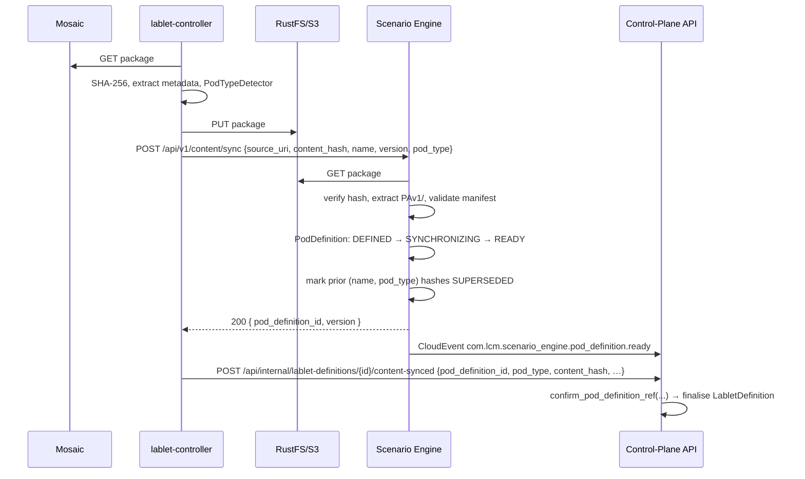

# CPA ↔ Scenario Engine Integration Plan

> **Living document — source of truth for the CPA/SE integration work.**
> Update this file as gaps are closed, decisions are made, or scope evolves.
>
> **Owner**: Senior Architect (LCM)
> **Authority**: [ADR-044 — Content-Driven Lifecycle Engine](../architecture/adr/ADR-044-content-driven-lifecycle-engine.md) (Rev 2)
> **Status**: 🟢 Phase 1 — SE content sync becomes real (G-01 closed); Phase 2 next
> **Last updated**: see git history

---

## 0. How to use this document

1. **Section 3** is the canonical gap catalog. Every gap has an ID (`G-NN`), severity, current state, target state, remediation, and impacted files.
2. **Section 6** is the phased delivery plan. Each phase enumerates the gaps it closes.
3. **Section 7** is the decision log (AD-CSI-NNN). Append new decisions; do not rewrite history.
4. When a gap is closed: change its status banner from `🔴 Open` → `🟢 Closed` and add a `Closed:` line referencing the PR/commit. Do **not** delete the entry.
5. Open questions accumulate in §8. Resolve them inline with a decision ID and a date.

---

## 1. Executive summary

ADR-044 calls for a two-engine architecture:

- **Control-Plane API (CPA)** — owns _session lifecycle_, _phase orchestration_, and the _DAG of steps within each phase_ via the `PipelineExecutor`. CPA is the **sole MongoDB writer**.
- **Scenario Engine (SE)** — owns _atomic operations against external systems_ (CML, RADkit, …) expressed as a jq-flavoured DSL, executed as **Jobs** with a **PodDefinition** ref for capability scoping. SE is **stateless w.r.t. business data**; it persists only its own Jobs and PodDefinitions.

**What exists today (Nov 2025):**

- ✅ SE runtime is functional in isolation — `JobExecutionService`, `DSLExecutor` (`call`/`do`/`set`/`try`), `ScenarioRegistry`, two real scenarios (`lab_resolve@v1`, `lab_start@v1`), CloudEvent callback service.
- ✅ CPA domain model carries `PodDefinitionRef` on `LabletDefinition`.
- ✅ `lablet-controller` has a complete `ContentSyncService` that downloads, hashes, and uploads Lablet packages to RustFS and records the result back to CPA.
- ✅ `ScenarioEngineClient` is registered in `lablet-controller` DI.
- ✅ Pipeline DAG executor (`PipelineExecutor`) handles topological sort, `skip_when`, retry, timeout, resumability.

**What is missing — the integration gap:**

| Theme | Status |
|---|---|
| Content extraction → SE | � lablet-controller does not yet notify SE; SE's `SyncContentCommand` is now a full 10-step orchestrator (Phase 1, G-01 closed). Outbound notification remains Phase 2 (G-02). |
| Pod type auto-discovery | 🟢 **Closed (Phase 0, G-04)** — `PodTypeDetector` enforces AD-CSI-002 priority chain (manifest > radkit > proxmox > vmware > cml.yaml > legacy) in `lcm_core.infrastructure.content_store`. |
| `PodDefinition` entity | 🟢 **Closed (Phase 0, G-03)** — 8 typed PAv1 fields added (`content_hash`, `topology`, `devices`, `lifecycle_phases`, `scenarios`, `grading_rules`, `reports`, `restore_rules`) with safe defaults; event payload extended. |
| `ScenarioEngineClient` call sites | 🔴 client is registered but **zero** call sites — nothing in lablet-controller submits jobs to SE. |
| CloudEvent callbacks → CPA | 🔴 `events_controller.py` has TODO stubs in all 5 handlers. |
| PAv1/ content layout | 🟢 **Closed (Phase 0, G-08)** — spec at `docs/architecture/content-format/PAv1.md` + 3 JSON Schema Draft 2020-12 files (vendored under `lcm_core/infrastructure/content_store/schemas/`). |
| DSL boundary | 🟡 unclear in code base — see §4 for the canonical answer. |
| Content-driven pipelines | 🔴 `PipelineTemplateResolver` is hardcoded Python; ADR-044 calls for content-loaded `lifecycle.yaml`. |
| Reports & scoring scenarios | 🔴 no `collect-grade` / `score-report` scenarios exist. |
| Adapter framework | 🟡 `AdapterRegistry` exists but only a CML adapter; no RADkit, Proxmox, VMware adapters. |
| Resource-scheduler ↔ pod-type | 🟡 `PodDefinitionRef.is_compatible_with(worker_pod_type)` exists but is not consulted in scheduling. |
| Versioning & supersession | 🟡 PodDefinition has `SUPERSEDED` state but no command flow to mark old defs superseded on new content hash. |

The remediation is **content-driven sync redesign + missing-call-site implementation**, sequenced in 6 phases (§6). The codebase is closer to ADR-044 than expected; this plan focuses on connective tissue rather than greenfield.

---

## 2. Current state inventory

### 2.1 Scenario Engine (`src/scenario-engine/`)

| Path | Purpose | State |
|---|---|---|
| `main.py` | App composition: `Job` + `PodDefinition` MotorRepositories, `JobExecutionService` HostedService, `CloudEventCallbackService` singleton, auto-discovers `@scenario`. | ✅ Complete |
| `application/commands/submit_job_command.py` | Validates `scenario_name@version`, creates `Job`, persists, enqueues. Accepts `pod_definition_id`, `callback_url`. | ✅ Complete |
| `application/commands/sync_content_command.py` | End-to-end 10-step orchestration: validate → load/create aggregate → `SYNCHRONIZING` → S3 download → SHA-256 → pod-type detection → PAv1 extract → JSON-schema validation → `mark_ready` → supersede stale READY definitions → emit `pod_definition.ready.v1`. Failures funnel to `mark_failed` + `pod_definition.sync_failed.v1`. _Phase 1 closed G-01._ | 🟢 |
| `application/commands/cancel_job_command.py` | Cancellation. | ✅ |
| `application/services/job_execution_service.py` | HostedService — asyncio.Queue + semaphore, startup sweep (`SUBMITTED→re-enqueue`, `RUNNING→FAILED`), `_dispatch_loop`, `_execute_job` (builds `ScenarioContext` with `AdapterRegistry`, `report_progress`, `cancellation_event`). | ✅ |
| `application/services/dsl_executor.py` | `call` / `do` / `set` / `try`; `input.from` / `output.as` / `export.as` / `if` / `timeout` / `retry`; jq vars `$context`, `$input`, `$output`. | ✅ Phase 2 |
| `application/services/jq_evaluator.py` | `resolve_value`, `resolve_object`, `is_expression`. | ✅ |
| `application/services/scenario_registry.py` | `@scenario(name, version)` decorator + `get_scenario` + `get_all_scenarios`. | ✅ |
| `scenarios/lab_resolve_scenario.py` | `@scenario("lab_resolve", "v1")` — calls `context.adapters.require("cml")`. | ✅ |
| `scenarios/lab_start_scenario.py` | `@scenario("lab_start", "v1")`. | ✅ |
| `scenarios/echo_scenario.py` | Test utility. | ✅ |
| `domain/entities/job.py` | `Job` aggregate, `JobStatus` (SUBMITTED/RUNNING/COMPLETED/FAILED/CANCELLED). | ✅ |
| `domain/entities/pod_definition.py` | `PodDefinitionState` has `id, name, version, pod_type, status, source_uri, local_path, manifest, created_at, synced_at`. **Missing**: `topology`, `devices`, `grading_rules`, `scenarios`, `lifecycle_phases`, `content_hash`. _Phase 0 closed G-03: 8 PAv1 fields added with safe defaults._ | 🟢 |
| `integration/services/cloud_event_client.py` | `CloudEventCallbackService` — emits structured CloudEvents to `callback_url` via httpx. | ✅ |
| `api/controllers/jobs_controller.py` | `POST /api/v1/jobs`, `GET /api/v1/jobs/{id}`, `DELETE /api/v1/jobs/{id}`. | ✅ |
| `api/controllers/content_controller.py` | `POST /api/v1/content/sync` → `SyncContentCommand` (stub). | 🟡 |
| `api/controllers/scenarios_controller.py` | `GET /api/v1/scenarios` (registry browse). | ✅ |

### 2.2 Shared core (`src/core/lcm_core/`)

| Path | Purpose | State |
|---|---|---|
| `domain/enums/pod_type.py` | `PodType`: `CML_ON_AWS`, `ROC_RADKIT`, `PROXMOX`, `VMWARE`. | ✅ |
| `domain/enums/pod_definition_status.py` | `DEFINED → SYNCHRONIZING → READY → EXPIRED \| SUPERSEDED`. | ✅ |
| `domain/value_objects/pod_definition_ref.py` | `PodDefinitionRef(definition_id, version, pod_type, content_hash=None)` + `with_sync_confirmation(hash)` + `is_compatible_with(worker_pod_type)` + `to_dict/from_dict`. | ✅ |
| `domain/value_objects/managed_lifecycle.py` | `ManagedLifecycle` VO referencing `PipelineExecutor` or `ScenarioEngine` per phase. | 🟡 partial |
| `domain/dsl/` package | **MISSING** — ADR-044 §4.1 calls for shared `task_types`, `expressions`, `lifecycle_definition`. | 🔴 |
| `infrastructure/content_store/` package | Ships in `lcm_core.infrastructure.content_store`: `PAv1Validator`, `PodTypeDetector` (AD-CSI-002), `ExtractedContent`, full `ContentExtractor`, and `S3ContentClient` (Phase 1, G-01). | 🟢 |
| `integration/clients/control_plane_api_client.py` | HTTP client for CPA `record_content_sync_result` etc. | ✅ |
| `integration/clients/etcd_client.py` | etcd watch primitives. | ✅ |

### 2.3 Control-Plane API (`src/control-plane-api/`)

| Path | Purpose | State |
|---|---|---|
| `domain/entities/lablet_definition.py` | `LabletDefinitionState` has `pod_definition_ref: PodDefinitionRef \| None`; `create()` accepts `pod_type: PodType \| None` and builds the ref. Content fields: `cml_yaml_content`, `devices_json`, `content_xml_content`, `user_visible_devices`, `port_template`, `port_conflicts`, `lds_port_preferences`, `upstream_sync_status`, `pipelines`. | ✅ |
| `domain/events/lablet_definition_events.py` | `pod_definition_ref` carried in `LabletDefinitionCreatedDomainEvent`. | ✅ |
| `application/commands/lablet_definition/sync_lablet_definition_command.py` | `aggregate.request_sync()` → emits event → etcd projector writes `/lcm/definitions/{id}/content_sync` → 202 Accepted. | ✅ |
| `application/commands/lablet_definition/record_content_sync_result_command.py` | Receives sync results via `POST /api/internal/lablet-definitions/{id}/content-synced`. Bumps version on content-hash change (AD-CS-005). On success calls `pod_definition_ref.with_sync_confirmation(hash)`. _Phase 0 closed G-07: now also accepts `pod_type` + `pod_definition_id` and delegates to `LabletDefinition.confirm_pod_definition(...)`._ | 🟢 |
| `application/dtos/lablet_definition_dto.py` | `PodDefinitionRefDto` exposed. | ✅ |
| `infrastructure/seeding/lablet_definition_seeder.py` (L240–265) | Reads `pod_type` string from seed YAML, builds `PodType`, passes to `LabletDefinition.create()`. | ✅ |
| `application/commands/lablet_session/` | Full session lifecycle commands (`start_instantiation`, `transition_lablet_session`, `update_pipeline_progress`, `mark_session_ready`, `terminate`, …). | ✅ |

### 2.4 Lablet Controller (`src/lablet-controller/`)

| Path | Purpose | State |
|---|---|---|
| `main.py` (L159) | `ScenarioEngineClient.configure(builder.services, base_url=settings.scenario_engine_url, callback_url=settings.scenario_engine_callback_url)`. | ✅ Registered |
| `integration/services/scenario_engine_client.py` | `submit_job(scenario_name, input_data, scenario_version, pod_definition_id, callback_url)`, `get_job_status`, `cancel_job`. **Zero call sites.** | 🔴 Unused |
| `application/hosted_services/content_sync_service.py` | etcd watch + poll → resolves Mosaic URL → downloads package → SHA-256 hash → `_extract_metadata()` parses `mosaic_meta.json`, `cml.yaml`, `grade.xml`, `devices.json`, `content.xml`, port template, port conflicts, node definitions → uploads to RustFS → notifies LDS → calls CPA `RecordContentSyncResultCommand`. **Does not**: extract `pod_type`, parse `PAv1/`, notify SE. | 🟡 |
| `application/services/pipeline_executor.py` | DAG executor with `graphlib.TopologicalSorter`, `simpleeval` `skip_when`, retry, timeout, resumability. | ✅ |
| `application/services/lifecycle_phase_handler.py` | asyncio.Task wrapper per `(pipeline, session)`, AD-PIPELINE-007 (no auto-terminate on failure). | ✅ |
| `application/services/pipeline_template_resolver.py` | Hardcoded Python templates: `standard-instantiate` (lab_resolve → ports_alloc → tags_sync → lab_binding → lab_start → lds_provision → mark_ready), `standard-teardown`, `standard-collect-evidence`, `standard-compute-grading`. Supports `extends`, `insert_after`, `insert_before`, `overrides`, `remove`. | 🟡 Hardcoded |
| `application/services/step_handlers/` | 21 step modules; `lab_resolve_step.py` **duplicates** SE's `lab_resolve_scenario.py` logic. | 🟡 Duplication |
| `api/controllers/events_controller.py` | CloudEvent ingestion at `/events`, structured + binary mode parsing. **All 5 handlers (`_handle_job_started/progress/completed/failed/cancelled`) are TODO stubs** — no `pipeline_execution_record` updates, no session transitions. | 🔴 |

### 2.5 Other services

| Service | Relevance to this plan |
|---|---|
| `worker-controller` | Provisions CML workers; advertises a `pod_type` per worker. Out of scope here except where the scheduler matches `PodDefinitionRef.pod_type ↔ worker.pod_type`. |
| `resource-scheduler` | Must consult `PodDefinitionRef.is_compatible_with(worker_pod_type)`. See G-11. |
| `scenario-engine/scenarios/` | Eventual home of content-loaded scenarios (today scenarios are Python). See G-09 / phase 5. |

---

## 3. Gap catalog

> **Severity**: 🔥 Blocker (no end-to-end flow without it) · 🔴 High · 🟡 Medium · 🟢 Low
> **Status**: 🔴 Open · 🟡 In progress · 🟢 Closed

### G-01 — SE `SyncContentCommand` is a stub  🔥 Blocker — � Closed

**Closed:** Phase 1, multiple commits — `SyncContentCommandHandler` now executes the full 10-step pipeline (validate → load/create → SYNCHRONIZING → S3 download → SHA-256 → pod-type detection → PAv1 extract → JSON-schema validation → READY → supersede stale → emit `pod_definition.ready.v1`). Failures funnel through `mark_failed` + `pod_definition.sync_failed.v1`. Backed by:

- `lcm_core.infrastructure.content_store.S3ContentClient` (boto3, async-wrapped, moto-tested).
- `lcm_core.infrastructure.content_store.ContentExtractor` (full PAv1 walker; optional `detected_pod_type` hint per AD-CSI-012).
- `PodDefinitionRepository.expire_superseded_definitions_async()` on interface + Mongo impl.
- `PodDefinitionStatus.FAILED` lifecycle state + `mark_failed()` + `PodDefinitionSyncFailedDomainEvent` (AD-CSI-011).
- `CloudEventCallbackService.emit_content_synced()` + `emit_sync_failed()` (AD-CSI-013).

**Verification:** core 307 ✓ · scenario-engine 110 ✓ (10 new command tests + 4 new supersede tests).

**Current state.** `application/commands/sync_content_command.py` finds-or-creates a `PodDefinition` and transitions to `SYNCHRONIZING`. It never downloads from S3, never extracts `PAv1/`, never transitions to `READY`, never records the manifest.

**Target state (ADR-044 §3.2).** Given `(source_uri, pod_definition_id?, content_hash?)`:

1. Resolve a target `PodDefinition` (find existing by `content_hash` or create new).
2. Transition `DEFINED → SYNCHRONIZING`.
3. Download the package from S3/RustFS into a local cache.
4. Verify SHA-256 matches `content_hash` (if supplied) — else compute and record it.
5. Extract `PAv1/` tree (see §5 spec): `manifest.yaml`, `lifecycle.yaml`, `scenarios/*.yaml`, `grading/*.yaml`, `reports/*.yaml`, `restore/*.yaml`.
6. Validate `manifest.yaml` (pod_type, topology refs, scenario refs).
7. Populate `PodDefinition` fields (`topology`, `devices`, `grading_rules`, `scenarios`, `lifecycle_phases`, `manifest`, `local_path`).
8. Transition to `READY` (emit `PodDefinitionReadyDomainEvent`).
9. Mark any previous version with the same `(name, pod_type)` and a different hash as `SUPERSEDED` (emit event).
10. Emit CloudEvent `com.lcm.scenario_engine.content_synced` with `{pod_definition_id, version, content_hash, pod_type}` to CPA via `CloudEventCallbackService`.

**Remediation.**

- Add `lcm_core.infrastructure.content_store.S3ContentClient` (boto3, async-wrapped) and `ContentExtractor` (zipfile + PAv1 schema validator).
- Expand `SyncContentCommand` handler to orchestrate the above (still a single self-contained command; long-running steps run inside the handler since the command is invoked from a background context).
- Add new fields to `PodDefinitionState` (see **G-03**).
- Add `expire_superseded_definitions_async` helper to `PodDefinitionRepository`.

**Files.**

- `src/scenario-engine/application/commands/sync_content_command.py` (rewrite)
- `src/scenario-engine/domain/entities/pod_definition.py` (expand state — see G-03)
- `src/core/lcm_core/infrastructure/content_store/` (new package)
- `src/scenario-engine/integration/services/cloud_event_client.py` (add `emit_content_synced(...)`)

**Acceptance.** Given a valid `PAv1/` zip at an S3 URI, a single `POST /api/v1/content/sync` results in a `PodDefinition(status=READY, content_hash=…, manifest=…, lifecycle_phases=…)` and a CloudEvent delivered to CPA's callback endpoint.

---

### G-02 — `lablet-controller` does not notify SE  🔥 Blocker — 🔴 Open

**Current state.** `ContentSyncService` extracts metadata and POSTs to CPA's `RecordContentSyncResultCommand`. It never tells SE about the package, so SE never gets a `PodDefinition`.

**Target state.** After uploading to RustFS and computing `content_package_hash`, but **before** calling CPA, the controller calls `ScenarioEngineClient.sync_content(source_uri=rustfs_uri, content_hash=..., name=definition.name, version=definition.version, pod_type=<discovered>)`. SE owns the resulting `PodDefinition.id`. The controller then includes `pod_definition_id` + `pod_type` in the CPA `RecordContentSyncResultCommand` payload so CPA can finalise `pod_definition_ref`.

**Remediation.**

- Add `sync_content(...)` method to `ScenarioEngineClient` (mirrors SE's `POST /api/v1/content/sync`).
- Insert SE call into `ContentSyncService._process_sync_request()` after RustFS upload, before CPA notification.
- Add idempotency: if SE returns an existing `PodDefinition` for the same hash, reuse its id.
- Make SE call best-effort with retry; on persistent failure surface a warning in `sync_status` but **do not** block CPA notification — see open question Q-02.

**Files.**

- `src/lablet-controller/integration/services/scenario_engine_client.py` (add `sync_content`)
- `src/lablet-controller/application/hosted_services/content_sync_service.py` (call SE)
- `src/lablet-controller/application/commands/record_content_sync_result_command.py` (CPA side — accept `pod_definition_id` + `pod_type`)

**Acceptance.** A definition synced end-to-end produces both (a) updated CPA `LabletDefinition` with valid `pod_definition_ref.content_hash`, and (b) `PodDefinition(status=READY)` in SE's MongoDB.

---

### G-03 — `PodDefinition` entity missing content fields  🔴 — 🟢 Closed (Phase 0)

**Closed:** commit `7d760fe` (feat(scenario-engine): expand PodDefinitionState with PAv1 typed fields).

**Current.** `PodDefinitionState` has only `manifest: dict`. Everything is shoved into the opaque manifest blob.

**Target (ADR-044 §2.5).** First-class typed fields make the rest of SE — DSL executors, adapters, scenarios — addressable.

```python
class PodDefinitionState(AggregateState[str]):
    id: str
    name: str
    version: str
    pod_type: PodType
    status: PodDefinitionStatus
    source_uri: str
    local_path: str | None
    content_hash: str | None          # NEW — SHA-256 of source package

    # Extracted from PAv1/
    manifest: dict[str, Any]          # raw manifest.yaml
    topology: dict[str, Any] | None   # cml.yaml / radkit.yaml / proxmox.yaml
    devices: list[dict] | None        # devices.json / equivalent
    lifecycle_phases: dict[str, Any] | None   # phases/*.yaml indexed by phase name
    scenarios: dict[str, dict] | None         # scenarios/*.yaml indexed by name@version
    grading_rules: dict[str, Any] | None      # grading/*.yaml
    reports: dict[str, Any] | None            # reports/*.yaml
    restore_rules: dict[str, Any] | None      # restore/*.yaml

    created_at: datetime | None
    synced_at: datetime | None
```

**Remediation.** Expand `PodDefinitionState`, expand `PodDefinitionReadyDomainEvent` payload, update `@dispatch` handler. No migration script needed (no production data yet); for any existing dev rows, repository deserialisation tolerates missing keys via field defaults.

**Files.**

- `src/scenario-engine/domain/entities/pod_definition.py`
- `src/scenario-engine/domain/events/pod_definition_events.py`

**Acceptance.** Repository round-trip preserves all fields; `DSLExecutor` can resolve `$pod.lifecycle_phases.init` via jq.

---

### G-04 — Pod-type auto-discovery missing  🔴 — 🟢 Closed (Phase 0)

**Closed:** commit `d5600a1` (feat(content-store): PAv1 spec, schemas, PAv1Validator and PodTypeDetector). Phase 1/2 will invoke the detector from lablet-controller and SE.

**Current.** `pod_type` is hand-authored in seed YAML. Real-world Lablet zips have no such annotation.

**Target.** A deterministic priority chain extracts `pod_type` from package contents (see §5.1 priority chain).

**Remediation.** Implement `lcm_core.infrastructure.content_store.PodTypeDetector` with the priority chain, invoked first by `lablet-controller`'s `ContentSyncService` (so SE call can include it), and again defensively by SE's `SyncContentCommand` (so SE never trusts the caller blindly).

**Files.**

- `src/core/lcm_core/infrastructure/content_store/pod_type_detector.py` (new)
- `src/lablet-controller/application/hosted_services/content_sync_service.py` (call detector)
- `src/scenario-engine/application/commands/sync_content_command.py` (call detector)

**Acceptance.** Given a zip with only `cml.yaml`, detector returns `PodType.CML_ON_AWS`. Given a zip with `PAv1/manifest.yaml: { pod_type: roc_radkit }`, returns `PodType.ROC_RADKIT`. Given an ambiguous zip, raises with a list of detected signals.

---

### G-05 — `ScenarioEngineClient` is registered but never called  🔥 Blocker — 🔴 Open

**Current.** Pipeline step handlers (e.g. `lab_resolve_step.py`) call adapters directly (`context.cml.create_lab`, …), duplicating SE's `lab_resolve_scenario.py`.

**Target (ADR-044 §3.4).** Step handlers that mirror an SE scenario submit a Job to SE and await the callback; the step records the resulting `job_id` in the pipeline execution record, then suspends until a CloudEvent arrives.

**Remediation — two-tier design.**

- **Tier A (synchronous step, current pattern, kept for _coordination_ steps)**: `ports_alloc`, `tags_sync`, `lab_binding`, `mark_ready`, `deregister_lds`, `archive` — operations that touch CPA's MongoDB or short-lived in-process state. These stay as Python `@step_handler` functions.
- **Tier B (SE-delegated step, new pattern, for _external-system_ steps)**: `lab_resolve`, `lab_start`, `lab_stop`, `lab_wipe`, `collect_grade`, `score_report` — wrap a single SE Job submission.

Introduce a `ScenarioEngineStep` base class:

```python
class ScenarioEngineStep(StepHandler):
    scenario_name: str
    scenario_version: str = "v1"

    async def execute(self, ctx: StepContext) -> StepResult:
        job_id = await ctx.scenario_engine.submit_job(
            scenario_name=self.scenario_name,
            scenario_version=self.scenario_version,
            input_data=self.build_input(ctx),
            pod_definition_id=ctx.session.pod_definition_id,
            callback_url=ctx.callback_url,
        )
        ctx.record_external_job(job_id, step_name=self.name)
        return StepResult.suspended(reason=f"awaiting SE job {job_id}")
```

The pipeline executor already supports `existing_progress` resumability — extend it to recognise `SUSPENDED` steps and resume on CloudEvent arrival.

**Files.**

- `src/lablet-controller/application/services/step_handlers/_scenario_engine_step.py` (new base)
- `src/lablet-controller/application/services/step_handlers/lab_resolve_step.py` (rewrite as `ScenarioEngineStep`)
- `src/lablet-controller/application/services/step_handlers/lab_start_step.py` (rewrite)
- `src/lablet-controller/application/services/pipeline_executor.py` (handle `StepResult.suspended`)
- `src/lablet-controller/application/services/lifecycle_phase_handler.py` (wake on event)

**Acceptance.** A `standard-instantiate` pipeline run produces SE Jobs visible in `/api/v1/jobs`; pipeline step transitions from `RUNNING → SUSPENDED → COMPLETED` on `com.lcm.scenario_engine.job.completed` arrival.

---

### G-06 — `events_controller` handlers are TODO stubs  🔥 Blocker — 🔴 Open

**Current.** `src/lablet-controller/api/controllers/events_controller.py` parses CloudEvents (structured + binary mode) but every handler logs and exits.

**Target.** Each handler:

1. Validates the CloudEvent shape and extracts `job_id` + `step_correlation_id`.
2. Looks up the suspended step in the pipeline execution record.
3. Issues the appropriate CPA command:
   - `job.started` → `RecordExternalJobStartedCommand` (audit only)
   - `job.progress` → `UpdatePipelineProgressCommand` (existing)
   - `job.completed` → `ResumePipelineStepCommand(result=event.data.output)`
   - `job.failed` → `FailPipelineStepCommand(error=event.data.error)`
   - `job.cancelled` → `FailPipelineStepCommand(error="cancelled")`
4. Returns 202 Accepted on success; 4xx on validation errors (so SE retries are bounded).

**Remediation.** Implement the 5 handlers; add new `ResumePipelineStepCommand` and `FailPipelineStepCommand` to CPA.

**Files.**

- `src/lablet-controller/api/controllers/events_controller.py`
- `src/control-plane-api/application/commands/lablet_session/resume_pipeline_step_command.py` (new)
- `src/control-plane-api/application/commands/lablet_session/fail_pipeline_step_command.py` (new)

**Acceptance.** SE emits a `job.completed` event; within 1 s the corresponding pipeline step is `COMPLETED` in MongoDB and the next step is dispatched.

---

### G-07 — `RecordContentSyncResultCommand` does not accept `pod_type`  🟡 — 🟢 Closed (Phase 0)

**Closed:** commit `820dcaf` (feat(control-plane-api): confirm PodDefinition link on content sync). Aggregate method `LabletDefinition.confirm_pod_definition(...)` validates `pod_type` (400 unknown / 409 conflict) and emits `LabletDefinitionPodDefinitionConfirmedDomainEvent`. See AD-CSI-010.

**Current.** The command finalises `LabletDefinition.pod_definition_ref.with_sync_confirmation(hash)` but cannot set the ref if it was `None` (i.e. `pod_type` was not in seed YAML).

**Target.** Accept `pod_type: PodType | None` and `pod_definition_id: str | None`. If `pod_definition_ref` is `None` on the aggregate, **build** it from `(pod_definition_id, definition.version, pod_type, content_hash)`. If it already exists, keep its id but update `content_hash` and validate `pod_type` matches.

**Files.**

- `src/control-plane-api/application/commands/lablet_definition/record_content_sync_result_command.py`
- `src/control-plane-api/application/dtos/record_content_sync_result_dto.py`
- `src/control-plane-api/domain/entities/lablet_definition.py` (add `confirm_pod_definition(...)` aggregate method)

**Acceptance.** A definition seeded without `pod_type` gains a valid `pod_definition_ref` after content sync completes.

---

### G-08 — PAv1/ content layout not defined  🔴 — 🟢 Closed (Phase 0)

**Closed:** commit `d5600a1` (feat(content-store): PAv1 spec, schemas, PAv1Validator and PodTypeDetector).

**Current.** No spec. Lablet zips contain `mosaic_meta.json`, `cml.yaml`, `grade.xml`, `devices.json`, `content.xml`, `node-definitions/`, `image-definitions/`. ADR-044 references `PAv1/` but doesn't pin the schema.

**Target.** Publish a versioned format spec (`PAv1`) as a doc + JSON schema, and adopt it incrementally.

See §5 for the proposed schema. Spec authorship: this plan + a follow-up `docs/architecture/content-format/PAv1.md`.

**Files.**

- `docs/architecture/content-format/PAv1.md` (new — schema spec)
- `docs/architecture/content-format/schemas/manifest.schema.json` (new)
- `docs/architecture/content-format/schemas/lifecycle.schema.json` (new)
- `docs/architecture/content-format/schemas/scenario.schema.json` (new)
- `src/core/lcm_core/infrastructure/content_store/pav1_validator.py` (new — uses `jsonschema`)

**Acceptance.** A reference fixture `tests/fixtures/pav1_minimal.zip` validates green; a fixture missing `manifest.yaml` fails with a clear diagnostic.

---

### G-09 — Pipeline templates hardcoded in Python  🟡 — 🔴 Open

**Current.** `pipeline_template_resolver.py` exposes 4 Python-defined templates.

**Target (ADR-044 §3.3).** Templates load from `PAv1/lifecycle.yaml`. If a phase is absent in content, the resolver falls back to the Python `standard-*` template (preserves today's behaviour for un-migrated definitions).

**Remediation.**

- Add `ContentDrivenTemplateLoader` that reads `PodDefinition.lifecycle_phases` (loaded by SE during sync) via CPA's `PodDefinitionRef` → CPA queries `PodDefinitionReadModel` (read-only projection in CPA, populated by CloudEvent listener — see also G-12).
- `PipelineTemplateResolver` chain-of-responsibility: `ContentDrivenLoader → DBLoader (lablet_definition.pipelines) → HardcodedLoader`.

**Files.**

- `src/lablet-controller/application/services/pipeline_template_resolver.py`
- `src/lablet-controller/application/services/content_driven_template_loader.py` (new)
- `src/control-plane-api/infrastructure/projections/pod_definition_projector.py` (new — see G-12)

**Acceptance.** A definition whose `PAv1/lifecycle.yaml` defines a custom `instantiate` phase causes the executor to run those steps; a definition without it runs the hardcoded template.

---

### G-10 — Reports and scoring scenarios missing  🟡 — 🔴 Open

**Current.** No `collect_grade` or `score_report` scenarios in SE; lablet-controller has `standard-collect-evidence` and `standard-compute-grading` as Python pipelines but their step handlers are placeholders.

**Target.** Two new SE scenarios — `collect_grade@v1` (pull device state from CML/RADkit), `score_report@v1` (apply grading rules) — and content-driven `collect_evidence` + `compute_score` lifecycle phases in `PAv1/lifecycle.yaml`. The grading rules themselves live in `PAv1/grading/rubric.yaml` and are passed to `score_report@v1` as input.

**Files.**

- `src/scenario-engine/scenarios/collect_grade_scenario.py` (new)
- `src/scenario-engine/scenarios/score_report_scenario.py` (new)
- `docs/architecture/content-format/PAv1.md` §grading
- `tests/fixtures/pav1_minimal.zip` with a sample rubric

**Acceptance.** A session completes `collect_grade → score_report`; the produced report (JSON document) is persisted via CPA `RecordSessionReportCommand` and visible in the UI.

---

### G-11 — Resource-scheduler ignores `pod_type` compatibility  🟡 — 🔴 Open

**Current.** `PodDefinitionRef.is_compatible_with(worker_pod_type)` exists; no scheduler code calls it.

**Target.** Scheduler's `AllocateWorkerForSessionCommand` filters candidate workers via `pod_definition_ref.is_compatible_with(worker.pod_type)` before applying resource fitness.

**Files.**

- `src/resource-scheduler/application/commands/allocate_worker_command.py` (locate, add filter)
- `src/worker-controller/domain/entities/cml_worker.py` (ensure `pod_type` field exists; default `CML_ON_AWS`)

**Acceptance.** Allocating a session whose `pod_type=ROC_RADKIT` does not select a CML-only worker.

---

### G-12 — Versioning, supersession and CPA-side read model  🟡 — 🔴 Open

**Current.** `PodDefinition` has `SUPERSEDED` state but no command transitions to it; CPA has no view of SE's `PodDefinition` content (only the `Ref`).

**Target.**

- SE `SyncContentCommand` marks prior definitions with same `(name, pod_type)` and a different hash as `SUPERSEDED`.
- SE emits `com.lcm.scenario_engine.pod_definition.superseded` and `pod_definition.ready` events.
- CPA subscribes via a `PodDefinitionProjector` HostedService → writes a read-only `pod_definitions` collection mirroring SE state (id, name, version, pod_type, status, content_hash, lifecycle_phases, scenarios). Used by `ContentDrivenTemplateLoader` (G-09) and the UI to display "what scenarios will run".
- The projection is **read-only** in CPA — it never mutates back to SE. This preserves the "CPA = sole write authority for business state" rule because `PodDefinition` is _SE-owned business state_.

**Files.**

- `src/scenario-engine/application/commands/sync_content_command.py` (supersession logic — also covered by G-01)
- `src/control-plane-api/infrastructure/projections/pod_definition_projector.py` (new)
- `src/control-plane-api/integration/repositories/pod_definition_read_repository.py` (new — read-only)

**Acceptance.** Syncing a new content_hash for an existing name+pod_type results in: (a) old SE PodDefinition `SUPERSEDED`, (b) new one `READY`, (c) CPA's `pod_definitions` collection reflects both.

---

## 4. DSL vs Pipeline boundary — canonical clarification

> **Frequent confusion:** the DSL is **not** shared between CPA and SE. They operate at different layers.

| Layer | Engine | Language | Defined in | Purpose |
|---|---|---|---|---|
| **Phase orchestration** | CPA `PipelineExecutor` (via lablet-controller) | YAML DAG with `steps[].handler` Python refs (resolved through `@step_handler` registry) | `PAv1/lifecycle.yaml` (content-driven, target) **or** `LabletDefinition.pipelines` (DB row, current) **or** hardcoded templates (today) | Coordinates _which steps run in what order_ across CPA + external systems within a phase (init, post-init, collect-grade, score-report, teardown). Steps may be Tier-A (in-process Python) or Tier-B (delegated to SE). |
| **Atomic external operation** | SE `DSLExecutor` | jq-flavoured `call` / `do` / `set` / `try` (Phase 2); `for`/`fork`/`switch` Phase 3+ | `PAv1/scenarios/<name>.yaml` (content-driven, target) or Python `@scenario` decorator (existing scenarios) | Performs one logically-atomic task against an external system (CML, RADkit, …) through an `Adapter`. Receives typed input, returns typed output, emits CloudEvent on completion. |

**Implication for content authors.**

- `lifecycle.yaml` orchestrates **phases** of steps. Steps may call SE scenarios (Tier-B) or CPA built-ins (Tier-A).
- `scenarios/*.yaml` defines reusable atomic operations. They never call back into CPA — they run, emit a result, and SE emits a CloudEvent to CPA.

**Implication for code.**

- `lcm_core.domain.dsl` (G-08-adjacent, ADR-044 §4.1) holds **shared task-type definitions** (`call`/`do`/`set`/`try` AST nodes, jq expression parser) so SE _and_ tooling validators speak the same DSL.
- CPA never imports the DSL executor — it only invokes scenarios via `ScenarioEngineClient`.

This boundary is recorded as **AD-CSI-001** below.

---

## 5. Content format & pod-type discovery

### 5.1 Pod-type discovery priority chain

`PodTypeDetector.detect(package_path: Path) -> tuple[PodType, list[str]]`

| Priority | Signal | Maps to |
|---|---|---|
| 1 | `PAv1/manifest.yaml: { pod_type: <value> }` (explicit) | `PodType(value)` |
| 2 | `PAv1/topology/radkit.yaml` exists | `ROC_RADKIT` |
| 3 | `PAv1/topology/proxmox.yaml` exists | `PROXMOX` |
| 4 | `PAv1/topology/vmware.yaml` exists | `VMWARE` |
| 5 | `cml.yaml` or `cml.yml` exists at zip root or in `PAv1/topology/` | `CML_ON_AWS` |
| 6 | `radkit.yaml` at zip root | `ROC_RADKIT` |
| — | None of the above | raise `PodTypeIndeterminate(signals=[...])` |

Returns `(detected_type, signals_considered)` for audit logging.

### 5.2 PAv1/ package layout (target)

```
<package>.zip
├── PAv1/
│   ├── manifest.yaml              # version, pod_type, content_id, scenarios used, lifecycle ref
│   ├── topology/
│   │   ├── cml.yaml               # OR radkit.yaml / proxmox.yaml / vmware.yaml
│   │   └── devices.json           # device definitions (replaces top-level devices.json)
│   ├── lifecycle.yaml             # phase DAGs (instantiate, post-init, collect-grade, score-report, teardown)
│   ├── scenarios/                 # optional content-defined scenarios (else SE registry is used)
│   │   ├── lab_resolve.v1.yaml
│   │   ├── lab_start.v1.yaml
│   │   ├── collect_grade.v1.yaml
│   │   └── score_report.v1.yaml
│   ├── grading/
│   │   └── rubric.yaml            # graded items, expected values, weights
│   ├── reports/
│   │   └── summary.yaml           # report templates
│   └── restore/
│       └── restore.yaml           # snapshot/restore directives
├── mosaic_meta.json               # legacy (kept for backward compat during migration)
├── cml.yml                        # legacy (kept; PAv1/topology/cml.yaml wins if both present)
├── grade.xml                      # legacy
└── content.xml                    # legacy (LDS device visibility, port preferences)
```

### 5.3 Content sync sequence (target)



---

## 6. Phased implementation plan

> Each phase is independently deployable. Feature flag `SE_INTEGRATION_ENABLED` defaults `false` until Phase 4.

### Phase 0 — Foundations (no behaviour change) 🟢 Complete (commits d5600a1, 7d760fe, 820dcaf, c081eab)

- **G-08** PAv1/ spec doc + JSON schemas + reference fixture. ✅
- **G-03** Expand `PodDefinitionState` fields & events. ✅
- **G-04** `PodTypeDetector` + unit tests. ✅
- **G-07** `RecordContentSyncResultCommand` accepts `pod_type` (still optional). ✅
- Add `lcm_core.infrastructure.content_store` package skeleton. ✅

**Verification:** core 293 ✓ · scenario-engine 99 ✓ · control-plane-api 1078 ✓ (7 new); content_store coverage 97%.

- Add `lcm_core.infrastructure.content_store` package skeleton.

### Phase 1 — SE content sync becomes real 🟢 Complete

- **G-01** Implement `SyncContentCommand` end-to-end (download, extract, validate, persist, supersede). ✅
- Update `tests/scenario-engine/` to cover the new flow with the reference fixture. ✅

**Verification:** core 307 ✓ (added 6 extractor + 12 S3 client tests) · scenario-engine 110 ✓ (added 10 command + 4 supersede tests). New decisions: AD-CSI-011, AD-CSI-012, AD-CSI-013.

### Phase 2 — `lablet-controller` calls SE

- **G-02** Add `ScenarioEngineClient.sync_content`; wire into `ContentSyncService`.
- **G-12** `PodDefinitionProjector` HostedService in CPA — read-only mirror of SE state via CloudEvent listener.
- Behaviour flagged off by default; turn on in dev.

### Phase 3 — Pipeline ↔ SE delegation (Tier-B steps)

- **G-05** `ScenarioEngineStep` base class; rewrite `lab_resolve_step` and `lab_start_step` as Tier-B.
- **G-06** Implement all 5 CloudEvent handlers in `events_controller`.
- Add `ResumePipelineStepCommand` / `FailPipelineStepCommand` to CPA.
- Extend `PipelineExecutor` to honour `StepResult.suspended`.

### Phase 4 — Content-driven lifecycle (`lifecycle.yaml`)

- **G-09** `ContentDrivenTemplateLoader` + chain-of-responsibility in `PipelineTemplateResolver`.
- Flip `SE_INTEGRATION_ENABLED=true` by default.
- Migrate the canonical CML lablet to ship a `PAv1/lifecycle.yaml`.

### Phase 5 — Grading & reports

- **G-10** `collect_grade@v1` and `score_report@v1` scenarios.
- `RecordSessionReportCommand` in CPA + UI surfacing.

### Phase 6 — Scheduler + multi-platform readiness

- **G-11** Scheduler filters by `pod_type` compatibility.
- Add `RADkitAdapter` scaffold (no real integration yet) — proves the adapter framework.
- Spec follow-ups for `PROXMOX` / `VMWARE`.

---

## 7. Decision log

| ID | Title | Decision | Rationale |
|---|---|---|---|
| **AD-CSI-001** | DSL is **not** shared between CPA and SE | CPA uses Python `@step_handler` references resolved at runtime; SE uses jq DSL with `call`/`do`/`set`/`try`. Shared layer is the **content format** (`PAv1/`), not the execution model. | Two engines, two responsibilities (orchestration vs atomic op). A shared DSL would force coupling and re-implement Python control flow in YAML. The content format is the contract, not the runtime. |
| **AD-CSI-002** | Pod-type discovery priority chain (§5.1) | `manifest.yaml > radkit > proxmox > vmware > cml.yaml > radkit.yaml > raise` | Explicit always wins; topology files are strong implicit signals; raise on ambiguity rather than guess. |
| **AD-CSI-003** | Content sync handoff: lablet-controller calls SE before CPA | The controller uploads to RustFS, then triggers `SE.sync_content`, then records to CPA — including the SE-returned `pod_definition_id`. | The controller is the only component with access to the original Mosaic stream and S3 credentials. SE only sees an S3 URI. CPA only sees an opaque ref. Single responsibility per service. |
| **AD-CSI-004** | `PodDefinition` carries first-class typed fields, not just an opaque `manifest` blob | Add `topology`, `devices`, `lifecycle_phases`, `scenarios`, `grading_rules`, `reports`, `restore_rules`, `content_hash`. | The DSL executor and the CPA projector both query these; manifest-blob access would force every consumer to re-implement parsing. |
| **AD-CSI-005** | `events_controller` handlers issue CPA commands, not direct repository writes | Use Mediator-dispatched `ResumePipelineStepCommand` / `FailPipelineStepCommand`. | Preserves CQRS discipline (CPA = sole MongoDB writer through CPA commands); keeps event handling thin and idempotent. |
| **AD-CSI-006** | Migration strategy = feature flag `SE_INTEGRATION_ENABLED` | Phases 0-3 ship behind the flag; flip in Phase 4. | Allows incremental rollout; preserves today's working pipeline templates as fallback. |
| **AD-CSI-007** | CPA's `pod_definitions` collection is a **read-only projection** of SE state | CPA never writes to it via commands; only the `PodDefinitionProjector` (HostedService listening to SE CloudEvents) writes. | `PodDefinition` is SE-owned business state. The projection is a read model, not a duplicate aggregate; satisfies "CPA owns its own write model" without forcing UI to call SE directly. |
| **AD-CSI-008** | Tier-A vs Tier-B steps (§G-05) | Steps that touch external systems (`lab_resolve`, `lab_start`, `lab_stop`, `lab_wipe`, `collect_grade`, `score_report`) become Tier-B (SE-delegated). Steps that touch CPA state (`ports_alloc`, `tags_sync`, `lab_binding`, `mark_ready`, `deregister_lds`, `archive`) stay Tier-A (in-process Python). | Avoids splitting transactional CPA operations across services; concentrates "external system mess" in SE where adapters live. |
| **AD-CSI-009** | Suspension/resumption uses `StepResult.suspended` + CloudEvent | Steps return `SUSPENDED`; `PipelineExecutor` persists state; a CloudEvent handler issues `ResumePipelineStepCommand` to re-enter the executor. | Reuses existing `existing_progress` resumability; no new long-poll or websocket needed. |
| **AD-CSI-010** | PodDefinition confirmation: 400 unknown pod_type / 409 pod_type conflict (Phase 0, G-07) | `RecordContentSyncResultCommand` validates `pod_type` up-front (returns `bad_request` if not a `PodType` member) **before** any aggregate mutation. `LabletDefinition.confirm_pod_definition()` accepts either a `PodType` enum or its string value; it raises `ValueError` on `pod_type` mismatch against an existing `PodDefinitionRef`, which the handler maps to `conflict` (409). | Two-layer validation keeps the bad_request fast-path cheap (no aggregate construction) while still letting the domain invariant (`pod_type` immutability per definition version) live on the aggregate. Accepting enum-or-string at the aggregate boundary lets internal callers pass typed enums while wire callers pass the value string. |
| **AD-CSI-011** | `PodDefinition.FAILED` is a first-class lifecycle state (Phase 1, G-01) | Added `PodDefinitionStatus.FAILED`, `PodDefinitionSyncFailedDomainEvent`, `mark_failed(reason, error_detail)` and bidirectional `SYNCHRONIZING ↔ FAILED` transitions so force re-syncs of a previously failed definition are legal. State fields `error_message`, `error_detail`, `failed_at` carry diagnostics; cleared on `SyncStarted`. | Surfacing failures as durable aggregate state (rather than transient log lines) is required for UI display, retries, and supersession bookkeeping. Bidirectional transition keeps recovery a single command rather than aggregate replacement. |
| **AD-CSI-012** | `ExtractedContent.detected_pod_type` is optional (Phase 1, G-01) | `ContentExtractor` runs `PodTypeDetector` defensively and stores the result as `Optional[PodType]`. If detection raises `PodTypeIndeterminate`, the extractor still raises `PAv1ValidationError` for the missing manifest but propagates `detected_pod_type=None` so callers see why detection failed. | Detection is informational at extraction time — manifest validity is the authoritative signal. Treating detection as a fail-open hint keeps the extractor's contract narrow (PAv1 conformance) while still surfacing topology hints for failure diagnostics. |
| **AD-CSI-013** | CloudEvent callback URL is per-request, not per-PodDefinition (Phase 1, G-01) | `SyncContentCommand.callback_url` is optional and resolved at emit time via `CloudEventCallbackService._resolve_target_url`: per-request URL > `settings.cloud_event_sink` > skip. Applies to both `pod_definition.ready.v1` and `pod_definition.sync_failed.v1`. | Per-request URLs keep the PodDefinition aggregate free of caller-specific transport metadata, defer transport policy to the orchestrator (CPA / lablet-controller), and stay consistent with `SubmitJobCommand`'s existing `callback_url` model (Q-03). |

---

## 8. Open questions

| ID | Question | Status |
|---|---|---|
| Q-01 | Should `pod_definition_id` be deterministic (e.g. `sha256(name+pod_type+content_hash)[:16]`) or random uuid4? Deterministic helps idempotency across replays. | **Open** — proposed: deterministic. |
| Q-02 | If SE is unreachable during `lablet-controller` sync, do we (a) fail the whole sync, (b) record to CPA with `pod_definition_ref=None` and retry SE async, or (c) block CPA notification until SE succeeds? | **Open** — proposed (b) with a `pod_definition_sync_status: pending`. |
| Q-03 | Where does the `callback_url` live? Per-job (current `SubmitJobCommand` field) or per-PodDefinition? | **Open** — per-job keeps SE stateless; revisit if event volume becomes an issue. |
| Q-04 | Are `PAv1/scenarios/*.yaml` _additive_ to SE's Python registry, or do they _override_? What if both exist for `lab_resolve@v1`? | **Open** — proposed: content-defined wins, with a warning log. |
| Q-05 | Should the projection (`PodDefinitionProjector` in CPA) be event-sourced or last-write-wins from a snapshot? | **Open** — proposed: last-write-wins from `pod_definition.ready` payload; `superseded` event flips the status flag. |
| Q-06 | How is etcd watcher used in tandem with SE sync? Today `sync_lablet_definition_command` writes `/lcm/definitions/{id}/content_sync` and the controller watches. Do we add a parallel `/lcm/pod_definitions/{id}/state` write from SE for visibility, or is the CloudEvent stream sufficient? | **Open** — proposed: CloudEvent stream + CPA projection; etcd not needed for pod_definitions. |

---

## 9. Risks

| Risk | Probability | Impact | Mitigation |
|---|---|---|---|
| SE goes down mid-pipeline → all Tier-B steps stuck `SUSPENDED` | M | H | Add a watchdog in `lifecycle_phase_handler` that polls SE `GET /api/v1/jobs/{id}` after `WORKER_JOB_TIMEOUT × 1.5`; fails the step with timeout error. |
| Adapter implementations diverge between lablet-controller (legacy `lab_resolve_step`) and SE (`lab_resolve_scenario`) during the migration window | H | M | Phase 3 deletes the duplicated step handlers in the same commit that introduces the Tier-B replacement; do not leave both paths active. |
| Hash-collision masquerading as same content | L | H | SHA-256 with full package digest (not just metadata) — already in `ContentSyncService`. |
| Content authors mis-declare `pod_type` in `manifest.yaml` | M | M | `PodTypeDetector` runs even when `manifest.yaml` declares — if signals disagree, fail with a clear diagnostic listing all signals. |
| CloudEvent loss between SE and lablet-controller | L | H | CloudEvent emission is fire-and-forget today; add a retry loop in `CloudEventCallbackService` with exponential backoff and a per-job `delivery_attempts` counter. Also rely on the watchdog (above) as ultimate backstop. |
| Schema drift in `PAv1/` across versions | M | M | JSON schemas versioned (`PAv1`, `PAv2`, …); `manifest.yaml` declares `format_version`; validator rejects unknown versions with explicit error. |

---

## 10. Opportunities

| Opportunity | Notes |
|---|---|
| Replace hardcoded `pipeline_template_resolver.py` templates with `PAv1/lifecycle.yaml` shipped inside a single canonical CML lablet | Demonstrates the new flow end-to-end with zero new content authoring; can ship as a fixture. |
| Use the SE Job model to back-port other long-running operations (e.g. worker provisioning) | Out of scope here but worth tracking: any `WorkerController` operation > 30 s could become an SE Job for free retry/cancellation/CloudEvent semantics. |
| UI surfaces `PodDefinition.scenarios` so operators can see what will run for a session before it runs | Trivial once G-12 lands. |
| Replay capability via SE's content-hash-keyed `PodDefinition` lookup | A failed session can be re-run with the exact same content version, even after newer hashes have been promoted. |
| Multi-tenancy via PodDefinition versioning | Different tenants can pin different versions of the same `(name, pod_type)` for stability. |

---

## 11. Maintenance commitment

This document is the **source of truth** for CPA↔SE integration work.

- **On every PR** that touches files listed under §3 or §6, the PR author updates:
  - The affected gap's **Status** banner.
  - If the gap is closed, add a `Closed:` line with PR/commit SHA at the bottom of the gap section.
  - Append any new decision to §7 (next AD-CSI-NNN id).
  - Append any new open question to §8 with a date.
- **No silent scope changes.** Adding a new gap requires a new G-NN entry with severity + remediation; do not edit existing gap scopes after they enter `In progress`.
- **Cross-references.** When code lands, link the file under §2 (current state inventory) to the gap it resolves, e.g. `(closes G-01)`.

---

## 12. Glossary

- **CPA** — Control-Plane API (`src/control-plane-api/`). Sole MongoDB writer; owns sessions, definitions, lablet records.
- **SE** — Scenario Engine (`src/scenario-engine/`). Stateless w.r.t. business state; owns Jobs and PodDefinitions.
- **lablet-controller** — Reconciler service (`src/lablet-controller/`). Runs pipelines, syncs content, bridges CPA ↔ SE.
- **PodDefinition** — SE-owned aggregate representing a content package (zip) extracted into typed fields.
- **PodDefinitionRef** — VO held by CPA's `LabletDefinition` pointing at a PodDefinition (id, version, pod_type, content_hash).
- **PAv1/** — Pod Artifact format v1; canonical content layout (§5.2).
- **Tier-A step** — Pipeline step that runs in-process in lablet-controller (touches CPA state).
- **Tier-B step** — Pipeline step that delegates to an SE Job (touches external systems).
- **DSL** — SE's jq-flavoured task language (`call`/`do`/`set`/`try`). Not used by CPA.

---

_Authority: ADR-044 Rev 2. Cross-refs: `docs/implementation/scenario-engine-job-execution.md`, `docs/implementation/content_synchronization.md`, `docs/architecture/adr/ADR-044-content-driven-lifecycle-engine.md`._
