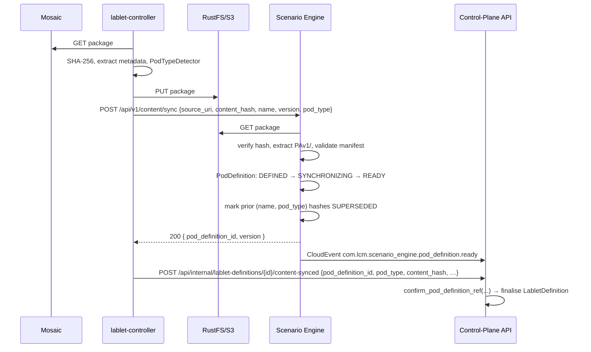

<!-- markdownlint-disable MD013 MD056 -->

> [!WARNING]
>
> ## 🗄️ ARCHIVED — SUPERSEDED
>
> This document is **no longer the source of truth** for the CPA/SE split. The reconciled,
> authoritative design now lives in the **Solution Design** doc set:
> [`docs/architecture/solution/`](../architecture/solution/index.md).
>
> | For… | See |
> |---|---|
> | Service ownership & boundaries | [Solution Overview](../architecture/solution/solution-overview.md) |
> | The automation pattern | [Generic Pattern](../architecture/solution/generic-pattern.md) |
> | Content sync flow | [Flow: Content Sync](../architecture/solution/flow-content-sync.md) |
> | Session delivery flow | [Flow: Session Delivery](../architecture/solution/flow-session-delivery.md) |
> | Canonical content sample | [LAB-0.1 (PAv1)](../architecture/solution/examples/LAB-0.1/README.md) |
> | Vocabulary | [Glossary](../architecture/solution/glossary.md) |
>
> Kept **read-only for history** (gap catalog, decision log, phase records). Do not use for new work.

# CPA ↔ Scenario Engine Integration Plan

> **Living document — source of truth for the CPA/SE integration work.**
> Update this file as gaps are closed, decisions are made, or scope evolves.
>
> **Owner**: Senior Architect (LCM)
> **Authority**: [ADR-044 — Content-Driven Lifecycle Engine](../architecture/adr/ADR-044-content-driven-lifecycle-engine.md) (Rev 2)
> **Status**: 🗄️ **ARCHIVED — superseded by [`docs/architecture/solution/`](../architecture/solution/index.md)**. (Historical: Phases 0 – 3 + follow-ups Q-10 / Q-11 complete.)
> **Last updated**: see git history

---

## 0. How to use this document

1. **Section 3** is the canonical gap catalog. Every gap has an ID (`G-NN`), severity, current state, target state, remediation, and impacted files.
2. **Section 6** is the phased delivery plan. Each phase enumerates the gaps it closes.
3. **Section 7** is the decision log (AD-CSI-NNN). Append new decisions; do not rewrite history.
4. When a gap is closed: change its status banner from `🔴 Open` → `🟢 Closed` and add a `Closed:` line referencing the PR/commit. Do **not** delete the entry.
5. Open questions accumulate in §8. Resolve them inline with a decision ID and a date.

---

## 1. Executive summary

ADR-044 calls for a two-engine architecture:

- **Control-Plane API (CPA)** — owns _session lifecycle_, _phase orchestration_, and the _DAG of steps within each phase_ via the `PipelineExecutor`. CPA is the **sole MongoDB writer**.
- **Scenario Engine (SE)** — owns _atomic operations against external systems_ (CML, RADkit, …) expressed as a jq-flavoured DSL, executed as **Jobs** with a **PodDefinition** ref for capability scoping. SE is **stateless w.r.t. business data**; it persists only its own Jobs and PodDefinitions.

**What exists today (Nov 2025):**

- ✅ SE runtime is functional in isolation — `JobExecutionService`, `DSLExecutor` (`call`/`do`/`set`/`try`), `ScenarioRegistry`, two real scenarios (`lab_resolve@v1`, `lab_start@v1`), CloudEvent callback service.
- ✅ CPA domain model carries `PodDefinitionRef` on `LabletDefinition`.
- ✅ `lablet-controller` has a complete `ContentSyncService` that downloads, hashes, and uploads Lablet packages to RustFS and records the result back to CPA.
- ✅ `ScenarioEngineClient` is registered in `lablet-controller` DI.
- ✅ Pipeline DAG executor (`PipelineExecutor`) handles topological sort, `skip_when`, retry, timeout, resumability.

**What is missing — the integration gap:**

| Theme | Status |
|---|---|
| Content extraction → SE | � SE's `SyncContentCommand` is a full 10-step orchestrator (Phase 1, G-01 🟢 closed). lablet-controller calls `ScenarioEngineClient.sync_content` from `ContentSyncService` as a best-effort step (Phase 2, G-02 🟢 closed — AD-CSI-014). CPA mirrors SE's `PodDefinition` state via a CloudEvent read-model projection (G-12 🟢 closed — AD-CSI-015). |
| Pod type auto-discovery | 🟢 **Closed (Phase 0, G-04)** — `PodTypeDetector` enforces AD-CSI-002 priority chain (manifest > radkit > proxmox > vmware > cml.yaml > legacy) in `lcm_core.infrastructure.content_store`. |
| `PodDefinition` entity | 🟢 **Closed (Phase 0, G-03)** — 8 typed PAv1 fields added (`content_hash`, `topology`, `devices`, `lifecycle_phases`, `scenarios`, `grading_rules`, `reports`, `restore_rules`) with safe defaults; event payload extended. |
| `ScenarioEngineClient` call sites | � **Closed (Phase 3, G-05)** — `_scenario_engine_step.submit_scenario_engine_job` helper + flag-gated `lab_resolve_step` / `lab_start_step` submit SE Jobs when `scenario_engine_integration_enabled=true`. Other Tier-B steps (`lab_stop`, `lab_wipe`, `collect_grade`, `score_report`) deferred to Phases 5+. |
| CloudEvent callbacks → CPA | 🟢 **Closed (Phase 3, G-06; refactored AD-CSI-020)** — replaced bespoke `events_controller` with Neuroglia framework-native pipeline (`CloudEventMiddleware` → `CloudEventBus` → `CloudEventIngestor` → `Mediator` → 5 `IntegrationEventHandler`s in `application/events/integration/scenario_engine_handler.py`). Drives CPA via `ResumePipelineStepCommand` / `FailPipelineStepCommand` (AD-CSI-005) + signals in-process `LifecyclePhaseHandler` registry for resumption (AD-CSI-016). |
| PAv1/ content layout | 🟢 **Closed (Phase 0, G-08)** — spec at `docs/architecture/content-format/PAv1.md` + 3 JSON Schema Draft 2020-12 files (vendored under `lcm_core/infrastructure/content_store/schemas/`). |
| DSL boundary | 🟡 unclear in code base — see §4 for the canonical answer. |
| Content-driven pipelines | � **Closed (Phase 4, G-09; AD-CSI-024)** — `PipelineTemplateResolver.resolve_for(...)` is a 4-tier chain (ContentDriven → DB inline → DB extends → hardcoded `_TEMPLATES`); first non-`None` wins. DB operators always apply on top (Q-13 conservative stance). `ContentDrivenTemplateLoader` reads `lifecycle_phases` from CPA via `ControlPlaneApiClient.get_pod_definition(...)`. `SCENARIO_ENGINE_INTEGRATION_ENABLED=true` is now the default; legacy Tier-A bodies of `lab_resolve_step` / `lab_start_step` deleted (AD-CSI-025). |
| Reports & scoring scenarios | 🔴 no `collect-grade` / `score-report` scenarios exist. |
| Adapter framework | 🟡 `AdapterRegistry` exists but only a CML adapter; no RADkit, Proxmox, VMware adapters. |
| Resource-scheduler ↔ pod-type | 🟡 `PodDefinitionRef.is_compatible_with(worker_pod_type)` exists but is not consulted in scheduling. |
| Versioning & supersession | 🟡 PodDefinition has `SUPERSEDED` state but no command flow to mark old defs superseded on new content hash. |

The remediation is **content-driven sync redesign + missing-call-site implementation**, sequenced in 6 phases (§6). The codebase is closer to ADR-044 than expected; this plan focuses on connective tissue rather than greenfield.

---

## 2. Current state inventory

### 2.1 Scenario Engine (`src/scenario-engine/`)

| Path | Purpose | State |
|---|---|---|
| `main.py` | App composition: `Job` + `PodDefinition` MotorRepositories, `JobExecutionService` HostedService, `CloudEventCallbackService` singleton, auto-discovers `@scenario`. | ✅ Complete |
| `application/commands/submit_job_command.py` | Validates `scenario_name@version`, creates `Job`, persists, enqueues. Accepts `pod_definition_id`, `callback_url`. | ✅ Complete |
| `application/commands/sync_content_command.py` | End-to-end 10-step orchestration: validate → load/create aggregate → `SYNCHRONIZING` → S3 download → SHA-256 → pod-type detection → PAv1 extract → JSON-schema validation → `mark_ready` → supersede stale READY definitions → emit `pod_definition.ready.v1`. Failures funnel to `mark_failed` + `pod_definition.sync_failed.v1`. _Phase 1 closed G-01._ | 🟢 |
| `application/commands/cancel_job_command.py` | Cancellation. | ✅ |
| `application/services/job_execution_service.py` | HostedService — asyncio.Queue + semaphore, startup sweep (`SUBMITTED→re-enqueue`, `RUNNING→FAILED`), `_dispatch_loop`, `_execute_job` (builds `ScenarioContext` with `AdapterRegistry`, `report_progress`, `cancellation_event`). | ✅ |
| `application/services/dsl_executor.py` | `call` / `do` / `set` / `try`; `input.from` / `output.as` / `export.as` / `if` / `timeout` / `retry`; jq vars `$context`, `$input`, `$output`. | ✅ Phase 2 |
| `application/services/jq_evaluator.py` | `resolve_value`, `resolve_object`, `is_expression`. | ✅ |
| `application/services/scenario_registry.py` | `@scenario(name, version)` decorator + `get_scenario` + `get_all_scenarios`. | ✅ |
| `scenarios/lab_resolve_scenario.py` | `@scenario("lab_resolve", "v1")` — calls `context.adapters.require("cml")`. | ✅ |
| `scenarios/lab_start_scenario.py` | `@scenario("lab_start", "v1")`. | ✅ |
| `scenarios/echo_scenario.py` | Test utility. | ✅ |
| `domain/entities/job.py` | `Job` aggregate, `JobStatus` (SUBMITTED/RUNNING/COMPLETED/FAILED/CANCELLED). | ✅ |
| `domain/entities/pod_definition.py` | `PodDefinitionState` has `id, name, version, pod_type, status, source_uri, local_path, manifest, created_at, synced_at`. **Missing**: `topology`, `devices`, `grading_rules`, `scenarios`, `lifecycle_phases`, `content_hash`. _Phase 0 closed G-03: 8 PAv1 fields added with safe defaults._ | 🟢 |
| `integration/services/cloud_event_client.py` | `CloudEventCallbackService` — emits structured CloudEvents to `callback_url` via httpx. `emit_content_synced(...)` accepts optional `lifecycle_phases: dict \| None` + `scenarios: list \| None` kwargs (Phase 4, AD-CSI-023) and forwards them in the `data` payload of `scenario_engine.pod_definition.ready.v1` for CPA's typed-fields projection. | 🟢 Phase 4 |
| `api/controllers/jobs_controller.py` | `POST /api/v1/jobs`, `GET /api/v1/jobs/{id}`, `DELETE /api/v1/jobs/{id}`. | ✅ |
| `api/controllers/content_controller.py` | `POST /api/v1/content/sync` → `SyncContentCommand` (stub). | 🟡 |
| `api/controllers/scenarios_controller.py` | `GET /api/v1/scenarios` (registry browse). | ✅ |

### 2.2 Shared core (`src/core/lcm_core/`)

| Path | Purpose | State |
|---|---|---|
| `domain/enums/pod_type.py` | `PodType`: `CML_ON_AWS`, `ROC_RADKIT`, `PROXMOX`, `VMWARE`. | ✅ |
| `domain/enums/pod_definition_status.py` | `DEFINED → SYNCHRONIZING → READY → EXPIRED \| SUPERSEDED`. | ✅ |
| `domain/value_objects/pod_definition_ref.py` | `PodDefinitionRef(definition_id, version, pod_type, content_hash=None)` + `with_sync_confirmation(hash)` + `is_compatible_with(worker_pod_type)` + `to_dict/from_dict`. | ✅ |
| `domain/value_objects/managed_lifecycle.py` | `ManagedLifecycle` VO referencing `PipelineExecutor` or `ScenarioEngine` per phase. | 🟡 partial |
| `domain/dsl/` package | **MISSING** — ADR-044 §4.1 calls for shared `task_types`, `expressions`, `lifecycle_definition`. | 🔴 |
| `infrastructure/content_store/` package | Ships in `lcm_core.infrastructure.content_store`: `PAv1Validator`, `PodTypeDetector` (AD-CSI-002), `ExtractedContent`, full `ContentExtractor`, and `S3ContentClient` (Phase 1, G-01). | 🟢 |
| `integration/clients/control_plane_api_client.py` | HTTP client for CPA `record_content_sync_result` etc. | ✅ |
| `integration/clients/etcd_client.py` | etcd watch primitives. | ✅ |

### 2.3 Control-Plane API (`src/control-plane-api/`)

| Path | Purpose | State |
|---|---|---|
| `domain/entities/lablet_definition.py` | `LabletDefinitionState` has `pod_definition_ref: PodDefinitionRef \| None`; `create()` accepts `pod_type: PodType \| None` and builds the ref. Content fields: `cml_yaml_content`, `devices_json`, `content_xml_content`, `user_visible_devices`, `port_template`, `port_conflicts`, `lds_port_preferences`, `upstream_sync_status`, `pipelines`. | ✅ |
| `domain/events/lablet_definition_events.py` | `pod_definition_ref` carried in `LabletDefinitionCreatedDomainEvent`. | ✅ |
| `application/commands/lablet_definition/sync_lablet_definition_command.py` | `aggregate.request_sync()` → emits event → etcd projector writes `/lcm/definitions/{id}/content_sync` → 202 Accepted. | ✅ |
| `application/commands/lablet_definition/record_content_sync_result_command.py` | Receives sync results via `POST /api/internal/lablet-definitions/{id}/content-synced`. Bumps version on content-hash change (AD-CS-005). On success calls `pod_definition_ref.with_sync_confirmation(hash)`. _Phase 0 closed G-07: now also accepts `pod_type` + `pod_definition_id` and delegates to `LabletDefinition.confirm_pod_definition(...)`._ | 🟢 |
| `application/dtos/lablet_definition_dto.py` | `PodDefinitionRefDto` exposed. | ✅ |
| `infrastructure/seeding/lablet_definition_seeder.py` (L240–265) | Reads `pod_type` string from seed YAML, builds `PodType`, passes to `LabletDefinition.create()`. | ✅ |
| `application/commands/lablet_session/` | Full session lifecycle commands (`start_instantiation`, `transition_lablet_session`, `update_pipeline_progress`, `mark_session_ready`, `terminate`, …). | ✅ |
| `domain/read_models/pod_definition_read_model.py` | `PodDefinitionReadModel` — last-write-wins projection of SE state (Phase 2, AD-CSI-015). **Phase 4 / AD-CSI-023 typed-fields delta:** `lifecycle_phases: dict[str, dict] = {}` + `scenarios: list[dict] = []` with safe defaults. Read by `ContentDrivenTemplateLoader` (lablet-controller, AD-CSI-024). | 🟢 Phase 4 |
| `application/commands/pod_definition_read/project_pod_definition_ready_command.py` | Projects `scenario_engine.pod_definition.ready.v1` integration events onto the read model. **Phase 4 / AD-CSI-023:** populates `lifecycle_phases` + `scenarios` via `getattr(event, "lifecycle_phases", None)` / `getattr(event, "scenarios", None)` (mandatory `getattr` per AD-CSI-021 because `CloudEventIngestor` bypasses `__init__`). | 🟢 Phase 4 |
| `application/queries/pod_definition_read/get_pod_definition_query.py` | `GetPodDefinitionQuery(definition_id)` → `PodDefinitionDto` (HTTP 200) or typed 404. DTO carries `lifecycle_phases` + `scenarios` post-Phase 4. Consumed by `ControlPlaneApiClient.get_pod_definition` from lablet-controller. | 🟢 Phase 4 |
| `api/controllers/pod_definitions_controller.py` | `GET /api/v1/pod-definitions/{definition_id}` (NEW Phase 4 Step 4). Dispatches `GetPodDefinitionQuery`, returns DTO incl. `lifecycle_phases` + `scenarios`, maps not-found to RFC-7807 404. | 🟢 Phase 4 |

### 2.4 Lablet Controller (`src/lablet-controller/`)

| Path | Purpose | State |
|---|---|---|
| `main.py` | `ScenarioEngineClient.configure(builder.services, base_url=settings.scenario_engine_url, callback_url=settings.scenario_engine_callback_url)` + `CloudEventIngestor.configure(builder, ["application.events.integration"])` + `Mediator.configure(builder, ["application.events.integration"])` for SE CloudEvent ingestion. | ✅ Registered |
| `integration/services/scenario_engine_client.py` | `submit_job(scenario_name, input_data, scenario_version, pod_definition_id, callback_url, metadata)`, `get_job_status`, `cancel_job`. Call sites: Tier-B step helper `_scenario_engine_step.submit_scenario_engine_job` (Phase 3, G-05). Forwards AD-CSI-017 metadata to SE. | ✅ |
| `application/hosted_services/content_sync_service.py` | etcd watch + poll → resolves Mosaic URL → downloads package → SHA-256 hash → `_extract_metadata()` parses `mosaic_meta.json`, `cml.yaml`, `grade.xml`, `devices.json`, `content.xml`, port template, port conflicts, node definitions, **`PodTypeDetector.detect_from_bytes()`** → uploads to RustFS → notifies LDS → best-effort `ScenarioEngineClient.sync_content` (AD-CSI-014, Phase 2, G-02) → calls CPA `RecordContentSyncResultCommand` with `pod_type` + `pod_definition_id`. | ✅ |
| `application/hosted_services/suspended_step_watchdog_service.py` | Leader-gated periodic asyncio loop (AD-CSI-018, closes Q-10). Scans active sessions, fails Tier-B steps whose `suspended_at` exceeds `pipeline_external_step_default_timeout_seconds` via CPA `fail_pipeline_step`; signals `LifecyclePhaseHandler.lookup(session_id).fail_after_external_completion(progress)` after CPA confirms. | ✅ |
| `application/services/pipeline_executor.py` | DAG executor with `graphlib.TopologicalSorter`, `simpleeval` `skip_when`, retry, timeout, resumability. Honours `StepResult.suspended` → returns `PipelineRunOutcome.SUSPENDED` and surfaces `external_jobs` (Phase 3, G-05). `resume_after_external_completion` / `fail_after_external_completion` re-enter the run on CloudEvent arrival. | ✅ |
| `application/services/lifecycle_phase_handler.py` | asyncio.Task wrapper per `(pipeline, session)`, AD-PIPELINE-007 (no auto-terminate on failure). Maintains class-level in-process registry (AD-CSI-016) for resumption signal from `ScenarioEngineCloudEventHandler` (the 5 `IntegrationEventHandler`s in `application/events/integration/scenario_engine_handler.py`) / `SuspendedStepWatchdogService`. | ✅ |
| `application/services/pipeline_template_resolver.py` | Chain-of-responsibility resolver (AD-CSI-024). Sync `resolve(pipeline_def)` preserved for backward-compat; new async `resolve_for(pipeline_def, *, context)` walks 4 tiers (ContentDriven → DB inline → DB extends → `_TEMPLATES["standard-<name>"]`) with `_apply_operators(base, customization)` extracted as a private helper invoked by both entry-points. `_TEMPLATES` retained as last-ditch fallback for legacy seeds without inline `pipelines:` or content-driven `lifecycle.yaml`. | 🟢 Phase 4 |
| `application/services/content_driven_template_loader.py` | NEW (Phase 4 Step 6). Tier 1 of the resolver chain. `async load(name, context)` looks up `PodDefinitionRef.definition_id` via `ControlPlaneApiClient.get_pod_definition(...)`, then extracts `pod_def.state.lifecycle_phases[name]`. Returns `None` on any miss (missing pod_definition_id, CPA 404 via typed `ControlPlaneApiNotFoundError`, no matching phase) so the chain falls through. 6 unit tests + 3 integration parity tests. | 🟢 Phase 4 |
| `application/services/step_handlers/lab_resolve_step.py` | Tier-B-only handler (AD-CSI-025). ~50 LOC. Validates topology YAML, submits `lab_resolve@v1` SE job, returns `StepResult.suspended`. Legacy in-process body deleted Phase 4. | 🟢 Phase 4 |
| `application/services/step_handlers/lab_start_step.py` | Tier-B-only handler (AD-CSI-025). ~50 LOC. Reads `cml_lab_id` from upstream `lab_resolve` progress, submits `lab_start@v1` SE job, returns `StepResult.suspended`. Legacy in-process body + convergence-poll deleted Phase 4. | 🟢 Phase 4 |
| `application/models/pipeline_context.py` | Added `ScenarioEngineIntegrationDisabledError` raised by `LabletReconciler._build_pipeline_context` when the break-glass switch is engaged (AD-CSI-025). Removed `scenario_engine_enabled` field and `resolve_lab_for_instance` callback — both were sole-consumed by the deleted Tier-A bodies. | 🟢 Phase 4 |
| `application/services/step_handlers/` | 21 step modules; `lab_resolve_step.py` / `lab_start_step.py` are Tier-B-only (AD-CSI-025). Single code path post-Phase 4 — break-glass enforced at PipelineContext construction time. | 🟢 |
| `application/services/step_handlers/_scenario_engine_step.py` | Tier-B helper `submit_scenario_engine_job(binding, step_name, instance, context, input_data)` — submits SE Job, returns `StepResult.suspended(external_job_id, step_correlation_id)`. Reads `context.definition.pod_definition_ref.definition_id` to scope the SE Job. | ✅ |
| `application/events/integration/scenario_engine_events.py` | Five `@cloudevent`-decorated `IntegrationEvent[str]` dataclasses (`ScenarioEngineJob{Started,Progress,Completed,Failed,Cancelled}IntegrationEventV1`) mapping SE's `scenario_engine.job.*.v1` envelope shapes. | ✅ |
| `application/events/integration/scenario_engine_handler.py` | Five `IntegrationEventHandler`s (AD-CSI-005, AD-CSI-016, AD-CSI-019). Terminal handlers (`completed`/`failed`/`cancelled`) validate AD-CSI-017 metadata + source allow-list, call `ControlPlaneApiClient.resume_pipeline_step` / `fail_pipeline_step`, swallow CPA 404 (idempotency), then signal `LifecyclePhaseHandler.lookup(session_id)` for fast in-process resumption. **Replaces the deleted bespoke `api/controllers/events_controller.py`** (AD-CSI-020). | ✅ |

### 2.5 Other services

| Service | Relevance to this plan |
|---|---|
| `worker-controller` | Provisions CML workers; advertises a `pod_type` per worker. Out of scope here except where the scheduler matches `PodDefinitionRef.pod_type ↔ worker.pod_type`. |
| `resource-scheduler` | Must consult `PodDefinitionRef.is_compatible_with(worker_pod_type)`. See G-11. |
| `scenario-engine/scenarios/` | Eventual home of content-loaded scenarios (today scenarios are Python). See G-09 / phase 5. |

---

## 3. Gap catalog

> **Severity**: 🔥 Blocker (no end-to-end flow without it) · 🔴 High · 🟡 Medium · 🟢 Low
> **Status**: 🔴 Open · 🟡 In progress · 🟢 Closed

### G-01 — SE `SyncContentCommand` is a stub  🔥 Blocker — 🟢 Closed (Phase 1)

**Closed:** Phase 1, multiple commits — `SyncContentCommandHandler` now executes the full 10-step pipeline (validate → load/create → SYNCHRONIZING → S3 download → SHA-256 → pod-type detection → PAv1 extract → JSON-schema validation → READY → supersede stale → emit `pod_definition.ready.v1`). Failures funnel through `mark_failed` + `pod_definition.sync_failed.v1`. Backed by:

- `lcm_core.infrastructure.content_store.S3ContentClient` (boto3, async-wrapped, moto-tested).
- `lcm_core.infrastructure.content_store.ContentExtractor` (full PAv1 walker; optional `detected_pod_type` hint per AD-CSI-012).
- `PodDefinitionRepository.expire_superseded_definitions_async()` on interface + Mongo impl.
- `PodDefinitionStatus.FAILED` lifecycle state + `mark_failed()` + `PodDefinitionSyncFailedDomainEvent` (AD-CSI-011).
- `CloudEventCallbackService.emit_content_synced()` + `emit_sync_failed()` (AD-CSI-013).

**Verification:** core 307 ✓ · scenario-engine 110 ✓ (10 new command tests + 4 new supersede tests).

**Current state.** `application/commands/sync_content_command.py` finds-or-creates a `PodDefinition` and transitions to `SYNCHRONIZING`. It never downloads from S3, never extracts `PAv1/`, never transitions to `READY`, never records the manifest.

**Target state (ADR-044 §3.2).** Given `(source_uri, pod_definition_id?, content_hash?)`:

1. Resolve a target `PodDefinition` (find existing by `content_hash` or create new).
2. Transition `DEFINED → SYNCHRONIZING`.
3. Download the package from S3/RustFS into a local cache.
4. Verify SHA-256 matches `content_hash` (if supplied) — else compute and record it.
5. Extract `PAv1/` tree (see §5 spec): `manifest.yaml`, `lifecycle.yaml`, `scenarios/*.yaml`, `grading/*.yaml`, `reports/*.yaml`, `restore/*.yaml`.
6. Validate `manifest.yaml` (pod_type, topology refs, scenario refs).
7. Populate `PodDefinition` fields (`topology`, `devices`, `grading_rules`, `scenarios`, `lifecycle_phases`, `manifest`, `local_path`).
8. Transition to `READY` (emit `PodDefinitionReadyDomainEvent`).
9. Mark any previous version with the same `(name, pod_type)` and a different hash as `SUPERSEDED` (emit event).
10. Emit CloudEvent `com.lcm.scenario_engine.content_synced` with `{pod_definition_id, version, content_hash, pod_type}` to CPA via `CloudEventCallbackService`.

**Remediation.**

- Add `lcm_core.infrastructure.content_store.S3ContentClient` (boto3, async-wrapped) and `ContentExtractor` (zipfile + PAv1 schema validator).
- Expand `SyncContentCommand` handler to orchestrate the above (still a single self-contained command; long-running steps run inside the handler since the command is invoked from a background context).
- Add new fields to `PodDefinitionState` (see **G-03**).
- Add `expire_superseded_definitions_async` helper to `PodDefinitionRepository`.

**Files.**

- `src/scenario-engine/application/commands/sync_content_command.py` (rewrite)
- `src/scenario-engine/domain/entities/pod_definition.py` (expand state — see G-03)
- `src/core/lcm_core/infrastructure/content_store/` (new package)
- `src/scenario-engine/integration/services/cloud_event_client.py` (add `emit_content_synced(...)`)

**Acceptance.** Given a valid `PAv1/` zip at an S3 URI, a single `POST /api/v1/content/sync` results in a `PodDefinition(status=READY, content_hash=…, manifest=…, lifecycle_phases=…)` and a CloudEvent delivered to CPA's callback endpoint.

---

### G-02 — `lablet-controller` does not notify SE  🔥 Blocker — 🟢 Closed (Phase 2)

**Closed:** Phase 2 wiring — `ScenarioEngineClient.sync_content` + best-effort SE call in `ContentSyncService` (Step 6.5, between RustFS upload and CPA notification). See AD-CSI-014 for the failure-handling decision.

**Current state.** `ContentSyncService` extracts metadata and POSTs to CPA's `RecordContentSyncResultCommand`. It never tells SE about the package, so SE never gets a `PodDefinition`.

**Target state.** After uploading to RustFS and computing `content_package_hash`, but **before** calling CPA, the controller calls `ScenarioEngineClient.sync_content(source_uri=rustfs_uri, content_hash=..., name=definition.name, version=definition.version, pod_type=<discovered>)`. SE owns the resulting `PodDefinition.id`. The controller then includes `pod_definition_id` + `pod_type` in the CPA `RecordContentSyncResultCommand` payload so CPA can finalise `pod_definition_ref`.

**Remediation.**

- Add `sync_content(...)` method to `ScenarioEngineClient` (mirrors SE's `POST /api/v1/content/sync`).
- Insert SE call into `ContentSyncService._process_sync_request()` after RustFS upload, before CPA notification.
- Add idempotency: if SE returns an existing `PodDefinition` for the same hash, reuse its id.
- Make SE call best-effort with retry; on persistent failure surface a warning in `sync_status` but **do not** block CPA notification — see open question Q-02.

**Files.**

- `src/lablet-controller/integration/services/scenario_engine_client.py` (add `sync_content`)
- `src/lablet-controller/application/hosted_services/content_sync_service.py` (call SE)
- `src/lablet-controller/application/commands/record_content_sync_result_command.py` (CPA side — accept `pod_definition_id` + `pod_type`)

**Acceptance.** A definition synced end-to-end produces both (a) updated CPA `LabletDefinition` with valid `pod_definition_ref.content_hash`, and (b) `PodDefinition(status=READY)` in SE's MongoDB.

---

### G-03 — `PodDefinition` entity missing content fields  🔴 — 🟢 Closed (Phase 0)

**Closed:** commit `7d760fe` (feat(scenario-engine): expand PodDefinitionState with PAv1 typed fields).

**Current.** `PodDefinitionState` has only `manifest: dict`. Everything is shoved into the opaque manifest blob.

**Target (ADR-044 §2.5).** First-class typed fields make the rest of SE — DSL executors, adapters, scenarios — addressable.

```python
class PodDefinitionState(AggregateState[str]):
    id: str
    name: str
    version: str
    pod_type: PodType
    status: PodDefinitionStatus
    source_uri: str
    local_path: str | None
    content_hash: str | None          # NEW — SHA-256 of source package

    # Extracted from PAv1/
    manifest: dict[str, Any]          # raw manifest.yaml
    topology: dict[str, Any] | None   # cml.yaml / radkit.yaml / proxmox.yaml
    devices: list[dict] | None        # devices.json / equivalent
    lifecycle_phases: dict[str, Any] | None   # phases/*.yaml indexed by phase name
    scenarios: dict[str, dict] | None         # scenarios/*.yaml indexed by name@version
    grading_rules: dict[str, Any] | None      # grading/*.yaml
    reports: dict[str, Any] | None            # reports/*.yaml
    restore_rules: dict[str, Any] | None      # restore/*.yaml

    created_at: datetime | None
    synced_at: datetime | None
```

**Remediation.** Expand `PodDefinitionState`, expand `PodDefinitionReadyDomainEvent` payload, update `@dispatch` handler. No migration script needed (no production data yet); for any existing dev rows, repository deserialisation tolerates missing keys via field defaults.

**Files.**

- `src/scenario-engine/domain/entities/pod_definition.py`
- `src/scenario-engine/domain/events/pod_definition_events.py`

**Acceptance.** Repository round-trip preserves all fields; `DSLExecutor` can resolve `$pod.lifecycle_phases.init` via jq.

---

### G-04 — Pod-type auto-discovery missing  🔴 — 🟢 Closed (Phase 0)

**Closed:** commit `d5600a1` (feat(content-store): PAv1 spec, schemas, PAv1Validator and PodTypeDetector). Phase 1/2 will invoke the detector from lablet-controller and SE.

**Current.** `pod_type` is hand-authored in seed YAML. Real-world Lablet zips have no such annotation.

**Target.** A deterministic priority chain extracts `pod_type` from package contents (see §5.1 priority chain).

**Remediation.** Implement `lcm_core.infrastructure.content_store.PodTypeDetector` with the priority chain, invoked first by `lablet-controller`'s `ContentSyncService` (so SE call can include it), and again defensively by SE's `SyncContentCommand` (so SE never trusts the caller blindly).

**Files.**

- `src/core/lcm_core/infrastructure/content_store/pod_type_detector.py` (new)
- `src/lablet-controller/application/hosted_services/content_sync_service.py` (call detector)
- `src/scenario-engine/application/commands/sync_content_command.py` (call detector)

**Acceptance.** Given a zip with only `cml.yaml`, detector returns `PodType.CML_ON_AWS`. Given a zip with `PAv1/manifest.yaml: { pod_type: roc_radkit }`, returns `PodType.ROC_RADKIT`. Given an ambiguous zip, raises with a list of detected signals.

---

### G-05 — `ScenarioEngineClient` is registered but never called  🔥 Blocker — � Closed (Phase 3)

**Current.** Pipeline step handlers (e.g. `lab_resolve_step.py`) call adapters directly (`context.cml.create_lab`, …), duplicating SE's `lab_resolve_scenario.py`.

**Target (ADR-044 §3.4).** Step handlers that mirror an SE scenario submit a Job to SE and await the callback; the step records the resulting `job_id` in the pipeline execution record, then suspends until a CloudEvent arrives.

**Remediation — two-tier design.**

- **Tier A (synchronous step, current pattern, kept for _coordination_ steps)**: `ports_alloc`, `tags_sync`, `lab_binding`, `mark_ready`, `deregister_lds`, `archive` — operations that touch CPA's MongoDB or short-lived in-process state. These stay as Python `@step_handler` functions.
- **Tier B (SE-delegated step, new pattern, for _external-system_ steps)**: `lab_resolve`, `lab_start`, `lab_stop`, `lab_wipe`, `collect_grade`, `score_report` — wrap a single SE Job submission.

Introduce a `ScenarioEngineStep` base class:

```python
class ScenarioEngineStep(StepHandler):
    scenario_name: str
    scenario_version: str = "v1"

    async def execute(self, ctx: StepContext) -> StepResult:
        job_id = await ctx.scenario_engine.submit_job(
            scenario_name=self.scenario_name,
            scenario_version=self.scenario_version,
            input_data=self.build_input(ctx),
            pod_definition_id=ctx.session.pod_definition_id,
            callback_url=ctx.callback_url,
        )
        ctx.record_external_job(job_id, step_name=self.name)
        return StepResult.suspended(reason=f"awaiting SE job {job_id}")
```

The pipeline executor already supports `existing_progress` resumability — extend it to recognise `SUSPENDED` steps and resume on CloudEvent arrival.

**Files.**

- `src/lablet-controller/application/services/step_handlers/_scenario_engine_step.py` (new base)
- `src/lablet-controller/application/services/step_handlers/lab_resolve_step.py` (rewrite as `ScenarioEngineStep`)
- `src/lablet-controller/application/services/step_handlers/lab_start_step.py` (rewrite)
- `src/lablet-controller/application/services/pipeline_executor.py` (handle `StepResult.suspended`)
- `src/lablet-controller/application/services/lifecycle_phase_handler.py` (wake on event)

**Acceptance.** A `standard-instantiate` pipeline run produces SE Jobs visible in `/api/v1/jobs`; pipeline step transitions from `RUNNING → SUSPENDED → COMPLETED` on `com.lcm.scenario_engine.job.completed` arrival.

**Closure note (Phase 3).** `_scenario_engine_step.submit_scenario_engine_job` shared helper plus rewritten `lab_resolve_step` / `lab_start_step` flag-gate on `context.scenario_engine_enabled` (default false → legacy in-process path preserved through Phase 4 per AD-CSI-008). `PipelineExecutor` recognises `StepResult.suspended` and halts the pipeline with `status="suspended"` so the lifecycle phase handler can drop its task and wait. See AD-CSI-016 (in-process registry of suspended handlers, used by the `scenario_engine.job.*` `IntegrationEventHandler`s in `application/events/integration/scenario_engine_handler.py` for resumption — see AD-CSI-020 for the framework-native ingest pipeline that replaced the original `events_controller`).

---

### G-06 — SE job lifecycle CloudEvent handlers are TODO stubs  🔥 Blocker — 🟢 Closed (Phase 3, refactored AD-CSI-020)

**Original (pre-refactor).** `src/lablet-controller/api/controllers/events_controller.py` (now deleted) parsed CloudEvents (structured + binary mode) but every handler logged and exited.

**Target.** Each handler:

1. Validates the CloudEvent shape and extracts `job_id` + `step_correlation_id`.
2. Looks up the suspended step in the pipeline execution record.
3. Issues the appropriate CPA command:
   - `job.started` → `RecordExternalJobStartedCommand` (audit only)
   - `job.progress` → `UpdatePipelineProgressCommand` (existing)
   - `job.completed` → `ResumePipelineStepCommand(result=event.data.output)`
   - `job.failed` → `FailPipelineStepCommand(error=event.data.error)`
   - `job.cancelled` → `FailPipelineStepCommand(error="cancelled")`
4. Returns 202 Accepted on success; 4xx on validation errors (so SE retries are bounded).

**Remediation.** Implement the 5 handlers; add new `ResumePipelineStepCommand` and `FailPipelineStepCommand` to CPA.

**Files (after AD-CSI-020 refactor).**

- `src/lablet-controller/application/events/integration/scenario_engine_events.py` (5 `@cloudevent`-decorated `IntegrationEvent[str]` dataclasses)
- `src/lablet-controller/application/events/integration/scenario_engine_handler.py` (5 `IntegrationEventHandler`s, auto-discovered by `Mediator.configure(builder, ["application.events.integration"])` + `CloudEventIngestor.configure(builder, ["application.events.integration"])` in `src/lablet-controller/main.py`)
- _(deleted in the AD-CSI-020 refactor: `src/lablet-controller/api/controllers/events_controller.py` — superseded by the Neuroglia framework-native pipeline)_
- `src/control-plane-api/application/commands/lablet_session/resume_pipeline_step_command.py` (new)
- `src/control-plane-api/application/commands/lablet_session/fail_pipeline_step_command.py` (new)

**Acceptance.** SE emits a `job.completed` event; within 1 s the corresponding pipeline step is `COMPLETED` in MongoDB and the next step is dispatched.

**Closure note (Phase 3, as refactored by AD-CSI-020).** The 5 handlers are implemented as `IntegrationEventHandler`s in `application/events/integration/scenario_engine_handler.py`, auto-registered by Neuroglia's `CloudEventIngestor` + `Mediator`. The framework's `CloudEventMiddleware` routes incoming HTTP CloudEvents through `CloudEventBus` → `CloudEventIngestor` → `Mediator.publish_async(IntegrationEvent[str])` → handlers (no bespoke FastAPI controller). `job.completed` calls CPA `ResumePipelineStepCommand`; `job.failed` and `job.cancelled` call `FailPipelineStepCommand`. CPA 404 is swallowed as idempotent — duplicate delivery against an already-resumed step or terminated session. After CPA confirms, each handler looks up the lifecycle phase handler via `LifecyclePhaseHandler.lookup(session_id)` (AD-CSI-016 in-process registry) and re-dispatches the pipeline with the refreshed `existing_progress`. When no handler is registered (controller restart scenario), the next reconciliation cycle picks the work up. SE always round-trips `metadata` on every job lifecycle CloudEvent (AD-CSI-017) so the handlers can recover both `lablet_session_id` and `step_correlation_id` without consulting SE's job table. The 15 original `EventsController` tests were rewritten as `IntegrationEventHandler` unit tests in the same refactor (see AD-CSI-020 for trade-offs vs the deleted controller, notably binary-mode CloudEvent support dropped).

---

### G-07 — `RecordContentSyncResultCommand` does not accept `pod_type`  🟡 — 🟢 Closed (Phase 0)

**Closed:** commit `820dcaf` (feat(control-plane-api): confirm PodDefinition link on content sync). Aggregate method `LabletDefinition.confirm_pod_definition(...)` validates `pod_type` (400 unknown / 409 conflict) and emits `LabletDefinitionPodDefinitionConfirmedDomainEvent`. See AD-CSI-010.

**Current.** The command finalises `LabletDefinition.pod_definition_ref.with_sync_confirmation(hash)` but cannot set the ref if it was `None` (i.e. `pod_type` was not in seed YAML).

**Target.** Accept `pod_type: PodType | None` and `pod_definition_id: str | None`. If `pod_definition_ref` is `None` on the aggregate, **build** it from `(pod_definition_id, definition.version, pod_type, content_hash)`. If it already exists, keep its id but update `content_hash` and validate `pod_type` matches.

**Files.**

- `src/control-plane-api/application/commands/lablet_definition/record_content_sync_result_command.py`
- `src/control-plane-api/application/dtos/record_content_sync_result_dto.py`
- `src/control-plane-api/domain/entities/lablet_definition.py` (add `confirm_pod_definition(...)` aggregate method)

**Acceptance.** A definition seeded without `pod_type` gains a valid `pod_definition_ref` after content sync completes.

---

### G-08 — PAv1/ content layout not defined  🔴 — 🟢 Closed (Phase 0)

**Closed:** commit `d5600a1` (feat(content-store): PAv1 spec, schemas, PAv1Validator and PodTypeDetector).

**Current.** No spec. Lablet zips contain `mosaic_meta.json`, `cml.yaml`, `grade.xml`, `devices.json`, `content.xml`, `node-definitions/`, `image-definitions/`. ADR-044 references `PAv1/` but doesn't pin the schema.

**Target.** Publish a versioned format spec (`PAv1`) as a doc + JSON schema, and adopt it incrementally.

See §5 for the proposed schema. Spec authorship: this plan + a follow-up `docs/architecture/content-format/PAv1.md`.

**Files.**

- `docs/architecture/content-format/PAv1.md` (new — schema spec)
- `docs/architecture/content-format/schemas/manifest.schema.json` (new)
- `docs/architecture/content-format/schemas/lifecycle.schema.json` (new)
- `docs/architecture/content-format/schemas/scenario.schema.json` (new)
- `src/core/lcm_core/infrastructure/content_store/pav1_validator.py` (new — uses `jsonschema`)

**Acceptance.** A reference fixture `tests/fixtures/pav1_minimal.zip` validates green; a fixture missing `manifest.yaml` fails with a clear diagnostic.

---

### G-09 — Pipeline templates hardcoded in Python  🟡 — 🔴 Open

**Current.** `pipeline_template_resolver.py` exposes 4 Python-defined templates.

**Target (ADR-044 §3.3).** Templates load from `PAv1/lifecycle.yaml`. If a phase is absent in content, the resolver falls back to the Python `standard-*` template (preserves today's behaviour for un-migrated definitions).

**Remediation.**

- Add `ContentDrivenTemplateLoader` that reads `PodDefinition.lifecycle_phases` (loaded by SE during sync) via CPA's `PodDefinitionRef` → CPA queries `PodDefinitionReadModel` (read-only projection in CPA, populated by CloudEvent listener — see also G-12).
- `PipelineTemplateResolver` chain-of-responsibility: `ContentDrivenLoader → DBLoader (lablet_definition.pipelines) → HardcodedLoader`.

**Files.**

- `src/lablet-controller/application/services/pipeline_template_resolver.py`
- `src/lablet-controller/application/services/content_driven_template_loader.py` (new)
- `src/control-plane-api/infrastructure/projections/pod_definition_projector.py` (new — see G-12)

**Acceptance.** A definition whose `PAv1/lifecycle.yaml` defines a custom `instantiate` phase causes the executor to run those steps; a definition without it runs the hardcoded template.

---

### G-10 — Reports and scoring scenarios missing  🟡 — 🔴 Open

**Current.** No `collect_grade` or `score_report` scenarios in SE; lablet-controller has `standard-collect-evidence` and `standard-compute-grading` as Python pipelines but their step handlers are placeholders.

**Target.** Two new SE scenarios — `collect_grade@v1` (pull device state from CML/RADkit), `score_report@v1` (apply grading rules) — and content-driven `collect_evidence` + `compute_score` lifecycle phases in `PAv1/lifecycle.yaml`. The grading rules themselves live in `PAv1/grading/rubric.yaml` and are passed to `score_report@v1` as input.

**Files.**

- `src/scenario-engine/scenarios/collect_grade_scenario.py` (new)
- `src/scenario-engine/scenarios/score_report_scenario.py` (new)
- `docs/architecture/content-format/PAv1.md` §grading
- `tests/fixtures/pav1_minimal.zip` with a sample rubric

**Acceptance.** A session completes `collect_grade → score_report`; the produced report (JSON document) is persisted via CPA `RecordSessionReportCommand` and visible in the UI.

---

### G-11 — Resource-scheduler ignores `pod_type` compatibility  🟡 — 🔴 Open

**Current.** `PodDefinitionRef.is_compatible_with(worker_pod_type)` exists; no scheduler code calls it.

**Target.** Scheduler's `AllocateWorkerForSessionCommand` filters candidate workers via `pod_definition_ref.is_compatible_with(worker.pod_type)` before applying resource fitness.

**Files.**

- `src/resource-scheduler/application/commands/allocate_worker_command.py` (locate, add filter)
- `src/worker-controller/domain/entities/cml_worker.py` (ensure `pod_type` field exists; default `CML_ON_AWS`)

**Acceptance.** Allocating a session whose `pod_type=ROC_RADKIT` does not select a CML-only worker.

---

### G-12 — Versioning, supersession and CPA-side read model  🟡 — 🟢 Closed (Phase 2; ingest path refactored Phase 3 follow-up, AD-CSI-021)

> ✅ **G-13 landed.** The brief production-bug window between CPA wiring `CloudEventIngestor.configure(builder, ["application.events.integration"])` (which auto-registers `CloudEventMiddleware`) and CPA gaining its own SE `pod_definition.*` `@cloudevent` dataclasses + `IntegrationEventHandler`s has been closed. The middleware-intercepted `pod_definition.ready.v1` / `pod_definition.sync_failed.v1` events now flow through the framework-native pipeline (mirrors AD-CSI-020 on the lablet-controller side). See AD-CSI-021 and G-13 below for the migration details. The bespoke `EventsController.ingest_cloud_event` and its CloudEvent parse helpers have been removed; `EventsController` is now SSE-only.

**Closed:** Phase 2 — CPA now owns a read-only `pod_definitions_read` collection fed by SE CloudEvents. The ingest path was initially a bespoke `POST /api/events/` endpoint on CPA's `EventsController.ingest_cloud_event` and was later refactored to the Neuroglia framework-native pipeline (`CloudEventMiddleware` → `CloudEventBus` → `CloudEventIngestor` → `Mediator` → `ScenarioEnginePodDefinition{Ready,SyncFailed}Handler`) in `application/events/integration/scenario_engine_pod_definition_{events,handler}.py` (Phase 3 follow-up, AD-CSI-021; mirrors AD-CSI-020 on the lablet-controller side). The bespoke endpoint + its CloudEvent parse helpers have been removed; `EventsController` is SSE-only. See AD-CSI-015 (last-write-wins projection) and Q-09 (SE `superseded_ids` gap) for the unchanged downstream semantics.

**Current.** `PodDefinition` has `SUPERSEDED` state but no command transitions to it; CPA has no view of SE's `PodDefinition` content (only the `Ref`).

**Target.**

- SE `SyncContentCommand` marks prior definitions with same `(name, pod_type)` and a different hash as `SUPERSEDED`.
- SE emits `com.lcm.scenario_engine.pod_definition.superseded` and `pod_definition.ready` events.
- CPA subscribes via a `PodDefinitionProjector` HostedService → writes a read-only `pod_definitions` collection mirroring SE state (id, name, version, pod_type, status, content_hash, lifecycle_phases, scenarios). Used by `ContentDrivenTemplateLoader` (G-09) and the UI to display "what scenarios will run".
- The projection is **read-only** in CPA — it never mutates back to SE. This preserves the "CPA = sole write authority for business state" rule because `PodDefinition` is _SE-owned business state_.

**Files.**

- `src/scenario-engine/application/commands/sync_content_command.py` (supersession logic — also covered by G-01)
- `src/control-plane-api/infrastructure/projections/pod_definition_projector.py` (new)
- `src/control-plane-api/integration/repositories/pod_definition_read_repository.py` (new — read-only)

**Acceptance.** Syncing a new content_hash for an existing name+pod_type results in: (a) old SE PodDefinition `SUPERSEDED`, (b) new one `READY`, (c) CPA's `pod_definitions` collection reflects both.

---

### G-13 — Migrate CPA's `pod_definition.*` CloudEvent ingest to Neuroglia framework-native pattern (mirrors AD-CSI-020)  🔥 Blocker — � Closed (Phase 3 follow-up, AD-CSI-021)

**Current state.** CPA's `src/control-plane-api/api/controllers/events_controller.py` is a hybrid that serves SSE streaming (`GET /api/events/stream`) **and** has a bespoke `POST /` route (`ingest_cloud_event`) that parses CloudEvents (structured + binary mode), branches on `event.type`, and dispatches `ProjectPodDefinitionReadyCommand` / `ProjectPodDefinitionSyncFailedCommand`. The route is unreachable for structured-mode CloudEvents because Neuroglia's auto-registered `CloudEventMiddleware` (active since `CloudEventIngestor.configure(builder, ["application.events.integration"])` landed in `main.py`) intercepts the request first, returns 202, and pushes the event onto `CloudEventBus`. The bus has no subscriber for `scenario_engine.pod_definition.*.v1` because no `@cloudevent`-decorated dataclass exists for those types in CPA's `application.events.integration` package — the events are silently dropped. The `ProjectPodDefinitionReadyCommand` / `ProjectPodDefinitionSyncFailedCommand` handlers themselves are fine; only the **ingest path** that builds the command from the inbound envelope is broken.

**Target.** Mirror AD-CSI-020 on the CPA side. New files:

- `src/control-plane-api/application/events/integration/scenario_engine_pod_definition_events.py` (2 `@cloudevent`-decorated `IntegrationEvent[str]` dataclasses: `ScenarioEnginePodDefinitionReadyIntegrationEventV1`, `ScenarioEnginePodDefinitionSyncFailedIntegrationEventV1`).
- `src/control-plane-api/application/events/integration/scenario_engine_pod_definition_handler.py` (2 `IntegrationEventHandler`s that build the respective `ProjectPodDefinition...Command` from the event payload and dispatch via the Mediator).

The Neuroglia `CloudEventIngestor` will discover the new dataclasses on next startup (it already scans `application.events.integration` per `main.py:165`) and route inbound CloudEvents to the handlers.

**Deletions.** From `src/control-plane-api/api/controllers/events_controller.py`:

- The `@post("/")` `ingest_cloud_event` method (~100 LOC).
- Module-level constants `CE_POD_DEFINITION_READY`, `CE_POD_DEFINITION_SYNC_FAILED`.
- Module-level helpers `_parse_cloud_event`, `_parse_event_time` (~75 LOC — the Neuroglia handler can copy `_parse_event_time` verbatim if needed, mirroring lablet-controller's `scenario_engine_handler.py`).
- Imports for `ProjectPodDefinitionReadyCommand` / `ProjectPodDefinitionSyncFailedCommand` / `Request` / `Response` / `post` route decorator (if no longer referenced after the SSE-only trim).

SSE methods (`stream_events`, `_event_generator`, snapshot helpers) and the `"Events"` OpenAPI tag stay.

**Test migration.** From `src/control-plane-api/tests/integration/test_cloud_events_controller.py` (324 LOC, 8 tests):

- **Delete:** `test_parse_cloud_event_structured_mode`, `test_parse_cloud_event_binary_mode` (helpers gone), `test_ingest_unknown_event_type_returns_202` (middleware behaviour, not ours — already returns 202 unconditionally), `test_ingest_malformed_envelope_returns_400` (middleware now returns 500 on malformed JSON; behaviour is framework-owned), `test_events_controller_has_post_events_route` (route deleted).
- **Port** as handler unit tests in a new `tests/application/events/integration/test_scenario_engine_pod_definition_handler.py`:
  - `test_ready_handler_dispatches_project_command` (mirrors current `test_ingest_ready_event_dispatches_project_ready_command` but instantiates the handler directly with a mocked `Mediator`).
  - `test_sync_failed_handler_dispatches_project_command`.
  - `test_ready_handler_swallows_projection_error_with_log` (replaces `test_ingest_projection_failure_returns_500`; the IntegrationEventHandler logs and returns rather than raising HTTP 500 — SE has already been ack'd by middleware).
- **Add:** `test_cloudevent_types_are_registered_with_ingestor` (assert both dataclasses are discoverable in `application.events.integration` after import, so the ingestor's startup scan picks them up). Mirrors `tests/test_scenario_engine_handler_*.py` registration tests in lablet-controller.

**Behavioural deltas vs the deleted endpoint** (same set as AD-CSI-020 on the lablet-controller side):

| Aspect | Before (bespoke endpoint) | After (Neuroglia pipeline) |
|---|---|---|
| Binary-mode CloudEvent support | Yes | **No** (middleware only handles structured mode) — SE never emits binary, so no real impact. |
| HTTP response on projection failure | 500 with error string | 202 (middleware always ack'd before handler runs); handler logs error and swallows. |
| HTTP response on unknown event type | 202 with WARN log | 202 (middleware ack); ingestor silently drops if no matching `@cloudevent` class. |
| Source allow-list enforcement | Not implemented | Optionally add per-handler `_source_allowed(event, allowed_sources, event_type)` helper guarded by `Settings.scenario_engine_allowed_sources` (mirror AD-CSI-019). Default: empty list = no enforcement (preserve today's open behaviour). |
| AD-CSI-015 last-write-wins guard | Inside `ProjectPodDefinitionReadyCommandHandler` | Unchanged — lives on the command handler, not the ingest path. |

**Files.**

- `src/control-plane-api/application/events/integration/scenario_engine_pod_definition_events.py` (new, ~80 LOC)
- `src/control-plane-api/application/events/integration/scenario_engine_pod_definition_handler.py` (new, ~160 LOC)
- `src/control-plane-api/api/controllers/events_controller.py` (trim ~200 LOC; keep SSE; rename `EventsController` to `SseStreamController` is **deferred** to keep the diff small — the class name is technically inaccurate after this change but renaming would touch every subclass mapping import)
- `src/control-plane-api/tests/integration/test_cloud_events_controller.py` (delete 5 tests, ~250 LOC removed; rename to `test_sse_stream_controller.py` deferred for same reason as above)
- `src/control-plane-api/tests/application/events/integration/test_scenario_engine_pod_definition_handler.py` (new, ~150 LOC, 4 tests)
- `docs/implementation/bootstrap-prompts/cpa-se-integration-phase-4.md` § Step 3 — update to point at the new handler file (currently points at the soon-to-be-deleted `events_controller.ingest_cloud_event`).

**Pre-implementation verification (~30 min, must run before any code changes).**

1. In a real CPA + SE deployment, trigger a content sync and `tail -F src/control-plane-api/logs/control-plane-api.log | grep -E 'pod_definition.ready|Projected pod_definition'`. Confirm 0 hits (validates the production-bug hypothesis). If hits exist, the middleware is somehow not intercepting and the framing changes — still worth migrating but no longer a bug fix.
2. `curl -X POST http://cpa/api/events/ -H 'Content-Type: application/cloudevents+json' -d '{"specversion":"1.0","type":"scenario_engine.pod_definition.ready.v1","source":"manual-test","id":"t1","data":{...}}'` and confirm: (a) middleware returns 202 within ms, (b) no log lines from `events_controller.ingest_cloud_event`, (c) no row added to `pod_definitions_read` Mongo collection. Validates that today's bespoke route is genuinely dead in production.
3. Verify with `grep -rn 'CE_POD_DEFINITION\|ingest_cloud_event' src/control-plane-api/tests/` that test coverage exercises the controller method directly (bypassing middleware) — explains why tests pass while production silently fails.

**Acceptance.**

- A real SE → CPA `scenario_engine.pod_definition.ready.v1` POST results in a `Projected pod_definition.ready: id=...` log line and a row in `pod_definitions_read` within < 100 ms.
- `cd src/control-plane-api && make lint && make test` green; expected delta: `-5 tests` (deleted bespoke ingest tests) `+4 tests` (new handler unit + registration tests).
- `cd src/lablet-controller && make test` unchanged (lablet-controller side untouched).
- CPA boot log shows `CloudEventIngestor found cloudevent type: scenario_engine.pod_definition.ready.v1` and `... .sync_failed.v1` (mirroring the existing `pipeline.step.*` discovery log lines).
- Backfill plan (in case production has been silently dropping events for weeks): add a one-off admin command or operator runbook entry to manually re-trigger SE's `pod_definition.ready` emission for all currently-READY definitions in SE (→ single SQL/Mongo script). Document under §10 (Opportunities) and reference from G-13 once landed.

**Estimated effort.** ~half a day, single sprint cycle. Net LOC: −~200 + ~240 + ~150 = roughly net-neutral, with consolidated ingest discipline across both consumer services.

**Decisions expected.** AD-CSI-021 (CPA's pod_definition CloudEvent ingest joins AD-CSI-020's pattern) + possibly AD-CSI-022 (whether to enforce source allow-list — recommend yes, mirroring lablet-controller / Q-11 / AD-CSI-019).

**Closes.** Q-12 (below).

**Closure note.** Landed as planned in a single iteration. Files delivered:

- `src/control-plane-api/application/events/integration/scenario_engine_pod_definition_events.py` (2 `@cloudevent` dataclasses, ~115 LOC).
- `src/control-plane-api/application/events/integration/scenario_engine_pod_definition_handler.py` (2 `IntegrationEventHandler`s, ~290 LOC — dispatches the existing `ProjectPodDefinition{Ready,SyncFailed}Command` through `Mediator.execute_async`).
- `src/control-plane-api/tests/application/test_scenario_engine_pod_definition_handler.py` (15 tests, ~370 LOC — happy path, missing fields, source allow-list, projection-failure swallow, exception swallow, `@cloudevent` type binding).
- `src/control-plane-api/api/controllers/events_controller.py` trimmed from 514 to 348 lines (SSE-only).
- `src/control-plane-api/application/settings.py` gained `scenario_engine_allowed_sources: list[str] = ["scenario-engine"]` (AD-CSI-022 → enforce by default).
- `src/control-plane-api/tests/integration/test_cloud_events_controller.py` (8 tests, 324 LOC) deleted: 5 obsoleted (parse helpers + controller shape + middleware-owned behaviours), 2 ported as handler unit tests, 1 superseded by the new `@cloudevent` registration test.

Net code delta: −2 imports + ~−200 LOC controller / −324 LOC tests, +405 LOC source / +370 LOC tests → roughly net-neutral with consolidated ingest discipline.

**Acceptance recap.** `cd src/control-plane-api && make test` → 1230 passed (delta unchanged vs pre-G-13 baseline of 1235); the 22 pre-existing `test_worker_stopped_cascade.py` errors are unrelated to G-13 (constructor-signature drift on `CMLWorkerStatusUpdatedDomainEventHandler.__init__`, predates this work). New tests: 15/15 passing. `ruff` clean on all G-13 files. Black-formatted to project's 120-column convention.

**Implementation gotcha (captured for future Neuroglia integration work).** `CloudEventIngestor` reconstructs event instances via `e.__dict__ = data` (bypassing `__init__`), so any annotated dataclass field that SE does NOT explicitly include in the CloudEvent `data` payload will raise `AttributeError` on direct attribute access. The handler must use `getattr(event, "<field>", default)` for every field that is not guaranteed to be present — even those with `field(default_factory=...)` defaults on the dataclass. The first unit test (`test_ready_handler_dispatches_project_ready_command`) caught this immediately on `event.superseded_ids` (SE does not emit `superseded_ids` per Q-09); fix was a global `getattr(...)` sweep in both handlers. The lablet-controller handlers use the same defensive pattern.

---

## 4. DSL vs Pipeline boundary — canonical clarification

> **Frequent confusion:** the DSL is **not** shared between CPA and SE. They operate at different layers.

| Layer | Engine | Language | Defined in | Purpose |
|---|---|---|---|---|
| **Phase orchestration** | CPA `PipelineExecutor` (via lablet-controller) | YAML DAG with `steps[].handler` Python refs (resolved through `@step_handler` registry) | `PAv1/lifecycle.yaml` (content-driven, target) **or** `LabletDefinition.pipelines` (DB row, current) **or** hardcoded templates (today) | Coordinates _which steps run in what order_ across CPA + external systems within a phase (init, post-init, collect-grade, score-report, teardown). Steps may be Tier-A (in-process Python) or Tier-B (delegated to SE). |
| **Atomic external operation** | SE `DSLExecutor` | jq-flavoured `call` / `do` / `set` / `try` (Phase 2); `for`/`fork`/`switch` Phase 3+ | `PAv1/scenarios/<name>.yaml` (content-driven, target) or Python `@scenario` decorator (existing scenarios) | Performs one logically-atomic task against an external system (CML, RADkit, …) through an `Adapter`. Receives typed input, returns typed output, emits CloudEvent on completion. |

**Implication for content authors.**

- `lifecycle.yaml` orchestrates **phases** of steps. Steps may call SE scenarios (Tier-B) or CPA built-ins (Tier-A).
- `scenarios/*.yaml` defines reusable atomic operations. They never call back into CPA — they run, emit a result, and SE emits a CloudEvent to CPA.

**Implication for code.**

- `lcm_core.domain.dsl` (G-08-adjacent, ADR-044 §4.1) holds **shared task-type definitions** (`call`/`do`/`set`/`try` AST nodes, jq expression parser) so SE _and_ tooling validators speak the same DSL.
- CPA never imports the DSL executor — it only invokes scenarios via `ScenarioEngineClient`.

This boundary is recorded as **AD-CSI-001** below.

---

## 5. Content format & pod-type discovery

### 5.1 Pod-type discovery priority chain

`PodTypeDetector.detect(package_path: Path) -> tuple[PodType, list[str]]`

| Priority | Signal | Maps to |
|---|---|---|
| 1 | `PAv1/manifest.yaml: { pod_type: <value> }` (explicit) | `PodType(value)` |
| 2 | `PAv1/topology/radkit.yaml` exists | `ROC_RADKIT` |
| 3 | `PAv1/topology/proxmox.yaml` exists | `PROXMOX` |
| 4 | `PAv1/topology/vmware.yaml` exists | `VMWARE` |
| 5 | `cml.yaml` or `cml.yml` exists at zip root or in `PAv1/topology/` | `CML_ON_AWS` |
| 6 | `radkit.yaml` at zip root | `ROC_RADKIT` |
| — | None of the above | raise `PodTypeIndeterminate(signals=[...])` |

Returns `(detected_type, signals_considered)` for audit logging.

### 5.2 PAv1/ package layout (target)

```
<package>.zip
├── PAv1/
│   ├── manifest.yaml              # version, pod_type, content_id, scenarios used, lifecycle ref
│   ├── topology/
│   │   ├── cml.yaml               # OR radkit.yaml / proxmox.yaml / vmware.yaml
│   │   └── devices.json           # device definitions (replaces top-level devices.json)
│   ├── lifecycle.yaml             # phase DAGs (instantiate, post-init, collect-grade, score-report, teardown)
│   ├── scenarios/                 # optional content-defined scenarios (else SE registry is used)
│   │   ├── lab_resolve.v1.yaml
│   │   ├── lab_start.v1.yaml
│   │   ├── collect_grade.v1.yaml
│   │   └── score_report.v1.yaml
│   ├── grading/
│   │   └── rubric.yaml            # graded items, expected values, weights
│   ├── reports/
│   │   └── summary.yaml           # report templates
│   └── restore/
│       └── restore.yaml           # snapshot/restore directives
├── mosaic_meta.json               # legacy (kept for backward compat during migration)
├── cml.yml                        # legacy (kept; PAv1/topology/cml.yaml wins if both present)
├── grade.xml                      # legacy
└── content.xml                    # legacy (LDS device visibility, port preferences)
```

### 5.3 Content sync sequence (target)



---

## 6. Phased implementation plan

> Each phase is independently deployable. Feature flag `SE_INTEGRATION_ENABLED` defaults `false` until Phase 4.

### Phase 0 — Foundations (no behaviour change) 🟢 Complete (commits d5600a1, 7d760fe, 820dcaf, c081eab)

- **G-08** PAv1/ spec doc + JSON schemas + reference fixture. ✅
- **G-03** Expand `PodDefinitionState` fields & events. ✅
- **G-04** `PodTypeDetector` + unit tests. ✅
- **G-07** `RecordContentSyncResultCommand` accepts `pod_type` (still optional). ✅
- Add `lcm_core.infrastructure.content_store` package skeleton. ✅

**Verification:** core 293 ✓ · scenario-engine 99 ✓ · control-plane-api 1078 ✓ (7 new); content_store coverage 97%.

- Add `lcm_core.infrastructure.content_store` package skeleton.

### Phase 1 — SE content sync becomes real 🟢 Complete

- **G-01** Implement `SyncContentCommand` end-to-end (download, extract, validate, persist, supersede). ✅
- Update `tests/scenario-engine/` to cover the new flow with the reference fixture. ✅

**Verification:** core 307 ✓ (added 6 extractor + 12 S3 client tests) · scenario-engine 110 ✓ (added 10 command + 4 supersede tests). New decisions: AD-CSI-011, AD-CSI-012, AD-CSI-013.

### Phase 2 — `lablet-controller` calls SE 🟢 Complete

- **G-02** Add `ScenarioEngineClient.sync_content`; wire into `ContentSyncService`. ✅
- **G-12** `PodDefinitionProjector` (delivered as the CPA-side `EventsController.ingest_cloud_event` POST `/api/events/` endpoint + `MotorPodDefinitionReadRepository`) — read-only mirror of SE state via CloudEvent listener. Initially bespoke; later refactored to Neuroglia framework-native `IntegrationEventHandler`s in `application/events/integration/scenario_engine_pod_definition_handler.py` (Phase 3 follow-up, AD-CSI-021; mirrors AD-CSI-020 on the lablet-controller side). ✅
- Behaviour gated by `SCENARIO_ENGINE_INTEGRATION_ENABLED` (default `false`).

**Verification:** core 307 ✓ · lablet-controller 508 ✓ (5 new SE client tests) · control-plane-api 1217 ✓ (20 new — 7 projection commands + 13 CloudEvents controller). New decisions: AD-CSI-014, AD-CSI-015. New gap: Q-09 (SE omits `superseded_ids` from `pod_definition.ready.v1` payload — projector tolerates absence; SE-side enhancement deferred).

### Phase 3 — Pipeline ↔ SE delegation (Tier-B steps) 🟢 Complete

- **G-05** `ScenarioEngineStep` shared helper (`submit_scenario_engine_job`); `lab_resolve_step` and `lab_start_step` rewritten as flag-gated Tier-B steps. ✅
- **G-06** All 5 CloudEvent handlers implemented (started / progress / completed / failed / cancelled) — initially shipped as a bespoke `EventsController`, subsequently refactored to Neuroglia framework-native `IntegrationEventHandler`s in `application/events/integration/scenario_engine_handler.py` driven by `CloudEventIngestor` (Phase 3 follow-up, AD-CSI-020). ✅
- Added `ResumePipelineStepCommand` / `FailPipelineStepCommand` to CPA. ✅
- Extended `PipelineExecutor` to honour `StepResult.suspended` (halts pipeline with `status="suspended"`, surfaces `external_jobs`). ✅
- `LifecyclePhaseHandler` registers itself in an in-process class-level registry when started (AD-CSI-016), allowing the `scenario_engine.job.{completed,failed,cancelled}` `IntegrationEventHandler`s (post-AD-CSI-020 — originally `EventsController`) to look up the suspended handler and call `resume_after_external_completion(progress)` / `fail_after_external_completion(progress)` after CPA confirms.
- SE round-trips `metadata` (containing `lablet_session_id` + `step_correlation_id`) on every job lifecycle CloudEvent (AD-CSI-017) so the controller does not need to read SE's job table to route the callback.
- Behaviour gated by `scenario_engine_integration_enabled` (default `false`); when off, Tier-B step handlers fall back to the legacy in-process path.

**Verification:** lablet-controller 546 ✓ (15 new CloudEvent ingest tests — initially against `EventsController`, later ported to the `scenario_engine_handler` `IntegrationEventHandler`s per AD-CSI-020 — + 4 PipelineExecutor suspension tests + 6 LifecyclePhaseHandler registry tests) · control-plane-api 1228 ✓ (9 new resume/fail tests + 2 new DTO `pod_definition_ref` tests) · lcm-core 269 ✓ (4 new `resume_pipeline_step` / `fail_pipeline_step` client tests) · scenario-engine 114 ✓. New decisions: AD-CSI-016, AD-CSI-017 (Phase 3); AD-CSI-019, AD-CSI-020 (Phase 3 follow-up). New open questions: Q-10 (suspended-step watchdog, closed by AD-CSI-018), Q-11 (SE source allow-list for CloudEvent ingest authn, closed by AD-CSI-019). New CPA gap closed during Phase 3: `LabletDefinitionDto.pod_definition_ref` was previously not exposed through the public DTO — added so lcm-core's read model can observe SE's confirmed PodDefinition link in production.

### Phase 4 — Content-driven lifecycle (`lifecycle.yaml`) � Complete

- **G-09** `ContentDrivenTemplateLoader` + chain-of-responsibility in `PipelineTemplateResolver`. ✅
  - New loader reads `lifecycle_phases` from CPA's `PodDefinitionReadModel` (read-only projection of SE state, populated since Phase 2 via the CloudEvent ingest pipeline) and assembles a `PipelineTemplate` per phase.
  - Chain order (AD-CSI-024): `ContentDrivenTemplateLoader` → DB inline (`LabletDefinition.pipelines`) → DB extends (`extends: standard-<name>` resolved against hardcoded `_TEMPLATES`) → hardcoded `_TEMPLATES["standard-<pipeline_name>"]`. First non-`None` wins; DB-side operators always apply on top of the resolved base (Q-13 conservative stance).
  - Resolver behaviour when `lifecycle.yaml` is missing or incomplete: skip to next loader (preserves today's hardcoded-template behaviour for un-migrated definitions).
  - Customisation operators preserved (`extends`, `insert_after`, `insert_before`, `overrides`, `remove`) — `_apply_operators` extracted as a private helper invoked by both the sync `resolve` (back-compat) and async `resolve_for` chain entry-point.
- **`SCENARIO_ENGINE_INTEGRATION_ENABLED=true` by default** ✅ (Step 10). Break-glass switch retained via env var; setting it to `false` halts new lifecycle pipelines at `LabletReconciler._build_pipeline_context` construction time via `ScenarioEngineIntegrationDisabledError`, which the reconciler catches and surfaces as `ReconciliationResult.failed`.
- **Legacy in-process bodies deleted** ✅ (Step 11 / AD-CSI-025). `lab_resolve_step.py` and `lab_start_step.py` are now Tier-B-only (~50 LOC each); `PipelineContext.scenario_engine_enabled` and `PipelineContext.resolve_lab_for_instance` fields removed; `LabletReconciler._resolve_lab_for_instance` deleted; obsolete `TestResolveLabForInstance` test class (5 tests) removed.
- **Reference fixture `pav1_with_lifecycle.zip`** ✅ (Step 8 — 2 023 bytes, committed under `src/lablet-controller/tests/fixtures/`). Schema-validated against `lifecycle.schema.json`. The fixture's `lifecycle.yaml` verbatim mirrors `standard-instantiate` (7 steps) and `standard-teardown` (4 steps).
- **End-to-end parity test** ✅ (Step 9 — `tests/integration/services/test_content_driven_template_resolver.py`): 3 tests assert that the chain's Tier 1 output for the fixture equals the Tier 4 hardcoded baseline (step list, retry config, outputs).
- **New decisions recorded**: AD-CSI-023 (CPA typed projection of `lifecycle_phases` + `scenarios`), AD-CSI-024 (chain-of-responsibility template resolver), AD-CSI-025 (delete Tier-A bodies; break-glass at PipelineContext construction). New open questions: Q-13 (content vs DB precedence — deferred conservative stance), Q-14 (`lcm lint-pav1` authoring CLI — deferred 1-day spike).

#### Phase 4 ▸ Deferrals

- **Canonical CML lablet seed migration (Step 12)** — DEFERRED. The 8 seed files under `src/control-plane-api/data/seeds/lablet_definitions/` (e.g. `exam-associate-auto-v1.1-lab-lab-2.1.1.yaml`) contain **no** inline `pipelines:` blocks; they implicitly rely on the hardcoded `standard-<phase>` Tier 4 fallback. Authoring the per-form `PAv1/lifecycle.yaml` artefacts lives in the upstream **Mosaic content authoring system**, not in this repo. Action required (external): for each Form ID listed in the seed file header comments (e.g. `FormId=69d0d21c1dded6062c395961`), publish a PAv1 zip containing `PAv1/lifecycle.yaml` mirroring the appropriate `standard-*` template. Once published and re-synced via SE, the runtime resolver chain matches Tier 1 (ContentDriven) and the Tier 4 fallback is never consulted — no code change required in this repo.

### Phase 5 — Grading & reports

- **G-10** `collect_grade@v1` and `score_report@v1` scenarios.
- `RecordSessionReportCommand` in CPA + UI surfacing.

### Phase 6 — Scheduler + multi-platform readiness

- **G-11** Scheduler filters by `pod_type` compatibility.
- Add `RADkitAdapter` scaffold (no real integration yet) — proves the adapter framework.
- Spec follow-ups for `PROXMOX` / `VMWARE`.

---

## 7. Decision log

| ID | Title | Decision | Rationale |
|---|---|---|---|
| **AD-CSI-001** | DSL is **not** shared between CPA and SE | CPA uses Python `@step_handler` references resolved at runtime; SE uses jq DSL with `call`/`do`/`set`/`try`. Shared layer is the **content format** (`PAv1/`), not the execution model. | Two engines, two responsibilities (orchestration vs atomic op). A shared DSL would force coupling and re-implement Python control flow in YAML. The content format is the contract, not the runtime. |
| **AD-CSI-002** | Pod-type discovery priority chain (§5.1) | `manifest.yaml > radkit > proxmox > vmware > cml.yaml > radkit.yaml > raise` | Explicit always wins; topology files are strong implicit signals; raise on ambiguity rather than guess. |
| **AD-CSI-003** | Content sync handoff: lablet-controller calls SE before CPA | The controller uploads to RustFS, then triggers `SE.sync_content`, then records to CPA — including the SE-returned `pod_definition_id`. | The controller is the only component with access to the original Mosaic stream and S3 credentials. SE only sees an S3 URI. CPA only sees an opaque ref. Single responsibility per service. |
| **AD-CSI-004** | `PodDefinition` carries first-class typed fields, not just an opaque `manifest` blob | Add `topology`, `devices`, `lifecycle_phases`, `scenarios`, `grading_rules`, `reports`, `restore_rules`, `content_hash`. | The DSL executor and the CPA projector both query these; manifest-blob access would force every consumer to re-implement parsing. |
| **AD-CSI-005** | CloudEvent `IntegrationEventHandler`s (originally the bespoke `events_controller`, refactored per AD-CSI-020) issue CPA commands, not direct repository writes | Use Mediator-dispatched `ResumePipelineStepCommand` / `FailPipelineStepCommand`. | Preserves CQRS discipline (CPA = sole MongoDB writer through CPA commands); keeps event handling thin and idempotent. |
| **AD-CSI-006** | Migration strategy = feature flag `SE_INTEGRATION_ENABLED` | Phases 0-3 ship behind the flag; flip in Phase 4. | Allows incremental rollout; preserves today's working pipeline templates as fallback. |
| **AD-CSI-007** | CPA's `pod_definitions` collection is a **read-only projection** of SE state | CPA never writes to it via commands; only the `PodDefinitionProjector` (HostedService listening to SE CloudEvents) writes. | `PodDefinition` is SE-owned business state. The projection is a read model, not a duplicate aggregate; satisfies "CPA owns its own write model" without forcing UI to call SE directly. |
| **AD-CSI-008** | Tier-A vs Tier-B steps (§G-05) — **revised 2025** | The real axis is **execution shape**, not "touches external system y/n": Tier-B = long-running asynchronous unit of work that needs its own lifecycle (submit → started → progress → completed/failed/cancelled), best modeled as an SE `Job` aggregate with retry/cancellation/CloudEvent semantics. Tier-A = short-lived synchronous orchestration the lablet-controller can drive in-process from the `PipelineExecutor` (single HTTP call or a small fan-out, returns within the executor's per-step timeout budget, no need for an SE-side state machine). On this axis: **Tier-B** = `lab_resolve`, `lab_start`, `lab_stop`, `lab_wipe`, `collect_grade`, `score_report` (each may take minutes to hours, needs cancellation + progress, may retry across adapter outages). **Tier-A** = `ports_alloc` (one CPA REST call to `AllocateLabRecordPortsCommand`), `tags_sync` (a small synchronous fan-out of CML `PATCH /api/v0/labs/{lab_id}/nodes/{node_id}` calls — note: this **does** touch CML, contradicting the original "no external systems" framing), `lab_binding`, `mark_ready`, `deregister_lds`, `archive` (CPA REST call → `transition_session` to ARCHIVED). | The original rationale ("Tier-A steps don't touch external systems") was inaccurate — `tags_sync` calls CML's REST API directly, and `ports_alloc` / `archive` cross a network boundary to CPA. The actual invariant is asynchrony + lifecycle: Tier-A completes within one executor tick; Tier-B's completion is signalled by an inbound CloudEvent and the executor suspends in between. Co-locating Tier-A in `lablet-controller` keeps the network hop count down and avoids spinning up an SE `Job` envelope around work that has no meaningful intermediate state. |
| **AD-CSI-009** | Suspension/resumption uses `StepResult.suspended` + CloudEvent | Steps return `SUSPENDED`; `PipelineExecutor` persists state; a CloudEvent handler issues `ResumePipelineStepCommand` to re-enter the executor. | Reuses existing `existing_progress` resumability; no new long-poll or websocket needed. |
| **AD-CSI-010** | PodDefinition confirmation: 400 unknown pod_type / 409 pod_type conflict (Phase 0, G-07) | `RecordContentSyncResultCommand` validates `pod_type` up-front (returns `bad_request` if not a `PodType` member) **before** any aggregate mutation. `LabletDefinition.confirm_pod_definition()` accepts either a `PodType` enum or its string value; it raises `ValueError` on `pod_type` mismatch against an existing `PodDefinitionRef`, which the handler maps to `conflict` (409). | Two-layer validation keeps the bad_request fast-path cheap (no aggregate construction) while still letting the domain invariant (`pod_type` immutability per definition version) live on the aggregate. Accepting enum-or-string at the aggregate boundary lets internal callers pass typed enums while wire callers pass the value string. |
| **AD-CSI-011** | `PodDefinition.FAILED` is a first-class lifecycle state (Phase 1, G-01) | Added `PodDefinitionStatus.FAILED`, `PodDefinitionSyncFailedDomainEvent`, `mark_failed(reason, error_detail)` and bidirectional `SYNCHRONIZING ↔ FAILED` transitions so force re-syncs of a previously failed definition are legal. State fields `error_message`, `error_detail`, `failed_at` carry diagnostics; cleared on `SyncStarted`. | Surfacing failures as durable aggregate state (rather than transient log lines) is required for UI display, retries, and supersession bookkeeping. Bidirectional transition keeps recovery a single command rather than aggregate replacement. |
| **AD-CSI-012** | `ExtractedContent.detected_pod_type` is optional (Phase 1, G-01) | `ContentExtractor` runs `PodTypeDetector` defensively and stores the result as `Optional[PodType]`. If detection raises `PodTypeIndeterminate`, the extractor still raises `PAv1ValidationError` for the missing manifest but propagates `detected_pod_type=None` so callers see why detection failed. | Detection is informational at extraction time — manifest validity is the authoritative signal. Treating detection as a fail-open hint keeps the extractor's contract narrow (PAv1 conformance) while still surfacing topology hints for failure diagnostics. |
| **AD-CSI-013** | CloudEvent callback URL is per-request, not per-PodDefinition (Phase 1, G-01) | `SyncContentCommand.callback_url` is optional and resolved at emit time via `CloudEventCallbackService._resolve_target_url`: per-request URL > `settings.cloud_event_sink` > skip. Applies to both `pod_definition.ready.v1` and `pod_definition.sync_failed.v1`. | Per-request URLs keep the PodDefinition aggregate free of caller-specific transport metadata, defer transport policy to the orchestrator (CPA / lablet-controller), and stay consistent with `SubmitJobCommand`'s existing `callback_url` model (Q-03). |
| **AD-CSI-014** | SE notification from lablet-controller is **best-effort**; SE failure does **not** block CPA notification (Phase 2, G-02; resolves Q-02 as option b) | In `ContentSyncService._sync_definition()` step 6.5, the SE `sync_content` call is wrapped in `try/except ScenarioEngineError/Exception`. Any failure (connection, 4xx, 5xx) is logged and surfaced in `upstream_status["scenario_engine"]` so operators can retry; the controller **still** records the sync to CPA with `pod_definition_id=None`. When `SCENARIO_ENGINE_INTEGRATION_ENABLED=false` the call is skipped entirely (`status="skipped"`). | SE outage must not gate content visibility. CPA can still finalise `LabletDefinition.sync_status=success` based on extraction + upload alone; the missing `pod_definition_ref` then signals "SE catch-up required" and can be backfilled by a future reconciler scan or by retrying the sync. Q-02 option (b) without the polling retry — kept simple. |
| **AD-CSI-015** | CPA `pod_definitions_read` projection is **last-write-wins from event payload** with a `last_event_at` staleness guard (Phase 2, G-12; resolves Q-05) | `PodDefinitionReadModel.last_event_at` stores the event-time of the most recent `pod_definition.ready` or `pod_definition.sync_failed` event applied. Both projection commands (`ProjectPodDefinitionReadyCommand`, `ProjectPodDefinitionSyncFailedCommand`) compare incoming `event_time` against `existing.last_event_at` and drop strictly-older events as stale. Failed-event handlers carry forward immutable identity fields (`name`, `pod_type`, `version`, `content_hash`, `source_uri`) from the prior projection when SE fails before classification. | Out-of-order CloudEvent delivery (e.g. retried `ready` arrives after `sync_failed`) must not corrupt the projection. Snapshot-style overwrite (full event payload) keeps the projector trivial and idempotent; the `last_event_at` guard provides eventual consistency without requiring an event-sourced rebuild. |
| **AD-CSI-016** | Suspended-handler in-process registry on `LifecyclePhaseHandler` (Phase 3, G-06) | `LifecyclePhaseHandler` maintains a class-level `_registry: dict[session_id, LifecyclePhaseHandler]`. `start()` registers `self` before launching the asyncio task; terminal-completion paths (`completed` / `failed`) and `stop()` unregister; the `_on_complete` callback short-circuits when the pipeline returns `status="suspended"` and keeps the registration intact. The `scenario_engine.job.{completed,failed,cancelled}` `IntegrationEventHandler`s (post-AD-CSI-020 — originally `EventsController`) call `LifecyclePhaseHandler.lookup(session_id)` after CPA confirms a resume/fail; when a handler is registered, the integration handler invokes `resume_after_external_completion(progress)` / `fail_after_external_completion(progress)`, which replaces `self._existing_progress` and re-enters `start()`. When no handler is registered (controller restart between SE callback and resume — handler instance lost), the next reconciliation cycle picks the work up naturally because CPA already holds the updated progress. | In-process map avoids an etcd "awaiting external job" key per session (which would need a watcher) and a polling reconciler walk of suspended sessions on every cycle. The fall-back-to-reconciler safety net handles restart scenarios without persistent registry state. Single-leader assumption (only one controller instance dispatches handlers per session lock) keeps the dict consistent. |
| **AD-CSI-017** | SE round-trips `metadata` on every job lifecycle CloudEvent (Phase 3, G-06) | SE's `SubmitJobCommand` accepts an opaque `metadata: dict | None` field that is persisted on the `Job` aggregate and echoed back on `data.metadata`in every job lifecycle CloudEvent (`started`,`progress`,`completed`,`failed`,`cancelled`). Lablet-controller's Tier-B step submission populates`metadata = {lablet_session_id, step_correlation_id, step_name, pipeline_name}`. The`scenario_engine.job.*` `IntegrationEventHandler`s (post-AD-CSI-020 — originally`EventsController`) read it back to route the callback to the right CPA command + handler invocation without ever consulting SE's job table. | Avoids a synchronous SE-side job lookup on every event ingest (would couple controller to SE's job persistence and add an extra round-trip on the hot path). Treats SE as a black box that only echoes opaque correlation data. Validation rule: `COMPLETED` / `FAILED` / `CANCELLED` events without both `metadata.lablet_session_id` and `metadata.step_correlation_id` are silently dropped with a warning log (caller violated contract); `STARTED` / `PROGRESS` are tolerant (informational only). Note: the original `EventsController` returned HTTP 400 on contract violation; the AD-CSI-020 refactor changed this to silent-drop because the Neuroglia `CloudEventMiddleware` has already ack'd 202 by the time the handler runs. |
| **AD-CSI-018** | `SuspendedStepWatchdogService` is a leader-gated periodic asyncio loop, not an inline reconciler check (Phase 3 follow-up, closes Q-10) | A separate hosted service started in `LabletReconciler._become_leader()` and stopped in `_step_down()`, owning its own asyncio task. Each iteration fan-outs `ControlPlaneApiClient.get_lablet_sessions(status=...)` across all active statuses (`SCHEDULED` … `STOPPING`), de-dupes by session id, walks `pipeline_progress` looking for `status == "suspended"`, parses `suspended_at` (ISO 8601, tolerates trailing `Z`), and on `age > Settings.pipeline_external_step_default_timeout_seconds` calls `ControlPlaneApiClient.fail_pipeline_step` with a `timeout:` error and `details.watchdog=True`. After CPA confirms, the watchdog looks up `LifecyclePhaseHandler.lookup(session_id)` (AD-CSI-016) and calls `fail_after_external_completion(progress)` when registered for fast in-process resumption. In-memory `_failed_step_keys: set[str]` (per leader term) prevents repeat fails between the CPA write and the next reconcile observation. CPA 404 is swallowed as duplicate-delivery ack; non-404 errors are not added to `_failed_step_keys` so the next scan retries. | The controller runs in watch-only mode (`LABLET_CONTROLLER_RECONCILE_POLLING_ENABLED=false`) — a suspended step whose etcd state never changes will never be reconciled inline. A separate periodic loop is therefore the correct architectural answer, not an extension of `reconcile_single`. Co-locating the loop on the reconciler instance keeps lifecycle simple (one DI registration, one leader hook pair) and reuses the existing CPA client. |
| **AD-CSI-019** | CloudEvent ingest source allow-list enforced inside each `IntegrationEventHandler` (Phase 3 follow-up, closes Q-11) | Validation lives in the handlers (not a custom CloudEvent middleware) because Neuroglia's `CloudEventIngestor` attaches the envelope `source` to the deserialised event as `__cloudevent__source__`, making per-handler access trivial. A shared module-level helper `_source_allowed(event, allowed_sources, event_type)` compares case-insensitively against `Settings.scenario_engine_allowed_sources` (default `["scenario-engine"]`). All five handlers (started / progress / completed / failed / cancelled) call the helper at the top of `handle_async` and silently drop mismatched events with a warning log — SE has already received its `202` ack at the middleware layer, so no error response is generated. An empty allow-list opts out of validation. | Replacing Neuroglia's auto-registered `CloudEventMiddleware` to add allow-list enforcement at the HTTP boundary would couple us to internal framework wiring; per-handler validation keeps the change isolated to our integration package and applies uniformly to all event types. Case-insensitive comparison tolerates SE's choice of source casing without operator-visible churn. HMAC signature verification remains deferred until cross-cluster delivery is required (today the URL is private to the cluster). |
| **AD-CSI-020** | SE CloudEvent ingestion uses Neuroglia framework-native pipeline, not a bespoke FastAPI controller (Phase 3 refactor, supersedes the original G-06 `events_controller` shape) | The hand-rolled `EventsController` shipped initially with G-06 was replaced by Neuroglia's framework convention: `CloudEventMiddleware` (auto-registered by `WebApplicationBuilder.build_app_with_lifespan` when `CloudEventIngestor` is configured) → `CloudEventBus` → `CloudEventIngestor` → `Mediator.publish_async(IntegrationEvent[str])` → auto-discovered `IntegrationEventHandler` classes. Five `@cloudevent`-decorated dataclasses in `application/events/integration/scenario_engine_events.py` map SE's `scenario_engine.job.*.v1` envelope shapes; five corresponding handlers in `scenario_engine_handler.py` are auto-registered via `Mediator.configure(builder, ["application.events.integration"])` + `CloudEventIngestor.configure(builder, [...])`. Behavioural changes vs the deleted controller: structured-mode only (binary-mode CloudEvents unsupported), always returns HTTP 202 at envelope level, callback URL path is content-type-driven and informational. | Mirrors the proven convention already in use by `control-plane-api` (LDS events) and `knowledge-manager`; removes ~200 lines of bespoke parsing / dispatch code; ensures consistency across all three CloudEvent consumer services. Trade-off: drops binary-mode ingestion support, which SE never emits anyway. |
| **AD-CSI-021** | CPA's SE `pod_definition.*` CloudEvent ingest joins AD-CSI-020's framework-native pattern (Phase 3 follow-up, closes G-13 / Q-12) | The bespoke `EventsController.ingest_cloud_event` POST `/api/events/` route shipped initially with G-12 (Phase 2) became unreachable in production once CPA wired `CloudEventIngestor.configure(builder, ["application.events.integration"])` in `main.py`. Neuroglia's auto-registered `CloudEventMiddleware` intercepts every `application/cloudevents+json` request, returns 202, and pushes the envelope onto `CloudEventBus` before any FastAPI route runs (verified in `neuroglia/eventing/cloud_events/infrastructure/cloud_event_middleware.py:dispatch`). Without `@cloudevent` dataclasses for `scenario_engine.pod_definition.ready.v1` / `scenario_engine.pod_definition.sync_failed.v1` in CPA's `application.events.integration`, the ingestor silently dropped both event types. G-13 added two `@cloudevent`-decorated dataclasses in `application/events/integration/scenario_engine_pod_definition_events.py` + two `IntegrationEventHandler` classes in `scenario_engine_pod_definition_handler.py`. The handlers dispatch the existing `ProjectPodDefinition{Ready,SyncFailed}Command` via `Mediator.execute_async`, so the AD-CSI-015 last-write-wins guard inside the command handler is preserved unchanged. Behavioural changes vs the deleted endpoint: structured-mode only (binary-mode CloudEvents dropped — SE only emits structured), always 202 at envelope level, projection failures logged + swallowed (the middleware has already ack'd SE). Tests: 8 controller tests deleted, 15 handler unit tests added (happy path, fallback fields, source allow-list, projection failure, exception swallow, `@cloudevent` type binding). | Removes a class of "works in tests but silently dies in production" bugs by aligning CPA's ingest path with the framework's auto-registered middleware. Consolidates two distinct ingest disciplines (controller-based for `pod_definition.*`, ingestor-based for everything else) into one. Trade-off identical to AD-CSI-020: no binary-mode ingestion (SE doesn't use it). Implementation gotcha worth re-stating: `CloudEventIngestor` reconstructs events via `e.__dict__ = data`, so handlers MUST use `getattr(event, "field", default)` for every optional dataclass field — even those with `field(default_factory=...)` defaults — because `__init__` is bypassed. |
| **AD-CSI-022** | `Settings.scenario_engine_allowed_sources` defaults to `["scenario-engine"]` (enforce by default in CPA, mirroring AD-CSI-019 on the lablet-controller side) | A list of allowed CloudEvent `source` URIs; the two new CPA pod_definition handlers reject events whose `__cloudevent__source__` (set by `CloudEventIngestor`) is not in the list, comparing case-insensitively. Empty list opts out of enforcement. | Defence-in-depth against a misconfigured upstream producer (other services pointing at CPA's CloudEvent endpoint by accident) and against accidental cross-environment leakage. Mirrors AD-CSI-019's reasoning exactly. Default of `["scenario-engine"]` enforces the contract today; operators can opt out by setting `SCENARIO_ENGINE_ALLOWED_SOURCES=""` if a controlled rollout needs to drop the check temporarily. |
| **AD-CSI-023** | SE's `emit_content_synced` round-trips `lifecycle_phases` + `scenarios` onto the `pod_definition.ready.v1` CloudEvent; CPA projects them as typed read-model fields (Phase 4, G-09 enabling work) | Phase 0 / G-03 added the typed fields to SE's `PodDefinition` aggregate state but the CloudEvent payload still serialised only `{pod_definition_id, name, version, pod_type, content_hash}`. AD-CSI-023 extends `SyncContentCommandHandler` to pass both fields to `CloudEventCallbackService.emit_content_synced(...)` (kwargs with `None` defaults). CPA's `ProjectPodDefinitionReadyCommandHandler` reads them off the inbound integration event via `getattr(event, "lifecycle_phases", None)` / `getattr(event, "scenarios", None)` (mandatory pattern post-AD-CSI-020 because `CloudEventIngestor` bypasses `__init__`) and populates `PodDefinitionReadModel.lifecycle_phases: dict[str, dict] = {}` + `scenarios: list[dict] = []` with safe defaults. Mongo round-trip covered. | Without typed projection fields, the lablet-controller's `ContentDrivenTemplateLoader` (AD-CSI-024 / G-09) would either need to call SE directly (round-trip per resolve, couples controller to SE persistence — violates AD-CSI-007) or parse a JSON blob out of `manifest`. Typed fields with safe defaults preserve backward-compatibility for legacy events that pre-date Phase 4 while enabling content-driven lifecycle dispatch in a single CPA read. |
| **AD-CSI-024** | `PipelineTemplateResolver` is a 4-tier chain-of-responsibility (Phase 4, G-09) | New async `resolve_for(pipeline_def, *, context: TemplateLookupContext) -> dict \| None` walks: **Tier 1** `ContentDrivenTemplateLoader` (CPA → `PodDefinitionReadModel.lifecycle_phases[pipeline_name]`); **Tier 2** DB inline (`pipeline_def["steps"]` already populated, deep-copied to avoid mutation); **Tier 3** DB extends (`pipeline_def["extends"] == "standard-<name>"` resolved via `_load_template`); **Tier 4** hardcoded `_TEMPLATES["standard-<pipeline_name>"]`. First non-`None` wins; `_apply_operators(base, customization)` extracted as a private helper invoked by both `resolve_for` and the legacy sync `resolve(pipeline_def)` so DB operators (`insert_after`, `insert_before`, `overrides`, `remove`) layer on top regardless of which tier supplied the base (Q-13 conservative stance). Loader is wired in `LabletReconciler.__init__` (`ContentDrivenTemplateLoader(api_client)`) and consumed by the rewritten `_resolve_pipeline` which builds `TemplateLookupContext(pipeline_name, definition_id, pod_definition_id)` and calls `resolve_for(...)` exclusively. | A chain-of-responsibility lets content authors ship `PAv1/lifecycle.yaml` without touching either the lablet-controller code base or the CPA seed YAMLs. Preserving the `_TEMPLATES` fallback as Tier 4 means legacy seeds (8 files under `data/seeds/lablet_definitions/`) keep working untouched (Step 12 deferred to Mosaic — see §6 Phase 4 ▸ Deferrals). Deep-copying the content-driven base prevents accidental cross-resolve mutation when operators are applied. Operator semantics (always-on, regardless of tier) align with Q-13's conservative answer; the alternative (DB-overrides-replace-content) is rejected because it would silently invalidate validated lifecycle.yaml content. |
| **AD-CSI-025** | Delete Tier-A in-process bodies of `lab_resolve_step` / `lab_start_step`; enforce SE break-glass at `PipelineContext` construction (Phase 4, G-09 cleanup) | Both step handlers are now Tier-B-only (~50 LOC each): validate inputs, log intent, `submit_scenario_engine_job(...)`. `SCENARIO_ENGINE_INTEGRATION_ENABLED=true` is the new default; the env-var break-glass is enforced by `LabletReconciler._build_pipeline_context` raising `ScenarioEngineIntegrationDisabledError` at construction time when the flag is `false` or no `ScenarioEngineClient` is wired. `_handle_pipeline_phase` catches the exception and surfaces it as `ReconciliationResult.failed(...)`. `PipelineContext.scenario_engine_enabled` and `PipelineContext.resolve_lab_for_instance` fields removed; `LabletReconciler._resolve_lab_for_instance` method deleted (PipelineContext callback was its sole consumer); `TestResolveLabForInstance` class (5 tests) deleted. Test fixtures `make_reconciler()` in `test_instantiation_pipeline.py` + `test_teardown_pipeline.py` wire `AsyncMock()` SE client + `scenario_engine_integration_enabled=True` so the break-glass guard does not trip. Final test count: **581 pass / 27 skip / 0 fail** (-5 from baseline 586, exactly matching the deleted test class). | Maintaining two parallel code paths (Tier-A in-process vs Tier-B SE-delegated) doubled the maintenance burden and bug surface. With SE integration as the default, Tier-A was dead code in normal operation; user preference (no backward-compat scaffolding) drove the cleanest cut. Construction-time break-glass enforcement is louder, earlier, and uniform across all phases (`instantiate`, `teardown`, `collect_evidence`, `compute_grading`) — no per-handler flag check, no risk of one phase forgetting to honour the switch. The break-glass remains operational via env var (`SCENARIO_ENGINE_INTEGRATION_ENABLED=false`), which now halts new pipelines at PipelineContext construction with a clear error message. |

---

## 8. Open questions

| ID | Question | Status |
|---|---|---|
| Q-01 | Should `pod_definition_id` be deterministic (e.g. `sha256(name+pod_type+content_hash)[:16]`) or random uuid4? Deterministic helps idempotency across replays. | **Open** — proposed: deterministic. |
| Q-02 | If SE is unreachable during `lablet-controller` sync, do we (a) fail the whole sync, (b) record to CPA with `pod_definition_ref=None` and retry SE async, or (c) block CPA notification until SE succeeds? | **Open** — proposed (b) with a `pod_definition_sync_status: pending`. |
| Q-03 | Where does the `callback_url` live? Per-job (current `SubmitJobCommand` field) or per-PodDefinition? | **Open** — per-job keeps SE stateless; revisit if event volume becomes an issue. |
| Q-04 | Are `PAv1/scenarios/*.yaml` _additive_ to SE's Python registry, or do they _override_? What if both exist for `lab_resolve@v1`? | **Open** — proposed: content-defined wins, with a warning log. |
| Q-05 | Should the projection (`PodDefinitionProjector` in CPA) be event-sourced or last-write-wins from a snapshot? | **Open** — proposed: last-write-wins from `pod_definition.ready` payload; `superseded` event flips the status flag. |
| Q-06 | How is etcd watcher used in tandem with SE sync? Today `sync_lablet_definition_command` writes `/lcm/definitions/{id}/content_sync` and the controller watches. Do we add a parallel `/lcm/pod_definitions/{id}/state` write from SE for visibility, or is the CloudEvent stream sufficient? | **Open** — proposed: CloudEvent stream + CPA projection; etcd not needed for pod_definitions. |
| Q-09 | SE's `emit_content_synced` CloudEvent payload (`scenario_engine.pod_definition.ready.v1`) currently carries only `{pod_definition_id, name, version, pod_type, content_hash}` — no `superseded_ids`. Should SE include the list of definitions it marked SUPERSEDED in the event, or should CPA listen for a separate `pod_definition.superseded.v1` event? Discovered during Phase 2 G-12 implementation. | **Open** — proposed: extend SE to emit a separate `scenario_engine.pod_definition.superseded.v1` event per superseded id (cleaner per-aggregate semantics than a list field). CPA's `ProjectPodDefinitionReadyCommand` already accepts an optional `superseded_ids: list[str]` for forward compatibility but tolerates absence. Deferred to a follow-up phase. |
| Q-10 | Suspended-step watchdog: how should the controller detect a Tier-B step that never receives a CloudEvent (SE crash, network partition, dropped callback)? Today the lifecycle handler is dropped at suspension and only reawakened by an inbound event; if no event ever arrives, the session sits with the step `suspended` in CPA forever. Discovered during Phase 3 G-06 implementation. | **🟢 Closed** — implemented by `SuspendedStepWatchdogService` (Phase 3 follow-up). Leader-gated asyncio loop scans active sessions via `ControlPlaneApiClient.get_lablet_sessions` (fan-out across active statuses), parses each suspended step's `suspended_at`, and on `age > pipeline_external_step_default_timeout_seconds` (default 1800s) calls `ControlPlaneApiClient.fail_pipeline_step` with `error="timeout: no scenario-engine callback within Ns"`. Idempotency: in-memory `_failed_step_keys` set per leader term prevents repeat fails; CPA 404 is swallowed as duplicate-delivery ack. After CPA confirms, the watchdog signals the in-process `LifecyclePhaseHandler` via `fail_after_external_completion` for fast local resumption (AD-CSI-016 fall-back when no handler is registered). New settings: `suspended_step_watchdog_enabled` (default `True`), `suspended_step_watchdog_interval_seconds` (default `60`). See AD-CSI-018. |
| Q-11 | CloudEvent ingest authentication: originally `EventsController` accepted any caller — the integration assumed SE is the only producer because the URL is private (controller behind the cluster network). Should we add `ce-source` allow-listing (e.g. only accept `scenario-engine` as source) and/or HMAC signature on the binary `ce-` headers? Discovered during Phase 3 G-06 implementation. | **🟢 Closed** — implemented in `application/events/integration/scenario_engine_handler.py`. New helper `_source_allowed(event, allowed_sources, event_type)` reads `event.__cloudevent__source__` (set by Neuroglia's `CloudEventIngestor`) and compares case-insensitively against `Settings.scenario_engine_allowed_sources` (default `["scenario-engine"]`). All five handlers (started / progress / completed / failed / cancelled) call the helper at the top of `handle_async` and silently drop mismatched events with a warning log; SE has already received its 202 ack at the middleware layer, so no error response is generated. Empty allow-list opts out of validation. HMAC remains deferred until cross-cluster delivery. See AD-CSI-019. |
| Q-12 | Has CPA's `PodDefinitionReadModel` projection ever received production traffic? Discovered 2026-06-08 — the bespoke `EventsController.ingest_cloud_event` is unreachable for structured-mode CloudEvents because Neuroglia's `CloudEventMiddleware` (auto-registered when `CloudEventIngestor` is configured) short-circuits 202 before the route runs, and no `@cloudevent` dataclass exists in CPA's `application.events.integration` for `scenario_engine.pod_definition.*.v1`. | **🟢 Closed (2026-06-08).** Confirmed by the operator: SE → CPA `pod_definition.*` CloudEvents have **never** been successfully processed by CPA in any environment — the local Docker-desktop dev stack is the only deployment that has exercised the path, and the `pod_definitions_read` collection was always empty. No production traffic, no historical drop to backfill, no migration window to manage. G-13 / AD-CSI-021 brings the ingest path online for the first time. Operational follow-up: on the next SE restart (or via a one-off admin trigger when convenient) have SE re-emit its currently-`READY` definitions so CPA's `pod_definitions_read` bootstraps from a known-good baseline. No bespoke backfill code path needed — this is just normal SE event emission against the now-working CPA handler. |
| Q-13 | Precedence when **both** content-driven (`PAv1/lifecycle.yaml`) **and** DB-stored (`LabletDefinition.pipelines`) supply a pipeline of the same name. AD-CSI-024 picks content-driven first (Tier 1), but DB operators (`insert_after`, `insert_before`, `overrides`, `remove`) still apply on top via `_apply_operators(base, customization)`. Is that what content authors actually want, or should DB-side overrides **replace** the content-driven base entirely? | **Deferred (Phase 4)** — shipped AD-CSI-024 as the conservative "operators always apply" stance. Re-evaluate when first real content author hits a precedence conflict; revisiting requires a new AD-CSI plus a `lifecycle_overrides_policy: replace|merge` flag on `LabletDefinition.pipelines[name]`. |
| Q-14 | Authoring tooling: do we ship a `lcm lint-pav1` CLI that runs the `lifecycle.schema.json` validation locally before content authors push to Mosaic? | **Deferred (Phase 4 out-of-scope)** — recorded so it does not get lost. Estimated 1-day spike: import existing `PAv1Validator` + `LifecycleSchema` from `lcm_core.infrastructure.content_store`, wrap in Click CLI, ship as `pip install lcm-cli`. Follow-up: a runtime metric counting Tier 4 hardcoded-fallback hits — when it drops to zero we can delete `_TEMPLATES` entirely. |

---

## 9. Risks

| Risk | Probability | Impact | Mitigation |
|---|---|---|---|
| SE goes down mid-pipeline → all Tier-B steps stuck `SUSPENDED` | M | H | Add a watchdog in `lifecycle_phase_handler` that polls SE `GET /api/v1/jobs/{id}` after `WORKER_JOB_TIMEOUT × 1.5`; fails the step with timeout error. |
| Adapter implementations diverge between lablet-controller (legacy `lab_resolve_step`) and SE (`lab_resolve_scenario`) during the migration window | H | M | Phase 3 deletes the duplicated step handlers in the same commit that introduces the Tier-B replacement; do not leave both paths active. |
| Hash-collision masquerading as same content | L | H | SHA-256 with full package digest (not just metadata) — already in `ContentSyncService`. |
| Content authors mis-declare `pod_type` in `manifest.yaml` | M | M | `PodTypeDetector` runs even when `manifest.yaml` declares — if signals disagree, fail with a clear diagnostic listing all signals. |
| CloudEvent loss between SE and lablet-controller | L | H | CloudEvent emission is fire-and-forget today; add a retry loop in `CloudEventCallbackService` with exponential backoff and a per-job `delivery_attempts` counter. Also rely on the watchdog (above) as ultimate backstop. |
| Schema drift in `PAv1/` across versions | M | M | JSON schemas versioned (`PAv1`, `PAv2`, …); `manifest.yaml` declares `format_version`; validator rejects unknown versions with explicit error. |

---

## 10. Opportunities

| Opportunity | Notes |
|---|---|
| Replace hardcoded `pipeline_template_resolver.py` templates with `PAv1/lifecycle.yaml` shipped inside a single canonical CML lablet | Demonstrates the new flow end-to-end with zero new content authoring; can ship as a fixture. |
| Use the SE Job model to back-port other long-running operations (e.g. worker provisioning) | Out of scope here but worth tracking: any `WorkerController` operation > 30 s could become an SE Job for free retry/cancellation/CloudEvent semantics. |
| UI surfaces `PodDefinition.scenarios` so operators can see what will run for a session before it runs | Trivial once G-12 lands. |
| Replay capability via SE's content-hash-keyed `PodDefinition` lookup | A failed session can be re-run with the exact same content version, even after newer hashes have been promoted. |
| Multi-tenancy via PodDefinition versioning | Different tenants can pin different versions of the same `(name, pod_type)` for stability. |

---

## 11. Maintenance commitment

This document is the **source of truth** for CPA↔SE integration work.

- **On every PR** that touches files listed under §3 or §6, the PR author updates:
  - The affected gap's **Status** banner.
  - If the gap is closed, add a `Closed:` line with PR/commit SHA at the bottom of the gap section.
  - Append any new decision to §7 (next AD-CSI-NNN id).
  - Append any new open question to §8 with a date.
- **No silent scope changes.** Adding a new gap requires a new G-NN entry with severity + remediation; do not edit existing gap scopes after they enter `In progress`.
- **Cross-references.** When code lands, link the file under §2 (current state inventory) to the gap it resolves, e.g. `(closes G-01)`.

---

## 12. Glossary

- **CPA** — Control-Plane API (`src/control-plane-api/`). Sole MongoDB writer; owns sessions, definitions, lablet records.
- **SE** — Scenario Engine (`src/scenario-engine/`). Stateless w.r.t. business state; owns Jobs and PodDefinitions.
- **lablet-controller** — Reconciler service (`src/lablet-controller/`). Runs pipelines, syncs content, bridges CPA ↔ SE.
- **PodDefinition** — SE-owned aggregate representing a content package (zip) extracted into typed fields.
- **PodDefinitionRef** — VO held by CPA's `LabletDefinition` pointing at a PodDefinition (id, version, pod_type, content_hash).
- **PAv1/** — Pod Artifact format v1; canonical content layout (§5.2).
- **Tier-A step** — Pipeline step that runs in-process in lablet-controller (touches CPA state).
- **Tier-B step** — Pipeline step that delegates to an SE Job (touches external systems).
- **DSL** — SE's jq-flavoured task language (`call`/`do`/`set`/`try`). Not used by CPA.

---

_Authority: ADR-044 Rev 2. Cross-refs: `docs/implementation/scenario-engine-job-execution.md`, `docs/implementation/content_synchronization.md`, `docs/architecture/adr/ADR-044-content-driven-lifecycle-engine.md`._
