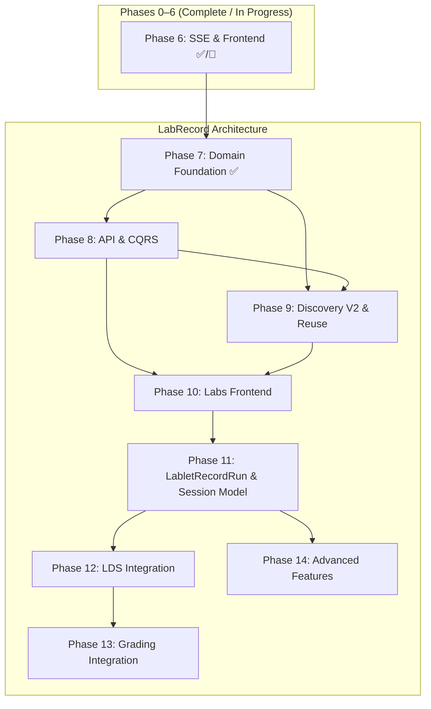

# LabRecord Architecture — Implementation Plan

| Attribute | Value |
|-----------|-------|
| **Document Version** | 1.5.0 |
| **Status** | In Progress |
| **Created** | 2026-02-10 |
| **Last Updated** | 2026-02-12 |
| **Author** | LCM Architecture Team |
| **Related** | [LabRecord Architecture Design](../architecture/lab-record-architecture.md), [MVP Implementation Plan](./mvp-implementation-plan.md), [Implementation Status](./IMPLEMENTATION_STATUS.md) |

---

## 1. Executive Summary

This document is the **implementation plan for the LabRecord Architecture** as designed in the [LabRecord Architecture Design](../architecture/lab-record-architecture.md). It continues the phase numbering from the [MVP Implementation Plan](./mvp-implementation-plan.md) (Phases 0–6) and maps the 26 architecture gaps (G1–G26) to concrete, dependency-ordered implementation phases.

### Scope

Elevate **LabRecord** from a passive CML lab sync-snapshot to a **first-class independent AggregateRoot** with:

- 16-state lifecycle (§4), M:N binding to LabletInstance via LabletLabBinding (§5)
- LabletRecordRun cross-aggregate execution mapping with LDS + grading state (§3.4)
- RuntimeBinding abstraction for CML/K8s/Pod/BareMetal runtimes (§4.1)
- Session-centric UI with LDS IFRAME and grading integration (§9)
- Lab discovery v2 with adoption flow (§7)

### Design Decisions on Feature Flags

| Flag | Scope | Rationale |
|------|-------|-----------|
| ~~`LAB_RECORD_LIFECYCLE_ENABLED`~~ | **Removed** | Cross-cutting concern — always enabled once deployed. The new LabRecordStatus enum and state machine replace the current raw-string approach unconditionally. |
| `lab_reuse_enabled` | **LabletDefinition attribute** | Whether labs matching this definition's topology can be reused (wipe+restart) instead of cold-imported. Default: `false`. Set per-definition by admin. |
| `multi_lab_enabled` | **LabletDefinition attribute** | Whether LabletInstances from this definition support M:N lab bindings (multi-site topologies). Default: `false`. Set per-definition by admin. |
| `LAB_DISCOVERY_V2_ENABLED` | **System-level setting** | Enables the new discovery-with-status-tracking pipeline (§7). Default: `false` until Phase 9 validated. Defined in `application/settings.py`. |

### Phase Overview

```
Phase 7:  LabRecord Domain Foundation     ✅  (Architecture §3, §4, §5)  — completed 2026-02-11
Phase 8:  LabRecord API & CQRS            ✅  (Architecture §8.1–8.6)  — completed 2026-02-13
Phase 9:  Lab Discovery V2 & Reuse        ✅  (Architecture §7)          — completed 2026-02-11
Phase 10: Labs Frontend                    ✅  (Architecture §9.4)          — completed 2026-02-12
Phase 11: LabletRecordRun & Session Model  ✅  (Architecture §3.4, §8.7–8.10)  — completed 2026-02-13
Phase 12: LDS Session Integration         ⬜  (Architecture §8.8, §9.5)
Phase 13: Grading Integration             ⬜  (Architecture §8.9, §9.6)
Phase 14: Advanced Features               ⬜  (Architecture §10.2 Phase F)
```

### Gap-to-Phase Mapping

| Gap | Description | Phase |
|-----|-------------|-------|
| G1 | LabRecord has no lifecycle state machine | 7 |
| G2 | No RuntimeBinding abstraction | 7 |
| G3 | No LabletLabBinding entity | 7 |
| G8 | No ExternalInterface VO | 7 |
| G13 | LabRecordStatus enum missing | 7 |
| G16 | No LabRecord read model in lcm_core | 7 |
| G17 | No LabRecord repository interface | 7 |
| G6 | No versioning/revisions | 8 |
| G7 | No run history | 8 |
| G12 | No lab clone/export API | 8 |
| G14 | No SSE events for lab lifecycle | 8 |
| G4 | No discovery-to-adoption flow | 9 |
| G5 | No lab reuse logic | 9 |
| G15 | Reconciler doesn't resolve labs | 9 |
| G9 | No Labs management page in UI | 10 |
| G10 | No lab-lablet binding UI | 10 |
| G18 | No LabletRecordRun entity | 11 |
| G22 | No port mapping resolution | 11 |
| G19 | No Sessions page in UI | 11 |
| G23 | No session-part concept in UI | 11 |
| G20 | No LDS IFRAME integration | 12 |
| G26 | No LDS postMessage bridge | 12 |
| G24 | No LabletRecordRun SSE events | 12 |
| G21 | No grading IFRAME/panel | 13 |
| G25 | No grading trigger from LDS events | 13 |
| G11 | No multi-lab support | 14 |

---

## 2. Phase Dependencies



**Critical path:** Phase 7 → 8 → 9 → 10 → 11 → 12 → 13

**Parallel opportunities:**

- Phase 9 (controller intelligence) can start once Phase 7 enums/VOs are merged, even if Phase 8 API work is in progress
- Phase 10 (frontend) requires Phase 8 API + Phase 9 discovery to be functional

---

## 3. Phase 7: LabRecord Domain Foundation

> **Status:** ✅ Complete (2026-02-11)
> **Goal:** Establish LabRecord as a first-class aggregate with typed status, value objects, state machine, and M:N binding entity.
> **Architecture Ref:** [§3 Domain Model](../architecture/lab-record-architecture.md#3-domain-model), [§4 Aggregate Design](../architecture/lab-record-architecture.md#4-labrecord-aggregate-design), [§5 Relationship Model](../architecture/lab-record-architecture.md#5-relationship-model-labrecord--labletinstance)
> **Gaps Addressed:** G1, G2, G3, G8, G13, G16, G17

### 3.1 Current State

| What Exists | Where | State |
|-------------|-------|-------|
| `LabRecord` aggregate (event-sourced, 384 lines) | `control-plane-api/domain/entities/lab_record.py` | Uses raw CML state strings (`DEFINED_ON_CORE`, `STARTED`, etc.) — no typed enum |
| `LabRecordState` with `LabRecordHistoryEntry` VO | Same file | Flat dict-based state, no topology spec, no runtime binding, no revisions |
| 5 domain events | `control-plane-api/domain/events/lab_record_events.py` | `Created`, `StatusUpdated`, `TopologyUpdated`, `Deleted`, `CleanedUp` |
| `LabRecordRepository` (ABC, 101 lines) | `control-plane-api/domain/repositories/lab_record_repository.py` | 14 methods — functional but untyped status |
| `MongoLabRecordRepository` (230 lines) | `control-plane-api/integration/repositories/mongo_lab_record_repository.py` | Motor implementation — functional |
| No `LabRecordStatus` enum | `lcm_core/domain/enums/` | Only worker/lablet/template enums exist |
| No `LabRecordReadModel` | `lcm_core/domain/entities/read_models/` | Worker, LabletInstance, LabletDefinition, WorkerTemplate read models exist — not LabRecord |
| No Value Objects | `control-plane-api/domain/value_objects/` | `cml_metrics.py`, `cml_worker_vo.py` exist but nothing lab-specific |
| `LabletInstance.state.cml_lab_id` | `control-plane-api/domain/entities/lablet_instance.py` | Bare string FK — no binding entity |

### 3.2 Tasks

| ID | Task | Service | File(s) | Gaps |
|----|------|---------|---------|------|
| P7-1 | ✅ Create `LabRecordStatus` enum + valid transitions | lcm-core | `lcm_core/domain/enums/lab_record_status.py` | G13 |
| P7-2 | ✅ Create `RuntimeEnvironmentType` enum | lcm-core | `lcm_core/domain/enums/runtime_environment_type.py` | G2 |
| P7-3 | ✅ Create `LabletRecordRunStatus`, `LdsSessionStatus`, `GradingStatus` enums | lcm-core | `lcm_core/domain/enums/lablet_record_run_status.py` | G18 (prep) |
| P7-4 | ✅ Create `BindingRole`, `BindingStatus` enums | lcm-core | `lcm_core/domain/enums/binding_enums.py` | G3 |
| P7-5 | ✅ Export new enums from `lcm_core/domain/enums/__init__.py` | lcm-core | `lcm_core/domain/enums/__init__.py` | — |
| P7-6 | ✅ Create `RuntimeBinding` value object | control-plane-api | `domain/value_objects/runtime_binding.py` | G2 |
| P7-7 | ✅ Create `ExternalInterface` value object | control-plane-api | `domain/value_objects/external_interface.py` | G8 |
| P7-8 | ✅ Create `LabTopologySpec` value object | control-plane-api | `domain/value_objects/lab_topology_spec.py` | G1 |
| P7-9 | ✅ Create `LabRevision` value object | control-plane-api | `domain/value_objects/lab_revision.py` | G1 |
| P7-10 | ✅ Create `LabRunRecord` value object | control-plane-api | `domain/value_objects/lab_run_record.py` | G1 |
| P7-11 | ✅ Refactor `LabRecord` aggregate with state machine | control-plane-api | `domain/entities/lab_record.py` | G1 |
| P7-12 | ✅ Add new LabRecord domain events (20 events, exceeds §4.4 target of 16) | control-plane-api | `domain/events/lab_record_events.py` | G1 |
| P7-13 | ✅ Create `LabletLabBinding` entity | control-plane-api | `domain/entities/lablet_lab_binding.py` | G3 |
| P7-14 | ✅ Create `LabletLabBindingRepository` (ABC) | control-plane-api | `domain/repositories/lablet_lab_binding_repository.py` | G3 |
| P7-15 | ✅ Create `MongoLabletLabBindingRepository` | control-plane-api | `integration/repositories/motor_lablet_lab_binding_repository.py` | G3 |
| P7-16 | ✅ Create `LabRecordReadModel` in lcm-core | lcm-core | `lcm_core/domain/entities/read_models/lab_record_read_model.py` | G16 |
| P7-17 | ✅ Add `lab_reuse_enabled`, `multi_lab_enabled` to `LabletDefinition` | control-plane-api | `domain/entities/lablet_definition.py` | — |
| P7-18 | ✅ Update `LabletDefinitionReadModel` with new flags | lcm-core | `lcm_core/domain/entities/read_models/lablet_definition_read_model.py` | — |
| P7-19 | ✅ Add `lab_bindings: list[str]` to `LabletInstanceState` | control-plane-api | `domain/entities/lablet_instance.py` | G3 |
| P7-20 | ✅ Add `lab_discovery_v2_enabled` to settings | control-plane-api | `application/settings.py` | — |
| P7-21 | ✅ Unit tests for LabRecord state machine (60 tests, exceeds ≥20 target) | control-plane-api | `tests/domain/test_lab_record_state_machine.py` | — |
| P7-22 | ✅ Unit tests for LabletLabBinding lifecycle (20 tests, exceeds ≥10 target) | control-plane-api | `tests/domain/test_lablet_lab_binding.py` | — |
| P7-23 | ✅ Unit tests for value objects (26 tests, exceeds ≥10 target) | control-plane-api | `tests/domain/test_lab_value_objects.py` | — |
| P7-FINAL | ✅ Update implementation documentation | docs | `IMPLEMENTATION_STATUS.md`, this file | — |

### 3.3 Specifications

#### P7-1: LabRecordStatus Enum (Architecture §4.2–4.3)

```python
class LabRecordStatus(CaseInsensitiveStrEnum):
    DISCOVERED = "discovered"
    IMPORTING = "importing"
    DEFINED = "defined"
    STARTING = "starting"
    QUEUED = "queued"
    BOOTED = "booted"
    PAUSED = "paused"
    STOPPING = "stopping"
    STOPPED = "stopped"
    WIPING = "wiping"
    WIPED = "wiped"
    DELETING = "deleting"
    DELETED = "deleted"
    ARCHIVED = "archived"
    ERROR = "error"
    ORPHANED = "orphaned"
```

**CML state mapping (migration):**

| Current raw string | New LabRecordStatus |
|--------------------|---------------------|
| `DEFINED_ON_CORE` | `DEFINED` |
| `STARTED` / `BOOTED` | `BOOTED` |
| `STOPPED` | `STOPPED` |
| `QUEUED` | `QUEUED` |

Valid transitions: see Architecture §4.3.

#### P7-11: LabRecord Aggregate Refactor

The existing `LabRecord` aggregate retains its AggregateRoot + event-sourcing pattern but gains:

- `status: LabRecordStatus` replacing raw CML state strings
- `runtime_binding: RuntimeBinding` replacing `worker_id` + `lab_id` strings
- `topology_spec: LabTopologySpec` for structured topology
- `external_interfaces: list[ExternalInterface]` derived from node tags
- `revision: int` + `revision_history: list[LabRevision]`
- `run_history: list[LabRunRecord]`
- `pending_action` / `pending_action_at` / `pending_action_error` fields
- Transition guard: `_validate_transition(from_status, to_status)` using valid transitions table

#### P7-17: LabletDefinition Attribute Additions

```python
# In LabletDefinitionState
lab_reuse_enabled: bool = False     # Allow wipe+restart instead of fresh import
multi_lab_enabled: bool = False     # Allow M:N lab bindings (multi-site topologies)
```

These flags drive controller behavior in Phase 9 (lab reuse resolution) and Phase 14 (multi-lab binding).

### 3.4 Acceptance Criteria

- [x] `LabRecordStatus` enum with 16 states exists in `lcm_core`
- [x] `RuntimeEnvironmentType` enum exists in `lcm_core`
- [x] `BindingRole` and `BindingStatus` enums exist in `lcm_core`
- [x] `LabletRecordRunStatus`, `LdsSessionStatus`, `GradingStatus` enums exist in `lcm_core` (prep for Phase 11)
- [x] All 5 value objects created: `RuntimeBinding`, `ExternalInterface`, `LabTopologySpec`, `LabRevision`, `LabRunRecord`
- [x] `LabRecord` aggregate uses typed `LabRecordStatus` with guarded transitions
- [x] 20 domain events defined (exceeds Architecture §4.4 target of 16)
- [x] `LabletLabBinding` entity with `BindingRole` and `BindingStatus`
- [x] `LabletLabBindingRepository` (ABC + Motor impl)
- [x] `LabRecordReadModel` in lcm-core with all state fields
- [x] `LabletDefinition` has `lab_reuse_enabled` and `multi_lab_enabled` attributes
- [x] `LabletInstanceState` has `lab_bindings: list[str]`
- [x] `lab_discovery_v2_enabled` setting exists (default `false`)
- [x] All existing LabRecord tests still pass (backward compat) — 731 passed, 1 pre-existing failure
- [x] New unit tests: state machine (60 cases), binding lifecycle (20 cases), VOs (26 cases)
- [x] Domain resilience hardening: R1 OCC, R2 CMLWorker transitions, R4 clear event, R5 stale timeout, R6 freshness guard (33 additional tests)

---

## 4. Phase 8: LabRecord API & CQRS

> **Status:** ✅ Complete (30/30 tasks) | **Completed:** 2026-02-13 | **Tests:** 140 new (52 command + 27 query + 61 integration)
> **Goal:** Full CQRS command/query surface and BFF controller for LabRecord lifecycle management.
> **Architecture Ref:** [§8.1–8.6 Backend API](../architecture/lab-record-architecture.md#8-backend-api-design)
> **Gaps Addressed:** G6, G7, G12, G14
> **Depends on:** Phase 7

### 4.1 Current State

| What Exists | Where | State |
|-------------|-------|-------|
| `SyncLabRecordsCommand` (194 lines) | `control-plane-api/application/commands/lab/` | Bulk sync from lablet-controller — creates/updates/deletes LabRecords from CML scan |
| `RequestLabActionCommand` (163 lines) | Same | ADR-017: sets `pending_action` on LabRecord for reconciliation |
| `ImportLabRecordCommand` (131 lines) | Same | Stores YAML as `PendingLabImport` for lablet-controller |
| `DownloadLabRecordCommand` (124 lines) | Same | BFF pattern — calls CML API directly (TODO: proxy via controller) |
| `CompletePendingLabActionCommand` (129 lines) | Same | ADR-017: sets action result after reconciliation |
| `GetWorkerLabRecordsQuery` (130 lines) | `control-plane-api/application/queries/lab/` | Reads LabRecords from DB by worker_id |
| `LabRecordsController` (234 lines) | `control-plane-api/api/controllers/lab_records_controller.py` | BFF: start/stop/wipe/delete/download/import + list |
| Internal sync endpoint | `control-plane-api/api/controllers/internal_controller.py` | `POST /internal/lab-records/sync` |

### 4.2 Tasks

| ID | Task | Service | File(s) | Gaps |
|----|------|---------|---------|------|
| P8-1 | ✅ Create `DiscoverLabRecordsCommand` (replaces sync) | control-plane-api | `application/commands/lab/discover_lab_records_command.py` | G4 |
| P8-2 | ✅ Update `StartLabRecordCommand` (sets pending_action=start) | control-plane-api | Refactor `request_lab_action_command.py` into individual commands | G1 |
| P8-3 | ✅ Create `StopLabRecordCommand` | control-plane-api | `application/commands/lab/stop_lab_record_command.py` | G1 |
| P8-4 | ✅ Create `WipeLabRecordCommand` | control-plane-api | `application/commands/lab/wipe_lab_record_command.py` | G1 |
| P8-5 | ✅ Create `DeleteLabRecordCommand` | control-plane-api | `application/commands/lab/delete_lab_record_command.py` | G1 |
| P8-6 | ✅ Create `CloneLabRecordCommand` | control-plane-api | `application/commands/lab/clone_lab_record_command.py` | G12 |
| P8-7 | ✅ Create `ArchiveLabRecordCommand` | control-plane-api | `application/commands/lab/archive_lab_record_command.py` | G12 |
| P8-8 | ✅ Create `BindLabToLabletCommand` | control-plane-api | `application/commands/lab/bind_lab_to_lablet_command.py` | G3 |
| P8-9 | ✅ Create `UnbindLabFromLabletCommand` | control-plane-api | `application/commands/lab/unbind_lab_from_lablet_command.py` | G3 |
| P8-10 | ✅ Create `UpdateLabRecordStatusCommand` (internal) | control-plane-api | `application/commands/lab/update_lab_record_status_command.py` | G1 |
| P8-11 | ✅ Create `UpdateLabTopologyCommand` (internal) | control-plane-api | `application/commands/lab/update_lab_topology_command.py` | G6 |
| P8-12 | ✅ Create `RecordLabRunCommand` (internal) | control-plane-api | `application/commands/lab/record_lab_run_command.py` | G7 |
| P8-13 | ✅ Create `CompleteLabActionCommand` (internal) | control-plane-api | Refactor existing `complete_pending_lab_action_command.py` | G1 |
| P8-14 | ✅ Create `FailLabActionCommand` (internal) | control-plane-api | `application/commands/lab/fail_lab_action_command.py` | G1 |
| P8-15 | ✅ Create `GetLabRecordsQuery` (list with filters) | control-plane-api | `application/queries/get_lab_records_query.py` | G1 |
| P8-16 | ✅ Create `GetLabRecordQuery` (single by ID) | control-plane-api | `application/queries/get_lab_record_query.py` | G1 |
| P8-17 | ✅ Create `GetLabRecordTopologyQuery` | control-plane-api | `application/queries/get_lab_record_topology_query.py` | G6 |
| P8-18 | ✅ Create `GetLabRecordRevisionsQuery` | control-plane-api | `application/queries/get_lab_record_revisions_query.py` | G6 |
| P8-19 | ✅ Create `GetLabRecordRunsQuery` | control-plane-api | `application/queries/get_lab_record_runs_query.py` | G7 |
| P8-20 | ✅ Create `GetLabRecordBindingsQuery` | control-plane-api | `application/queries/get_lab_record_bindings_query.py` | G3 |
| P8-21 | ✅ `GetWorkerLabsQuery` (already existed) | control-plane-api | `application/queries/get_worker_labs_query.py` | G1 |
| P8-22 | ✅ Create `GetLabletLabsQuery` | control-plane-api | `application/queries/get_lablet_labs_query.py` | G3 |
| P8-23 | ✅ Refactor `LabRecordsController` with new endpoints (16 BFF endpoints, replaces LabsController) | control-plane-api | `api/controllers/lab_records_controller.py` | G1, G12 |
| P8-24 | ✅ Extend `InternalController` with 9 lab discovery/status/binding endpoints | control-plane-api | `api/controllers/internal_controller.py` | G4 |
| P8-25 | ✅ Extend `ControlPlaneApiClient` with 9 lab discovery/binding methods | lcm-core | `lcm_core/integration/clients/control_plane_client.py` | G4 |
| P8-26 | ✅ Add SSE event emission for lab lifecycle events (13 handlers, 10 event types per §8.6) | control-plane-api | `application/events/domain/lab_record_events.py` | G14 |
| P8-27 | ✅ Unit tests for all new commands (≥1 test per command) | control-plane-api | `tests/application/test_lab_commands.py` | — |
| P8-28 | ✅ Unit tests for all new queries (27 tests) | control-plane-api | `tests/application/test_lab_queries.py` | — |
| P8-29 | ✅ API integration tests (61 tests: 22 BFF structure + 12 internal routes + 27 request models) | control-plane-api | `tests/integration/test_lab_records_controller.py` | — |
| P8-FINAL | ✅ Update implementation documentation | docs | `IMPLEMENTATION_STATUS.md`, this file | — |

### 4.3 Specifications

#### P8-1: DiscoverLabRecordsCommand

Replaces `SyncLabRecordsCommand` (kept for backward compat via delegation). Adds:

- Status tracking via `LabRecordStatus` (DISCOVERED for new, mapped state for existing)
- Topology change detection (SHA-256 checksum → new `LabRevision` if changed)
- Orphan detection (DB labs not in CML scan → mark ORPHANED, don't auto-delete)
- SSE events: `lab.discovered`, `lab.status.updated`, `lab.topology.updated`, `worker.labs.synced`

#### P8-23: LabRecordsController Endpoints (Architecture §8.1)

| Method | Path | Command/Query | New? |
|--------|------|---------------|------|
| GET | `/api/lab-records` | `GetLabRecordsQuery` | Refactored |
| GET | `/api/lab-records/{id}` | `GetLabRecordQuery` | New |
| GET | `/api/lab-records/{id}/topology` | `GetLabRecordTopologyQuery` | New |
| GET | `/api/lab-records/{id}/revisions` | `GetLabRecordRevisionsQuery` | New |
| GET | `/api/lab-records/{id}/runs` | `GetLabRecordRunsQuery` | New |
| GET | `/api/lab-records/{id}/bindings` | `GetLabRecordBindingsQuery` | New |
| POST | `/api/lab-records/{id}/start` | `StartLabRecordCommand` | Refactored |
| POST | `/api/lab-records/{id}/stop` | `StopLabRecordCommand` | New |
| POST | `/api/lab-records/{id}/wipe` | `WipeLabRecordCommand` | New |
| POST | `/api/lab-records/{id}/delete` | `DeleteLabRecordCommand` | New |
| POST | `/api/lab-records/{id}/clone` | `CloneLabRecordCommand` | New |
| POST | `/api/lab-records/{id}/export` | (existing download) | Refactored |
| POST | `/api/lab-records/{id}/archive` | `ArchiveLabRecordCommand` | New |
| POST | `/api/lab-records/{id}/bind` | `BindLabToLabletCommand` | New |
| POST | `/api/lab-records/{id}/unbind` | `UnbindLabFromLabletCommand` | New |
| POST | `/api/lab-records/import` | (existing import) | Kept |

### 4.4 Acceptance Criteria

- [x] 14 CQRS commands implemented (self-contained: request + handler per file)
- [x] 8 CQRS queries implemented (7 new + GetWorkerLabsQuery pre-existing)
- [x] `LabRecordsController` serves all 16 BFF endpoints per Architecture §8.1
- [x] `InternalController` serves 9 internal endpoints per Architecture §8.2 (+ 1 existing sync)
- [x] `ControlPlaneApiClient` has methods for lab discovery, status update, binding (9 new methods)
- [x] 10 SSE event types emitted for lab lifecycle (§8.6) — 13 new handlers + 3 legacy
- [ ] Existing `SyncLabRecordsCommand` still works (delegates to `DiscoverLabRecordsCommand`) — _deferred to Phase 9 (discovery integration)_
- [x] Unit tests: ≥1 per command (14+), ≥1 per query (8+)  — 52 command tests + 27 query tests passing
- [x] API integration tests: 61 structural tests (22 BFF routes + 12 internal routes + 27 request models)

---

## 5. Phase 9: Lab Discovery V2 & Reuse

> **Status:** ✅ Complete | **Completed:** 2026-02-11 | **Tasks:** 12/12 | **Tests:** 60 new (26 discovery + 34 resolution/reuse)
> **Goal:** Evolve lab discovery in lablet-controller to use typed LabRecord lifecycle, and add lab reuse logic to the reconciler.
> **Architecture Ref:** [§7 Discovery & Synchronisation](../architecture/lab-record-architecture.md#7-discovery--synchronisation)
> **Gaps Addressed:** G4, G5, G15
> **Depends on:** Phase 7 (enums, VOs), Phase 8 (CPA client methods + internal API)

### 5.1 Current State

| What Exists | Where | State |
|-------------|-------|-------|
| `LabsRefreshService` (285 lines) | `lablet-controller/application/hosted_services/labs_refresh_service.py` | Periodically fetches labs from CML, POSTs to CPA `/internal/lab-records/sync` |
| `LabletReconciler` (795 lines) | `lablet-controller/application/hosted_services/lablet_reconciler.py` | Handles LabletInstance lifecycle — always cold-imports labs, no reuse |
| `CmlLabsSpi` | `lablet-controller/integration/services/cml_labs_spi.py` | CML REST client for lab operations |

### 5.2 Tasks

| ID | Task | Service | File(s) | Gaps |
|----|------|---------|---------|------|
| P9-1 | Evolve `LabsRefreshService` → `LabDiscoveryService` | lablet-controller | `application/hosted_services/lab_discovery_service.py` | G4 |
| P9-2 | Add topology change detection (SHA-256 checksum) | lablet-controller | Same | G4 |
| P9-3 | Use `ControlPlaneApiClient.discover_lab_records()` instead of raw sync | lablet-controller | Same + `lcm_core` client | G4 |
| P9-4 | Add lab resolution phase to `LabletReconciler._handle_instantiating()` | lablet-controller | `application/hosted_services/lablet_reconciler.py` | G5, G15 |
| P9-5 | Implement `_resolve_lab_for_instance()` with reuse logic | lablet-controller | Same | G5 |
| P9-6 | Add binding management in reconciler (bind on instantiate, release on terminate) | lablet-controller | Same | G3 |
| P9-7 | Add run history recording (start→stop cycles) | lablet-controller | Same + CPA client | G7 |
| P9-8 | Guard reuse behind `LabletDefinition.lab_reuse_enabled` flag | lablet-controller | Same | G5 |
| P9-9 | Guard `LAB_DISCOVERY_V2_ENABLED` system setting (fallback to legacy sync) | lablet-controller | Same + settings | — |
| P9-10 | Unit tests for discovery service | lablet-controller | `tests/unit/test_lab_discovery_service.py` | — |
| P9-11 | Unit tests for lab resolution / reuse logic | lablet-controller | `tests/unit/test_lab_resolution.py` | — |
| P9-FINAL | Update implementation documentation | docs | `IMPLEMENTATION_STATUS.md`, this file | — |

### 5.3 Specifications

#### P9-5: Lab Resolution Strategy (Architecture §5.4)

```
1. Resource Scheduler assigns LabletInstance to Worker W
2. Lablet Controller checks: does Worker W have a LabRecord
   matching the LabletDefinition topology?
   a. YES and status=WIPED → Bind to existing LabRecord, start lab
   b. YES and status=STOPPED → Wipe first, then start
   c. NO → Import fresh from LabletDefinition.topology_yaml
3. Create LabletLabBinding(role=PRIMARY, status=ACTIVE)
4. On timeslot end: Release binding, wipe lab (don't delete → reuse)
```

**Guard:** Only executes if `definition.lab_reuse_enabled == True`. Otherwise, always cold-import.

#### P9-1: LabDiscoveryService

When `LAB_DISCOVERY_V2_ENABLED=true`:

1. **Scan** — For each running worker, fetch all labs from CML API
2. **Diff** — Compare against existing LabRecords via `ControlPlaneApiClient`
3. **Create** — New labs → `POST /internal/lab-records/discover` → status=DISCOVERED
4. **Update** — Known labs → sync status, detect topology changes via checksum
5. **Orphan** — DB labs not on CML → mark ORPHANED (don't auto-delete)
6. **Emit** — SSE events via CPA for UI real-time updates

When `LAB_DISCOVERY_V2_ENABLED=false`: delegate to legacy `SyncLabRecordsCommand`.

### 5.4 Acceptance Criteria

- [x] `LabDiscoveryService` replaces `LabsRefreshService` (old service kept behind flag)
- [x] Discovery creates LabRecords with proper `LabRecordStatus` (not raw strings)
- [x] Topology change detection produces new `LabRevision` entries
- [x] Orphan labs marked ORPHANED (not auto-deleted)
- [x] `LabletReconciler` resolves existing labs before importing (when `lab_reuse_enabled`)
- [x] Reuse path: WIPED lab → start (~20s) vs fresh import (~90s)
- [x] Bindings created/released during instance lifecycle
- [x] `LAB_DISCOVERY_V2_ENABLED` flag controls discovery path
- [x] Unit tests: ≥15 for discovery (26 actual), ≥10 for resolution/reuse (34 actual)

---

## 6. Phase 10: Labs Frontend

> **Status:** ✅ Complete | **Completed:** 2026-02-12 | **Tasks:** 8/10 (P10-9, P10-10 deferred)
> **Goal:** Dedicated Labs management page in the UI for admin operations on LabRecords.
> **Architecture Ref:** [§9.4 Labs Management Page](../architecture/lab-record-architecture.md#94-labs-management-page-labs)
> **Gaps Addressed:** G9, G10
> **Depends on:** Phase 8 (API endpoints), Phase 9 (discovery producing LabRecords)

### 6.1 Tasks

| ID | Task | Service | File(s) | Gaps |
|----|------|---------|---------|------|
| P10-1 | ✅ Create `LabRecordsPage` web component | control-plane-api (UI) | `ui/src/scripts/components/pages/LabRecordsPage.js` | G9 |
| P10-2 | ✅ Create `LabDetailModal` web component (tabs: overview, topology, revisions, bindings) | control-plane-api (UI) | `ui/src/scripts/components/pages/LabDetailModal.js` | G9 |
| P10-3 | ✅ `LabRecordsPage` uses `LcmDataTable` with 7 columns + filters (worker, status, bound/unbound, search) + 16 status badge colors/icons | control-plane-api (UI) | `LabRecordsPage.js`, `LcmStatusBadge.js` | G9 |
| P10-4 | ✅ Add `labRecords` slice to StateStore | control-plane-api (UI) | `ui/src/scripts/app/slices/labRecordsSlice.js` | G9 |
| P10-5 | ✅ Add API client functions for all 16 lab-records endpoints | control-plane-api (UI) | `ui/src/scripts/api/lab-records.js` | G9 |
| P10-6 | ✅ Add 14 SSE event types + mappings + store dispatch handlers | control-plane-api (UI) | `eventTypes.js`, `eventMap.js`, `sseAdapter.js`, `store.js`, `app/index.js` | G14 |
| P10-7 | ✅ Add "Labs" nav tab + section + routing | control-plane-api (UI) | `navbar_tabbed.jinja`, `index.jinja`, `app.js`, `pages/index.js` | G9 |
| P10-8 | ⏭️ Worker Detail Modal Labs tab enhancement (deferred — existing tab functional, LabRecordsPage provides full management) | control-plane-api (UI) | `WorkerDetailsModal.js` | G10 |
| P10-9 | ⏭️ Lablet Instance cards lab binding info (deferred to Phase 11 — requires LabletRecordRun) | control-plane-api (UI) | Existing lablet instance component | G10 |
| P10-10 | ⏭️ Vitest unit tests (deferred — web component testing infrastructure TBD) | lcm_ui or CPA UI | `tests/` | — |
| P10-FINAL | ✅ Update implementation documentation | docs | `IMPLEMENTATION_STATUS.md`, this file | — |

### 6.2 Files Created/Modified

**New files (4):**

| File | Purpose | Lines |
|------|---------|-------|
| `ui/src/scripts/components/pages/LabRecordsPage.js` | Main Labs page with summary metrics, data table, filters, SSE subscriptions | ~420 |
| `ui/src/scripts/components/pages/LabDetailModal.js` | Detail modal with Overview/Topology/Revisions/Bindings tabs + action buttons | ~520 |
| `ui/src/scripts/api/lab-records.js` | API client for all 16 `/api/lab-records/*` BFF endpoints | ~150 |
| `ui/src/scripts/app/slices/labRecordsSlice.js` | StateStore slice with full CRUD, selectors, action creators | ~200 |

**Modified files (8):**

| File | Changes |
|------|---------|
| `ui/src/scripts/app/eventTypes.js` | Added 14 `LAB_RECORD_*` event types |
| `ui/src/scripts/app/store.js` | Registered `labRecords` slice |
| `ui/src/scripts/app/sse/eventMap.js` | Added 14 SSE→EventBus mappings + 3 toast notifications |
| `ui/src/scripts/app/sse/sseAdapter.js` | Added lab record SSE→store dispatch handlers |
| `ui/src/scripts/app/index.js` | Added labRecordsSlice exports |
| `ui/src/scripts/components/core/LcmStatusBadge.js` | Added 16 LabRecordStatus colors + 13 icons |
| `ui/src/scripts/components/pages/index.js` | Added LabRecordsPage export |
| `ui/src/templates/components/navbar_tabbed.jinja` | Added "Labs" nav pill tab |
| `ui/src/templates/index.jinja` | Added `#labs-section` container |
| `ui/src/scripts/app.js` | Added LabRecordsPage import, instance, initializer, routing |

### 6.3 Acceptance Criteria

- [x] "Labs" page accessible from main navigation (pill tab between Workers and System)
- [x] Lab records listed in table with status badges, filter by worker/status/bound/search
- [x] Collapsible summary metric cards (Total, Running, Stopped, Wiped, Discovered, Errors)
- [x] Lab detail modal shows Overview, Topology, Revisions, Bindings tabs
- [x] Action buttons work: Start, Stop, Wipe, Clone, Export, Delete, Archive (context-sensitive per status)
- [x] SSE events update labs page in real-time (14 event types mapped)
- [x] 16 LabRecordStatus states have distinct badge colors and icons
- [x] `make build-ui` exits 0 (verified — Parcel build succeeds in 3.27s)

---

## 7. Phase 11: LabletRecordRun & Session Model

> **Status:** ✅ Complete (25/25 tasks) | **Started:** 2026-02-12 | **Completed:** 2026-02-13
> **Goal:** Create the LabletRecordRun cross-aggregate entity and Sessions page for session-centric UX.
> **Architecture Ref:** [§3.4 LabletRecordRun](../architecture/lab-record-architecture.md#34-labletrecordrun--cross-aggregate-runtime-execution-mapping), [§8.7–8.10 Run/LDS/Grading API](../architecture/lab-record-architecture.md#87-labletrecordrun-api-bff--apilablet-record-runs), [§9.1–9.3 Session UI](../architecture/lab-record-architecture.md#91-session-centric-navigation--information-architecture)
> **Gaps Addressed:** G18, G19, G22, G23
> **Depends on:** Phase 10 (Labs frontend functional)

### 7.1 Tasks

| ID | Task | Service | File(s) | Gaps |
|----|------|---------|---------|------|
| **Backend** | | | | |
| P11-1 | ✅ Create `LabletRecordRun` entity + state | control-plane-api | `domain/entities/lablet_record_run.py` | G18 |
| P11-2 | ✅ Create `LabletRecordRunRepository` (ABC) | control-plane-api | `domain/repositories/lablet_record_run_repository.py` | G18 |
| P11-3 | ✅ Create `MongoLabletRecordRunRepository` | control-plane-api | `integration/repositories/motor_lablet_record_run_repository.py` | G18 |
| P11-4 | ✅ Create `PortMappingResolutionService` | control-plane-api | `application/services/port_mapping_resolution_service.py` | G22 |
| P11-5 | ✅ Create `CreateLabletRecordRunCommand` | control-plane-api | `application/commands/run/create_lablet_record_run_command.py` | G18 |
| P11-6 | ✅ Create `EndLabletRecordRunCommand` | control-plane-api | `application/commands/run/end_lablet_record_run_command.py` | G18 |
| P11-7 | ✅ Create `UpdateLabletRecordRunStatusCommand` (internal) | control-plane-api | `application/commands/run/update_lablet_record_run_status_command.py` | G18 |
| P11-8 | ✅ Create `GetLabletRecordRunsQuery` | control-plane-api | `application/queries/run/get_lablet_record_runs_query.py` | G18 |
| P11-9 | ✅ Create `GetLabletRecordRunQuery` | control-plane-api | `application/queries/run/get_lablet_record_run_query.py` | G18 |
| P11-10 | ✅ Create `LabletRecordRunsController` (BFF) | control-plane-api | `api/controllers/lablet_record_runs_controller.py` | G18 |
| P11-11 | ✅ Register LabletRecordRun in DI container | control-plane-api | `main.py` | G18 |
| P11-12 | ✅ Unit tests for LabletRecordRun entity + commands + queries (102 tests: 59 domain, 25 commands, 18 queries) | control-plane-api | `tests/domain/test_lablet_record_run.py`, `tests/application/test_lablet_record_run_commands.py`, `tests/application/test_lablet_record_run_queries.py` | — |
| **Frontend** | | | | |
| P11-13 | ✅ Create `SessionsPage` web component (list with metrics, filters, SSE subscriptions) | control-plane-api (UI) | `ui/src/scripts/components/pages/SessionsPage.js` | G19 |
| P11-14 | ✅ Create `SessionDetailPage` with SessionPart panels (list/detail toggle, back navigation) | control-plane-api (UI) | `ui/src/scripts/components/sessions/SessionDetailPage.js` | G19, G23 |
| P11-15 | ✅ Create `SessionPartPanel` (expandable accordion with run cards) | control-plane-api (UI) | `ui/src/scripts/components/sessions/SessionPartPanel.js` | G23 |
| P11-16 | ✅ Create `LabletRecordRunCard` component (status, ports, LDS/grading indicators) | control-plane-api (UI) | `ui/src/scripts/components/sessions/LabletRecordRunCard.js` | G18 |
| P11-17 | ✅ Create `PortMappingTable` component (device access endpoints table) | control-plane-api (UI) | `ui/src/scripts/components/sessions/PortMappingTable.js` | G22 |
| P11-18 | ✅ Add `sessions` and `labletRecordRuns` slices to StateStore | control-plane-api (UI) | `ui/src/scripts/app/slices/sessionsSlice.js`, `labletRecordRunsSlice.js` | G19 |
| P11-19 | ✅ Add API clients for sessions and runs | control-plane-api (UI) | `ui/src/scripts/api/sessions.js`, `ui/src/scripts/api/lablet-record-runs.js` | G19, G18 |
| P11-20 | ✅ Add "Sessions" nav tab + section + routing + auth integration (8 wiring points) | control-plane-api (UI) | `navbar_tabbed.jinja`, `index.jinja`, `app.js`, `pages/index.js`, `store.js`, `app/index.js`, `auth.js` | G19 |
| P11-21 | ✅ Vitest unit tests for new session components (merged into P11-24) | CPA UI | `ui/tests/` | — |
| **Carried from Phase 10** | | | | |
| P11-22 | ✅ Worker Detail Modal Labs tab enhancement — binding info cross-reference with LabRecords + active/released binding display | control-plane-api (UI) | `ui/src/scripts/components/WorkerDetailsModal.js` (loadLabsTab, renderLabBindings) | G10 |
| P11-23 | ✅ Lablet Instance cards — lazy-load active runs with status, lab_record_id, LDS/grading indicators | control-plane-api (UI) | `ui/src/scripts/components/LabletInstanceCard.js` (loadBoundLabs) | G10 |
| P11-24 | ✅ Vitest unit tests for Phase 10+11 web components (136 tests: 2 slice suites, 3 component suites) | CPA UI | `ui/tests/slices/labletRecordRunsSlice.test.js`, `sessionsSlice.test.js`, `ui/tests/components/PortMappingTable.test.js`, `LabletRecordRunCard.test.js`, `SessionPartPanel.test.js` | — |
| P11-FINAL | ✅ Update implementation documentation | docs | `IMPLEMENTATION_STATUS.md`, this file | — |

### 7.2 Files Created/Modified

**New backend files (9):**

| File | Purpose | Lines |
|------|---------|-------|
| `domain/entities/lablet_record_run.py` | LabletRecordRun aggregate with event-sourced state, 6-state lifecycle | ~250 |
| `domain/repositories/lablet_record_run_repository.py` | Repository ABC for LabletRecordRun CRUD | ~60 |
| `integration/repositories/motor_lablet_record_run_repository.py` | MongoDB Motor implementation | ~120 |
| `application/services/port_mapping_resolution_service.py` | Resolves port allocations from CML + LabletInstance sources | ~80 |
| `application/commands/run/create_lablet_record_run_command.py` | CQRS command: create run (self-contained request + handler) | ~90 |
| `application/commands/run/end_lablet_record_run_command.py` | CQRS command: end run | ~70 |
| `application/commands/run/update_lablet_record_run_status_command.py` | CQRS command: internal status update | ~70 |
| `application/queries/run/get_lablet_record_runs_query.py` | CQRS query: list runs with filters | ~80 |
| `application/queries/run/get_lablet_record_run_query.py` | CQRS query: single run by ID | ~60 |

**New frontend files (7):**

| File | Purpose | Lines |
|------|---------|-------|
| `ui/src/scripts/components/pages/SessionsPage.js` | Main sessions list page: metric cards, filterable data table, SSE subscriptions | ~450 |
| `ui/src/scripts/components/sessions/SessionDetailPage.js` | Session detail with list/detail toggle, back navigation | ~300 |
| `ui/src/scripts/components/sessions/SessionPartPanel.js` | Expandable accordion for session parts with nested run cards | ~200 |
| `ui/src/scripts/components/sessions/LabletRecordRunCard.js` | Run card: status, ports, LDS/grading indicators, action buttons | ~250 |
| `ui/src/scripts/components/sessions/PortMappingTable.js` | Device access endpoints table | ~120 |
| `ui/src/scripts/app/slices/sessionsSlice.js` | StateStore slice for sessions (selectors, reducers, actions) | ~200 |
| `ui/src/scripts/app/slices/labletRecordRunsSlice.js` | StateStore slice for runs | ~180 |
| `ui/src/scripts/api/sessions.js` | Session-centric API composing LabletInstances + LabletRecordRuns | ~100 |
| `ui/src/scripts/api/lablet-record-runs.js` | API client for `/api/lablet-record-runs/*` CRUD | ~80 |

**Modified frontend files (10):**

| File | Changes |
|------|---------|
| `ui/src/scripts/app/eventTypes.js` | Added 7 `LABLET_RECORD_RUN_*` + `SESSIONS_*` event types |
| `ui/src/scripts/app/store.js` | Registered `sessions` and `labletRecordRuns` slices |
| `ui/src/scripts/app/sse/eventMap.js` | Added 6 SSE→EventBus mappings + 3 toast notifications |
| `ui/src/scripts/app/sse/sseAdapter.js` | Added run SSE→store dispatch handlers |
| `ui/src/scripts/app/index.js` | Added sessions + runs slice exports |
| `ui/src/scripts/components/core/LcmStatusBadge.js` | Added `paused`, `ending`, `ended`, `faulted` status colors + icons |
| `ui/src/scripts/components/pages/index.js` | Added SessionsPage export |
| `ui/src/scripts/app.js` | Import, instance, initializer, showView case, nav/sections mapping |
| `ui/src/templates/components/navbar_tabbed.jinja` | Added "Sessions" nav pill tab with `bi-easel` icon |
| `ui/src/templates/index.jinja` | Added `#sessions-section` container div |
| `ui/src/scripts/ui/auth.js` | Added `sessions-section` to `sectionsToHide` |

### 7.3 Specifications

#### P11-1: LabletRecordRun Entity (Architecture §3.4)

A cross-aggregate execution mapping linking:

- **Who** — `lablet_instance_id` (scheduled timeslot)
- **What** — `lab_record_id` (CML lab)
- **When** — `started_at` / `ended_at` runtime window
- **Where** — `allocated_ports` (resolved, frozen at run start)
- **Why** — `session_part_id` + `form_qualified_name`
- **How** — LDS session + grading session state

Status lifecycle: `PROVISIONING → ACTIVE → PAUSED → ENDING → ENDED → FAULTED`

#### P11-4: Port Mapping Resolution

Resolves port allocations from three sources:

1. `LabRecord.external_interfaces` (parsed from CML node tags)
2. CML Worker IP (EC2 instance reachable address)
3. `LabletInstance.allocated_ports` (existing port mapping)

Frozen at run creation for LDS/grading stability.

### 7.4 Acceptance Criteria

- [x] `LabletRecordRun` entity persists in MongoDB with all fields from Architecture §3.4
- [x] `PortMappingResolutionService` resolves and freezes port allocations
- [x] BFF endpoints: `GET/POST /api/lablet-record-runs`, `GET /api/lablet-record-runs/{id}`, `POST .../end`
- [x] Sessions page shows session list with status, candidate, location, timeslot
- [x] Session detail page shows SessionPart accordion with LabletInstance + LabletRecordRun cards
- [x] Port mapping table displays resolved device access endpoints
- [x] Worker Detail Modal Labs tab enhanced with binding info (carried from P10-8)
- [x] Lablet Instance cards show lab binding info (carried from P10-9)
- [x] Vitest tests for Phase 10 + Phase 11 web components (136 frontend tests, carried from P10-10)
- [x] `make build-ui` exits 0

---

## 8. Phase 12: LDS Session Integration

> **Status:** ✅ Complete
> **Goal:** LDS IFRAME integration in Session Detail page with postMessage bridge.
> **Architecture Ref:** [§8.8 LDS Session API](../architecture/lab-record-architecture.md#88-lds-session-api-bff--via-labletrecordrun), [§9.5 LDS IFRAME](../architecture/lab-record-architecture.md#95-lds-session-integration-iframe)
> **Gaps Addressed:** G20, G24, G26
> **Depends on:** Phase 11 (LabletRecordRun entity, Sessions page)
> **Completed:** 2025-07-08 — Backend: 5 LDS commands + 1 query + adapter + controller + SSE + 30 unit tests. Frontend: 2 IFRAME components + SSE wiring + API client + store updates + session page integration. Build passes.

### 8.1 Tasks

| ID | Task | Service | File(s) | Status |
|----|------|---------|---------|--------|
| **Backend** | | | | |
| P12-1 | Create `ProvisionLdsSessionCommand` (scoped to run) | control-plane-api | `application/commands/run/provision_lds_session_command.py` | ✅ |
| P12-2 | Create `StartLdsSessionCommand` | control-plane-api | `application/commands/run/start_lds_session_command.py` | ✅ |
| P12-3 | Create `PauseLdsSessionCommand` | control-plane-api | `application/commands/run/pause_lds_session_command.py` | ✅ |
| P12-4 | Create `ResumeLdsSessionCommand` | control-plane-api | `application/commands/run/resume_lds_session_command.py` | ✅ |
| P12-5 | Create `EndLdsSessionCommand` | control-plane-api | `application/commands/run/end_lds_session_command.py` | ✅ |
| P12-6 | Create `GetRunLdsStatusQuery` | control-plane-api | `application/queries/run/get_run_lds_status_query.py` | ✅ |
| P12-7 | Add LDS endpoints to `LabletRecordRunsController` | control-plane-api | `api/controllers/lablet_record_runs_controller.py` | ✅ |
| P12-8 | Create/extend LDS adapter for run-scoped operations | control-plane-api | `integration/services/lds_adapter.py` | ✅ |
| P12-9 | Add SSE events for run/LDS lifecycle (§8.11) | control-plane-api | SSE relay (direct broadcast from handlers) | ✅ |
| P12-10 | Unit tests for LDS commands | control-plane-api | `tests/application/test_lds_session_commands.py` (30 tests) | ✅ |
| **Frontend** | | | | |
| P12-11 | Create `LcmLdsSessionPanel` (IFRAME wrapper) | control-plane-api (UI) | `ui/src/scripts/components/sessions/LcmLdsSessionPanel.js` | ✅ |
| P12-12 | Implement postMessage bridge (parent ↔ LDS IFRAME) | control-plane-api (UI) | Same (integrated) | ✅ |
| P12-13 | Create `LcmCmlDashboardPanel` (admin CML IFRAME) | control-plane-api (UI) | `ui/src/scripts/components/sessions/LcmCmlDashboardPanel.js` | ✅ |
| P12-14 | Add run LDS/status SSE event subscriptions | control-plane-api (UI) | `eventTypes.js`, `eventMap.js`, `sseAdapter.js` | ✅ |
| P12-15 | Wire LDS panel into SessionPartPanel | control-plane-api (UI) | `SessionPartPanel.js`, `SessionDetailPage.js`, `LabletRecordRunCard.js` | ✅ |
| P12-16 | Vitest tests for IFRAME components | — | Deferred (IFRAME testing requires jsdom/happy-dom env) | ⏳ |
| P12-FINAL | Update implementation documentation | docs | `IMPLEMENTATION_STATUS.md`, this file | ✅ |

### 8.2 Acceptance Criteria

- [x] LDS session provisioned/started/paused/resumed/ended via LabletRecordRun API
- [x] LDS IFRAME renders in Session Detail page with login URL
- [x] postMessage bridge supports `lcm:pause`, `lcm:resume`, `lcm:end` (parent→LDS)
- [x] postMessage bridge handles `lds:status`, `lds:grade_request`, `lds:timer_update` (LDS→parent)
- [x] CML Dashboard IFRAME renders for admin/proctor view
- [x] SSE events update run/LDS status in real-time
- [x] `make build-ui` exits 0

---

## 9. Phase 13: Grading Integration

> **Status:** ⬜ Not Started
> **Goal:** Grading pipeline via LabletRecordRun with score report display.
> **Architecture Ref:** [§8.9 Grading API](../architecture/lab-record-architecture.md#89-grading-api-bff--via-labletrecordrun), [§9.6 Grading Integration](../architecture/lab-record-architecture.md#96-grading-integration)
> **Gaps Addressed:** G21, G25
> **Depends on:** Phase 12 (LDS integration — grading triggers from LDS events)
> **Note:** This phase also addresses the deferred MVP Phase 5 (FR-2.6.1, FR-2.6.2, FR-2.2.7) through the LabletRecordRun model rather than directly on LabletInstance.

### 9.1 Tasks

| ID | Task | Service | File(s) | Gaps |
|----|------|---------|---------|------|
| **Backend** | | | | |
| P13-1 | Create GradingEngine adapter | control-plane-api | `integration/services/grading_adapter.py` | G21 |
| P13-2 | Create `TriggerGradingCommand` | control-plane-api | `application/commands/run/trigger_grading_command.py` | G21 |
| P13-3 | Create `SubmitGradeCommand` | control-plane-api | `application/commands/run/submit_grade_command.py` | G21 |
| P13-4 | Create `RequestRereadCommand` | control-plane-api | `application/commands/run/request_reread_command.py` | G21 |
| P13-5 | Create `GetRunGradingReportQuery` | control-plane-api | `application/queries/run/get_run_grading_report_query.py` | G21 |
| P13-6 | Add grading endpoints to `LabletRecordRunsController` | control-plane-api | `api/controllers/lablet_record_runs_controller.py` | G21 |
| P13-7 | Handle auto-grade on LDS session end | control-plane-api | SSE handler / event listener | G25 |
| P13-8 | Handle `grading.completed` / `grading.faulted` CloudEvents | control-plane-api | CloudEvents controller | G25 |
| P13-9 | Add grading SSE events (§8.11) | control-plane-api | SSE relay | G24 |
| P13-10 | Unit tests for grading commands | control-plane-api | `tests/` | — |
| **Frontend** | | | | |
| P13-11 | Create `LcmGradingPanel` (inline summary + IFRAME mode) | control-plane-api (UI) | `ui/src/components/` | G21 |
| P13-12 | Add grading SSE event subscriptions | control-plane-api (UI) | SSE event map | G24 |
| P13-13 | Wire grading panel into SessionPartPanel | control-plane-api (UI) | `sessionsPage/` | G21 |
| P13-14 | Add Grade/Submit/Reread action buttons | control-plane-api (UI) | Same | G21 |
| P13-15 | Vitest tests for grading components | lcm_ui or CPA UI | `tests/` | — |
| P13-FINAL | Update implementation documentation | docs | `IMPLEMENTATION_STATUS.md`, this file | — |

### 9.2 Specifications

#### Grading Trigger Flow (Architecture §9.6.1)

| Trigger | Source | Mechanism |
|---------|--------|-----------|
| On-demand | User clicks "Grade" in Session Detail | `POST /api/lablet-record-runs/{runId}/grade` |
| LDS event | LDS posts `lds:grade_request` via postMessage | EventBus → API call |
| Auto-trigger | LDS session ends → auto-grade if configured | SSE event handler |

#### GradingEngine Adapter

Translates LCM's `LabletRecordRun` context into GradingEngine's Session/SessionPart/Pod model:

- `LabletRecordRun.allocated_ports` → `Pod.Devices[].Interfaces[]`
- `LabRecord.topology_spec.nodes` → `Pod.Devices[]` with label mapping
- Device labels must match between CML topology, `content.xml`, and `grade.xml`

### 9.3 Acceptance Criteria

- [ ] Grading triggered via API, LDS postMessage, or auto-trigger on LDS end
- [ ] GradingEngine adapter translates LabletRecordRun ports to Pod.Devices format
- [ ] Score report displayed inline (summary panel) and full (IFRAME)
- [ ] Grade/Submit/Reread actions available in Session Detail
- [ ] CloudEvent `grading.completed` updates LabletRecordRun grading state
- [ ] SSE events for grading lifecycle update UI in real-time
- [ ] `make build-ui` exits 0
- [ ] Addresses deferred MVP Phase 5 requirements (FR-2.6.1, FR-2.6.2, FR-2.2.7)

---

## 10. Phase 14: Advanced Features

> **Status:** ⬜ Not Started
> **Goal:** Post-MVP enhancements: multi-lab support, topology visualization, K8s runtime.
> **Architecture Ref:** [§10.2 Phase F](../architecture/lab-record-architecture.md#102-implementation-phases)
> **Gaps Addressed:** G11
> **Depends on:** Phase 13 (core LabRecord architecture complete)

### 10.1 Tasks

| ID | Task | Priority | Gaps |
|----|------|----------|------|
| P14-1 | Multi-lab lablet support (UI for binding multiple labs) | Medium | G11 |
| P14-2 | Lab clone across workers | Low | G12 |
| P14-3 | Topology diff viewer (revision comparison) | Low | G6 |
| P14-4 | Lab topology canvas visualization (vis.js or d3) | Low | G9 |
| P14-5 | Kubernetes runtime provider (`RuntimeEnvironmentType.K8S`) | Low | G2 |
| P14-6 | Lab resource quotas and capacity planning | Low | — |
| P14-7 | `RunTimeline` web component (visual timeline of session parts) | Medium | G19 |

### 10.2 Acceptance Criteria

- [ ] Multi-lab: LabletInstance can bind >1 LabRecord (guarded by `multi_lab_enabled`)
- [ ] Each item individually scoped — acceptance criteria defined when task is started

---

## 11. Migration Strategy (Architecture §11)

### 11.1 Data Migration (applies across Phases 7–9)

**Step 1 (Phase 7):** Add `status` field to existing LabRecords with CML state mapping:

| Current raw string | `LabRecordStatus` |
|--------------------|-------------------|
| `DEFINED_ON_CORE` | `DEFINED` |
| `STARTED` / `BOOTED` | `BOOTED` |
| `STOPPED` | `STOPPED` |
| `QUEUED` | `QUEUED` |

**Step 2 (Phase 8):** Migration command to create `LabletLabBinding` records for existing instances:

- For each `LabletInstance` with non-null `cml_lab_id`:
  - Find or create LabRecord matching `(worker_id, lab_id)`
  - Create `LabletLabBinding(role=PRIMARY, status=ACTIVE)`

**Step 3:** Deprecate `LabletInstance.state.cml_lab_id` (keep read-only for backward compat).

### 11.2 Backward Compatibility

- `SyncLabRecordsCommand` continues to work (delegates to `DiscoverLabRecordsCommand` when v2 enabled)
- `cml_lab_id` field kept on `LabletInstanceState` but new code reads from `LabletLabBinding`
- All existing API responses include both `cml_lab_id` and new `lab_bindings` array

---

## 12. Risk Register

| Risk | Impact | Probability | Mitigation | Phase |
|------|--------|-------------|------------|-------|
| LabRecord aggregate refactor breaks existing sync | High | Medium | Keep `SyncLabRecordsCommand` behind flag, run old+new in parallel | 7, 8 |
| Topology checksum false positives (CML ordering changes) | Medium | Medium | Normalize YAML before hashing; use canonical JSON | 9 |
| LDS IFRAME cross-origin restrictions | Medium | Low | Same-origin proxy via CPA BFF, sandbox attributes | 12 |
| GradingEngine API contract changes | Medium | Low | Version-pin API, adapter pattern isolates changes | 13 |
| Session-manager integration dependency | High | Medium | Use read models / cached data; degrade gracefully if session-manager unavailable | 11 |
| MongoDB schema migration for existing LabRecords | Medium | Low | Additive-only changes; no field removals; default values | 7 |

---

## 13. Revision History

| Version | Date | Author | Changes |
|---------|------|--------|---------|
| 1.0.0 | 2026-02-10 | LCM Architecture Team | Initial plan: Phases 7–14 covering 26 gaps from LabRecord Architecture Design |
| 1.1.0 | 2026-02-11 | LCM Architecture Team | Phase 7 ✅ completed. Added specifications and acceptance criteria details |
| 1.6.0 | 2026-02-13 | LCM Architecture Team | Phase 11 ✅ COMPLETE (25/25 tasks). P11-12: 102 backend tests (59 domain + 25 commands + 18 queries). P11-22: WorkerDetailsModal binding cross-reference (loadLabsTab + renderLabBindings). P11-23: LabletInstanceCard active runs display (loadBoundLabs). P11-24: 136 Vitest frontend tests (2 slice suites + 3 component suites). Vitest infrastructure added to CPA UI (vitest.config.js, jsdom). Production bug fixed: `not_found()` string vs class in CreateLabletRecordRunCommand. |
| 1.5.0 | 2026-02-12 | LCM Architecture Team | Phase 11 🔄 in progress (20/25 tasks). Backend complete: LabletRecordRun entity, repository, 5 CQRS commands/queries, BFF controller, DI registration, port mapping service. Frontend complete: SessionsPage, SessionDetailPage, SessionPartPanel, LabletRecordRunCard, PortMappingTable, 2 store slices, 2 API clients, full nav wiring + auth integration. Remaining: P11-12 (backend tests), P11-22/P11-23 (binding UI), P11-21/P11-24 (Vitest), P11-FINAL (docs). |
| 1.4.0 | 2026-02-11 | LCM Architecture Team | Phase 10 ✅ verified complete (8/10 tasks). Added P11-22, P11-23, P11-24 (deferred P10-8/P10-9/P10-10 carried to Phase 11). Updated Phase 11 acceptance criteria. IMPLEMENTATION_STATUS.md updated to v2.5.0 with full Phase 10 section. |
| 1.3.0 | 2026-02-11 | LCM Architecture Team | Phase 8 ✅ COMPLETE: 30/30 tasks. P8-15–P8-22 (8 queries, 27 tests), P8-23 (LabRecordsController, 16 endpoints), P8-24 (InternalController, 10 endpoints), P8-25 (ControlPlaneApiClient, 9 methods), P8-26 (SSE handlers, 13 new + 3 legacy), P8-29 (61 integration tests). Total: 140 new tests. AD-22 (LabRecordsController replaces LabsController), AD-23 (POST consistency). |
