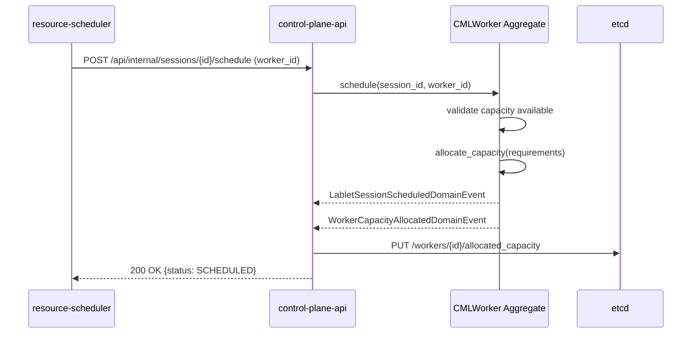
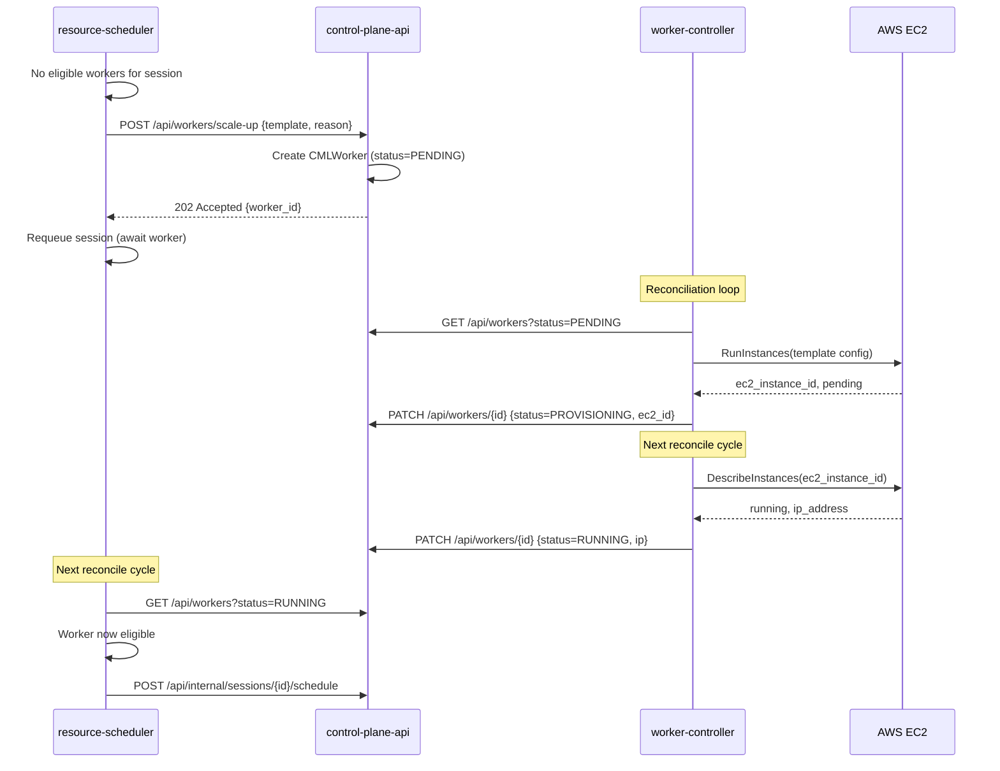
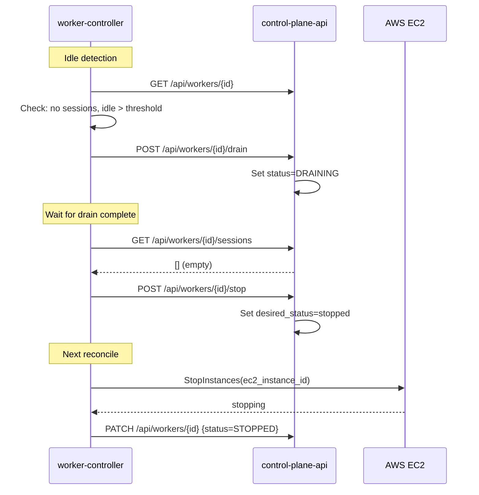
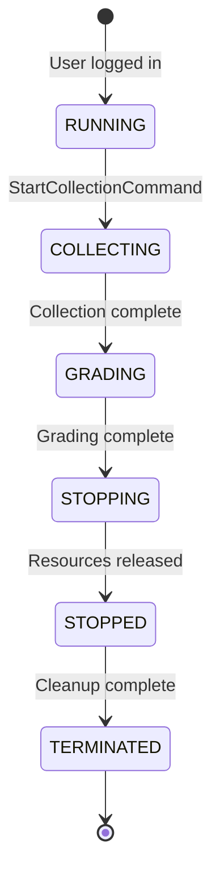

# MVP Implementation Plan

| Attribute | Value |
|-----------|-------|
| **Document Version** | 4.2.0 |
| **Status** | Authoritative |
| **Created** | 2026-02-08 |
| **Last Updated** | 2026-02-20 |
| **Author** | LCM Architecture Team |
| **Related** | [Codebase Discovery Audit](./codebase-discovery-audit.md), [Requirements Spec](../specs/lablet-resource-manager-requirements.md), [ADR-020](../architecture/adr/ADR-020-session-entity-model.md), [ADR-021](../architecture/adr/ADR-021-child-entity-architecture.md), [ADR-022](../architecture/adr/ADR-022-cloudevent-ingestion-lablet-controller.md), **[Phase 7 Execution Plan](./phase-7-session-migration.md)** |

---

## 1. Executive Summary

This document is the **single authoritative implementation plan** for Lablet Cloud Manager MVP. It is derived from the [Codebase Discovery Audit](./codebase-discovery-audit.md).

### Critical Insight: Foundation First

!!! warning "Dependency Chain"
    The MVP cannot proceed to lablet lifecycle (LDS/Grading) without a solid worker management foundation.

    **Correct dependency order:**
    ```
    Worker Capacity → Resource Scheduling → Auto-Scaling → LDS → Frontend → Session Entity Model → Grading
    ```

    You cannot schedule lablet sessions without knowing worker capacity.
    You cannot auto-scale without tracking resource usage.
    You cannot implement grading without the session entity model (ADR-020/021/022).

### Current State Analysis

| Component | State | Evidence |
|-----------|-------|----------|
| `declared_capacity` on Worker | ✅ Exists | Set from WorkerTemplate |
| `allocated_capacity` on Worker | ✅ Updated | Updated via AllocateCapacity/ReleaseCapacity commands (Phase 1) |
| PlacementEngine capacity check | ✅ Complete | Uses etcd capacity data (Phase 2 enhanced) |
| `ScheduleLabletSessionCommand` | ✅ Fixed | Validates capacity + allocates on schedule (Phase 1) |
| Worker metrics collection | ✅ Works | CloudWatch + CML stats |
| Activity detection | ✅ Works | Idle detection functional |
| Worker provisioning | ✅ Complete | EC2 provisioning via WorkerTemplateService (Phase 3) |
| Auto-scaling triggers | ✅ Complete | Scale-up (RS) + scale-down (WC) with safety guards (Phase 3) |
| LDS integration | 🔄 ~90% | LDS SPI client, session provisioning, mark-ready, session.started handling, archival |
| Grading integration | ⬜ Missing | No client, no collection flow |

### MVP Scope

| Capability | Requirements | Phase | Current State |
|------------|--------------|-------|---------------|
| Worker Capacity Tracking | FR-2.4.1, FR-2.4.3 | 1 | ✅ Complete |
| Resource-Aware Scheduling | FR-2.3.2a-e | 2 | ✅ Complete |
| Auto-Scaling (Basic) | FR-2.5.1a,c,d; FR-2.5.2a-b | 3 | ✅ Complete |
| LDS Session Provisioning | FR-2.2.5, FR-2.2.6 | 4 | ✅ Complete (staging validated) |
| SSE & Frontend Readiness | FR-2.1, FR-2.2, FR-2.4 | 6 | 🔄 ~85% (G1+G3+G4+G5+F1+F2+F3+F8 done) |
| Session Entity Model | FR-2.2.1, FR-2.2.2, ADR-020/021/022 | 7 | ✅ Complete |
| Grading Integration | FR-2.6.1, FR-2.6.2 | 5 | ⬜ Blocked by Phase 7 |

### Deferred (Post-MVP)

| Capability | Requirements | Rationale |
|------------|--------------|----------|
| Grading Integration | FR-2.6.1, FR-2.6.2 | Phase 7 complete — ready to start; requires GradingSession, ScoreReport, CloudEventIngestor |
| Warm Pool | FR-2.7.1 | Optimization, not blocking |
| Advanced Auto-Scaling | FR-2.5.1b, FR-2.5.2c-d | Basic scale-up/down sufficient |
| S3/MinIO Artifact Sync | FR-2.1.5 | Manual artifact management acceptable |

### Timeline Summary

```
Phase 0: Domain Prerequisites    ████████████████████  ✅ COMPLETE (2026-02-08)
Phase 1: Worker Foundation       ████████████████████  ✅ COMPLETE (2026-02-09)
Phase 2: Resource Scheduling     ████████████████████  ✅ COMPLETE (2026-02-10)
Phase 3: Auto-Scaling            ████████████████████  ✅ COMPLETE (2026-02-08)
Phase 4: LDS Integration         ████████████████████  ✅ COMPLETE (2026-02-10)
Phase 6: SSE & Frontend          █████████████████░░░  🔄 ~85% (G1+G3+G4+G5+F1+F2+F3+F8 done)
Phase 7: Session Entity Model    ████████████████████  ✅ COMPLETE (2026-02-20)
Phase 5: Grading Integration     ░░░░░░░░░░░░░░░░░░░░  ⬜ Blocked by Phase 7 → Ready to start
                                 ─────────────────────
                                 Execution order: 0→1→2→3→4→6→7→5
                                 Phase 7 COMPLETE — Phase 5 unblocked
```

---

## 2. Phase Dependencies

```mermaid
flowchart TD
    subgraph P0["Phase 0: Domain Prerequisites ✅"]
        P0A[Add READY state to LabletSessionStatus]
        P0B[Add form_qualified_name to LabletDefinition]
    end

    subgraph P1["Phase 1: Worker Foundation ✅"]
        P1A[Fix allocated_capacity updates]
        P1B[Add UpdateWorkerCapacityCommand]
        P1C[Verify metrics collection flow]
    end

    subgraph P2["Phase 2: Resource Scheduling ✅"]
        P2A[Complete PlacementEngine integration]
        P2B[Capacity validation in ScheduleCommand]
        P2C[Capacity allocation on schedule]
    end

    subgraph P3["Phase 3: Auto-Scaling ✅"]
        P3A[Implement worker provisioning]
        P3B[Scale-up trigger logic]
        P3C[Scale-down trigger logic]
    end

    subgraph P4["Phase 4: LDS Integration ✅"]
        P4A[LDS SPI Client]
        P4B[Session provisioning in LabletReconciler]
        P4C[MarkSessionReady + HandleSessionStarted]
    end

    subgraph P6["Phase 6: SSE & Frontend 🔄"]
        P6A[G1: Fix SSE pipeline ✅]
        P6B[F2: LDS Session Display ✅]
        P6C[F1: Reservation UI ✅]
        P6D[F3: Capacity Dashboard ✅]
        P6E[G4/G5: Test coverage ✅]
    end

    subgraph P7["Phase 7: Session Entity Model ✅"]
        P7A[LabletSession aggregate + LabletSessionStatus enum]
        P7B[UserSession / GradingSession / ScoreReport entities]
        P7C[CQRS commands + queries for child entities]
        P7D[MongoDB repos for 4 new collections]
        P7E[CloudEventIngestor in lablet-controller]
        P7F[GradingSPI adapter skeleton]
        P7G[Data migration + etcd key migration]
    end

    subgraph P5["Phase 5: Grading Integration ⬜"]
        P5A[Collection service]
        P5B[Grading SPI Client integration]
        P5C[CloudEvent handlers for grading.completed/failed]
    end

    P0 --> P1
    P1 --> P2
    P2 --> P3
    P2 --> P4
    P3 --> P4
    P4 --> P6
    P6 --> P7
    P7 --> P5
```



---

## 3. Phase 0: Domain Prerequisites

> **Status:** ✅ **COMPLETE** (2026-02-08)
> **Goal:** Prepare domain models for LDS integration (required for Phase 4).
> **Duration:** ~1 week
> **Requirements:** FR-2.2.1, FR-2.2.5h, FR-2.1.6

!!! success "Phase 0 Complete"
    All 8 tasks completed. 21 new tests added (210 total domain tests pass).
    Key artifacts: `LabletSessionStatus.READY`, `LabletSessionReadyDomainEvent`,
    `form_qualified_name` on LabletDefinition.
    **Breaking change:** `INSTANTIATING→RUNNING` is now invalid; must transition through `READY`.
    Bootstrap prompt: [PHASE_0_BOOTSTRAP.md](./PHASE_0_BOOTSTRAP.md)

!!! note "ADR-020/021 Impact"
    Phase 0 was implemented using the original LabletInstance naming. Per ADR-020, LabletInstance
    is renamed to LabletSession. Per ADR-021, `lds_session_id` and `lds_login_url` move from the
    session aggregate to the **UserSession** child entity. Phase 7 implements these migrations.

### 3.1 Tasks

| ID | Task | Service | File(s) | Estimate |
|----|------|---------|---------|----------|
| P0-1 | Add `READY` state to LabletSessionStatus | control-plane-api | `domain/enums.py` | 2h |
| P0-2 | Update LABLET_SESSION_VALID_TRANSITIONS | control-plane-api | `domain/enums.py` | 1h |
| P0-3 | Add `form_qualified_name` to LabletDefinition | control-plane-api | `domain/entities/lablet_definition.py` | 2h |
| P0-4 | Add `lds_session_id`, `lds_login_url` to LabletSession _(superseded by ADR-021: fields move to UserSession in Phase 7)_ | control-plane-api | `domain/entities/lablet_session.py` | 2h |
| P0-5 | Add LabletSessionReadyDomainEvent | control-plane-api | `domain/events/lablet_session_events.py` | 1h |
| P0-6 | Update LabletSessionReadModel | lcm-core | `domain/entities/read_models/lablet_session_read_model.py` | 1h |
| P0-7 | Update LabletDefinitionReadModel | lcm-core | `domain/entities/read_models/lablet_definition_read_model.py` | 1h |
| P0-8 | Unit tests for new state transitions | control-plane-api | `tests/domain/` | 3h |

### 3.2 Specification: READY State

**Current State Machine:**

```
PENDING → SCHEDULED → INSTANTIATING → RUNNING → ...
```

**Updated State Machine:**

```
PENDING → SCHEDULED → INSTANTIATING → READY → RUNNING → ...
```

**Transition Table Update:**

```python
# domain/enums.py - LABLET_SESSION_VALID_TRANSITIONS
LabletSessionStatus.INSTANTIATING: [
    LabletSessionStatus.READY,       # NEW: LDS provisioned, awaiting user login
    LabletSessionStatus.TERMINATED,
],
LabletSessionStatus.READY: [         # NEW STATE
    LabletSessionStatus.RUNNING,     # User logged in (CloudEvent from LDS)
    LabletSessionStatus.TERMINATED,
],
```

**READY State Semantics:**

- CML lab is running on worker
- LDS LabSession is provisioned with device access info
- UserSession entity created with `login_url` (ADR-021)
- Awaiting user login via LDS portal

### 3.3 Acceptance Criteria

- [x] `LabletSessionStatus.READY` exists in enum
- [x] Transition `INSTANTIATING → READY` is valid
- [x] Transition `READY → RUNNING` is valid
- [x] `LabletDefinition.form_qualified_name` persists correctly
- [x] LDS session fields persist correctly _(Phase 7 migrates to UserSession per ADR-021)_
- [x] Domain events emit correctly
- [x] Read models reflect new attributes
- [x] All unit tests pass (210 tests, 21 new)

---

## 4. Phase 1: Worker Foundation

> **Status:** ✅ **COMPLETE** (2026-02-09)
> **Goal:** Ensure worker capacity is accurately tracked so scheduling can make informed decisions.
> **Duration:** ~2 weeks
> **Requirements:** FR-2.4.1, FR-2.4.3
> **Bootstrap:** [PHASE_1_BOOTSTRAP.md](./PHASE_1_BOOTSTRAP.md)

!!! success "Phase 1 Complete"
    Worker capacity is now accurately tracked through the full lablet session lifecycle.
    Key artifacts: `AllocateCapacityCommand`, `ReleaseCapacityCommand`, `WorkerCapacityPublisher`.
    `ScheduleLabletSessionCommand` now validates worker status (RUNNING) and capacity before scheduling,
    then allocates capacity via mediator. `TerminateLabletSessionCommand` releases capacity on termination.
    Capacity snapshots are published to etcd at `/lcm/workers/{id}/capacity`.
    **Tests:** 26 new tests in `test_capacity_commands.py` (387 total CPA non-integration tests pass).
    Integration tests and PlacementEngine enhancement deferred to Phase 2.
    Bootstrap prompt: [PHASE_1_BOOTSTRAP.md](./PHASE_1_BOOTSTRAP.md)

### 4.1 Problem Statement

The PlacementEngine in resource-scheduler uses `declared_capacity` and `allocated_capacity` to filter eligible workers. However:

1. **`allocated_capacity` is never updated** when sessions are scheduled
2. **`ScheduleLabletSessionCommand`** has a TODO: "Check worker status and capacity"
3. **No command exists** to update worker capacity when sessions start/stop

This means PlacementEngine sees stale data and may over-allocate workers.

### 4.2 Tasks

| ID | Task | Service | File(s) | Estimate |
|----|------|---------|---------|----------|
| P1-1 | Create `AllocateCapacityCommand` | control-plane-api | `application/commands/worker/` | 4h |
| P1-2 | Create `ReleaseCapacityCommand` | control-plane-api | `application/commands/worker/` | 4h |
| P1-3 | Update `ScheduleLabletSessionCommand` to call allocate | control-plane-api | `application/commands/lablet_session/` | 3h |
| P1-4 | Update session termination to call release | control-plane-api | `application/commands/lablet_session/` | 3h |
| P1-5 | Add capacity change domain events | control-plane-api | `domain/events/cml_worker.py` | 2h |
| P1-6 | Publish capacity to etcd for scheduler | control-plane-api | `application/services/` | 4h |
| P1-7 | Verify metrics collection end-to-end | worker-controller | `application/hosted_services/worker_reconciler.py` | 4h |
| P1-8 | Integration tests for capacity flow | control-plane-api | `tests/integration/` | 8h |

### 4.3 Specification: Capacity Allocation Flow



**AllocateCapacityCommand:**

```python
@dataclass
class AllocateCapacityCommand(Command[OperationResult[dict]]):
    """Allocate capacity on a worker for a lablet session."""
    worker_id: str
    session_id: str
    cpu_cores: int
    memory_gb: int
    storage_gb: int
    node_count: int
```

**ReleaseCapacityCommand:**

```python
@dataclass
class ReleaseCapacityCommand(Command[OperationResult[dict]]):
    """Release capacity when session terminates."""
    worker_id: str
    session_id: str
```

### 4.4 Acceptance Criteria

- [x] `AllocateCapacityCommand` updates `allocated_capacity` on worker
- [x] `ReleaseCapacityCommand` decrements `allocated_capacity` on worker
- [x] `ScheduleLabletSessionCommand` validates capacity before scheduling
- [x] `ScheduleLabletSessionCommand` calls `AllocateCapacityCommand` on success
- [x] Session termination triggers `ReleaseCapacityCommand`
- [x] Worker capacity changes are published to etcd
- [x] PlacementEngine sees current capacity data _(completed in Phase 2)_
- [x] Integration tests verify full flow _(completed in Phase 2)_

---

## 5. Phase 2: Resource Scheduling

> **Status:** ✅ Complete (2026-02-10)
> **Goal:** Resource-scheduler makes accurate placement decisions based on real-time capacity.
> **Duration:** ~1.5 weeks
> **Requirements:** FR-2.3.2a-e

### 5.1 Problem Statement

The PlacementEngine logic is mostly implemented but:

1. It uses stale capacity data (fixed in Phase 1)
2. The `ScheduleLabletSessionCommand` doesn't validate capacity
3. No feedback loop exists if scheduling fails

### 5.2 Tasks

| ID | Task | Service | File(s) | Estimate |
|----|------|---------|---------|----------|
| P2-1 | Add capacity validation in PlacementEngine | resource-scheduler | `application/services/placement_engine.py` | 4h |
| P2-2 | Fetch fresh capacity from etcd (not API) | resource-scheduler | `application/hosted_services/scheduler_hosted_service.py` | 4h |
| P2-3 | Handle scheduling failures with retry | resource-scheduler | `application/hosted_services/scheduler_hosted_service.py` | 4h |
| P2-4 | Add scheduling metrics (success/fail/scale-up) | resource-scheduler | `application/services/` | 3h |
| P2-5 | Update scheduler to request scale-up on no capacity | resource-scheduler | `application/hosted_services/scheduler_hosted_service.py` | 4h |
| P2-6 | Integration tests for scheduling decisions | resource-scheduler | `tests/integration/` | 6h |

### 5.3 Specification: Enhanced PlacementEngine

**Current `_check_resource_capacity` (partial):**

```python
def _check_resource_capacity(self, worker: dict, definition: dict) -> bool:
    # Uses declared_capacity - allocated_capacity
    # Problem: allocated_capacity is stale
```

**Enhanced flow:**

```python
def schedule(self, instance: dict, definition: dict, workers: list) -> SchedulingDecision:
    # 1. Filter by status (RUNNING only)
    # 2. Filter by license affinity
    # 3. Filter by AMI requirements
    # 4. Filter by REAL-TIME capacity (from etcd or fresh API call)
    # 5. Filter by port availability
    # 6. Score by utilization (bin-packing)
    # 7. Select best or request scale-up
```

### 5.4 Acceptance Criteria

- [x] PlacementEngine uses real-time capacity data (etcd capacity preferred, API fallback)
- [x] Scheduling fails gracefully with clear error message (rejection_summary tracking)
- [x] Failed scheduling triggers requeue with backoff (base class backoff + max retry escalation at 5 failures → 300s)
- [x] Scale-up decision made when no eligible workers (granular rejection categories: status/license/capacity/ami/ports)
- [x] Scheduling metrics are emitted (OTel: decisions, latency, retries, etcd fetches, scale-ups)
- [x] Integration tests cover all decision paths (41 new tests: 17 PlacementEngine + 24 SchedulerHostedService)

---

## 6. Phase 3: Auto-Scaling

> **Status:** ✅ **COMPLETE** (2026-02-08)
> **Goal:** Automatically provision/deprovision workers based on demand.
> **Duration:** ~2 weeks
> **Requirements:** FR-2.5.1a,c,d; FR-2.5.2a-b
> **Bootstrap:** [PHASE_3_BOOTSTRAP.md](./PHASE_3_BOOTSTRAP.md) _(retrospective)_

!!! success "Phase 3 Complete"
    Full auto-scaling implemented across 3 services. **Scale-up:** resource-scheduler detects no eligible
    workers → selects cheapest viable template → `RequestScaleUpCommand` creates PENDING worker →
    worker-controller provisions EC2 via `_handle_pending()`. **Scale-down:** worker-controller evaluates
    idle workers (5 safety guards) → `DrainWorkerCommand` sets DRAINING → stops EC2 when empty.
    **Key artifacts:** `RequestScaleUpCommand` (CPA), `DrainWorkerCommand` (CPA), `_handle_pending()`
    provisioning (WC), `_evaluate_scale_down()` (WC), `_select_template_for_requirements()` (RS),
    `WorkerTemplateService` (CPA), scaling constraints (min/max workers, cooldowns).
    **Tests:** 44 new tests (14 CPA + 17 RS + 13 WC). Also fixed discovery state sync bug (AD-21).
    Bootstrap prompt: [PHASE_3_BOOTSTRAP.md](./PHASE_3_BOOTSTRAP.md)

### 6.1 Problem Statement

Currently, worker provisioning is stubbed:

```python
# worker_reconciler.py line ~290
async def _handle_pending(self, worker: CMLWorkerReadModel) -> ReconciliationResult:
    # ...
    # For now, requeue until template system is implemented
    return ReconciliationResult.requeue("Template provisioning not yet implemented")
```

No automatic scale-up or scale-down exists.

### 6.2 Tasks

| ID | Task | Service | File(s) | Estimate |
|----|------|---------|---------|----------|
| P3-1 | Implement `_handle_pending` with EC2 provisioning | worker-controller | `application/hosted_services/worker_reconciler.py` | 8h |
| P3-2 | Create `RequestScaleUpCommand` | control-plane-api | `application/commands/worker/` | 4h |
| P3-3 | Implement scale-up trigger in scheduler | resource-scheduler | `application/hosted_services/scheduler_hosted_service.py` | 6h |
| P3-4 | Create scale-down detection job | worker-controller | `application/hosted_services/` | 6h |
| P3-5 | Implement worker draining before scale-down | control-plane-api | `domain/entities/cml_worker.py` | 4h |
| P3-6 | Add scaling constraints (min/max workers) | control-plane-api | `application/settings.py` | 2h |
| P3-7 | Add scaling audit log | control-plane-api | `application/services/` | 3h |
| P3-8 | Integration tests for scale-up flow | all | `tests/integration/` | 8h |
| P3-9 | Integration tests for scale-down flow | all | `tests/integration/` | 6h |

### 6.3 Specification: Scale-Up Flow



### 6.4 Specification: Scale-Down Flow



### 6.5 Acceptance Criteria

- [x] Worker provisioning creates real EC2 instances
- [x] Worker template configuration is applied correctly
- [x] Scale-up triggered when no eligible workers for pending session
- [x] Scale-down triggered when worker has no sessions and is idle
- [x] Draining prevents new session scheduling
- [x] Scaling constraints (min/max) are respected
- [x] Scaling decisions are audit-logged (OTel metrics + structured logging)
- [x] Integration tests verify scale-up scenarios (14 tests); scale-down unit-tested (13 tests)

---

## 7. Phase 4: LDS Integration

> **Status:** ✅ **COMPLETE** (2026-02-10)
> **Goal:** Provision LDS LabSessions for lablet sessions and handle user login events.
> **Duration:** ~2 weeks
> **Requirements:** FR-2.2.5, FR-2.2.6
> **Bootstrap:** [PHASE_4_BOOTSTRAP.md](./PHASE_4_BOOTSTRAP.md)

!!! success "Phase 4 Complete"
    LDS integration implemented across lablet-controller and control-plane-api. **LDS SPI Client:**
    636-line REST client with multi-region deployment support, YAML config, data models
    (DeviceAccessInfo, SessionPartInfo, LdsSessionInfo, LdsDeploymentConfig). **Reconciler LDS Flow:**
    7-step `_provision_lds_session()` (get definition → get nodes → create session → build device list →
    set devices → get launch URL → call CPA mark-ready), `_archive_lds_session()` on TERMINATED,
    `_build_device_access_list()` static helper. **CPA Commands:** `MarkSessionReadyCommand` (atomic
    INSTANTIATING→READY with LDS info, AD-P4-01), `HandleSessionStartedCommand` (READY→RUNNING on
    session.started). **Internal API:** `PUT /api/internal/sessions/{id}/mark-ready`, `POST /api/internal/
    sessions/{id}/transition`. **CPA Client:** `mark_session_ready()`, `notify_session_started()` in
    `ControlPlaneApiClient`. **Tests:** 57 new tests (44 LDS SPI + 5 mark-ready + 8 session-started).
    **Remaining:** Staging validation with live LDS deployment.

!!! note "ADR-022 Impact"
    Phase 4 was originally implemented with CloudEvent handling in control-plane-api. Per ADR-022,
    all CloudEvents (LDS + GradingEngine) are now routed to **lablet-controller** via CloudEventIngestor.
    Phase 7 implements this migration.

### 7.1 Tasks

| ID | Task | Service | File(s) | Status | Estimate |
|----|------|---------|---------|:------:|----------|
| P4-1 | Create LDS SPI client (data models + config) | lablet-controller | `integration/services/lds_spi.py`, `config/lds_deployments.yaml` | ✅ | 4h |
| P4-2 | Implement LDS REST client (multi-region) | lablet-controller | `integration/services/lds_spi.py` | ✅ | 6h |
| P4-3 | Add `MarkSessionReadyCommand` (atomic INSTANTIATING→READY) | control-plane-api | `application/commands/lablet_session/mark_session_ready_command.py` | ✅ | 3h |
| P4-4 | Update `TransitionLabletSessionCommand` for READY | control-plane-api | `application/commands/lablet_session/transition_lablet_session_command.py` | ✅ | 2h |
| P4-5 | Update LabletReconciler: `_provision_lds_session()` | lablet-controller | `application/hosted_services/lablet_reconciler.py` | ✅ | 8h |
| P4-6 | Add internal API endpoints (mark-ready, session-started) | control-plane-api | `api/controllers/internal_controller.py` | ✅ | 4h |
| P4-7 | `HandleSessionStartedCommand` (READY→RUNNING) | control-plane-api | `application/commands/lablet_session/handle_session_started_command.py` | ✅ | 4h |
| P4-8 | Add `_archive_lds_session()` on TERMINATED | lablet-controller | `application/hosted_services/lablet_reconciler.py` | ✅ | 3h |
| P4-9 | Tests (LDS SPI + command handlers) | LC, CPA | `tests/` | ✅ | 8h |
| P4-CPA-Client | Add `mark_session_ready()`, `notify_session_started()` to CPA client | lcm-core | `integration/clients/control_plane_client.py` | ✅ | 2h |

### 7.2 Specification: LDS Client Interface

```python
# lablet-controller/integration/services/lds_spi.py

class LdsSpiClient:
    """LDS (Lab Delivery System) SPI client."""

    async def create_session_with_part(
        self,
        username: str,
        timeslot_start: datetime,
        timeslot_end: datetime,
        form_qualified_name: str,
    ) -> LdsSessionInfo:
        """Create LabSession with a LabSessionPart for the content."""
        ...

    async def set_devices(
        self,
        session_id: str,
        devices: list[DeviceAccessInfo],
    ) -> None:
        """Set device access information for the session."""
        ...

    async def get_session_info(self, session_id: str) -> LdsSessionInfo:
        """Get session details including login_url."""
        ...

    async def archive_session(self, session_id: str) -> None:
        """Archive session (called on TERMINATED)."""
        ...

@dataclass
class DeviceAccessInfo:
    name: str           # Device label from content.xml
    protocol: str       # "ssh", "telnet", "vnc", "web"
    host: str           # Worker IP address
    port: int           # Allocated port
    uri: str            # Connection URI
    username: str       # Device credentials
    password: str       # Device credentials

@dataclass
class LdsSessionInfo:
    session_id: str
    login_url: str
    status: str
```

### 7.3 Specification: CloudEvent Ingestion (ADR-022)

Per [ADR-022](../architecture/adr/ADR-022-cloudevent-ingestion-lablet-controller.md), all external CloudEvents
are routed to **lablet-controller**, not control-plane-api. The lablet-controller uses Neuroglia's
`CloudEventIngestor` with `@dispatch` handlers:

```python
# lablet-controller/application/events/cloud_event_ingestor.py

class LabletCloudEventIngestor(CloudEventIngestor):
    """Receives and dispatches CloudEvents from LDS and GradingEngine."""

    def __init__(self, service_provider, control_plane_client: ControlPlaneApiClient):
        super().__init__(service_provider)
        self._cpa = control_plane_client

    @dispatch(LdsSessionStartedEvent)
    async def on_lds_session_started(self, event: LdsSessionStartedEvent) -> None:
        """Handle LDS session.started — transition READY → RUNNING."""
        await self._cpa.update_user_session_status(event.lablet_session_id, UserSessionStatus.ACTIVE)
        await self._cpa.transition_session(event.lablet_session_id, LabletSessionStatus.RUNNING)

    @dispatch(LdsSessionEndedEvent)
    async def on_lds_session_ended(self, event: LdsSessionEndedEvent) -> None:
        """Handle LDS session.ended — transition RUNNING → COLLECTING, initiate grading."""
        await self._cpa.update_user_session_status(event.lablet_session_id, UserSessionStatus.ENDED)
        await self._cpa.transition_session(event.lablet_session_id, LabletSessionStatus.COLLECTING)
        # Initiate grading via GradingSPI (Phase 7)

    @dispatch(GradingSessionCompletedEvent)
    async def on_grading_completed(self, event: GradingSessionCompletedEvent) -> None:
        """Handle grading.session.completed — create ScoreReport, transition to STOPPING."""
        await self._cpa.create_score_report(event.lablet_session_id, event.score_data)
        await self._cpa.update_grading_session_status(event.lablet_session_id, GradingStatus.SUBMITTED)
        await self._cpa.transition_session(event.lablet_session_id, LabletSessionStatus.STOPPING)

    @dispatch(GradingSessionFailedEvent)
    async def on_grading_failed(self, event: GradingSessionFailedEvent) -> None:
        """Handle grading.session.failed — mark FAULTED."""
        await self._cpa.update_grading_session_status(
            event.lablet_session_id, GradingStatus.FAULTED, error=event.error_message
        )
```

**CloudEvent endpoint** registered at `POST /api/events` on lablet-controller.
State mutations are proxied to control-plane-api via internal REST calls (ADR-001).

### 7.4 Acceptance Criteria

- [x] LDS client creates sessions with device access info (636-line `LdsSpiClient` with multi-region support)
- [x] LabletReconciler provisions LDS session during INSTANTIATING (7-step `_provision_lds_session()` flow)
- [x] Session transitions to READY after LDS provisioning (atomic `MarkSessionReadyCommand` via AD-P4-01)
- [x] LDS session info stored on UserSession entity _(Phase 7 migration — currently on LabletSession via `mark_ready()` domain method)_
- [x] CloudEvent `session.started` triggers READY→RUNNING transition _(Phase 7 migrates handler to lablet-controller CloudEventIngestor per ADR-022)_
- [x] LDS session archived when session reaches TERMINATED (`_archive_lds_session()` with graceful error handling)
- [x] Integration tests verify flow with mock LDS (57 tests: 44 LDS SPI + 5 mark-ready + 8 session-started)
- [x] Staging validation with live LDS deployment (G3: 12/12 checks passed, bug fix: `archive_session()` json=None→json={}, Docker config added)

---

## 8. Phase 5: Grading Integration

> **Status:** ⬜ Blocked by Phase 7
> **Goal:** Collect device configurations and submit for grading via GradingEngine.
> **Duration:** ~1.5 weeks
> **Requirements:** FR-2.6.1, FR-2.6.2
> **Dependencies:** Phase 7 (Session Entity Model) must be complete first

!!! warning "Phase 7 Prerequisite"
    Phase 5 requires the following Phase 7 deliverables:
    - **GradingSession entity** (ADR-021) — stores grading state and GradingEngine IDs
    - **ScoreReport entity** (ADR-021) — stores grading results with per-section breakdowns
    - **CloudEventIngestor** (ADR-022) — routes `grading.session.completed/failed` events to handlers
    - **GradingSPI adapter** — client for GradingEngine REST API
    - **Internal API endpoints** — CRUD for GradingSession and ScoreReport entities

### 8.1 Tasks

| ID | Task | Service | File(s) | Estimate |
|----|------|---------|---------|----------|
| P5-1 | Create collection service | lablet-controller | `application/services/collection_service.py` | 8h |
| P5-2 | Add console command execution to CML SPI | lablet-controller | `integration/services/cml_labs_spi.py` | 4h |
| P5-3 | Add `StartCollectionCommand` | control-plane-api | `application/commands/lablet_session/` | 3h |
| P5-4 | Add `CollectionCompletedCommand` | control-plane-api | `application/commands/lablet_session/` | 3h |
| P5-5 | Wire GradingSPI client (skeleton from Phase 7) | lablet-controller | `integration/services/grading_spi.py` | 4h |
| P5-6 | Update LabletReconciler for COLLECTING state | lablet-controller | `application/hosted_services/lablet_reconciler.py` | 6h |
| P5-7 | Update LabletReconciler for GRADING state | lablet-controller | `application/hosted_services/lablet_reconciler.py` | 4h |
| P5-8 | Wire CloudEvent handlers for grading events (skeleton from Phase 7) | lablet-controller | `application/events/cloud_event_ingestor.py` | 3h |
| P5-9 | Integration tests for grading flow | lablet-controller | `tests/integration/` | 6h |

### 8.2 Specification: Collection Service

```python
# lablet-controller/application/services/collection_service.py

class CollectionService:
    """Collects device configurations from CML lab nodes."""

    async def collect_configs(
        self,
        worker_ip: str,
        lab_id: str,
        commands: list[str] | None = None,
    ) -> CollectionResult:
        """Collect running-config from all nodes in the lab."""
        commands = commands or ["show running-config"]

        nodes = await self._cml.get_lab_nodes(worker_ip, lab_id)

        results = []
        for node in nodes:
            node_outputs = []
            for command in commands:
                output = await self._cml.execute_console_command(
                    worker_ip, lab_id, node.id, command
                )
                node_outputs.append(CommandOutput(command=command, output=output))

            results.append(DeviceCollection(name=node.label, outputs=node_outputs))

        return CollectionResult(devices=results, collected_at=datetime.now(UTC))
```

### 8.3 Specification: State Flow



### 8.4 Acceptance Criteria

- [ ] Collection service gathers `show running-config` from all nodes
- [ ] RUNNING→COLLECTING transition works via command
- [ ] Collection results stored/forwarded to grading engine
- [ ] COLLECTING→GRADING transition after collection complete
- [ ] Grading engine submission works
- [ ] CloudEvent `grading.completed` triggers score storage
- [ ] GRADING→STOPPING transition after grading complete
- [ ] Integration tests verify full flow

---

## 9. Phase 6: SSE, Frontend & Integration Readiness

> **Status:** 🔄 In Progress
> **Goal:** Fix SSE event pipeline, fill integration gaps, and build the frontend UI to MVP readiness.
> **Duration:** ~3–4 weeks
> **Requirements:** FR-2.1 (UI), FR-2.2 (lifecycle visibility), FR-2.4 (capacity dashboard), FR-2.6 (grading display)

!!! info "Phase 6 Context"
    A gap analysis between the codebase and the MVP requirements revealed that Phases 0–4 focused on
    backend domain logic, CQRS commands, and inter-service integration. Phase 6 addresses the remaining
    SSE pipeline bugs, missing test coverage, and frontend UI gaps needed for a usable MVP. Grading
    backend (Phase 5) and grading UI (F4) are deferred to Phase 7.

    **Progress (v4.0.0):** 8 of 15 tasks complete (G1, G3, G4, G5, F1, F2, F3, F8). All Medium+ priority
    frontend and backend tasks done. G4 delivered 53 worker-controller tests, G5 delivered 59 lablet-controller
    tests. Remaining work is Low-priority polish tasks (F4-F7, F9).

### 9.1 Sub-Phase A: SSE & Backend Readiness

These tasks address broken or missing backend infrastructure required before frontend work.

| ID | Task | Priority | Status | Description |
|----|------|:--------:|:------:|-------------|
| G1 | Fix SSE broken for all aggregates | P0 | ✅ | SSE event naming mismatch (hyphens→dots), missing event mappings, legacy SSEService, no initial snapshots. **Fixed:** 21 backend handlers renamed, 6 frontend event types added, legacy SSEService deleted, global SSE connect in app.js, lablet/definition snapshots added to EventsController. |
| G2 | CloudEvents external naming mismatch | Deferred | ⬜ | External CloudEvent `type` fields still use hyphens (e.g. `lablet-session.status.changed`). Not blocking SSE (internal dot notation works). Defer until external CloudEvent consumers exist. |
| G3 | Phase 4 staging validation | P1 | ✅ | Validated LDS integration against live pyLDS backend (12/12 checks passed). **Findings:** (1) LDS returns HTTP 201 for session creation (SPI client handles correctly via `raise_for_status()`), (2) **Bug fix:** `archive_session()` sent `json=None` causing HTTP 415 — changed to `json={}`, (3) Docker networking: created `lds_deployments.docker.yaml` with `lds-backend:4000` base_url, added `LDS_VERIFY_SSL` + `LDS_DEPLOYMENTS_CONFIG_PATH` env vars to docker-compose.shared.yml. |
| G4 | Add missing Worker Controller tests | P2 | ✅ | **53 new tests** in `test_worker_reconciler_g4.py`. Covers: all 9 status handlers (PENDING through TERMINATED), EC2 provisioning flow, CML readiness checks, metrics collection, scale-down evaluation (5 safety guards), drain completion, error recovery. Target was +20, delivered +53. |
| G5 | Add missing Lablet Controller tests | P2 | ✅ | **59 new tests** in `test_lablet_reconciler_g5.py`. Covers: all 7 status handlers (SCHEDULED through PENDING_CLEANUP), LDS provisioning 7-step flow, device mapping, definition caching, session archival, reconcile router dispatch. Target was +15, delivered +59. |
| G6 | Worker metrics events disabled | Deferred | ⬜ | `WorkerMetricsUpdatedDomainEvent` SSE handlers exist but metrics collection jobs are not emitting events. Leave disabled until monitoring dashboard (F3/F9) is prioritized. |

### 9.2 Sub-Phase B: Frontend Implementation

These tasks address UI gaps identified in the control-plane-api frontend. The CPA frontend is the primary
user interface; worker-controller, lablet-controller, and resource-scheduler UIs remain empty scaffolds.

#### Existing UI Pages (CPA)

| Page | Description | State |
|------|-------------|-------|
| **OverviewPage** | Dashboard with aggregate metric cards, quick actions, recent activity | ✅ Functional |
| **WorkersPage** | Tabbed: Workers (card/table) + Templates (admin) | ✅ Functional |
| **LabletsPage** | Tabbed: Sessions (card/table) + Definitions (admin) | ✅ Functional |
| **SystemPage** | Tabbed: Monitoring (health, SSE) + Settings (admin) | ✅ Functional |

#### Frontend Gap Tasks

| ID | Task | Priority | Status | What Exists | What's Missing |
|----|------|:--------:|:------:|-------------|----------------|
| F1 | Reservation Management UI | Medium | ✅ | ReservationsPage.js: stats cards, reservation lookup by external ID, active/all/timeline tabs, status filtering, search, SSE real-time updates, auto-refresh | **Done:** Dedicated Reservations page with full reservation lifecycle view, filtering, and search. |
| F2 | LDS Session Display | **High** | ✅ | Backend domain models have LDS session info _(migrating to UserSession entity per ADR-021)_ | **Fixed:** DTO mappers now include LDS fields, SSE READY handler added with LDS data, LabletSessionCard has "Open Lab" button + session display. 9 new tests. |
| F3 | Capacity/Utilization Dashboard | Medium | ✅ | CapacityDashboard.js: fleet summary cards, resource allocation progress bars (CPU/Mem/Storage/Nodes), per-worker breakdown table with mini progress bars, color-coded utilization | **Done:** Cross-fleet capacity dashboard with aggregate metrics and per-worker breakdown. Historical trends deferred to Grafana integration. |
| F4 | Grading Results Display | Low | ⬜ | Grade API call + "Start Grading" button on LabletSessionCard, grading/graded status in badge mappings | No grading results display (score, checks, pass/fail), no GradingPanel. UI can trigger grading but cannot show outcomes. **Blocked by Phase 5/7 grading backend.** |
| F5 | Notification Center | Low | ⬜ | Toast notifications for SSE events (ephemeral) | No persistent notification center/inbox, no alert history, no configurable thresholds. Toasts sufficient for MVP. |
| F6 | User/RBAC Admin UI | Low | ⬜ | Frontend RBAC enforcement via `permissions.js`, role-based views | No user management page, no role assignment UI, no user profile dropdown. Keycloak admin console suffices for now. |
| F7 | Audit Log Viewer | Low | ⬜ | EventBus has `getEventHistory()` (client-side in-memory only) | No audit log viewer page, no server-side event history browser. Post-MVP feature. |
| F8 | Resource Scheduler UI | Medium | ✅ | SchedulerPage.js + api/scheduler.js: leader election status, scheduling stats, pending placements table, scheduling policy info, admin actions (trigger reconcile, resign leadership) | **Done:** Full scheduling dashboard with leader status, stats, pending placements, and admin controls. |
| F9 | Multi-Service Observability | Low | ⬜ | SystemPage health checks + SSE status. PrometheusClient + LcmGrafanaPanel scaffolded. | No unified observability across all 4 microservices. Prometheus/Grafana not connected. Worker-controller, lablet-controller, resource-scheduler UIs are empty scaffolds. |

### 9.3 Recommended Implementation Order

```
9.3.1  G1: Fix SSE pipeline                          ✅ DONE
9.3.2  F2: LDS Session Display                      ✅ DONE
9.3.3  G3: Phase 4 staging validation (validates F2 + LDS flow)  ✅ DONE
9.3.4  F1: Reservation Management UI                ✅ DONE
9.3.5  F3: Capacity Dashboard                       ✅ DONE
9.3.6  F8: Resource Scheduler UI                     ✅ DONE
9.3.7  G4: Worker Controller tests (+53)             ✅ DONE
9.3.8  G5: Lablet Controller tests (+59)             ✅ DONE
9.3.9  F5–F7, F9: Post-MVP polish (deferred)
9.3.10 F4: Grading Results Display (blocked by Phase 7)
```

### 9.4 Acceptance Criteria

- [x] SSE events flow end-to-end for all aggregates (workers, lablet sessions, lablet definitions, worker templates)
- [x] SSE initial snapshots sent on connect (workers, lablet sessions, lablet definitions)
- [x] LDS session URL displayed on lablet session cards with "Open Lab" button
- [x] DTO mappers include LDS session info in API responses _(migrating to UserSession per ADR-021)_
- [ ] Reservation filtering available on LabletsPage
- [ ] Fleet-level capacity overview visible on OverviewPage or dedicated dashboard
- [ ] Worker Controller test coverage ≥80%
- [ ] Lablet Controller test coverage ≥80%
- [x] UI builds successfully (`make build-ui` exits 0). StateStore `registerSlice` + reducer-aware `dispatch` added to `lcm_ui` core (AD-9). Parcel cache gotcha documented.

---

## 10. Phase 7: Session Entity Model Migration

> **Status:** ✅ Complete (2026-02-20)
> **Goal:** Implement the LabletSession entity model (ADR-020), child entities (ADR-021), CloudEvent ingestion (ADR-022), and GradingSPI skeleton.
> **Duration:** ~3–4 weeks
> **Requirements:** FR-2.2.1, FR-2.2.2, FR-2.6.1, FR-2.6.2
> **Dependencies:** Phase 6 (frontend stabilization) substantially complete
> **ADRs:** [ADR-020](../architecture/adr/ADR-020-session-entity-model.md), [ADR-021](../architecture/adr/ADR-021-child-entity-architecture.md), [ADR-022](../architecture/adr/ADR-022-cloudevent-ingestion-lablet-controller.md)
> **📋 Detailed Plan:** **[phase-7-session-migration.md](phase-7-session-migration.md)** (codebase audit + 12 sub-phases)

!!! info "Phase 7 has been extracted to a dedicated execution document"
    Due to its scope (largest phase in the MVP), Phase 7 has its own detailed plan with:

    - **Codebase audit** — actual entity/command/query/collection inventory across all services
    - **12 sub-phases** (7A–7L) with dependency graph, per-task estimates, and acceptance criteria
    - **Migration strategy** — big-bang rename, hard etcd cutover, dead code cleanup
    - **Key decisions** (AD-P7-01 through AD-P7-05) — see below

### Migration Strategy Decisions

| ID | Decision |
|----|----------|
| AD-P7-01 | CloudEvent webhook → CPA proxy (no CQRS/Mediator in lablet-controller) |
| AD-P7-02 | Big-bang rename, no backward compatibility |
| AD-P7-03 | Hard etcd cutover `/lcm/instances/` → `/lcm/sessions/`, no dual-write |
| AD-P7-04 | Remove old API endpoints, accept broken frontend during migration |
| AD-P7-05 | Clean up ~2,000+ lines of dead code (Task sample, LabletControllerService, LabsRefreshService, CloudProvider) |

### Sub-Phase Overview

| Sub-Phase | Scope | Service(s) | Estimate |
|-----------|-------|-----------|----------|
| 7A | lcm-core shared layer renames (enums, read models) | lcm-core | 1 day |
| 7B | Dead code cleanup (~2,000+ lines) | CPA, LC | 1 day |
| 7C | CPA domain layer (LabletSession + 3 child entities) | CPA | 3 days |
| 7D | CPA application layer (commands + queries rewrite) | CPA | 3 days |
| 7E | CPA integration layer (4 new MongoDB repos + etcd) | CPA | 2 days |
| 7F | CPA API layer (controllers + internal endpoints) | CPA | 2 days |
| 7G | lcm-core ControlPlaneApiClient update | lcm-core | 1 day |
| 7H | Controller service updates (reconciler + scheduler) | LC, RS | 3 days |
| 7I | CloudEvent webhook endpoint | LC | 2 days |
| 7J | Frontend updates (API paths + SSE events) | CPA UI | 1.5 days |
| 7K | Cross-service tests & verification | all | 2 days |
| 7L | Documentation updates | docs | 1 day |

### Acceptance Criteria (Summary)

- [x] Zero `LabletInstance` / `lablet_instance` / `lablet_lab_binding` / `lablet_record_run` references in Python source (docstring exceptions only)
- [x] MongoDB: `lablet_sessions`, `user_sessions`, `grading_sessions`, `score_reports` operational
- [x] MongoDB: `lablet_instances`, `lablet_lab_bindings`, `lablet_record_runs`, `tasks` dropped
- [ ] CloudEvent webhook handles 4 event types via CPA proxy — **DEFERRED** (AD-P7-06)
- [x] `make lint` + `make test` pass for all services (pre-existing failures only)
- [x] `make build-ui` passes
- [x] All services start and communicate

> Full task breakdown, entity schemas, API mappings, and verification checklist:
> **→ [phase-7-session-migration.md](phase-7-session-migration.md)**

---

## 11. Post-Implementation: Status Document Update

> **Goal:** Update IMPLEMENTATION_STATUS.md to reflect actual implementation state.
> **Duration:** ~2 days
> **Trigger:** After Phase 7 completion

!!! note "Per-Phase Updates"
    While this section describes a final comprehensive audit, each phase also requires
    incremental updates to the status document per [§12: Mandatory Documentation Maintenance](#12-mandatory-documentation-maintenance-per-phase).

### 11.1 Tasks

| ID | Task | Estimate |
|----|------|----------|
| PS-1 | Audit all requirement IDs against implementation | 4h |
| PS-2 | Update status matrix with accurate ✅/🔶/⬜ | 2h |
| PS-3 | Update progress percentages | 1h |
| PS-4 | Add test coverage summary | 2h |
| PS-5 | Review with team | 2h |

---

## 12. Mandatory: Documentation Maintenance Per Phase

!!! warning "Required for Every Phase"
    Each implementation phase **MUST** include a documentation maintenance task as its **final step**.
    This is not optional — the implementation is not complete until documentation reflects reality.

### Per-Phase Documentation Checklist

Every phase completion MUST include:

| Task | File | Action |
|------|------|--------|
| Update plan status | `docs/implementation/mvp-implementation-plan.md` | Mark phase as ✅ COMPLETE, check acceptance criteria, add completion notes |
| Update status matrix | `docs/implementation/IMPLEMENTATION_STATUS.md` | Update all affected FR rows, bump progress bars, add completion date |
| Bump document versions | Both files above | Increment version, update Last Updated date |
| Store knowledge | Knowledge Manager | `store_decision`, `store_insight`, `update_task` for all significant changes |
| Create next bootstrap | `docs/implementation/PHASE_N+1_BOOTSTRAP.md` | Prepare bootstrap prompt for next phase |
| Update mkdocs.yml | `mkdocs.yml` | Register any new documentation files in navigation |

### Bootstrap Prompt Requirement

Every `PHASE_N_BOOTSTRAP.md` document **MUST** include a final task:

```
### P{N}-FINAL: Update Implementation Documentation
- Update `docs/implementation/mvp-implementation-plan.md`:
  - Mark Phase {N} as ✅ COMPLETE with date
  - Check all acceptance criteria
  - Add completion notes (key artifacts, test count, breaking changes)
- Update `docs/implementation/IMPLEMENTATION_STATUS.md`:
  - Update all affected FR rows to reflect actual state
  - Update progress bars
  - Bump document version
- Store completion knowledge via Knowledge Manager
- Create `PHASE_{N+1}_BOOTSTRAP.md` for next phase
```

---

## 13. Risk Register

| Risk | Impact | Probability | Mitigation |
|------|--------|-------------|------------|
| LDS API unavailable | High | Low | Mock client for development |
| Grading Engine API changes | Medium | Low | Version-pin API contract |
| EC2 provisioning failures | Medium | Medium | Retry logic, fallback regions |
| etcd leader election issues | High | Low | Use proven libraries, HA setup |
| CML console collection timeouts | Medium | Medium | Configurable timeout, partial collection |
| CloudEvent delivery failures | Medium | Low | Idempotent handlers, dead letter queue |
| **Data migration corruption** | **High** | **Low** | Verification script, backup before migration, parallel-run old/new |
| **API path breaking changes** | **High** | **Medium** | Versioned API (`/api/v1/sessions/`), deprecation period for old paths |
| **Multi-collection consistency** | **Medium** | **Medium** | Transactional updates where possible, compensating actions on failure |

---

## 14. Success Metrics

### Phase Completion Criteria

| Phase | Key Metric | Target |
|-------|------------|--------|
| Phase 0 | Domain model tests pass | 100% |
| Phase 1 | Capacity tracking accurate | Verified in integration tests |
| Phase 2 | Scheduling respects capacity | No over-allocation |
| Phase 3 | Auto-scaling functional | Workers provision/deprovision |
| Phase 4 | LDS integration working | Sessions created in staging |
| Phase 6 | SSE & Frontend usable | MVP UI functional |
| Phase 7 | Session entity model migrated | ✅ All 4 collections operational, 7I (CloudEventIngestor) deferred to future phase |
| Phase 5 | Grading flow complete | Scores stored correctly |

### MVP Readiness Checklist

- [ ] All phases complete
- [ ] Integration tests pass
- [ ] Staging environment validated
- [ ] IMPLEMENTATION_STATUS.md updated
- [ ] Runbooks created for operations
- [ ] Monitoring dashboards configured
- [ ] Documentation current

---

## 15. Revision History

| Version | Date | Author | Changes |
|---------|------|--------|---------|
| 4.2.0 | 2026-02-20 | LCM Architecture Team | **Phase 7 COMPLETE.** Updated §10 status to ✅ Complete, acceptance criteria checked (6/7 — CloudEvent webhook deferred per AD-P7-06). Timeline progress bar updated to 100%. Phase Dependencies diagram updated (Phase 7 ✅). MVP Scope table updated. Deferred table: Grading Integration unblocked. Success Metrics: Phase 7 row updated. |
| 4.1.0 | 2026-02-18 | LCM Architecture Team | **Phase 7 extraction:** Extracted detailed Phase 7 plan into dedicated [phase-7-session-migration.md](phase-7-session-migration.md) with codebase audit (entity/command/query/collection inventory across all services), 12 sub-phases (7A–7L) refined from audit findings, and 5 migration strategy decisions (AD-P7-01 through AD-P7-05). Master plan §10 now contains compact summary + link. Scope expanded from 9 to 12 sub-phases based on audit (added dead code cleanup, separate lcm-core client update, and split test/verification sub-phase). |
| 4.0.0 | 2026-02-18 | LCM Architecture Team | **Major update:** Aligned entire plan with ADR-020 (LabletInstance → LabletSession), ADR-021 (UserSession/GradingSession/ScoreReport child entities), ADR-022 (CloudEvent ingestion via lablet-controller). Added Phase 7: Session Entity Model Migration (§10) with 9 sub-phases covering domain, application, integration, API, CloudEventIngestor, GradingSPI skeleton, data migration, frontend, and tests. Resequenced Phase 5 (Grading Integration) to depend on Phase 7. Updated Phase Dependencies diagram. Fixed Phase 4 CloudEvent handler spec (§7.3) from control-plane-api to lablet-controller. Updated all phases (0–6) with LabletSession terminology. Added 3 new risks for migration. Updated Success Metrics with Phase 7. |
| 3.0.0 | 2026-02-10 | LCM Architecture Team | Phase 6 at ~85%: G4 (53 worker-controller tests) and G5 (59 lablet-controller tests) complete. Phase 4 marked ✅ COMPLETE (staging validated via G3). Worker controller service type errors fixed (aligned SPI method calls). 8/15 Phase 6 tasks done. Remaining: low-priority polish (F4-F7, F9). |
| 2.9.0 | 2026-02-10 | LCM Architecture Team | G3 Phase 4 staging validation complete: 12/12 live LDS checks passed. Bug fix: `archive_session()` json=None→json={} (HTTP 415). Docker config: created `lds_deployments.docker.yaml` (lds-backend:4000), added LDS env vars to docker-compose.shared.yml, added lds-backend dependency. Validation script: `scripts/validate_lds_integration.py`. Test assertion strengthened for json={} contract. |
| 2.8.0 | 2026-02-09 | LCM Architecture Team | Phase 6 progress: F1 (ReservationsPage ~570 lines), F3 (CapacityDashboard ~320 lines), F8 (SchedulerPage ~430 lines + api/scheduler.js) completed. Navbar converted to dropdowns for Lablets/Workers tabs (AD-16). Section containers added to index.jinja. Phase 6 at ~50% (G1+F1+F2+F3+F8 done). Remaining: G3 staging validation, G4/G5 controller tests, low-priority polish (F4-F7, F9). |
| 2.7.0 | 2026-02-09 | LCM Architecture Team | Phase 6 progress: F2 (LDS Session Display) completed — DTO mappers, SSE READY handler, LabletSessionCard "Open Lab" button, 9 new tests. StateStore `registerSlice` + reducer-aware `dispatch` added to `lcm_ui` core (AD-9) — frontend was blocked by missing slice registration API. Parcel cache gotcha documented; CPA `make clean` now clears `ui/.parcel-cache`. Phase 6 at ~20% (G1+F2 done). |
| 2.6.0 | 2026-02-08 | LCM Architecture Team | Added Phase 6: SSE & Frontend Readiness (§9). Gap analysis identified 6 backend gaps (G1–G6) and 9 frontend gaps (F1–F9). G1 (SSE pipeline fix) completed: 21 backend handler renames, 6 frontend event types, legacy SSEService deleted, global SSE connect, initial snapshots. Phase 5 (Grading) deferred to Phase 7 (post-frontend). Renumbered §9–§14→§10–§15. Updated timeline. |
| 2.5.0 | 2026-02-09 | LCM Architecture Team | Phase 4 LDS Integration ~90% complete: LDS SPI client (636 lines, multi-region, YAML config), MarkInstanceReadyCommand (atomic INSTANTIATING→READY, AD-P4-01), HandleSessionStartedCommand (READY→RUNNING), _provision_lds_session() 7-step reconciler flow,_archive_lds_session(), internal API endpoints (mark-ready, session-started), CPA client methods, 57 new tests (44 LDS SPI + 5 mark-ready + 8 session-started). CommandHandlerBase pattern adopted for all new handlers. Remaining: staging validation. |
| 2.4.0 | 2026-02-08 | LCM Architecture Team | Phase 3 marked complete: Scale-up (RequestScaleUpCommand, template selection, EC2 provisioning), Scale-down (5 safety guards, DrainWorkerCommand, idle detection), WorkerTemplateService, scaling constraints, OTel audit metrics, 44 new tests across 3 services. Discovery state sync bug fixed (AD-21). |
| 2.3.0 | 2026-02-10 | LCM Architecture Team | Phase 2 marked complete: etcd real-time capacity in PlacementEngine, retry escalation, OTel scheduling metrics, rejection tracking, 41 new tests. All acceptance criteria met. |
| 2.2.0 | 2026-02-09 | LCM Architecture Team | Phase 1 marked complete: capacity commands, schedule/terminate integration, etcd publishing. PlacementEngine enhancement and integration tests deferred to Phase 2. |
| 2.1.0 | 2026-02-08 | LCM Architecture Team | Phase 0 marked complete, added mandatory doc maintenance section (§10), added status lines per phase, bumped section numbering |
| 2.0.0 | 2026-02-08 | LCM Architecture Team | Complete rewrite with foundation-first approach |
| 1.0.0 | 2026-02-08 | LCM Architecture Team | Initial plan (flawed - assumed worker foundation complete) |
