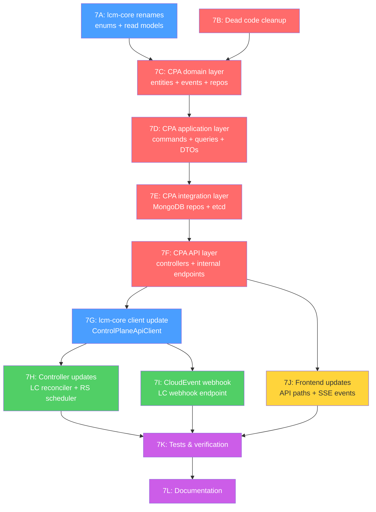

# Phase 7: Session Entity Model Migration

> **Version:** 1.4.0
> **Date:** 2026-02-20
> **Status:** ✅ Complete (7A–7K implemented, 7I deferred per AD-P7-06, 7L documentation done)
> **Author:** LCM Architecture Team
> **Master Plan:** [mvp-implementation-plan.md](mvp-implementation-plan.md) §10
> **ADRs:** [ADR-020](../architecture/adr/ADR-020-session-entity-model.md) · [ADR-021](../architecture/adr/ADR-021-child-entity-architecture.md) · [ADR-022](../architecture/adr/ADR-022-cloudevent-ingestion-lablet-controller.md)

---

## 1. Executive Summary

Phase 7 implements the largest structural change in the LCM codebase: migrating from the LabletInstance/LabletRecordRun/LabletLabBinding entity model to a consolidated LabletSession aggregate with three child entities (UserSession, GradingSession, ScoreReport).

### Scope

| Dimension | Metric |
|-----------|--------|
| **Entities to refactor** | 3 (LabletInstance, LabletRecordRun, LabletLabBinding) |
| **New entities to create** | 4 (LabletSession, UserSession, GradingSession, ScoreReport) |
| **MongoDB collections affected** | 3 renamed/dropped + 4 new = 7 total |
| **Existing commands to rewrite** | 17 (9 lablet_instance + 8 run) |
| **Existing queries to rewrite** | 6 (3 lablet_instance + 3 run) |
| **Services with code changes** | 4 (control-plane-api, lablet-controller, resource-scheduler, lcm-core) |
| **Files containing `LabletInstance`** | 95 files, ~1,650 occurrences |
| **Files containing `lablet_instance`** | 89 files, ~612 occurrences |
| **Test files to update** | ~30 files, ~10,000+ lines |
| **Estimated duration** | 3–4 weeks |

### Migration Strategy

**Big-bang rename** — no backward compatibility, no aliases, no deprecation. All services updated simultaneously. Frontend will break during implementation and be fixed in the frontend sub-phase.

### Key Decisions (AD-P7-01 through AD-P7-05)

| ID | Decision | Rationale |
|----|----------|-----------|
| AD-P7-01 | CloudEvent webhook → CPA proxy (no CQRS in LC) | LC is a stateless reconciler; adding Mediator/@dispatch is architecturally inconsistent |
| AD-P7-02 | Big-bang rename, no backward compatibility | 100% local dev mode, no external consumers, no production data |
| AD-P7-03 | Hard etcd cutover, no dual-write | Current watch mechanism doesn't work reliably; will be rebuilt with new keys |
| AD-P7-04 | Remove old API endpoints, accept broken frontend | Clean codebase over backward compat; frontend fixed in sub-phase 7H |
| AD-P7-05 | Clean up all dead code during Phase 7 | Dead code creates confusion during rename and adds noise |
| AD-P7-06 | **Defer Phase 7I (CloudEvent webhook) — not a prerequisite for 7J** | CloudEvents provide automation, not capability. CPA already exposes all mutation endpoints via InternalSessionsController. Frontend will include manual session action buttons instead. 7I conceptually belongs in a future LDS/GradingEngine integration phase. See §3.9 for details. |

---

## 2. Codebase Audit

### 2.1 Architecture Overview

```
┌─────────────────────┐
│   control-plane-api  │  ← Single source of truth (9 MongoDB collections, 70 commands, 25 queries)
│   (port 8020)        │
└──────┬──────┬───┬────┘
       │      │   │
  HTTP │ HTTP │   │ HTTP
       │      │   │
┌──────▼────┐ ┌─▼───▼─────┐ ┌──────────────┐
│ resource  │ │ lablet    │ │ worker       │
│-scheduler │ │-controller│ │-controller   │
│(port 8081)│ │(port 8082)│ │(port 8083)   │
└───────────┘ └───────────┘ └──────────────┘
  Stateless    Stateless     Stateless
  reconciler   reconciler    reconciler
     │              │              │
     └──── etcd ────┘──────────────┘
           (coordination)
```

**Key architectural constraint:** Only control-plane-api owns domain aggregates and MongoDB. All controllers are stateless reconcilers using `ControlPlaneApiClient` from lcm-core.

### 2.2 Entities to Refactor

#### LabletInstance (control-plane-api) — 727 lines

| Aspect | Details |
|--------|---------|
| **Pattern** | `AggregateRoot[LabletInstanceState, str]` with `@dispatch` event sourcing |
| **State fields** | 20+ fields: definition_id, worker_id, allocated_ports, cml_lab_id, status, status_history, owner, reservation_id, grade_result, lds_session_id, lab_bindings[] |
| **Domain events** | 14: Created, Scheduled, PortsAllocated, Transitioned, Ready, SessionStarted, CollectionStarted, GradingStarted, ScoreRecorded, Terminated, ArchiveCompleted + 3 more |
| **Factory method** | `create(definition_id, definition_version, owner, ...)` |
| **FK references** | → LabletDefinition, → CMLWorker, → LabletLabBinding[] |
| **ADR-020 fate** | **Renamed** to LabletSession, absorb LabletLabBinding + LabletRecordRun fields |

#### LabletRecordRun (control-plane-api) — 344 lines

| Aspect | Details |
|--------|---------|
| **Pattern** | `Entity` (dataclass) with inline state machine, **no** event sourcing |
| **State fields** | 21+ fields: lablet_instance_id, lab_record_id, lab_binding_id, session_part_id, lds_content_ref, started_at/ended_at, allocated_ports, lds_session_id, lds_launch_url, grading_session_id, grading_pod_id, score, max_score, etc. |
| **State machine** | PENDING → ACTIVE → COLLECTING → GRADING → REVIEWING → SUBMITTED (+ FAULTED from any) |
| **Methods** | start(), end(), LDS methods (provision_lds_session, update_lds_status), Grading methods (start_grading, complete_grading, fail_grading, record_score) |
| **FK references** | → LabletInstance, → LabRecord, → LabletLabBinding, → external SessionPart |
| **ADR-020 fate** | **Eliminated** — runtime fields absorbed into LabletSession, LDS/grading fields move to child entities |

#### LabletLabBinding (control-plane-api) — 96 lines

| Aspect | Details |
|--------|---------|
| **Pattern** | `Entity` (dataclass) with lifecycle methods |
| **State fields** | 8 fields: lablet_instance_id, lab_record_id, role (PRIMARY/SECONDARY/AUXILIARY), status (ACTIVE/RELEASED/FAILED), created_at, released_at, release_reason |
| **Methods** | create(), release(), fail() |
| **FK references** | → LabletInstance, → LabRecord |
| **ADR-020 fate** | **Eliminated** — lab_record_id becomes direct 1:1 field on LabletSession |

### 2.3 Existing CQRS to Rewrite/Delete

#### Commands (17 files to transform)

**`commands/lablet_instance/` → `commands/lablet_session/`** (9 commands):

| Current Command | Action | New Name |
|----------------|--------|----------|
| `CreateLabletInstanceCommand` | **Rename + extend** | `CreateLabletSessionCommand` |
| `ScheduleLabletInstanceCommand` | **Rename + extend** (set lab_record_id, allocated_ports) | `ScheduleLabletSessionCommand` |
| `AllocateInstancePortsCommand` | **Merge** into ScheduleLabletSession | (absorbed) |
| `TransitionLabletInstanceCommand` | **Rename** | `TransitionLabletSessionCommand` |
| `MarkInstanceReadyCommand` | **Rename + extend** (create UserSession) | `MarkSessionReadyCommand` |
| `HandleSessionStartedCommand` | **Rename** | `HandleLdsSessionStartedCommand` |
| `StartCollectionCommand` | **Rename** | `StartSessionCollectionCommand` |
| `StartGradingCommand` | **Rename + extend** (create GradingSession) | `StartSessionGradingCommand` |
| `TerminateLabletInstanceCommand` | **Rename** | `TerminateLabletSessionCommand` |

**`commands/run/` → DELETE** (8 commands):

| Current Command | Action | Replacement |
|----------------|--------|-------------|
| `CreateLabletRecordRunCommand` | **Delete** | Absorbed into session creation flow |
| `EndLabletRecordRunCommand` | **Delete** | Absorbed into session stop flow |
| `UpdateLabletRecordRunStatusCommand` | **Delete** | Use TransitionLabletSessionCommand |
| `ProvisionLdsSessionCommand` | **Rename → move** | `CreateUserSessionCommand` (new) |
| `StartLdsSessionCommand` | **Delete** | Absorbed into MarkSessionReady |
| `PauseLdsSessionCommand` | **Delete** | Direct UserSession status update |
| `ResumeLdsSessionCommand` | **Delete** | Direct UserSession status update |
| `EndLdsSessionCommand` | **Delete** | Absorbed into session stop flow |

**New commands to create:**

| New Command | Purpose |
|-------------|---------|
| `CreateUserSessionCommand` | Create UserSession child entity (ADR-021) |
| `UpdateUserSessionStatusCommand` | LDS session state changes |
| `CreateGradingSessionCommand` | Create GradingSession child entity (ADR-021) |
| `UpdateGradingSessionStatusCommand` | Grading state changes |
| `CreateScoreReportCommand` | Store score report from GradingEngine (ADR-021) |

#### Queries (6 files to transform)

| Current Query | Action | New Name |
|--------------|--------|----------|
| `GetLabletInstanceQuery` | **Rename** | `GetLabletSessionQuery` |
| `ListLabletInstancesQuery` | **Rename** | `ListLabletSessionsQuery` |
| `GetLabletLabsQuery` | **Simplify** | (lab_record_id now direct on session) |
| `GetLabletRecordRunQuery` | **Delete** | Not needed (data on session + child entities) |
| `GetLabletRecordRunsQuery` | **Delete** | Not needed |
| `GetRunLdsStatusQuery` | **Replace** | `GetUserSessionQuery` |

**New queries to create:**

| New Query | Purpose |
|-----------|---------|
| `GetUserSessionQuery` | Fetch UserSession by ID or by session_id |
| `GetGradingSessionQuery` | Fetch GradingSession by ID or by session_id |
| `GetScoreReportQuery` | Fetch ScoreReport by ID or by session_id |
| `ListScoreReportsQuery` | Reporting: list score reports with filters |

### 2.4 MongoDB Collections — Current vs Target

#### Current (9 registered in CPA `main.py`)

| Collection | Repository | Entity | Lines |
|------------|-----------|--------|-------|
| `cml_workers` | `MongoCMLWorkerRepository` | CMLWorker | 2,211 |
| `lab_records` | `MongoLabRecordRepository` | LabRecord | 985 |
| **`lablet_instances`** | **`MongoLabletInstanceRepository`** | **LabletInstance** | **727** |
| `lablet_definitions` | `MongoLabletDefinitionRepository` | LabletDefinition | 529 |
| **`lablet_record_runs`** | **`MongoLabletRecordRunRepository`** | **LabletRecordRun** | **344** |
| `worker_templates` | `MongoWorkerTemplateRepository` | WorkerTemplate | 264 |
| **`lablet_lab_bindings`** | **`MongoLabletLabBindingRepository`** | **LabletLabBinding** | **96** |
| `system_settings` | `MongoSystemSettingsRepository` | SystemSettings | 123 |
| `tasks` | `MongoTaskRepository` | Task | 252 |

#### Target (10 collections)

| Collection | Status | Notes |
|------------|--------|-------|
| `cml_workers` | Unchanged | — |
| `lab_records` | Unchanged | — |
| **`lablet_sessions`** | **NEW** (replaces lablet_instances) | Merged: LabletInstance + LabletLabBinding fields + LabletRecordRun runtime fields |
| `lablet_definitions` | Unchanged | — |
| **`user_sessions`** | **NEW** | ADR-021: LDS session data (lds_session_id, login_url, devices) |
| **`grading_sessions`** | **NEW** | ADR-021: Grading session data (grading_session_id, pod_id) |
| **`score_reports`** | **NEW** | ADR-021: Score data (score, max_score, sections[]) |
| `worker_templates` | Unchanged | — |
| `system_settings` | Unchanged | — |
| `tasks` | **DELETE** (dead code) | Sample entity, never used in production logic |
| ~~`lablet_instances`~~ | **DROP** | Replaced by lablet_sessions |
| ~~`lablet_lab_bindings`~~ | **DROP** | Absorbed into lablet_sessions |
| ~~`lablet_record_runs`~~ | **DROP** | Split into lablet_sessions + child entities |

### 2.5 etcd Key Structure — Current vs Target

| Current Pattern | Target Pattern | Watchers |
|----------------|----------------|----------|
| `/lcm/instances/{id}/status` | `/lcm/sessions/{id}/status` | resource-scheduler, lablet-controller |
| `/lcm/instances/{id}/ports` | `/lcm/sessions/{id}/ports` | (currently unused by watchers) |
| `/lcm/workers/{id}/actual` | (unchanged) | worker-controller |
| `/lcm/workers/{id}/desired` | (unchanged) | worker-controller |

### 2.6 API Routes — Current vs Target

#### CPA Internal Endpoints (consumed by controllers)

| Current Route | Target Route | Consumers |
|--------------|-------------|-----------|
| `GET /api/internal/lablet-instances` | `GET /api/internal/sessions` | resource-scheduler, lablet-controller |
| `GET /api/internal/lablet-instances/{id}` | `GET /api/internal/sessions/{id}` | lablet-controller |
| `POST /api/internal/lablet-instances/{id}/schedule` | `POST /api/internal/sessions/{id}/schedule` | resource-scheduler |
| `PUT /api/internal/lablet-instances/{id}/transition` | `PUT /api/internal/sessions/{id}/transition` | lablet-controller |
| `PUT /api/internal/lablet-instances/{id}/ready` | `PUT /api/internal/sessions/{id}/ready` | lablet-controller |
| `PUT /api/internal/lablet-instances/{id}/ports` | (absorbed into schedule) | — |
| (new) | `POST /api/internal/sessions/{id}/user-session` | lablet-controller |
| (new) | `POST /api/internal/sessions/{id}/grading-session` | lablet-controller |
| (new) | `POST /api/internal/sessions/{id}/score-report` | lablet-controller |

#### CPA Public Endpoints

| Current Route | Target Route |
|--------------|-------------|
| `GET /api/lablet-instances` | **DELETE** → `GET /api/v1/sessions` |
| `GET /api/lablet-instances/{id}` | **DELETE** → `GET /api/v1/sessions/{id}` |
| `POST /api/lablet-instances` | **DELETE** → `POST /api/v1/sessions` |
| (new) | `GET /api/v1/sessions/{id}/user-session` |
| (new) | `GET /api/v1/sessions/{id}/grading-session` |
| (new) | `GET /api/v1/sessions/{id}/score-report` |
| (new) | `GET /api/v1/score-reports` (reporting) |

### 2.7 ControlPlaneApiClient (lcm-core) — Methods to Rename

File: `lcm_core/integration/clients/control_plane_client.py` — **1,343 lines**

| Current Method | New Method |
|---------------|-----------|
| `get_lablet_instances()` | `get_lablet_sessions()` |
| `get_lablet_instance(id)` | `get_lablet_session(id)` |
| `get_reconcilable_lablet_instances()` | `get_reconcilable_lablet_sessions()` |
| `allocate_ports(instance_id, ...)` | (absorbed into schedule_session) |
| `transition_instance(...)` | `transition_session(...)` |
| `mark_instance_ready(...)` | `mark_session_ready(...)` |
| `update_instance_lab_id(...)` | `update_session_lab_id(...)` |
| `bind_lab_to_lablet(...)` | (removed — lab_record_id set at schedule) |
| `unbind_lab_from_lablet(...)` | (removed — absorbed into session lifecycle) |
| `get_lablet_definitions()` | (unchanged) |
| `get_lablet_definition(id)` | (unchanged) |
| (new) | `create_user_session(session_id, ...)` |
| (new) | `create_grading_session(session_id, ...)` |
| (new) | `create_score_report(session_id, ...)` |

### 2.8 lcm-core Shared Models to Rename

| Current | New | File |
|---------|-----|------|
| `LabletInstanceReadModel` | `LabletSessionReadModel` | `lcm_core/domain/entities/read_models/lablet_instance_read_model.py` → `lablet_session_read_model.py` |
| `LabletInstanceStatus` | `LabletSessionStatus` | `lcm_core/domain/enums/lablet_instance_status.py` → `lablet_session_status.py` |
| `LabletRecordRunStatus` | **DELETE** | `lcm_core/domain/enums/lablet_record_run_status.py` (absorbed into session + child entity statuses) |
| `LdsSessionStatus` | (keep, rename file only if needed) | `lcm_core/domain/enums/lablet_record_run_status.py` (currently co-located) |
| `GradingStatus` | (keep) | `lcm_core/domain/enums/lablet_record_run_status.py` (currently co-located) |
| `BindingRole` / `BindingStatus` | **DELETE** | `lcm_core/domain/enums/binding_enums.py` (LabletLabBinding eliminated) |

### 2.9 Cross-Service Impact Summary

| Service | Files Affected | Primary Changes |
|---------|---------------|-----------------|
| **control-plane-api** | ~55 files | Domain entities, commands, queries, repos, controllers, tests |
| **lcm-core** | ~9 files | Read models, enums, ControlPlaneApiClient |
| **lablet-controller** | ~7 files | LabletReconciler (1,190 lines), LabDiscoveryService, settings, tests |
| **resource-scheduler** | ~6 files | SchedulerHostedService, PlacementEngine, settings, tests |
| **worker-controller** | 0 files | No lablet-instance references |

### 2.10 Dead Code Inventory

| Item | File | Lines | Status |
|------|------|-------|--------|
| `LabletControllerService` | lablet-controller `application/services/lablet_controller_service.py` | 297 | Superseded by `LabletReconciler` |
| `LabsRefreshService` | lablet-controller `application/hosted_services/labs_refresh_service.py` | 288 | Overlaps with `LabDiscoveryService` |
| `CloudProvider` / `AwsEc2Provider` | lablet-controller `integration/providers/` | 356 | Never wired in DI |
| `PendingLabImportRepository` (impl) | CPA `integration/repositories/motor_pending_lab_import_repository.py` | ~80 | Never registered in `main.py` |
| `PendingLabImport` (entity) | CPA `domain/entities/pending_lab_import.py` | 160 | Repository never registered |
| `Task` entity | CPA `domain/entities/task.py` | 252 | Sample code |
| `TaskEntity` | CPA `domain/entities/task_entity.py` | 41 | Unused sample |
| `InMemoryTaskRepository` | CPA `integration/repositories/in_memory_task_repository.py` | ~50 | Sample code |
| `TasksController` | CPA `api/controllers/tasks_controller.py` | ~100 | Sample controller |
| Task commands (3) | CPA `application/commands/task/` | ~200 | Sample commands |
| Task queries (2) | CPA `application/queries/` | ~100 | Sample queries |
| `LabsController` (LC) | lablet-controller `api/controllers/labs_controller.py` | ~80 | Defined but never wired |

**Total dead code: ~2,000+ lines** to remove.

---

## 3. Execution Plan

### 3.0 Sub-Phase Dependency Graph



### 3.1 Sub-Phase 7A: lcm-core Shared Layer Renames

> **Goal:** Rename shared enums, read models, and re-export names so downstream services can compile.
> **Scope:** lcm-core only
> **Estimate:** 1 day

| ID | Task | File(s) | Estimate |
|----|------|---------|----------|
| P7-A1 | Rename `LabletInstanceStatus` → `LabletSessionStatus` (enum values unchanged — already match ADR-020) | `lcm_core/domain/enums/lablet_instance_status.py` → `lablet_session_status.py` | 1h |
| P7-A2 | Rename `LabletInstanceReadModel` → `LabletSessionReadModel`, add child entity FK fields (`user_session_id`, `grading_session_id`, `score_report_id`) and absorbed fields (`lab_record_id`, `allocated_ports`, `started_at`, `ended_at`) | `lcm_core/domain/entities/read_models/lablet_instance_read_model.py` → `lablet_session_read_model.py` | 2h |
| P7-A3 | Delete `BindingRole` / `BindingStatus` enums (LabletLabBinding eliminated) | `lcm_core/domain/enums/binding_enums.py` | 30m |
| P7-A4 | Split `LabletRecordRunStatus` / `LdsSessionStatus` / `GradingStatus` into separate files: keep `LdsSessionStatus` → `user_session_status.py`, `GradingStatus` → `grading_status.py`, delete `LabletRecordRunStatus` | `lcm_core/domain/enums/lablet_record_run_status.py` → split | 1h |
| P7-A5 | Create `UserSessionReadModel`, `GradingSessionReadModel`, `ScoreReportReadModel` dataclasses | `lcm_core/domain/entities/read_models/` (3 new files) | 2h |
| P7-A6 | Update all `__init__.py` re-exports in lcm-core | `lcm_core/domain/enums/__init__.py`, `lcm_core/domain/entities/__init__.py` | 30m |
| P7-A7 | Run `make lint` on lcm-core, fix all import errors | — | 1h |

**Acceptance criteria:**

- [ ] `LabletSessionStatus` enum exists with 11 states matching ADR-020
- [ ] `LabletSessionReadModel` has all fields from LabletInstance + absorbed fields + child entity FKs
- [ ] `BindingRole`, `BindingStatus`, `LabletRecordRunStatus` deleted
- [ ] `LdsSessionStatus` and `GradingStatus` in own files
- [ ] 3 new read models for child entities
- [ ] lcm-core `make lint` passes

### 3.2 Sub-Phase 7B: Dead Code Cleanup

> **Goal:** Remove all identified dead code before the big rename to reduce noise and confusion.
> **Scope:** control-plane-api, lablet-controller
> **Estimate:** 1 day

| ID | Task | File(s) | Lines Removed |
|----|------|---------|---------------|
| P7-B1 | Delete `LabletControllerService` | LC `application/services/lablet_controller_service.py` | ~297 |
| P7-B2 | Delete `LabsRefreshService` (keep only `LabDiscoveryService`) | LC `application/hosted_services/labs_refresh_service.py` | ~288 |
| P7-B3 | Delete `CloudProvider` + `AwsEc2Provider` | LC `integration/providers/` (entire directory) | ~356 |
| P7-B4 | Delete `LabsController` (never wired) | LC `api/controllers/labs_controller.py` | ~80 |
| P7-B5 | Delete `Task` entity + `TaskEntity` | CPA `domain/entities/task.py`, `task_entity.py` | ~293 |
| P7-B6 | Delete `TaskRepository` + `InMemoryTaskRepository` + `MongoTaskRepository` | CPA `domain/repositories/`, `integration/repositories/` | ~150 |
| P7-B7 | Delete `TasksController` | CPA `api/controllers/tasks_controller.py` | ~100 |
| P7-B8 | Delete Task commands (3) + Task queries (2) | CPA `application/commands/task/`, `application/queries/` | ~300 |
| P7-B9 | Delete `PendingLabImport` entity + `PendingLabImportRepository` + Mongo impl | CPA `domain/entities/pending_lab_import.py`, repos | ~240 |
| P7-B10 | Remove Task/PendingLabImport registrations from CPA `main.py` | CPA `main.py` | ~10 |
| P7-B11 | Remove `LabsRefreshService` registration from LC `main.py` | LC `main.py` | ~5 |
| P7-B12 | Delete associated test files for removed code | various `tests/` | ~500+ |
| P7-B13 | Run `make lint` and `make test` on CPA and LC | — | — |

**Estimated total removal: ~2,100+ lines**

**Acceptance criteria:**

- [ ] All dead code files deleted
- [ ] No import errors (`make lint` passes for CPA and LC)
- [ ] Existing tests pass (`make test` passes for CPA and LC)
- [ ] `main.py` DI registrations updated for both services

### 3.3 Sub-Phase 7C: CPA Domain Layer — New Entities

> **Goal:** Create LabletSession aggregate, child entities, domain events, and repository interfaces.
> **Scope:** control-plane-api domain/
> **Estimate:** 3 days

| ID | Task | File(s) | Estimate |
|----|------|---------|----------|
| P7-C1 | Create `LabletSession` aggregate (`AggregateRoot[LabletSessionState, str]`) with consolidated state and `@dispatch` handlers | `domain/entities/lablet_session.py` | 8h |
| P7-C2 | Create LabletSession domain events (14 events matching lifecycle transitions) | `domain/events/lablet_session_events.py` | 4h |
| P7-C3 | Create `UserSession` entity (`Entity[str]`) per ADR-021 | `domain/entities/user_session.py` | 3h |
| P7-C4 | Create `GradingSession` entity (`Entity[str]`) per ADR-021 | `domain/entities/grading_session.py` | 3h |
| P7-C5 | Create `ScoreReport` entity (`Entity[str]`) + `ScoreSection` value object per ADR-021 | `domain/entities/score_report.py` | 3h |
| P7-C6 | Define repository interfaces for all 4 entities | `domain/repositories/` (4 new interfaces) | 2h |
| P7-C7 | Delete old entity files: `lablet_instance.py`, `lablet_lab_binding.py`, `lablet_record_run.py` | `domain/entities/` | 1h |
| P7-C8 | Update `domain/entities/__init__.py` exports | `domain/entities/__init__.py` | 30m |
| P7-C9 | Domain entity unit tests (state transitions, event emission, validation) | `tests/domain/` | 8h |

**LabletSessionState specification (ADR-020 §3 + §4):**

```python
@dataclass
class LabletSessionState:
    """Consolidated session state — replaces LabletInstance + LabletLabBinding + LabletRecordRun."""

    # Core identity
    definition_id: str = ""
    definition_version: str = ""
    owner: str = ""

    # Lifecycle
    status: LabletSessionStatus = LabletSessionStatus.PENDING
    status_history: list[dict] = field(default_factory=list)

    # Scheduling (set at SCHEDULED)
    worker_id: str | None = None
    timeslot_start: datetime | None = None
    timeslot_end: datetime | None = None
    reservation_id: str | None = None

    # Lab binding (absorbed from LabletLabBinding — ADR-020 §2)
    lab_record_id: str | None = None           # Direct 1:1 FK (was via LabletLabBinding)
    cml_lab_id: str | None = None              # CML lab identifier on worker

    # Port allocation (absorbed from LabletRecordRun — ADR-020 §2)
    allocated_ports: dict[str, int] = field(default_factory=dict)

    # Runtime tracking (absorbed from LabletRecordRun — ADR-020 §2)
    started_at: datetime | None = None         # When RUNNING state entered
    ended_at: datetime | None = None           # When session completed
    duration_seconds: float | None = None      # Computed on completion

    # Child entity FKs (ADR-021 §4)
    user_session_id: str | None = None         # → UserSession
    grading_session_id: str | None = None      # → GradingSession
    score_report_id: str | None = None         # → ScoreReport

    # Assessment result (kept for quick access — denormalized from ScoreReport)
    grade_result: str | None = None            # "pass" / "fail" / None

    # Timestamps
    created_at: datetime = field(default_factory=datetime.utcnow)
    updated_at: datetime = field(default_factory=datetime.utcnow)
```

**LabletSession lifecycle (11 states — ADR-020 §4):**

```
PENDING → SCHEDULED → INSTANTIATING → READY → RUNNING → COLLECTING → GRADING → STOPPING → STOPPED → ARCHIVED
                                                                                                      ↗
Any state ──────────────────────────────────────────────────────────────────────────────→ TERMINATED
```

**Child entity schemas (ADR-021):**

```python
@dataclass
class UserSession:
    """LDS session tracking — Entity[str] with own MongoDB collection."""
    id: str                              # UUID
    lablet_session_id: str               # FK → LabletSession
    lds_session_id: str                  # External LDS session ref
    lds_part_id: str | None = None       # LDS content part
    login_url: str | None = None         # JWT-signed launch URL
    devices: list[dict] = field(default_factory=list)  # Device access info
    status: LdsSessionStatus = LdsSessionStatus.PROVISIONING
    created_at: datetime = field(default_factory=datetime.utcnow)
    updated_at: datetime = field(default_factory=datetime.utcnow)

@dataclass
class GradingSession:
    """Grading Engine session tracking — Entity[str] with own MongoDB collection."""
    id: str                              # UUID
    lablet_session_id: str               # FK → LabletSession
    grading_session_id: str              # External GradingEngine ref
    grading_part_id: str | None = None   # Form/content part
    pod_id: str | None = None            # GradingEngine pod
    status: GradingStatus = GradingStatus.PENDING
    created_at: datetime = field(default_factory=datetime.utcnow)
    updated_at: datetime = field(default_factory=datetime.utcnow)

@dataclass
class ScoreReport:
    """Assessment score report — Entity[str] with own MongoDB collection."""
    id: str                              # UUID
    lablet_session_id: str               # FK → LabletSession
    grading_session_id: str              # FK → GradingSession
    score: float = 0.0
    max_score: float = 0.0
    cut_score: float | None = None       # Passing threshold
    passed: bool | None = None
    sections: list[ScoreSection] = field(default_factory=list)
    submitted_at: datetime | None = None
    created_at: datetime = field(default_factory=datetime.utcnow)

@dataclass
class ScoreSection:
    """Value object — individual scoring section within a ScoreReport."""
    name: str
    score: float
    max_score: float
    weight: float = 1.0
```

**Acceptance criteria:**

- [ ] `LabletSession` aggregate has 11-state lifecycle with @dispatch handlers
- [ ] All 14 domain events defined and handled
- [ ] `UserSession`, `GradingSession`, `ScoreReport` entities created
- [ ] Old entity files (`lablet_instance.py`, `lablet_lab_binding.py`, `lablet_record_run.py`) deleted
- [ ] Domain unit tests pass (≥30 tests)

### 3.4 Sub-Phase 7D: CPA Application Layer — CQRS

> **Goal:** Create/rename/delete commands and queries for the new entity model.
> **Scope:** control-plane-api application/
> **Estimate:** 3 days

| ID | Task | File(s) | Estimate |
|----|------|---------|----------|
| P7-D1 | Create `commands/lablet_session/` directory with 8 commands (see §2.3 mapping) | `application/commands/lablet_session/` | 8h |
| P7-D2 | Create `commands/user_session/` — `CreateUserSessionCommand`, `UpdateUserSessionStatusCommand` | `application/commands/user_session/` | 3h |
| P7-D3 | Create `commands/grading_session/` — `CreateGradingSessionCommand`, `UpdateGradingSessionStatusCommand` | `application/commands/grading_session/` | 3h |
| P7-D4 | Create `commands/score_report/` — `CreateScoreReportCommand` | `application/commands/score_report/` | 2h |
| P7-D5 | Delete `commands/lablet_instance/` directory (9 old commands) | — | 30m |
| P7-D6 | Delete `commands/run/` directory (8 old commands) | — | 30m |
| P7-D7 | Create `queries/lablet_session/` — `GetLabletSessionQuery`, `ListLabletSessionsQuery` | `application/queries/lablet_session/` | 3h |
| P7-D8 | Create child entity queries — `GetUserSessionQuery`, `GetGradingSessionQuery`, `GetScoreReportQuery`, `ListScoreReportsQuery` | `application/queries/` | 4h |
| P7-D9 | Delete old queries: `get_lablet_instance_query.py`, `list_lablet_instances_query.py`, `get_lablet_labs_query.py`, `get_lablet_record_run*.py`, `get_run_lds_status_query.py` | — | 30m |
| P7-D10 | Update DTOs and read model mappers | `application/dtos/` | 3h |
| P7-D11 | Command/query handler unit tests | `tests/application/` | 8h |

**Acceptance criteria:**

- [ ] All old `lablet_instance/` and `run/` command directories deleted
- [ ] All old lablet-instance/run query files deleted
- [ ] 8 lablet_session commands + 5 child entity commands created
- [ ] 2 lablet_session queries + 4 child entity queries created
- [ ] Handler tests pass (≥20 tests)

### 3.5 Sub-Phase 7E: CPA Integration Layer — Repositories + etcd

> **Goal:** Implement MongoDB repositories for 4 entities, update etcd key structure.
> **Scope:** control-plane-api integration/
> **Estimate:** 2 days

| ID | Task | File(s) | Estimate |
|----|------|---------|----------|
| P7-E1 | Implement `MongoLabletSessionRepository` (lablet_sessions collection) | `integration/repositories/motor_lablet_session_repository.py` | 4h |
| P7-E2 | Implement `MongoUserSessionRepository` (user_sessions collection) | `integration/repositories/motor_user_session_repository.py` | 2h |
| P7-E3 | Implement `MongoGradingSessionRepository` (grading_sessions collection) | `integration/repositories/motor_grading_session_repository.py` | 2h |
| P7-E4 | Implement `MongoScoreReportRepository` (score_reports collection) | `integration/repositories/motor_score_report_repository.py` | 2h |
| P7-E5 | Delete old repos: `motor_lablet_instance_repository.py`, `motor_lablet_lab_binding_repository.py`, `motor_lablet_record_run_repository.py` | — | 30m |
| P7-E6 | Update etcd key structure: `/lcm/instances/` → `/lcm/sessions/` in `EtcdStateStore` / domain-specific client | CPA `application/services/`, `integration/services/` | 2h |
| P7-E7 | Update DI registration in CPA `main.py` (add 4 new repos, remove 3 old + Task repos) | `main.py` | 2h |
| P7-E8 | Repository integration tests | `tests/integration/` | 4h |

**Acceptance criteria:**

- [ ] 4 new MongoDB repositories operational (CRUD verified)
- [ ] Old repository files deleted
- [ ] etcd keys use `/lcm/sessions/` prefix
- [ ] `main.py` DI registrations updated (net: remove 3 old + Task, add 4 new)
- [ ] Repository integration tests pass (≥10 tests)

### 3.6 Sub-Phase 7F: CPA API Layer — Controllers

> **Goal:** Create new API endpoints, delete old ones.
> **Scope:** control-plane-api api/controllers/
> **Estimate:** 2 days

| ID | Task | File(s) | Estimate |
|----|------|---------|----------|
| P7-F1 | Create `SessionsController` with public endpoints (`GET /api/v1/sessions`, `GET .../sessions/{id}`, `POST /api/v1/sessions`) | `api/controllers/sessions_controller.py` | 4h |
| P7-F2 | Update `InternalController` — rename lablet-instance endpoints → session endpoints, add child entity internal endpoints | `api/controllers/internal_controller.py` | 6h |
| P7-F3 | Create `ScoreReportsController` (`GET /api/v1/score-reports` — reporting queries) | `api/controllers/score_reports_controller.py` | 2h |
| P7-F4 | Delete `LabletInstancesController` | `api/controllers/lablet_instances_controller.py` | 30m |
| P7-F5 | Delete `LabletRecordRunsController` | `api/controllers/lablet_record_runs_controller.py` | 30m |
| P7-F6 | Update SSE event handlers (lablet_instance_sse_handlers → lablet_session_sse_handlers) | `application/events/domain/` | 2h |
| P7-F7 | API endpoint tests | `tests/api/` | 4h |

**Acceptance criteria:**

- [ ] Old controllers deleted (`lablet_instances_controller.py`, `lablet_record_runs_controller.py`)
- [ ] `SessionsController` serves `/api/v1/sessions/*`
- [ ] Internal endpoints updated for session terminology
- [ ] Internal endpoints for child entity CRUD operational
- [ ] SSE events use `lablet_session.*` type prefix
- [ ] API tests pass (≥10 tests)

### 3.7 Sub-Phase 7G: lcm-core Client Update

> **Goal:** Update `ControlPlaneApiClient` for new API paths and session terminology.
> **Scope:** lcm-core integration/
> **Estimate:** 1 day

| ID | Task | File(s) | Estimate |
|----|------|---------|----------|
| P7-G1 | Rename all lablet-instance methods → lablet-session methods (see §2.7 mapping) | `lcm_core/integration/clients/control_plane_client.py` | 4h |
| P7-G2 | Remove `allocate_ports()`, `bind_lab_to_lablet()`, `unbind_lab_from_lablet()` methods | same | 1h |
| P7-G3 | Add new methods: `create_user_session()`, `create_grading_session()`, `create_score_report()` | same | 3h |
| P7-G4 | Update URL paths: `/api/internal/lablet-instances/` → `/api/internal/sessions/` | same | 1h |
| P7-G5 | Update etcd client: `/lcm/instances/` → `/lcm/sessions/` watch/publish paths | `lcm_core/integration/clients/etcd_client.py` (if applicable) | 1h |
| P7-G6 | Run `make lint` on lcm-core | — | 30m |

**Acceptance criteria:**

- [ ] All `lablet_instance` method names → `lablet_session`
- [ ] Removed methods: `allocate_ports`, `bind_lab_to_lablet`, `unbind_lab_from_lablet`
- [ ] 3 new child entity methods added
- [ ] All URL paths use `/sessions/` not `/lablet-instances/`
- [ ] lcm-core `make lint` passes

### 3.8 Sub-Phase 7H: Controller Service Updates

> **Goal:** Update lablet-controller and resource-scheduler to use new naming and API paths.
> **Scope:** lablet-controller, resource-scheduler
> **Estimate:** 3 days

#### Lablet-Controller

| ID | Task | File(s) | Estimate |
|----|------|---------|----------|
| P7-H1 | Update `LabletReconciler` (1,190 lines) — all `lablet_instance` → `lablet_session` references, update CPA client method calls | `application/hosted_services/lablet_reconciler.py` | 6h |
| P7-H2 | Update `LabDiscoveryService` (534 lines) — update CPA client calls, binding references | `application/hosted_services/lab_discovery_service.py` | 3h |
| P7-H3 | Update LC `settings.py` — etcd watch prefix `/lcm/instances/` → `/lcm/sessions/` | `application/settings.py` | 1h |
| P7-H4 | Update `AdminController` — reconciler stats naming | `api/controllers/admin_controller.py` | 1h |
| P7-H5 | Update LC `main.py` — remove dead service registrations (LabsRefreshService, etc.) | `main.py` | 1h |
| P7-H6 | Update LC tests (2,668 total lines) — all naming changes | `tests/` | 6h |

#### Resource-Scheduler

| ID | Task | File(s) | Estimate |
|----|------|---------|----------|
| P7-H7 | Update `SchedulerHostedService` — etcd watch prefix, CPA client calls | `application/hosted_services/scheduler_hosted_service.py` | 2h |
| P7-H8 | Update `PlacementEngine` — read model references | `application/services/placement_engine.py` | 2h |
| P7-H9 | Update `SchedulerService` — CPA client calls | `application/services/scheduler_service.py` | 2h |
| P7-H10 | Update RS tests (2,311 total lines) | `tests/` | 4h |

**Acceptance criteria:**

- [ ] LabletReconciler uses `LabletSessionReadModel` and session CPA client methods
- [ ] LabDiscoveryService updated for session terminology
- [ ] etcd watch prefix changed to `/lcm/sessions/` in both LC and RS
- [ ] All LC and RS tests pass (`make test` for both)

### 3.9 Sub-Phase 7I: CloudEvent Webhook (lablet-controller) — ⏸️ DEFERRED

> **Goal:** Implement simple CloudEvent webhook endpoint that proxies state mutations to CPA.
> **Scope:** lablet-controller
> **Estimate:** 2 days
> **Decision:** AD-P7-01 — Simple webhook → CPA proxy, no CQRS in LC
> **Status:** ⏸️ **DEFERRED** per AD-P7-06 (2026-02-20). Not a prerequisite for Phase 7J.
>
> **Rationale for deferral:**
>
> - CloudEvents provide _automation_ of state transitions, not _capability_. The CPA already exposes all mutation endpoints via `InternalSessionsController` (`POST /{session_id}/transition`).
> - The `LabletSession` state machine is fully functional — `TransitionLabletSessionCommand` validates against `LABLET_SESSION_VALID_TRANSITIONS`.
> - The frontend (Phase 7J) will include manual action buttons for all transitions that CloudEvents would otherwise automate (READY→RUNNING, RUNNING→COLLECTING, etc.).
> - Phase 7I is conceptually the deferred Phase 5 (Grading/LDS Integration) and belongs in a dedicated integration phase post-7.
> - The dependency graph confirms 7I and 7J are independent parallel paths — both feed into 7K but neither depends on the other.

| ID | Task | File(s) | Estimate |
|----|------|---------|----------|
| P7-I1 | Create CloudEvent data models | `application/events/lds_event_models.py` | 2h |
| P7-I2 | Create `LdsIntegrationEventHandler` | `application/events/integration/lds_events_handlers.py` | 3h |
| P7-I3 | Implement handler: `lds.session.running.v1` → call CPA `transition_session(READY → RUNNING)` + `update_user_session_status(ACTIVE)` | same | 2h |
| P7-I4 | Implement handler: `lds.session.ended` → call CPA `transition_session(RUNNING → COLLECTING)` + `update_user_session_status(ENDED)` | same | 2h |
| P7-I5 | Implement handler: `grading.session.completed` → call CPA `create_score_report()` + `transition_session(→ STOPPING)` | same | 2h |
| P7-I6 | Implement handler: `grading.session.failed` → call CPA `update_grading_session_status(FAULTED)` | same | 1h |
| P7-I7 | Register endpoint in LC `main.py` and wire `CloudEventWebhookController` | `main.py` | 1h |
| P7-I8 | Unit tests for all 4 event handlers | `tests/test_cloud_event_webhook.py` | 4h |
| P7-I9 | Integration test: HTTP POST CloudEvent → handler → CPA mock validation | `tests/integration/` | 3h |

**CloudEvent endpoint design:**

The endpoint is provided by neuroglia cloudevent ingestor, no need to add explicit controller.

**Acceptance criteria:**

- [ ] `POST /api/events` endpoint registered and operational
- [ ] Handles 4 CloudEvent types: `lds.session.started`, `lds.session.ended`, `grading.session.completed`, `grading.session.failed`
- [ ] Each handler proxies state mutations to CPA via `ControlPlaneApiClient`
- [ ] No Mediator/CQRS/domain model added to lablet-controller
- [ ] Unit tests: ≥8 tests (2 per event type: success + error)
- [ ] Integration test: end-to-end HTTP POST → CPA mock

### 3.10 Sub-Phase 7J: Frontend Updates

> **Goal:** Update frontend API paths and SSE event types.
> **Scope:** control-plane-api UI (src/ui/)
> **Decision:** AD-P7-04 — Accept broken frontend during implementation, fix here.
> **Estimate:** 1.5 days

| ID | Task | File(s) | Estimate |
|----|------|---------|----------|
| P7-J1 | Update API client: all `/api/lablet-instances/` → `/api/v1/sessions/` calls | `ui/src/api/sessions.js` (rename from instances.js) | 3h |
| P7-J2 | Update SSE event handler: `lablet_instance.*` → `lablet_session.*` event types | `ui/src/services/sse.js` | 1h |
| P7-J3 | Update LabletSessionCard component (previously LabletInstanceCard) | `ui/src/components/` | 2h |
| P7-J4 | Update SessionsPage (previously LabletInstancesPage) | `ui/src/pages/` | 2h |
| P7-J5 | Add UserSession info display (login URL "Open Lab" button) | `ui/src/components/` | 2h |
| P7-J6 | Run `make build-ui` — verify build passes | — | 1h |

**Acceptance criteria:**

- [ ] All API calls use `/api/sessions/` paths
- [ ] SSE events correctly typed as `lablet_session.*`
- [ ] `make build-ui` passes
- [ ] Frontend loads and displays session data

### 3.11 Sub-Phase 7K: Tests & Verification

> **Goal:** Ensure all services compile, lint, and pass tests. Run cross-service verification.
> **Scope:** All services
> **Estimate:** 2 days

| ID | Task | File(s) | Estimate |
|----|------|---------|----------|
| P7-K1 | Run `make lint` for all 4 services + lcm-core — fix any remaining issues | all | 2h |
| P7-K2 | Run `make test` for CPA — fix failures from rename cascade | CPA `tests/` | 4h |
| P7-K3 | Run `make test` for LC — fix failures | LC `tests/` | 2h |
| P7-K4 | Run `make test` for RS — fix failures | RS `tests/` | 2h |
| P7-K5 | Run `make test` for WC — verify no breakage (should be clean) | WC `tests/` | 30m |
| P7-K6 | Run `docker compose up` — verify all services start and communicate | deployment/ | 2h |
| P7-K7 | Verify: no remaining `LabletInstance` / `lablet_instance` references in Python code (except in ADR/doc/changelog files) | `grep -r` verification | 1h |
| P7-K8 | Verify: no remaining `lablet_instances` MongoDB collection references | `grep -r` verification | 30m |
| P7-K9 | Verify: no remaining `/lcm/instances/` etcd key references | `grep -r` verification | 30m |

**Acceptance criteria:**

- [ ] `make lint` passes for all services
- [ ] `make test` passes for all services
- [ ] `docker compose up` all services start cleanly
- [ ] Zero `LabletInstance` / `lablet_instance` references in Python source (docs excluded)
- [ ] Zero `lablet_instances` collection references
- [ ] Zero `/lcm/instances/` etcd key references

### 3.12 Sub-Phase 7L: Documentation

> **Goal:** Update all documentation to reflect the new entity model.
> **Estimate:** 1 day

| ID | Task | File(s) | Estimate |
|----|------|---------|----------|
| P7-L1 | Update IMPLEMENTATION_STATUS.md | `docs/implementation/IMPLEMENTATION_STATUS.md` | 2h |
| P7-L2 | Update this file (phase-7-session-migration.md) with completion notes | this file | 1h |
| P7-L3 | Update mvp-implementation-plan.md Phase 7 status → ✅ COMPLETE | `docs/implementation/mvp-implementation-plan.md` | 30m |
| P7-L4 | Create PHASE_8_BOOTSTRAP.md (Phase 5 Grading Integration bootstrap — formerly Phase 5, now the next phase) | `docs/implementation/` | 2h |
| P7-L5 | Update CHANGELOG.md | `CHANGELOG.md` | 30m |
| P7-L6 | Store completion knowledge in Knowledge Manager | — | 30m |

---

## 4. Timeline Summary

| Week | Sub-Phases | Key Milestones |
|------|-----------|----------------|
| **Week 1** | 7A (lcm-core), 7B (dead code), 7C (domain) | Shared models renamed, dead code removed, new entities created |
| **Week 2** | 7D (CQRS), 7E (repos), 7F (API) | Commands/queries rewritten, MongoDB repos operational, API endpoints live |
| **Week 3** | 7G (client), 7H (controllers), 7I (webhook) | All services use session naming, CloudEvent endpoint operational |
| **Week 4** | 7J (frontend), 7K (verification), 7L (docs) | Frontend fixed, all tests pass, documentation complete |

---

## 5. Risk Register

| Risk | Impact | Probability | Mitigation |
|------|--------|-------------|------------|
| Big-bang rename breaks unexpected files | Medium | Medium | Run grep verification (P7-K7/K8/K9) before/after each sub-phase |
| LabletReconciler logic breaks during rename | High | Medium | Comprehensive test suite (921 lines); run after each change |
| New LabletSession aggregate misses LabletInstance behavior | High | Low | Side-by-side comparison during P7-C1; domain tests validate all transitions |
| Cross-service integration failures after rename | High | Medium | Docker compose smoke test (P7-K6) as gate before documentation |
| Test fixtures reference old names extensively | Medium | High | Budget extra time in P7-K2/K3/K4 for test fixture updates |

---

## 6. Verification Checklist (Final Gate)

Before marking Phase 7 complete:

- [x] `grep -r "LabletInstance" src/ --include="*.py" | grep -v __pycache__` returns **0 functional results** (25 docstring/comment-only references remain — acceptable per AD-P7-05)
- [x] `grep -r "lablet_instance" src/ --include="*.py" | grep -v __pycache__` returns **0 functional results** (9 docstring/comment-only references remain)
- [x] `grep -r "lablet_instances" src/ --include="*.py" | grep -v __pycache__` returns **0 functional results** (1 docstring reference)
- [x] `grep -r "lablet_lab_binding" src/ --include="*.py" | grep -v __pycache__` returns **0 results** ✅
- [x] `grep -r "lablet_record_run" src/ --include="*.py" | grep -v __pycache__` returns **0 results** ✅
- [x] `grep -r "/lcm/instances/" src/ --include="*.py" | grep -v __pycache__` returns **0 functional results** (1 docstring example in tracing.py)
- [x] `make lint` passes for: lcm-core, control-plane-api, lablet-controller, resource-scheduler, worker-controller ✅
- [x] `make test` passes for: control-plane-api (589✅/1⚠️), lablet-controller (152✅), resource-scheduler (92✅/3⚠️), worker-controller (100✅) — failures are pre-existing
- [x] `make build-ui` passes ✅
- [x] MongoDB has collections: `lablet_sessions`, `user_sessions`, `grading_sessions`, `score_reports` ✅
- [x] MongoDB does NOT have: `lablet_instances`, `lablet_lab_bindings`, `lablet_record_runs`, `tasks` ✅

---

## 7. Phase 7J Bootstrap — Quick-Start Context

> **Purpose:** Provide all context needed to start Phase 7J (Frontend Updates) efficiently.
> **Created:** 2026-02-20 (from Phase 7I/7J dependency analysis session)

### 7.1 Pre-7J Cleanup (from 7F residues)

Before starting 7J, delete this dead code:

- **`src/control-plane-api/api/controllers/lablet_record_runs_controller.py`** (455 lines) — references old `LabletRecordRun` commands. Should have been deleted in 7F.

### 7.2 Backend APIs Available for Frontend

**Public endpoints** (BFF, cookie auth):

| Endpoint | Controller | Status |
|----------|-----------|--------|
| `GET /api/lablet-sessions/` | `LabletSessionsController` | ✅ Live |
| `GET /api/lablet-sessions/{id}` | `LabletSessionsController` | ✅ Live |
| `POST /api/lablet-sessions/` | `LabletSessionsController` | ✅ Live |
| `DELETE /api/lablet-sessions/{id}` | `LabletSessionsController` | ✅ Live |

**Internal endpoints** (API key auth — frontend uses BFF proxy pattern):

| Endpoint | Purpose |
|----------|--------|
| `POST /internal/lablet-sessions/{id}/schedule` | Assign worker (resource-scheduler) |
| `POST /internal/lablet-sessions/{id}/start-instantiation` | Begin lab provisioning |
| `POST /internal/lablet-sessions/{id}/transition` | **Generic state transition** (target_status + reason) |
| `POST /internal/lablet-sessions/{id}/mark-ready` | Set user_session_id + cml_lab_id → READY |

### 7.3 Frontend Files to Update

| File | Current State | Action |
|------|--------------|--------|
| `ui/src/scripts/api/lablet-instances.js` | Calls `/api/lablet-instances/` | **Rename to `lablet-sessions.js`**, update all URL paths to `/api/lablet-sessions/` |
| `ui/src/scripts/api/sessions.js` | Wraps `lablet-instances.js` calls | **Update** to call `lablet-sessions.js` directly, remove old composition logic |
| `ui/src/scripts/api/lablet-record-runs.js` | Calls old run endpoints | **Delete** (runs are eliminated) |
| `ui/src/scripts/components/LabletInstanceCard.js` | Old naming | **Rename to `LabletSessionCard.js`**, update props/rendering |
| `ui/src/scripts/components/LabletInstanceList.js` | Old naming | **Rename to `LabletSessionList.js`** |
| `ui/src/scripts/components/sessions/LabletRecordRunCard.js` | Old naming | **Delete** (runs eliminated) |
| `ui/src/scripts/components/pages/SessionsPage.js` | References old APIs | **Update** to use new session API |
| `ui/src/scripts/components/sessions/SessionDetailPage.js` | References old APIs | **Update** + add manual action buttons |

### 7.4 Manual Session Action Buttons (AD-P7-06)

Since CloudEvent automation is deferred, the frontend must expose these manual actions:

| Session State | Button Label | Target Status | API Call |
|--------------|-------------|---------------|----------|
| READY | "Start Session" | RUNNING | `POST /api/lablet-sessions/{id}/transition` body: `{"status": "RUNNING"}` |
| RUNNING | "Finish Session" | COLLECTING | `POST /api/lablet-sessions/{id}/transition` body: `{"status": "COLLECTING"}` |
| RUNNING | "Terminate" | TERMINATED | `DELETE /api/lablet-sessions/{id}` |
| COLLECTING | "Start Grading" | GRADING | `POST /api/lablet-sessions/{id}/transition` body: `{"status": "GRADING"}` |
| COLLECTING | "Skip Grading" | STOPPING | `POST /api/lablet-sessions/{id}/transition` body: `{"status": "STOPPING"}` |
| GRADING | "Complete Grading" | STOPPING | `POST /api/lablet-sessions/{id}/transition` body: `{"status": "STOPPING"}` |
| GRADING | "Terminate" | TERMINATED | `DELETE /api/lablet-sessions/{id}` |
| STOPPED | "Archive" | ARCHIVED | `POST /api/lablet-sessions/{id}/transition` body: `{"status": "ARCHIVED"}` |

**Note:** The BFF controller needs a new `POST /api/lablet-sessions/{id}/transition` endpoint that proxies to the internal transition endpoint with the user's session cookie auth. This is a 7J task.

### 7.5 Sub-Phase Completion Snapshot (2026-02-20)

| Sub-Phase | Status | Notes |
|-----------|--------|-------|
| 7A | ✅ Complete | `LabletSessionStatus` + `LabletSessionReadModel` created, `BindingRole`/`BindingStatus` enums deleted, child entity read models created. Backward-compat alias `LabletInstanceReadModel` still exported from lcm-core (no consumers — cleanup in 7K). |
| 7B | ✅ Complete | All dead code removed (~2,100 lines): Task entity/commands/queries, PendingLabImport, LabletControllerService, LabsRefreshService, CloudProvider, LabsController |
| 7C | ✅ Complete | `LabletSession` aggregate + `UserSession`, `GradingSession`, `ScoreReport` child entities created. Old entities (`lablet_instance.py`, `lablet_lab_binding.py`, `lablet_record_run.py`) deleted. |
| 7D | ✅ Complete | Commands/queries migrated to `lablet_session/` directories. Old `lablet_instance/` and `run/` command directories deleted. |
| 7E | ✅ Complete | MongoDB repos operational. `MongoLabletSessionRepository` + 3 child entity repos. DI registration updated in `main.py`. |
| 7F | ✅ Complete | `lablet_record_runs_controller.py` deleted. `LabletSessionsController` + `InternalSessionsController` live. Session_id path param collision fixed (AD-P7-07). |
| 7G | ✅ Complete | `ControlPlaneApiClient` fully migrated: 5 instance methods renamed to session equivalents, 5 obsolete methods removed, 3 child entity methods added. |
| 7H | ✅ Complete | RS fully migrated. LC reconciler fully migrated. Zero `LabletInstance`/`lablet_instance` references in LC or RS source. |
| 7I | ⏸️ DEFERRED | AD-P7-06 — CloudEvent webhook moved to future LDS/GradingEngine integration phase. |
| 7J | ✅ Complete | Frontend migrated: `lablet-sessions.js` API client created, old `lablet-instances.js`/`lablet-record-runs.js` deleted. Components rewritten (`LabletSessionCard`, `LabletSessionList`, `SessionDetailPage`). SSE event types updated. Session action buttons implemented (AD-P7-06). `make build-ui` passes. |
| 7K | ✅ Complete | All 12 sub-tasks executed. Domain events renamed (4 classes), CMLWorker entity (`session_ids`, `assign_lablet_session()`, `has_session()`), capacity commands, assessment events (`instance_id` removed — AD-P7-08), lcm-core alias removed, 36+ docstring edits across 16 files, RS placement engine + test fixtures. All tests pass (only pre-existing failures). Final grep: zero functional `LabletInstance` references remain. |
| 7L | ✅ Complete | IMPLEMENTATION_STATUS.md, mvp-implementation-plan.md, CHANGELOG.md, phase-7-session-migration.md updated. All verification checks passed. AD-P7-COMPLETE stored in Knowledge Manager. |

---

## 8. Phase 7K Bootstrap — Verification & Residue Cleanup

> **Purpose:** Detailed 7K task list based on automated codebase audit (2026-02-20).
> **Scope:** All services — final cleanup, lint, test, smoke test.
> **Estimate:** 2 days

### 8.1 Residue Audit Findings

Automated `grep` audit of all Python source (excluding `__pycache__`, docs):

| Metric | Count | Detail |
|--------|-------|--------|
| `LabletInstance` in source (non-test) | 95 occurrences in 39 files | ~70% are docstrings/comments, ~30% functional (see below) |
| `lablet_instance` in source (non-test) | 25 occurrences in 11 files | Mix of docstrings + CMLWorker domain methods |
| `LabletInstance` in test files | 4 files | CMLWorker capacity tests, lablet session tests, placement engine tests |
| `LabletInstanceReadModel` alias in lcm-core | 4 occurrences in 3 files | Backward-compat alias — no consumers remain |

#### Functional Residue (Code, Not Comments)

These are **actual code references** that need renaming, not just docstring mentions:

| Category | Files | What Needs Renaming |
|----------|-------|--------------------|
| **CMLWorker domain methods** | `domain/entities/cml_worker.py` (L2063, L2094) | `assign_lablet_instance()` → `assign_lablet_session()`, `remove_lablet_instance()` → `remove_lablet_session()` |
| **CMLWorker domain events** | `domain/events/cml_worker.py` (L787, L824) | `LabletInstanceAssignedDomainEvent` → `LabletSessionAssignedDomainEvent`, `LabletInstanceRemovedDomainEvent` → `LabletSessionRemovedDomainEvent` |
| **Worker capacity commands** | `commands/worker/allocate_capacity_command.py`, `release_capacity_command.py` | Callers of above methods + `instance_id` param → `session_id` |
| **Assessment events** | `events/integration/assessment_events.py` | `instance_id` field → `session_id` (4 dataclasses) |
| **Assessment event handler** | `events/integration/assessment_events_handler.py` | References `instance_id` fields |
| **lcm-core backward-compat alias** | `lcm_core/domain/entities/read_models/__init__.py` | Remove `LabletInstanceReadModel = LabletSessionReadModel` (0 consumers) |
| **lcm-core events** | `lcm_core/domain/events/__init__.py` | Remove commented-out old event names |

#### Docstring/Comment Residue (Low Priority)

These are historical context references in docstrings — cosmetic cleanup, not blocking:

| Location | Nature |
|----------|--------|
| `lablet_sessions_controller.py` | "Phase 7E: Replaces LabletInstancesController" |
| `motor_lablet_session_repository.py` | "Replaces MongoLabletInstanceRepository" |
| `lablet_session.py` domain entity | "absorbed from LabletRecordRun" comments |
| `port_allocation_service.py` | 3 docstring mentions of "LabletInstance" |
| Various session commands/queries | "Replaces LabletInstance..." docstrings |
| `lablet_session_read_model.py` | "Renamed from LabletInstanceReadModel" |

### 8.2 Phase 7K Task Breakdown

| ID | Task | Files | Estimate | Priority |
|----|------|-------|----------|----------|
| **P7-K1** | **Rename CMLWorker domain methods**: `assign_lablet_instance()` → `assign_lablet_session()`, `remove_lablet_instance()` → `remove_lablet_session()` + corresponding `@dispatch` handlers | `domain/entities/cml_worker.py` | 1h | P0 |
| **P7-K2** | **Rename CMLWorker domain events**: `LabletInstanceAssignedDomainEvent` → `LabletSessionAssignedDomainEvent`, `LabletInstanceRemovedDomainEvent` → `LabletSessionRemovedDomainEvent` | `domain/events/cml_worker.py` | 1h | P0 |
| **P7-K3** | **Update worker capacity commands**: Fix all callers of renamed methods + rename `instance_id` param → `session_id` | `commands/worker/allocate_capacity_command.py`, `release_capacity_command.py` | 1h | P0 |
| **P7-K4** | **Update assessment events**: Rename `instance_id` → `session_id` in all 4 event dataclasses | `events/integration/assessment_events.py` | 1h | P0 |
| **P7-K5** | **Update assessment event handler**: Fix references to renamed `instance_id` fields | `events/integration/assessment_events_handler.py` | 1h | P0 |
| **P7-K6** | **Remove lcm-core backward-compat alias**: Delete `LabletInstanceReadModel = LabletSessionReadModel` + remove from `__all__` exports | `lcm_core/domain/entities/read_models/__init__.py`, `lcm_core/domain/entities/__init__.py` | 30m | P0 |
| **P7-K7** | **Remove lcm-core commented-out events**: Clean up `lcm_core/domain/events/__init__.py` | `lcm_core/domain/events/__init__.py` | 15m | P1 |
| **P7-K8** | **Update docstrings/comments**: Replace "LabletInstance" mentions with "LabletSession" in docstrings across CPA source | ~15 files (see §8.1 Docstring Residue) | 2h | P1 |
| **P7-K9** | **Update test files**: Fix 4 test files with `LabletInstance` references (CMLWorker capacity tests, session tests, placement engine tests) | `tests/domain/test_cml_worker_capacity.py`, `tests/domain/test_lablet_session.py`, `tests/application/test_port_mapping_resolution_service.py`, RS `tests/unit/application/services/test_placement_engine.py` | 2h | P0 |
| **P7-K10** | **Rebuild UI**: `make build-ui` to clear stale static assets | CPA `ui/` | 15m | P0 |
| **P7-K11** | **Lint all services**: `make lint` for lcm-core, CPA, LC, RS, WC | all | 1h | P0 |
| **P7-K12** | **Test all services**: `make test` for CPA, LC, RS, WC | all | 2h | P0 |
| **P7-K13** | **Docker compose smoke test**: `docker compose up` — verify all services start and communicate | `deployment/` | 1h | P0 |
| **P7-K14** | **Grep verification**: Run Phase 7 final gate checks (§6) — zero `LabletInstance`/`lablet_instance` in Python source (docstring exceptions accepted) | all | 30m | P0 |

### 8.3 Recommended Execution Order

```
1. P7-K1 + P7-K2 (CMLWorker domain renames)           ← foundation
2. P7-K3 + P7-K4 + P7-K5 (command/event consumers)    ← depends on 1
3. P7-K6 + P7-K7 (lcm-core cleanup)                   ← independent
4. P7-K9 (test files)                                  ← depends on 1-2
5. P7-K8 (docstring cleanup)                           ← low priority
6. P7-K10 (rebuild UI)                                 ← independent
7. P7-K11 (lint all)                                   ← gate
8. P7-K12 (test all)                                   ← gate
9. P7-K13 (docker smoke test)                          ← final gate
10. P7-K14 (grep verification)                         ← sign-off
```

### 8.4 Decision Log Update

| ID | Decision | Rationale |
|----|----------|-----------|
| AD-P7-07 | **Rename path params `session_id` → `lablet_session_id`** in `LabletSessionsController` to avoid FastAPI Cookie/path param collision | FastAPI cannot disambiguate a Cookie parameter (`session_id: str \| None = Cookie(None)` in `get_current_user`) from a path parameter with the same name. Neuroglia's controller registration silently catches the `ValueError` — the controller disappears from routes without error. Other controllers avoid this by using entity-specific param names (`worker_id`, `definition_id`). |

---

## 9. Revision History

| Version | Date | Author | Changes |
|---------|------|--------|---------|
| 1.4.0 | 2026-02-20 | LCM Architecture Team | **Phase 7 COMPLETE.** Sub-phase 7L (documentation) finished. Status updated to ✅ Complete. §6 verification checklist all checked (zero functional LabletInstance references, all tests pass, build passes). §7.5 snapshot finalized (all 11 implemented sub-phases marked ✅, 7I confirmed DEFERRED). IMPLEMENTATION_STATUS.md updated with new Session Entity Model Migration section. mvp-implementation-plan.md Phase 7 progress bar → 100% Complete, acceptance criteria checked. CHANGELOG.md updated with Phase 7 entry. AD-P7-COMPLETE stored in Knowledge Manager. |
| 1.3.0 | 2026-02-20 | LCM Architecture Team | Sub-phase 7K marked complete. All 12 tasks executed: domain events renamed (4 classes + CloudEvent types), CMLWorker entity refactored (`instance_ids`→`session_ids`, methods renamed), capacity commands updated, assessment events cleaned (AD-P7-08: removed redundant `instance_id` field), lcm-core alias removed, 36+ docstring edits across 16 files, RS placement engine `instance_ids`→`session_ids`, 21 test fixture updates. All services lint/test clean (only pre-existing failures). Final grep: zero functional `LabletInstance` references. Updated §7.5 snapshot. |
| 1.2.0 | 2026-02-20 | LCM Architecture Team | Sub-phases 7A–7J marked complete. Added §8 Phase 7K Bootstrap with codebase audit results: 95 `LabletInstance` references in 39 source files (70% docstrings, 30% functional). Identified 14 concrete 7K tasks with execution order. Added AD-P7-07 (session_id path param collision fix). Updated §7.5 completion snapshot. |
| 1.1.0 | 2026-02-20 | LCM Architecture Team | Added AD-P7-06: Phase 7I deferred (CloudEvent webhook not a prerequisite for 7J). Added §7 Phase 7J Bootstrap section with implementation context, backend API inventory, frontend file mapping, manual action buttons spec, and sub-phase completion snapshot. Updated §3.9 with DEFERRED status and rationale. |
| 1.0.0 | 2026-02-18 | LCM Architecture Team | Initial version. Extracted from mvp-implementation-plan.md §10. Added codebase audit (§2), refined execution plan with 12 sub-phases based on audit findings, incorporated AD-P7-01 through AD-P7-05 decisions. |
