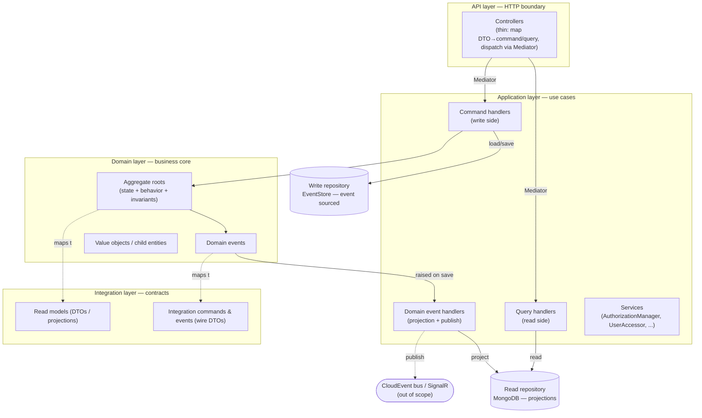
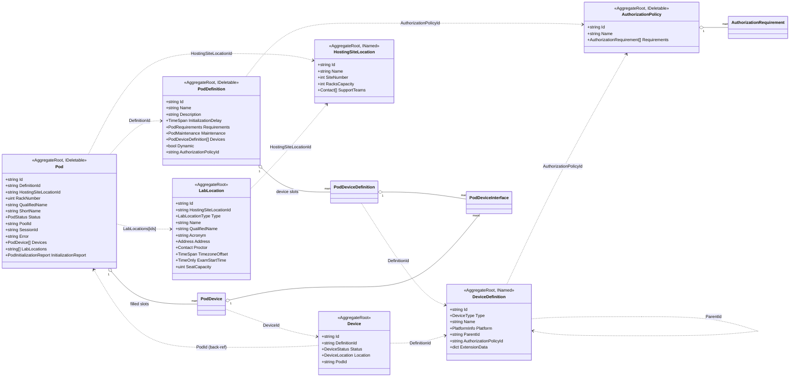
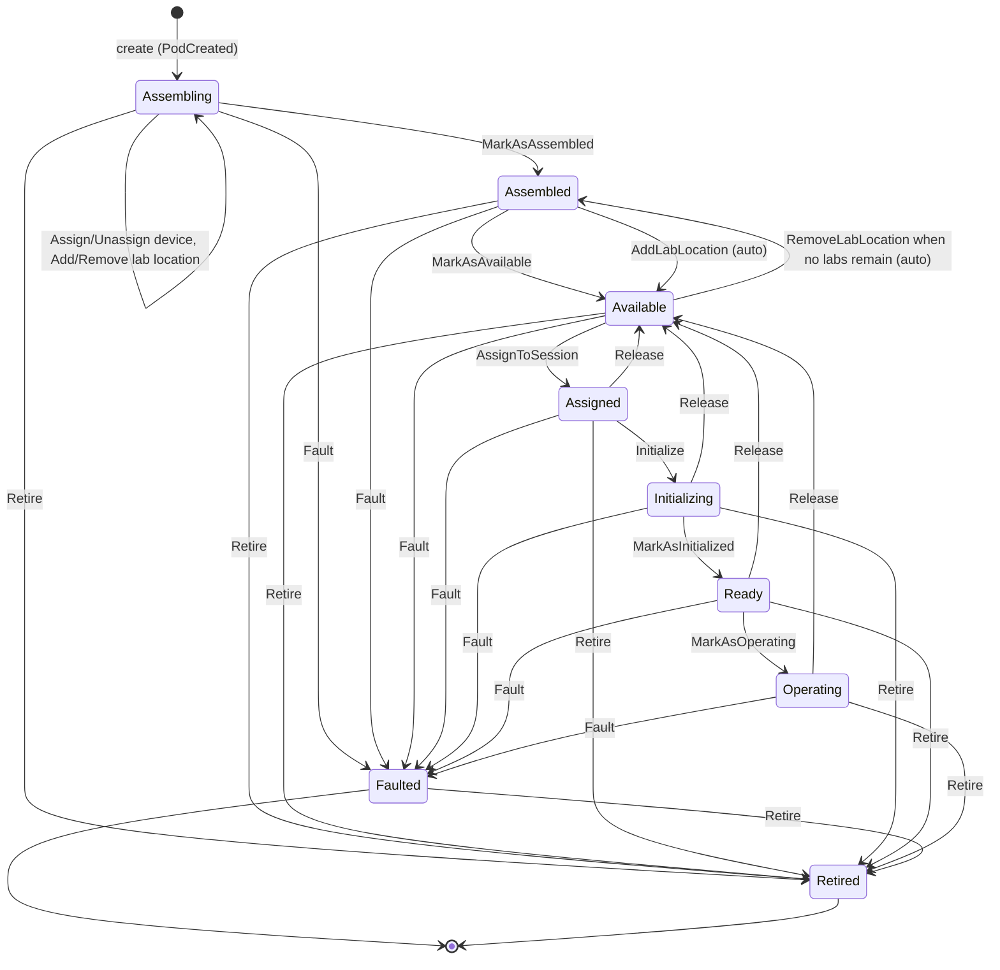
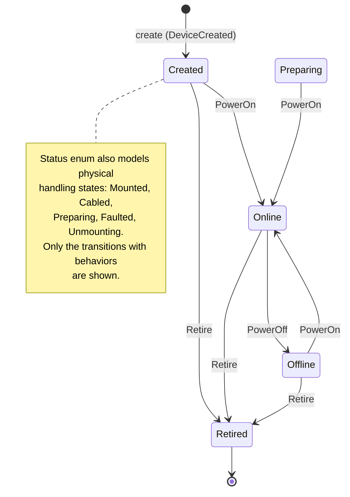
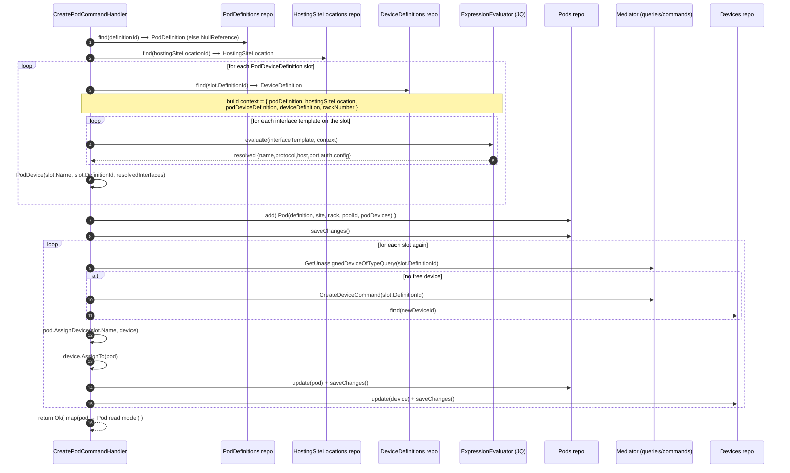
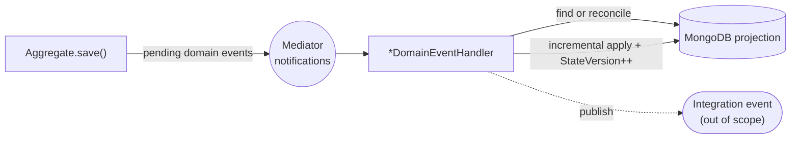
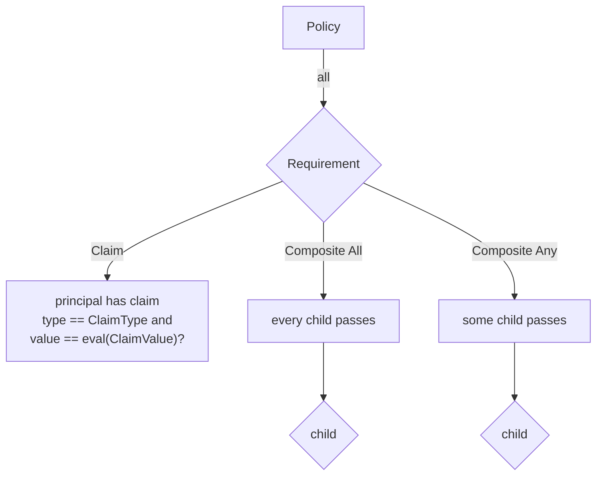

# Pod Manager — Portable Design Document

> **Purpose.** This document captures the complete business‑domain model and application logic of the
> .NET `pod-manager` microservice so it can be re‑implemented in **Python** on top of an equivalent
> **Neuroglia‑style framework** (same abstractions: aggregate roots with event sourcing, mediator‑based
> CQRS, repositories, dependency injection, object mapping, runtime expression evaluation).
>
> It is **language‑neutral by intent**: it describes _what_ each concept is, _how_ it behaves, _which
> invariants_ it enforces, and _which use cases_ it supports — not the C#/Python plumbing. Python is used
> only to illustrate data shapes where that adds clarity.
>
> The reader is assumed fluent in DDD, CQRS, Event Sourcing, the repository pattern, and dependency
> injection. Per scope guidance, the **event‑driven integration surface** (CloudEvents, SignalR, the
> outbox/ingestor) is described only where it is structurally required to understand the CQRS
> write→read flow; it is otherwise out of scope.

---

## 1. What the service is for

Pod Manager is the system of record for **lab "pods"** used to deliver Cisco certification lab exams.
A _pod_ is a concrete, rack‑mounted (or virtual) bundle of networking **devices** assembled to match a
**pod definition** (the blueprint for a given exam/form). Pods live at **hosting site locations**, are
exposed to candidates at **lab locations**, and progress through a strict **lifecycle** from assembly to
operation. Access to pods and their blueprints is gated by **authorization policies**.

The service is responsible for:

- **Cataloguing blueprints** — `PodDefinition`, `DeviceDefinition` (what a pod/device _should_ be).
- **Managing physical/virtual inventory** — `Device` instances and their power/assignment state.
- **Assembling and operating pods** — `Pod` instances and their full lifecycle state machine.
- **Modelling geography** — `HostingSiteLocation` (where pods physically live) and `LabLocation`
  (where candidates sit the exam).
- **Authorizing access** — `AuthorizationPolicy` / `AuthorizationRequirement` evaluated against the
  caller's claims, used to filter what each user may see/manage.

---

## 2. Architectural shape

The service is a textbook **Clean Architecture + DDD + CQRS + Event Sourcing** application with four
projects/layers. The same separation should be preserved in Python.



### 2.1 Two models, two stores (CQRS + ES)

| Concern | Write model | Read model |
|---|---|---|
| Type namespace | `Domain.Models.*` (aggregates) | `Integration.Models.*` (DTOs) |
| Persistence | **EventStore** via event‑sourcing repository | **MongoDB** via document repository |
| How it mutates | Behavior methods raise **domain events**; aggregate folds events back into state | **Domain event handlers** apply incremental updates to the projection |
| Identity | `Id : string` (deterministic, see §4) | same `Id`, plus `StateVersion`, `LastModified` |
| Queried by | never queried directly for lists | all `GET`/OData queries hit this |

Key mechanic: **every write goes through an aggregate**, which emits domain events. A matching
**`*DomainEventHandler`** subscribes to those events and incrementally updates the MongoDB projection
(and emits an integration CloudEvent — out of scope). If a projection is missing when an event arrives,
the handler **reconciles** it by loading the full aggregate from EventStore and mapping it fresh
(`GetOrReconcileProjectionAsync`). This is the self‑healing projection pattern to replicate in Python.

> **Python note.** Assume the framework provides: an `AggregateRoot[TKey]` base with
> `register_event()` / `on()` reducer dispatch and a `pending_events` buffer; `Repository[TAggregate, TKey]`
> with `find_async`/`add_async`/`update_async`/`remove_async`/`save_changes_async`; an event‑sourcing
> repository binding for write models and a Mongo repository binding for read models; a `Mediator`
> with `execute_async` and `execute_and_unwrap_async`; an `IMapper`; and a JQ‑style
> `ExpressionEvaluator`. The design below depends only on those abstractions.

---

## 3. Ubiquitous language (glossary)

| Term | Meaning |
|---|---|
| **Pod Definition** | Blueprint of a pod for a specific exam/form: required device slots, requirements, maintenance, init delay, optional auth policy. Aggregate. |
| **Device Definition** | Blueprint of a device type: hardware/VM/service, hosting platform info, optional parent, optional auth policy. Aggregate. |
| **Pod** | A concrete instance built from a Pod Definition at a hosting site / rack. Has a lifecycle. Aggregate. |
| **Device** | A concrete instance built from a Device Definition; can be assigned to exactly one pod slot. Aggregate. |
| **Pod Device** | A _slot_ inside a Pod: the named placeholder ("R1", "SW2"…) that a real `Device` is plugged into. Child of Pod. |
| **Pod Device Definition** | The slot _blueprint_ inside a Pod Definition (name + required device type + interfaces + visibility + properties). Child entity. |
| **Pod Device Interface** | A connection endpoint (protocol/host/port/auth) used to reach a device. Child entity. |
| **Hosting Site Location** | A physical site that hosts racks/pods (e.g. "SJ"). Aggregate. |
| **Lab Location** | A place where candidates sit an exam, attached to a hosting site. Aggregate. |
| **Authorization Policy** | A named set of requirements gating access to a definition and its instances. Aggregate. |
| **Authorization Requirement** | A claim check or a composite (all/any) of requirements. Child entity. |
| **Qualified name** | Structured human name, e.g. exam `"Exam CCIE TEST v1"` = `TrackType TrackLevel TrackAcronym ExamVersion`. |
| **Pool / Session** | External references a pod may belong to (`PoolId`) or be assigned to (`SessionId`). Owned elsewhere; only the ids are stored here. |

---

## 4. Identity conventions (deterministic IDs)

IDs are **deterministic and human‑meaningful**, derived from natural keys (so duplicates collide by
design). Replicate these exactly — they are part of the contract and drive idempotency.

| Aggregate | ID rule | Example |
|---|---|---|
| `PodDefinition` | `"pd-" + slug(name)` | `pd-exam-ccie-test-v1` |
| `Pod` | `slug(qualifiedName)` where qualifiedName = `"{definitionName} {hostingSiteLocationId} {rackNumber}"` | `exam-ccie-test-v1-sj-1` |
| `Device` | `"{definitionId}-{shortGuid}"` (non‑deterministic suffix) | `csr1000v-a1b2c3d4` |
| `DeviceDefinition` | `name.replace(" ","-").lower()` | `csr-1000v` |
| `LabLocation` | `slug("{hostingSiteLocationName} {name}")` | `san-jose-room-a` |
| `HostingSiteLocation` | caller‑supplied `id` (e.g. site code) | `SJ` |
| `AuthorizationPolicy` | `slug(name).lower()` | `proctors-only` |
| `PodDeviceDefinition` (child) | `slug(name)` | `r1` |
| `AuthorizationRequirement` (child) | random GUID | — |

Helper conventions: `Slugify("-")` lowercases and dash‑joins; `Pod.BuildShortName` takes the **3rd token**
of the definition name as the track acronym → `"{acronym}-{site}-{rack:00}"` (e.g. `TEST-SJ-01`).

---

## 5. Domain model map



**Reference rule (DDD‑correct):** aggregates reference each other **by id only**, never by object
graph. Cross‑aggregate consistency (e.g. pod↔device assignment) is coordinated in the **application
layer** (command handlers), not inside an aggregate.

---

## 6. Aggregates in detail

For each aggregate: its state, its behaviors (each raising a domain event), the invariants it guards,
and the events it folds. In Python, every behavior method should follow the same
**guard → `register_event(evt)` → `on(evt)` reducer** shape.

### 6.1 `PodDefinition` — the pod blueprint

**State**

| Field | Type | Notes |
|---|---|---|
| `Name` | str | Must parse as an **Exam** or **Form** qualified name (validated on create). |
| `Description` | str? | |
| `InitializationDelay` | duration | How long defined pods take to initialize. |
| `Requirements` | `PodRequirements` | racks / memory(GB) / power(W) + extension data. |
| `Maintenance` | `PodMaintenance` | archive volume + ticket service URI. |
| `Devices` | `PodDeviceDefinition[]` | ordered device **slots**. |
| `Dynamic` | bool | `true` = pods can be instantiated/archived on demand; `false` = static, mapped to physical resources provisioned beforehand. |
| `AuthorizationPolicyId` | str? | governs the definition and all its pods. |

**Behaviors → events**

| Behavior | Guard / rule | Event |
|---|---|---|
| _create_ | name must be valid Exam/Form qualified name; requirements & maintenance required | `PodDefinitionCreatedDomainEvent` |
| `SetDescription` | no‑op if unchanged | `PodDefinitionDescriptionChangedDomainEvent` |
| `SetInitializationDelay` | no‑op if unchanged | `PodDefinitionInitializationDelayChangedDomainEvent` |
| `SetRequirements` | required; no‑op if equal | `PodDefinitionRequirementsChangedDomainEvent` |
| `SetMaintenance` | required; no‑op if equal | `PodDefinitionMaintenanceChangedDomainEvent` |
| `AddDevice` | slot required | `DeviceAddedToPodDefinitionDomainEvent` |
| `SetDeviceName` | slot must exist | `PodDefinitionDeviceNameChangedDomainEvent` |
| `RemoveDevice` | slot required | `DeviceRemovedFromPodDefinitionDomainEvent` |
| `SetAuthorizationPolicy` | no‑op if same | `PodDefinitionAuthorizationPolicyChangedDomainEvent` |
| `Delete` | (IDeletable) | `PodDefinitionDeletedDomainEvent` |

**Patchability.** The mutation behaviors carry `[JsonPatchOperation(...)]` metadata mapping JSON‑Patch
ops (`replace /description`, `add /devices`, `remove /devices`, `replace /authorizationPolicyId`…) to the
behavior method. The generic `PatchCommand` (see §8.3) uses this so that an HTTP `PATCH` is translated
into **domain behaviors** (and thus events), never into blind property writes. Reproduce this mapping in
Python (a decorator/registry that binds a patch path+op to a method).

### 6.2 `DeviceDefinition` — the device blueprint

**State:** `Type` (`DeviceType`), `Name`, `Description?`, `Platform` (`PlatformInfo`), `ParentId?`
(self‑reference for device hierarchies), `AuthorizationPolicyId?`, and open `ExtensionData` (arbitrary
key/values, serialized inline).

**Behaviors → events**

| Behavior | Event |
|---|---|
| _create_ | `DeviceDefinitionCreatedDomainEvent` |
| `SetAuthorizationPolicy` | `DeviceDefinitionAuthorizationPolicyChangedDomainEvent` |

Implements `INamed`. Minimal behavior surface — definitions are mostly immutable once created.

### 6.3 `Pod` — the lifecycle‑bearing instance (richest aggregate)

This is the heart of the service. A `Pod` is created from a `PodDefinition` at a hosting site/rack,
carries a set of **slots** (`PodDevice`), accumulates **lab location** ids, and walks a strict
**state machine**.

**State**

| Field | Type | Notes |
|---|---|---|
| `DefinitionId`, `HostingSiteLocationId`, `RackNumber` | str/str/uint | natural key parts. |
| `QualifiedName`, `ShortName` | str | derived display names (§4). |
| `Status` | `PodStatus` | the lifecycle state. |
| `PoolId?`, `SessionId?` | str | external references. |
| `Error?` | str | set when faulted. |
| `Devices` | `PodDevice[]` | slots; each may hold a `DeviceId` + `IsReady`. |
| `LabLocations` | str[] | ids of lab locations the pod serves. |
| `InitializationReport?` | `PodInitializationReport` | currently an empty placeholder type. |

**Lifecycle state machine** (guards are enforced in each behavior; illegal transitions raise
`DomainException.UnexpectedState`):



**Transition rules (exact):**

| Behavior | Allowed from | Result / event(s) |
|---|---|---|
| _create_ | — | → `Assembling`; `PodCreatedDomainEvent` |
| `AssignDevice(slotName, device)` | `Assembling` | fills a slot; `PodAssignedDeviceDomainEvent` |
| `UnassignDevice(slotName)` | `Assembling` | clears a slot; returns prior deviceId; `PodUnassignedDeviceDomainEvent` |
| `MarkAsAssembled()` | `Assembling` | → `Assembled`; `PodAssembledDomainEvent` (+ `PodStatusChangedDomainEvent`) |
| `AddLabLocation(labLocation)` | `Assembling` / `Assembled` / `Available` | adds id; if was `Assembled` auto‑calls `MarkAsAvailable`; `PodLabLocationAddedDomainEvent` |
| `RemoveLabLocation(id)` | `Assembling` / `Assembled` | removes id; if `Available` and no labs left → `MarkAsAssembled`; `PodLabLocationRemovedDomainEvent` |
| `MarkAsAvailable()` | `Assembled` | → `Available`; `PodAvailableDomainEvent` (+ status changed) |
| `AssignToSession(sessionId)` | `Available` | → `Assigned`, stores `SessionId`; `PodAssignedToSessionDomainEvent` |
| `Initialize()` | `Assigned` | → `Initializing`; `PodInitializingDomainEvent` |
| `MarkAsInitialized(report?)` | `Initializing` | → `Ready`; `PodInitializedDomainEvent` |
| `MarkAsOperating()` | `Ready` | → `Operating`; `PodOperatingDomainEvent` |
| `Release()` | any except `Available`/`Faulted`/`Retired` | → `Available`; `PodAvailableDomainEvent` |
| `Fault(error)` | any except `Faulted`/`Retired` | → `Faulted`, stores `Error`; `PodFaultedDomainEvent` |
| `Retire()` | any except `Retired` | → `Retired`; `PodRetiredDomainEvent` |
| `Delete()` | (IDeletable) | `PodDeletedDomainEvent` |

**`AssignDevice` invariants (worth replicating verbatim):**

- pod must be `Assembling`;
- target device must not already be assigned (`device.PodId` empty);
- the named slot must exist;
- slot's required type (`DefinitionId`) must equal the device's `DefinitionId`;
- the slot must not already hold a device.

> Note the dual write: assigning a device to a pod touches **two aggregates** — `Pod.AssignDevice`
> fills the slot and `Device.AssignTo(pod)` sets the back‑reference. The **command handler** performs
> both and saves both repositories (see §8.4). There is no distributed transaction; ordering and
> idempotency (deterministic ids, no‑op guards) provide resilience.

**`PodStatusChangedDomainEvent`.** Several behaviors register _both_ a specific event and a generic
`PodStatusChanged` event. The specific event has an `On` reducer that sets state; the status‑changed
event is a notification (no reducer) primarily for downstream consumers.

> **Observed quirk (carry forward as a decision, not a copy):** in the read‑model projection handler,
> `PodInitializedDomainEvent` sets the projection's `Status` to `Retired` (the aggregate itself correctly
> sets `Ready`). This is almost certainly a bug in the .NET projection. When porting, set the projected
> status to **`Ready`** to match the aggregate's own reducer.

### 6.4 `Device` — the inventory instance

**State:** `DefinitionId`, `Status` (`DeviceStatus`), `Location?` (`DeviceLocation`), `PodId?`
(back‑reference to the pod slot owner).



**Behaviors → events**

| Behavior | Guard | Event |
|---|---|---|
| _create_ | needs a `DeviceDefinition` | `DeviceCreatedDomainEvent` |
| `AssignTo(pod)` | not already assigned | `DeviceAssignedToPodDomainEvent` |
| `Unassign()` | must be assigned | `DeviceUnassignedDomainEvent` |
| `PowerOn()` | status ≤ `Preparing` or `Offline` | `DevicePoweredOnDomainEvent` → `Online` |
| `PowerOff()` | must be `Online` | `DevicePoweredOffDomainEvent` → `Offline` |
| `Retire()` | not already `Retired` | `DeviceRetiredDomainEvent` |

### 6.5 `HostingSiteLocation` — physical site

Mostly descriptive, create‑only. **State:** `Name`, `Description?`, `SiteNumber`, `RacksCapacity?`,
`SupportTeams?` (`Contact[]`). Caller supplies the `Id`. Implements `INamed`. Single event:
`HostingSiteLocationCreatedDomainEvent`.

### 6.6 `LabLocation` — exam delivery location

**State:** `HostingSiteLocationId`, `Type` (`LabLocationType`), `Name`, `QualifiedName`, `Acronym`,
`Address` (VO), `Proctor` (`Contact`), `TimezoneOffset`, `ExamStartTime` (time‑of‑day), `SeatCapacity?`.

**Behaviors → events:** _create_ → `LabLocationCreatedDomainEvent`; `SetProctor(contact)` →
`LabLocationProctorChangedDomainEvent`. Marked `[Patchable]` (the proctor can be PATCH‑replaced). A
lab location may only be added to a pod whose `HostingSiteLocationId` matches (enforced in `Pod`).

### 6.7 `AuthorizationPolicy` — access control

**State:** `Name`, `Description?`, `Requirements` (`AuthorizationRequirement[]`).

**Behaviors → events**

| Behavior | Event |
|---|---|
| _create_ | `AuthorizationPolicyCreatedDomainEvent` |
| `SetName` | `AuthorizationPolicyNameChangedDomainEvent` |
| `SetDescription` | `AuthorizationPolicyDescriptionChangedDomainEvent` |
| `AddRequirement` | `RequirementAddedToAuthorizationPolicyDomainEvent` |
| `RemoveRequirement` | `RequirementRemovedFromAuthorizationPolicyDomainEvent` |
| `Delete` | `AuthorizationPolicyDeletedDomainEvent` |

`[Patchable]`. See §10 for how policies are evaluated.

---

## 7. Value objects, child entities & enums

### 7.1 Child entities (have identity, live inside an aggregate)

| Type | Owner | Identity | Fields |
|---|---|---|---|
| `PodDeviceDefinition` | PodDefinition | `slug(name)` | `Name`, `DefinitionId` (→DeviceDefinition), `Interfaces?`, `IsVisibleToEndUsers`, `Properties?` (pod‑specific config). `SetName` mutator. |
| `PodDeviceInterface` | PodDeviceDefinition / PodDevice | `name` | `Name`, `Protocol`, `Host`, `Port`, `Authentication?`, `Configuration?`. |
| `AuthorizationRequirement` | AuthorizationPolicy | GUID | Either a **Claim** (`ClaimType`, `ClaimValue?` — both regex/expression‑capable) or a **Composite** (`ConditionType` ∈ {All, Any} + nested `Requirements`). |

### 7.2 Value objects / plain data (no identity)

| Type | Fields | Notes |
|---|---|---|
| `PodDevice` | `Name`, `DefinitionId`, `Interfaces?`, `DeviceId?`, `IsReady` | A filled/empty **slot** on a Pod. `Assign(deviceId)` / `Unassign()` flip the binding. |
| `PodRequirements` | `Racks?`, `Memory?` (GB), `Power?` (W), `ExtensionData?` | value‑equatable. |
| `PodMaintenance` | `ArchiveStorageVolume?`, `TicketServiceUri?` | value‑equatable. |
| `PlatformInfo` | `Name`, `ShortName?`, `HypervisorName?`, `SoftwareVersion?`, `SoftwareImage?`, `Requirements?` | describes where/how a device runs. |
| `PlatformRequirements` | `Memory?`, `Vcpu?`, `Power?` | |
| `DeviceLocation` | `Building?`, `Room?`, `Shelf?` | physical placement of a device. |
| `Address` | street name/number, zip, city, state, country | **true VO** (structural equality via atomic values). |
| `Contact` | `Name`, `Email` (validated), `TimezoneOffset?` | **true VO**. |
| `Authentication` | `Scheme`, `Configuration` (scheme‑specific dict) | used by interfaces. |
| `PodInitializationReport` | _(empty placeholder)_ | reserved for future init telemetry. |
| `ExamQualifiedName` | `TrackType`, `TrackLevel`, `TrackAcronym`, `ExamVersion` | parse/format of `"Exam CCIE TEST v1"`. `FormQualifiedName`, `FormsetQualifiedName`, `ModuleQualifiedName` are sibling parsers. |

> **Python shape (illustrative only)** — value objects map naturally to frozen dataclasses / Pydantic
> models; child entities keep an `id`:

```python
@dataclass(frozen=True)
class Address:                       # value object: structural equality
    street_name: str; street_number: str
    zip_code: str; city: str; state: str; country: str

@dataclass
class PodDevice:                     # slot inside a Pod (no own identity)
    name: str
    definition_id: str               # required device type
    interfaces: list[PodDeviceInterface] | None = None
    device_id: str | None = None     # bound concrete device, if any
    is_ready: bool = False
```

### 7.3 Enumerations

| Enum | Members (wire value) |
|---|---|
| `PodStatus` | `assembling, assembled, available, assigned, initializing, ready, operating, faulted, retired` (flag‑style bit values 1,2,4,…256) |
| `DeviceStatus` | `created, mounted, cabled, preparing, online, offline, faulted, unmounting, retired` |
| `DeviceType` | `virtual-machine, hardware, hosted-service, cloud-service` |
| `DeviceInterfaceProtocol` | `telnet, ssh, vnc, rdp, http, https` |
| `LabLocationType` | `static, mobile` |
| `AuthorizationRequirementType` | `Claim, Composite` |
| `AuthorizationRequirementConditionType` | `All, Any` |

All enums serialize as their **string** member value (camel/kebab as listed). Keep the wire strings
identical in Python for contract compatibility.

---

## 8. Application layer — CQRS

The mediator dispatches **commands** (write) and **queries** (read). Handlers are thin orchestrators:
load aggregate(s) → invoke behavior(s) → save. Pipeline middleware wraps every request with
**domain‑exception handling** and **FluentValidation** (replicate as mediator pipeline behaviors).

### 8.1 Command catalogue

| Area | Command | Orchestration summary |
|---|---|---|
| Pods | `CreatePodCommand` | **Complex** — see §8.4. Returns the pod read model. |
| Pods | `AssignDeviceToPodCommand` | load pod+device → `pod.AssignDevice` → save → `device.AssignTo(pod)` → save. |
| Pods | `UnassignDeviceFromPodCommand` | inverse of above. |
| Pods | `AddLabLocationToPodCommand` | load pod+lab → `pod.AddLabLocation` → save. |
| Pods | `RemoveLabLocationFromPodCommand` | `pod.RemoveLabLocation` → save. |
| Pods | `AssignPodToSessionCommand` | `pod.AssignToSession` → save. |
| Pods | `MarkPodAsAssembledCommand` | `pod.MarkAsAssembled`. |
| Pods | `InitializePodCommand` | `pod.Initialize`. |
| Pods | `MarkPodAsInitializedCommand` | `pod.MarkAsInitialized(report)`. |
| Pods | `MarkPodAsOperatingCommand` | `pod.MarkAsOperating`. |
| Pods | `ReleasePodCommand` | `pod.Release`. |
| Pods | `FaultPodCommand` | `pod.Fault(error)`. |
| Pods | `RetirePodCommand` | `pod.Retire`. |
| Pods | `DeletePodCommand` | delete via aggregate. |
| Devices | `CreateDeviceCommand` | load device definition → `Device(definition, location?)` → save. |
| PodDefinitions | `CreatePodDefinitionCommand` | resolve auth policy + each device definition → build slots → create. |
| PodDefinitions | `PatchPodDefinitionCommand` | JSON‑patch → behaviors (§8.3). |
| PodDefinitions | `RenamePodDefinitionDeviceCommand` | `SetDeviceName`. |
| PodDefinitions | `DeletePodDefinitionCommand` | delete. |
| DeviceDefinitions | `CreateDeviceDefinitionCommand` | resolve parent + auth policy → create. |
| LabLocations | `CreateLabLocationCommand` | resolve hosting site → create. |
| HostingSiteLocations | `CreateHostingSiteLocationCommand` | create. |
| AuthorizationPolicies | `CreateAuthorizationPolicyCommand` | create policy, then mediator‑build each requirement and `AddRequirement`. |
| AuthorizationPolicies | `CreateAuthorizationRequirementCommand` / `CreateClaimAuthorizationRequirementCommand` | factory commands that **return a requirement** to compose. |
| Generic | `PatchCommand<TAggregate,TProjection,TKey>` | see §8.3. |
| Generic | `DeleteCommand<TAggregate>` | see §8.3. |

### 8.2 Query catalogue

| Query | Returns | Notes |
|---|---|---|
| `ListQuery<TEntity>` | all projections | generic; backs every `GET` list + OData. |
| `FindByKeyQuery<TEntity>` | one projection | generic by id. |
| `FindByNameQuery<TEntity>` | one projection | generic by name (for `INamed`). |
| `ListPodsForCurrentUserQuery` | pods | filters by auth: admins see all, else only pods whose `DefinitionId` is in the set returned by `ListPodDefinitionsForCurrentUserQuery`. |
| `ListPodsOfTypeQuery` | pods of a definition | |
| `ListPodDefinitionsForCurrentUserQuery` | definitions visible to caller | drives the pod filter above. |
| `GetUnassignedDeviceOfTypeQuery` | `AsyncEnumerable<Device>` | reads the **read model** to find candidate devices (`DefinitionId` matches, `PodId` empty), then loads the **write‑model** aggregates by id. Used by `CreatePodCommand`. |

> **Read/write crossing.** `GetUnassignedDeviceOfTypeQuery` is the one place a query intentionally
> bridges both stores: it _searches_ the Mongo projection (cheap, indexable) but _returns_ the
> event‑sourced aggregates (so the caller can mutate them). Preserve this two‑step in Python.

### 8.3 Generic handlers (reuse, don't duplicate)

- **`ListQueryHandler` / `FindByKeyQueryHandler` / `FindByNameQueryHandler`** — trivial reads over the
  projection repository. Registered once for every read‑model type (the .NET DI scans the assembly:
  `AddGenericQueryHandlers`). In Python, register a generic handler per projection type.
- **`PatchCommandHandler<TAggregate,TProjection,TKey>`** — loads the aggregate, applies the JSON‑Patch
  document through an **object adapter that routes each op to a `[JsonPatchOperation]`‑annotated
  behavior**, and — crucially — **returns `NotModified` if no events were produced**, otherwise saves
  and returns the mapped projection. This makes PATCH fully event‑sourced.
- **`DeleteCommandHandler<TAggregate>`** (for `IDeletable`) — loads aggregate, calls `Delete()` (emits a
  deleted event so the projection handler can remove the read model), then removes it from the write
  store. Note it saves **twice**: once after `Delete()` (to flush the deleted event), once after
  `Remove` — keep that ordering so the projection is torn down before the stream is dropped.

### 8.4 Spotlight: `CreatePodCommand` (the orchestration to get right)

This is the only handler with non‑trivial cross‑aggregate logic and the **expression evaluator**.



Key points to replicate:

1. **Interface templating.** Each `PodDeviceInterface` on a slot is treated as a **runtime expression
   template** evaluated (JQ) against a context object containing the pod definition, site, slot, device
   definition, and rack number. The evaluated result is deserialized back into a concrete interface
   (host/port/etc. computed per pod). This is how, e.g., a device's management IP is derived from rack
   number. The Python port must wire the same `ExpressionEvaluator` and the same context keys.
2. **Auto‑provisioning devices.** For every slot the handler tries to reuse a free device of the right
   type; if none exists it issues `CreateDeviceCommand` and reloads it. Then it performs the **dual
   assignment** (pod slot ↔ device back‑ref) and persists both aggregates.
3. **No transaction; save‑per‑step.** Each aggregate is saved independently. Resilience comes from
   deterministic ids and idempotent guards, not 2PC.

---

## 9. Write → Read projection flow

Every aggregate type has a `*DomainEventHandler` subscribed to all of its domain events. The handler:

1. `GetOrReconcileProjectionAsync(aggregateId)` — fetch the Mongo projection; if absent, **rebuild** it
   from the event‑sourced aggregate via the mapper and insert it (self‑healing).
2. Apply the **incremental change** implied by the event (set status, push/remove a lab id, set a slot's
   `DeviceId`, bump `StateVersion` + `LastModified`, or remove the projection on delete).
3. Publish the corresponding integration CloudEvent / SignalR notification _(out of scope here)_.



Replicate this 1‑handler‑per‑aggregate pattern. The base class provides `GetOrReconcileProjectionAsync`
and `ProjectAsync` (mapper‑based full projection) — provide the same two hooks in Python.

---

## 10. Authorization

`AuthorizationManager` evaluates an `AuthorizationPolicy` (or its id) against a `ClaimsPrincipal`:

- A **policy** passes if **all** its requirements pass (empty requirements ⇒ allow).
- A **Claim** requirement passes if the principal has a matching claim; the expected `ClaimValue` may be
  a **runtime expression**, evaluated (with optional parameters) before comparison.
- A **Composite** requirement combines child requirements with `All` or `Any`.



This manager backs the "for current user" queries: non‑admins only see pod definitions (and therefore
pods) they are authorized for. The current `ClaimsPrincipal` is obtained via a `UserAccessor`
abstraction (HTTP‑context backed) — in Python, inject an equivalent request‑scoped user accessor.

---

## 11. API surface (use cases)

Controllers are intentionally thin: validate model → map integration DTO → dispatch via mediator →
translate `IOperationResult` to HTTP. List endpoints are OData‑queryable (`EnableQuery`). Routes use a
shared controller template and lowercase URLs.

| Resource | Endpoint (verb) | Use case |
|---|---|---|
| **Pods** | `POST /pods` | Create & auto‑assemble a pod (§8.4). |
| | `GET /pods` (OData) | List all pods. |
| | `GET /pods/for/user/current` (auth) | List pods visible to caller. |
| | `GET /pods/byid/{id}` | Get one pod. |
| | `PATCH /pods` | Patch a pod (→ behaviors). |
| | `PUT /pods/devices/assign` · `…/unassign` | Bind/unbind a device to a slot. |
| | `PUT /pods/{podId}/lablocation/add/{labLocationId}` · `…/remove/…` | Manage lab locations. |
| | `PUT /pods/assign` | Assign pod to a session. |
| | `PUT /pods/{podId}/mark/assembled` · `/initialize` · `mark/initialized` · `/{podId}/mark/operating` · `/{podId}/release` · `/fault` · `/{podId}/retire` | Drive the lifecycle. |
| | `DELETE /pods/byid/{id}` | Delete a pod. |
| **Pod Definitions** | `POST` · `GET` · `GET for/user/current` · `GET byid` · `GET byname` · `PATCH` · `PATCH rename device` · `DELETE` | CRUD + patch + rename slot. |
| **Device Definitions** | `POST` · `GET` · `GET byid` · `GET byname` · … | CRUD. |
| **Devices** | `POST` (create) · `GET` · `GET byid` | Inventory. |
| **Hosting Site Locations** | `POST` · `GET` · `GET byid` · `GET byname` · `PATCH` | CRUD + patch. |
| **Lab Locations** | `POST` · `GET` · `GET byid` · `GET byname` · `PATCH` | CRUD + patch (proctor). |
| **Authorization Policies** | `POST` · `GET` · `GET byid` · … | CRUD. |
| **Application** | `DELETE /application/databases/reset` | Ops: reset databases (dev). |

`IOperationResult → HTTP` mapping in the controller base: `Ok→200`, created→`201`, `NotModified→304`,
`Forbid→403`, null find→`404`, validation→`400`; write behaviors that return no body map to `204`.

---

## 12. Framework abstractions to assume in Python

| .NET / Neuroglia abstraction | Python equivalent to assume |
|---|---|
| `AggregateRoot<TKey>` with `RegisterEvent`/`On` reducers & `PendingEvents` | `AggregateRoot[TKey]` base with `register_event`, `on(event)` dispatch, `pending_events` |
| `Entity<TKey>` / `ValueObject` | base `Entity[TKey]`; `ValueObject` with structural equality (`get_atomic_values`) |
| `IRepository<T,TKey>` (+ event‑sourcing vs Mongo bindings) | `Repository[T, TKey]` protocol with two concrete bindings (event store, document db) |
| `IMediator` (`ExecuteAsync`, `ExecuteAndUnwrapAsync`) + pipeline behaviors | mediator with command/query/notification dispatch + middleware (validation, domain‑exception) |
| `IMapper` + `[DataTransferObjectType]` | object mapper; declare aggregate→read‑model and domain‑event→integration‑event maps |
| `IExpressionEvaluator` (JQ) | a JQ/jsonata‑style evaluator with the same context keys (§8.4) |
| `[JsonPatchOperation]` + object adapter | a patch‑op→behavior registry so PATCH stays event‑sourced |
| `DomainException` factory (`ArgumentNull`, `UnexpectedState`, `NullReference`, …) | a `DomainException` with the same factory helpers; map to 400/404/409 |
| `IUserAccessor` / `ClaimsPrincipal` | request‑scoped current‑user accessor + claims abstraction |
| `IOperationResult` | result wrapper carrying status + payload for uniform HTTP translation |

---

## 13. Persistence & DI wiring (reference)

From the composition root:

- **Write store (EventStore):** event‑sourcing repository registered for `AuthorizationPolicy`,
  `DeviceDefinition`, `Device`, `HostingSiteLocation`, `LabLocation`, `PodDefinition`, `Pod`.
- **Read store (MongoDB, db `pod-manager`):** document repository registered for the matching
  `Integration.Models.*` projections (same seven types) + a CloudEvent outbox.
- **Mediator** scans the application assembly; registers domain‑exception + validation pipeline behaviors;
  **generic** query handlers and command (patch/delete) handlers are auto‑registered.
- **JQ expression evaluator**, **object mapper**, **memory distributed cache**, **JWT bearer auth**,
  **OData**, **Swagger**, and a `DatabaseInitializer` hosted service complete the setup.

When porting: keep the **two‑repository split per aggregate** (one event‑sourced write repo, one
document read repo) and the **generic handler registration** so new aggregates need only their
aggregate + projection + event handler + mapping, not bespoke CRUD code.

---

## 14. Rewrite checklist (per aggregate)

For each aggregate, a faithful Python port needs:

1. **Aggregate class** — private state, deterministic id builder, behavior methods (guard →
   `register_event` → `on` reducer), `on` reducers for every event.
2. **Domain events** — one per state change (names/fields per §6), with integration‑event mapping.
3. **Read model (projection)** — DTO mirroring queried fields (+ `StateVersion`, `LastModified`).
4. **Domain event handler** — `get_or_reconcile_projection` + incremental apply per event.
5. **Commands + handlers** — or reuse the generic patch/delete handlers; register create/lifecycle ones.
6. **Queries** — reuse generic `list`/`find_by_key`/`find_by_name`; add the few bespoke ones (§8.2).
7. **Mapping registrations** — aggregate→read‑model and event→integration‑event.
8. **Controller/router** — thin dispatch + `IOperationResult`→HTTP translation.
9. **DI registration** — event‑sourcing repo (write) + document repo (read) + the event handler.

> Start with `PodDefinition` and `DeviceDefinition` (blueprints, mostly create‑only), then `Device`
> (simple lifecycle), then `Pod` (the full state machine + the `CreatePod` orchestration), and finally
> the locations and authorization policy. That order lets you validate the projection/event plumbing on
> simple aggregates before tackling the rich `Pod` flows.
