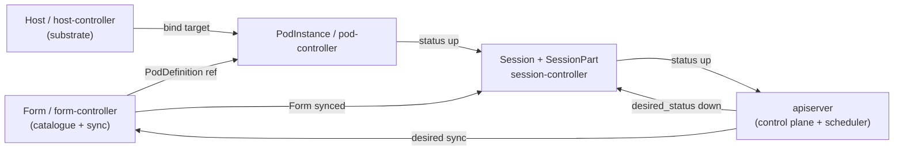

# Resource-Kind Controller Re-Carve — High-Level Implementation Plan

| Attribute | Value |
|-----------|-------|
| **ADR Reference** | [ADR-054 Rev 2](../architecture/adr/ADR-054-controller-topology-resource-kind.md) (controller topology), [ADR-059](../architecture/adr/ADR-059-form-as-first-class-synced-resource.md) (Form), [ADR-046](../architecture/adr/ADR-046-host-abstraction-and-pod-host-type-split.md) (Pod/Host split), [ADR-047](../architecture/adr/ADR-047-generic-reconciliation-framework.md) (reconcile), [ADR-001](../architecture/adr/ADR-001-api-centric-state-management.md) (single store writer) |
| **Solution Reference** | [Solution Overview](../architecture/solution/solution-overview.md), [Resource Model](../architecture/solution/resource-model.md), [Session Model](../architecture/solution/session-model.md), [Unified Resource Management](../architecture/solution/unified-resource-management.md) |
| **Status** | 📋 Proposed (awaiting Phase 0 kickoff) |
| **Author** | Architecture Team |
| **Date** | 2026-06-17 |

---

## 1. Objective

Re-carve the service topology from the **old profile/platform boundaries** onto the
**resource-kind boundaries** of [ADR-054 Rev 2](../architecture/adr/ADR-054-controller-topology-resource-kind.md):
one controller per reconciled resource kind, each plugging the same generic reconcile
loop (ADR-047) into a per-kind manager.

**Target service set:**

| Service | Owns (reconciles) | Replaces / absorbs |
|---|---|---|
| **apiserver** | Control plane: session-manager front, scheduling intent, unified dashboard, seeds the `seed` catalogue; **sole writer of the resource store** (ADR-001). | `control-plane-api` (renamed) + `resource-scheduler` (folded in). |
| **session-controller** | `Session` + `SessionPart` (ordering, gating, part lifecycle). | session half of `lablet-controller`. |
| **form-controller** | `Form` **sync** (Mosaic → RustFS → LDS + SE fan-out) — the one synced `content_package` unit. | content-sync half of `lablet-controller`. |
| **pod-controller** | `PodInstance` (any `PodType`) — the workload. | pod half of `lablet-controller`. |
| **host-controller** | `Host` (any `HostType`) with host adapters inside — the substrate a pod binds to. | `worker-controller` (renamed + generalized). |
| **scenario-engine** | `Job` + `Report` (untimed automation). | unchanged. |

---

## 2. Strategy — Lift-and-Reshape (not rewrite, not in-place)

The hard, reusable machinery already exists in `lcm_core` and is **boundary-agnostic**:

- Layered state model — `ResourceState` (L1), `TimedResourceState` (L2), value objects
  `Timeslot` / `ManagedLifecycle` / `StateTransition` / `PodDefinitionRef`.
- Generic reconciliation framework (ADR-047) —
  `reconciliation_hosted_service` / `leader_elected_hosted_service` /
  `watch_triggered_hosted_service`.
- Through-CPA writer + watch clients (ADR-001) — `ControlPlaneClient`, `EtcdClient`;
  plus `content_store`, `seeding`, `mixins`.

So every new controller is the **same recipe**: `lcm_core` reconcile loop + etcd watch +
`ControlPlaneClient` + one per-kind manager. The per-kind logic already exists — it is
only mis-homed (tangled in `lablet-controller`, profile-named in CPA / `worker-controller`).

**Therefore:** carve fresh `src/<kind>-controller` directories and **move + reshape** the
proven managers, adapters, and tests into them — do **not** re-author logic from scratch,
and do **not** refactor a live tangle in place.

**Posture (operator preferences):** no backward-compatibility scaffolding (no dual-write,
feature flags, deprecation windows, or shims); large but incremental cuts; local-only / no
prod traffic, so each phase ends by **retiring exactly one old service** once drained.

---

## 3. Phase Plan

Each phase is independently shippable and ends with the test suite green. Ordering follows
the dependency DAG: `Form` and `Host` are dependency-free leaves; `Pod` needs both; `Session`
needs everything; `apiserver` consolidates last.

```text
Phase 0  lcm_core foundations + mechanical rename (apiserver)
Phase 1  form-controller        ← Form modeling (dependency-free, highest novelty)
Phase 2  host-controller        ← generalize worker-controller
Phase 3  pod-controller         ← needs Form's PodDefinition ref + Host bind
Phase 4  session-controller     ← orchestrates all; retire lablet-controller
Phase 5  apiserver consolidation← fold scheduler + unify dashboard; retire resource-scheduler
Phase 6  cleanup                ← deployment, workspace, ADR flips, doc reconciliation
```

### Phase 0 — Foundations + mechanical rename

- **0.1** Promote generalized domain into `lcm_core`: `Session` / `SessionPart` /
  `PodInstance` / `Host` states + their `ManagedLifecycle` templates as the canonical bases;
  keep `LabletSession` / `CmlWorker` / `LabRecord` as thin **profiles**, not parallel
  hierarchies ([resource-model.md](../architecture/solution/resource-model.md)).
- **0.2** Add the definition-plane base: `ResourceDefinition` + `provisioning_source`
  (`seed` | `content_package`) per [ADR-050](../architecture/adr/ADR-050-definition-instance-duality.md)
  / [ADR-051](../architecture/adr/ADR-051-provisioning-sources.md).
- **0.3** Confirm the per-kind **manager interface** against the generic loop so all four
  controllers plug in identically (ADR-047).
- **0.4** Mechanical rename **`control-plane-api → apiserver`** (directory, `lcm.code-workspace`,
  `docker-compose*`, Makefiles, per-service `pyproject` / `Dockerfile`). Mechanical and
  reversible; unblocks consistent references for all later phases. `ControlPlaneClient` keeps
  its name (it is the control-plane SPI). _Functional_ consolidation is deferred to Phase 5.

### Phase 1 — `form-controller` (Form modeling + sync)

- Model **`Form`** as a first-class synced `content_package` resource on the catalogue/sync
  plane in `lcm_core` ([ADR-059](../architecture/adr/ADR-059-form-as-first-class-synced-resource.md)):
  `sync_status`, content bytes (RustFS), **optional `PodDefinition` ref**. Generalizes the
  legacy `LabletDefinition`.
- New `src/form-controller`: shell = `lcm_core` loop + etcd watch + `ControlPlaneClient`.
  Move `lablet-controller`'s `content_sync_service` in as the `Form` sync reconciler
  (Mosaic → RustFS → LDS + SE fan-out). Migrate its tests.
- **Exit:** `Form` syncs end-to-end; the `PodDefinition`-ref contract that `pod-controller`
  consumes is defined and tested.

### Phase 2 — `host-controller` (generalize `worker-controller`)

- New `src/host-controller`: same shell. Move `worker-controller`'s EC2/CML lifecycle in as
  the `cml_on_aws` **host adapter** behind a `HostType` adapter seam (ADR-046). Migrate tests.
- **Exit:** `Host` reconciles via the adapter seam. **Retire `worker-controller`.**

### Phase 3 — `pod-controller`

- New `src/pod-controller`: move the pod half of `lablet_reconciler` / `lab_record_reconciler`
  → `PodInstance` manager (any `PodType`), instantiated from the `Form`'s `PodDefinition` ref
  and **bound to a `Host`** via the host-controller contract. Migrate tests.
- **Exit:** pods provision against hosts independent of session orchestration.

### Phase 4 — `session-controller`

- New `src/session-controller`: move session/part orchestration (ordering, gating,
  `part_execution` policy) → `Session` + `SessionPart` managers. This is where the
  `LabletSession → Session` generalization lands ([session-model.md](../architecture/solution/session-model.md)).
  Migrate tests.
- **Exit:** multi-part sessions sequence/gate parts and drive `workflow` phases into SE.
  **Retire `lablet-controller`** (now fully drained).

### Phase 5 — `apiserver` consolidation

- Fold **`resource-scheduler`** in as the **intent producer** (sets `desired_status` +
  `Timeslot`; not a reconciler) per [ADR-054 §2.3](../architecture/adr/ADR-054-controller-topology-resource-kind.md).
- Generalize the dashboard to the unified per-type model
  ([ui-resource-dashboard.md](../architecture/solution/ui-resource-dashboard.md)); apiserver
  stays the sole store writer (ADR-001).
- **Exit:** **Retire `resource-scheduler`.**

### Phase 6 — Cleanup

- Deployment (`docker-compose`, Helm, Makefiles, `lcm.code-workspace`), per-service
  `pyproject` / `Dockerfile`.
- Flip ADR-044–054 + 059 `Proposed → Accepted`.
- Reconcile the as-built/target callouts in the solution docs (remove the "as-built names vs
  target" admonitions once the rename is real).

---

## 4. Dependency DAG



---

## 5. Cross-Cutting Invariants

- **Single writer (ADR-001):** controllers reconcile from an etcd watch and persist
  `status` / cascaded `desired_status` **through apiserver** — never write the store directly.
- **Intent down, status up:** `desired_status` cascades down the tree; observed `status`
  bubbles up.
- **Profiles, not new types:** `LabletSession` / `CmlWorker` / `LabRecord` remain thin
  specialisations of `Session` / `Host` / `PodInstance`.
- **Two planes, one seam:** LCM owns ordering/provisioning; SE owns Collect → Evaluate →
  Report; they meet only at a `LifecyclePhase` whose `engine = workflow`.
- **Test parity:** every moved manager carries its tests; suites stay green per phase.

---

## 6. Decisions (confirmed 2026-06-17)

| # | Decision | Choice |
|---|---|---|
| 1 | Control-plane service name | **Rename `control-plane-api → apiserver`** (clearer, ubiquitous K8s metaphor; it is the sole store writer). |
| 2 | Content-sync controller name | **`form-controller`** (ADR-054 Rev 2 / ADR-059 canonical). |
| 3 | `resource-scheduler` | **Fold into `apiserver`** as the intent producer (Phase 5). |
| 4 | First service | **`form-controller` + `Form` modeling** — dependency-free leaf, highest novelty, defines the `PodDefinition`-ref contract. Then Host → Pod → Session → apiserver. |

---

## 7. Open Questions (to resolve during execution)

- **Q-1** Does `apiserver` host the session-manager front _and_ scheduling intent in one
  process, or are they internal modules with separate hosted services? (Phase 5.)
- **Q-2** `HostType` adapter seam: registry-in-`lcm_core` vs adapters-in-`host-controller`
  only. (Phase 2.)
- **Q-3** Where does the `Form` → `PodDefinition` resolution cache live — form-controller, or
  apiserver read model consumed by pod-controller? (Phase 1/3 boundary.)
- **Q-4** Seed-catalogue ownership during the rename window: confirm apiserver seeds `seed`
  definitions (inert) while form-controller reconciles `content_package`. (Phase 0/1.)

---

## 8. Related

- [ADR-054 Rev 2 — Controller Topology by Resource Kind](../architecture/adr/ADR-054-controller-topology-resource-kind.md)
- [ADR-059 — Form as first-class synced resource](../architecture/adr/ADR-059-form-as-first-class-synced-resource.md)
- [Solution Overview](../architecture/solution/solution-overview.md) · [Resource Model](../architecture/solution/resource-model.md) · [Session Model](../architecture/solution/session-model.md)
