# Session Manager — Portable Domain & Application Design

> **Purpose.** This document is a framework-agnostic, language-agnostic blueprint of the
> `Cisco.Mozart.Microservices.SessionManager` microservice. It is intended as the
> authoritative reference for a **port to Python** assuming an equivalent of the
> **Neuroglia** framework exists in Python (mediator, event sourcing repositories,
> object mapper, JSON-Patch object adapter, runtime expression evaluator, etc.).
>
> **Audience.** Software architects and developers who already understand
> **DDD, CQRS, Event Sourcing (ES), the repository pattern, dependency injection (DI)**,
> and mediator-based application layers. Business stakeholders can follow the entity
> descriptions, use-cases, and the state diagrams.
>
> **Scope notes (per request).** The service's outbound **integration** surface
> (CloudEvents publication, schema registry, SignalR streaming) and its **event-driven**
> ingestion (`CloudEventIngestor`, pod-manager/location integration handlers) are
> intentionally summarized, not detailed. The focus is **business data modeling**:
> aggregates, value objects, domain events, behavior, and CQRS requests.

---

## 1. What this service is, in business terms

The Session Manager is the system of record for **exam delivery sessions** in a
certification program. A _session_ represents one candidate sitting one exam track at a
physical lab, broken into one or more timed **parts** (exam forms), each optionally bound
to a compute **pod**. Around the session, the service also owns the **reference/config
data** required to create and authorize sessions:

| Concept | Business meaning |
|---|---|
| **Session** | A scheduled, stateful exam sitting for a candidate; the central aggregate. |
| **Session Type** | A template defining how many parts a session has and what forms each part may use (e.g. "Lab Exam"). |
| **Delivery Environment** | A delivery channel/platform (e.g. a given site's delivery system) and the session types it supports. |
| **Hosting Site Location** | A physical data-center/site that hosts lab infrastructure. |
| **Lab Location** | A concrete exam room at a hosting site, with proctor, address, capacity, timezone, exam start time. |
| **Authorization Policy** | A reusable, claim-based rule set that gates who may see/act on a resource. |

The service exposes a REST + OData API, persists aggregates via **event sourcing**
(EventStoreDB), and maintains **MongoDB read-model projections** that the queries read
from. It authenticates with JWT bearer tokens and authorizes via claim-based policies.

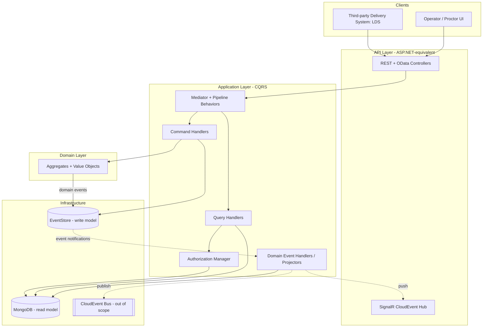

---

## 2. Architectural style & the Neuroglia abstractions to replicate

The port must reproduce these framework capabilities (names below are the .NET ones; the
Python equivalents should provide the same semantics):

| Capability | .NET abstraction | Responsibility to reproduce in Python |
|---|---|---|
| **Mediator** | `IMediator`, `ICommand`/`IQuery`, `ICommandHandler`/`IQueryHandler`, `INotificationHandler` | Dispatch a request to its single handler; publish notifications (domain events) to many handlers. |
| **Pipeline behaviors** | `DomainExceptionHandlingMiddleware<,>`, `FluentValidationMiddleware<,>` | Cross-cutting request middleware: convert domain exceptions → operation results; validate requests. |
| **Operation result** | `IOperationResult`, `this.Ok/Forbid/NotModified/NotFound` | Uniform success/error envelope mapped to HTTP by controllers. |
| **Aggregate base** | `Neuroglia.Data.AggregateRoot<TKey>` | Holds `Id`, `CreatedAt`, `LastModified`, a `PendingEvents` list, `RegisterEvent`, and `On(event)` state mutators. |
| **Entity / value object base** | `Entity<TKey>`, `ValueObject` | Identity equality vs. structural equality. |
| **Event sourcing repository** | `AddEventSourcingRepository<TAgg,TKey>()` + `IRepository<TAgg,TKey>` | Persist/replay aggregates as event streams (write model). |
| **Document repository** | `AddMongoRepository<TProjection,TKey>()` + `IRepository<TProjection,TKey>` | Store/query read-model projections (read model). |
| **Object mapper** | `IMapper`, `[DataTransferObjectType(typeof(...))]`, `[Map]` | Map domain model ↔ integration projection/DTO. |
| **JSON-Patch object adapter** | `IObjectAdapter`, `[Patchable]`, `[JsonPatchOperation(op, prop)]` | Translate JSON-Patch operations into aggregate **behavior method** calls (not blind property sets). |
| **Runtime expression evaluator** | `IExpressionEvaluator` (JQ) | Evaluate `${ ... }` expressions in authorization claim values against parameters. |
| **User accessor** | `IUserAccessor` | Expose the current `ClaimsPrincipal` to handlers. |

> **Key design principle to preserve:** the **write model** (event-sourced aggregates)
> and the **read model** (Mongo projections) are _different types_ that share a shape.
> Commands load/mutate/save **domain aggregates**; queries read **integration projections**;
> domain-event handlers keep the projections in sync.

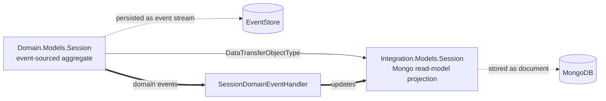

---

## 3. Domain model overview

### 3.1 Building blocks taxonomy

| Kind | Types |
|---|---|
| **Aggregate roots** (event-sourced, top-level identity) | `Session`, `SessionType`, `DeliveryEnvironment`, `LabLocation`, `HostingSiteLocation`, `AuthorizationPolicy` |
| **Entities** (identity, but owned by an aggregate) | `SessionPart` (in `Session`), `SessionPartRequirement` (in `SessionType`), `AuthorizationRequirement` (in `AuthorizationPolicy`) |
| **Value objects** (no identity; structural) | `Address`, `Contact` (true `ValueObject`s); `Authentication`, `CandidateInfo`, `SessionActivityRecord` (embedded immutable-by-behavior data); `FormQualifiedName`, `TrackQualifiedName` (parseable record types) |
| **Enumerations** | `SessionStatus`, `SessionPartStatus`, `SessionPodStatus`, `AuthorizationRequirementType`, `AuthorizationRequirementConditionType` |
| **Marker interfaces** | `IAuthorizable` (has `AuthorizationPolicyId`), `IDeletable` (`Delete()`), `INamed` (has `Name`) |

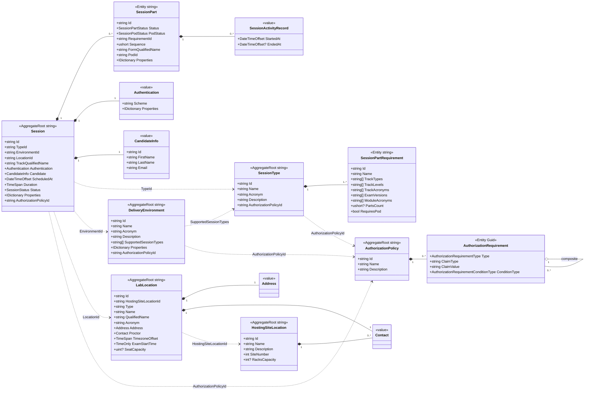

> **Reference vs. composition.** Solid diamonds are **owned** parts that live inside the
> aggregate boundary and are loaded/saved with it. Dashed arrows are **soft references by
> id** across aggregate boundaries — they are _not_ navigated as object graphs; a handler
> resolves them through the relevant repository when needed (consistent with one
> transaction per aggregate).

### 3.2 Identity & id-construction conventions

Ids are **deterministic, human-meaningful slugs** (except `Session`, which appends a short
GUID for uniqueness). Reproduce these exactly — ids are used as natural keys and in URLs.

| Aggregate / entity | Id formula (from `BuildId`) |
|---|---|
| `SessionType` | `slug(acronym)` |
| `DeliveryEnvironment` | `slug(acronym)` |
| `SessionPartRequirement` | `slug(name)` |
| `AuthorizationPolicy` | `slug(name).lower()` |
| `Session` | `{environmentId}-{typeId}-{slug(trackQualifiedName)}-{first 8 chars of a GUID}` |
| `SessionPart` | `{requirementId}-{sequence}` (sequence is 1-based within a requirement) |
| `LabLocation` | externally supplied id; `QualifiedName = "{hostingSiteName} {name}"` |
| `HostingSiteLocation` | externally supplied id |
| `AuthorizationRequirement` | random `Guid` |

> `slug(x)` = the framework's `Slugify("-")` — lowercase, separator-joined. The Python port
> needs an equivalent slug function producing identical output.

---

## 4. The `Session` aggregate (core)

### 4.1 State

A `Session` is created from a `SessionType`, a `DeliveryEnvironment`, a `LabLocation`, a
track qualified name, an `Authentication` config and a `CandidateInfo`, plus optional
schedule, duration, free-form `Properties`, and an `AuthorizationPolicy`. Defaults:
`ScheduledAt = now`, `Duration = 8 hours`, initial `Status = Empty`.

**Creation invariants** (enforced in the constructor → `SessionCreatedDomainEvent`):

- all of type/environment/location/authentication/candidate are required;
- `trackQualifiedName` must parse as a valid `TrackQualifiedName` (3 space-separated tokens);
- the chosen `DeliveryEnvironment` **must support** the chosen `SessionType`
  (`environment.SupportedSessionTypes` contains `type.Id`).

A session owns an ordered list of `SessionPart`s. Each part satisfies a
`SessionPartRequirement` taken from the session's `SessionType`.

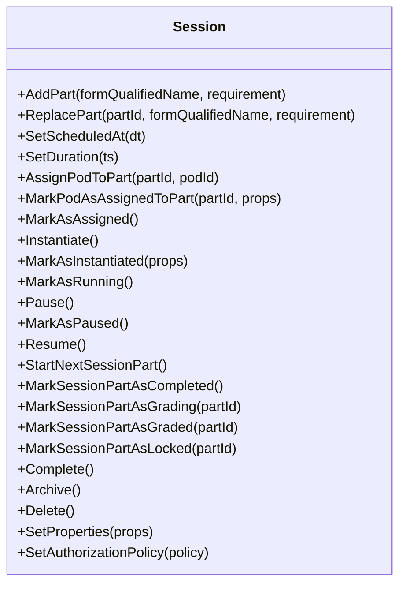

### 4.2 Behavior → domain events

Every public method is a **behavior** that validates the current state, then registers one
or more domain events; the matching `On(event)` mutator applies the state change. This is
the canonical event-sourcing pattern and must be preserved verbatim in Python (a method
should _never_ mutate state directly except through `On`).

| Behavior | Guard (precondition) | Domain event(s) registered |
|---|---|---|
| _(ctor)_ | creation invariants above | `SessionCreatedDomainEvent` |
| `AddPart` | requirement not already saturated (`partsPerRequirement < requirement.PartsCount`) | `PartAddedToSessionDomainEvent` (+ `MarkAsAssigned` if was `Empty`) |
| `ReplacePart` | part exists & is `Pending`; new form valid & supported by requirement | `SessionPartReplacedDomainEvent` |
| `SetScheduledAt` | status ∈ {Empty, Assigned, Instantiating, Pending} | `SessionScheduleChangedDomainEvent` |
| `SetDuration` | not `Archived`; if `Completed`, last part not `Grading`/`Locked` | `SessionDurationChangedDomainEvent` (may re-open a completed session → `Running`) |
| `AssignPodToPart` | part exists | `AssigningPodToSessionPartDomainEvent` |
| `MarkPodAsAssignedToPart` | part exists & `PodStatus == Assigning` | `PodAssignedToSessionPartDomainEvent` |
| `MarkAsAssigned` | status `Empty` | `SessionAssignedDomainEvent` + `SessionStatusChangedDomainEvent` |
| `Instantiate` | status `Assigned` | `SessionInstantiatingDomainEvent` + status-changed |
| `MarkAsInstantiated` | status `Instantiating` | `SessionInstantiatedDomainEvent` + status-changed (→ `Pending`) |
| `MarkAsRunning` | status `Pending` | `SessionRunningDomainEvent` + status-changed (starts first `Pending` part) |
| `Pause` | status `Running` & a part is `Running` | `SessionPausingDomainEvent` + status-changed |
| `MarkAsPaused` | status `Pausing` | `SessionPausedDomainEvent` + status-changed (pauses running part) |
| `Resume` | status `Paused` & a part is `Paused` | `SessionResumedDomainEvent` + status-changed (resumes part) |
| `MarkSessionPartAsCompleted` | status `Running`; a completable part exists | `SessionPartCompletedDomainEvent` (auto-`Complete()` when **all** parts completed) |
| `StartNextSessionPart` | status `Running`; no part already `Running`; a `Pending` part exists | `SessionPartStartedDomainEvent` |
| `MarkSessionPartAsGrading` | part `Completed` | `GradingSessionPartDomainEvent` |
| `MarkSessionPartAsGraded` | part `Grading` | `SessionPartGradedDomainEvent` |
| `MarkSessionPartAsLocked` | part `Graded` | `SessionPartLockedDomainEvent` |
| `Complete` | not already `Completed`/`Archived` | `SessionCompletedDomainEvent` + status-changed |
| `Archive` | — | `SessionArchivedDomainEvent` + status-changed |
| `Delete` | — | `SessionDeletedDomainEvent` |
| `SetProperties` | — | `SessionPropertiesChangedDomainEvent` |
| `SetAuthorizationPolicy` | value actually changes | `SessionAuthorizationPolicyChangedDomainEvent` |

> **Composite events.** Many transitions register **two** events: a semantic event
> (`SessionRunningDomainEvent`) _and_ a generic `SessionStatusChangedDomainEvent(new, prev)`.
> The semantic event carries side-effects (e.g. start a part); the status-changed event is
> the simple status mutation. The projector listens to both. Keep this duality.

### 4.3 Session lifecycle (state machine)

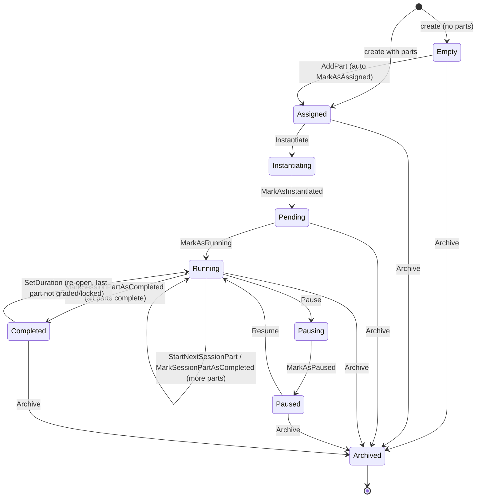

> **Reading the schedule guard.** `SetScheduledAt` is only allowed before the session is
> running (Empty/Assigned/Instantiating/Pending). `SetDuration` has special re-open
> semantics: extending a _completed_ session pushes it back to `Running` and restarts the
> last part, unless that part is already being graded or has been locked.

### 4.4 The `SessionPart` entity

A part is a single timed exam form within the session. It tracks two independent statuses:
its **lifecycle** (`SessionPartStatus`) and its **pod assignment** (`SessionPodStatus`),
and it records **activity windows** for time accounting.

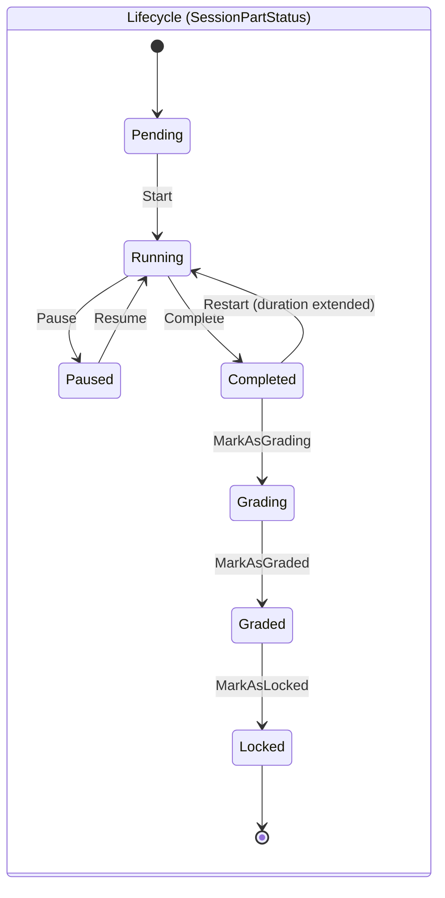

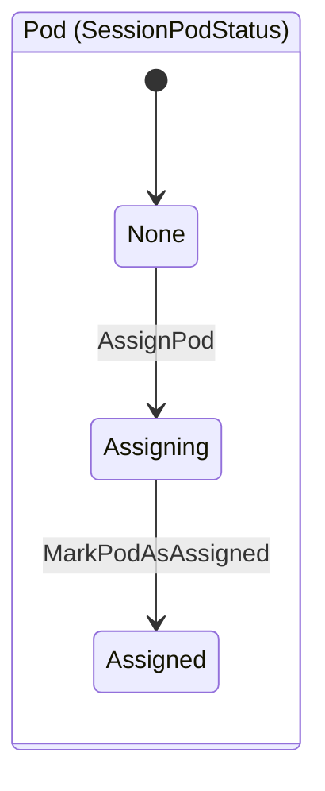

**Activity records.** On `Start`/`Resume`/`Restart` the part appends a new
`SessionActivityRecord(StartedAt = now)`. On `Pause`/`Complete` it closes the open record
(`MarkAsEnded`). Total exam time = sum of `(EndedAt − StartedAt)` across records. There may
never be two open records simultaneously. This is the basis for elapsed-time enforcement.

### 4.5 Embedded value objects

- **`Authentication`** — `Scheme` + scheme-specific `Properties` dict. How the candidate
  authenticates into the delivery system. Required, non-empty.
- **`CandidateInfo`** — `Id`, `FirstName`, `LastName`, `Email` (validated as email). The
  human taking the exam. Treated as an immutable embedded value (set once at creation).
- **`FormQualifiedName`** — parsed structure of an exam form name:
  `"{TrackType} {TrackLevel} {TrackAcronym} {ExamVersion} {ModuleAcronym} {Formset.Form}"`
  (6 space-separated tokens; the 6th splits on `.` into formset `x`-pattern + form number).
  Used to validate that a form satisfies a `SessionPartRequirement`.
- **`TrackQualifiedName`** — `"{TrackType} {TrackLevel} {TrackAcronym}"` (3 tokens). The
  track a whole session belongs to.

```python
# Illustrative shape only (not an implementation prescription)
@dataclass(frozen=True)
class FormQualifiedName:
    track_type: str
    track_level: str
    track_acronym: str
    exam_version: str
    module_acronym: str
    formset_name: str   # e.g. "ABC.x"
    form_number: str    # e.g. "01"

    def __str__(self) -> str:
        # "x" in the formset name is replaced by the concrete form number
        return f"{self.track_type} {self.track_level} {self.track_acronym} " \
               f"{self.exam_version} {self.module_acronym} " \
               f"{self.formset_name.replace('x', self.form_number)}"
```

---

## 5. Configuration aggregates

### 5.1 `SessionType`

A **template** for sessions. Holds an ordered set of `SessionPartRequirement`s (at least
one). Each requirement declares **which exam forms are admissible** for a part and **how
many** parts it yields.

- State: `Name`, `Acronym`, `Description?`, `PartRequirements[]`, `AuthorizationPolicyId?`.
- Behaviors: `SetDescription`, `AddPartRequirement`, `RemovePartRequirement`,
  `SetAuthorizationPolicy`, `Delete` (implements `IDeletable`).
- Events: `SessionTypeCreated`, `…DescriptionChanged`, `PartRequirementAddedToSessionType`,
  `PartRequirementRemovedFromSessionType`, `…AuthorizationPolicyChanged`, `…Deleted`.

**`SessionPartRequirement`** (owned entity) defines admissibility filters — each is a
_whitelist or "any"_ when null:

| Field | Meaning when set | Meaning when null |
|---|---|---|
| `TrackTypes` | only these track types | any track type |
| `TrackLevels` | only these levels | any level |
| `TrackAcronyms` | only these acronyms | any acronym |
| `ExamVersions` | only these versions | any version |
| `ModuleAcronyms` | only these modules | any module |
| `PartsCount` | exact number of parts produced | any number |
| `RequiresPod` | part needs a compute pod | no pod needed |

`EnsureIsSupported(formQualifiedName)` throws a domain error if a candidate form violates
any non-null filter. This is invoked when adding/replacing a `SessionPart`.

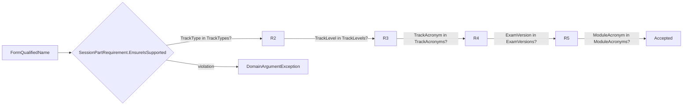

### 5.2 `DeliveryEnvironment`

A delivery channel that **supports a set of session types**. A session can only be created
in an environment that supports its type (creation invariant).

- State: `Name`, `Acronym`, `Description?`, `SupportedSessionTypes[]` (≥1, by id),
  `Properties?`, `AuthorizationPolicyId?`.
- Behaviors: `SetDescription`, `AddSupportedSessionType`, `RemoveSupportedSessionType`,
  `SetProperties`, `SetAuthorizationPolicy`. (No explicit `Delete` behavior.)
- Events: `DeliveryEnvironmentCreated`, `…DescriptionChanged`,
  `SupportedSessionTypeAddedToDeliveryEnvironment`,
  `SupportedSessionTypeRemovedFromDeliveryEnvironment`, `…PropertiesChanged`,
  `…AuthorizationPolicyChanged`.

### 5.3 `HostingSiteLocation` and `LabLocation`

- **`HostingSiteLocation`** (`INamed`) — a physical site: `Name`, `Description?`,
  `SiteNumber`, `RacksCapacity?`, optional `SupportTeams` (list of `Contact`). Behaviors:
  `SetDescription`, `SetSiteNumber`, `SetRacksCapacity`. Externally supplied id.
- **`LabLocation`** — an exam room **belonging to** a hosting site (`HostingSiteLocationId`):
  `Type`, `Name`, `QualifiedName` (= `"{hostingSiteName} {name}"`), `Acronym`, `Address`
  (value object), `Proctor` (`Contact`), `TimezoneOffset`, `ExamStartTime` (time-of-day),
  `SeatCapacity?`. Behaviors: `SetExamStartTime`, `SetProctor`, `SetSeatCapacity`.

`Address` and `Contact` are **true value objects** (structural equality via
`GetAtomicValues`). `Contact` = `Name` + `Email` (validated) + optional `TimezoneOffset`.

> **Integration note (summarized).** Hosting-site and lab-location data is also fed in via
> inbound CloudEvents (`HostingSiteLocationIntegrationEventHandler`,
> `LabLocationIntegrationEventHandler`). Per scope, treat these as an alternate write path
> that ultimately calls the same aggregate behaviors. Detailing them is out of scope.

### 5.4 `AuthorizationPolicy` (+ `AuthorizationRequirement`)

A reusable, named rule set referenced by id from any `IAuthorizable` resource.

- **`AuthorizationPolicy`** (`IDeletable`): `Name`, `Description?`, `Requirements[]`.
  Behaviors: `SetName`, `SetDescription`, `AddRequirement`, `RemoveRequirement`, `Delete`.
- **`AuthorizationRequirement`** (owned entity, `Guid` id) is one of two shapes:
  - **Claim** (`Type = Claim`): checks a `ClaimType` and optional `ClaimValue`. A null/empty
    value means "claim must merely exist". The value may be a **runtime expression**
    (e.g. JQ `${ ... }`) evaluated against contextual parameters.
  - **Composite** (`Type = Composite`): a `ConditionType` (`All` / `Any`) over nested
    child `Requirements` — i.e. boolean AND/OR trees.

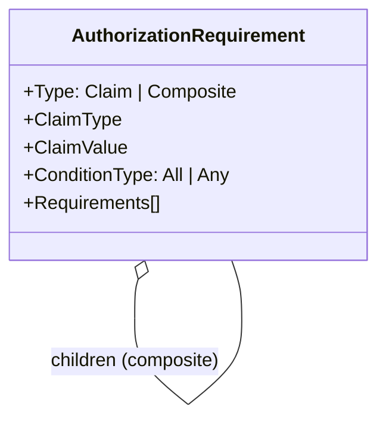

---

## 6. CQRS — the application layer

### 6.1 Request taxonomy

Commands and queries are split, and there are **generic, reusable** handlers plus
**aggregate-specific** ones. A request carries a `[DataTransferObjectType]` link to its
public Integration contract so the API can accept the DTO and the mapper can convert it.

**Generic commands** (`Commands/Generic`):

- `PatchCommand<TAggregate, TProjection, TKey>` — applies a JSON-Patch document to an
  aggregate. Crucially it does **not** set properties blindly: the `IObjectAdapter`
  (`AggregateObjectAdapter`) uses `[Patchable]` + `[JsonPatchOperation(op, propName)]`
  metadata to **route each patch op to the corresponding behavior method**. If the patch
  produces no pending events, returns `NotModified`.
- `DeleteCommand<TAggregate>` (where `TAggregate : IDeletable`) — finds the aggregate, calls
  `Delete()` (emitting a deleted event), saves, then removes it from the store.

**Generic queries** (`Queries/Generic`):

- `FindByKeyQuery<TEntity>` — read one projection by key; throws if missing.
- `FindByNameQuery<TEntity>` — read one by name.
- `ListQuery<TEntity>` — read all projections.
- `ListForCurrentUserQuery<TEntity>` (where `TEntity : IIdentifiable, IAuthorizable`) —
  read all, then filter to those the current user is authorized to see (admins bypass;
  otherwise evaluate each entity's `AuthorizationPolicyId`).

**Session-specific commands** (`Commands/Sessions`) — one per aggregate behavior:
`CreateSessionCommand`, `AddPartToSessionCommand`, `ReplaceSessionPartCommand`,
`AssignPodToSessionPartCommand`, `MarkPodAsAssignedToSessionPartCommand`,
`InstantiateSessionCommand`, `MarkSessionAsInstantiatedCommand`,
`MarkSessionAsRunningCommand`, `PauseSessionCommand`, `MarkSessionAsPausedCommand`,
`ResumeSessionCommand`, `MarkSessionPartAsCompletedCommand`,
`MarkSessionPartAsGradingCommand`, `MarkSessionPartAsGradedCommand`,
`MarkSessionPartAsLockedCommand`, `StartNextSessionPartCommand`, `ArchiveSessionCommand`,
`DeleteSessionCommand`.

**Session-specific queries** (`Queries/Sessions`): `ListSessionsForCurrentUserQuery`,
`ListSessionIdsByTypeQuery`.

> Other aggregates (types, environments, locations, policies) are managed almost entirely
> through the **generic** create/patch/delete/list handlers wired per-type in DI
> (`AddGenericCommandHandlers`, `AddGenericQueryHandlers(assembly)`), keeping per-aggregate
> code minimal.

### 6.2 Command handler anatomy (write side)

A command handler depends on the **event-sourcing** `IRepository<TAggregate>` (and any
collaborator repositories), loads the aggregate, invokes a behavior, and persists. Example
(`CreateSessionCommand`):

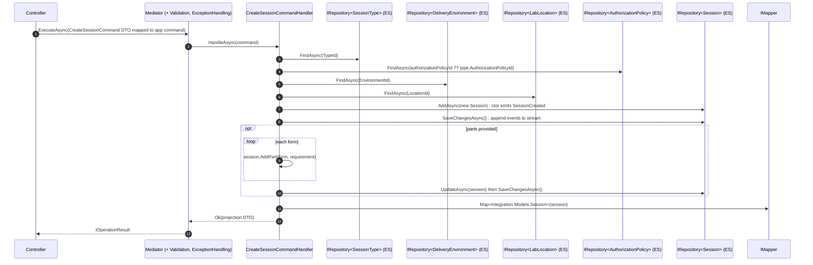

A typical **lifecycle** command (e.g. `InstantiateSessionCommand`) is minimal: find →
behavior → update → save → `Ok()`.

```python
# Illustrative handler shape (not prescriptive)
class InstantiateSessionCommandHandler(CommandHandlerBase):
    def __init__(self, ..., sessions: Repository[Session]):
        ...
        self.sessions = sessions

    async def handle_async(self, command, ct=None):
        session = await self.sessions.find_async(command.session_id) \
            or raise_null_reference(Session, command.session_id)
        session.instantiate()                  # behavior → emits events
        await self.sessions.update_async(session)
        await self.sessions.save_changes_async()
        return self.ok()
```

### 6.3 Query handler anatomy (read side)

Query handlers depend on the **Mongo** `IRepository<Integration.Models.X>` (the projection)
and return projections directly — no aggregate replay. `QueryHandlerBase<TEntity>` holds
the projection repository.

`ListSessionsForCurrentUserQuery` is the most business-rich query. Its rules:

1. unauthenticated → `Forbid`;
2. **admin** → return everything;
3. otherwise read the user's claims: `track-type`, `track-level`, `track-acronym`,
   `lab-location` (each may contain the wildcard `"all"`);
4. compute the **authorized session-type ids** (a type with no policy is open; otherwise
   `AuthorizationManager.AuthorizeAsync(user, policyId, { "SESSIONTYPE": type })`);
5. return sessions whose parsed `TrackQualifiedName` (type/level/acronym) **and**
   `LocationId` match the user's claim whitelist (wildcard `"all"` matches anything).

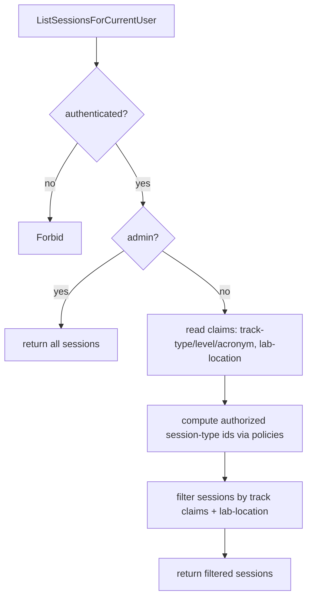

### 6.4 Cross-cutting pipeline

All requests flow through mediator **pipeline behaviors**:

- `DomainExceptionHandlingMiddleware<,>` — catches domain exceptions and converts them into
  the appropriate failed `IOperationResult` (→ HTTP 4xx) instead of unhandled 500s.
- `FluentValidationMiddleware<,>` — runs request validators (commands carry data
  annotations like `[Required]`, `[MinLength]`; plus FluentValidation validators).

Reproduce both as Python mediator middlewares in the same order.

---

## 7. Event sourcing + projection (the read/write bridge)

This is the most important infrastructure pattern to port faithfully.

**Write model.** Each aggregate type is registered with
`AddEventSourcingRepository<TAgg,string>()`. `IRepository<TAgg>.SaveChangesAsync()` appends
the aggregate's `PendingEvents` to its EventStore stream; `FindAsync(id)` replays the stream
to rebuild the aggregate by folding events through `On(event)`.

**Read model.** Each aggregate also has `AddMongoRepository<Integration.Models.X,string>()`.
These store **projections** the queries read.

**Projector.** For every aggregate there is a domain-event handler (e.g.
`SessionDomainEventHandler : DomainEventHandlerBase<Session, Integration.Models.Session, string>`)
implementing `INotificationHandler<TDomainEvent>` for each event. When the mediator
publishes a domain event, the handler:

1. `GetOrReconcileProjectionAsync(aggregateId)` — load the Mongo projection; **if absent**,
   load the aggregate from EventStore, `Map` it to a projection, insert it (lazy
   rebuild/self-healing);
2. apply the event's delta to the projection (status, parts, properties, `StateVersion++`,
   `LastModified`), optionally append to the session **journal** (`RecordSessionEvent`);
3. `Projections.UpdateAsync` + `SaveChangesAsync`;
4. _(out of scope here)_ publish a `CloudEvent` and push to the SignalR hub.

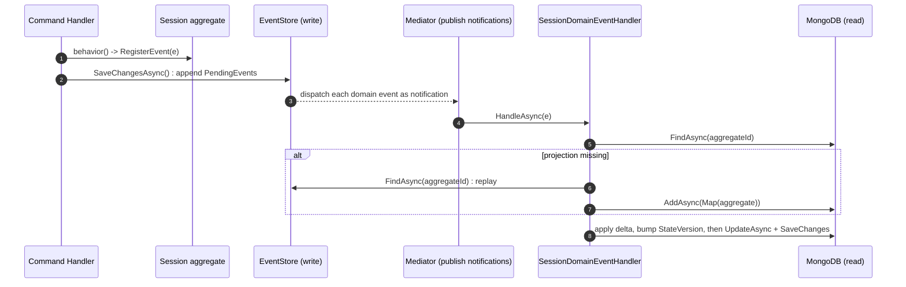

> **Projection shape.** `Integration.Models.Session` mirrors the aggregate's public state
> plus read-model metadata: `StateVersion` (monotonic per projection), `LastModified`, a
> nested `Parts[]` (each with its own `StateVersion`, `ActivityRecords[]`, `PodStatus`,
> `Properties`), and a `Journal` (`SessionJournal`) capturing the event history. The Python
> read model should carry the same fields. The journal/CloudEvent emission is the
> "event-driven" surface that is intentionally left light here.

---

## 8. API surface (controllers)

Controllers are thin: validate model state, map the inbound **Integration** DTO to an
application command/query, `Mediator.ExecuteAsync`, and `Process(result)` to translate the
`IOperationResult` into an HTTP response. Route base is `api/[controller]`. List endpoints
use OData `[EnableQuery]`. Mutations that target a third-party-driven transition
(`mark/...`) are documented as "used exclusively by the delivery system (LDS)".

| Controller | Notable endpoints |
|---|---|
| `SessionsController` | `POST api/sessions`; `GET api/sessions` (OData); `GET …/byid/{id}`; `PATCH api/sessions`; `PUT …/byid/{id}/instantiate`; `…/mark/instantiated`; `…/mark/running`; `…/pause`; `…/mark/paused`; `…/resume`; `…/byid/{id}/parts/{partId}/assign/{podId}`; `…/parts/{partId}/mark/assigned`; `POST …/parts/{formQualifiedName}`; `PUT …/parts/{partId}/{formQualifiedName}`; `…/parts/mark/completed`; `…/parts/{partId}/mark/grading|graded|locked`;`…/parts/next/start`;`…/archive` |
| `SessionTypesController` | generic CRUD + patch over `SessionType` |
| `DeliveryEnvironmentsController` | generic CRUD + patch over `DeliveryEnvironment` |
| `HostingSiteLocationsController` | generic CRUD + patch over `HostingSiteLocation` |
| `LabLocationsController` | generic CRUD + patch over `LabLocation` |
| `AuthorizationPoliciesController` | generic CRUD + patch over `AuthorizationPolicy` |

**Security.** JWT bearer (`Authority`/`Audience` from env); name/role claim mapping; all
endpoints `RequireAuthorization`; a SignalR hub `/api/ws/events` streams CloudEvents
(accepts token via `access_token` query for WS). Per scope, the streaming hub is not
detailed.

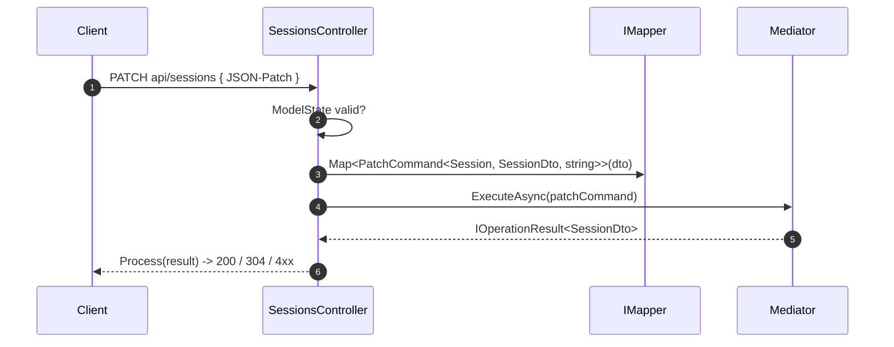

---

## 9. Authorization model in depth

`AuthorizationManager.AuthorizeAsync(user, policy|policyId, parameters)`:

- a policy with no requirements → **authorized**;
- a policy is satisfied when **all** its top-level requirements are satisfied;
- a **claim** requirement: optionally evaluate the `ClaimValue` as a runtime (JQ) expression
  against `parameters` (e.g. the entity under test, injected as `{ "SESSIONTYPE": type }`);
  empty value ⇒ true; otherwise the user must hold a claim with matching type **and** value;
- a **composite** requirement: `All` ⇒ AND over children, `Any` ⇒ OR over children
  (recursive).

`ListForCurrentUserQuery<T>` and `ListSessionsForCurrentUserQuery` apply this per entity to
produce per-user views; admins (`user.IsAdmin()`) bypass all checks.

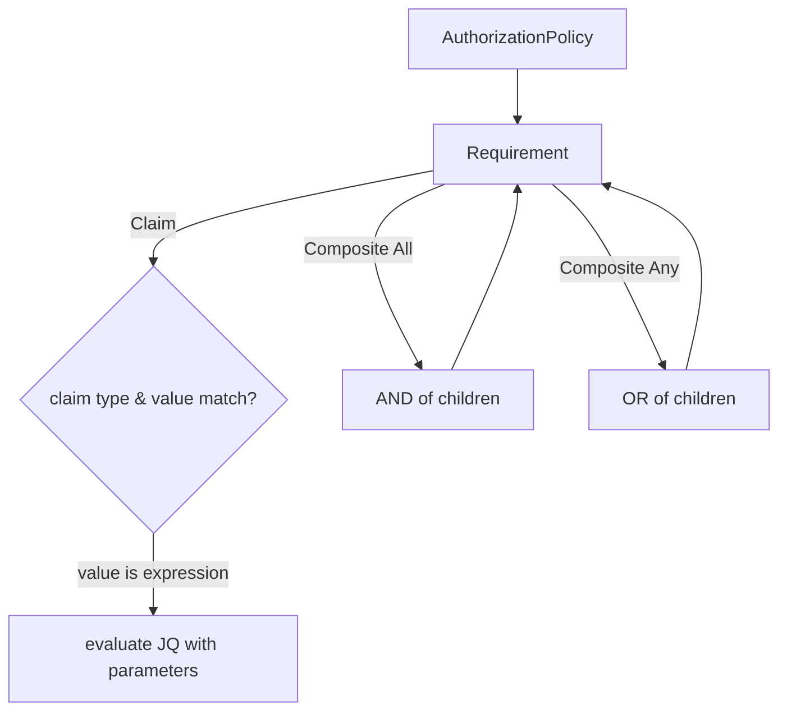

---

## 10. Persistence, seeding & hosting

- **Two stores per aggregate:** EventStore (write/event streams) and MongoDB (read
  projections). Connection strings: `EventStore`, `Mongo`; Mongo database `session-manager`.
- **`DatabaseInitializer`** (hosted service) idempotently **seeds** baseline data on startup
  from YAML assets under `Assets/AuthorizationPolicies`, `Assets/SessionTypes`,
  `Assets/DeliveryEnvironments` (guarded by "does environment `sj` already exist?"). YAML is
  deserialized into Integration models, then created through the aggregate constructors /
  repositories. Reproduce this seeding step (idempotent, file-driven).
- **`BackgroundWorker`** — generic hosted background-task queue (used by the
  out-of-scope event-driven features).
- **Serialization specifics to mirror:** non-public setter contract resolver (so behaviors,
  not setters, drive state), `DateTimeOffset` date parsing, ignore-null, allow non-public
  default constructors (aggregates have protected ctors), abstract-class converter,
  and custom BSON serializers for `TimeOnly` and dictionaries.

---

## 11. Port checklist (Neuroglia-Python parity)

1. **Aggregate base** with `id`, `created_at`, `last_modified`, `pending_events`,
   `register_event`, and event-folding `on(event)` dispatch (by event type).
2. **Entity** (identity equality) and **ValueObject** (structural equality via atomic
   values) bases.
3. **Event-sourcing repository** (`save` appends pending events; `find` replays) **and**
   **document repository** (Mongo) per aggregate — the dual-store pattern.
4. **Mediator** with command/query handlers, notification (domain-event) handlers, and the
   **validation** + **domain-exception** pipeline behaviors.
5. **Mapper** with a `data_transfer_object_type` linkage (domain ↔ integration) and a
   `[Map]`-equivalent for private-backed read-only collections.
6. **JSON-Patch object adapter** honoring `patchable` + `json_patch_operation(op, prop)` so
   patches invoke **behaviors**, and a no-op patch yields `not_modified`.
7. **Runtime expression evaluator** (JQ-equivalent) for authorization claim values.
8. **User accessor** exposing the authenticated principal & claims; admin detection;
   claim helpers (`find_all("track-type")`, etc.).
9. **Projectors**: one notification handler per aggregate that maintains the read model with
   `get_or_reconcile_projection` (lazy rebuild from event stream) and `state_version`.
10. **Deterministic id builders** and **slugify** matching the originals exactly.
11. **Idempotent YAML seeding** at startup.
12. Preserve all **guards and invariants** in section 4.2 and the **state machines** in
    sections 4.3–4.4 — they are the core business rules.

---

### Appendix A — Enumerations (exact members & wire values)

| Enum | Members (wire value) |
|---|---|
| `SessionStatus` | `empty`, `assigned`, `instantiating`, `pending`, `running`, `pausing`, `paused`, `completed`, `archived` |
| `SessionPartStatus` | `pending`, `running`, `paused`, `completed`, `grading`, `graded`, `locked` |
| `SessionPodStatus` | `none`, `assigning`, `assigned` |
| `AuthorizationRequirementType` | `Claim`, `Composite` |
| `AuthorizationRequirementConditionType` | `All`, `Any` |

### Appendix B — Domain events by aggregate

- **Session:** `SessionCreated`, `PartAddedToSession`, `SessionPartReplaced`,
  `SessionScheduleChanged`, `SessionDurationChanged`, `SessionAssigned`,
  `SessionStatusChanged`, `AssigningPodToSessionPart`, `PodAssignedToSessionPart`,
  `SessionInstantiating`, `SessionInstantiated`, `SessionRunning`, `SessionPausing`,
  `SessionPaused`, `SessionResumed`, `SessionPartStarted`, `SessionPartCompleted`,
  `GradingSessionPart`, `SessionPartGraded`, `SessionPartLocked`, `SessionCompleted`,
  `SessionArchived`, `SessionPropertiesChanged`, `SessionAuthorizationPolicyChanged`,
  `SessionDeleted`.
- **SessionType:** `SessionTypeCreated`, `SessionTypeDescriptionChanged`,
  `PartRequirementAddedToSessionType`, `PartRequirementRemovedFromSessionType`,
  `SessionTypeAuthorizationPolicyChanged`, `SessionTypeDeleted`.
- **DeliveryEnvironment:** `DeliveryEnvironmentCreated`, `…DescriptionChanged`,
  `SupportedSessionTypeAddedToDeliveryEnvironment`,
  `SupportedSessionTypeRemovedFromDeliveryEnvironment`, `…PropertiesChanged`,
  `…AuthorizationPolicyChanged`.
- **LabLocation:** `LabLocationCreated`, `LabLocationExamStartTimeChanged`,
  `LabLocationProctorChanged`, `LabLocationSeatCapacityChanged`.
- **HostingSiteLocation:** `HostingSiteLocationCreated`, `…DescriptionChanged`,
  `…SiteNumberChanged`, `…RacksCapacityChanged`.
- **AuthorizationPolicy:** `AuthorizationPolicyCreated`, `…NameChanged`,
  `…DescriptionChanged`, `RequirementAddedToAuthorizationPolicy`,
  `RequirementRemovedFromAuthorizationPolicy`, `AuthorizationPolicyDeleted`.
