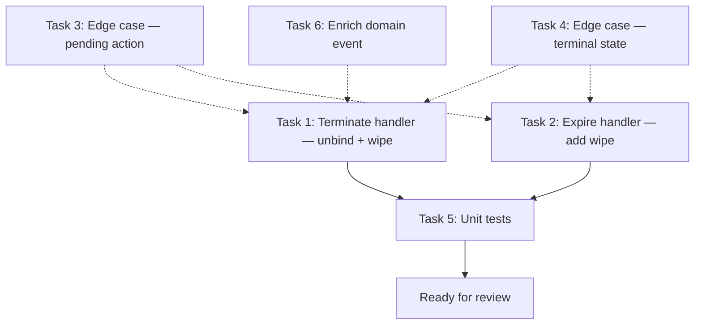

# Session Termination → Lab Record Wipe

> **Effort:** 1 session
> **Dependencies:** None — all prerequisite infrastructure exists
> **Services:** control-plane-api (primary), lablet-controller (reactive execution)
> **Status:** ⬜ Not Started

## Problem Statement

When a LabletSession is terminated (manual termination) or expired (timeslot exhaustion), the linked LabRecord is **not wiped**. This leaves CML lab node configurations intact, meaning:

1. **Data leakage**: Previous user's device configurations remain on the lab
2. **Incorrect state**: LabRecord shows BOOTED/STOPPED but contains stale configs
3. **Resource waste**: Started labs remain running on expensive EC2 instances
4. **Reuse contamination**: If the lab is reused for a new session, it starts with prior user's state

### Current Behavior

| Trigger | Lab Unbind | Lab Stop | Lab Wipe | Capacity Release |
|---------|-----------|----------|----------|-----------------|
| **Terminate** (manual) | ❌ Not done | ❌ Not done | ❌ Not done | ✅ Done |
| **Expire** (timeslot) | ✅ Done | ❌ Not done | ❌ Not done | ✅ Done |

### Desired Behavior

| Trigger | Lab Unbind | Lab Stop | Lab Wipe | Capacity Release |
|---------|-----------|----------|----------|-----------------|
| **Terminate** (manual) | ✅ | ✅ (via wipe) | ✅ | ✅ |
| **Expire** (timeslot) | ✅ | ✅ (via wipe) | ✅ | ✅ |

---

## Gap Analysis

### Gap 1: `TerminateLabletSessionCommandHandler` — No Lab Unbind or Wipe

**File:** `src/control-plane-api/application/commands/lablet_session/terminate_lablet_session_command.py`

The terminate handler currently:

1. ✅ Validates state transition
2. ✅ Releases ports from session
3. ✅ Calls `session.terminate()` → emits `LabletSessionTerminatedDomainEvent`
4. ✅ Releases worker capacity via `ReleaseCapacityCommand`

**Missing:**

- Does NOT unbind the LabRecord (`lab_record.unbind_from_lablet(...)`)
- Does NOT queue a lab wipe (`WipeLabRecordCommand`)

### Gap 2: `ExpireLabletSessionCommandHandler` — No Lab Wipe

**File:** `src/control-plane-api/application/commands/lablet_session/expire_lablet_session_command.py`

The expire handler currently:

1. ✅ Calls `session.expire()` → emits `LabletSessionExpiredDomainEvent`
2. ✅ Unbinds LabRecord (`lab_record.unbind_from_lablet(...)`)
3. ✅ Releases worker capacity via `ReleaseCapacityCommand`

**Missing:**

- Does NOT queue a lab wipe (`WipeLabRecordCommand`)

### Gap 3: No Reactive Wipe on Termination/Expiration Events

There is no `DomainEventHandler` that reacts to `LabletSessionTerminatedDomainEvent` or `LabletSessionExpiredDomainEvent` to trigger a lab wipe. The existing handlers only:

- `LabletSessionTerminatedDomainEventHandler` → Broadcasts SSE
- `LabletSessionTerminatedEtcdProjector` → Deletes session state from etcd

### Gap 4: `LabletSessionTerminatedDomainEvent` Lacks `lab_record_id`

The terminated event does not carry `lab_record_id`, which would be needed if we chose a purely event-driven approach. However, since we'll do the wipe inline in the command handler (same pattern as expiry), this is not blocking.

---

## Design Decision

### Approach: Inline Wipe in Command Handlers (Recommended)

**Rationale:** Follow the established pattern from `ExpireLabletSessionCommandHandler` which already performs downstream cleanup (unbind + capacity release) inline within the handler. This keeps the transaction boundary clear and avoids eventual-consistency complications.

**Alternative considered:** Reactive event-driven approach (new `DomainEventHandler` reacting to terminated/expired events). Rejected because:

- Requires adding `lab_record_id` to domain events (schema change)
- Introduces eventual consistency — wipe could fail silently
- Breaks the "command = transaction boundary" principle established in ADR-001
- The expire handler already demonstrates the inline pattern

### Wipe Semantics

Per ADR-017 (reconciliation-based queuing):

- `WipeLabRecordCommand` sets `pending_action=wipe` on the LabRecord
- The `LabRecordReconciler` (lablet-controller) watches etcd and executes the CML wipe API call
- On success, `complete_lab_action()` is reported back to control-plane-api
- The LabRecord transitions to WIPED status

This is the correct approach because:

1. Lab wipe is an **async physical operation** (CML API call to remote EC2 instance)
2. The reconciliation pattern handles retries, host resolution, and stop-before-wipe
3. It's already battle-tested for manual wipe button clicks in the UI

### Port Behavior (ADR-031 / ADR-032)

Ports are **topology-level** (belong to LabRecord, not session). Per ADR-031:

- Ports are NOT released on session termination/expiration
- Ports persist on the LabRecord for reuse across sessions
- Ports are only freed when the LabRecord itself is deleted

This is already correct — no change needed for ports.

---

## Implementation Plan

### Task 1: Add Lab Unbind + Wipe to `TerminateLabletSessionCommandHandler`

**File:** `src/control-plane-api/application/commands/lablet_session/terminate_lablet_session_command.py`

**Changes:**

1. Add `LabRecordRepository` dependency injection
2. After `session.terminate()` + persist, unbind the LabRecord (same pattern as expire handler)
3. After unbinding, dispatch `WipeLabRecordCommand` via Mediator (best-effort)

**Implementation detail:**

```python
# Add to __init__ parameters:
lab_record_repository: LabRecordRepository

# Add after capacity release block (best-effort, non-blocking):
# 5. Unbind LabRecord + Queue wipe (best-effort)
if session.state.lab_record_id:
    try:
        lab_record = await self._lab_record_repository.get_by_id_async(session.state.lab_record_id)
        if lab_record and lab_record.state.active_lablet_session_id == request.session_id:
            binding_id = lab_record.state.active_binding_id or ""
            lab_record.unbind_from_lablet(
                lablet_session_id=request.session_id,
                binding_id=binding_id,
            )
            await self._lab_record_repository.update_async(lab_record)
            logger.info(
                "Unbound lab_record %s from terminated session %s",
                session.state.lab_record_id,
                request.session_id,
            )

        # Queue wipe regardless of binding state (lab needs reset)
        if lab_record and not lab_record.is_terminal and not lab_record.state.pending_action:
            wipe_result = await self.mediator.execute_async(
                WipeLabRecordCommand(lab_record_id=session.state.lab_record_id)
            )
            if wipe_result.is_success:
                logger.info(
                    "Queued wipe for lab_record %s after session %s termination",
                    session.state.lab_record_id,
                    request.session_id,
                )
            else:
                logger.warning(
                    "Failed to queue wipe for lab_record %s: %s",
                    session.state.lab_record_id,
                    wipe_result.error_message,
                )
    except Exception as e:
        logger.warning(
            "Error during lab cleanup for terminated session %s: %s",
            request.session_id,
            e,
        )
```

**New imports:**

```python
from application.commands.lab.wipe_lab_record_command import WipeLabRecordCommand
from domain.repositories.lab_record_repository import LabRecordRepository
```

---

### Task 2: Add Lab Wipe to `ExpireLabletSessionCommandHandler`

**File:** `src/control-plane-api/application/commands/lablet_session/expire_lablet_session_command.py`

**Changes:**

1. After the existing unbind block (step 3), dispatch `WipeLabRecordCommand` via Mediator
2. Track result in response payload (`lab_wipe_queued: bool`)

**Implementation detail:**

```python
# Add after the unbind block (after `lab_record_unbound = True`):
# 3b. Queue wipe for the unbound lab (best-effort)
lab_wipe_queued = False
if session.state.lab_record_id:
    try:
        # Re-fetch if not already loaded, or use existing reference
        if not lab_record:
            lab_record = await self._lab_record_repo.get_by_id_async(session.state.lab_record_id)
        if lab_record and not lab_record.is_terminal and not lab_record.state.pending_action:
            wipe_result = await self.mediator.execute_async(
                WipeLabRecordCommand(lab_record_id=session.state.lab_record_id)
            )
            lab_wipe_queued = wipe_result.is_success
            if not lab_wipe_queued:
                log.warning(
                    "Failed to queue wipe for lab_record %s on expiry: %s",
                    session.state.lab_record_id,
                    wipe_result.error_message,
                )
    except Exception as e:
        log.warning(
            "Error queuing wipe for lab_record %s on session expiry: %s",
            session.state.lab_record_id,
            e,
        )
```

**Update return payload:**

```python
return self.ok(
    {
        "session_id": request.session_id,
        "status": "expired",
        "reason": request.reason,
        "lab_record_unbound": lab_record_unbound,
        "lab_wipe_queued": lab_wipe_queued,  # NEW
        "capacity_released": capacity_released,
    }
)
```

**New import:**

```python
from application.commands.lab.wipe_lab_record_command import WipeLabRecordCommand
```

---

### Task 3: Handle Edge Case — Lab Already Has Pending Action

The `WipeLabRecordCommand` will return a 409 Conflict if the lab already has a `pending_action` (e.g., a stop is in progress). This is acceptable behavior:

- If lab is already being stopped → the stop will complete, then the lab sits in STOPPED. The wipe was not queued.
- If lab is already being wiped → idempotent, no-op needed.
- If lab is already being deleted → delete subsumes wipe, no action needed.

**Mitigation:** Log a warning and include the conflict reason in the response. No retry logic needed — the next session instantiation pipeline will ensure a clean lab state anyway (it wipes before import per ADR-034 Sprint C).

**Implementation:** Already handled by the try/except + `wipe_result.is_success` check above.

---

### Task 4: Handle Edge Case — Lab Record in Terminal State

If the LabRecord is already WIPED, DELETED, or ARCHIVED, the wipe command returns 400 Bad Request ("Cannot wipe lab in terminal state"). This is correct:

- WIPED → already wiped, nothing to do
- DELETED → lab no longer exists on CML
- ARCHIVED → lab is archived, nothing to do

**Mitigation:** The `is_terminal` guard before dispatching `WipeLabRecordCommand` prevents this. Already included in the implementation above.

---

### Task 5: Unit Tests

**File:** `src/control-plane-api/tests/application/commands/test_terminate_session_lab_wipe.py` (new)

Test cases:

1. **Happy path**: Session with lab_record_id → unbind + wipe queued
2. **No lab_record_id**: Session without lab → no wipe attempted (PENDING sessions)
3. **Lab already in terminal state**: No wipe dispatched
4. **Lab has pending action**: Wipe returns conflict, logged as warning
5. **Lab record not found**: Graceful handling, session still terminates
6. **Wipe dispatch failure**: Exception caught, session termination succeeds

**File:** `src/control-plane-api/tests/application/commands/test_expire_session_lab_wipe.py` (new)

Test cases:

1. **Happy path**: Expired session → unbind + wipe queued
2. **Lab already wiped**: No wipe dispatched
3. **Lab has pending action**: Conflict logged, expiry still succeeds
4. **Wipe failure**: Does not block expiry completion

---

### Task 6: Update `LabletSessionTerminatedDomainEvent` (Optional Enhancement)

**File:** `src/control-plane-api/domain/events/lablet_session_events.py`

Add `lab_record_id: str | None` field to the terminated event for observability. This allows downstream consumers (SSE, metrics, audit log) to know which lab was affected.

```python
@cloudevent("lablet_session.terminated.v1")
@dataclass
class LabletSessionTerminatedDomainEvent(DomainEvent):
    aggregate_id: str
    terminated_at: datetime
    terminated_by: str
    reason: str | None
    from_state: str
    duration_seconds: float | None
    lab_record_id: str | None  # NEW — linked lab (if any)
```

**Impact:** Requires updating the `session.terminate()` method signature and the SSE handler payload. Low risk — additive field.

---

## Sequencing & Dependencies



Tasks 1 and 2 are independent and can be done in parallel. Tasks 3–4 are handled by guard conditions within Tasks 1–2. Task 6 is optional enhancement.

---

## Verification Checklist

- [ ] `make test` passes in control-plane-api
- [ ] `make lint` passes in control-plane-api
- [ ] Manual test: Terminate a running session → verify lab enters WIPING state
- [ ] Manual test: Let a session expire via timeslot → verify lab enters WIPING state
- [ ] Manual test: Terminate a session with no lab_record → no errors
- [ ] Manual test: Terminate when lab already has pending_action → warning logged, session still terminates
- [ ] SSE event `lablet.session.terminated` still broadcasts correctly
- [ ] Lab record reconciler picks up the wipe and executes CML API call
- [ ] Lab transitions to WIPED after successful CML wipe

---

## Risk Assessment

| Risk | Impact | Mitigation |
|------|--------|-----------|
| Wipe fails (CML API unreachable) | Lab remains un-wiped until manual intervention | LabRecordReconciler has retry logic. Operator can manually trigger wipe via UI. |
| Lab already being stopped/wiped | 409 Conflict from WipeLabRecordCommand | Guard with `pending_action` check; log and continue |
| Circular dependency (wipe triggers events that trigger more wipes) | Infinite loop | `WipeLabRecordCommand` only sets pending_action — it does NOT emit session events. No circular risk. |
| Performance: extra DB lookup for lab_record on every termination | Slight latency increase | Lab_record lookup is already O(1) by ID. Acceptable for correctness. |
| Session without lab_record_id (early termination before scheduling) | Null pointer | Guard with `if session.state.lab_record_id` — same pattern as expire handler |

---

## Files Modified Summary

| # | File | Action | Description |
|---|------|--------|-------------|
| 1 | `src/control-plane-api/application/commands/lablet_session/terminate_lablet_session_command.py` | MODIFY | Add LabRecordRepository DI, unbind lab, dispatch WipeLabRecordCommand |
| 2 | `src/control-plane-api/application/commands/lablet_session/expire_lablet_session_command.py` | MODIFY | Dispatch WipeLabRecordCommand after existing unbind |
| 3 | `src/control-plane-api/domain/events/lablet_session_events.py` | MODIFY (optional) | Add `lab_record_id` to TerminatedDomainEvent |
| 4 | `src/control-plane-api/domain/entities/lablet_session.py` | MODIFY (optional) | Pass `lab_record_id` to terminate event |
| 5 | `src/control-plane-api/tests/application/commands/test_terminate_session_lab_wipe.py` | CREATE | Unit tests for terminate → wipe flow |
| 6 | `src/control-plane-api/tests/application/commands/test_expire_session_lab_wipe.py` | CREATE | Unit tests for expire → wipe flow |

---

## ADR Alignment

| ADR | Alignment |
|-----|-----------|
| ADR-001 (Control Plane as truth) | ✅ All state mutations go through CPA commands |
| ADR-017 (Reconciliation-based lab ops) | ✅ Wipe uses pending_action → etcd → reconciler pattern |
| ADR-020 (Session entity model) | ✅ Uses session.state.lab_record_id (absorbed FK) |
| ADR-031 (Port lifecycle) | ✅ Ports are NOT touched — topology-level |
| ADR-032 (Topology persistence) | ✅ Node tags persist until wipe executes on CML |
| ADR-034 (Pipeline-based instantiation) | ✅ Next session will find clean lab after wipe |
