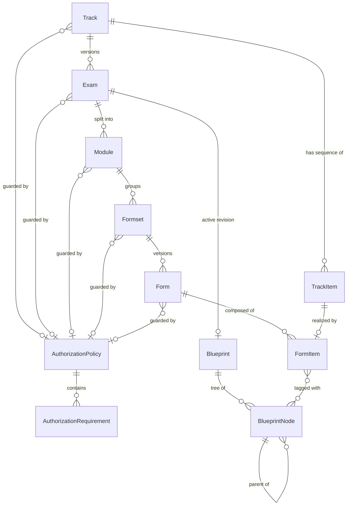
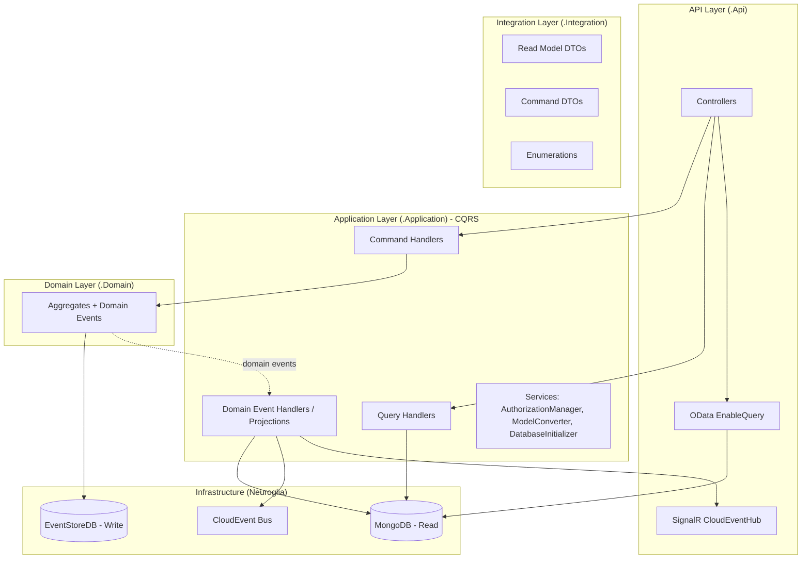
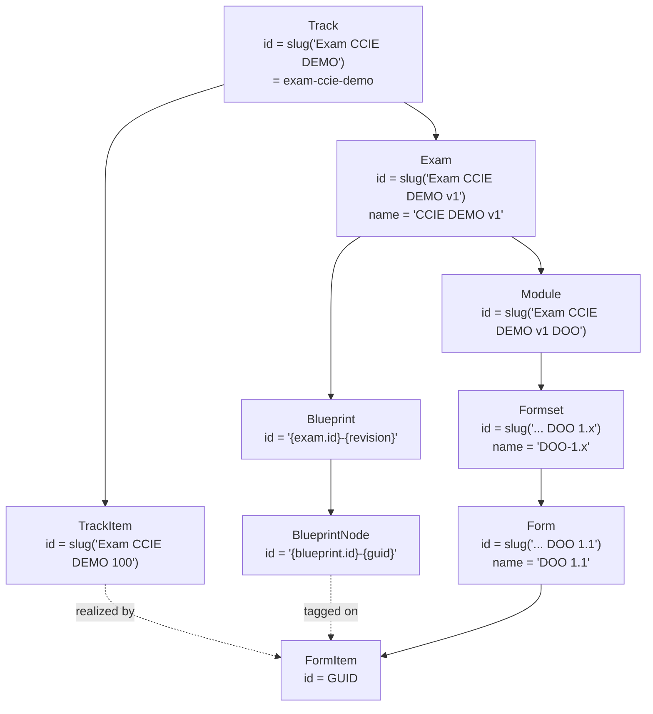
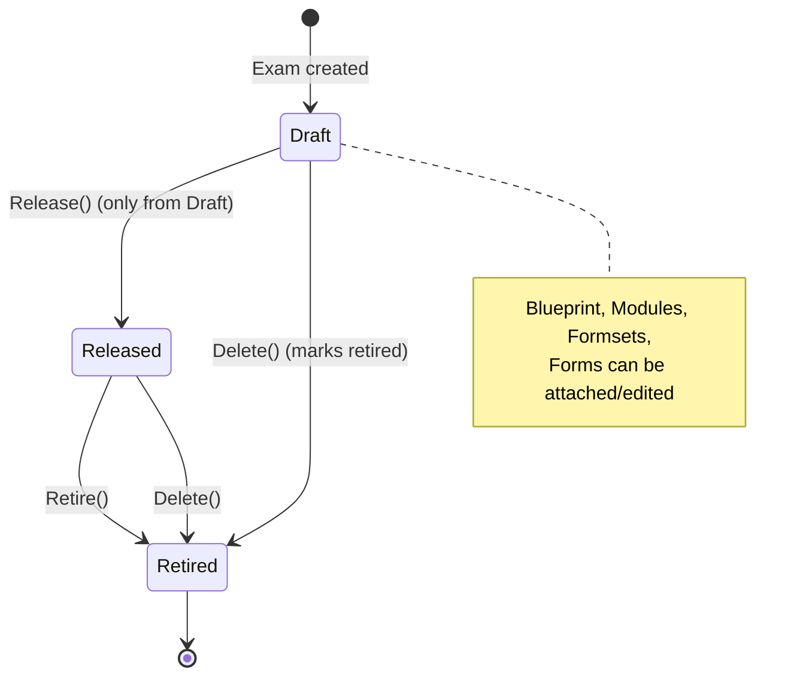
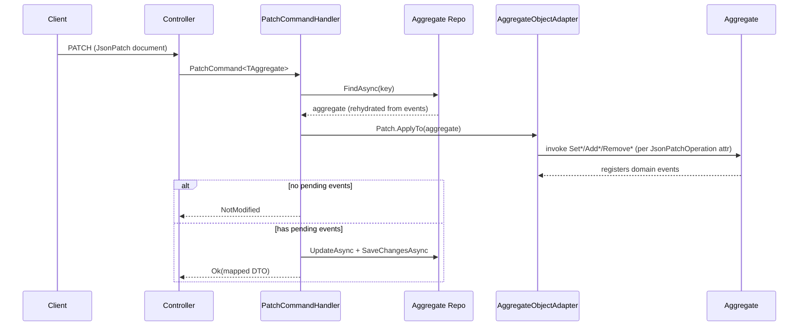
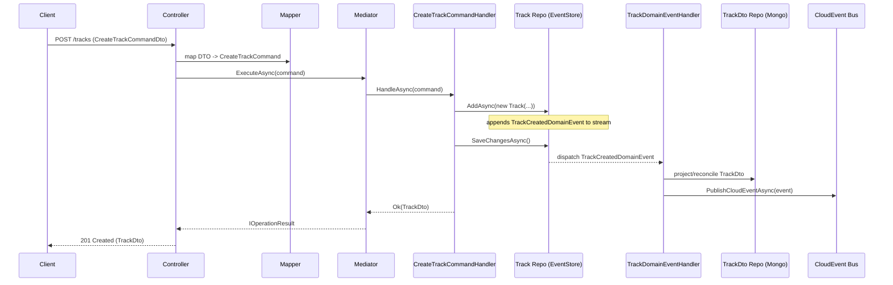
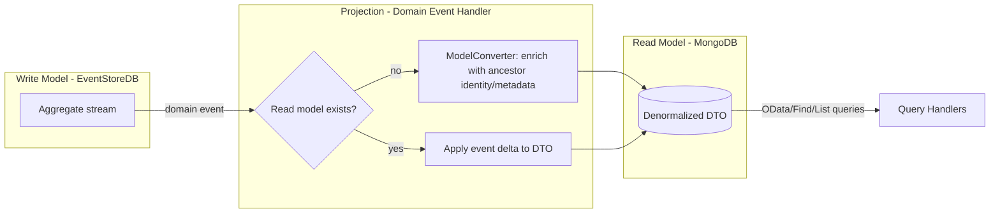
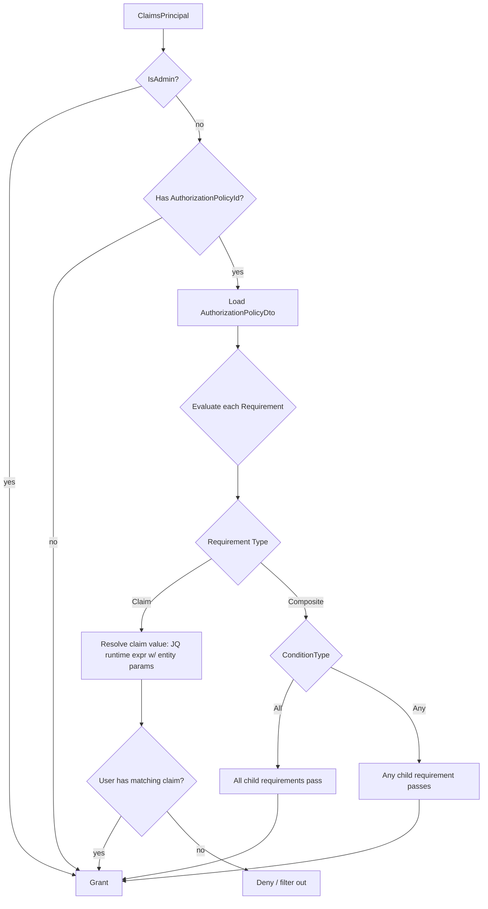

# Track Manager — Portable Domain & Application Design

> **Purpose** — This document is a framework-agnostic blueprint of the _Track Manager_ microservice
> (currently `Cisco.Mozart.Microservices.TrackManager`, .NET / Neuroglia). It captures the business
> domain model, aggregate behaviour, domain events, CQRS request surface, projections and supporting
> application services in enough detail to **re-implement the service in Python** on an equivalent
> Neuroglia-style framework (same abstractions: `AggregateRoot`, `IRepository`, `IMediator`,
> event-sourcing repositories, mapper, mediation pipeline, OData-like queryable read models).
>
> The reader is assumed fluent in **DDD, CQRS, Event Sourcing, Repository, Dependency Injection**.
> Python is used only to illustrate data shapes where helpful — **no implementation code is provided**.
>
> _Scope note:_ per request, the event-driven choreography (CloudEvents broker, SignalR fan-out) and
> downstream pod/integration concerns are described only at the level needed to understand projections;
> they are **not** the focus.

---

## 1. What the service is, in business terms

The Track Manager owns the **certification authoring domain** of the Mozart platform. It models how a
Cisco certification **Track** is structured and versioned — from the abstract track down to the concrete,
scored items that appear on a specific exam form.

The central business hierarchy is a **content taxonomy**:

- A **Track** is a certification line (e.g. _Exam / CCIE / DEMO_). It defines a canonical, auto-numbered
  list of **Track Items** (the stable catalogue of tasks/questions that "belong" to the track regardless
  of which exam version uses them), and it owns one or more versioned **Exams**.
- An **Exam** is a versioned realisation of the track (e.g. _CCIE DEMO v1_). It has a lifecycle
  (Draft → Released → Retired), an optional **Blueprint** (the topic taxonomy with weights), and is
  decomposed into **Modules**.
- A **Module** is a section of an exam (e.g. a written or lab section). It groups **Formsets**.
- A **Formset** is a versioned family of forms (e.g. _DOO-1.x_). It contains concrete **Forms**.
- A **Form** is a specific deliverable version of the formset (e.g. _DOO 1.1_). It is composed of
  **Form Items**.
- A **Form Item** is the actual item _as it appears on a given form_: it references the canonical
  **Track Item** it realises, carries section/sequence placement and an optional raw score, and is
  **tagged** with the **Blueprint Nodes** (topics) it covers.

Cross-cutting, an **Authorization Policy** (a reusable set of claim-based **Authorization Requirements**)
can guard any of Track / Exam / Module / Formset / Form, controlling which authenticated users may see
or act on them.

### 1.1 Containment & relationships (business view)



---

## 2. Architectural shape

The service is a **Clean Architecture / CQRS / Event-Sourced** microservice with four projects:

| Layer | Project | Responsibility |
|-------|---------|----------------|
| **Domain** | `*.Domain` | Aggregates, domain events, invariants, identity construction. No infrastructure. |
| **Integration** | `*.Integration` | Read-model **DTOs** (queryable), inbound **command DTOs**, **enumerations**, marker interfaces. The public contract. |
| **Application** | `*.Application` | CQRS **command/query handlers**, **domain-event handlers** (projections), application **services** (authorization, model conversion, seeding), mapping. |
| **API** | `*.Api` | Thin controllers, OData query surface, JWT auth, JSON-Patch input, SignalR hub, composition root (`Startup`). |



**Write/read separation:**

- **Write side** — each aggregate is persisted by an **event-sourcing repository** (EventStoreDB). State
  is rebuilt by replaying domain events through `On(event)` mutators.
- **Read side** — each aggregate has a corresponding **DTO** persisted in **MongoDB** via a Mongo
  repository. Read models are **denormalized** and **queryable** (OData `EnableQuery`).
- **Projection** — domain-event handlers translate each domain event into a read-model upsert and
  (secondarily) publish a CloudEvent + push to a SignalR hub.

### 2.1 Python framework expectations

The Python rewrite assumes an equivalent framework providing:

- `AggregateRoot[TKey]` with `id`, `state_version`, `created_at`, `last_modified`, a **pending-events**
  buffer, `register_event(e)` and convention-based `on(event)` application.
- `DomainEvent[TAggregate, TKey]` base carrying `aggregate_id` and `created_at`.
- `Repository[TAggregate, TKey]` interface with `add`, `find`, `update`, `remove`, `save_changes`,
  `to_list`, and a **queryable** projection (`as_queryable`) for read models.
- A **mediator** with `execute(request)` returning an `OperationResult`, plus a **pipeline** for
  cross-cutting middleware (domain-exception handling, validation).
- An **object mapper** (DTO ⇄ command, aggregate → DTO) driven by attributes/decorators.
- A **JSON-Patch** apply mechanism bound to aggregate behaviour methods (see §6.3).
- A **runtime-expression evaluator** (JQ) for authorization claim expressions.

---

## 3. Aggregate root contract (shared base)

All write-model entities derive from `AggregateRoot<string>` (string identity). The base provides:

- `Id : string`
- `StateVersion : int` (event count / optimistic version; incremented by `On` handlers)
- `CreatedAt`, `LastModified : DateTimeOffset`
- `PendingEvents` — buffer of uncommitted domain events
- `RegisterEvent(e)` — enqueue + return the event
- `On(e)` — per-event-type **state mutator** (the only place state changes)

**Canonical aggregate pattern** (used by every aggregate):

1. Public constructor validates arguments, computes a **deterministic Id**, and calls
   `On(RegisterEvent(new XyzCreatedDomainEvent(...)))`.
2. A protected parameterless constructor exists for rehydration.
3. Each **behaviour method** (`SetName`, `Release`, `AddRequirement`, …) is **idempotency-guarded**
   (returns `false` / no-ops when nothing changes), enforces invariants, then
   `On(RegisterEvent(new XyzChangedDomainEvent(...)))`.
4. `On(event)` handlers apply the event to fields and bump `LastModified` (and sometimes `StateVersion`).

```python
# Illustrative state shape only — not an implementation.
class AggregateRoot:           # provided by the framework
    id: str
    state_version: int
    created_at: datetime
    last_modified: datetime
    pending_events: list[DomainEvent]
```

### 3.1 Deterministic identity & naming conventions

A defining trait of this domain: **most ids are deterministic slugs derived from the parent chain**,
which makes ids human-meaningful and idempotent re-creation detectable (duplicate id → conflict).
`slugify` lower-cases and replaces separators with `-`.



| Aggregate | Qualified name | Id | Display name |
|-----------|----------------|----|----|
| Track | `"{Type} {Level} {Acronym}"` e.g. `Exam CCIE DEMO` | slug(qualified name) | — |
| TrackItem | `"{track.QualifiedName} {sequence}"` | slug(qualified name) | — |
| Exam | `"{track.QualifiedName} v{version}"` | slug(qualified name) | `"{track.Name} v{version}"` |
| Blueprint | — | `"{exam.Id}-{revision}"` | — |
| BlueprintNode | — | `"{blueprint.Id}-{guid:N}"` | — |
| Module | `"{exam.QualifiedName} {acronym}"` | slug(qualified name) | — |
| Formset | `"{module.QualifiedName} {version}.x"` | slug(qualified name) | `"{module.Acronym}-{version}.x"` |
| Form | `"{formset.QualifiedName trimmed}{version}"` | slug(qualified name) | `"{formset.Name trimmed}{version}"` |
| FormItem | — | random GUID | — |
| AuthorizationPolicy | — | slug(name) | — |
| AuthorizationRequirement | — | GUID (child Entity, not an aggregate) | — |

> The Formset/Form names trim the trailing character of the parent name (e.g. `DOO-1.x` → drop `x` →
> `DOO-1.1`). Preserve this exact rule in the rewrite to keep ids stable.

---

## 4. Aggregates in detail

For each aggregate: **what it is**, **state**, **behaviour (commands it enforces)**, **domain events**,
and **invariants**.

### 4.1 Track  _(aggregate root — hierarchy root)_

**What** — A certification line. Root of the content tree. `IPolicyBasedAuthorizable`, `IDeletable`.

**State**

| Field | Type | Notes |
|-------|------|-------|
| `Type` | `TrackType` | immutable after creation |
| `Level` | `TrackLevel` | immutable |
| `Name` | string | required |
| `Acronym` | string | required, part of identity |
| `QualifiedName` | string | derived `"{Type} {Level} {Acronym}"` |
| `DisplayName` | string? | optional |
| `Description` | string? | |
| `ItemSequenceStart` | ulong | sequence value of the **first** TrackItem; subsequent items auto-increment |
| `Expertises` | list[str]? | free-form tags |
| `AuthorizationPolicyId` | string? | guard |

**Behaviour** — `SetDisplayName`, `SetExpertises`, `SetAuthorizationPolicy(policy)`, `SetName`,
`SetDescription`, `Delete`. All idempotency-guarded; `SetName`/creation reject null/whitespace name &
acronym.

**Domain events** — `TrackCreated`, `TrackDisplayNameChanged`, `TrackExpertisesChanged`,
`TrackNameChanged`, `TrackDescriptionChanged`, `TrackAuthorizationPolicyChanged`, `TrackDeleted`.

**Invariants** — `name` and `acronym` non-empty; identity derived from `(Type, Level, Acronym)`.

### 4.2 TrackItem  _(aggregate root)_

**What** — A canonical, auto-numbered item of a track (the stable catalogue entry a form item realises).

**State** — `Type : TrackItemType`, `TrackId`, `Sequence : ulong`, `QualifiedName`, `Status?`,
`Description?`.

**Behaviour** — `SetStatus`, `SetDescription` (guarded). No delete behaviour defined.

**Domain events** — `TrackItemCreated`, `TrackItemStatusChanged`, `TrackItemDescriptionChanged`.

**Sequence rule (application-level, see §6.4)** — On creation the handler reads existing track items for
the track; the new `Sequence` is `last + 1`, or `track.ItemSequenceStart` if none exist yet.

### 4.3 Exam  _(aggregate root)_

**What** — A versioned realisation of a track with a publication lifecycle.
`IPolicyBasedAuthorizable`, `IDeletable`.

**State** — `Status : ExamStatus` (default `Draft`), `TrackId`, `Name`, `QualifiedName`, `Description?`,
`Version` (semantic), `ReferenceNumber?`, `BlueprintId?`, `ReleasedAt?`, `RetiredAt?`,
`AuthorizationPolicyId?`.

**Behaviour**

- `SetBlueprint(blueprint)` → `ExamBlueprintChanged` (sets `BlueprintId`).
- `SetName`, `SetDescription`, `SetReferenceNumber`, `SetAuthorizationPolicy` (guarded).
- `Release()` — **only valid from `Draft`** (else domain error); sets `Released`, `ReleasedAt`.
- `Retire()` — invalid if already `Retired`; sets `Retired`, `RetiredAt`.
- `Delete()` — emits `ExamDeleted`; the `On` handler also marks status `Retired` + `RetiredAt`.

**Domain events** — `ExamCreated`, `ExamBlueprintChanged`, `ExamNameChanged`, `ExamDescriptionChanged`,
`ExamReferenceNumberChanged`, `ExamAuthorizationPolicyChanged`, `ExamReleased`, `ExamRetired`,
`ExamDeleted`.



### 4.4 Blueprint  _(aggregate root)_

**What** — The topic taxonomy that an exam is measured against (a revisioned set of topics).

**State** — `ExamId`, `Title`, `Revision : int` (≥ 0), `TopicTitles : readonly[str]`.

**Behaviour** — Creation only (no mutators beyond create in the domain). New revisions are **new
Blueprint aggregates** (`id = "{exam.Id}-{revision}"`).

**Domain events** — `BlueprintCreated`.

**Invariants** — `title` non-empty, `revision ≥ 0`.

### 4.5 BlueprintNode  _(aggregate root — self-referential tree)_

**What** — A single node in a blueprint's topic tree (a topic / sub-topic, optionally weighted).

**State** — `BlueprintId`, `Title`, `SequenceLabel`, `ParentId?` (tree edge), `Weight? : double`
(0 ≤ w ≤ 1), `Notes?`.

**Behaviour** — `SetTitle`, `SetSequenceLabel`, `SetWeight`, `SetNotes` (guarded; weight range enforced).
These handlers also bump `StateVersion`.

**Domain events** — `BlueprintNodeCreated`, `BlueprintNodeTitleChanged`,
`BlueprintNodeSequenceLabelChanged`, `BlueprintNodeWeightChanged`, `BlueprintNodeNotesChanged`.

**Invariants** — `title` & `sequenceLabel` non-empty; `0 ≤ weight ≤ 1`. Tree is modelled by `ParentId`
pointers (no embedded children).

### 4.6 Module  _(aggregate root)_

**What** — A section of an exam. `IPolicyBasedAuthorizable`, `IDeletable`.

**State** — `ExamId`, `Name`, `Acronym`, `QualifiedName`, `Description?`, `AuthorizationPolicyId?`.

**Behaviour** — `SetName`, `SetDescription`, `SetAuthorizationPolicy`, `Delete` (guarded).

**Domain events** — `ModuleCreated`, `ModuleNameChanged`, `ModuleDescriptionChanged`,
`ModuleAuthorizationPolicyChanged`, `ModuleDeleted`.

### 4.7 Formset  _(aggregate root)_

**What** — A versioned family of forms within a module. `IPolicyBasedAuthorizable`, `IDeletable`.

**State** — `ModuleId`, `Name`, `QualifiedName`, `Description?`, `Version`, `AuthorizationPolicyId?`.

**Behaviour** — `SetName`, `SetDescription`, `SetAuthorizationPolicy`, `Delete` (guarded).

**Domain events** — `FormsetCreated`, `FormsetNameChanged`, `FormsetDescriptionChanged`,
`FormsetAuthorizationPolicyChanged`, `FormsetDeleted`.

### 4.8 Form  _(aggregate root)_

**What** — A concrete, deliverable version of a formset. `IPolicyBasedAuthorizable`, `IDeletable`.

**State** — `FormsetId`, `Name`, `QualifiedName`, `Description?`, `Version`, `AuthorizationPolicyId?`.

**Behaviour** — `SetName`, `SetDescription`, `SetAuthorizationPolicy`, `Delete` (guarded).

**Domain events** — `FormCreated`, `FormNameChanged`, `FormDescriptionChanged`,
`FormAuthorizationPolicyChanged`, `FormDeleted`.

### 4.9 FormItem  _(aggregate root — the scored leaf)_

**What** — An item as placed on a specific form. Bridges the canonical **TrackItem** with the **Form**,
carries scoring, and is tagged with **BlueprintNodes** (many-to-many topic coverage).

**State** — `TrackItemId`, `FormId`, `SectionId : uint`, `SequenceId : uint`, `Status?`,
`RawScore? : uint`, `BlueprintNodes : readonly[str]` (node ids). Id is a **GUID** (not slug-derived).

**Creation invariants (type-driven scoring)** — based on the related `TrackItem.Type`:

- `Practical` or `Web` → `rawScore` is **required**.
- `Unscored` → `rawScore` is **forced to null**.

**Behaviour**

- `SetStatus` (guarded).
- `SetRawScore(score)` — throws if the item is unscored (`RawScore` has no value); else guarded.
- `AddBlueprintNode(id)` / `RemoveBlueprintNode(id)` — guarded set membership.
- `Delete()` — emits `FormItemDeleted` (note: registered but, in the current code, not applied via `On`).

**Domain events** — `FormItemCreated`, `FormItemStatusChanged`, `FormItemRawScoreChanged`,
`BlueprintNodeAddedToFormItem`, `BlueprintNodeRemovedFromFormItem`, `FormItemDeleted`.

### 4.10 AuthorizationPolicy  _(aggregate root)_ + AuthorizationRequirement  _(child entity)_

**What** — A reusable, named guard composed of **requirements**. `IDeletable`.

**AuthorizationPolicy state** — `Name` (identity = slug(name)), `Description?`,
`Requirements : readonly[AuthorizationRequirement]` (embedded child entities).

**Behaviour** — `SetName`, `SetDescription`, `AddRequirement(req)`, `RemoveRequirement(req)`
(removal validates existence), `Delete`.

**Domain events** — `AuthorizationPolicyCreated`, `AuthorizationPolicyNameChanged`,
`AuthorizationPolicyDescriptionChanged`, `RequirementAddedToAuthorizationPolicy`,
`RequirementRemovedFromAuthorizationPolicy`, `AuthorizationPolicyDeleted`.

**AuthorizationRequirement** — `Entity<Guid>` (a child entity inside the policy aggregate, **not** an
aggregate root). Two shapes:

- **Claim** (`Type = Claim`): `ClaimType` (required, regex-capable) + optional `ClaimValue`
  (regex / runtime-expression-capable; absence ⇒ existence check only).
- **Composite** (`Type = Composite`): `ConditionType ∈ {All, Any}` + nested `Requirements[]`.

```python
# Requirement is a recursive value structure embedded in the policy aggregate.
AuthorizationRequirement = (
    ClaimRequirement(type="Claim", claim_type=str, claim_value=str | None)
    | CompositeRequirement(type="Composite", condition="All" | "Any",
                           requirements=list["AuthorizationRequirement"])
)
```

---

## 5. Enumerations (Integration contract)

Serialized as **strings** (custom `EnumMember` values shown). Numeric values are flag-like but used as
discrete values.

| Enum | Members (serialized value) |
|------|----------------------------|
| `TrackType` | `Exam`, `PL`, `WIL`, `Labtorial`, `Techtorial`, `Ciscolive`, `Demo` |
| `TrackLevel` | `CCNA`, `CCNP`, `CCIE`, `CCDE`, `Expert`, `Professional`, `Associate`, `Specialist` |
| `TrackItemType` | `unscored`, `web`, `practical` |
| `ExamStatus` | `draft`, `released`, `retired` |
| `AuthorizationRequirementType` | `Claim`, `Composite` |
| `AuthorizationRequirementConditionType` | `All`, `Any` |

> Keep the exact serialized spellings/casing — they are part of the wire & seed-file contract.

---

## 6. CQRS request surface

Two families: **commands** (write side, operate on aggregates via event-sourcing repos) and **queries**
(read side, operate on DTOs via Mongo repos). Each is dispatched through the **mediator** and returns an
`OperationResult` (`Ok`, `NotModified`, `Forbid`, `NotFound`, …). Cross-cutting middleware:
**domain-exception → HTTP mapping** and **FluentValidation**.

### 6.1 Generic commands (reused across aggregates)

| Command | Shape | Behaviour |
|---------|-------|-----------|
| `PatchCommand<TAggregate>` | `{ Id, JsonPatchDocument<TAggregate> }` | Load aggregate → apply JSON-Patch via object adapter (translated to behaviour methods) → if no pending events ⇒ `NotModified`, else update+save and return mapped DTO. |
| `DeleteCommand<TAggregate : IDeletable>` | `{ Key }` | Load → `aggregate.Delete()` → update+save (persist delete event) → remove+save (drop the stream). |

### 6.2 Generic queries (reused across read models)

| Query | Returns | Behaviour |
|-------|---------|-----------|
| `FindByKeyQuery<TEntity>` | `TEntity` | `Repository.Find(key)`; `NullReference` domain error if missing. |
| `FindByNameQuery<TEntity : INamed>` | `TEntity` | `AsQueryable().Single(e => e.Name == name)`. |
| `ListQuery<TEntity>` | `IEnumerable<TEntity>` | `Repository.ToList()`. |

### 6.3 JSON-Patch → behaviour binding

Aggregates are marked `[Patchable]`, and each mutator is annotated with a `[JsonPatchOperation(op, path,
ReferencedType?)]` attribute (e.g. `Replace /Name` → `SetName`, `Add /Requirements` → `AddRequirement`,
`Replace /AuthorizationPolicyId` referencing `AuthorizationPolicy` → `SetAuthorizationPolicy`). The
object adapter applies an incoming JSON-Patch by **invoking the corresponding domain behaviour method**
rather than blindly setting fields — so all invariants and events still fire.



> **Python note** — Reproduce this with a decorator (e.g. `@json_patch_operation("replace", "/name")`)
> on behaviour methods plus a patch adapter that dispatches operations to them. This is the trickiest
> framework feature to port and should be designed early.

### 6.4 Specialized commands (per aggregate)

| Aggregate | Commands | Notable handler logic |
|-----------|----------|------------------------|
| **Track** | `CreateTrackCommand → TrackDto`, `DeleteTrackCommand` | Create resolves optional `AuthorizationPolicyId` (404 domain error if missing), adds aggregate, returns mapped DTO. |
| **TrackItem** | `CreateTrackItemCommand → TrackItemDto`, (Delete) | Computes next `Sequence` from existing track items (`last+1` or `ItemSequenceStart`). |
| **Exam** | `CreateExamCommand → ExamDto`, `DeleteExamCommand`, `ReleaseExamCommand`, `RetireExamCommand`, `SetExamBlueprintCommand` | Lifecycle + blueprint binding (loads both Exam & Blueprint, 404 each if missing). |
| **Blueprint** | `CreateBlueprintCommand → BlueprintDto` | Requires existing Exam. |
| **BlueprintNode** | `CreateBlueprintNodeCommand`, `PatchBlueprintNodeCommand` | Tree node creation under a blueprint; a **specialized** patch (rather than the generic one). |
| **Module** | `CreateModuleCommand → ModuleDto`, `DeleteModuleCommand` | Requires existing Exam; **specialized** delete. |
| **Formset** | `CreateFormsetCommand → FormsetDto`, `DeleteFormsetCommand` | Requires existing Module; **specialized** delete. |
| **Form** | `CreateFormCommand → FormDto` (delete via generic) | Requires existing Formset. |
| **FormItem** | `CreateFormItemCommand → FormItemDto`, `DeleteFormItemCommand` | **Uniqueness checks** (see below) + resolves & validates referenced BlueprintNodes. |
| **AuthorizationPolicy** | `CreateAuthorizationPolicyCommand` (+ generics) | Builds policy with requirements. |
| **Application** | `ExportApplicationDatabaseCommand → byte[]` | Exports the whole read model as a **zip of YAML** (see §9). |

**FormItem creation uniqueness invariants (enforced in the handler, against the read model):**

1. A given `(FormId, TrackItemId)` pair must be unique — a track item can be realised at most once per
   form.
2. A given `(FormId, SectionId, SequenceId)` placement must be unique — no two items share a slot.
3. Every referenced `BlueprintNode` id must exist (else `NullReference`).

> These are **set-level invariants spanning multiple aggregates**, so they live in the application
> handler (consulting the read model), not inside the `FormItem` aggregate.

### 6.5 Specialized queries

| Query | Returns | Logic |
|-------|---------|-------|
| `ListTracksForCurrentUserQuery` | `List<TrackDto>` | Loads all tracks; if the user is **not admin**, filters to tracks with **no** policy _or_ whose policy authorizes the user (passing the track as a parameter to the evaluator). Returns `Forbid` if unauthenticated. |
| `ListExamsForCurrentUserQuery` | exams visible to user | Same authorization-filtering pattern for exams. |
| `ListTrackExamsQuery` | `IEnumerable<string>` | Exam ids where `ExamDto.TrackId == trackId`. |

### 6.6 Create-and-project flow (illustrative)



---

## 7. Read models, projections & denormalization

### 7.1 The projection pattern

For each aggregate there is a `XyzDomainEventHandler` implementing `INotificationHandler<each event>`.
Per event it:

1. **Gets or reconciles** the read model (`GetOrReconcileReadModelAsync`): if the DTO is missing in
   Mongo, rebuild it from the write model (mapper or `ModelConverter`) and insert it — a self-healing
   projection.
2. Applies the **event delta** to the DTO (`LastModified`, `StateVersion++`, changed fields).
3. Persists the DTO and **publishes a CloudEvent** (and pushes to the SignalR hub).
4. On a `…Deleted` event, **removes** the read model.



### 7.2 Denormalization via `ModelConverter`

Child read models are **enriched with ancestor identity & metadata** so the read side can be queried/
filtered without joins. The converter walks **up** the chain (Form → Formset → Module → Exam → Track),
resolving each ancestor from its Mongo repo and copying down denormalized fields:

| Read model | Own keys | Denormalized ancestor fields added |
|------------|----------|-------------------------------------|
| `ExamDto` | `TrackId` | `TrackType`, `TrackLevel`, `TrackAcronym`; nav: `Blueprint`, `Modules` |
| `ModuleDto` | `ExamId` | `TrackId`, `TrackType`, `TrackLevel`, `TrackAcronym`, `ExamVersion`; nav: `Formsets` |
| `FormsetDto` | `ModuleId` | `TrackId`, `TrackType`, `TrackLevel`, `TrackAcronym`, `ExamId`, `ExamVersion`, `ModuleAcronym`; nav: `Forms` |
| `FormDto` | `FormsetId` | `TrackId/Type/Level/Acronym`, `ExamId/Version`, `ModuleId/Acronym`, `FormsetId/Version` |
| `TrackDto` | — | nav: `Exams` |
| `FormItemDto` | `TrackItemId`, `FormId` | `SectionId`, `SequenceId`, `Status`, `RawScore`, `BlueprintNodes[]` |

> **Important for the rewrite:** the read model is intentionally **redundant**. Re-implement
> `ModelConverter` (or equivalent projection enrichment) so list/filter endpoints (e.g. "all modules of
> track X") work off a single denormalized collection. Navigation collections (`Exams`, `Modules`,
> `Formsets`, `Forms`, `Blueprint.Nodes`) are generally **assembled on demand** (e.g. for export), not
> stored fully materialized.

### 7.3 Read-model base (`EntityDto`)

All DTOs derive from `EntityDto<string>` and are `[Queryable]`, exposing `Id`, `CreatedAt`,
`LastModified`, `StateVersion` plus the aggregate's projected fields. The `…Dto` is split into a
generated part (scalar fields mirroring the aggregate) and a hand-written `partial` adding navigation +
denormalized ancestor fields.

---

## 8. Authorization model

`AuthorizationManager` evaluates whether a `ClaimsPrincipal` satisfies a policy. It is invoked by the
"…ForCurrentUser" queries to **filter** results (not to hard-fail), with **admin users bypassing** all
checks.

Evaluation rules:

- **Policy** passes iff **all** its requirements pass (empty requirements ⇒ pass).
- **Claim requirement**: if `ClaimValue` is a **runtime expression**, it is evaluated with the **JQ
  expression evaluator**, passing contextual `parameters` (e.g. the entity under check, keyed by upper-
  cased type name like `TRACK`). Then the user must have a claim matching `(ClaimType, resolvedValue)`.
  No value ⇒ existence check.
- **Composite requirement**: `All` ⇒ every child passes; `Any` ⇒ at least one child passes (recursive).



> The same enrichment lets a policy express rules like "user's `track` claim must equal the track's id"
> via a runtime expression referencing the passed-in entity.

---

## 9. Supporting application services

### 9.1 `DatabaseInitializer` (seeding)

A hosted background service that, **only if the read model is empty**, seeds the domain from YAML assets
on disk (`assets/authorization-policies/*.yaml`, then `assets/tracks/*.yaml`). It deserializes DTOs and
**recreates the full hierarchy through the aggregates' constructors** (policies → tracks → exams →
blueprints+nodes → modules → formsets → forms), saving after each, with structured error logging. This
is the inverse of the export command and defines the **canonical seed file shape**.

### 9.2 `ExportApplicationDatabaseCommand` (backup/portability)

Walks the read model top-down (tracks → exams → [blueprint+nodes, modules → formsets → forms]),
assembles the **fully nested** `TrackDto`/`ExamDto` graphs, serializes each to **YAML** (Kubernetes-style
serializer, camelCase, ignoring nulls/defaults) and packs them into a **zip** (`authorization-policies/*.yaml`,
`tracks/*.yaml`). Round-trips with the seeder.

### 9.3 Other services

- `IUserAccessor` / `HttpContextUserAccessor` — exposes the current `ClaimsPrincipal`.
- `IEdmModelBuilder` / `EdmModelBuilder` — builds the OData EDM model for queryable endpoints.
- `IModelConverter` / `ModelConverter` — the denormalizing projector (§7.2).
- `CommandHandlerBase` / `QueryHandlerBase<TEntity>` — provide `Mapper`, `Mediator`, `Repository`,
  and result helpers (`Ok`, `NotModified`, `Forbid`, …).

---

## 10. API surface (per controller)

Controllers are **thin**: validate model state → map command DTO → mediate → translate `OperationResult`
to HTTP. List endpoints expose **OData** (`EnableQuery`, some paged). Standard per-aggregate shape:

```
POST   /{aggregate}                 create        -> 201 + Dto
GET    /{aggregate}                 list (OData)  -> 200 [Dto]   (tracks/exams: user-filtered)
GET    /{aggregate}/byid/{id}       get by id     -> 200 Dto
PATCH  /{aggregate}                 JSON-Patch    -> 200 Dto / 304
DELETE /{aggregate}/byid/{id}       delete        -> 204
```

Aggregate-specific extras:

| Controller | Extra endpoints |
|------------|-----------------|
| `ExamsController` | `PUT /exams/blueprint` (set blueprint), `PUT /exams/release`, `PUT /exams/retire` |
| `ApplicationController` | database export (zip of YAML) |
| Tracks / Exams | list endpoints are **user-authorization-filtered** |

Cross-cutting (composition root):

- **Auth** — JWT Bearer (Keycloak-style authority/audience); name/role claim mapping; dev mode relaxes
  issuer/signing validation.
- **Serialization** — Newtonsoft with non-public setter resolver + non-public ctor handling (needed to
  rehydrate aggregates/DTOs with protected setters); enums as strings; null/default ignoring.
- **Persistence** — `AddEventSourcingRepository<TAggregate,string>()` per aggregate (EventStoreDB);
  `AddMongoRepository<TDto,string>()` per read model (Mongo db `track-manager`).
- **Mediation pipeline** — `DomainExceptionHandlingMiddleware` (domain errors → proper HTTP), then
  `FluentValidationMiddleware`.
- **Realtime/eventing** — CloudEvent bus (broker URI) + SignalR hub at `/api/ws/events` _(out of scope
  here)_.
- **OpenAPI** — Swagger with OAuth2 implicit flow.

---

## 11. Re-implementation checklist (Python)

**Order of construction** (recommended):

1. **Framework primitives** — `AggregateRoot`, `DomainEvent`, event-sourcing repo, mongo/queryable read
   repo, mediator + pipeline, mapper, `OperationResult`.
2. **Enumerations** — exact serialized values (§5).
3. **Domain aggregates** — one at a time, each with: deterministic id builder (§3.1), constructor +
   `…Created` event, behaviour methods (idempotency-guarded, invariant-enforcing), `on(event)` mutators,
   and the full event set (§4). Start with `AuthorizationPolicy`, then `Track`, then descend the tree.
4. **Read-model DTOs** (`EntityDto` base) + the denormalized/partial fields & navigation props (§7.3).
5. **Projections** — per-aggregate domain-event handlers with get-or-reconcile + delta apply + delete
   (§7.1), and the `ModelConverter` enrichment (§7.2).
6. **Generic commands/queries** (Patch, Delete, FindByKey, FindByName, List) + the **JSON-Patch →
   behaviour binding** mechanism (§6.3) — design this early.
7. **Specialized commands/queries** (§6.4–§6.5), including FormItem uniqueness & TrackItem sequencing.
8. **Authorization** — `AuthorizationManager` + JQ runtime-expression evaluation with entity parameters
   (§8) and admin bypass.
9. **Services** — `DatabaseInitializer` (YAML seed) and `ExportApplicationDatabaseCommand` (YAML/zip),
   which together pin the **seed/export file contract**.
10. **API** — thin controllers (§10), OData-equivalent queryability, JWT auth, JSON-Patch input.

**Behaviours that must be preserved exactly** (high-risk for drift):

- Deterministic id/name builders incl. the trailing-char trim for Formset/Form names (§3.1).
- Exam lifecycle guards (`Release` only from `Draft`; `Delete`/`Retire` semantics) (§4.3).
- FormItem type→score rules and the three cross-aggregate uniqueness checks (§4.9, §6.4).
- BlueprintNode weight bounds `[0,1]` and tree-by-`ParentId` modelling (§4.5).
- Read-model **denormalization** fields & self-healing reconciliation (§7).
- JSON-Patch operations dispatching to domain behaviour (not field setters) (§6.3).
- Authorization **filtering** (not hard-fail) with admin bypass and JQ claim expressions (§8).

---

## 12. Open questions / confirm before building

These are not visible in the code read for this document and should be confirmed:

1. **`PatchBlueprintNodeCommand`** exists as a _specialized_ patch (instead of the generic
   `PatchCommand<BlueprintNode>`) — likely because `BlueprintNode` mutators bump `StateVersion`
   explicitly. Confirm the intended difference and whether other aggregates should follow suit.
2. **`FormItemDeleted`** is registered but appears to lack an `On` mutator on the aggregate — confirm
   whether read-model removal is driven purely by the projection handler (intended) or this is a latent
   bug to fix in the port.
3. **`TrackItem` / `BlueprintNode` deletion** — no `IDeletable`/`Delete()` on these aggregates; confirm
   they are intentionally non-deletable (only generic delete for `IDeletable` aggregates).
4. **`StateVersion` bumping is inconsistent** (some `On` handlers increment it, some don't; some
   projections do) — confirm the intended versioning semantics for the Python read model.

```
