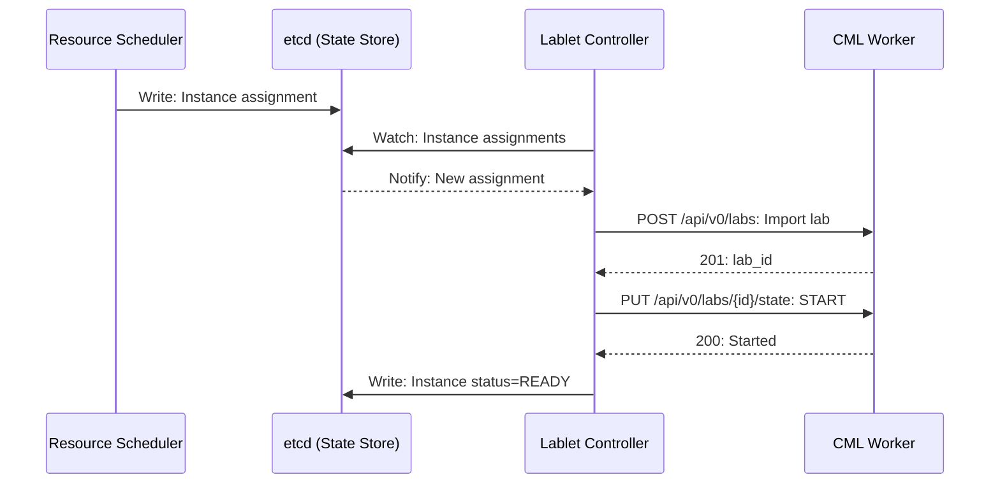
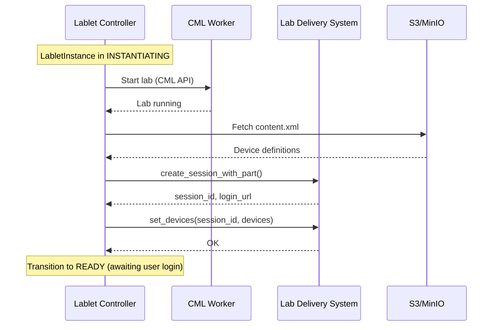
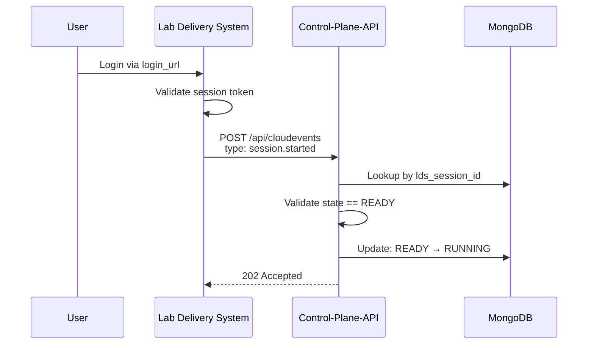
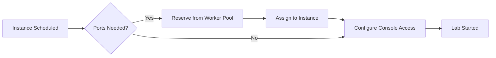
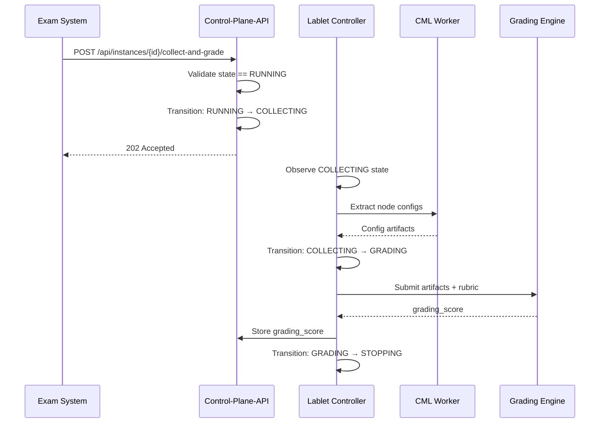

# Lablet Controller Guide

!!! warning "Documentation In Progress"
    This service guide is a placeholder. Full documentation is being developed.

## Overview

The Lablet Controller is a Kubernetes-style controller that manages the lifecycle of LabletInstances on CML Workers. It handles lab import, startup, collection, and teardown operations.

**Key Concept**: A LabletInstance is a **composite resource** consisting of:

- **CML Lab**: Infrastructure running on a CML worker (managed via CML API)
- **LabSession**: User-facing session in LDS (managed via LabDeliverySPI)

Both components must be provisioned for a LabletInstance to be considered fully operational.

## Architecture

See [Lablet Controller Architecture](../architecture/components/lablet-controller/index.md) for detailed design.

## Core Responsibilities

| Responsibility | Description |
|----------------|-------------|
| **Lab Lifecycle** | Import, start, stop, wipe, delete labs on workers |
| **LDS Integration** | Provision LabSession in Lab Delivery System |
| **Port Allocation** | Assign unique ports for console access |
| **State Reconciliation** | Align actual lab state with desired state |
| **Collection Trigger** | Initiate lab artifact collection |
| **HA Coordination** | Leader election for single active controller |

!!! warning "API Boundaries"
    - **CML Labs API**: Labs, nodes, links, interfaces (✅ lablet-controller)
    - **CML System API**: System info, stats, licensing (❌ worker-controller only)
    - **LDS API**: Session provisioning, device access (✅ lablet-controller)

## Key Flows

### Lab Provisioning Flow



!!! info "READY State"
    The lablet-controller transitions to `READY` (not `RUNNING`) after provisioning.
    `RUNNING` is triggered by LDS CloudEvent when the user logs in.

### LDS Session Provisioning Flow



### User Login Flow (CloudEvent)



!!! note "Event-Driven Transition"
    The `READY → RUNNING` transition is event-driven via CloudEvents from LDS.
    This is handled by **control-plane-api**, not lablet-controller.

### Port Allocation



!!! note "Port Range"
    Each worker has a dedicated port range (2000-9999). Lablet Controller manages allocation within this range per worker.

## API Endpoints

!!! note "Internal Service"
    The Lablet Controller primarily operates via etcd watches. Limited REST API for health and status.

| Method | Endpoint | Description |
|--------|----------|-------------|
| `GET` | `/health` | Health check |
| `GET` | `/ready` | Readiness check |
| `GET` | `/metrics` | Prometheus metrics |

## Configuration

Key environment variables:

| Variable | Description | Default |
|----------|-------------|---------|
| `CONTROLLER_ENABLED` | Enable controller | `true` |
| `ETCD_ENDPOINTS` | etcd cluster endpoints | `http://etcd:2379` |
| `CML_API_TIMEOUT` | CML API timeout (seconds) | `60` |
| `LAB_IMPORT_TIMEOUT` | Lab import timeout (seconds) | `300` |
| `LDS_API_URL` | Lab Delivery System API URL | `http://localhost:8081` |
| `LDS_API_TIMEOUT` | LDS API timeout (seconds) | `30` |
| `S3_ENDPOINT` | S3/MinIO endpoint for content | `http://localhost:9000` |

## CML Labs API Integration

The Lablet Controller uses these CML endpoints:

| Endpoint | Purpose | Auth Required |
|----------|---------|---------------|
| `/api/v0/labs` | List/create labs | Yes |
| `/api/v0/labs/{id}` | Get/delete lab | Yes |
| `/api/v0/labs/{id}/state` | Start/stop lab | Yes |
| `/api/v0/labs/{id}/nodes` | Node management | Yes |
| `/api/v0/labs/{id}/nodes/{node}/console_key` | Console access | Yes |
| `/api/v0/labs/{id}/download` | Export lab YAML | Yes |

!!! danger "API Boundary"
    Do NOT call `/api/v0/system_*` from Lablet Controller.

## LDS Integration

The Lablet Controller integrates with the Lab Delivery System (LDS) to provision user-facing sessions. See [ADR-018 LDS Integration](../architecture/adr/ADR-018-lds-integration.md) for architectural decision.

### LabDeliverySPI

The `LabDeliverySPI` abstraction provides:

| Method | Purpose |
|--------|---------|
| `create_session_with_part()` | Create LDS session with content |
| `set_devices()` | Provision device access credentials |
| `get_session_info()` | Get session state and login URL |
| `get_login_url()` | Get user login URL |
| `archive_session()` | Archive session on termination |
| `refresh_content()` | Refresh content from S3 bucket |

### Device Mapping

Device access info is derived from:

1. **content.xml** - Device labels and definitions
2. **cml.yaml** - Node topology with `device_label` annotations
3. **Port Allocation** - Assigned external ports
4. **DeviceAccessInfo** - Final payload sent to LDS

```python
@dataclass
class DeviceAccessInfo:
    name: str           # Device label
    protocol: str       # ssh, telnet, https
    host: str           # Worker hostname
    port: int           # Allocated port
    uri: str | None     # Optional URI
    username: str       # Device credentials
    password: str       # Device credentials
```

### Content Refresh

When a LabletDefinition is versioned:

1. Content updated in S3 bucket
2. LCM API triggers refresh
3. Lablet Controller calls `refresh_content(form_qualified_name)`
4. LDS refreshes content from S3

See [FR-2.1.6](../specs/lablet-resource-manager-requirements.md#fr-216-lds-content-synchronization) for requirements.

## Collect and Grade

When the user completes the lab, external systems trigger the `CollectAndGradeCommand`:



See [FR-2.2.7](../specs/lablet-resource-manager-requirements.md#fr-227-collect-and-grade-command) for requirements.

## Related Documentation

- [Lablet Controller Architecture](../architecture/components/lablet-controller/index.md)
- [ADR-018 LDS Integration](../architecture/adr/ADR-018-lds-integration.md)
- [FR-2.2.5 LabSession Provisioning](../specs/lablet-resource-manager-requirements.md#fr-225-labsession-provisioning)
- [FR-2.2.6 CloudEvent Handling](../specs/lablet-resource-manager-requirements.md#fr-226-lds-cloudevent-handling)
- [FR-2.2.7 Collect and Grade](../specs/lablet-resource-manager-requirements.md#fr-227-collect-and-grade-command)
- [ADR-017 Lab Operations via Lablet Controller](../architecture/adr/ADR-017-lab-operations-via-lablet-controller.md)
- [Worker Controller Guide](worker-controller-guide.md) - For CML System API
