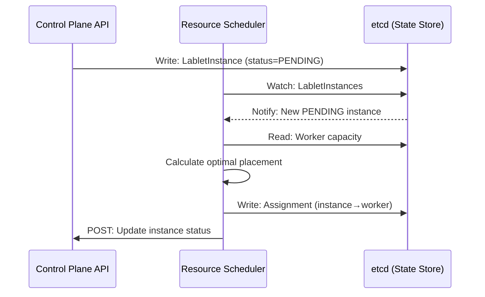

# Resource Scheduler Guide

!!! warning "Documentation In Progress"
    This service guide is a placeholder. Full documentation is being developed.

## Overview

The Resource Scheduler is responsible for intelligent placement of LabletInstances on available CML Workers. It implements scheduling algorithms that consider resource requirements, license affinity, and time-based reservations.

## Architecture

See [Resource Scheduler Architecture](../architecture/components/resource-scheduler/index.md) for detailed design.

## Core Responsibilities

| Responsibility | Description |
|----------------|-------------|
| **Scheduling Decisions** | Determine optimal worker placement for LabletInstances |
| **Timeslot Management** | Handle time-windowed reservations |
| **Capacity Tracking** | Monitor available resources per worker (via etcd) |
| **HA Coordination** | Leader election for single active scheduler |

## Key Flows

### Instance Scheduling Flow

## API Endpoints

!!! note "Internal Service"
    The Resource Scheduler primarily operates via etcd watches. Limited REST API for health and status.

| Method | Endpoint | Description |
|--------|----------|-------------|
| `GET` | `/health` | Health check |
| `GET` | `/ready` | Readiness check |
| `GET` | `/metrics` | Prometheus metrics |

## Configuration

Key environment variables:

| Variable | Description | Default |
|----------|-------------|---------|
| `SCHEDULER_ENABLED` | Enable scheduling | `true` |
| `SCHEDULER_LEAD_TIME_MINUTES` | Advance scheduling window | `35` |
| `ETCD_ENDPOINTS` | etcd cluster endpoints | `http://etcd:2379` |

## Related Documentation

- [Architecture: Resource Scheduler](../architecture/components/resource-scheduler/index.md)
- [ADR-002: Separate Resource Scheduler Service](../architecture/adr/ADR-002-separate-resource-scheduler-service.md)
- [ADR-006: Resource Scheduler HA Coordination](../architecture/adr/ADR-006-resource-scheduler-ha-coordination.md)
