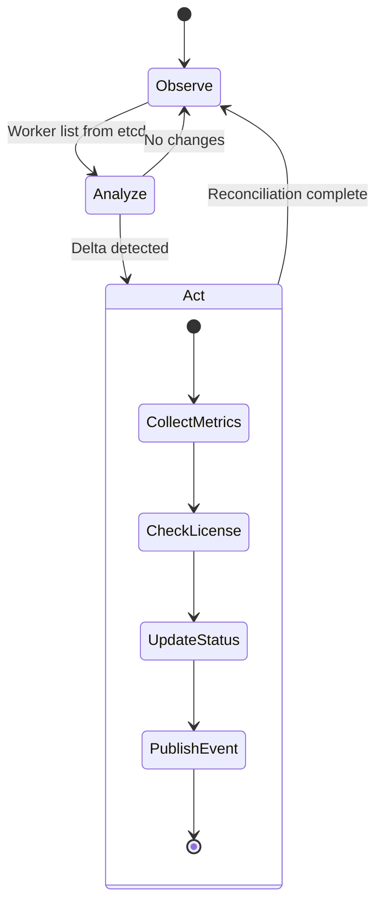

# Worker Controller Guide

!!! warning "Documentation In Progress"
    This service guide is a placeholder. Full documentation is being developed.

## Overview

The Worker Controller is a Kubernetes-style controller that observes CML Worker instances and reconciles their state. It is responsible for metrics collection, system health monitoring, and license verification.

## Architecture

See [Worker Controller Architecture](../architecture/components/worker-controller/index.md) for detailed design.

## Core Responsibilities

| Responsibility | Description |
|----------------|-------------|
| **Worker Observation** | Monitor worker health and status |
| **Metrics Collection** | Gather CPU, memory, storage utilization |
| **License Verification** | Check CML license status |
| **Idle Detection** | Identify workers with no active labs |
| **HA Coordination** | Leader election for single active controller |

!!! warning "CML API Scope"
    Worker Controller uses **CML System API ONLY** (system_information, system_stats).
    Lab-level operations are handled by [Lablet Controller](lablet-controller-guide.md).

## Key Flows

### Worker Reconciliation Loop

## API Endpoints

!!! note "Internal Service"
    The Worker Controller primarily operates via etcd watches. Limited REST API for health and status.

| Method | Endpoint | Description |
|--------|----------|-------------|
| `GET` | `/health` | Health check |
| `GET` | `/ready` | Readiness check |
| `GET` | `/metrics` | Prometheus metrics |

## Configuration

Key environment variables:

| Variable | Description | Default |
|----------|-------------|---------|
| `CONTROLLER_ENABLED` | Enable controller | `true` |
| `METRICS_POLL_INTERVAL` | Metrics collection interval (seconds) | `300` |
| `ETCD_ENDPOINTS` | etcd cluster endpoints | `http://etcd:2379` |
| `CML_API_TIMEOUT` | CML API timeout (seconds) | `30` |

## CML System API Integration

The Worker Controller uses these CML endpoints:

| Endpoint | Purpose | Auth Required |
|----------|---------|---------------|
| `/api/v0/system_information` | System info, version | No |
| `/api/v0/system_stats` | Resource utilization | Yes |
| `/api/v0/licensing` | License status | Yes |

!!! danger "API Boundary"
    Do NOT call `/api/v0/labs/*` from Worker Controller.
    Use Lablet Controller for lab operations.

## Related Documentation

- [Architecture: Worker Controller](../architecture/components/worker-controller/index.md)
- [ADR-016: License Operations via Worker Controller](../architecture/adr/ADR-016-license-operations-via-worker-controller.md)
- [ADR-014: Worker Orphan Detection](../architecture/adr/ADR-014-worker-orphan-detection.md)
